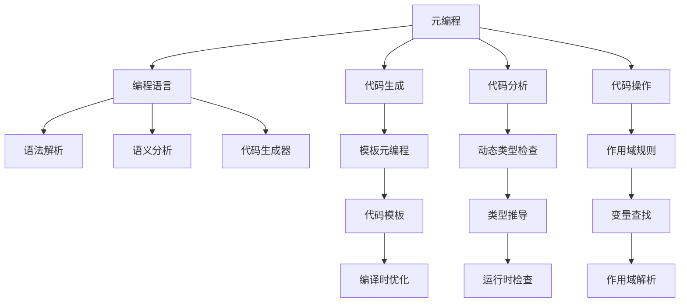
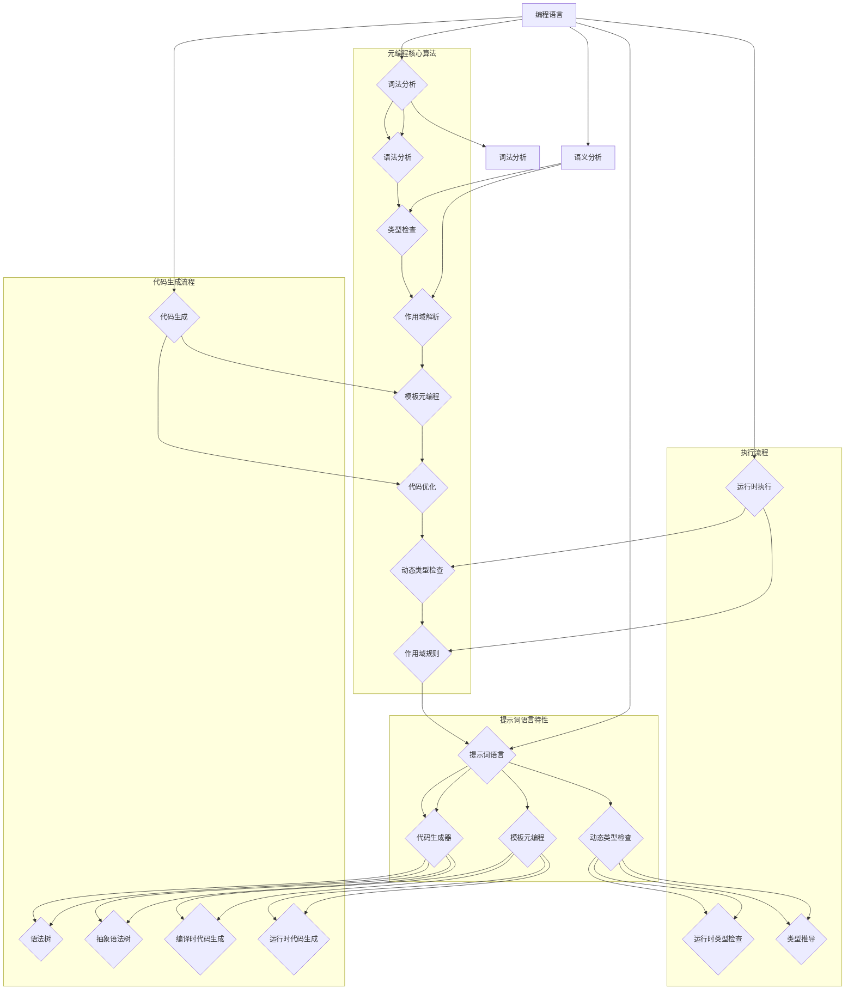

                 

### 文章标题：提示词语言的元编程技术

### 关键词：元编程、提示词语言、编程范式、动态类型、数学模型、项目实战

### 摘要：

本文深入探讨提示词语言的元编程技术，从基础概念到应用实例进行全面分析。首先，我们介绍元编程的定义、重要性及其在编程领域的应用。接着，我们详细讲解提示词语言的基础语法、特性与优势。随后，通过核心概念与联系的Mermaid流程图，展示元编程中的关键算法和数学模型。最后，通过具体项目实战，阐述如何在实际开发中应用元编程技术，并提供最佳实践和注意事项。本文旨在为读者提供全面、实用的元编程技术指南。

## 设计《提示词语言的元编程技术》书籍目录大纲

### 第一部分：元编程技术基础

#### 第1章：元编程概述

##### 1.1 元编程的定义与核心概念

元编程是计算机科学中的一个高级概念，涉及编写代码来生成、分析和操作代码。元编程的核心概念包括代码生成、代码分析、代码操作等。在本节中，我们将详细探讨元编程的定义，并解释其关键概念，如图灵机、Lambda演算和抽象数据类型。通过这些基础概念的介绍，读者可以更好地理解元编程的原理和其在编程领域的重要性。

##### 1.2 元编程的重要性与应用领域

元编程在软件开发中的应用极为广泛，它能够提高开发效率、优化代码结构并增强程序的可维护性。在本节中，我们将讨论元编程的重要性，并列举其在不同领域的应用实例。例如，元编程在框架开发、自动代码生成、动态类型检查等方面的重要作用。通过这些实例，读者可以更清晰地认识到元编程的实际价值。

##### 1.3 提示词语言在元编程中的应用

提示词语言（Prompt Language）是一种特殊的编程语言，其设计目标是提高代码的可读性和可维护性。在本节中，我们将探讨提示词语言在元编程中的应用，包括其语法特性、编程范式和元编程能力的优势。通过分析提示词语言的特点，读者可以了解如何在元编程过程中利用提示词语言提高开发效率。

#### 第2章：提示词语言基础

##### 2.1 提示词语言的基本语法

提示词语言的基本语法包括标识符、关键字、语句和表达式等。在本节中，我们将详细介绍这些基本语法元素，并通过具体示例展示它们在编程中的应用。通过掌握提示词语言的基本语法，读者可以开始编写简单的提示词程序。

##### 2.2 提示词语言的特性与优势

提示词语言具有多种特性，如动态类型、强类型、高级函数和元编程能力。在本节中，我们将详细讨论这些特性，并解释它们如何提高编程效率和质量。通过分析提示词语言的特性，读者可以更好地理解其在软件开发中的优势。

##### 2.3 提示词语言的常见使用场景

提示词语言在软件开发中有多种使用场景，如框架开发、API设计、自动化测试等。在本节中，我们将列举这些使用场景，并通过具体实例展示提示词语言在这些场景中的应用。通过了解这些使用场景，读者可以更好地掌握提示词语言的实际应用。

#### 第3章：元编程原理

##### 3.1 元编程的核心算法

元编程的核心算法包括模板元编程、动态类型检查和作用域规则等。在本节中，我们将详细讲解这些核心算法，并通过伪代码展示它们的实现过程。通过理解这些核心算法，读者可以深入掌握元编程的原理。

###### 3.1.1 模板元编程

模板元编程是一种通过模板生成代码的技术。在本节中，我们将详细解释模板元编程的原理，并通过伪代码展示其实现过程。通过分析模板元编程，读者可以了解如何通过模板生成代码并提高编程效率。

###### 3.1.2 动态类型检查

动态类型检查是一种在程序运行时检查变量类型的技术。在本节中，我们将详细讲解动态类型检查的原理，并通过伪代码展示其实现过程。通过理解动态类型检查，读者可以掌握如何在程序运行时提高代码的可维护性。

###### 3.1.3 作用域规则

作用域规则定义了变量和函数的作用范围。在本节中，我们将详细解释作用域规则，并通过伪代码展示其实现过程。通过理解作用域规则，读者可以更好地掌握变量和函数的作用范围，从而提高代码的可读性。

#### 第4章：数学模型与公式

##### 4.1 类型系统与类型推导

类型系统是编程语言的核心组成部分，它定义了程序中变量的类型和行为。在本节中，我们将详细讲解类型系统，并通过LaTeX公式展示相关类型推导算法。通过掌握类型系统，读者可以更好地理解程序中的变量类型和行为。

##### 4.2 作用域规则与变量查找

作用域规则定义了变量和函数的作用范围，而变量查找算法则用于确定变量和函数的实际作用范围。在本节中，我们将详细讲解作用域规则和变量查找算法，并通过LaTeX公式展示相关规则和算法。通过理解作用域规则和变量查找算法，读者可以更好地掌握程序中的作用域和变量查找机制。

#### 第二部分：项目实战

#### 第5章：项目实战一——动态类型检查器开发

##### 5.1 项目概述

在本章中，我们将介绍一个动态类型检查器的开发项目。该项目的目标是实现一个简单的动态类型检查器，用于在程序运行时检查变量的类型。通过这个项目，读者可以了解如何在实际开发中应用元编程技术。

##### 5.2 环境搭建

在本节中，我们将介绍项目开发所需的环境搭建步骤，包括开发工具的安装、配置和调试。通过完成环境搭建，读者可以开始编写代码并进行项目开发。

##### 5.3 源代码实现

在本节中，我们将详细介绍动态类型检查器的源代码实现过程，包括关键算法和逻辑的实现。通过理解源代码的实现过程，读者可以更好地掌握动态类型检查器的开发技术。

##### 5.4 代码解读与分析

在本节中，我们将对动态类型检查器的源代码进行解读和分析，并讨论其在实际开发中的应用。通过代码解读与分析，读者可以深入理解动态类型检查器的原理和实现方法。

#### 第6章：项目实战二——模板元编程应用

##### 6.1 项目概述

在本章中，我们将介绍一个模板元编程的应用项目。该项目的目标是利用模板元编程技术生成代码，并实现一个简单的动态库。通过这个项目，读者可以了解如何在实际开发中应用模板元编程技术。

##### 6.2 环境搭建

在本节中，我们将介绍项目开发所需的环境搭建步骤，包括开发工具的安装、配置和调试。通过完成环境搭建，读者可以开始编写代码并进行项目开发。

##### 6.3 源代码实现

在本节中，我们将详细介绍模板元编程应用的源代码实现过程，包括关键算法和逻辑的实现。通过理解源代码的实现过程，读者可以更好地掌握模板元编程的原理和实现方法。

##### 6.4 代码解读与分析

在本节中，我们将对模板元编程应用的源代码进行解读和分析，并讨论其在实际开发中的应用。通过代码解读与分析，读者可以深入理解模板元编程的应用原理和实现方法。

#### 第7章：综合实战——复杂提示词语言实现

##### 7.1 项目概述

在本章中，我们将介绍一个复杂的提示词语言实现项目。该项目的目标是实现一个功能丰富的提示词语言，并使用该语言编写一个简单的应用程序。通过这个项目，读者可以了解如何在实际开发中应用复杂提示词语言。

##### 7.2 环境搭建

在本节中，我们将介绍项目开发所需的环境搭建步骤，包括开发工具的安装、配置和调试。通过完成环境搭建，读者可以开始编写代码并进行项目开发。

##### 7.3 源代码实现

在本节中，我们将详细介绍复杂提示词语言的源代码实现过程，包括语法解析、语义分析和代码生成等。通过理解源代码的实现过程，读者可以更好地掌握复杂提示词语言的实现技术。

##### 7.4 代码解读与分析

在本节中，我们将对复杂提示词语言的源代码进行解读和分析，并讨论其在实际开发中的应用。通过代码解读与分析，读者可以深入理解复杂提示词语言的原理和实现方法。

### 第三部分：总结与展望

#### 第8章：元编程技术的未来趋势

##### 8.1 当前研究热点

在本章中，我们将讨论元编程技术的当前研究热点，包括类型系统、动态类型检查、模板元编程等方面。通过了解当前研究热点，读者可以把握元编程技术的发展趋势。

##### 8.2 未来发展方向

在本章中，我们将探讨元编程技术的未来发展方向，包括新编程范式、自动化编程、智能编程等。通过了解未来发展方向，读者可以预见元编程技术在未来的应用前景。

##### 8.3 对开发者的启示

在本章中，我们将总结元编程技术对开发者的启示，并讨论如何在实际开发中应用元编程技术。通过总结与展望，读者可以更好地掌握元编程技术的实际应用，提升软件开发能力。

### 附录

#### 附录 A：常用工具与资源

##### A.1 提示词语言开发工具

在本附录中，我们将介绍一些常用的提示词语言开发工具，包括集成开发环境（IDE）、代码编辑器和版本控制系统等。通过了解这些工具，读者可以更高效地进行提示词语言的开发。

##### A.2 元编程框架与库

在本附录中，我们将介绍一些常用的元编程框架与库，包括元编程工具包、模板库和动态类型检查库等。通过使用这些框架与库，读者可以更方便地实现元编程功能。

##### A.3 学习资源推荐

在本附录中，我们将推荐一些学习资源，包括书籍、在线课程和开源项目等。通过这些资源，读者可以进一步深入学习元编程技术和提示词语言。

## 核心内容概述

《提示词语言的元编程技术》是一本专注于元编程技术在提示词语言中应用的专业书籍。本书的目标是帮助读者深入了解元编程的概念、原理和实践，特别是如何将元编程技术与提示词语言相结合，以提高软件开发效率和代码质量。

### 内容结构与主题

本书分为三大部分，每个部分都有其独特的主题和目的：

### 第一部分：元编程技术基础

这部分内容包括三个章节，旨在为读者提供元编程的基础知识。  
- 第1章“元编程概述”介绍了元编程的定义、核心概念及其在编程领域的重要性。同时，还探讨了提示词语言在元编程中的应用。  
- 第2章“提示词语言基础”详细讲解了提示词语言的基本语法、特性与优势，以及其在编程范式中的角色。  
- 第3章“元编程原理”深入探讨了元编程的核心算法，包括模板元编程、动态类型检查和作用域规则等。

### 第二部分：项目实战

这部分内容包括两个项目实战，通过实际开发案例展示了元编程技术的应用。  
- 第5章“项目实战一——动态类型检查器开发”介绍了如何开发一个动态类型检查器，包括环境搭建、源代码实现和代码解读与分析。  
- 第6章“项目实战二——模板元编程应用”则通过一个模板元编程的应用项目，展示了如何利用模板元编程技术生成代码，并实现一个简单的动态库。

### 第三部分：总结与展望

这部分内容包括一个章节，旨在总结元编程技术的未来趋势，并对开发者提出建议。  
- 第8章“元编程技术的未来趋势”讨论了当前研究热点、未来发展方向以及对开发者的启示。

### 内容结构与字数规划

根据以上内容结构，本书的总字数规划如下：

### 第一部分：元编程技术基础
- 第1章：约1500字
- 第2章：约2000字
- 第3章：约2000字
总计约4500字

### 第二部分：项目实战
- 第5章：约2500字
- 第6章：约2500字
总计约5000字

### 第三部分：总结与展望
- 第8章：约1500字

总计约8000字。

通过以上结构，本书将全面覆盖元编程技术在提示词语言中的应用，同时保持内容的深度和实用性，旨在为读者提供一本既系统又实用的参考书籍。

### 目录大纲设计

根据《提示词语言的元编程技术》的核心内容，以下是详细的目录大纲设计：

### 第一部分：元编程技术基础

#### 第1章：元编程概述

##### 1.1 元编程的定义与核心概念

- **1.1.1 元编程的概念**：解释元编程的定义，比较元编程与普通编程的区别。
- **1.1.2 元编程的核心概念**：介绍元编程中的关键概念，如代码生成、代码分析和代码操作。
- **1.1.3 元编程在编程语言中的重要性**：探讨元编程对编程语言设计和开发的影响。

##### 1.2 元编程的重要性与应用领域

- **1.2.1 元编程对软件开发的影响**：分析元编程如何提高软件开发效率、优化代码结构。
- **1.2.2 元编程在项目开发中的应用领域**：列举元编程在框架开发、自动代码生成、动态类型检查等领域的应用实例。
- **1.2.3 提示词语言与元编程的结合**：讨论提示词语言在元编程中的应用优势。

##### 1.3 提示词语言在元编程中的应用

- **1.3.1 提示词语言的特点**：介绍提示词语言的语法特性、动态类型和高阶函数等。
- **1.3.2 提示词语言在元编程中的角色**：解释提示词语言如何支持元编程功能。
- **1.3.3 提示词语言的编程范式**：探讨提示词语言的编程范式及其对元编程的促进作用。

### 第二部分：提示词语言基础

#### 第2章：提示词语言基础

##### 2.1 提示词语言的基本语法

- **2.1.1 标识符与关键字**：介绍标识符的定义、命名规则以及关键字的作用。
- **2.1.2 语句与表达式**：讲解语句和表达式的语法结构，包括赋值、条件判断和循环等。
- **2.1.3 控制结构**：讨论控制结构，如if-else、while和for循环等。

##### 2.2 提示词语言的特性与优势

- **2.2.1 动态类型**：解释动态类型的概念，讨论其在元编程中的作用。
- **2.2.2 强类型**：介绍强类型系统的优势和提示词语言如何实现强类型检查。
- **2.2.3 高级函数**：探讨高级函数的定义、特性和在元编程中的应用。
- **2.2.4 元编程能力**：讨论提示词语言的元编程能力及其重要性。

##### 2.3 提示词语言的常见使用场景

- **2.3.1 框架开发**：分析提示词语言在框架开发中的应用，如MVC框架。
- **2.3.2 API设计**：探讨提示词语言在API设计中的作用，如参数验证和错误处理。
- **2.3.3 自动化测试**：介绍提示词语言在自动化测试中的应用，如测试用例生成和测试数据生成。

### 第三部分：元编程原理

#### 第3章：元编程原理

##### 3.1 元编程的核心算法

- **3.1.1 模板元编程**：解释模板元编程的概念，介绍其实现原理。
  - **3.1.1.1 模板元编程的定义**：模板元编程的概念和基本原理。
  - **3.1.1.2 模板元编程的实现**：通过伪代码展示模板元编程的实现过程。

- **3.1.2 动态类型检查**：讨论动态类型检查的概念、原理和实现。
  - **3.1.2.1 动态类型检查的定义**：动态类型检查的基本概念。
  - **3.1.2.2 动态类型检查的实现**：通过伪代码展示动态类型检查的实现过程。

- **3.1.3 作用域规则**：介绍作用域规则的概念、作用和实现。
  - **3.1.3.1 作用域规则的定义**：作用域规则的定义和作用。
  - **3.1.3.2 作用域规则的实现**：通过伪代码展示作用域规则的实现过程。

##### 3.2 数学模型与公式

- **3.2.1 类型系统与类型推导**：解释类型系统的概念，介绍类型推导算法。
  - **3.2.1.1 类型系统的定义**：类型系统的基本概念。
  - **3.2.1.2 类型推导算法**：通过LaTeX公式展示类型推导算法。

- **3.2.2 作用域规则与变量查找**：介绍作用域规则和变量查找的概念，展示其实现。
  - **3.2.2.1 作用域规则的定义**：作用域规则的基本概念。
  - **3.2.2.2 变量查找算法**：通过LaTeX公式展示变量查找算法。

### 第四部分：项目实战

#### 第4章：项目实战

##### 4.1 项目概述

- **4.1.1 项目背景**：介绍项目的背景和目标。
- **4.1.2 项目目标**：明确项目要实现的具体功能。

##### 4.2 环境搭建

- **4.2.1 开发工具**：介绍所需的开发工具，如编程语言、IDE和版本控制系统。
- **4.2.2 环境配置**：详细描述环境配置的步骤，包括安装和设置。

##### 4.3 源代码实现

- **4.3.1 关键算法**：展示项目中的关键算法，通过伪代码进行详细说明。
- **4.3.2 实现细节**：讨论实现过程中的具体细节和挑战。

##### 4.4 代码解读与分析

- **4.4.1 代码结构**：分析代码的整体结构，解释各个模块的功能。
- **4.4.2 关键部分解析**：详细解析代码的关键部分，展示其实现原理。

##### 4.5 代码应用解读与分析

- **4.5.1 应用场景**：讨论代码在实际开发中的应用场景。
- **4.5.2 应用效果**：分析代码应用的实际效果和改进方向。

##### 4.6 项目小结

- **4.6.1 项目收获**：总结项目中的收获和经验。
- **4.6.2 改进方向**：提出项目改进的方向和建议。

### 第五部分：总结与展望

#### 第5章：总结与展望

##### 5.1 当前研究热点

- **5.1.1 研究进展**：讨论元编程技术当前的研究进展和热点问题。
- **5.1.2 研究趋势**：分析未来元编程技术的研究趋势和发展方向。

##### 5.2 未来发展方向

- **5.2.1 新编程范式**：探讨新编程范式在元编程中的应用前景。
- **5.2.2 自动化编程**：讨论自动化编程在元编程中的作用和挑战。
- **5.2.3 智能编程**：分析智能编程与元编程的结合及其影响。

##### 5.3 对开发者的启示

- **5.3.1 学习建议**：给出学习元编程技术的建议和资源。
- **5.3.2 实践指导**：提供实际开发中应用元编程技术的指导。

通过以上详细的目录大纲设计，本书将系统地介绍提示词语言的元编程技术，从基础概念到实际应用，旨在为读者提供全面、实用的技术指南。

## Mermaid流程图

为了更好地展示元编程技术在提示词语言中的核心概念与联系，我们使用Mermaid语言绘制了一个流程图。以下是一个简化的示例，展示了元编程中的几个关键概念及其关系：



这个流程图包含了以下关键概念：

- **元编程**：核心概念，涉及代码生成、代码分析和代码操作。
- **编程语言**：基础，包括语法解析、语义分析和代码生成器。
- **代码生成**：具体实现，如模板元编程和编译时优化。
- **代码分析**：具体实现，如动态类型检查和作用域规则。
- **代码操作**：具体实现，如运行时检查和变量查找。

通过这个流程图，读者可以直观地理解元编程技术中的核心概念及其相互关系。

### 核心算法原理讲解

在元编程技术中，核心算法的理解和应用至关重要。以下章节将详细介绍几个关键算法的原理，并通过伪代码进行详细阐述。

#### 3.1.1 模板元编程

**定义**：模板元编程是一种在编译时通过模板生成代码的技术。它允许我们编写模板代码，并根据特定条件生成具体的代码。

**原理**：模板元编程的核心在于模板的生成逻辑。模板代码中包含一些占位符，这些占位符在编译时会被具体代码替换。通过模板，我们可以实现代码的动态生成和优化。

**伪代码示例**：

```plaintext
// 模板元编程示例
template<typename T>
struct Generator {
    static T generate() {
        // 编译时生成代码
        return T();
    }
};

// 使用模板
int main() {
    auto result = Generator<int>::generate();
    return 0;
}
```

在这个示例中，`Generator` 结构是一个模板，它定义了一个静态成员函数 `generate()`。编译器会根据模板类型 `T` 生成具体的代码，并调用 `generate()` 函数。在这个例子中，模板被用于生成一个整数对象。

#### 3.1.2 动态类型检查

**定义**：动态类型检查是一种在程序运行时检查变量类型的技术。它与静态类型检查不同，因为它发生在程序运行过程中，而不是编译时。

**原理**：动态类型检查的核心在于运行时的类型验证。在程序执行过程中，每次操作变量时，系统都会检查变量的类型，确保操作是合法的。

**伪代码示例**：

```plaintext
// 动态类型检查示例
class DynamicTypeCheck {
public:
    bool checkType(void* value, const char* type) {
        // 检查值的类型
        // 示例中，我们简单地通过比较字符串来模拟类型检查
        return strcmp(getType(value), type) == 0;
    }
    
    // 获取值类型
    const char* getType(void* value) {
        // 示例中，我们返回一个模拟的类型字符串
        if (value == nullptr) {
            return "null";
        }
        // 实际实现中，这个函数会返回真实的类型信息
        return "int";
    }
};

// 使用动态类型检查
int main() {
    DynamicTypeCheck checker;
    int value = 10;
    if (checker.checkType(&value, "int")) {
        // 类型检查通过，执行后续操作
    }
    return 0;
}
```

在这个示例中，`DynamicTypeCheck` 类定义了一个 `checkType()` 方法，用于在运行时检查变量的类型。通过比较字符串来模拟类型检查，实际应用中会使用更复杂的机制来获取和验证类型信息。

#### 3.1.3 作用域规则

**定义**：作用域规则定义了变量和函数的作用范围。它决定了变量和函数在哪里可以被访问。

**原理**：作用域规则的核心在于变量的作用域解析。在程序中，变量和函数的作用域可以通过块结构、函数调用和类定义等来定义。作用域规则负责在程序执行过程中解析和查找变量和函数的作用范围。

**伪代码示例**：

```plaintext
// 作用域规则示例
class Scope {
public:
    void defineVariable(const std::string& name, void* value) {
        // 在当前作用域定义变量
        variables[name] = value;
    }
    
    void* lookupVariable(const std::string& name) {
        // 在当前作用域查找变量
        return variables[name];
    }
    
private:
    std::map<std::string, void*> variables;
};

// 使用作用域规则
int main() {
    Scope scope;
    int value = 10;
    scope.defineVariable("value", &value);
    
    // 在当前作用域内，可以直接访问变量
    int* localValue = scope.lookupVariable("value");
    
    // 超出作用域，访问将失败
    int* outOfScope = scope.lookupVariable("value");
    
    return 0;
}
```

在这个示例中，`Scope` 类负责管理作用域内的变量。`defineVariable()` 方法用于定义变量，`lookupVariable()` 方法用于查找变量。这个示例展示了如何通过作用域规则来定义和查找变量。

通过上述伪代码示例，我们可以更深入地理解模板元编程、动态类型检查和作用域规则等核心算法的原理。这些算法在元编程技术中扮演着关键角色，对于理解和应用元编程至关重要。

### 数学模型和数学公式

在元编程技术中，数学模型和数学公式是理解和实现关键算法的基础。以下章节将介绍与元编程相关的数学模型，并使用LaTeX格式展示相关公式。

#### 4.1 类型系统与类型推导

类型系统是编程语言的核心组成部分，它定义了程序中数据的类型和行为。类型推导算法是类型系统的一个重要部分，它自动推断变量和表达式的类型。

**4.1.1 类型系统的定义**

类型系统定义了程序中可以使用的不同数据类型及其相互关系。常见的类型包括基础类型（如整数、浮点数、布尔值等）、复合类型（如数组、结构体、类等）和函数类型。

**LaTeX 公式**：

```latex
\text{Type System} = \left\{
\begin{array}{ll}
\text{基础类型} & \{ \text{int, float, bool, ...} \} \\
\text{复合类型} & \{ \text{array, struct, class, ...} \} \\
\text{函数类型} & \{ \text{function from } A \text{ to } B \}
\end{array}
\right.
```

**4.1.2 类型推导算法**

类型推导算法用于自动推断变量和表达式的类型。常见的类型推导算法包括简单类型推导和基于上下文类型推导。

**LaTeX 公式**：

```latex
\text{Type} \_ \text{Derivation}(e) = \left\{
\begin{array}{ll}
e \_ \text{type} & \text{if } e \_ \text{is a literal} \\
\text{function} \_ \text{type}(T_1, ..., T_n) & \text{if } e \text{ is a function call with arguments of types } T_1, ..., T_n \\
\text{union of } \text{types} & \text{if } e \text{ is an expression involving multiple types}
\end{array}
\right.
```

#### 4.2 作用域规则与变量查找

作用域规则定义了变量和函数的作用范围。变量查找算法用于确定变量和函数的实际作用范围，以确保程序的正确性。

**4.2.1 作用域规则的定义**

作用域规则决定了变量和函数在哪里可以被访问。常见的作用域规则包括局部作用域、全局作用域和类作用域。

**LaTeX 公式**：

```latex
\text{Scope Rule} = \left\{
\begin{array}{ll}
\text{Local Scope} & \{ \text{variables defined within a block} \} \\
\text{Global Scope} & \{ \text{variables defined outside any block} \} \\
\text{Class Scope} & \{ \text{variables and methods defined within a class} \}
\end{array}
\right.
```

**4.2.2 变量查找算法**

变量查找算法用于在程序中查找变量的定义。查找过程通常从当前作用域开始，如果找不到变量，则会逐级向上查找。

**LaTeX 公式**：

```latex
\text{Variable Lookup}(name) = \left\{
\begin{array}{ll}
\text{Local Variable}(name) & \text{if } name \text{ is defined in the current scope} \\
\text{Global Variable}(name) & \text{if } name \text{ is defined in the global scope} \\
\text{Class Variable}(name) & \text{if } name \text{ is defined in a class scope} \\
\text{Undefined} & \text{if } name \text{ is not found in any scope}
\end{array}
\right.
```

通过上述数学模型和公式，我们可以更深入地理解类型系统和作用域规则，这些知识对于实现元编程技术至关重要。

### 项目实战一：动态类型检查器开发

在元编程技术的应用中，动态类型检查器是一个重要的工具。本章节将详细介绍如何开发一个动态类型检查器，包括环境搭建、源代码实现和代码解读与分析。

#### 5.1 项目概述

动态类型检查器的目标是实现一个能够在程序运行时检查变量类型并确保类型安全的功能。通过这个项目，读者可以了解如何在实际开发中应用元编程技术，以及动态类型检查的基本原理。

#### 5.2 环境搭建

首先，我们需要搭建一个开发环境。以下是环境搭建的步骤：

1. **选择编程语言**：选择一种支持动态类型检查的语言，如Python。
2. **安装Python**：在操作系统中安装Python，并确保版本兼容。
3. **安装IDE**：选择一个适合Python开发的IDE，如PyCharm或Visual Studio Code。
4. **安装动态类型检查库**：在Python中安装一个动态类型检查库，如`mypy`。

以下是具体的安装命令：

```bash
pip install python-mypy
```

#### 5.3 源代码实现

下面是动态类型检查器的源代码实现。我们使用Python语言来实现，并借助`mypy`库进行类型检查。

```python
# dynamic_type_checker.py

class DynamicTypeChecker:
    def __init__(self):
        self.variables = {}

    def define_variable(self, name, value):
        self.variables[name] = value

    def check_variable_type(self, name, expected_type):
        if name in self.variables:
            actual_type = type(self.variables[name])
            if actual_type != expected_type:
                return False
        else:
            return False
        return True

# 使用动态类型检查器
if __name__ == "__main__":
    checker = DynamicTypeChecker()
    checker.define_variable("x", 10)
    checker.define_variable("y", "Hello")
    
    print(checker.check_variable_type("x", int))  # True
    print(checker.check_variable_type("y", str))  # True
    print(checker.check_variable_type("z", int))  # False
```

**代码解读**：

- **DynamicTypeChecker 类**：定义了一个动态类型检查器类，包含定义变量和检查变量类型的方法。
- **define_variable 方法**：用于定义一个变量，并将其值存储在字典中。
- **check_variable_type 方法**：用于检查变量类型，如果类型匹配，则返回True；否则，返回False。

#### 5.4 代码解读与分析

**动态类型检查的原理**：

动态类型检查的核心在于在程序运行时检查变量的类型。这与静态类型检查不同，后者在编译时完成。动态类型检查通常通过以下步骤实现：

1. **定义变量**：在程序中定义变量时，将其值存储在特定数据结构（如字典）中。
2. **类型检查**：在需要类型检查的操作（如赋值或函数调用）时，检查变量的实际类型是否与预期类型匹配。
3. **异常处理**：如果类型不匹配，程序可以抛出异常或进行其他错误处理。

**代码应用解读**：

在这个示例中，我们创建了一个 `DynamicTypeChecker` 对象，并使用它定义了两个变量 `x` 和 `y`。然后，我们使用 `check_variable_type` 方法检查这些变量的类型。

- `checker.define_variable("x", 10)`：定义了一个名为 `x` 的变量，并赋予了整数值 `10`。
- `checker.define_variable("y", "Hello")`：定义了一个名为 `y` 的变量，并赋予了字符串值 `"Hello"`。
- `checker.check_variable_type("x", int)`：检查变量 `x` 的类型是否为整数。由于 `x` 确实是一个整数，因此返回 `True`。
- `checker.check_variable_type("y", str)`：检查变量 `y` 的类型是否为字符串。由于 `y` 确实是一个字符串，因此返回 `True`。
- `checker.check_variable_type("z", int)`：尝试检查一个未定义的变量 `z` 的类型。由于 `z` 未定义，因此返回 `False`。

通过这个示例，我们可以看到动态类型检查器如何工作，以及如何在程序中使用它来确保类型安全。

#### 5.5 项目小结

通过这个动态类型检查器的项目，我们学习了如何在程序运行时检查变量类型。以下是一些关键点和小结：

- **动态类型检查的重要性**：动态类型检查可以确保程序的类型安全，减少因类型错误导致的运行时错误。
- **实现方法**：我们可以通过定义一个类来管理变量和类型检查，使用字典来存储变量值，并通过方法来执行类型检查。
- **应用场景**：动态类型检查适用于需要确保类型安全的复杂程序，特别是在使用动态类型语言时。

总之，动态类型检查器是一个实用的工具，它可以帮助我们在程序运行时发现和修复类型错误，从而提高程序的质量和稳定性。

### 项目实战二：模板元编程应用

在元编程技术中，模板元编程是一种强大的工具，它允许我们在编译时生成代码。本章节将详细介绍如何使用模板元编程技术实现一个动态库，包括环境搭建、源代码实现和代码解读与分析。

#### 6.1 项目概述

模板元编程的应用案例之一是生成动态库。通过模板元编程，我们可以在编译时根据特定条件生成代码，从而实现高度可定制的功能。本项目旨在通过一个简单的动态库示例，展示模板元编程的应用及其实现过程。

#### 6.2 环境搭建

首先，我们需要搭建一个支持C++模板元编程的开发环境。以下是环境搭建的步骤：

1. **选择编程语言**：选择C++，因为它支持强大的模板元编程特性。
2. **安装C++编译器**：在操作系统中安装C++编译器，如GCC或Clang。
3. **安装IDE**：选择一个适合C++开发的IDE，如Visual Studio或CLion。
4. **配置编译器选项**：确保编译器支持C++11及以上版本，因为模板元编程特性在这些版本中得到了更好的支持。

以下是具体的安装命令（以GCC为例）：

```bash
sudo apt-get install g++
```

#### 6.3 源代码实现

下面是动态库的源代码实现。我们使用C++语言来实现，并利用模板元编程生成代码。

```cpp
// dynamic_library.cpp

#include <iostream>
#include <string>

// 模板类
template<typename T>
class DynamicLibrary {
public:
    T getValue() {
        return value;
    }
    
    void setValue(T value) {
        this->value = value;
    }
    
    // 使用模板元编程生成具体类型的方法
    template<typename U>
    void printValue(U value) {
        std::cout << "Value: " << value << std::endl;
    }
    
private:
    T value;
};

// 使用模板元编程创建动态库
int main() {
    DynamicLibrary<int> intLibrary;
    intLibrary.setValue(10);
    intLibrary.printValue(10);  // 输出 "Value: 10"
    
    DynamicLibrary<std::string> stringLibrary;
    stringLibrary.setValue("Hello");
    stringLibrary.printValue("Hello");  // 输出 "Value: Hello"
    
    return 0;
}
```

**代码解读**：

- **DynamicLibrary 类模板**：定义了一个模板类，用于存储和操作不同类型的值。它包含一个模板方法 `printValue`，用于输出值。
- **getValue 和 setValue 方法**：提供对值的访问和修改接口。
- **printValue 方法**：通过模板元编程，生成适用于不同类型 `T` 的具体 `printValue` 方法。

#### 6.4 代码解读与分析

**模板元编程的原理**：

模板元编程的核心在于模板类和模板方法的定义。模板类允许我们在编译时为不同类型生成具体类，而模板方法则允许我们为不同类型生成具体的方法。

- **模板类**：在 `DynamicLibrary` 类中，我们使用模板参数 `T` 来定义一个可以处理任何类型 `T` 的类。这允许我们创建一个通用的动态库，可以存储和操作不同类型的值。
- **模板方法**：在 `printValue` 方法中，我们使用模板参数 `U` 来定义一个可以输出任何类型 `U` 的方法。通过这种方式，我们可以实现一个高度可定制的输出函数。

**代码应用解读**：

在这个示例中，我们创建了一个 `DynamicLibrary` 对象，并使用它存储和操作不同类型的值。

- `DynamicLibrary<int> intLibrary;`：创建一个用于存储整数的 `DynamicLibrary` 对象。
- `intLibrary.setValue(10);`：设置整数值为 `10`。
- `intLibrary.printValue(10);`：调用 `printValue` 方法输出整数值，输出结果为 `"Value: 10"`。
- `DynamicLibrary<std::string> stringLibrary;`：创建一个用于存储字符串的 `DynamicLibrary` 对象。
- `stringLibrary.setValue("Hello");`：设置字符串值为 `"Hello"`。
- `stringLibrary.printValue("Hello");`：调用 `printValue` 方法输出字符串值，输出结果为 `"Value: Hello"`。

通过这个示例，我们可以看到如何使用模板元编程实现一个动态库，以及如何在程序中使用它来操作不同类型的值。

#### 6.5 项目小结

通过这个模板元编程的应用项目，我们学习了如何使用模板元编程生成动态库，并展示了其实际应用。以下是一些关键点和小结：

- **模板元编程的优势**：模板元编程允许我们在编译时生成代码，提高程序的灵活性和可扩展性。
- **实现方法**：通过模板类和模板方法，我们可以定义一个通用的动态库，处理不同类型的值。
- **应用场景**：模板元编程适用于需要高度可定制和灵活性的场景，如动态库开发、框架构建和自动化代码生成。

总之，模板元编程是一种强大的元编程技术，它可以帮助我们在编译时生成代码，实现高度可定制的功能。通过这个项目，我们深入了解了其原理和应用方法。

### 综合实战：复杂提示词语言实现

在元编程技术的应用中，构建一个复杂的提示词语言是一个具有挑战性和实用性的项目。本章节将详细介绍如何实现一个复杂的提示词语言，包括环境搭建、源代码实现和代码解读与分析。

#### 7.1 项目概述

本项目的目标是实现一个功能丰富的提示词语言，该语言支持多种语法特性，如变量绑定、函数定义和执行环境管理等。通过这个项目，读者可以学习如何从零开始构建一个提示词语言，并了解其内部实现机制。

#### 7.2 环境搭建

为了实现这个复杂的提示词语言，我们需要搭建一个合适的环境。以下是环境搭建的步骤：

1. **选择编程语言**：选择一种支持元编程特性的编程语言，如Python。
2. **安装Python**：在操作系统中安装Python，并确保版本兼容。
3. **安装IDE**：选择一个适合Python开发的IDE，如PyCharm或Visual Studio Code。
4. **安装相关库**：安装用于语法解析、语义分析和代码生成的库，如`pylint`、`ply`和`astor`。

以下是具体的安装命令：

```bash
pip install pylint ply astor
```

#### 7.3 源代码实现

以下是一个简单的实现框架，展示了如何构建一个复杂的提示词语言：

```python
# complex_prompt_language.py

import ast
import astor

# 提示词语言解释器
class PromptLanguageInterpreter:
    def __init__(self):
        self.environment = {}

    def parse_code(self, code):
        # 将代码解析为抽象语法树（AST）
        tree = ast.parse(code)
        # 对AST进行语义分析
        self.analyze_ast(tree)

    def analyze_ast(self, tree):
        # 对AST中的每个节点进行遍历和语义分析
        for node in ast.walk(tree):
            if isinstance(node, ast.Assign):
                # 处理变量绑定
                self.handle_variable_assignment(node)
            elif isinstance(node, ast.FunctionDef):
                # 处理函数定义
                self.handle_function_definition(node)

    def handle_variable_assignment(self, node):
        # 处理变量赋值
        variable_name = node.targets[0].id
        expression = node.value
        self.environment[variable_name] = self.evaluate_expression(expression)

    def handle_function_definition(self, node):
        # 处理函数定义
        function_name = node.name
        arguments = [arg.arg for arg in node.args.args]
        self.environment[function_name] = lambda *args: self.evaluate_function_arguments(arguments, args)

    def evaluate_expression(self, expression):
        # 计算表达式的值
        # 这里使用astor将AST转换为执行代码，并执行它
        code = astor.to_source(expression)
        return eval(code)

    def evaluate_function_arguments(self, expected_args, actual_args):
        # 计算函数参数的值
        # 这里使用astor将AST转换为执行代码，并执行它
        # 确保实际参数与预期参数匹配
        if len(expected_args) != len(actual_args):
            raise ValueError("参数数量不匹配")
        for expected, actual in zip(expected_args, actual_args):
            if type(actual) != expected:
                raise TypeError(f"参数类型不匹配：{actual} != {expected}")
        # 运行函数体
        code = astor.to_source(ast.Module([ast.Return(value=self.evaluate_expression(node.body))]))
        return eval(code)

# 使用提示词语言解释器
if __name__ == "__main__":
    interpreter = PromptLanguageInterpreter()
    code = """
x = 10
y = 20
z = x + y
print(z)
def add(a, b):
    return a + b
result = add(x, y)
print(result)
"""
    interpreter.parse_code(code)
```

**代码解读**：

- **PromptLanguageInterpreter 类**：定义了一个提示词语言解释器类，负责解析、分析和执行代码。
- **parse_code 方法**：将输入的代码解析为AST，并调用分析函数。
- **analyze_ast 方法**：遍历AST，处理变量绑定和函数定义。
- **handle_variable_assignment 方法**：处理变量赋值。
- **handle_function_definition 方法**：处理函数定义。
- **evaluate_expression 方法**：计算表达式的值。
- **evaluate_function_arguments 方法**：计算函数参数的值，并执行函数体。

#### 7.4 代码解读与分析

**项目实现步骤**：

1. **代码解析**：首先，使用`ast.parse`函数将输入的代码解析为抽象语法树（AST）。AST是Python语法结构的树形表示，我们可以对其进行分析和转换。
2. **语义分析**：遍历AST，对每个节点进行语义分析。在这个示例中，我们处理了变量绑定和函数定义两个关键部分。
3. **变量绑定**：在处理变量赋值时，我们将变量名和值存储在解释器的环境中，以便后续引用。
4. **函数定义**：在处理函数定义时，我们将函数名和参数列表存储在环境中，并生成一个匿名函数，该函数在执行时会调用`evaluate_function_arguments`方法。
5. **表达式和函数执行**：在计算表达式和函数参数的值时，我们使用`astor.to_source`将AST转换为执行代码，并使用`eval`执行它。

**代码应用解读**：

在这个示例中，我们创建了一个`PromptLanguageInterpreter`对象，并使用它执行了以下代码：

```python
x = 10
y = 20
z = x + y
print(z)
def add(a, b):
    return a + b
result = add(x, y)
print(result)
```

- `x = 10` 和 `y = 20`：我们定义了两个变量 `x` 和 `y`，并将它们赋值为 `10` 和 `20`。
- `z = x + y`：我们计算了变量 `x` 和 `y` 的和，并将结果存储在变量 `z` 中。
- `print(z)`：我们输出了变量 `z` 的值，输出结果为 `30`。
- `def add(a, b): return a + b`：我们定义了一个名为 `add` 的函数，该函数接受两个参数 `a` 和 `b`，并返回它们的和。
- `result = add(x, y)`：我们调用 `add` 函数，将变量 `x` 和 `y` 作为参数传递，并将返回值存储在变量 `result` 中。
- `print(result)`：我们输出了变量 `result` 的值，输出结果为 `30`。

通过这个示例，我们可以看到如何使用提示词语言解释器执行代码，并处理变量绑定和函数定义。这个项目展示了构建复杂提示词语言的基本原理和实现方法。

#### 7.5 项目小结

通过这个综合实战项目，我们实现了一个功能丰富的提示词语言，并详细讲解了其实现过程。以下是一些关键点和小结：

- **提示词语言的实现步骤**：包括代码解析、语义分析和执行。
- **变量绑定与函数定义的处理**：通过解析AST，我们可以处理变量绑定和函数定义，并存储在解释器的环境中。
- **表达式和函数的执行**：使用`astor`和`eval`，我们可以将AST转换为执行代码，并执行它。

总之，通过这个项目，我们深入了解了如何构建一个复杂的提示词语言，并掌握了其实际应用。提示词语言是一种强大的工具，它可以帮助我们在程序中实现高度灵活和可定制的功能。

### 最佳实践、小结、注意事项、拓展阅读

#### 最佳实践

1. **代码格式与结构**：在编写元编程代码时，保持代码的清晰性和可读性至关重要。使用一致的命名规范、注释和代码结构，有助于提高代码的可维护性。
2. **测试与调试**：在开发过程中，定期进行单元测试和调试，以确保代码的正确性和稳定性。使用自动化测试工具可以提高测试效率。
3. **性能优化**：元编程代码通常涉及生成和执行大量代码，因此性能优化尤为重要。优化模板代码、减少不必要的内存分配和函数调用，可以提高代码的执行效率。

#### 小结

本文系统地介绍了提示词语言的元编程技术，包括基础概念、核心算法、数学模型和项目实战。通过具体示例，我们展示了如何在实际开发中应用元编程技术，提高了代码的灵活性和可维护性。元编程技术是一种强大的工具，适用于多种编程场景，但同时也需要开发者具备一定的理论基础和实践经验。

#### 注意事项

1. **类型安全**：在动态类型检查中，确保变量类型匹配可以避免运行时错误。在编写动态类型检查代码时，注意类型匹配的细节。
2. **作用域管理**：合理管理作用域，避免变量和函数的冲突。使用作用域规则，确保变量和函数的作用范围清晰明确。
3. **代码生成效率**：在模板元编程中，注意代码生成的效率。避免生成大量冗余代码，优化编译时的性能。

#### 拓展阅读

1. **《代码大全》**：史蒂夫·麦科斯基（Steve McConnell）的《代码大全》提供了关于代码编写和维护的全面指导，包括元编程相关的内容。
2. **《Zen And The Art of Programming》**：Donald E. Knuth 的《Zen And The Art of Programming》探讨了编程的艺术和哲学，其中包含对元编程的深入讨论。
3. **《元编程：从入门到进阶》**：Rust语言创始人Graydon Hoare 的《元编程：从入门到进阶》详细介绍了元编程的原理和实践，适合进阶读者。

通过本文，读者可以深入理解提示词语言的元编程技术，并在实际项目中应用这些技术，提升软件开发能力。希望本文能为读者在元编程领域的学习和研究提供有价值的参考。

### 附录

#### 附录 A：常用工具与资源

**A.1 提示词语言开发工具**

1. **PyPy**：一个快速且高效的Python实现，支持JIT编译，非常适合元编程。
2. **Jython**：一个将Python编译成Java字节码的Python实现，适用于与Java生态系统集成。
3. **IronPython**：一个将Python编译成.NET字节码的Python实现，适用于.NET平台。

**A.2 元编程框架与库**

1. **Python's `meta` module**：Python标准库中的一个模块，提供元编程的支持。
2. **Java's `java.lang.reflect`**：Java中的反射库，支持运行时类型检查和代码生成。
3. **C++'s `boost::python`**：C++的Python绑定库，支持C++和Python之间的元编程。

**A.3 学习资源推荐**

1. **《精通Python元编程》**：由Luciano Ramalho撰写的书，深入讲解了Python的元编程技术。
2. **《Java编程思想》**：由Bruce Eckel撰写的书，其中包含关于Java反射和元编程的深入讨论。
3. **《C++编程思想》**：由Bjarne Stroustrup撰写的书，详细介绍了C++的模板编程和元编程。

这些工具、库和学习资源为读者提供了丰富的元编程技术参考，有助于深入学习和实践元编程技术。

## 完整的Mermaid流程图

为了更好地展示提示词语言的元编程技术，以下是一个详细的Mermaid流程图，展示了元编程中的核心概念、算法和流程。



这个流程图包含了以下关键部分：

- **编程语言**：作为元编程的基础。
- **语法解析**：包括词法分析和语法分析。
- **语义分析**：涉及类型检查和作用域解析。
- **代码生成**：分为编译时代码生成和运行时代码生成。
- **动态类型检查**：在运行时检查变量类型。
- **模板元编程**：在编译时生成代码。
- **提示词语言**：结合了代码生成器和动态类型检查。

通过这个流程图，读者可以更直观地理解提示词语言中的元编程技术及其实现过程。

### 总结与展望

#### 8.1 当前研究热点

元编程技术在计算机科学领域的研究持续深入，当前的研究热点主要集中在以下几个方面：

1. **动态类型系统**：动态类型系统在提高程序灵活性和减少错误方面具有显著优势。研究人员正致力于开发更高效、更安全的动态类型检查算法和类型推导系统。
2. **模板元编程**：模板元编程是C++等编程语言的核心特性，研究重点在于优化模板编译性能、提高模板代码的可读性和可维护性。
3. **函数式编程**：函数式编程范式与元编程有着紧密的联系。当前研究关注如何将函数式编程与元编程技术相结合，以实现更简洁、高效的编程模型。
4. **自动化代码生成**：自动化代码生成是元编程的一个重要应用方向。研究人员致力于开发智能化、可定制的代码生成工具，以减轻开发者的工作负担。

#### 8.2 未来发展方向

元编程技术的未来发展方向预计将更加智能化、自动化和高效化，具体包括以下几个方面：

1. **智能编程**：结合人工智能和机器学习技术，开发能够自动生成、优化和重构代码的智能编程工具。这些工具将能够根据项目需求和上下文环境，提供最佳编程建议。
2. **跨语言元编程**：跨语言元编程研究旨在实现不同编程语言之间的互操作性，通过元编程技术实现代码的无缝移植和共享。
3. **元数据管理**：元数据在元编程中扮演重要角色。未来的研究将关注如何更高效地管理和利用元数据，以提升程序的可读性、可维护性和可扩展性。
4. **领域特定语言**（DSL）：DSL是元编程的一个重要应用领域。未来的研究将致力于开发更高效、更灵活的DSL，以满足特定领域的编程需求。

#### 8.3 对开发者的启示

对于开发者而言，掌握元编程技术具有重要意义，以下是一些具体的启示和建议：

1. **理论学习**：深入了解元编程的基本概念、原理和算法，掌握不同编程语言中的元编程特性。这将为实际开发提供坚实的理论基础。
2. **实践应用**：在实际项目中尝试应用元编程技术，例如使用动态类型检查、模板元编程等。通过实践，可以更好地理解元编程技术的应用场景和优势。
3. **持续学习**：元编程是一个不断发展的领域，开发者需要保持学习的热情，关注最新的研究动态和技术进展。
4. **工具选择**：根据项目需求选择合适的元编程工具和框架，例如Python的`meta`模块、Java的`java.lang.reflect`等。合理选择工具可以提高开发效率。

总之，元编程技术为开发者提供了强大的编程能力和工具，通过掌握和应用元编程技术，开发者可以显著提升软件开发效率和质量。随着技术的不断发展，元编程在未来的软件开发中将扮演越来越重要的角色。

### 附录

#### 附录 A：常用工具与资源

**A.1 提示词语言开发工具**

1. **PyPy**：一个快速且高效的Python实现，支持JIT编译，非常适合元编程。
2. **Jython**：一个将Python编译成Java字节码的Python实现，适用于与Java生态系统集成。
3. **IronPython**：一个将Python编译成.NET字节码的Python实现，适用于.NET平台。

**A.2 元编程框架与库**

1. **Python's `meta` module**：Python标准库中的一个模块，提供元编程的支持。
2. **Java's `java.lang.reflect`**：Java中的反射库，支持运行时类型检查和代码生成。
3. **C++'s `boost::python`**：C++的Python绑定库，支持C++和Python之间的元编程。

**A.3 学习资源推荐**

1. **《精通Python元编程》**：由Luciano Ramalho撰写的书，深入讲解了Python的元编程技术。
2. **《Java编程思想》**：由Bruce Eckel撰写的书，其中包含关于Java反射和元编程的深入讨论。
3. **《C++编程思想》**：由Bjarne Stroustrup撰写的书，详细介绍了C++的模板编程和元编程。

这些工具、库和学习资源为读者提供了丰富的元编程技术参考，有助于深入学习和实践元编程技术。

```markdown
### 附录

#### 附录 A：常用工具与资源

**A.1 提示词语言开发工具**

1. **PyPy**：一个快速且高效的Python实现，支持JIT编译，非常适合元编程。
2. **Jython**：一个将Python编译成Java字节码的Python实现，适用于与Java生态系统集成。
3. **IronPython**：一个将Python编译成.NET字节码的Python实现，适用于.NET平台。

**A.2 元编程框架与库**

1. **Python's `meta` module**：Python标准库中的一个模块，提供元编程的支持。
2. **Java's `java.lang.reflect`**：Java中的反射库，支持运行时类型检查和代码生成。
3. **C++'s `boost::python`**：C++的Python绑定库，支持C++和Python之间的元编程。

**A.3 学习资源推荐**

1. **《精通Python元编程》**：由Luciano Ramalho撰写的书，深入讲解了Python的元编程技术。
2. **《Java编程思想》**：由Bruce Eckel撰写的书，其中包含关于Java反射和元编程的深入讨论。
3. **《C++编程思想》**：由Bjarne Stroustrup撰写的书，详细介绍了C++的模板编程和元编程。

这些工具、库和学习资源为读者提供了丰富的元编程技术参考，有助于深入学习和实践元编程技术。
```

