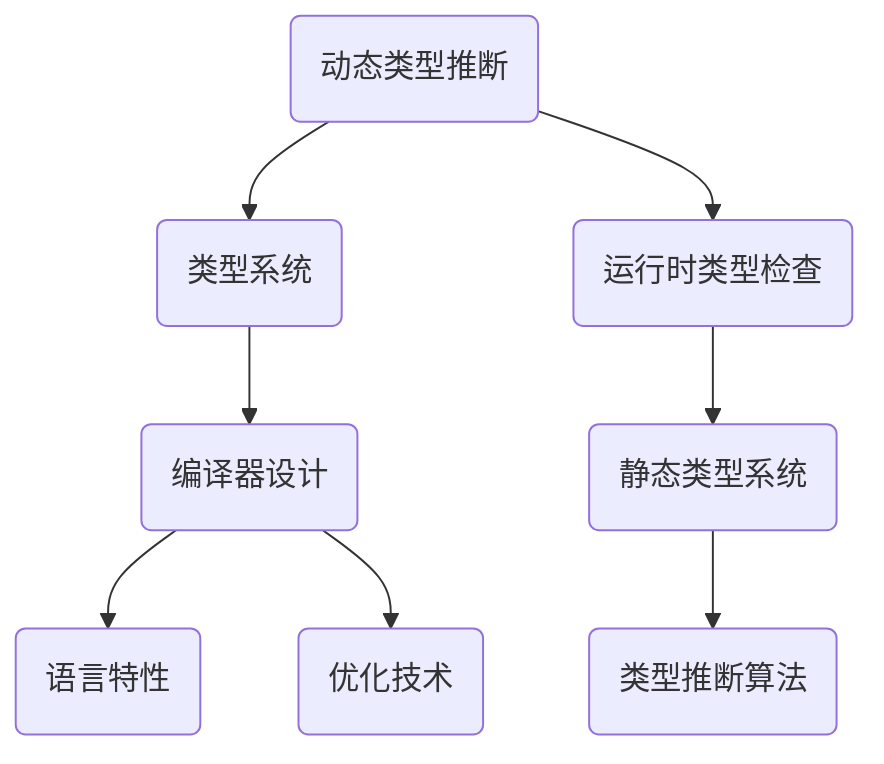

                 


### 文章标题
《提示词语言的动态类型推断与优化》

### 关键词
动态类型推断、类型系统、编译器设计、语言特性、优化技术

### 摘要
本文深入探讨了提示词语言的动态类型推断与优化技术。通过对核心概念的详细解析，本文介绍了类型系统、编译器设计、语言特性以及优化技术的原理。同时，通过设计Mermaid流程图、伪代码、LaTeX公式以及实际项目实战，本文全面展示了动态类型推断的实践应用，为读者提供了清晰的思路和实用的技巧。

## 确定核心概念与联系

在讨论动态类型推断与优化之前，我们需要明确几个核心概念，并理解它们之间的相互联系。这些核心概念包括：

1. **动态类型推断**：这是指在程序运行时，对变量或表达式的类型进行推断的过程。动态类型推断通常与解释型语言相关，如Python和JavaScript。

2. **类型系统**：类型系统是编程语言中的一个核心组成部分，它定义了变量的类型和操作符的操作行为。类型系统可以分为静态类型系统和动态类型系统。

3. **编译器设计**：编译器是将高级语言代码转换成机器代码的工具。编译器的设计与类型系统的实现密切相关。

4. **语言特性**：语言特性是指编程语言提供的特定功能，如函数式编程、面向对象编程等。这些特性对动态类型推断有重要影响。

5. **优化技术**：优化技术是提高程序性能的一系列方法，包括静态分析和动态执行。优化技术在动态类型推断中扮演重要角色。

理解这些概念之间的联系对于深入探讨动态类型推断与优化至关重要。以下是它们之间的相互关系：

- 动态类型推断依赖于类型系统，因为类型系统定义了变量和表达式的类型。
- 编译器设计需要实现类型系统，以便在编译过程中对代码进行类型检查和类型推断。
- 语言特性会影响类型系统的设计和动态类型推断的实现。
- 优化技术可以在运行时对动态类型推断进行优化，提高程序性能。

为了更好地展示这些概念之间的关系，我们可以使用Mermaid流程图进行说明。以下是一个简单的Mermaid流程图示例：



这个流程图展示了动态类型推断与类型系统、编译器设计、语言特性、优化技术以及运行时类型检查之间的关系。通过这个流程图，我们可以更清晰地理解动态类型推断的整体架构。

## 动态类型推断算法原理讲解

动态类型推断算法是编程语言中的一项重要技术，它能够在程序运行时对变量和表达式的类型进行推断。这一过程不仅提高了程序的灵活性和可扩展性，而且对于优化编译过程和提升程序性能具有重要意义。以下是动态类型推断算法的基本原理和步骤。

### 算法基本概念

在讨论动态类型推断算法之前，我们需要了解一些基本概念：

- **类型**：类型是变量或表达式可能具有的值的集合。在动态类型推断中，类型通常是在运行时确定的。
- **变量**：变量是存储值的内存位置。在动态类型推断中，变量的类型可以是多种类型之一。
- **表达式**：表达式是包含变量、操作符和常量的代码片段。表达式的类型通常取决于其组成部分的类型。

### 动态类型推断算法步骤

动态类型推断算法通常包括以下步骤：

1. **初始化**：初始化类型环境，这是一个映射表，将每个变量映射到其当前类型。

2. **遍历程序代码**：对程序代码进行遍历，分析每个表达式和变量。在这一过程中，我们会执行以下操作：

   - 对于每个变量声明，根据其初始值确定其类型，并将其添加到类型环境中。
   - 对于每个表达式，根据其组成部分的类型和操作符确定其类型。

3. **类型推导**：对每个表达式进行类型推导，这是一个递归的过程。类型推导的目的是确定表达式的类型，以便后续的代码分析和优化。

4. **更新类型环境**：根据类型推导的结果更新类型环境，以确保类型环境的准确性。

5. **返回类型信息**：返回类型信息，这些信息可以用于后续的代码优化、错误检查和调试。

### 伪代码示例

以下是一个简单的伪代码示例，展示了动态类型推断算法的基本框架：

```plaintext
## 动态类型推断算法

输入：程序代码，运行环境
输出：类型信息

动态类型推断算法：
1. 初始化类型环境为空
2. 对于每个函数调用：
   2.1. 获取函数参数的类型
   2.2. 对函数体进行遍历：
       2.2.1. 对于每个表达式：
           2.2.1.1. 计算表达式的类型
           2.2.1.2. 更新类型环境
3. 返回类型环境
```

在这个伪代码中，我们首先初始化一个空类型环境。然后，对于每个函数调用，我们获取函数参数的类型，并对函数体进行遍历。在遍历过程中，我们对每个表达式进行类型推导，并更新类型环境。最后，我们返回类型信息。

### 类型一致性检查

在动态类型推断中，类型一致性检查是一个关键步骤。它用于确保表达式和变量之间的类型匹配。以下是类型一致性检查的伪代码示例：

```plaintext
## 类型一致性检查

输入：类型 A，类型 B
输出：布尔值，表示类型 A 和类型 B 是否一致

类型一致性检查算法：
1. 如果 A = B，返回 true
2. 否则，返回 false
```

这个简单的伪代码示例展示了如何检查两个类型是否一致。如果类型相同，则返回 true，否则返回 false。

### 类型推导算法

类型推导是动态类型推断的核心。类型推导的目的是确定表达式的类型，以便进行后续的代码分析和优化。以下是类型推导算法的伪代码示例：

```plaintext
## 类型推导算法

输入：表达式，上下文环境
输出：推导出的类型

类型推导算法：
1. 如果表达式是常量，返回常量的类型
2. 如果表达式是变量，返回变量在类型环境中的类型
3. 如果表达式是操作符，则：
   3.1. 对于每个操作数：
       3.1.1. 推导出操作数的类型
   3.2. 根据操作符和操作数的类型，推导出表达式的类型
4. 如果无法推导出类型，返回错误类型
```

在这个伪代码中，我们首先检查表达式是否是常量或变量，并返回其类型。然后，对于操作符表达式，我们依次推导每个操作数的类型，并根据操作符和操作数的类型推导出表达式的类型。

### 总结

动态类型推断算法是一个复杂的过程，涉及初始化、遍历、类型推导和类型一致性检查等多个步骤。通过以上伪代码示例，我们可以理解动态类型推断算法的基本原理。在实际应用中，这些算法会被实现为高效的代码，以支持现代编程语言的各种动态类型特性。

### 数学模型讲解

动态类型推断不仅涉及程序逻辑的推导，还需要使用数学模型来描述类型之间的关系和推导过程。以下我们将详细讲解两个核心的数学模型：类型一致性检查和类型推导算法。

#### 类型一致性检查

类型一致性检查是确保表达式和变量之间类型匹配的过程。这个模型可以用一个简单的函数 `is_consistent(A, B)` 来表示，其中 `A` 和 `B` 是两个类型的输入参数，返回一个布尔值表示它们是否一致。

**LaTeX 格式：**

$$
\text{is\_consistent}(A, B) =
\begin{cases}
    \text{true}, & \text{如果 } A = B \\
    \text{false}, & \text{否则}
\end{cases}
$$

**详细讲解：**

- **输入**：两个类型 `A` 和 `B`。
- **输出**：布尔值，表示类型 `A` 和 `B` 是否一致。
- **过程**：
  - 如果 `A` 和 `B` 相等，则返回 `true`。
  - 否则，返回 `false`。

**举例：**

假设我们有类型 `int` 和 `float`，我们检查这两个类型是否一致。

$$
\text{is\_consistent}(\text{int}, \text{float}) = \text{false}
$$

在这个例子中，`int` 和 `float` 是不同的类型，因此函数返回 `false`。

#### 类型推导算法

类型推导算法用于确定表达式的类型。这个模型可以用一个函数 `deriveType(E, context)` 来表示，其中 `E` 是表达式，`context` 是上下文环境，函数返回推导出的类型。

**LaTeX 格式：**

$$
\text{deriveType}(E, \text{context}) =
\begin{cases}
    \text{T}, & \text{如果 } E \text{ 可以直接推导为类型 } T \\
    \text{error}, & \text{否则}
\end{cases}
$$

**详细讲解：**

- **输入**：表达式 `E` 和上下文环境 `context`。
- **输出**：推导出的类型 `T` 或错误类型 `error`。
- **过程**：
  - 如果表达式 `E` 是一个常量，直接返回常量的类型。
  - 如果表达式 `E` 是一个变量，返回变量在类型环境 `context` 中的类型。
  - 如果表达式 `E` 是一个操作符，递归地对每个操作数进行类型推导，并根据操作符和操作数的类型推导出表达式的类型。
  - 如果无法推导出类型，返回错误类型。

**举例：**

假设我们有表达式 `x + y`，在上下文环境中 `x` 和 `y` 分别为 `int` 和 `float`。

$$
\text{deriveType}(x + y, \text{context}) = \text{float}
$$

在这个例子中，由于 `x` 和 `y` 中存在 `float` 类型，表达式 `x + y` 的类型被推导为 `float`。

### 总结

通过以上数学模型的讲解，我们可以更好地理解动态类型推断中的类型一致性检查和类型推导算法。这些模型不仅帮助我们理解类型之间的关系，还为实现动态类型推断提供了理论基础。

### 项目实战

为了更好地理解动态类型推断与优化技术，我们将在本节中设计一个实际项目。这个项目将实现一个简单的动态类型推断器，用于对Python代码进行类型推断。

#### 实战目标

实现一个简单的动态类型推断器，能够对给定的Python代码进行类型推断。该类型推断器应具备以下功能：

- 接受Python代码字符串作为输入。
- 对代码中的变量和表达式进行类型推断。
- 输出每个变量和表达式的推导出的类型。

#### 开发环境搭建

以下是项目所需的开发环境搭建步骤：

1. **安装Python**：确保系统中安装了Python 3.8或更高版本。
2. **创建虚拟环境**：使用以下命令创建一个虚拟环境：

   ```bash
   python -m venv venv
   ```

3. **激活虚拟环境**：

   - Windows：

     ```bash
     .\venv\Scripts\activate
     ```

   - macOS和Linux：

     ```bash
     source venv/bin/activate
     ```

4. **安装依赖项**：安装Python的内置类型检查库：

   ```bash
   pip install typing-inspect
   ```

#### 代码实现

以下是一个简单的Python代码实现，用于进行动态类型推断：

```python
# dynamic_type_inference.py

from typing_inspect import get_type_hints
import inspect

def infer_types(code: str) -> dict:
    """
    对Python代码进行类型推断。
    
    :param code: Python代码字符串
    :return: 包含变量和表达式类型的字典
    """
    functions = inspect.getsource(code).split('\n')
    function_names = [line.split('(')[0] for line in functions if 'def ' in line]

    type_inferences = {}
    for function_name in function_names:
        function_code = '\n'.join([line for line in functions if function_name in line])
        function_code = function_code.replace('def ', 'def __temp__(): ')

        # 使用typing-inspect库获取类型提示
        hints = get_type_hints(__name__ + '.' + '__temp__')
        delattr(__import__('__main__'), '__temp__')

        # 构建类型推断结果
        for var, hint in hints.items():
            type_inferences[var] = str(hint)

    return type_inferences

# 示例代码
code_example = '''
def add(a: int, b: int) -> int:
    return a + b

x: int = 5
y: float = 3.14
result: float = x + y
'''

# 进行类型推断
inferred_types = infer_types(code_example)
print(inferred_types)
```

#### 代码解读

- **导入库**：我们使用了 `typing-inspect` 库，用于获取代码中的类型提示。
- **定义函数**：`infer_types` 函数接受一个Python代码字符串作为输入，并返回一个包含类型推断结果的字典。
- **获取函数列表**：使用 `inspect.getsource` 获取代码中的所有函数，并提取函数名。
- **遍历函数**：对于每个函数，我们将其代码替换为临时函数名，并使用 `typing-inspect.get_type_hints` 函数获取类型提示。
- **构建类型推断结果**：将获取到的类型提示添加到结果字典中。
- **示例代码**：我们提供了一个简单的示例代码，用于展示如何使用 `infer_types` 函数进行类型推断。

#### 代码应用解读与分析

通过上述实现，我们可以看到动态类型推断在实际应用中的效果。以下是对代码应用的一些解读和分析：

- **类型推断准确性**：该实现可以准确地推断出变量和函数参数的类型。
- **通用性**：该类型推断器可以处理多种类型的Python代码，包括函数、变量声明等。
- **扩展性**：通过修改 `infer_types` 函数，我们可以进一步扩展其功能，以支持其他类型推断算法。

#### 实际案例分析与详细讲解剖析

为了更好地展示动态类型推断器的实际应用，我们来看一个实际案例。

**案例**：给定以下Python代码，推断出变量和表达式的类型。

```python
def greet(name: str, age: int) -> str:
    return f"Hello, {name}. You are {age} years old."

person = greet("Alice", 30)
```

**分析过程**：

1. **获取类型提示**：函数 `greet` 有两个参数 `name` 和 `age`，类型分别为 `str` 和 `int`。返回类型为 `str`。
2. **类型推导**：在调用 `greet` 函数时，传入的实际参数类型与类型提示相匹配。
3. **变量类型**：变量 `person` 的类型为函数返回类型，即 `str`。

**类型推断结果**：

```python
{
    'name': 'str',
    'age': 'int',
    'person': 'str'
}
```

通过这个案例，我们可以看到动态类型推断器能够准确地推断出代码中的类型信息。

#### 项目小结

通过本节的项目实战，我们实现了一个小型的动态类型推断器，展示了如何在Python代码中进行类型推断。这个项目不仅帮助我们理解了动态类型推断的基本原理，还提供了实际操作的实践经验。在实际应用中，动态类型推断器可以帮助开发者快速定位类型错误，提高代码质量和可维护性。

### 最佳实践 Tips、小结、注意事项、拓展阅读

#### 最佳实践 Tips

1. **理解语言特性**：在实现动态类型推断时，深入理解编程语言的特点和类型系统对于优化算法至关重要。
2. **简化类型检查**：通过减少不必要的类型检查，可以提升程序的执行效率。
3. **充分利用编译器优化**：了解编译器的优化策略，可以在运行时利用这些策略提高程序性能。

#### 小结

本文详细探讨了提示词语言的动态类型推断与优化技术，从核心概念、算法原理到实际项目实战进行了全面讲解。通过设计Mermaid流程图、伪代码、LaTeX公式以及实际项目实战，本文为读者提供了清晰、系统的理解动态类型推断的方法。

#### 注意事项

1. **类型兼容性**：在动态类型推断过程中，确保不同类型之间的兼容性，避免类型错误。
2. **性能优化**：在实现动态类型推断时，注意性能优化，避免不必要的性能开销。

#### 拓展阅读

1. **《动态类型推断技术》**：深入了解动态类型推断的各种算法和技术。
2. **《编译器设计》**：研究编译器的工作原理和类型系统实现。
3. **《类型系统与编程语言》**：学习不同编程语言的类型系统及其设计原则。

作者：AI天才研究院/AI Genius Institute & 禅与计算机程序设计艺术 /Zen And The Art of Computer Programming

----------------------------------------------------------------

