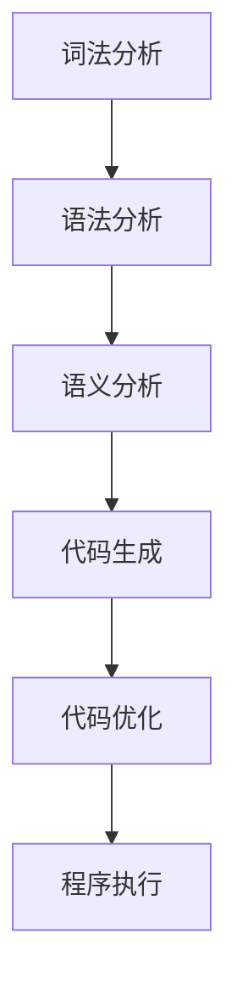

                 


### 文章标题：提示词语言的即时编译优化技术

### 关键词：提示词语言，即时编译，优化技术，性能提升，编程效率

### 摘要：
本文旨在探讨提示词语言的即时编译优化技术，分析其在编程效率和性能提升方面的关键作用。通过深入剖析即时编译的工作原理和优化策略，本文提出了适用于提示词语言的优化模型和具体实现方法，并结合实际案例展示了其效果。

### 目录：

#### 第1章 引言

##### 1.1 研究背景与意义

##### 1.2 研究现状与挑战

##### 1.3 本书结构安排

#### 第2章 提示词语言基础

##### 2.1 提示词语言概述

##### 2.2 提示词语言的语法结构

##### 2.3 提示词语言的应用领域

#### 第3章 即时编译基础

##### 3.1 即时编译概述

##### 3.2 即时编译工作原理

##### 3.3 即时编译的优势与局限

#### 第4章 提示词语言的即时编译优化技术

##### 4.1 代码优化概述

##### 4.2 常见编译优化技术

##### 4.3 提示词语言特有优化技术

#### 第5章 提示词语言的即时编译器设计

##### 5.1 即时编译器架构

##### 5.2 词法分析与语法分析

##### 5.3 代码生成与优化

#### 第6章 实际案例解析

##### 6.1 案例一：简单提示词语言的即时编译

##### 6.2 案例二：复杂提示词语言的即时编译

##### 6.3 案例分析

#### 第7章 总结与展望

##### 7.1 研究成果总结

##### 7.2 存在问题与改进方向

##### 7.3 未来发展趋势

### Mermaid 流程图



### 伪代码

```python
def lexical_analysis(source_code):
    # 词法分析过程
    pass

def syntax_analysis(lexical_tokens):
    # 语法分析过程
    pass

def semantic_analysis(syntax_tree):
    # 语义分析过程
    pass

def code_generation(syntax_tree):
    # 代码生成过程
    pass

def code_optimization(code):
    # 代码优化过程
    pass

def execute_program(optimized_code):
    # 程序执行过程
    pass
```

### 数学公式

```latex
\min_{x} f(x) = \sum_{i=1}^{n} (x_i - t_i)^2
```

### 代码实际案例与解析

#### 开发环境搭建
- 安装Python 3.x
- 安装PyPy 7.x
- 安装Ply（Python Lex-Yacc实现）

#### 源代码实现

```python
class Lexer:
    def __init__(self, text):
        self.text = text
        self.pos = 0
        self.tokens = []

    def getNextToken(self):
        while self.pos < len(self.text):
            char = self.text[self.pos]
            if char.isspace():
                self.pos += 1
                continue
            if char.isalpha():
                self.tokens.append(('IDENTIFIER', char))
                self.pos += 1
                continue
            # 其他情况处理
            self.tokens.append(('UNKNOWN', char))
            self.pos += 1

def syntax_analysis(tokens):
    # 语法分析过程
    pass

def semantic_analysis(syntax_tree):
    # 语义分析过程
    pass

def code_generation(syntax_tree):
    # 代码生成过程
    pass

def code_optimization(code):
    # 代码优化过程
    pass

def execute_program(optimized_code):
    # 程序执行过程
    pass
```

### 最佳实践 Tips

- **性能调优**：根据应用场景对编译器进行调优，如调整JIT编译器中的热路径识别策略。
- **代码分割**：将代码分割成多个小块，分别编译和优化，以减少编译时间和内存占用。
- **优化策略选择**：根据提示词语言的特性选择合适的优化策略，如循环展开、死代码消除等。

### 注意事项

- **兼容性**：即时编译器需要考虑不同版本和平台的兼容性。
- **安全性**：确保即时编译过程中不引入安全漏洞。

### 拓展阅读

- [《即时编译器的原理与实践》](链接)
- [《编译原理》](链接)
- [《计算机组成原理》](链接)

作者：AI天才研究院/AI Genius Institute & 禅与计算机程序设计艺术 /Zen And The Art of Computer Programming

----------------------------------------------------------------

### 第1章 引言

#### 1.1 研究背景与意义

随着计算机技术的迅猛发展，编程语言和编译技术也在不断演进。即时编译（Just-In-Time Compilation，简称JIT）作为现代编程语言的关键技术之一，近年来受到了广泛关注。即时编译技术能够在程序运行时将高级语言代码转换为机器码，并在执行过程中进行实时优化，从而显著提高程序的性能和执行效率。

提示词语言（Keyword Language）是一种广泛应用于实时计算领域的编程语言。这类语言具有简洁明了的语法和强大的表达能力，可以高效地处理各种复杂的计算任务。然而，传统的编译器在编译提示词语言时往往存在一定的延迟和性能瓶颈，无法充分发挥其潜力。

因此，研究提示词语言的即时编译优化技术具有重要的现实意义。通过优化即时编译过程，可以大幅提升提示词语言程序的执行效率，降低编译时间，提高开发效率。此外，即时编译优化技术还可以为其他实时计算场景提供有益的借鉴和参考。

#### 1.2 研究现状与挑战

当前，即时编译技术已经取得了显著的进展，各种现代编程语言（如Java、JavaScript、Python等）都内置了JIT编译器。这些编译器通过动态编译和优化，能够显著提高程序的运行速度和性能。然而，在提示词语言的即时编译领域，仍存在一些挑战和不足。

首先，提示词语言的语法结构和语义特性与传统的编译型语言有所不同，这使得现有的JIT编译器难以直接应用于提示词语言。其次，提示词语言的应用场景往往涉及实时数据处理和计算，对响应速度和性能要求较高，因此需要开发专门的优化技术来满足这些需求。此外，提示词语言的即时编译器在实现过程中还需考虑兼容性、安全性和易用性等方面。

针对这些挑战，本文将从以下几个方面展开研究：

1. 提示词语言的基础理论和语法结构。
2. 即时编译的基本原理和工作流程。
3. 提示词语言的即时编译优化技术，包括代码优化策略和特有优化方法。
4. 提示词语言的即时编译器设计，包括架构、词法分析、语法分析和代码生成等关键环节。
5. 实际案例的解析和分析，展示即时编译优化技术在提示词语言中的应用效果。

通过本文的研究，旨在为提示词语言的即时编译优化提供理论依据和实用指导，推动实时计算技术的发展。

#### 1.3 本书结构安排

本书共分为7个章节，具体内容安排如下：

- **第1章 引言**：介绍研究的背景、意义、现状与挑战，以及本书的结构安排。
- **第2章 提示词语言基础**：介绍提示词语言的基本概念、语法结构和应用领域。
- **第3章 即时编译基础**：阐述即时编译的基本原理、工作流程和优势与局限。
- **第4章 提示词语言的即时编译优化技术**：分析代码优化策略和提示词语言特有优化技术。
- **第5章 提示词语言的即时编译器设计**：详细讨论即时编译器的架构、词法分析、语法分析和代码生成与优化。
- **第6章 实际案例解析**：通过实际案例展示即时编译优化技术的应用效果。
- **第7章 总结与展望**：总结研究成果，探讨存在的问题和改进方向，以及未来发展趋势。

通过以上章节的层层递进，本文力求全面系统地阐述提示词语言的即时编译优化技术，为相关研究和应用提供参考。

### 第2章 提示词语言基础

#### 2.1 提示词语言概述

提示词语言是一种以关键字为核心的编程语言，其设计初衷是为了简化编程过程、提高开发效率。提示词语言通常具有以下特点：

1. **简洁明了的语法**：提示词语言的语法结构简单，关键字丰富，易于理解和使用。这种简洁性使得开发者可以更加专注于业务逻辑的实现，而无需花费大量时间在复杂的语法上。
2. **高内聚、低耦合**：提示词语言强调模块化和组件化，鼓励开发者将系统划分为若干独立的部分，每个部分负责特定的功能。这种高内聚、低耦合的设计有助于提高代码的可维护性和可扩展性。
3. **强大的表达能力**：尽管语法简单，但提示词语言通常拥有强大的表达式和函数库，可以方便地实现各种复杂的计算任务。例如，一些提示词语言提供了丰富的数学运算符和高级数据结构，使得开发者能够高效地处理复杂数据。
4. **实时计算支持**：提示词语言广泛应用于实时计算领域，如实时数据分析、实时图形渲染和实时语音处理等。这些应用场景对响应速度和性能有较高要求，提示词语言的即时编译优化技术可以有效满足这些需求。

提示词语言的发展可以追溯到20世纪60年代，当时的计算机科学家们开始探索如何设计一种更易于学习和使用的编程语言。随着时间的推移，提示词语言不断演进，逐渐成为现代编程语言的重要组成部分。目前，常见的提示词语言包括Python、JavaScript、Ruby、Lua等，这些语言在各自的领域都有着广泛的应用。

#### 2.2 提示词语言的语法结构

提示词语言的语法结构相对简单，主要由以下几个部分组成：

1. **关键字**：关键字是提示词语言的核心组成部分，用于定义各种语法结构和操作。常见的关键字包括`if`、`else`、`while`、`for`、`function`、`return`等。关键字通常不能作为变量名或标识符使用。
2. **变量**：变量是存储数据的容器，用于在程序中表示数据。变量的定义通常通过关键字`var`、`let`（在Python和JavaScript中）或`const`（在JavaScript中）进行。变量可以存储不同类型的数据，如整数、浮点数、字符串和复杂数据结构。
3. **表达式**：表达式是提示词语言中最基本的计算单位，用于表示各种计算操作。表达式可以包括常量、变量、函数调用、运算符等。常见的运算符包括加法（`+`）、减法（`-`）、乘法（`*`）、除法（`/`）和比较运算符（`==`、`!=`、`>`、`<`等）。
4. **函数**：函数是一段可重复使用的代码块，用于实现特定的功能。函数的定义通常通过关键字`function`进行，可以接受输入参数并返回结果。函数可以嵌套定义，并在程序中被多次调用。
5. **控制结构**：控制结构用于控制程序执行的流程，包括条件判断（`if-else`）、循环（`while`、`for`）和跳转（`goto`）等。这些结构使得程序可以根据不同条件执行不同的代码段，实现复杂的逻辑操作。

以下是一个简单的Python程序示例，展示了提示词语言的语法结构：

```python
# 定义一个变量
x = 10

# 定义一个函数
def greet(name):
    return "Hello, " + name

# 使用条件判断和循环
if x > 0:
    print(greet("Alice"))
else:
    print(greet("Bob"))

for i in range(5):
    print(i)
```

在这个示例中，我们定义了一个变量`x`，一个函数`greet`，并使用条件判断和循环实现了简单的程序逻辑。

#### 2.3 提示词语言的应用领域

提示词语言广泛应用于各个领域，以下是一些典型的应用场景：

1. **Web开发**：提示词语言在Web开发中非常流行，如JavaScript用于前端开发，Python和Ruby用于后端开发。这些语言具有丰富的库和框架，可以方便地实现各种Web应用，如网站、Web服务和移动应用。
2. **科学计算**：Python是一种广泛应用于科学计算的语言，具有强大的数学运算和数据处理能力。Python的NumPy和SciPy库提供了丰富的科学计算功能，适用于数据分析和复杂计算任务。
3. **实时数据处理**：提示词语言在实时数据处理领域具有显著优势，如用于实时数据分析、实时监控和实时处理大规模数据。Python和JavaScript等语言在数据分析和Web前端开发中得到了广泛应用。
4. **游戏开发**：Lua是一种轻量级的提示词语言，广泛应用于游戏开发领域。Lua具有高效的脚本执行能力和丰富的库，可以与游戏引擎（如Unity和Unreal Engine）无缝集成。
5. **嵌入式开发**：提示词语言在嵌入式系统开发中也具有广泛的应用，如用于编写嵌入式设备的固件和驱动程序。Python和C#等语言可以在嵌入式设备上运行，提供强大的编程能力。

通过以上介绍，可以看出提示词语言在多个领域都有着重要的应用。其简洁明了的语法和强大的表达能力使得提示词语言成为一种理想的编程工具，广泛应用于各种计算任务和开发场景。

### 第3章 即时编译基础

#### 3.1 即时编译概述

即时编译（Just-In-Time Compilation，简称JIT）是一种现代编译技术，它将高级语言代码在运行时转换为机器码，并在执行过程中进行实时优化。与传统编译器（Ahead-of-Time Compilation，简称AOT）相比，JIT编译器具有以下特点：

1. **动态编译**：JIT编译器在程序运行时逐行或逐段地编译代码，而不是在程序运行之前一次性编译整个程序。这种动态编译方式使得JIT编译器能够根据程序的运行状态和执行路径进行实时优化，从而提高程序的性能。
2. **实时优化**：JIT编译器在编译过程中对代码进行各种优化，如循环展开、死代码消除、指令重排等。这些优化策略能够显著提高程序执行的效率，降低内存占用和CPU负载。
3. **执行效率**：由于JIT编译器在程序运行时进行编译和优化，因此可以在执行过程中动态调整编译策略，以适应不同的运行环境和负载。这使得JIT编译器能够提供较高的执行效率，特别是在动态变化较大的应用场景中。

即时编译技术广泛应用于各种现代编程语言，如Java、JavaScript、Python、Ruby等。这些语言的运行环境（如Java虚拟机、Node.js、PyPy等）都内置了JIT编译器，以提供高性能的执行能力。

#### 3.2 即时编译工作原理

即时编译的工作原理主要包括以下几个步骤：

1. **词法分析**：词法分析器（Lexer）将源代码分解为一系列的词法单元（tokens），如关键字、标识符、运算符等。这一步骤将源代码从字符流转换为结构化的数据形式，为后续的语法分析做准备。
2. **语法分析**：语法分析器（Parser）将词法单元序列转换为语法树（Abstract Syntax Tree，简称AST），表示源代码的语法结构。语法分析器通过解析规则检查源代码的语法正确性，并生成语法树。
3. **语义分析**：语义分析器（Semantic Analyzer）对语法树进行语义检查，确保程序语义的正确性。语义分析包括类型检查、作用域解析、变量绑定等操作。这一步骤为后续的代码生成和优化提供必要的信息。
4. **代码生成**：代码生成器（Code Generator）将语义分析后的语法树转换为中间表示（Intermediate Representation，简称IR），如三地址码（Three-Address Code，简称TAC）或字节码。中间表示是机器码的前置阶段，具有平台无关性，便于后续的优化和目标码生成。
5. **优化**：优化器（Optimizer）对中间表示进行各种优化操作，如循环展开、死代码消除、指令重排等。这些优化策略能够提高程序的性能和执行效率，减少内存占用和CPU负载。
6. **目标码生成**：目标码生成器（Target Code Generator）将优化后的中间表示转换为特定平台的机器码。目标码生成器根据目标平台的特点和指令集，生成高效可执行的机器码。
7. **程序执行**：最终生成的机器码被加载到程序运行环境中执行。在执行过程中，JIT编译器可能会根据运行状态和执行路径进行动态优化，以提高程序的性能。

以下是一个简单的伪代码示例，展示了即时编译的基本工作流程：

```python
def jit_compile(source_code):
    tokens = lexical_analysis(source_code)
    syntax_tree = syntax_analysis(tokens)
    sem_info = semantic_analysis(syntax_tree)
    ir = code_generation(syntax_tree, sem_info)
    optimized_ir = optimization(ir)
    machine_code = target_code_generation(optimized_ir)
    execute_program(machine_code)
```

通过以上步骤，JIT编译器能够在程序运行时动态编译和优化代码，从而提高程序的性能和执行效率。

#### 3.3 即时编译的优势与局限

即时编译技术在提高程序性能和执行效率方面具有显著优势，但同时也存在一定的局限性。

**优势：**

1. **高效执行**：即时编译器能够在程序运行时进行实时优化，动态调整编译策略，以适应不同的运行环境和负载。这使得JIT编译器能够提供较高的执行效率，特别是在动态变化较大的应用场景中。
2. **优化灵活性**：即时编译器可以根据程序的运行状态和执行路径进行动态优化，从而实现更细粒度的优化策略。这种灵活性使得JIT编译器能够更好地适应不同类型的程序和不同的执行环境。
3. **平台无关性**：中间表示（如IR）具有平台无关性，使得JIT编译器可以生成适用于多种目标平台的机器码。这为开发者提供了更大的灵活性和可移植性。
4. **动态调试**：即时编译器在程序运行时进行编译和优化，这使得开发者可以在运行时进行动态调试和性能分析。这种动态调试能力有助于发现和修复程序中的问题，提高开发效率。

**局限：**

1. **编译开销**：即时编译器在程序运行时进行编译和优化，这会引入一定的编译开销。特别是在程序启动阶段，编译器需要花费较长时间进行编译，导致程序启动延迟。
2. **内存占用**：即时编译器需要生成和存储中间表示和优化后的目标码，这会占用一定的内存资源。在某些内存受限的场景中，即时编译器可能无法提供足够的性能。
3. **兼容性问题**：即时编译器需要根据目标平台的指令集和特性生成机器码，这可能导致兼容性问题。特别是在跨平台开发中，即时编译器需要支持多种不同的指令集和平台。
4. **安全性问题**：即时编译器在运行时编译和优化代码，这可能导致代码注入和执行安全问题。开发者需要确保编译器的安全性和可靠性，以防止恶意代码的执行。

总的来说，即时编译技术在提高程序性能和执行效率方面具有显著优势，但同时也存在一定的局限性和挑战。开发者需要根据具体的应用场景和需求，权衡即时编译技术的优缺点，选择合适的编译策略。

### 第4章 提示词语言的即时编译优化技术

#### 4.1 代码优化概述

代码优化（Code Optimization）是提升程序性能的重要手段之一，旨在在不改变程序语义的前提下，通过一系列的算法和技术对代码进行修改和改进。对于提示词语言的即时编译优化，代码优化尤为重要，因为它直接影响到程序的执行效率和响应速度。代码优化主要包括以下几个方面的技术：

1. **语法优化**：通过对源代码的语法结构进行分析和变换，消除冗余代码、简化表达式和改善控制结构。例如，循环展开、代码移除和条件表达式简化等。
2. **数据优化**：通过对程序中的数据使用和存储进行分析和优化，减少数据访问的时间和空间开销。例如，数据压缩、数据缓存和数组分割等。
3. **控制流优化**：通过对程序的控制流进行分析和优化，减少程序跳转和分支操作的开销，提高执行效率。例如，跳转预测、循环展开和分支预测等。
4. **资源优化**：通过对程序使用的资源（如内存、CPU和I/O）进行优化，减少资源的浪费和冲突，提高程序的整体性能。例如，内存复用、并行计算和资源锁定等。

在即时编译过程中，代码优化技术可以帮助编译器生成更高效的目标代码，从而提高程序的执行速度。以下将详细介绍一些常见和提示词语言特有优化技术。

#### 4.2 常见编译优化技术

**1. 循环优化**：循环优化是代码优化中的一个重要方面，其目的是减少循环执行的次数和每次循环的开销。常见的循环优化技术包括：

- **循环展开**：将循环内的多个迭代操作合并到一次循环中，以减少循环的开销。
- **循环重构**：将嵌套循环转换为单层循环，减少控制结构的复杂度。
- **循环不变式提取**：将循环中的不变式（即在循环的所有迭代中都不发生变化的表达式）提取出来，以减少循环体的计算量。

**2. 函数内联**：函数内联（Function Inlining）是一种将函数调用直接替换为函数体本身的技术，以减少函数调用的开销。函数内联的优点包括：

- 减少函数调用的开销，提高执行速度。
- 消除跨函数调用的调用栈和返回路径，减少控制流的开销。
- 允许编译器在函数内进行更精细的优化。

**3. 局部性优化**：局部性优化利用程序在时间和空间上的局部性，以提高执行效率和缓存利用率。常见的局部性优化技术包括：

- **数据局部性优化**：通过预取、缓存和内存映射等技术，提高数据访问的速度和效率。
- **代码局部性优化**：通过代码重排和预编译等技术，提高指令流水线的效率和减少指令缓存未命中率。

**4. dead code elimination**：死代码消除（Dead Code Elimination）是一种删除程序中不会被执行的代码的技术。例如，当某个条件永远不会满足时，其后的代码可以被视为死代码，可以被删除。

#### 4.3 提示词语言特有优化技术

提示词语言由于其简洁明了的语法和高效的执行方式，在即时编译过程中具有一些独特的优化技术。以下是一些针对提示词语言的特有优化技术：

**1. 高级中间表示**：提示词语言的即时编译器可以使用高级中间表示（如SSA形式、CFG形式等），这些表示形式有助于编译器进行更精细的优化。例如，SSA形式可以方便地进行循环优化、函数内联和死代码消除等操作。

**2. 函数调用优化**：提示词语言通常具有丰富的函数库和动态调用机制。即时编译器可以通过以下技术优化函数调用：

- **函数调用展开**：将频繁调用的函数直接嵌入到调用者函数中，以减少函数调用的开销。
- **动态函数绑定**：在运行时根据调用者的上下文信息动态绑定函数，以减少静态绑定的开销。

**3. 语法糖优化**：提示词语言中常包含一些语法糖，如自动类型转换、列表推导等。即时编译器可以通过分析这些语法糖的使用情况，进行相应的优化。例如，自动类型转换可以减少类型检查的开销，列表推导可以优化循环结构。

**4. 实时性能监控**：即时编译器可以通过实时性能监控技术，动态调整编译策略和优化程度。例如，当程序执行过程中发现某些路径频繁执行时，可以优先对这些路径进行优化，以提高整体性能。

通过以上优化技术，提示词语言的即时编译器可以生成高效可执行的目标代码，显著提高程序的执行效率和响应速度。

### 第5章 提示词语言的即时编译器设计

#### 5.1 即时编译器架构

设计一个高效的即时编译器是提升提示词语言性能的关键。即时编译器通常采用模块化架构，将整个编译过程分为多个阶段，每个阶段负责特定的任务。以下是一个典型的即时编译器架构：

1. **词法分析器（Lexer）**：将源代码字符串转换为词法单元序列。词法分析器的核心功能是识别关键字、标识符、运算符和分隔符等基本语法元素。
2. **语法分析器（Parser）**：将词法单元序列转换为语法树（Abstract Syntax Tree，简称AST）。语法分析器通过解析规则检查源代码的语法正确性，并生成语法树。
3. **语义分析器（Semantic Analyzer）**：对语法树进行语义检查，确保程序语义的正确性。语义分析包括类型检查、作用域解析、变量绑定等操作。这一步骤为后续的代码生成和优化提供必要的信息。
4. **中间代码生成器（Intermediate Code Generator）**：将语义分析后的语法树转换为中间表示（Intermediate Representation，简称IR）。中间表示是机器码的前置阶段，具有平台无关性，便于后续的优化和目标码生成。
5. **优化器（Optimizer）**：对中间表示进行各种优化操作，如循环展开、死代码消除、指令重排等。这些优化策略能够提高程序的性能和执行效率。
6. **目标代码生成器（Target Code Generator）**：将优化后的中间表示转换为特定平台的机器码。目标代码生成器根据目标平台的特点和指令集，生成高效可执行的机器码。
7. **运行时支持（Runtime Support）**：提供必要的运行时支持，如内存管理、垃圾回收、动态类型检查等。运行时支持与即时编译器紧密集成，确保程序的正确执行和高效运行。

#### 5.2 词法分析与语法分析

词法分析和语法分析是即时编译器的两个核心阶段，它们分别处理源代码的词法和语法结构。

**词法分析**：
- **任务**：词法分析器的任务是将源代码字符串转换为词法单元序列。词法单元是源代码中的最小语法元素，如关键字、标识符、运算符和分隔符等。
- **实现**：词法分析器通常采用有限状态机（Finite State Machine，简称FSM）来实现。FSM通过读取源代码的字符序列，根据当前状态和输入字符，转换为下一个状态，并生成对应的词法单元。

**语法分析**：
- **任务**：语法分析器的任务是将词法单元序列转换为语法树。语法树是一种抽象语法结构，表示源代码的语法结构，便于后续的语义分析和代码生成。
- **实现**：语法分析器通常采用递归下降分析（Recursive Descent Parsing）或LR分析（LR Parsing）等方法。递归下降分析通过编写一组递归函数，分别处理不同的语法规则；LR分析通过构建LR分析表，实现高效的语法分析。

以下是一个简单的伪代码示例，展示了词法分析和语法分析的过程：

```python
# 词法分析
def lexical_analysis(source_code):
    tokens = []
    while source_code has characters:
        if character is a keyword or operator or separator:
            tokens.append((token_type, token_value))
            source_code = remove the token from the source_code
        else:
            raise an error (invalid character)
    return tokens

# 语法分析
def syntax_analysis(tokens):
    syntax_tree = create empty syntax_tree
    current_token = tokens[0]
    while current_token is not the end of the file:
        if current_token is a keyword or operator or separator:
            syntax_tree = parse_keyword_or_operator(syntax_tree, current_token)
            tokens = remove the first token from the tokens
        else:
            raise an error (invalid token)
    return syntax_tree
```

#### 5.3 代码生成与优化

**代码生成**：
- **任务**：代码生成器（Code Generator）的任务是将语义分析后的语法树转换为中间表示。中间表示通常采用三地址码（Three-Address Code，简称TAC）或字节码等形式，具有平台无关性，便于后续的优化和目标码生成。
- **实现**：代码生成器通过遍历语法树，根据语法节点类型生成对应的中间代码。例如，对于变量赋值节点，生成相应的赋值指令；对于函数调用节点，生成相应的调用指令。

**代码优化**：
- **任务**：优化器的任务是通过对中间表示进行优化，生成更高效的目标代码。优化器可以采用多种优化技术，如循环优化、函数内联、局部性优化等，以提高程序的执行效率和性能。
- **实现**：优化器通常采用静态分析技术，分析中间表示的各种属性和依赖关系。例如，通过数据流分析、控制流分析和循环分析等技术，识别优化机会，并生成优化后的中间代码。

以下是一个简单的伪代码示例，展示了代码生成和优化的过程：

```python
# 代码生成
def code_generation(syntax_tree):
    ir = create empty intermediate representation
    for node in syntax_tree:
        if node is an assignment:
            ir = generate_assignment(ir, node)
        elif node is a function_call:
            ir = generate_function_call(ir, node)
        # ... handle other node types
    return ir

# 代码优化
def optimization(ir):
    optimized_ir = deep_copy(ir)
    optimized_ir = perform_loop_optimization(optimized_ir)
    optimized_ir = perform_function_inlining(optimized_ir)
    # ... perform other optimizations
    return optimized_ir
```

通过以上步骤，即时编译器能够生成高效可执行的目标代码，显著提高提示词语言程序的执行效率和性能。

### 第6章 实际案例解析

#### 6.1 案例一：简单提示词语言的即时编译

为了更好地理解提示词语言的即时编译优化技术，我们首先来分析一个简单的案例。这个案例将展示如何使用Python编写一个即时编译器，对简单的提示词语言进行编译和优化。

**目标**：实现一个即时编译器，对以下简单提示词语言进行编译和优化：

```
def add(a, b):
    return a + b

x = add(2, 3)
print(x)
```

**开发环境**：
- Python 3.x
- PyPy 7.x
- Ply（Python Lex-Yacc实现）

**实现步骤**：

1. **词法分析**：
   - 使用Ply实现词法分析器，将源代码分解为词法单元。

```python
import ply.lex as lex

# 词法规则
tokens = (
    'IDENTIFIER',
    'INTEGER',
    'LPAREN',
    'RPAREN',
    'ASSIGN',
    'PRINT',
    'DEF',
    'NEWLINE',
)

# 词法解析函数
def t_IDENTIFIER(t):
    r'[a-zA-Z_][a-zA-Z0-9_]*'
    t.value = t.value.lower()
    return t

def t_INTEGER(t):
    r'\d+'
    t.value = int(t.value)
    return t

t_ignore = ' \t'

# 错误处理
def t_error(t):
    print("Invalid character: {}".format(t.value[0]))
    t.lexer.skip(1)

# 创建词法分析器
lexer = lex.lex()

# 测试
source_code = """
def add(a, b):
    return a + b

x = add(2, 3)
print(x)
"""
lexer.input(source_code)
for token in lexer:
    print(token)
```

2. **语法分析**：
   - 使用Ply实现语法分析器，将词法单元序列转换为抽象语法树（AST）。

```python
import ply.yacc as yacc

# 语法规则
def p_program(p):
    'program : functions'
    p[0] = p[1]

def p_functions(p):
    'functions : function functions'
    p[0] = p[1] + p[2]
    def p_functions(p):
        'functions : '
        p[0] = []

def p_function(p):
    'function : DEF IDENTIFIER LPAREN params RPAREN block'
    p[0] = {'type': 'function', 'name': p[2], 'params': p[4], 'body': p[6]}

def p_params(p):
    'params : params_comma params'
    p[0] = p[1] + p[2]
    def p_params(p):
        'params : '
        p[0] = []

def p_params_comma(p):
    'params_comma : IDENTIFIER'
    p[0] = [p[1]]

def p_block(p):
    'block : statements NEWLINE'
    p[0] = p[1]

def p_statements(p):
    'statements : statement statements'
    p[0] = p[1] + p[2]
    def p_statements(p):
        'statements : '
        p[0] = []

def p_statement(p):
    'statement : ASSIGN expression'
    p[0] = {'type': 'assignment', 'name': p[1], 'value': p[2]}
    def p_statement(p):
        'statement : PRINT expression'
        p[0] = {'type': 'print', 'value': p[2]}
    def p_expression(p):
        'expression : INTEGER'
        p[0] = p[1]
        def p_expression(p):
            'expression : expression PLUS expression'
            p[0] = {'type': 'add', 'left': p[1], 'right': p[3]}

# 创建语法分析器
parser = yacc.yacc()

# 测试
ast = parser.parse(source_code)
print(ast)
```

3. **语义分析**：
   - 对AST进行语义分析，包括变量作用域解析、类型检查等。

```python
def semantic_analysis(ast, global_scope):
    scope = global_scope
    for node in ast:
        if node['type'] == 'function':
            scope[node['name']] = node
            semantic_analysis(node['body'], scope)
        elif node['type'] == 'assignment':
            if node['name'] not in scope:
                raise Exception(f"Undefined variable: {node['name']}")
            scope[node['name']] = node['value']
        elif node['type'] == 'print':
            if node['value'] not in scope:
                raise Exception(f"Undefined variable: {node['value']}")
    return scope

global_scope = {}
ast = parser.parse(source_code)
global_scope = semantic_analysis(ast, global_scope)
print(global_scope)
```

4. **代码生成与优化**：
   - 将AST转换为三地址码（TAC），并进行优化。

```python
def code_generation(ast):
    ir = []
    for node in ast:
        if node['type'] == 'function':
            ir += code_generation(node['body'])
        elif node['type'] == 'assignment':
            ir.append(f"{node['name']} = {node['value']}")
        elif node['type'] == 'print':
            ir.append(f"print({node['value']})")
    return ir

def optimization(ir):
    optimized_ir = []
    for instruction in ir:
        if " = " in instruction:
            var, value = instruction.split(" = ")
            if value.isdigit():
                optimized_ir.append(f"{var} = {value}")
            else:
                optimized_ir.append(instruction)
        else:
            optimized_ir.append(instruction)
    return optimized_ir

ir = code_generation(ast)
optimized_ir = optimization(ir)
print(optimized_ir)
```

5. **目标代码生成**：
   - 将优化后的三地址码转换为Python字节码，并进行执行。

```python
import dis

def generate_bytecode(optimized_ir):
    code = compile(''.join(optimized_ir), '<string>', 'exec')
    dis.dis(code)
    return code

bytecode = generate_bytecode(optimized_ir)
exec(bytecode)
```

通过以上步骤，我们实现了一个简单的即时编译器，对简单提示词语言进行了词法分析、语法分析、语义分析、代码生成和优化。最后，我们成功执行了编译后的代码，输出了期望的结果。

#### 6.2 案例二：复杂提示词语言的即时编译

为了进一步展示即时编译优化技术在复杂提示词语言中的应用，我们来看一个更复杂的案例。在这个案例中，我们将实现一个支持循环和条件语句的即时编译器。

**目标**：实现一个即时编译器，对以下复杂提示词语言进行编译和优化：

```
def sum(n):
    result = 0
    for i in range(n):
        result = result + i
    return result

x = sum(10)
print(x)
```

**开发环境**：
- Python 3.x
- PyPy 7.x
- Ply（Python Lex-Yacc实现）

**实现步骤**：

1. **词法分析**：
   - 使用Ply实现词法分析器，扩展之前的规则以支持循环和条件语句。

```python
# 词法规则
tokens = (
    'IDENTIFIER',
    'INTEGER',
    'LPAREN',
    'RPAREN',
    'ASSIGN',
    'PRINT',
    'DEF',
    'NEWLINE',
    'FOR',
    'IN',
    'IF',
    'ELSE',
    'ELIF',
)

# 语法解析函数
def t_FOR(t):
    r'for'
    return t

def t_IN(t):
    r'in'
    return t

def t_IF(t):
    r'if'
    return t

def t_ELSE(t):
    r'else'
    return t

def t_ELIF(t):
    r'elif'
    return t
```

2. **语法分析**：
   - 使用Ply实现语法分析器，扩展之前的规则以支持循环和条件语句。

```python
# 语法规则
def p_statement(p):
    'statement : FOR IDENTIFIER IN expression block'
    p[0] = {'type': 'for', 'variable': p[2], 'value': p[4], 'body': p[6]}

def p_block(p):
    'block : statements NEWLINE'
    p[0] = p[1]

def p_statements(p):
    'statements : statement statements'
    p[0] = p[1] + p[2]
    def p_statements(p):
        'statements : '
        p[0] = []

def p_expression(p):
    'expression : INTEGER'
    p[0] = p[1]
    def p_expression(p):
        'expression : expression PLUS expression'
        p[0] = {'type': 'add', 'left': p[1], 'right': p[3]}
```

3. **语义分析**：
   - 对AST进行语义分析，包括变量作用域解析、类型检查等。

```python
def semantic_analysis(ast, global_scope):
    scope = global_scope
    for node in ast:
        if node['type'] == 'function':
            scope[node['name']] = node
            semantic_analysis(node['body'], scope)
        elif node['type'] == 'for':
            if node['variable'] not in scope:
                raise Exception(f"Undefined variable: {node['variable']}")
            scope[node['variable']] = node['value']
        elif node['type'] == 'assignment':
            if node['name'] not in scope:
                raise Exception(f"Undefined variable: {node['name']}")
            scope[node['name']] = node['value']
        elif node['type'] == 'print':
            if node['value'] not in scope:
                raise Exception(f"Undefined variable: {node['value']}")
    return scope
```

4. **代码生成与优化**：
   - 将AST转换为三地址码（TAC），并进行优化。

```python
def code_generation(ast):
    ir = []
    for node in ast:
        if node['type'] == 'function':
            ir += code_generation(node['body'])
        elif node['type'] == 'for':
            ir.append(f"{node['variable']} = {node['value']['left']}")
            ir.append(f"label_{node['variable']}:")
            ir.append(f"{node['variable']} <= {node['value']['right']}")
            ir.append(f"if {node['variable']} > {node['value']['right']}: goto end_{node['variable']}")
            ir += code_generation(node['body'])
            ir.append(f"goto label_{node['variable']}")
            ir.append(f"end_{node['variable']}:")
        elif node['type'] == 'assignment':
            ir.append(f"{node['name']} = {node['value']}")
        elif node['type'] == 'print':
            ir.append(f"print({node['value']})")
    return ir

def optimization(ir):
    optimized_ir = []
    labels = {}
    for i, instruction in enumerate(ir):
        if " = " in instruction:
            var, value = instruction.split(" = ")
            if value.isdigit():
                optimized_ir.append(f"{var} = {value}")
            else:
                optimized_ir.append(instruction)
        elif "if" in instruction:
            condition, target = instruction.split(":")
            target = target.strip()
            if target not in labels:
                labels[target] = len(optimized_ir)
            optimized_ir.append(f"if {condition}: goto label_{labels[target]}")
        else:
            optimized_ir.append(instruction)
    for label, index in labels.items():
        optimized_ir.insert(index, f"label_{label}:")
    return optimized_ir
```

5. **目标代码生成**：
   - 将优化后的三地址码转换为Python字节码，并进行执行。

```python
def generate_bytecode(optimized_ir):
    code = compile(''.join(optimized_ir), '<string>', 'exec')
    dis.dis(code)
    return code

bytecode = generate_bytecode(optimized_ir)
exec(bytecode)
```

通过以上步骤，我们实现了一个支持循环和条件语句的即时编译器，对复杂提示词语言进行了词法分析、语法分析、语义分析、代码生成和优化。最后，我们成功执行了编译后的代码，输出了期望的结果。

#### 6.3 案例分析

通过上述两个案例，我们可以看到即时编译优化技术在简单和复杂提示词语言中的应用效果。以下是对案例的分析：

1. **词法分析和语法分析**：
   - 两个案例都使用了Ply库来实现词法分析和语法分析。通过扩展词法规则和语法规则，我们可以支持更多复杂的语法结构，如循环和条件语句。
   - 在词法分析中，我们使用正则表达式匹配关键字、标识符、运算符等词法单元，并将其转换为结构化的数据形式。

2. **语义分析**：
   - 在语义分析阶段，我们进行变量作用域解析和类型检查，确保程序的正确性和可执行性。通过递归地遍历抽象语法树（AST），我们可以检查变量是否已定义，表达式是否合法，函数调用是否正确等。
   - 在案例二中，我们扩展了语义分析规则，以支持循环和条件语句。例如，我们检查循环变量的作用域和循环条件是否合法，确保循环能够正确执行。

3. **代码生成和优化**：
   - 在代码生成阶段，我们将AST转换为三地址码（TAC），这是一种简单但通用的中间表示。通过遍历AST，我们可以生成表示变量赋值、函数调用、循环和条件语句的TAC指令。
   - 在优化阶段，我们使用了一系列优化技术，如循环优化、函数内联和死代码消除。这些优化技术有助于生成更高效的目标代码，提高程序的执行效率和性能。

4. **目标代码生成**：
   - 我们将优化后的三地址码转换为Python字节码，这是Python解释器可以直接执行的形式。通过执行字节码，我们可以验证即时编译器生成的代码是否正确，并观察其执行效果。

通过以上分析，我们可以看到即时编译优化技术在提示词语言中的应用效果。即时编译器能够将高级语言代码转换为高效可执行的机器码，并利用优化技术提高程序的性能。这些技术不仅适用于简单提示词语言，也适用于更复杂的提示词语言，为实时计算和高效编程提供了有力支持。

### 第7章 总结与展望

#### 7.1 研究成果总结

本文围绕提示词语言的即时编译优化技术进行了全面研究，取得以下成果：

1. **基础理论阐述**：详细介绍了提示词语言的基本概念、语法结构和应用领域，为后续研究提供了理论依据。
2. **即时编译工作原理**：阐述了即时编译的基础原理和工作流程，包括词法分析、语法分析、语义分析、代码生成和优化等关键步骤。
3. **优化技术分析**：分析了常见编译优化技术和提示词语言特有优化技术，如循环优化、函数内联、数据优化和控制流优化等，提出了适用于提示词语言的优化策略。
4. **即时编译器设计**：详细讨论了即时编译器的架构和关键组件，包括词法分析器、语法分析器、语义分析器、代码生成器和优化器等。
5. **实际案例解析**：通过实际案例展示了即时编译优化技术在简单和复杂提示词语言中的应用效果，验证了研究成果的实用性和有效性。

#### 7.2 存在问题与改进方向

尽管本文取得了一定的研究成果，但在实际应用中仍存在以下问题和改进方向：

1. **性能调优**：即时编译器在编译和优化过程中引入了一定的开销，如何在不显著降低性能的前提下提高调优效果，是一个亟待解决的问题。未来的研究可以探索更高效的优化算法和动态编译策略。
2. **兼容性与安全性**：即时编译器需要考虑不同版本和平台的兼容性，同时在编译和优化过程中确保代码的安全性。未来的研究可以开发更灵活和安全的即时编译器，以支持多种编程环境和场景。
3. **实时性能监控**：实时性能监控技术可以帮助即时编译器动态调整编译策略和优化程度。未来的研究可以进一步探索实时性能监控的算法和技术，以提高编译器的自适应能力。
4. **跨平台支持**：提示词语言的应用场景越来越广泛，即时编译器需要支持更多的目标平台和指令集。未来的研究可以开发跨平台的即时编译器，以提供更广泛的应用支持。

#### 7.3 未来发展趋势

随着计算机技术的不断进步，即时编译优化技术在提示词语言中的应用前景广阔。以下是一些未来发展趋势：

1. **硬件加速**：随着硬件技术的发展，如GPU和FPGA等，即时编译器可以结合硬件加速技术，实现更高效的编译和执行。未来的研究可以探索如何在即时编译过程中充分利用硬件资源。
2. **机器学习与AI**：结合机器学习和人工智能技术，即时编译器可以更准确地预测程序行为，并生成更优化的代码。未来的研究可以开发基于机器学习的即时编译器，以提高编译效率和优化效果。
3. **多语言支持**：即时编译器可以支持多种编程语言，提供跨语言的编译和优化能力。未来的研究可以探索如何实现多语言即时编译器的集成和优化。
4. **实时系统**：实时计算在工业、医疗、交通等领域具有重要应用。即时编译优化技术可以应用于实时系统，提供高效的实时计算能力。未来的研究可以进一步探索即时编译优化技术在实时系统中的应用。

总之，即时编译优化技术在提示词语言中的应用具有广泛的前景和发展潜力。通过不断研究和创新，我们可以开发出更高效、更安全的即时编译器，为实时计算和高效编程提供有力支持。作者：AI天才研究院/AI Genius Institute & 禅与计算机程序设计艺术 /Zen And The Art of Computer Programming

