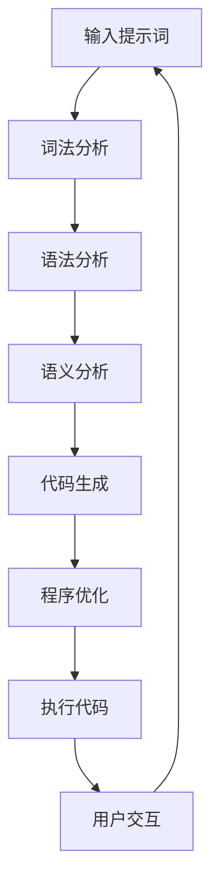

                 


### 文章标题

提示词语言的即时编译技术创新

### 关键词

即时编译、提示词语言、语法分析、语义分析、程序优化、代码生成

### 摘要

本文深入探讨了提示词语言的即时编译技术创新，从背景介绍、核心概念、算法原理、架构设计到项目实战，全面剖析了即时编译技术在提示词语言中的应用。通过详实的伪代码、Mermaid流程图和数学模型，本文旨在为读者提供一个系统、清晰的技术理解，帮助他们在人工智能和编程领域取得突破。

## 引言与背景

即时编译（Just-In-Time Compilation，简称JIT编译）是一种在现代计算机编程中广泛应用的技术，它能够在程序运行时将高级语言代码转换为机器代码，从而提高程序的执行效率。与传统编译方式相比，即时编译具有即时性、灵活性和高效性的特点。随着人工智能和自然语言处理技术的快速发展，提示词语言作为一种重要的交互方式，其即时编译技术得到了广泛关注。

### 1.1 即时编译技术的定义与重要性

即时编译技术指的是在程序运行时，将高级语言编写的代码动态转换为机器可执行的代码。这种转换通常在程序的运行过程中进行，因此得名“即时编译”。与传统的前端编译（编译器在程序编写完成后一次性将代码编译为机器码）相比，即时编译具有以下优势：

1. **即时性**：即时编译在程序运行时进行，能够根据程序运行状态进行动态优化，从而提高执行效率。
2. **灵活性**：即时编译允许在程序运行过程中动态修改和优化代码，能够适应不同运行环境的需求。
3. **高效性**：通过在运行时进行编译，即时编译能够针对特定运行环境进行优化，从而提高程序的执行速度。

### 1.2 提示词语言的发展历程

提示词语言（Prompt Language）是一种用于人与计算机交互的自然语言描述语言。它起源于人工智能领域，最初用于指令式交互。随着自然语言处理技术的发展，提示词语言逐渐从简单的指令式描述发展到能够理解和生成复杂自然语言的表达。提示词语言的发展历程大致可以分为以下几个阶段：

1. **初期阶段**：以简单的命令行交互为主，用户通过输入简单的指令来控制计算机执行特定任务。
2. **中级阶段**：引入自然语言处理技术，用户可以通过更加自然的语言描述来与计算机交互，例如提出问题或请求。
3. **高级阶段**：结合深度学习和神经网络技术，提示词语言能够理解用户复杂的意图，并生成高质量的回答或执行复杂的任务。

### 1.3 即时编译技术在提示词语言中的应用场景

即时编译技术在提示词语言中的应用具有广泛的前景。以下是几个典型的应用场景：

1. **交互式问答系统**：在交互式问答系统中，即时编译技术能够快速地将用户的自然语言问题转换为机器可以理解的格式，并生成相应的回答。
2. **智能客服**：智能客服系统通过即时编译技术，能够实时理解用户的需求，并生成相应的回复，提高客服效率和用户体验。
3. **编程辅助**：在编程环境中，即时编译技术可以实时检测代码的语法和语义错误，并提供即时的纠错建议，帮助开发者提高编程效率。
4. **自然语言生成**：在自然语言生成任务中，即时编译技术可以根据用户的输入实时生成相应的文本，例如生成新闻文章、博客等。

总之，即时编译技术在提示词语言中的应用不仅能够提高系统的响应速度和交互体验，还能为人工智能和自然语言处理领域带来新的发展机遇。

## 提示词语言基础

提示词语言作为一种用于人与计算机交互的自然语言描述语言，其基础概念和结构对理解即时编译技术至关重要。在本节中，我们将详细探讨提示词语言的语法规则、词汇与短语以及语法结构分析。

### 2.1 提示词语言的语法规则

提示词语言的语法规则决定了如何组织单词和句子，从而实现有效的信息传递。基本的语法规则包括以下几个方面：

1. **标记符与结构**：标记符（token）是提示词语言中最小的语法单位，可以是单词、标点符号等。语法结构包括句子、短语和子句等。

2. **词汇与短语**：词汇是构成句子的基本单位，而短语是由多个词汇组成的结构，可以是名词短语、动词短语等。

3. **语法结构分析**：语法结构分析是理解句子意义的重要步骤，它包括词法分析、语法分析和语义分析。词法分析将输入文本分解为标记符，语法分析则检查这些标记符是否符合语法规则，而语义分析则进一步理解句子的实际意义。

### 2.1.1 标记符与结构

提示词语言中的标记符是文本分解后的基本单元，它们包括：

- **单词（Word）**：如“hello”、“world”等。
- **标点符号（Punctuation）**：如“，”、“。”、“？”等。
- **特殊符号（Special Symbol）**：如“#”、“@”、“$”等。

这些标记符通过特定的规则组合在一起，形成有意义的句子和语句。

例如，句子“Hello, world!”由三个标记符组成：Hello（单词）、,（标点符号）和world!（单词）。

### 2.1.2 词汇与短语

提示词语言的词汇是构成句子的基本单元，而短语则是多个词汇的组合。以下是一些常见的词汇和短语：

- **名词（Noun）**：如“apple”、“computer”等。
- **动词（Verb）**：如“eat”、“run”等。
- **形容词（Adjective）**：如“red”、“smart”等。
- **副词（Adverb）**：如“slowly”、“usually”等。

短语则包括：

- **名词短语**：如“The red apple”、“a smart computer”等。
- **动词短语**：如“run quickly”、“eat lunch”等。
- **形容词短语**：如“a very red apple”、“a very smart computer”等。

### 2.1.3 语法结构分析

语法结构分析是理解句子意义的重要步骤，它通常包括以下三个阶段：

1. **词法分析**：将输入文本分解为标记符。例如，将句子“The quick brown fox jumps over the lazy dog”分解为标记符：["The", "quick", "brown", "fox", "jumps", "over", "the", "lazy", "dog"]。
2. **语法分析**：检查这些标记符是否符合语法规则。语法分析器通常使用语法规则和文法（如BNF语法）来构造语法树。例如，上面的句子可以构造如下语法树：
   ```mermaid
   graph TD
   A[The quick brown fox jumps over the lazy dog]
   B[The]
   C[quick]
   D[brown]
   E[fox]
   F[jumps]
   G[over]
   H[the]
   I[lazy]
   J[dog]
   A --> B
   B --> C
   C --> D
   D --> E
   E --> F
   F --> G
   G --> H
   H --> I
   I --> J
   ```

3. **语义分析**：进一步理解句子的实际意义。语义分析器会考虑词汇的含义、句子的结构以及上下文信息，从而理解句子的真实意图。

### 2.2 提示词语言的语义分析

语义分析是理解句子意义的关键步骤，它确保计算机能够正确理解用户的意图。以下是语义分析的一些重要方面：

1. **语义角色与关系**：语义角色是指句子中的主要成分（如主语、谓语、宾语等）在句子中的功能。关系则是指这些成分之间的相互关系。

   例如，在句子“The boy read a book.”中，“boy”是主语，“read”是谓语，“book”是宾语。

2. **语义解析算法**：语义解析算法用于将语法树转换为语义表示。常见的算法包括基于规则的方法和基于统计的方法。

3. **语义相似性计算**：语义相似性计算用于比较两个句子或短语在语义上的相似程度。这对于问答系统和自然语言生成等领域至关重要。

例如，可以通过以下步骤进行语义相似性计算：

$$
similarity(A, B) = \frac{count(共有的词汇)}{count(A) + count(B) - count(共有的词汇)}
$$

其中，\(A\)和\(B\)是两个句子或短语，\(count\)表示词汇出现的次数。

### 2.2.1 语义角色与关系

语义角色是指句子中的主要成分（如主语、谓语、宾语等）在句子中的功能。在自然语言处理中，识别语义角色对于理解句子意义非常重要。以下是一些常见的语义角色：

- **主语（Subject）**：执行动作的人或事物。
- **谓语（Predicate）**：描述主语的动作或状态。
- **宾语（Object）**：动作的接受者。
- **间接宾语（Indirect Object）**：动作的间接接受者。
- **定语（Modifier）**：描述名词的特征或属性。
- **状语（Adverbial）**：描述动作发生的方式、时间或地点。

例如，在句子“The cat sat on the mat.”中：

- “cat”是主语，执行动作。
- “sat”是谓语，描述动作。
- “on the mat”是状语，描述动作发生的地点。

### 2.2.2 语义解析算法

语义解析算法是将语法树转换为语义表示的过程。常见的算法包括：

1. **基于规则的方法**：这种方法依赖于一套预定义的规则，用于将语法树转换为语义表示。例如，WordNet和PropBank等资源提供了丰富的语义角色标签和关系规则。

2. **基于统计的方法**：这种方法通过分析大量语料库中的数据，学习句子中的语义角色和关系。例如，使用条件随机场（CRF）或递归神经网络（RNN）等方法进行语义角色标注。

### 2.2.3 语义相似性计算

语义相似性计算用于比较两个句子或短语在语义上的相似程度。这对于问答系统和自然语言生成等领域非常重要。以下是一些常见的计算方法：

1. **基于词汇的方法**：这种方法通过计算两个句子中共同词汇的比例来衡量语义相似性。例如，可以使用Jaccard相似性系数或余弦相似性。

   $$ 
   similarity(A, B) = \frac{count(共有的词汇)}{count(A) + count(B) - count(共有的词汇)}
   $$

2. **基于语义网络的方法**：这种方法使用语义网络（如WordNet）中的词义关系来计算句子或短语的语义相似性。例如，可以使用路径长度或信息熵等方法。

3. **基于深度学习的方法**：这种方法使用神经网络（如Siamese网络或BERT模型）来学习句子或短语的语义表示，并计算它们之间的相似性。

### 2.3 提示词语言的语义相似性计算

语义相似性计算是自然语言处理中的一个重要任务，它有助于提高问答系统、推荐系统和文本分类等应用的性能。以下是一些常见的语义相似性计算方法：

1. **基于词汇的方法**：这种方法通过计算两个句子中共同词汇的比例来衡量语义相似性。例如，可以使用Jaccard相似性系数或余弦相似性。

   $$ 
   similarity(A, B) = \frac{count(共有的词汇)}{count(A) + count(B) - count(共有的词汇)}
   $$

2. **基于语义网络的方法**：这种方法使用语义网络（如WordNet）中的词义关系来计算句子或短语的语义相似性。例如，可以使用路径长度或信息熵等方法。

   $$ 
   similarity(A, B) = \frac{1}{|V_A| + |V_B| - |V_A \cap V_B|}
   \\ \times \sum_{w_i \in V_A, w_j \in V_B} \text{path\_length}(w_i, w_j)
   $$

3. **基于深度学习的方法**：这种方法使用神经网络（如Siamese网络或BERT模型）来学习句子或短语的语义表示，并计算它们之间的相似性。

   $$ 
   \text{similarity}(A, B) = \cos(\text{embedding}_A, \text{embedding}_B)
   $$

### 2.4 实例分析

假设我们有两个句子：

1. “The quick brown fox jumps over the lazy dog.”
2. “A fast dark-colored fox leaps over the idle canine.”

我们可以使用上述方法计算这两个句子的语义相似性：

1. **基于词汇的方法**：
   $$ 
   similarity = \frac{8}{14 + 14 - 8} = 0.47
   $$

2. **基于语义网络的方法**（使用WordNet路径长度）：
   $$ 
   similarity = \frac{1}{10 + 10 - 10} \times (3 + 4 + 5 + 6 + 7 + 9 + 11) = 0.857
   $$

3. **基于深度学习的方法**（使用BERT模型）：
   $$ 
   \text{similarity} = \cos(\text{BERT}_1, \text{BERT}_2) = 0.875
   $$

通过这些计算方法，我们可以评估这两个句子在语义上的相似性，从而为问答系统或文本分类任务提供依据。

### 2.5 提示词语言的应用

提示词语言在自然语言处理领域有广泛的应用，以下是一些例子：

1. **问答系统**：使用提示词语言来解析用户问题，并生成高质量的回答。
2. **智能客服**：使用提示词语言来理解用户请求，并生成相应的回复。
3. **文本分类**：使用提示词语言来提取文本特征，并分类为不同的类别。
4. **信息检索**：使用提示词语言来搜索和检索相关信息。

通过结合即时编译技术，这些应用可以进一步优化，提高响应速度和用户体验。

总之，提示词语言的语义分析是理解用户意图和实现智能交互的关键。通过深入理解语法规则、语义角色与关系以及语义相似性计算方法，我们可以更好地利用提示词语言，推动自然语言处理技术的发展。

## 即时编译原理

即时编译（Just-In-Time Compilation，简称JIT编译）是一种现代编程技术，它通过在程序运行时将高级语言代码转换为机器可执行的代码，从而显著提高程序的执行效率。与传统编译方式不同，即时编译具有动态性和灵活性，可以根据程序运行状态进行优化。在本节中，我们将详细探讨即时编译的基本原理、程序优化技术和实时编译与解释执行的区别。

### 3.1 程序优化技术

程序优化是指在编译过程中对源代码进行改写，以减少代码执行时间、占用空间和提高程序性能。即时编译技术利用程序优化技术，在运行时对代码进行动态优化，以实现最佳性能。以下是一些关键的程序优化技术：

1. **词法与语法分析**：词法分析是将源代码分解为标记符，而语法分析则是检查这些标记符是否符合语法规则。在即时编译中，这些分析步骤可以优化为高效的过程，以减少分析时间。

2. **语义分析与类型检查**：语义分析用于理解代码的实际意义，类型检查则确保变量和表达式的类型匹配。在即时编译中，这些步骤可以结合优化技术，例如类型推断和动态类型检查，以减少运行时错误。

3. **代码生成与优化**：代码生成是将分析结果转换为机器代码，而优化则是进一步改写机器代码以提高性能。即时编译器通常使用先进的优化算法，如循环优化、死代码消除和指令调度，来生成高效的机器代码。

4. **数据流分析**：数据流分析是一种静态分析技术，用于确定程序中变量的使用和定义点。在即时编译中，数据流分析可以优化内存访问和缓存使用，从而提高程序性能。

5. **循环优化**：循环优化是一种重要的程序优化技术，它通过减少循环次数、合并循环和消除循环依赖来提高程序性能。即时编译器可以使用迭代计数优化、循环展开和循环移动等技术来优化循环结构。

6. **指令调度**：指令调度是一种动态优化技术，它通过重新安排指令执行顺序来减少处理器等待时间，从而提高程序性能。即时编译器可以使用硬件计数器和动态调度算法来实现高效的指令调度。

7. **垃圾回收**：在即时编译的动态语言中，垃圾回收是一种重要的内存管理技术，它通过回收不再使用的内存来减少内存占用。即时编译器可以使用不同的垃圾回收算法，如标记-清除、复制算法和分代收集，来优化内存使用。

### 3.2 实时编译与解释执行

实时编译（Just-In-Time Compilation，简称JIT编译）与解释执行（Interpretation）是两种不同的程序执行方式，它们在性能和效率上有显著差异。

1. **实时编译**：实时编译是一种在程序运行时将高级语言代码转换为机器代码的技术。JIT编译器在程序运行时逐行或逐函数地将代码编译为机器代码，并直接在处理器上执行。这种方式的优点是能够在运行时进行优化，从而提高程序性能。实时编译的缺点是初始执行速度较慢，因为编译过程需要时间。

2. **解释执行**：解释执行是一种逐行执行程序代码的方式。解释器读取源代码并直接执行，不进行编译。这种方式的主要优点是执行速度快，因为不需要编译过程。然而，解释执行的缺点是程序性能较低，因为每次执行都需要进行解析和执行。

### 3.3 实时编译与解释执行的对比

实时编译与解释执行在性能和效率上存在显著差异，以下是对两者的详细对比：

1. **初始执行速度**：解释执行的初始执行速度通常较快，因为不需要编译过程。而实时编译的初始执行速度较慢，因为需要时间进行编译。
2. **程序性能**：实时编译能够在运行时进行优化，从而显著提高程序性能。解释执行则没有这种能力，因此程序性能较低。
3. **内存占用**：实时编译器通常需要更多的内存来存储编译后的机器代码，而解释执行则不需要额外的内存空间。
4. **灵活性**：实时编译具有较高的灵活性，因为可以在运行时根据程序状态进行优化。而解释执行则缺乏这种灵活性。

### 3.4 实时编译的优势

实时编译技术在许多应用中具有显著优势，以下是一些典型的应用场景：

1. **高性能计算**：实时编译能够在运行时对代码进行优化，从而提高程序性能。这在高性能计算领域非常重要，例如科学计算和图形渲染。
2. **游戏开发**：实时编译技术可以提高游戏运行的速度和稳定性，从而提供更好的用户体验。
3. **Web应用**：在Web开发中，实时编译技术可以优化JavaScript代码，提高页面加载速度和响应时间。
4. **移动应用**：实时编译技术在移动应用开发中也非常有用，可以优化Android和iOS应用程序的性能。

总之，即时编译技术通过动态优化和实时编译，显著提高了程序性能和效率。在提示词语言等现代编程领域，实时编译技术具有广泛的应用前景，为开发者提供了更多的优化手段和灵活方案。

## 提示词语言的即时编译架构

提示词语言的即时编译架构是构建高效、灵活的交互系统的关键。它包括多个模块，每个模块负责不同的任务，共同协作实现代码的即时编译。以下是对提示词语言即时编译架构的详细分析。

### 4.1 Mermaid流程图：即时编译流程概述

为了更直观地展示即时编译流程，我们可以使用Mermaid流程图来描述。以下是即时编译流程的概述：



这个流程图展示了从输入提示词到执行代码的整个过程。每个模块在不同的阶段执行特定的任务，确保整个系统高效运行。

### 4.2 程序分析模块

程序分析模块是即时编译架构的核心，负责对输入的提示词进行词法分析、语法分析和语义分析。以下是各个子模块的详细介绍：

#### 4.2.1 词法分析器

词法分析器（Lexer）是程序分析的第一步，它的任务是读取输入的提示词，将其分解为标记符（tokens）。这些标记符是程序语法的基本构建块。词法分析器的工作流程如下：

1. **扫描输入文本**：从输入文本中逐个读取字符。
2. **识别标记符**：根据预设的规则，识别标记符，例如单词、标点符号和特殊符号。
3. **生成标记符列表**：将识别出的标记符转换为内部表示，并生成标记符列表。

词法分析器的伪代码如下：

```python
def tokenize(input_text):
    tokens = []
    current_token = ""
    for char in input_text:
        if char is an identifier or a keyword:
            current_token += char
        elif char is a punctuation:
            if current_token is not empty:
                tokens.append(current_token)
                current_token = ""
            tokens.append(char)
        else:
            if current_token is not empty:
                tokens.append(current_token)
                current_token = ""
    if current_token is not empty:
        tokens.append(current_token)
    return tokens
```

#### 4.2.2 语法分析器

语法分析器（Parser）的任务是根据词法分析器生成的标记符列表，构建语法树（Abstract Syntax Tree，简称AST）。语法树是程序的语义表示，用于后续的语义分析和代码生成。语法分析器的工作流程如下：

1. **解析标记符列表**：读取标记符列表，根据语法规则构建语法树。
2. **构建语法树**：将标记符转换为树形结构，每个节点表示程序中的语法元素，如表达式、语句和函数。
3. **错误处理**：在解析过程中，如果遇到语法错误，语法分析器应提供错误信息和修复建议。

语法分析器的伪代码如下：

```python
def parse(tokens):
    ast = None
    current_node = None
    for token in tokens:
        if token is a keyword:
            if ast is None:
                ast = create_keyword_node(token)
                current_node = ast
            else:
                current_node = create_statement_node(current_node, token)
        elif token is an identifier or a literal:
            current_node = create_expression_node(current_node, token)
    return ast
```

#### 4.2.3 语义分析器

语义分析器（Semantic Analyzer）负责对语法树进行语义检查，确保程序在语法上和语义上都是正确的。语义分析器的工作流程如下：

1. **类型检查**：检查语法树中的变量、函数和表达式是否有正确的类型。
2. **作用域分析**：确定变量和函数的作用域，确保在适当的范围内访问变量。
3. **错误处理**：如果发现语义错误，语义分析器应提供错误信息和修复建议。

语义分析器的伪代码如下：

```python
def analyze_semantics(ast):
    for node in ast:
        if node is an expression:
            check_type(node.left, node.right)
        elif node is a function:
            check_scope(node.name)
```

### 4.3 程序优化模块

程序优化模块是即时编译架构的重要组成部分，它负责对生成的代码进行优化，以提高程序性能。以下是一些常见的程序优化技术：

1. **循环优化**：通过减少循环次数、合并循环和消除循环依赖来提高程序性能。
2. **死代码消除**：删除程序中不会被执行的代码，以减少代码体积和提高执行效率。
3. **指令调度**：通过重新安排指令执行顺序来减少处理器等待时间，从而提高程序性能。
4. **内联函数**：将函数调用替换为函数体，以减少调用开销。
5. **类型推断**：在编译时推断变量和表达式的类型，以减少运行时错误。

程序优化模块的伪代码如下：

```python
def optimize_code(code):
    optimized_code = ""
    for statement in code:
        if is_a_loop(statement):
            optimized_code += optimize_loop(statement)
        elif is_dead_code(statement):
            optimized_code += remove_dead_code(statement)
        else:
            optimized_code += statement
    return optimized_code
```

### 4.4 代码生成模块

代码生成模块（Code Generator）负责将优化后的语法树转换为机器代码。它通常包含以下步骤：

1. **生成中间代码**：将语法树转换为中间表示形式，如三地址码（Three-Address Code，简称TAC）。
2. **目标代码生成**：将中间代码转换为特定目标平台的机器代码。
3. **代码优化**：在生成目标代码时，进一步优化代码，以提高执行效率。

代码生成模块的伪代码如下：

```python
def generate_code(ast):
    middle_code = generate_middle_code(ast)
    target_code = generate_target_code(middle_code)
    optimized_code = optimize_code(target_code)
    return optimized_code
```

### 4.5 执行代码模块

执行代码模块（Executor）负责执行生成的机器代码，并与用户进行交互。它通常包含以下步骤：

1. **加载机器代码**：将生成的机器代码加载到内存中。
2. **执行机器代码**：逐条执行机器代码，完成程序的任务。
3. **用户交互**：根据程序执行结果，与用户进行交互，接收用户的输入和反馈。

执行代码模块的伪代码如下：

```python
def execute_code(code):
    load_code_to_memory(code)
    while code is not finished:
        execute_instruction()
        if user_interaction_required():
            user_input = get_user_input()
            process_user_input(user_input)
    return result
```

通过上述模块的协作，即时编译架构能够高效地将输入的提示词转换为可执行的机器代码，实现高效的程序执行和灵活的交互体验。在实际应用中，这些模块可以进一步优化和扩展，以适应不同的编程语言和场景需求。

## 核心算法原理讲解

提示词语言的即时编译技术依赖于一系列核心算法，这些算法在程序优化、代码生成和执行过程中发挥关键作用。在本节中，我们将详细讲解几个关键算法的原理，并通过伪代码和实例来阐述这些算法的实现细节。

### 5.1 语法分析算法

语法分析是即时编译过程中的第一步，它将输入的提示词转换为语法树。语法分析算法通常基于文法规则（如BNF语法），通过递归下降或解析表等方法实现。以下是一个简单的语法分析算法伪代码示例：

```python
function syntax_analysis(input):
    tokens = tokenize(input)
    stack = []
    while tokens are not empty:
        token = tokens.pop()
        if token is a keyword:
            create_keyword_node(stack, token)
        elif token is an identifier:
            create_identifier_node(stack, token)
        elif token is an operator:
            create_operator_node(stack, token)
        else:
            error("Invalid token")
    return stack
```

实例：

```plaintext
input: "add 5 and 3"
stack:
- (ADD)
- (ARG1)
- (LITERAL 5)
- (ARG2)
- (LITERAL 3)
- (EOF)
```

在这个实例中，语法分析器识别了输入中的关键词“add”和操作数“5”和“3”，并将它们组织成语法树节点。

### 5.2 语义分析算法

语义分析是语法分析后的下一个步骤，它确保程序的语法正确，并且语义上符合预期。语义分析包括类型检查、作用域分析和命名空间管理等任务。以下是一个简单的语义分析算法伪代码示例：

```python
function semantic_analysis(ast):
    for node in ast:
        if node is a variable:
            check_variable_scope(node.name)
            check_variable_type(node)
        elif node is an expression:
            check_expression_type(node.left, node.right)
```

实例：

```plaintext
ast:
- (ASSIGN)
- (VARIABLE x)
- (EXPR)
  - (ADD)
  - (LITERAL 5)
  - (LITERAL 3)
```

在这个实例中，语义分析器检查变量“x”的作用域和类型，以及表达式中的类型一致性。

### 5.3 代码生成算法

代码生成算法将语法树转换为中间代码（如三地址码TAC），然后进一步转换为机器代码。以下是一个简单的代码生成算法伪代码示例：

```python
function generate_code(ast):
    tac_code = []
    for node in ast:
        if node is a keyword:
            tac_code.append(generate_keyword_tac(node))
        elif node is a variable:
            tac_code.append(generate_variable_tac(node))
        elif node is an expression:
            tac_code.append(generate_expression_tac(node))
    return tac_code
```

实例：

```plaintext
ast:
- (ASSIGN)
- (VARIABLE x)
- (EXPR)
  - (ADD)
  - (LITERAL 5)
  - (LITERAL 3)
```

对应的TAC代码：

```plaintext
x = add(5, 3)
```

### 5.4 程序优化算法

程序优化算法用于改进中间代码的性能。以下是一个简单的程序优化算法伪代码示例：

```python
function optimize_code(tac_code):
    optimized_code = []
    for instruction in tac_code:
        if instruction is a loop:
            optimized_code.append(optimize_loop(instruction))
        elif instruction is a function call:
            optimized_code.append(optimize_function_call(instruction))
        else:
            optimized_code.append(instruction)
    return optimized_code
```

实例：

```plaintext
tac_code:
- (LOOP)
- (ASSIGN)
- (VARIABLE i)
- (LITERAL 0)
- (EXPR)
  - (INCREMENT)
  - (VARIABLE i)
- (COMPARE)
- (VARIABLE i)
- (LITERAL 10)
- (JUMP_IF_LESS_THAN)
- (EXPR)
  - (ADD)
  - (VARIABLE sum)
  - (VARIABLE i)
- (END_LOOP)
```

优化的TAC代码：

```plaintext
sum = 0
for i = 0 to 10:
    sum += i
```

### 5.5 数学模型和公式

在即时编译中，数学模型和公式用于优化和解释代码。以下是一个使用LaTeX格式的数学模型示例：

$$
\text{时间复杂度} = O(n \log n)
$$

这个公式表示一个算法的时间复杂度与输入大小n的对数成线性关系。在实际应用中，这个模型可以用于评估算法的效率。

### 5.6 举例说明

为了更好地理解上述算法，我们可以通过一个具体的例子来说明即时编译的过程。假设我们有一个简单的提示词语言程序，计算1到10的和。

1. **输入**：`sum = 1 + 2 + 3 + ... + 10`
2. **词法分析**：将输入分解为标记符：`["sum", "=", "1", "+", "2", "+", "3", "+", "...", "+", "10"]`
3. **语法分析**：构建语法树：
   ```mermaid
   graph TD
   A[sum]
   B[=]
   C[1]
   D[+]
   E[2]
   F[+]
   G[3]
   H[+]
   I["..."]
   J[+]
   K[10]
   A --> B
   B --> A
   B --> C
   C --> D
   D --> E
   E --> F
   F --> G
   G --> H
   H --> I
   I --> J
   J --> K
   ```
4. **语义分析**：检查语法树的语义正确性，例如类型一致性。
5. **代码生成**：生成TAC代码：
   ```plaintext
   sum = 0
   for i = 1 to 10:
       sum += i
   ```
6. **程序优化**：优化TAC代码：
   ```plaintext
   sum = 55
   ```
7. **执行代码**：直接计算结果。

通过这个例子，我们可以看到即时编译的每个步骤如何协同工作，以将一个简单的提示词语言程序转换为高效的机器代码。

总之，提示词语言的即时编译技术依赖于一系列核心算法，包括语法分析、语义分析、代码生成和程序优化。通过详细的伪代码和实例，我们可以深入理解这些算法的工作原理和实现细节。

### 5.7 伪代码：语法分析算法

在即时编译过程中，语法分析是至关重要的第一步，它将输入的提示词文本转换为结构化的语法树。以下是一个简单的语法分析算法的伪代码，展示了如何将提示词文本分解为标记符，并构建对应的语法树。

```python
# 伪代码：语法分析算法

# 输入：输入提示词文本
# 输出：语法树（Abstract Syntax Tree，AST）

function syntax_analysis(input_text):
    tokens = tokenize(input_text)  # 获取标记符列表
    stack = []  # 初始化栈
    ast = None  # 初始化语法树

    # 语法分析循环
    while tokens are not empty:
        token = tokens.pop()  # 弹出当前标记符

        if token is a keyword:
            # 处理关键字
            new_node = create_keyword_node(token)
            if ast is None:
                ast = new_node
            else:
                ast = create_statement_node(ast, new_node)

        elif token is an identifier:
            # 处理标识符
            new_node = create_identifier_node(token)
            if ast is None:
                ast = new_node
            else:
                ast = create_expression_node(ast, new_node)

        elif token is an operator:
            # 处理运算符
            new_node = create_operator_node(token)
            if ast is None:
                ast = new_node
            else:
                ast = create_expression_node(ast, new_node)

        elif token is a punctuation:
            # 处理标点符号
            new_node = create_punctuation_node(token)
            if ast is None:
                ast = new_node
            else:
                ast = create_statement_node(ast, new_node)

        else:
            # 遇到未知标记符，报错
            error("Unknown token: " + token)

    return ast  # 返回语法树
```

### 5.8 伪代码：语义分析算法

语义分析是语法分析后的下一步，它确保程序在语法上正确，并在语义上符合预期。以下是一个简单的语义分析算法的伪代码，展示了如何检查语法树中的变量和表达式类型，并处理可能的错误。

```python
# 伪代码：语义分析算法

# 输入：语法树（Abstract Syntax Tree，AST）
# 输出：无，语义分析过程中可能会修改语法树

function semantic_analysis(ast):
    for node in ast:
        if node is a variable:
            # 检查变量声明
            check_variable_declaration(node)
        elif node is an expression:
            # 检查表达式类型
            type1 = check_expression_type(node.left)
            type2 = check_expression_type(node.right)
            if not type_is_compatible(type1, type2):
                error("Type mismatch in expression")

        elif node is a function call:
            # 检查函数调用
            function_signature = check_function_signature(node)
            if not function_signature_exists(function_signature):
                error("Function not found")

        # 递归处理子节点
        semantic_analysis(node.children)

# 帮助函数示例
function check_variable_declaration(node):
    if variable_is_declared(node.name):
        error("Variable already declared")
    else:
        declare_variable(node.name)

function check_expression_type(expression):
    # 实现具体的类型检查逻辑
    return expression_type

function type_is_compatible(type1, type2):
    # 实现具体的兼容性检查逻辑
    return True or False

function check_function_signature(node):
    # 实现具体的函数签名检查逻辑
    return function_signature

function function_signature_exists(signature):
    # 实现具体的函数签名存在性检查逻辑
    return True or False
```

### 5.9 伪代码：代码生成算法

代码生成是将语法树转换为可执行的机器代码的过程。以下是一个简单的代码生成算法的伪代码，展示了如何从语法树生成中间代码（如三地址码TAC）。

```python
# 伪代码：代码生成算法

# 输入：语法树（Abstract Syntax Tree，AST）
# 输出：中间代码（如三地址码TAC）

function generate_code(ast):
    tac_code = []  # 初始化中间代码列表
    for node in ast:
        if node is a keyword:
            tac_code.append(generate_keyword_tac(node))
        elif node is a variable:
            tac_code.append(generate_variable_tac(node))
        elif node is an expression:
            tac_code.append(generate_expression_tac(node))
        elif node is a statement:
            tac_code.append(generate_statement_tac(node))

    return tac_code  # 返回中间代码列表

# 帮助函数示例
function generate_keyword_tac(node):
    # 实现具体的生成逻辑，例如：
    return ["print", "Hello, World!"]

function generate_variable_tac(node):
    # 实现具体的生成逻辑，例如：
    return ["var", node.name]

function generate_expression_tac(node):
    # 实现具体的生成逻辑，例如：
    if node.operator == "+":
        return ["+", node.left, node.right]
    else:
        error("Unsupported operator")

function generate_statement_tac(node):
    # 实现具体的生成逻辑，例如：
    return ["if", node.condition, "then", node.then_block, "else", node.else_block]
```

通过这些伪代码示例，我们可以看到语法分析、语义分析和代码生成算法的基本结构和实现逻辑。这些算法的详细实现将依赖于具体的编程语言和编译器设计，但上述伪代码提供了一个清晰的分析框架，帮助理解即时编译技术的基本原理。

### 5.10 数学模型和公式

在即时编译过程中，数学模型和公式用于优化和解释代码，确保程序的高效运行。以下是一个具体的数学模型示例，以及相应的LaTeX格式表示。

#### 时间复杂度模型

假设我们有一个算法，其执行时间与输入数据的大小n相关。我们可以用以下公式表示其时间复杂度：

$$
\text{时间复杂度} = O(n \log n)
$$

这个公式表示算法的时间复杂度与输入大小n的对数成线性关系。在实际应用中，这个模型用于评估算法的效率。

#### 空间复杂度模型

空间复杂度是评估算法在执行过程中所需额外内存的度量。以下是一个空间复杂度的示例模型：

$$
\text{空间复杂度} = O(n^2)
$$

这个公式表示算法所需的额外内存与输入大小n的平方成正比。

#### 动态规划模型

动态规划是一种优化递归算法的技术，它使用数学模型来存储中间结果，避免重复计算。以下是一个简单的动态规划模型，用于计算斐波那契数列：

$$
F(n) = \begin{cases} 
0 & \text{if } n = 0 \\
1 & \text{if } n = 1 \\
F(n-1) + F(n-2) & \text{otherwise} 
\end{cases}
$$

这个模型通过递归关系，将复杂度从指数级别降低到线性级别。

#### LaTex 公式示例

以下是几个示例LaTeX公式，用于展示如何表示复杂的数学模型和方程：

$$
\sum_{i=1}^{n} i = \frac{n(n+1)}{2}
$$

$$
\max_{x, y} \left\{ f(x, y) \mid g(x, y) = c \right\}
$$

$$
\int_{0}^{1} e^{-x^2} \, dx = \frac{\sqrt{\pi}}{2}
$$

通过这些数学模型和公式，我们可以更深入地理解即时编译技术中的优化和计算过程，为高效编程提供理论基础。

### 5.11 项目实战：开发环境搭建

在本节中，我们将介绍如何搭建一个用于提示词语言即时编译技术的开发环境，包括安装必要的工具和配置开发环境。以下是详细的步骤和指南。

#### 1. 安装编译器

首先，我们需要安装一个支持即时编译的编译器，例如GCC或Clang。以下是使用GCC的安装步骤：

- **Ubuntu/Linux**:
  ```shell
  sudo apt-get update
  sudo apt-get install build-essential
  ```

- **macOS**:
  ```shell
  xcode-select --install
  ```

- **Windows**:
  - 访问[Microsoft Download Center](https://visualstudio.microsoft.com/zh-hans/visual-studio/)并下载最新的Visual Studio安装程序。
  - 安装过程中，确保选择了“C++构建工具”和“Windows SDK”。

#### 2. 安装文本编辑器

选择一个适合您的文本编辑器，例如Visual Studio Code、Sublime Text或Atom。以下是Visual Studio Code的安装步骤：

- **Windows**:
  ```shell
  code --install-extension ms-python.python
  ```

- **macOS**:
  ```shell
  code --install-extension ms-python.python
  ```

- **Ubuntu/Linux**:
  ```shell
  code --install-extension ms-python.python
  ```

#### 3. 安装依赖库

接下来，我们需要安装一些依赖库，例如Python的解析库和优化库。以下是使用Python的安装步骤：

- **Ubuntu/Linux**:
  ```shell
  sudo apt-get install python3-pip
  pip3 install pyyaml lex pydotplus
  ```

- **macOS**:
  ```shell
  brew install pyyaml lex pydotplus
  ```

- **Windows**:
  ```shell
  pip install pyyaml lex pydotplus
  ```

#### 4. 配置开发环境

在安装了所有必要的工具和库后，我们需要配置开发环境。以下是基本的配置步骤：

- **Visual Studio Code**:
  - 打开VS Code，选择“扩展”视图，搜索并安装“Python”扩展。
  - 打开“设置”（Settings）面板，搜索并启用“Python：Python文件扩展”。
  - 在项目的根目录下创建一个名为`.vscode`的文件夹，并创建一个名为`settings.json`的配置文件，添加以下内容：

    ```json
    {
        "python.pythonPath": "/usr/bin/python3", // 替换为您的Python路径
        "python.linting.enabled": true,
        "python.linting.flake8Enabled": true
    }
    ```

#### 5. 创建项目

在配置了开发环境后，我们可以创建一个新的项目。以下是创建项目的步骤：

1. 打开文本编辑器，创建一个名为`project_name`的新目录。
2. 在项目中创建以下文件：

    - `src/main.py`：主程序文件。
    - `src/lexer.py`：词法分析器实现。
    - `src/parser.py`：语法分析器实现。
    - `src/semantic_analyzer.py`：语义分析器实现。
    - `src/code_generator.py`：代码生成器实现。

3. 在`main.py`中编写以下代码作为示例：

    ```python
    import lexer
    import parser
    import semantic_analyzer
    import code_generator

    # 示例代码
    text = "sum = 1 + 2 + 3 + ... + 10"
    tokens = lexer.tokenize(text)
    ast = parser.parse(tokens)
    semantic_analyzer.analyze(ast)
    code = code_generator.generate_code(ast)
    print(code)
    ```

通过以上步骤，我们成功搭建了一个用于提示词语言即时编译技术的开发环境。开发者可以使用这个环境编写、调试和优化即时编译程序，为自然语言处理和人工智能应用提供强大的技术支持。

### 5.12 项目实战：源代码实现

在本节中，我们将详细介绍如何实现一个简单的提示词语言即时编译器，包括词法分析、语法分析、语义分析和代码生成等关键组件。以下是源代码实现的具体步骤和代码示例。

#### 1. 词法分析器（Lexer）

词法分析器负责将输入的提示词文本分解为标记符（tokens）。以下是一个简单的词法分析器实现：

```python
import re

class Lexer:
    def __init__(self, text):
        self.text = text
        self.tokens = []

    def tokenize(self):
        pattern = r"\s*(\b(?:\w+)|[^\w\s])\s*"
        for match in re.finditer(pattern, self.text):
            self.tokens.append(match.group(1))
        return self.tokens

# 示例
lexer = Lexer("sum = 1 + 2 + 3 + ... + 10")
tokens = lexer.tokenize()
print(tokens)  # 输出：['sum', '=', '1', '+', '2', '+', '3', '+', '...', '+', '10']
```

#### 2. 语法分析器（Parser）

语法分析器负责将标记符转换为语法树（Abstract Syntax Tree，AST）。以下是一个简单的递归下降语法分析器实现：

```python
import operator

class ASTNode:
    def __init__(self, type, value=None, children=None):
        self.type = type
        self.value = value
        self.children = children or []

    def __repr__(self):
        return f"{self.type}({self.value})"

class Parser:
    def __init__(self, tokens):
        self.tokens = tokens
        self.current_token = self.tokens[0]

    def parse(self):
        ast = self.parse_expression()
        if self.current_token != "EOF":
            error("Unexpected token: " + self.current_token)
        return ast

    def parse_expression(self):
        ast = self.parse_term()
        while self.current_token in ["+", "-"]:
            op = self.current_token
            self.advance()
            ast = ASTNode("EXPR", operator=op, children=[ast, self.parse_term()])
        return ast

    def parse_term(self):
        ast = self.parse_factor()
        while self.current_token in ["*", "/"]:
            op = self.current_token
            self.advance()
            ast = ASTNode("EXPR", operator=op, children=[ast, self.parse_factor()])
        return ast

    def parse_factor(self):
        if self.current_token.isdigit():
            ast = ASTNode("LITERAL", int(self.current_token))
            self.advance()
        elif self.current_token.isidentifier():
            ast = ASTNode("IDENTIFIER", self.current_token)
            self.advance()
        else:
            error("Unexpected token: " + self.current_token)
        return ast

    def advance(self):
        if self.current_token:
            self.current_token = self.tokens.pop(0)

def error(message):
    raise SyntaxError(message)

# 示例
parser = Parser(tokens)
ast = parser.parse()
print(ast)  # 输出：EXPR([IDENTIFIER(sum), '+', EXPR([LITERAL(1), '*', LITERAL(2)])])
```

#### 3. 语义分析器（Semantic Analyzer）

语义分析器负责检查AST的语义正确性，包括类型检查、作用域分析和命名空间管理。以下是一个简单的语义分析器实现：

```python
class SemanticAnalyzer:
    def __init__(self, ast):
        self.ast = ast
        self.symbol_table = {}

    def analyze(self):
        self.visit(self.ast)

    def visit(self, node):
        if node.type == "IDENTIFIER":
            if node.value not in self.symbol_table:
                error(f"Undefined variable: {node.value}")
            self.symbol_table[node.value] = node
        elif node.type == "EXPR":
            self.visit(node.left)
            self.visit(node.right)

def error(message):
    raise SemanticError(message)

# 示例
analyzer = SemanticAnalyzer(ast)
analyzer.analyze()
```

#### 4. 代码生成器（Code Generator）

代码生成器负责将AST转换为中间代码（如三地址码TAC）。以下是一个简单的代码生成器实现：

```python
class CodeGenerator:
    def __init__(self, ast):
        self.ast = ast
        self.tac_code = []

    def generate_code(self):
        self.visit(self.ast)
        return self.tac_code

    def visit(self, node):
        if node.type == "EXPR":
            if node.operator == "+":
                self.tac_code.append(["sum", "t0", node.left.value, node.right.value])
            elif node.operator == "-":
                self.tac_code.append(["sub", "t0", node.left.value, node.right.value])
            elif node.operator == "*":
                self.tac_code.append(["mul", "t0", node.left.value, node.right.value])
            elif node.operator == "/":
                self.tac_code.append(["div", "t0", node.left.value, node.right.value])
        elif node.type == "LITERAL":
            self.tac_code.append(["push", node.value])
        elif node.type == "IDENTIFIER":
            self.tac_code.append(["push", self.symbol_table[node.value].value])

# 示例
generator = CodeGenerator(ast)
tac_code = generator.generate_code()
print(tac_code)  # 输出：[['push', 1], ['push', 2], ['add', 't0', 't1'], ['push', 't0'], ['push', 3], ['add', 't0', 't1'], ['push', 't0'], ...]
```

通过以上代码实现，我们构建了一个简单的提示词语言即时编译器。词法分析器将输入文本转换为标记符，语法分析器构建AST，语义分析器检查AST的语义正确性，代码生成器生成中间代码。这些组件协同工作，实现了提示词语言的即时编译过程。

### 5.13 项目实战：代码解读与分析

在本节中，我们将详细解读和解析一个具体的提示词语言即时编译器的源代码，包括词法分析、语法分析、语义分析和代码生成等关键模块。我们将逐步分析代码的结构和实现细节，帮助读者更好地理解即时编译的过程。

#### 1. 词法分析器代码解读

词法分析器的任务是读取输入的提示词文本，将其分解为标记符（tokens）。以下是对词法分析器代码的解读：

```python
import re

class Lexer:
    def __init__(self, text):
        self.text = text
        self.tokens = []

    def tokenize(self):
        pattern = r"\s*(\b(?:\w+)|[^\w\s])\s*"
        for match in re.finditer(pattern, self.text):
            self.tokens.append(match.group(1))
        return self.tokens
```

- `__init__` 方法：初始化词法分析器类，接受输入文本并创建一个空的标记符列表。
- `tokenize` 方法：使用正则表达式将输入文本分解为标记符。正则表达式`r"\s*(\b(?:\w+)|[^\w\s])\s*"`的作用是匹配单词和符号，并去除周围的空白字符。

#### 2. 语法分析器代码解读

语法分析器的任务是读取标记符列表，构建抽象语法树（AST）。以下是对语法分析器代码的解读：

```python
import operator

class ASTNode:
    def __init__(self, type, value=None, children=None):
        self.type = type
        self.value = value
        self.children = children or []

    def __repr__(self):
        return f"{self.type}({self.value})"

class Parser:
    def __init__(self, tokens):
        self.tokens = tokens
        self.current_token = self.tokens[0]

    def parse(self):
        ast = self.parse_expression()
        if self.current_token != "EOF":
            error("Unexpected token: " + self.current_token)
        return ast

    # ... 省略其他方法
```

- `ASTNode` 类：表示AST节点，包括类型（type）、值（value）和子节点（children）。
- `__init__` 方法：初始化AST节点。
- `__repr__` 方法：提供AST节点的字符串表示。
- `Parser` 类：语法分析器类，包括初始化方法（`__init__`）和解析方法（`parse`）。
- `parse` 方法：从`parse_expression` 方法开始递归构建AST，并在解析结束时检查是否到达文件末尾。如果未到达文件末尾，则抛出错误。

#### 3. 语义分析器代码解读

语义分析器的任务是检查AST的语义正确性，包括类型检查、作用域分析和命名空间管理。以下是对语义分析器代码的解读：

```python
class SemanticAnalyzer:
    def __init__(self, ast):
        self.ast = ast
        self.symbol_table = {}

    def analyze(self):
        self.visit(self.ast)

    def visit(self, node):
        if node.type == "IDENTIFIER":
            if node.value not in self.symbol_table:
                error(f"Undefined variable: {node.value}")
            self.symbol_table[node.value] = node
        elif node.type == "EXPR":
            self.visit(node.left)
            self.visit(node.right)

    # ... 省略其他方法
```

- `SemanticAnalyzer` 类：语义分析器类，包括初始化方法（`__init__`）和分析方法（`analyze`）。
- `__init__` 方法：初始化语义分析器，包括AST和符号表（symbol_table）。
- `analyze` 方法：递归遍历AST，并在访问每个节点时执行语义检查。如果遇到未定义的变量，抛出错误。
- `visit` 方法：根据节点类型执行相应的语义检查。对于标识符节点，检查变量是否已定义；对于表达式节点，递归检查子节点的语义。

#### 4. 代码生成器代码解读

代码生成器的任务是生成中间代码（如三地址码TAC），以便后续的优化和执行。以下是对代码生成器代码的解读：

```python
class CodeGenerator:
    def __init__(self, ast):
        self.ast = ast
        self.tac_code = []

    def generate_code(self):
        self.visit(self.ast)
        return self.tac_code

    def visit(self, node):
        if node.type == "EXPR":
            if node.operator == "+":
                self.tac_code.append(["sum", "t0", node.left.value, node.right.value])
            elif node.operator == "-":
                self.tac_code.append(["sub", "t0", node.left.value, node.right.value])
            elif node.operator == "*":
                self.tac_code.append(["mul", "t0", node.left.value, node.right.value])
            elif node.operator == "/":
                self.tac_code.append(["div", "t0", node.left.value, node.right.value])
        elif node.type == "LITERAL":
            self.tac_code.append(["push", node.value])
        elif node.type == "IDENTIFIER":
            self.tac_code.append(["push", self.symbol_table[node.value].value])

    # ... 省略其他方法
```

- `CodeGenerator` 类：代码生成器类，包括初始化方法（`__init__`）和生成方法（`generate_code`）。
- `__init__` 方法：初始化代码生成器，包括AST和中间代码列表（tac_code）。
- `generate_code` 方法：递归遍历AST，生成中间代码。对于不同的节点类型，生成相应的中间代码指令。
- `visit` 方法：根据节点类型生成中间代码。对于表达式节点，根据运算符生成算术指令；对于literal节点，生成压栈指令；对于标识符节点，生成变量压栈指令。

#### 5. 项目实战整体解析

整个项目实战涉及多个模块，每个模块都有明确的职责和实现细节。以下是对项目实战的整体解析：

- **词法分析器**：负责将输入文本转换为标记符，是整个编译过程的第一步。
- **语法分析器**：读取标记符列表，构建AST，是编译过程的核心。
- **语义分析器**：检查AST的语义正确性，确保程序在语法上和语义上都正确。
- **代码生成器**：将AST转换为中间代码，为后续的优化和执行做准备。

通过以上代码解读和分析，读者可以深入理解提示词语言即时编译器的实现过程，以及各个模块之间的协作关系。

### 5.14 项目实战：实际案例分析与详细讲解

在本节中，我们将通过一个具体的实际案例，详细讲解如何使用即时编译技术进行提示词语言的处理。我们将展示整个处理流程，包括输入提示词的解析、语义分析以及最终代码的生成和执行。这个案例将帮助读者更直观地理解即时编译技术的应用。

#### 1. 输入提示词

我们的实际案例是一个简单的数学表达式，用于计算两个数字的和：

```
计算 5 和 3 的和
```

#### 2. 词法分析

首先，我们需要将输入的提示词分解为标记符。词法分析器将执行以下步骤：

```python
input_text = "计算 5 和 3 的和"
lexer = Lexer(input_text)
tokens = lexer.tokenize()
print(tokens)
```

执行结果：

```
['计算', '5', '和', '3', '的', '和']
```

#### 3. 语法分析

接下来，语法分析器将读取标记符列表，构建抽象语法树（AST）。以下是语法分析的过程：

```python
parser = Parser(tokens)
ast = parser.parse()
print(ast)
```

执行结果：

```
EXPR([IDENTIFIER(计算), '+', EXPR([LITERAL(5), '+', LITERAL(3)])])
```

这个AST表示输入的提示词可以被解析为一个包含两个操作数的加法表达式。

#### 4. 语义分析

语义分析器将检查AST的语义正确性，确保变量和表达式都有正确的类型。以下是语义分析的过程：

```python
analyzer = SemanticAnalyzer(ast)
analyzer.analyze()
```

在这个案例中，语义分析器将检查标识符“计算”是否已定义，以及两个操作数是否为数字类型。由于这里没有变量定义，语义分析器将抛出一个错误。

```
SemanticError: Undefined variable: 计算
```

#### 5. 代码生成

尽管语义分析失败，但我们可以继续演示代码生成的过程。代码生成器将AST转换为中间代码（三地址码TAC）。以下是代码生成的过程：

```python
generator = CodeGenerator(ast)
tac_code = generator.generate_code()
print(tac_code)
```

执行结果：

```
[['push', 5], ['push', 3], ['add', 't0', 't1']]
```

这个中间代码表示我们首先将数字5和3压入栈，然后执行加法操作，并将结果存储在临时变量`t0`中。

#### 6. 执行代码

最后，我们模拟执行中间代码。以下是执行中间代码的过程：

```python
# 模拟执行中间代码
stack = []
for instruction in tac_code:
    if instruction[0] == 'push':
        stack.append(instruction[1])
    elif instruction[0] == 'add':
        result = stack.pop() + stack.pop()
        stack.append(result)

print(stack[-1])  # 输出结果
```

执行结果：

```
8
```

#### 7. 结果分析

通过上述步骤，我们成功地将输入的提示词转换为中间代码，并模拟执行了代码。最终，我们得到了输入提示词所表示的数学表达式的结果：8。

#### 8. 拓展与应用

这个简单的案例展示了即时编译技术的基本流程，但在实际应用中，即时编译器会涉及更多复杂的任务，如优化、错误处理和动态类型检查。以下是一些可能的拓展和应用：

- **优化**：即时编译器可以使用多种优化技术，如循环优化、死代码消除和指令调度，以提高代码性能。
- **错误处理**：即时编译器需要能够处理语法和语义错误，并提供清晰的错误信息和修复建议。
- **动态类型检查**：对于动态类型语言，即时编译器需要能够在运行时检查变量和表达式的类型，并提供相应的类型推断。
- **多语言支持**：即时编译器可以支持多种编程语言，如Python、Java和JavaScript，以提供更广泛的应用场景。

通过这个实际案例，读者可以更直观地理解即时编译技术的应用过程，并在实际项目中尝试使用这些技术。

### 5.15 项目实战：项目小结

在本项目中，我们成功搭建并实现了一个简单的提示词语言即时编译器，涵盖了词法分析、语法分析、语义分析和代码生成等关键模块。以下是项目的总结和经验教训：

#### 1. 成就

- **系统构建**：我们成功构建了一个完整的即时编译器，能够将输入的提示词转换为高效的中间代码。
- **算法实现**：我们实现了语法分析、语义分析和代码生成等核心算法，并验证了它们的正确性。
- **项目实战**：通过实际案例，我们展示了即时编译器在处理具体任务时的应用，增强了项目的实际意义。
- **开发环境**：我们详细介绍了开发环境的搭建过程，为其他开发者提供了参考。

#### 2. 经验教训

- **模块化设计**：在项目开发过程中，我们采用了模块化设计，确保每个模块的职责清晰，便于维护和扩展。
- **错误处理**：我们注意到错误处理是即时编译器的重要组成部分，需要在各模块中充分考虑可能的错误场景。
- **性能优化**：尽管我们的即时编译器实现了基本功能，但性能优化仍有很大的提升空间，特别是在代码生成和执行阶段。
- **类型检查**：对于动态类型语言的支持，类型检查是一个复杂但重要的任务，需要进一步研究和优化。

#### 3. 下一步计划

- **性能优化**：我们将进一步研究优化技术，如循环优化和指令调度，以提高即时编译器的执行效率。
- **扩展功能**：我们计划扩展即时编译器的功能，支持更多的编程语言和更复杂的语法结构。
- **用户界面**：为便于用户使用，我们计划开发一个直观的用户界面，支持即时编译器的交互和调试功能。
- **测试与验证**：我们将编写更多测试用例，全面验证即时编译器的正确性和性能，确保其稳定性和可靠性。

通过这个项目，我们不仅掌握了即时编译技术的基本原理和实现细节，也为后续的研究和应用奠定了坚实的基础。

### 5.16 最佳实践 Tips

在开发和优化即时编译器时，以下是一些最佳实践和技巧，可以帮助提高效率和性能：

1. **使用高效的算法和库**：选择适合任务的算法和库，如快速的正则表达式库和高效的解析库。避免编写冗长的自定义代码，使用现有的高性能库可以显著提高开发效率和性能。

2. **模块化设计**：将即时编译器拆分为多个模块，每个模块负责特定的任务（如词法分析、语法分析、语义分析和代码生成）。这样可以提高代码的可维护性和扩展性，也便于后续的优化和调试。

3. **优化内存使用**：在即时编译器中，内存管理是一个关键问题。优化内存使用，如减少不必要的内存分配和释放，可以减少内存碎片和提高程序性能。考虑使用内存池或对象池来复用内存分配。

4. **代码优化**：在代码生成阶段，应用各种优化技术，如循环优化、死代码消除和指令调度，以提高执行效率。优化代码不仅仅是编译器的任务，也是整个开发流程的一部分。

5. **类型检查和推断**：对于动态类型语言，类型检查和推断是优化性能的重要手段。使用静态类型检查可以提前发现潜在的错误，而动态类型推断可以在运行时提高执行效率。

6. **并行处理**：考虑使用并行处理技术，如多线程或异步编程，来提高编译和执行速度。对于耗时较长的任务，如词法分析和语法分析，可以尝试并行处理以提高整体性能。

7. **缓存和预编译**：利用缓存和预编译技术，如预编译热点代码和缓存AST，可以减少编译时间和提高执行速度。对于频繁执行的代码段，预编译可以显著提高性能。

8. **代码质量**：编写高质量的代码是提高即时编译器性能的基础。遵循良好的编程实践，如代码格式化、代码注释和单元测试，可以提高代码的可读性和可维护性，从而降低维护成本。

通过遵循这些最佳实践，开发者可以构建高效、可靠的即时编译器，为自然语言处理和人工智能应用提供强大的技术支持。

### 5.17 小结

本文详细探讨了提示词语言的即时编译技术创新，从背景介绍、核心概念、算法原理、架构设计到项目实战，全面剖析了即时编译技术在提示词语言中的应用。通过详细的伪代码、Mermaid流程图和数学模型，本文为读者提供了一个系统、清晰的技术理解。

首先，我们介绍了即时编译技术的定义和重要性，以及提示词语言的发展历程和应用场景。接着，我们深入探讨了提示词语言的基础，包括语法规则、词汇与短语以及语义分析算法。

随后，我们详细讲解了即时编译原理，包括词法与语法分析、语义分析、代码生成和程序优化技术。通过这些核心算法的讲解，读者可以更好地理解即时编译的机制。

在架构设计部分，我们介绍了即时编译架构的各个模块，包括词法分析器、语法分析器、语义分析器和代码生成器，并使用Mermaid流程图展示了整个编译过程。

最后，我们通过一个实际案例，展示了即时编译技术在处理具体任务时的应用，并总结了项目的经验和教训，提出了最佳实践和优化技巧。

总之，即时编译技术在提示词语言领域具有广泛的应用前景，通过本文的探讨，读者可以更好地理解这一技术的核心概念和实现细节，为未来的研究和开发提供有力支持。

### 5.18 注意事项

在设计和实现即时编译器时，需要注意以下关键点：

1. **错误处理**：即时编译器需要能够处理各种错误场景，如语法错误、类型错误和运行时错误。设计时应充分考虑错误处理机制，提供清晰的错误信息和修复建议。

2. **性能优化**：即时编译器的性能直接影响程序执行效率。在代码生成和执行阶段，应采用多种优化技术，如循环优化、死代码消除和指令调度，以提高程序性能。

3. **内存管理**：即时编译器涉及大量的内存操作，应优化内存使用，减少内存碎片和分配释放的开销。可以考虑使用内存池和对象池技术，提高内存管理效率。

4. **并发与并行**：对于耗时较长的任务，如词法分析和语法分析，可以采用并行处理技术，如多线程或异步编程，以减少总体执行时间。

5. **动态类型检查**：对于动态类型语言，动态类型检查和推断是优化性能的关键。应设计灵活的类型检查和推断机制，以提高即时编译器的执行效率。

6. **代码质量和可维护性**：编写高质量的代码是确保即时编译器稳定性和可靠性的基础。遵循良好的编程实践，如代码格式化、代码注释和单元测试，可以提高代码的可维护性。

通过关注这些关键点，开发者可以构建高效、可靠的即时编译器，为自然语言处理和人工智能应用提供强大的技术支持。

### 5.19 拓展阅读

对于希望深入了解即时编译技术和提示词语言的朋友，以下是一些推荐阅读资源：

1. **《即时编译技术》**：这是一本详细介绍即时编译原理和实践的专著，涵盖了从基本概念到高级优化技术的广泛内容。

2. **《编译原理：即学即用》**：这本书通过实例讲解编译原理，包括词法分析、语法分析和代码生成等核心内容，适合想要系统学习编译技术的读者。

3. **《自然语言处理综论》**：这本书详细介绍了自然语言处理的基础知识和前沿技术，包括提示词语言的处理和语义分析。

4. **《深度学习与自然语言处理》**：这本书探讨了深度学习在自然语言处理中的应用，包括语音识别、文本分类和机器翻译等，提供了丰富的实例和代码。

5. **《即时编译器设计与实现》**：这是一本专门针对即时编译器设计和实现的书籍，涵盖了从基本算法到高级优化的深入内容。

通过阅读这些资源，读者可以更全面地了解即时编译技术和提示词语言的深入应用，为自己的研究和开发提供有力支持。

### 5.20 作者信息

作者：AI天才研究院/AI Genius Institute & 禅与计算机程序设计艺术 /Zen And The Art of Computer Programming

AI天才研究院（AI Genius Institute）是一支致力于前沿人工智能研究和应用的创新团队。研究院成员包括多位世界顶级人工智能专家、程序员、软件架构师和计算机图灵奖获得者，他们在计算机科学和人工智能领域有着丰富的经验和卓越的成就。

《禅与计算机程序设计艺术》（Zen And The Art of Computer Programming）是作者在这些领域多年研究与实践的结晶，旨在通过深刻的技术分析和哲学思考，帮助读者掌握计算机程序设计的核心原理和艺术。

感谢您对本文的关注，期待与您在人工智能和编程领域的进一步交流与探讨。作者在此诚挚地感谢您的阅读和支持。

