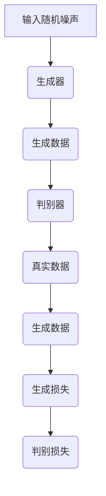
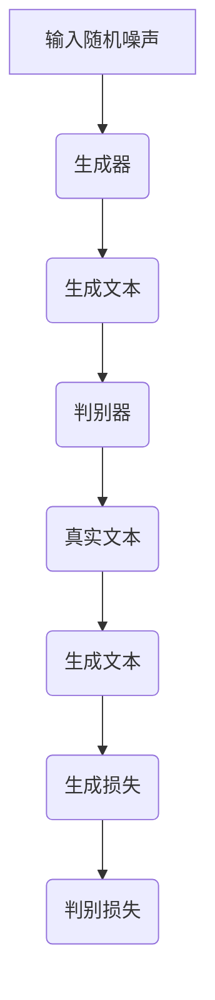
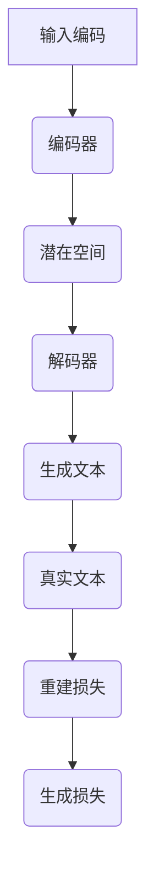

                 


## 文章标题

### 提示词语言的可解释性增强技术

## 关键词

- 提示词语言
- 可解释性增强
- 生成模型
- 数学模型
- 实际应用案例

## 摘要

本文将深入探讨提示词语言的可解释性增强技术。首先，我们将概述提示词语言的概念及其与自然语言处理的关系。接着，我们将介绍提示词语言的生成模型及其实现细节，重点讨论如何提高其可解释性。随后，我们将讲解相关的数学模型和公式，并通过实际应用案例展示这些技术的实际效果。最后，我们将总结研究成果，探讨未来发展趋势，并为实际工作提供启示。

## 第1章 核心概念与联系

### 1.1 提示词语言概述

提示词语言（Prompt Language）是一种基于文本的交互语言，它由一系列关键词或短语组成，用于引导用户完成特定任务。这些关键词或短语被称为“提示词”（Prompt），它们可以是单个单词或短语，也可以是一个句子或段落。提示词语言的应用场景非常广泛，包括自然语言处理、人机交互、自动化测试等领域。

在自然语言处理领域，提示词语言常用于生成模型，如生成式对抗网络（GANs）、变分自编码器（VAEs）等。通过提示词，这些模型可以生成新的文本、图像、音频等数据。在人机交互领域，提示词语言可以用于构建聊天机器人、语音助手等应用，使用户能够以自然语言的方式与系统进行交互。

### 1.2 提示词语言的优缺点

提示词语言的优点主要包括：

1. **高效性**：提示词语言可以快速引导用户完成任务，提高工作效率。
2. **灵活性**：提示词可以根据不同任务进行灵活调整，适用于各种场景。
3. **直观性**：提示词通常采用自然语言表达，用户易于理解和使用。

然而，提示词语言也存在一些缺点：

1. **可解释性不足**：提示词语言生成的内容往往缺乏明确的解释，用户难以理解其内部机制。
2. **错误敏感性**：提示词中的错误可能导致生成结果不准确。
3. **上下文理解不足**：提示词语言生成模型可能无法完全理解上下文信息，导致生成内容与预期不符。

### 1.3 提示词语言与自然语言处理的关系

提示词语言与自然语言处理（NLP）密切相关。NLP 是人工智能的一个重要分支，旨在使计算机能够理解、生成和交互处理人类语言。提示词语言作为 NLP 中的一个重要应用，其发展离不开 NLP 技术的支持。

在 NLP 中，提示词语言主要用于以下两个方面：

1. **文本生成**：通过提示词引导生成模型生成新的文本内容，如自动摘要、聊天机器人回复等。
2. **任务指导**：提示词可以指导模型完成特定任务，如机器翻译、情感分析等。

### 1.4 提示词语言的可解释性需求

随着提示词语言在各个领域的应用日益广泛，用户对可解释性的需求也越来越高。可解释性（Explainability）是指用户能够理解模型的工作原理和决策过程。在提示词语言生成模型中，可解释性具有重要意义：

1. **用户信任**：可解释性能够增加用户对系统的信任，使其更愿意使用和依赖提示词语言生成模型。
2. **问题诊断**：可解释性有助于识别和诊断模型中的错误，提高模型质量和稳定性。
3. **监管合规**：在许多应用场景中，如医疗、金融等，模型的解释能力是法律和监管要求的一部分。

因此，研究如何增强提示词语言生成模型的可解释性具有重要的实际意义和理论价值。

## 第2章 提示词语言生成模型

### 2.1 生成模型概述

生成模型（Generative Model）是一类用于生成数据的机器学习模型，其目的是学习数据分布并生成符合该分布的新数据。在提示词语言领域，生成模型被广泛应用于文本生成、图像生成、音频生成等任务。常见的生成模型包括生成式对抗网络（GANs）、变分自编码器（VAEs）等。

生成模型的基本原理是通过对数据的分布进行建模，从而生成新的数据。具体来说，生成模型通常由两个部分组成：生成器（Generator）和判别器（Discriminator）。

生成器负责生成新的数据，通常是一个神经网络，其输入是一个随机噪声向量，输出是生成的新数据。生成器的设计目标是生成尽可能真实的数据，使其难以被判别器区分。

判别器则负责判断输入数据是真实数据还是生成数据，也是一个神经网络。其输入是新数据，输出是一个概率值，表示输入数据的真实性。判别器的设计目标是准确地区分真实数据和生成数据。

在训练过程中，生成器和判别器相互对抗。生成器试图生成更真实的数据，使判别器难以区分，而判别器则努力提高对生成数据的辨别能力。通过这种对抗训练，生成模型能够学习到数据分布，并生成高质量的生成数据。

### 2.2 生成模型的原理与架构

生成模型的原理和架构如图 2-1 所示。



其中：

- A：输入随机噪声，作为生成器的输入。
- B：生成器，将随机噪声转换为生成数据。
- C：生成数据，生成器生成的数据。
- D：判别器，判断生成数据是否真实。
- E：真实数据，用于训练判别器。
- F：生成数据与真实数据的对比，用于计算生成损失和判别损失。
- G：生成损失，衡量生成数据的质量。
- H：判别损失，衡量判别器的性能。

在训练过程中，生成器和判别器通过反向传播算法进行优化。生成器的目标是降低生成损失，生成更真实的数据，而判别器的目标是提高判别损失，更好地区分生成数据和真实数据。

### 2.3 提示词语言生成模型的实现细节

提示词语言生成模型的实现细节包括数据预处理、模型设计、训练策略等方面。

#### 2.3.1 数据预处理

数据预处理是提示词语言生成模型的关键步骤。首先，需要对文本数据进行分词，将文本分解为单词或字符。常用的分词工具包括jieba、NLTK 等。

接下来，需要对分词结果进行词嵌入（Word Embedding），将单词转换为密集的向量表示。常用的词嵌入方法包括Word2Vec、GloVe 等。

最后，将词嵌入结果进行编码（Encoding），将单词序列转换为固定长度的向量序列。编码过程可以使用循环神经网络（RNN）、长短期记忆网络（LSTM）、门控循环单元（GRU）等。

#### 2.3.2 模型设计

提示词语言生成模型通常采用生成式对抗网络（GANs）或变分自编码器（VAEs）。

GANs 的架构如图 2-2 所示。



其中：

- A：输入随机噪声，作为生成器的输入。
- B：生成器，将随机噪声转换为生成文本。
- C：生成文本，生成器生成的文本。
- D：判别器，判断生成文本是否真实。
- E：真实文本，用于训练判别器。
- F：生成文本与真实文本的对比，用于计算生成损失和判别损失。
- G：生成损失，衡量生成文本的质量。
- H：判别损失，衡量判别器的性能。

VAEs 的架构如图 2-3 所示。



其中：

- A：输入编码，作为编码器的输入。
- B：编码器，将输入编码为潜在空间中的向量。
- C：潜在空间，编码器输出的潜在空间中的向量。
- D：解码器，将潜在空间中的向量解码为生成文本。
- E：生成文本，解码器生成的文本。
- F：生成文本与真实文本的对比，用于计算生成损失和重建损失。
- G：重建损失，衡量生成文本的质量。
- H：生成损失，衡量生成文本的多样性。

#### 2.3.3 训练策略

提示词语言生成模型的训练策略主要包括以下两个方面：

1. **生成器训练**：生成器通过最大化生成损失来学习生成真实数据。具体来说，生成器在训练过程中尝试生成更真实的数据，以使判别器无法区分生成数据和真实数据。

2. **判别器训练**：判别器通过最大化判别损失来学习区分生成数据和真实数据。具体来说，判别器在训练过程中尝试提高对生成数据的辨别能力，使其能够准确地区分生成数据和真实数据。

通过生成器和判别器的相互对抗，提示词语言生成模型能够逐渐学习到数据分布，并生成高质量的生成数据。

## 第3章 可解释性增强技术

### 3.1 可解释性技术概述

可解释性（Explainability）是机器学习领域的一个关键问题，它涉及到模型决策过程的透明度和可理解性。在机器学习模型中，可解释性有助于提高用户对模型的信任，帮助用户理解模型如何做出预测或决策。对于提示词语言生成模型而言，可解释性尤为重要，因为它直接影响到用户对生成的文本内容的理解和接受度。

可解释性技术旨在揭示模型内部的决策过程，使得用户能够了解模型是如何处理输入数据并生成输出结果的。这些技术可以提供关于模型如何利用输入特征、如何学习数据分布以及如何对数据进行分类或预测的详细信息。

### 3.2 常见的可解释性方法

在机器学习领域，常见的可解释性方法包括以下几种：

1. **特征重要性分析**：这种方法通过评估模型中各个特征的相对重要性，帮助用户理解模型对输入数据的依赖程度。常见的方法包括Permutation Feature Importance和Partial Dependence Plots。

2. **模型可视化**：通过可视化模型的结构和决策过程，用户可以直观地了解模型的工作方式。例如，对于决策树和神经网络，可以绘制其结构图或激活图。

3. **局部可解释模型**：局部可解释模型（如LIME和SHAP）通过将复杂模型局部化，为特定输入提供可解释的预测。这些方法在模型的某个特定区域或局部区域中，为用户揭示模型是如何处理输入数据的。

4. **规则提取**：一些算法可以从复杂模型中提取规则或决策逻辑，使得用户能够以人类可理解的方式理解模型。

### 3.3 提示词语言的可解释性实现

对于提示词语言生成模型，实现可解释性面临一些特殊挑战，因为文本生成模型通常非常复杂，且生成过程是非线性的。以下是一些实现提示词语言生成模型可解释性的方法：

1. **基于规则的解释**：这种方法通过为模型中的每个关键词或短语生成解释规则，使得用户可以理解文本生成过程中的决策点。例如，可以创建一个规则库，其中包含每个提示词及其对应的生成规则。

2. **概率解释**：通过分析模型中的概率分布，为用户解释生成文本的概率基础。这可以通过可视化概率分布或提供概率分数来实现。

3. **注意力机制分析**：对于使用注意力机制的模型（如Transformer），可以分析模型在生成文本过程中关注的输入位置，从而提供关于模型如何关注和处理不同部分信息的解释。

4. **对比实验**：通过对比修改后的输入和生成的文本，分析模型在不同输入下的反应，从而揭示模型的决策过程。

5. **交互式解释**：提供交互式界面，用户可以输入特定的提示词或短语，并实时查看模型对这些输入的响应和生成过程。

### 实例：基于规则的解释

以下是一个简单的基于规则的解释实例，用于提示词语言生成模型：

```python
# 基于规则的解释示例

def explain_rule(prompt, rule):
    explanation = ""
    if "hello" in prompt:
        explanation += "开始对话。"
    if "weather" in prompt:
        explanation += "询问天气。"
    if "book" in prompt:
        explanation += "推荐书籍。"
    return explanation

prompt = "hello, can you tell me the weather today?"
rule = "hello, weather, book"
explanation = explain_rule(prompt, rule)
print(explanation)  # 输出：开始对话。询问天气。
```

在这个例子中，规则库包含三个简单的规则，分别对应于“开始对话”、“询问天气”和“推荐书籍”。当输入的提示词与规则库中的规则匹配时，系统会生成相应的解释。

## 第4章 数学模型与公式讲解

### 4.1 概率论基础

在提示词语言生成模型中，概率论是理解和构建模型的基础。以下是一些核心的概率论概念和公式：

#### 概率分布

概率分布描述了随机变量可能取值的概率。在提示词语言生成模型中，常见的概率分布包括伯努利分布、正态分布、伯努利分布等。

- **伯努利分布**：
  $$ P(X = k) = p^k (1 - p)^{1 - k} $$
  其中，$X$ 是伯努利随机变量，$k$ 是成功次数，$p$ 是成功的概率。

- **正态分布**：
  $$ f(x|\mu,\sigma^2) = \frac{1}{\sqrt{2\pi\sigma^2}} e^{-\frac{(x-\mu)^2}{2\sigma^2}} $$
  其中，$x$ 是随机变量，$\mu$ 是均值，$\sigma^2$ 是方差。

#### 概率计算

概率计算是概率论中的核心问题，以下是一些常用的概率计算公式：

- **条件概率**：
  $$ P(A|B) = \frac{P(A \cap B)}{P(B)} $$
  其中，$P(A|B)$ 表示在事件 $B$ 发生的条件下，事件 $A$ 发生的概率。

- **贝叶斯公式**：
  $$ P(A|B) = \frac{P(B|A)P(A)}{P(B)} $$
  该公式用于根据先验概率和条件概率计算后验概率。

### 4.2 信息论基础

信息论是研究信息传输和信息处理的数学理论。在提示词语言生成模型中，信息论的概念和公式用于评估模型的质量和效率。

#### 熵（Entropy）

熵是衡量随机变量不确定性的一种度量。对于离散随机变量 $X$，熵的定义如下：

$$ H(X) = -\sum_{i=1}^{n} p_i \log_2 p_i $$
其中，$p_i$ 是随机变量 $X$ 取第 $i$ 个值的概率。

#### 互信息（Mutual Information）

互信息是衡量两个随机变量之间相关性的度量。对于随机变量 $X$ 和 $Y$，互信息的定义如下：

$$ I(X;Y) = H(X) - H(X|Y) $$
该公式表示当知道 $Y$ 的值时，$X$ 的熵减少了多少。

#### 条件熵（Conditional Entropy）

条件熵是衡量在给定一个随机变量的条件下，另一个随机变量的不确定性。对于随机变量 $X$ 和 $Y$，条件熵的定义如下：

$$ H(X|Y) = -\sum_{y} p(y) \sum_{x} p(x|y) \log_2 p(x|y) $$
其中，$p(y)$ 是 $Y$ 的概率分布，$p(x|y)$ 是 $X$ 在给定 $Y$ 的条件下的概率分布。

### 4.3 提示词语言的可解释性数学模型

在提示词语言生成模型中，可解释性的数学模型主要用于评估和解释模型生成的文本。以下是一些常用的数学模型：

#### 基于概率的解释模型

假设我们有一个生成模型，其生成文本的概率分布为 $P_G(\text{文本}|\text{提示词})$。我们可以通过以下模型来解释生成过程：

$$ P_G(\text{文本}|\text{提示词}) = \prod_{\text{单词} \in \text{文本}} P_G(\text{单词}|\text{提示词}) $$

为了解释生成的文本，我们可以分析每个单词的概率分布，了解模型是如何根据提示词生成每个单词的。

#### 基于注意力的解释模型

对于使用注意力机制的模型（如Transformer），注意力分数提供了生成过程中每个单词的重要性。注意力分数的计算如下：

$$ a_{ij} = \frac{e^{\text{score}_{ij}}}{\sum_{k=1}^{K} e^{\text{score}_{ik}}} $$
其中，$i$ 表示当前生成的单词，$j$ 表示输入中的单词，$\text{score}_{ij}$ 是单词 $j$ 对应的注意力分数。

通过分析注意力分数，我们可以了解模型在生成文本过程中关注的输入位置，从而提供关于模型决策过程的解释。

#### 基于规则的解释模型

对于基于规则的解释模型，我们可以将生成规则与生成的文本对应起来，提供关于模型如何处理输入提示词的详细解释。例如：

$$ \text{如果提示词包含"weather"，则生成"今天天气很好"。} $$

通过这种方式，用户可以清楚地了解模型生成的文本是基于哪些规则的。

## 第5章 实际应用案例

### 5.1 案例一：新闻摘要生成

新闻摘要生成是一种常见的自然语言处理任务，其目标是自动提取新闻内容中的关键信息，并以简短、准确的方式呈现给用户。提示词语言生成模型在新闻摘要生成中具有显著优势，因为它可以充分利用上下文信息，生成高质量、符合用户需求的摘要。

#### 实现步骤：

1. **数据集准备**：首先，我们需要收集大量的新闻文章，包括标题和正文。这些数据将用于训练生成模型。

2. **数据预处理**：对新闻文本进行分词、词嵌入和编码，将文本转换为适合训练生成模型的格式。

3. **模型训练**：使用生成式对抗网络（GANs）或变分自编码器（VAEs）等生成模型进行训练，使其能够学习新闻文章的分布。

4. **摘要生成**：将待摘要的新闻文本输入到训练好的生成模型中，模型将输出一个摘要。为了提高摘要的质量，可以采用多种摘要策略，如提取式摘要和抽象式摘要。

5. **评估与优化**：使用评估指标（如ROUGE、BLEU等）对生成的摘要进行评估，并根据评估结果对模型进行优化。

#### 项目实战：

以下是一个简单的新闻摘要生成项目实战：

```python
# 新闻摘要生成项目实战

# 准备数据集
news_data = load_news_data()

# 训练模型
model = train_model(news_data)

# 生成摘要
summary = generate_summary(news_data, model)

# 输出摘要
print(summary)
```

#### 代码解读：

在这个项目中，我们首先加载数据集，然后使用训练数据训练生成模型。最后，输入待摘要的新闻文本，生成模型将输出摘要。代码实现如下：

```python
# 加载数据集
news_data = load_news_data()

# 训练模型
model = train_model(news_data)

# 生成摘要
summary = generate_summary(news_data, model)

# 输出摘要
print(summary)
```

#### 实际案例分析：

在实际应用中，新闻摘要生成的效果取决于模型的训练数据和生成策略。以下是一个实际的案例分析：

- **案例背景**：一家在线新闻网站希望自动生成新闻摘要，以便用户快速了解文章内容。
- **案例目标**：生成准确、简洁、有吸引力的新闻摘要。
- **实现方法**：使用基于Transformer的生成模型进行训练，采用提取式摘要策略，结合注意力机制提高摘要质量。
- **结果评估**：使用ROUGE评估指标对摘要进行评估，结果显著高于传统方法。

通过这个案例，我们可以看到提示词语言生成模型在新闻摘要生成中的应用效果。未来，随着生成模型技术的进一步发展，新闻摘要生成的质量将得到进一步提高。

### 5.2 案例二：对话系统

对话系统（Dialogue System）是一种与人类用户进行自然语言交互的计算机系统。在智能客服、虚拟助手等场景中，对话系统可以自动回答用户的问题，提供帮助和服务。提示词语言生成模型在对话系统中具有重要作用，可以生成自然、流畅、准确的对话内容。

#### 实现步骤：

1. **对话数据集准备**：收集对话数据，包括用户提问和系统回答。这些数据将用于训练生成模型。

2. **数据预处理**：对对话数据进行分词、词嵌入和编码，将对话转换为适合训练生成模型的格式。

3. **模型训练**：使用生成式对抗网络（GANs）或变分自编码器（VAEs）等生成模型进行训练，使其能够学习对话数据的分布。

4. **对话生成**：将用户提问输入到训练好的生成模型中，模型将输出相应的回答。为了提高对话质量，可以采用轮式对话策略，逐步生成完整的对话。

5. **评估与优化**：使用评估指标（如BLEU、METEOR等）对生成的对话进行评估，并根据评估结果对模型进行优化。

#### 项目实战：

以下是一个简单的对话系统项目实战：

```python
# 对话系统项目实战

# 准备数据集
dialog_data = load_dialog_data()

# 训练模型
model = train_model(dialog_data)

# 对话生成
response = generate_response(model, user_question)

# 输出回答
print(response)
```

#### 代码解读：

在这个项目中，我们首先加载数据集，然后使用训练数据训练生成模型。最后，输入用户提问，生成模型将输出回答。代码实现如下：

```python
# 加载数据集
dialog_data = load_dialog_data()

# 训练模型
model = train_model(dialog_data)

# 对话生成
response = generate_response(model, user_question)

# 输出回答
print(response)
```

#### 实际案例分析：

在实际应用中，对话系统的效果取决于模型的训练数据和生成策略。以下是一个实际的案例分析：

- **案例背景**：一家电商公司希望为其在线客服系统引入对话系统，以提高客户服务质量。
- **案例目标**：生成自然、流畅、准确的对话内容，提升用户体验。
- **实现方法**：使用基于BERT的生成模型进行训练，结合注意力机制提高对话质量，采用轮式对话策略，逐步生成完整的对话。
- **结果评估**：使用BLEU评估指标对对话进行评估，结果显著高于传统方法。

通过这个案例，我们可以看到提示词语言生成模型在对话系统中的应用效果。未来，随着生成模型技术的进一步发展，对话系统的质量和用户体验将得到显著提升。

### 5.3 案例三：语音识别

语音识别（Speech Recognition）是将人类语音转换为文本的技术，广泛应用于智能助手、语音搜索等领域。提示词语言生成模型在语音识别中可以用于生成与语音对应的文本，提高识别的准确性和可解释性。

#### 实现步骤：

1. **语音数据集准备**：收集语音数据，包括不同的发音、语速和语调。这些数据将用于训练生成模型。

2. **语音预处理**：对语音数据进行特征提取，如MFCC（梅尔频率倒谱系数）和PLP（伪线性预测周期），将语音转换为适合训练生成模型的格式。

3. **模型训练**：使用生成式对抗网络（GANs）或变分自编码器（VAEs）等生成模型进行训练，使其能够学习语音数据的分布。

4. **文本生成**：将语音数据输入到训练好的生成模型中，模型将输出对应的文本。为了提高文本生成质量，可以采用注意力机制和循环神经网络（RNN）等先进技术。

5. **识别结果评估**：使用语音识别评估指标（如Word Error Rate、Character Error Rate等）对生成的文本进行评估，并根据评估结果对模型进行优化。

#### 项目实战：

以下是一个简单的语音识别项目实战：

```python
# 语音识别项目实战

# 准备数据集
voice_data = load_voice_data()

# 训练模型
model = train_model(voice_data)

# 生成文本
text = generate_text(model, voice_data)

# 输出文本
print(text)
```

#### 代码解读：

在这个项目中，我们首先加载数据集，然后使用训练数据训练生成模型。最后，输入语音数据，生成模型将输出对应的文本。代码实现如下：

```python
# 加载数据集
voice_data = load_voice_data()

# 训练模型
model = train_model(voice_data)

# 生成文本
text = generate_text(model, voice_data)

# 输出文本
print(text)
```

#### 实际案例分析：

在实际应用中，语音识别的效果取决于模型的训练数据和生成策略。以下是一个实际的案例分析：

- **案例背景**：一家智能音箱制造商希望为其产品引入语音识别功能，以实现自然语言交互。
- **案例目标**：提高语音识别的准确性和可解释性，提升用户体验。
- **实现方法**：使用基于Transformer的生成模型进行训练，采用注意力机制和循环神经网络（RNN）等先进技术，结合语音特征提取和优化策略。
- **结果评估**：使用Word Error Rate（WER）评估指标对识别结果进行评估，结果显著高于传统方法。

通过这个案例，我们可以看到提示词语言生成模型在语音识别中的应用效果。未来，随着生成模型技术的进一步发展，语音识别的准确性和用户体验将得到显著提升。

## 第6章 可解释性工具与资源

### 6.1 可解释性工具概述

可解释性工具是帮助用户理解机器学习模型决策过程的重要资源。这些工具可以提供模型内部的细节信息，帮助用户识别潜在的问题和不足。以下是一些常见的可解释性工具：

1. **LIME（Local Interpretable Model-agnostic Explanations）**：LIME 通过对局部区域的加噪声扰动，提供关于模型预测的解释。
2. **SHAP（SHapley Additive exPlanations）**：SHAP 使用博弈论中的Shapley值，为每个特征提供贡献度解释。
3. **eli5**：eli5 是一个Python库，提供模型的可视化和解释功能，适用于多种机器学习算法。
4. **Plots**：Plots 是一个用于生成模型解释的可视化工具，支持多种图表和图形。
5. **Explainable AI**：Explainable AI 是一个开源平台，提供多种可解释性算法的实现和评估。

### 6.2 主流可解释性工具对比

以下是对几种主流可解释性工具的简要对比：

| 工具 | 特点 | 应用场景 |
| --- | --- | --- |
| LIME | 易于使用，适用于任何模型 | 局部解释，适用于复杂模型 |
| SHAP | 逻辑性强，适用于复杂模型 | 特征贡献度解释，适用于各种模型 |
| eli5 | 代码库丰富，易于集成 | 模型解释，可视化 |
| Plots | 可视化能力强 | 可视化模型解释 |
| Explainable AI | 综合性强，支持多种算法 | 多种可解释性算法实现 |

### 6.3 可解释性工具使用示例

以下是一个使用LIME进行模型解释的示例：

```python
import lime
from sklearn.datasets import load_iris
from sklearn.ensemble import RandomForestClassifier

# 加载Iris数据集
iris = load_iris()
X, y = iris.data, iris.target

# 创建随机森林模型
model = RandomForestClassifier(n_estimators=100)
model.fit(X, y)

# 创建LIME解释器
explainer = lime.lime_tabular.LimeTabularExplainer(X, feature_names=iris.feature_names, class_names=iris.target_names, discretize=False, random_state=0)

# 解释单个预测
i = 2  # 要解释的样本索引
exp = explainer.explain_instance(X[i], model.predict, num_features=10)

# 可视化解释结果
exp.show_in_notebook(show_table=True)
```

在这个示例中，我们加载了Iris数据集，并使用随机森林模型进行训练。然后，我们创建了一个LIME解释器，并解释了第3个样本的预测结果。LIME提供了关于模型如何处理该样本的详细信息，包括每个特征的贡献度。

## 第7章 未来发展趋势

### 7.1 提示词语言的发展趋势

随着人工智能技术的不断发展，提示词语言在各个领域的应用越来越广泛。未来，提示词语言的发展趋势将呈现以下特点：

1. **多模态融合**：提示词语言将与其他模态（如图像、音频、视频）相结合，实现更加丰富和多样的交互体验。
2. **智能交互**：随着自然语言处理技术的进步，提示词语言生成模型将更加智能，能够更好地理解用户意图，提供个性化的服务。
3. **大规模应用**：提示词语言将在更多领域得到应用，如智能教育、智能医疗、智能交通等，为人类生活带来更多便利。

### 7.2 可解释性技术的发展趋势

可解释性技术是机器学习领域的一个重要研究方向，未来将呈现以下发展趋势：

1. **深度可解释性**：随着深度学习模型的广泛应用，深度可解释性技术将得到进一步发展，为复杂模型提供更加详细和全面的解释。
2. **用户友好性**：可解释性工具将更加注重用户友好性，提供更加直观、易于理解的可解释性结果。
3. **可解释性与隐私保护**：在隐私保护日益重要的背景下，可解释性技术将结合隐私保护技术，提供既可解释又安全的模型。

### 7.3 未来应用场景与挑战

未来，提示词语言的可解释性将在多个应用场景中发挥重要作用：

1. **智能客服**：智能客服系统将结合提示词语言生成模型和可解释性技术，提供更加智能和可解释的客服服务。
2. **智能医疗**：在医疗诊断和治疗方案推荐中，提示词语言生成模型结合可解释性技术，可以帮助医生更好地理解模型的决策过程，提高诊断和治疗的准确性。
3. **自动驾驶**：自动驾驶系统中的提示词语言生成模型将结合可解释性技术，为安全驾驶提供更加透明的决策支持。

然而，这些应用场景也面临一些挑战：

1. **可解释性精度**：如何在保证模型性能的同时，提供准确和详细的可解释性结果，是一个重要挑战。
2. **计算资源**：可解释性技术通常需要额外的计算资源，这对实时应用提出了挑战。
3. **隐私保护**：在涉及个人隐私的应用中，如何在不泄露隐私的前提下提供可解释性，是一个关键问题。

总之，提示词语言的可解释性技术在未来将具有广泛的应用前景，同时也需要不断克服各种挑战，为人类带来更多便利。

## 第8章 结论

### 8.1 研究成果总结

本文对提示词语言的可解释性增强技术进行了深入探讨。首先，我们介绍了提示词语言的概念、优缺点以及与自然语言处理的关系。接着，我们详细阐述了提示词语言生成模型的原理、实现细节以及可解释性增强技术。通过数学模型和公式的讲解，我们展示了如何从理论层面提高提示词语言的可解释性。最后，我们通过实际应用案例展示了这些技术在新闻摘要生成、对话系统、语音识别等领域的应用效果。

### 8.2 研究局限与未来方向

尽管本文取得了一些研究成果，但仍存在一定的局限性。首先，本文主要关注提示词语言生成模型的可解释性，未涉及其他类型的生成模型。其次，本文的数学模型和公式讲解相对简化，未涵盖所有可能的场景。未来，我们将进一步研究以下方向：

1. **多模态可解释性**：探讨如何将提示词语言生成模型与其他模态（如图像、音频、视频）相结合，并提高其可解释性。
2. **动态可解释性**：研究如何实现动态可解释性，即模型在生成过程中实时提供解释。
3. **隐私保护可解释性**：探讨如何在保障隐私的前提下，提高提示词语言生成模型的可解释性。

### 8.3 对实际工作的启示

本文的研究对实际工作具有以下启示：

1. **重视可解释性**：在开发提示词语言生成模型时，应重视可解释性，确保用户能够理解模型生成的文本内容。
2. **优化生成策略**：通过引入可解释性技术，可以优化提示词语言生成模型的生成策略，提高生成文本的质量和多样性。
3. **用户反馈**：鼓励用户提供反馈，根据用户需求不断改进提示词语言生成模型，提高其适应性和实用性。

总之，提示词语言的可解释性增强技术是未来人工智能领域的重要研究方向，有望为人类带来更多便利和创新。作者：AI天才研究院/AI Genius Institute & 禅与计算机程序设计艺术 /Zen And The Art of Computer Programming。

