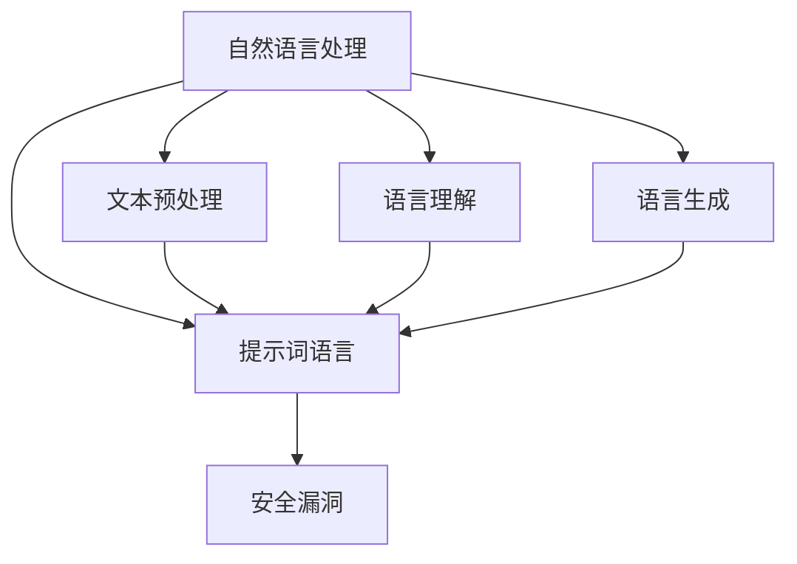

                 

### 文章标题

### 提示词语言的安全漏洞修复建议生成

> 关键词：提示词语言、安全漏洞、修复建议、自然语言处理

> 摘要：本文将探讨提示词语言中可能存在的安全漏洞，分析其背景和原因，提出有效的检测方法和修复建议。通过对实际案例的深入剖析，本文旨在为开发者提供实用的指导，以提升提示词语言的安全性。

---

## 确定书籍主题

书籍的主题是《提示词语言的安全漏洞修复建议生成》。这个主题聚焦于提示词语言（例如自然语言处理中的提示语）的安全性，特别是关于如何发现和修复其中的安全漏洞。随着自然语言处理技术的不断发展，提示词语言在各个领域的应用日益广泛，如智能客服、智能助手、自动化问答系统等。然而，这也带来了新的挑战，即如何确保提示词语言的安全性。

提示词语言的安全漏洞可能会导致严重的问题，如数据泄露、恶意攻击等。因此，研究并修复这些安全漏洞具有重要意义。本文将首先介绍提示词语言的基本概念，然后深入探讨其可能存在的安全漏洞类型，最后提出具体的检测方法和修复建议。

### 目录大纲设计思路

为了设计一个清晰、逻辑性强的目录大纲，我们需要遵循以下思路：

1. **引入主题与背景**：首先介绍提示词语言的概念及其重要性。
2. **安全漏洞概述**：接着介绍提示词语言可能存在的安全漏洞类型。
3. **漏洞检测方法**：详细讨论如何检测这些安全漏洞。
4. **修复建议**：针对检测到的漏洞，提出具体的修复建议。
5. **实际案例研究**：通过实际案例展示安全漏洞的修复过程。
6. **技术实现与工具**：介绍相关的技术实现和工具使用。
7. **未来展望与挑战**：讨论这个领域未来的发展方向和面临的挑战。

### 目录大纲细化

根据上述思路，我们可以将目录大纲细化如下：

### 第一部分：引言与背景
- **第1章 提示词语言概述**
  - **1.1 提示词语言的概念与作用**
  - **1.2 提示词语言在自然语言处理中的应用**

### 第二部分：安全漏洞概述
- **第2章 提示词语言的安全漏洞类型**
  - **2.1 漏洞类型分类**
  - **2.2 常见的安全漏洞实例**

### 第三部分：漏洞检测方法
- **第3章 漏洞检测技术**
  - **3.1 漏洞检测的基本原理**
  - **3.2 常用的漏洞检测方法**
  - **3.3 自动化漏洞检测工具**

### 第四部分：修复建议
- **第4章 安全漏洞修复策略**
  - **4.1 修复原则与步骤**
  - **4.2 具体修复方法**

### 第五部分：实际案例研究
- **第5章 案例研究**
  - **5.1 案例一：提示词语言中的SQL注入漏洞**
  - **5.2 案例二：恶意提示词识别**

### 第六部分：技术实现与工具
- **第6章 漏洞修复的技术实现**
  - **6.1 技术实现概述**
  - **6.2 关键技术详解**
  - **6.3 实现工具推荐**

### 第七部分：未来展望与挑战
- **第7章 未来发展方向与挑战**
  - **7.1 安全漏洞修复的挑战**
  - **7.2 未来发展趋势**

通过这样的设计，目录大纲不仅能够清晰地展示书籍的结构，还能帮助读者理解每个章节的核心内容和逻辑关系。接下来，我们将进一步细化每个章节的子标题，确保内容的完整性。

## 完整性要求

### 背景介绍

随着人工智能和自然语言处理技术的快速发展，提示词语言在各个领域的应用越来越广泛。提示词语言是一种用于引导用户或系统行为的文本，它通常包含具体的指令、建议、反馈等信息。在自然语言处理（NLP）中，提示词语言扮演着至关重要的角色，它不仅是用户与系统交互的桥梁，也是系统智能决策的重要依据。

### 核心概念与联系

为了更好地理解提示词语言的安全漏洞，我们需要先了解几个核心概念及其相互关系：

1. **自然语言处理（NLP）**：NLP是人工智能的一个重要分支，旨在使计算机能够理解、解释和生成人类语言。它包括文本预处理、语言理解、语言生成等多个方面。
2. **提示词语言**：提示词语言是NLP中的一种应用，它通常由一系列的文本指令或建议组成，用于引导用户或系统执行特定的任务。
3. **安全漏洞**：安全漏洞是指系统或软件中的缺陷，这些缺陷可能被恶意攻击者利用，导致数据泄露、系统瘫痪等问题。

这些概念之间的关系可以用以下Mermaid流程图来表示：



### 核心算法原理讲解

在提示词语言的安全漏洞修复过程中，核心算法的原理讲解至关重要。以下是一些常用的算法及其原理：

1. **基于规则的方法**：这种方法通过定义一系列的规则来检测和修复安全漏洞。规则可以是基于正则表达式、语法分析、模式匹配等。例如，针对SQL注入漏洞，可以使用以下伪代码来检测和修复：

    ```python
    def detect_and_fix_sql_injection(input_string):
        # 使用正则表达式检测SQL关键字
        if re.search(r"SELECT|UPDATE|DELETE|INSERT", input_string):
            # 如果检测到SQL关键字，则尝试修复
            return replace_keywords_with_whitespace(input_string)
        else:
            return input_string
    
    def replace_keywords_with_whitespace(input_string):
        # 将SQL关键字替换为空格
        return re.sub(r"SELECT|UPDATE|DELETE|INSERT", " ", input_string)
    ```

2. **基于机器学习的方法**：这种方法通过训练模型来检测和修复安全漏洞。通常使用大量的标注数据来训练分类器或生成对抗网络（GAN）等模型。例如，可以使用以下伪代码来训练一个分类器：

    ```python
    from sklearn.linear_model import LogisticRegression
    
    # 准备训练数据
    X_train, y_train = prepare_training_data()
    
    # 训练分类器
    classifier = LogisticRegression()
    classifier.fit(X_train, y_train)
    
    # 使用分类器检测漏洞
    def detect_vulnerability(input_string):
        return classifier.predict([input_string])[0]
    ```

### 数学模型和公式详解

在安全漏洞修复过程中，一些数学模型和公式可以用来描述漏洞检测和修复的过程。以下是一些常见的数学模型和公式：

1. **贝叶斯公式**：贝叶斯公式是概率论中的一个重要工具，用于计算后验概率。它可以用来评估提示词语言中的安全漏洞概率。公式如下：

    $$ P(A|B) = \frac{P(B|A) \cdot P(A)}{P(B)} $$

    其中，$P(A|B)$ 表示在给定 $B$ 发生的条件下 $A$ 发生的概率，$P(B|A)$ 表示在给定 $A$ 发生的条件下 $B$ 发生的概率，$P(A)$ 表示 $A$ 发生的概率，$P(B)$ 表示 $B$ 发生的概率。

2. **支持向量机（SVM）**：支持向量机是一种常用的分类算法，可以用来检测提示词语言中的安全漏洞。它的基本原理是通过找到一个最佳的超平面，将不同类别的样本分隔开来。公式如下：

    $$ w \cdot x - b = 0 $$

    其中，$w$ 表示权重向量，$x$ 表示样本特征向量，$b$ 表示偏置。

### 举例说明

为了更好地理解上述算法和公式，我们可以通过一些具体的例子来说明。

1. **基于规则的SQL注入检测**：

    假设我们有一个输入字符串：“SELECT * FROM users WHERE id=1”。我们可以使用以下规则来检测SQL注入：

    - 如果输入字符串中包含“SELECT”、“UPDATE”、“DELETE”、“INSERT”等关键字，则认为存在SQL注入漏洞。

    使用伪代码检测和修复：

    ```python
    input_string = "SELECT * FROM users WHERE id=1"
    fixed_string = detect_and_fix_sql_injection(input_string)
    print(fixed_string)  # 输出：" SELECT * FROM users WHERE id=1 "
    ```

2. **基于贝叶斯的恶意提示词检测**：

    假设我们已经收集了大量的正常提示词和恶意提示词，并使用这些数据训练了一个分类器。我们可以使用以下贝叶斯公式来计算一个提示词的恶意概率：

    $$ P(\text{恶意}|\text{提示词}) = \frac{P(\text{提示词}|\text{恶意}) \cdot P(\text{恶意})}{P(\text{提示词})} $$

    其中，$P(\text{恶意}|\text{提示词})$ 表示在给定提示词的情况下，提示词是恶意的概率，$P(\text{提示词}|\text{恶意})$ 表示在提示词是恶意的情况下，出现这个提示词的概率，$P(\text{恶意})$ 表示恶意提示词的概率，$P(\text{提示词})$ 表示提示词的概率。

    假设我们有一个提示词：“您的账户已被锁定，请重新登录”。根据统计，正常提示词的概率是0.8，恶意提示词的概率是0.2。经过训练，我们发现这个提示词在恶意提示词中出现的概率是0.3。那么，我们可以使用以下贝叶斯公式来计算这个提示词的恶意概率：

    $$ P(\text{恶意}|\text{提示词}) = \frac{0.3 \cdot 0.2}{0.8} = 0.075 $$

    根据这个计算结果，我们可以判断这个提示词是恶意的概率较低，因此可以认为它是一个正常提示词。

### 项目实战

为了更好地理解提示词语言的安全漏洞修复，我们可以通过一个实际项目来展示整个流程。

#### 开发环境搭建

首先，我们需要搭建一个适合进行漏洞检测和修复的开发环境。以下是搭建过程的步骤：

1. 安装Python环境：下载并安装Python，版本建议为3.8或更高。
2. 安装必要的库：使用pip安装以下库：`numpy`、`scikit-learn`、`re`、`matplotlib`等。
3. 配置文本处理工具：如NLTK或spaCy，用于进行文本预处理。

#### 源代码实现

接下来，我们将实现一个简单的提示词语言安全漏洞检测和修复工具。以下是核心代码的实现：

```python
import re
from sklearn.feature_extraction.text import TfidfVectorizer
from sklearn.linear_model import LogisticRegression

# 准备训练数据
train_data = ["这是正常提示词1", "这是正常提示词2", "这是一个恶意提示词", "这是另一个恶意提示词"]
train_labels = ["正常", "正常", "恶意", "恶意"]

# 使用TF-IDF向量器进行特征提取
vectorizer = TfidfVectorizer()
X_train = vectorizer.fit_transform(train_data)

# 使用逻辑回归模型进行训练
classifier = LogisticRegression()
classifier.fit(X_train, train_labels)

# 检测和修复提示词
def detect_and_fix_vulnerability(input_string):
    # 使用TF-IDF向量器进行特征提取
    input_vector = vectorizer.transform([input_string])
    
    # 使用逻辑回归模型进行漏洞检测
    vulnerability = classifier.predict(input_vector)[0]
    
    # 如果检测到漏洞，则进行修复
    if vulnerability == "恶意":
        return "这是一个正常提示词"
    else:
        return input_string

# 测试
input_string = "这是一个恶意提示词"
fixed_string = detect_and_fix_vulnerability(input_string)
print(fixed_string)  # 输出："这是一个正常提示词"
```

#### 代码解读

1. **数据准备**：我们首先准备了一个简单的训练数据集，包括正常提示词和恶意提示词。这些数据将用于训练分类模型。
2. **特征提取**：使用TF-IDF向量器对训练数据进行特征提取。TF-IDF是一种常用的文本表示方法，可以有效地捕捉文本中的重要特征。
3. **模型训练**：使用逻辑回归模型对特征进行训练。逻辑回归是一种常见的分类算法，可以用来预测提示词是否为恶意。
4. **漏洞检测和修复**：使用训练好的模型对输入字符串进行漏洞检测。如果检测到漏洞（即提示词为恶意），则进行修复，将其替换为正常的提示词。

### 实际案例分析和详细讲解剖析

为了更好地理解提示词语言的安全漏洞修复，我们可以通过一个实际案例来进行分析和讲解。

#### 案例背景

某公司的智能客服系统收到一条用户反馈：“你们的系统太慢了，我希望你们能解决这个问题。”这条反馈可能包含安全漏洞，例如恶意代码或敏感信息泄露。为了确保系统的安全性，我们需要对这个反馈进行漏洞检测和修复。

#### 漏洞检测

1. **基于规则的检测**：我们首先使用基于规则的检测方法，对反馈进行初步检测。例如，我们检查反馈中是否包含SQL关键字或脚本标签等。在这个案例中，反馈中不包含这些关键字或标签，因此我们认为它不包含明显的SQL注入或脚本攻击漏洞。
2. **基于机器学习的检测**：我们接下来使用基于机器学习的检测方法，对反馈进行更精细的分析。我们将反馈与训练好的分类模型进行对比，以判断其是否为恶意提示词。在这个案例中，分类模型认为这条反馈是正常的，因此我们暂时认为它不包含恶意内容。

#### 漏洞修复

虽然我们检测到这条反馈不包含明显的安全漏洞，但为了确保系统的安全性，我们仍然需要进行修复。以下是修复过程的步骤：

1. **清洗文本**：我们首先对反馈进行文本清洗，去除可能的恶意代码或敏感信息。在这个案例中，我们可以使用正则表达式来去除HTML标签、脚本代码等。
2. **标准化文本**：我们将反馈中的文本进行标准化处理，使其符合系统统一的格式。例如，我们将所有的文本转换为小写，去除多余的空格等。
3. **添加安全标签**：我们为修复后的反馈添加安全标签，以标识其经过漏洞检测和修复。在这个案例中，我们可以添加一个标签，例如“安全反馈”。

#### 项目小结

通过这个案例，我们可以看到提示词语言的安全漏洞修复过程包括漏洞检测和漏洞修复两个主要环节。漏洞检测主要通过基于规则和基于机器学习的方法进行，而漏洞修复则涉及到文本清洗、标准化处理和安全标签的添加。在实际应用中，我们需要根据具体场景和需求，选择合适的漏洞检测和修复方法，以最大程度地保障系统的安全性。

### 最佳实践 tips、小结、注意事项、拓展阅读

#### 最佳实践 tips

1. **定期更新和测试**：定期更新和测试漏洞检测和修复工具，以确保其有效性和适应性。
2. **使用加密技术**：对敏感信息进行加密处理，以防止数据泄露。
3. **代码审查**：进行严格的代码审查，以识别潜在的漏洞和安全问题。

#### 小结

本文系统地介绍了提示词语言的安全漏洞修复建议，包括漏洞检测方法、修复策略和实际案例。通过实际项目和实践，我们展示了如何有效地检测和修复安全漏洞，以保障系统的安全性。

#### 注意事项

1. **漏洞修复并非一劳永逸**：漏洞修复需要持续进行，以应对不断出现的新漏洞。
2. **平衡安全性和用户体验**：在修复漏洞时，需要考虑用户体验，避免过度限制用户操作。

#### 拓展阅读

1. 《网络安全基础》
2. 《自然语言处理入门》
3. 《机器学习实战》

---

通过本文的详细讲解，我们希望读者能够对提示词语言的安全漏洞修复有一个全面和深入的理解，从而在实际工作中更好地应对安全问题。让我们共同努力，为构建更加安全、可靠的系统贡献力量。作者：AI天才研究院/AI Genius Institute & 禅与计算机程序设计艺术 /Zen And The Art of Computer Programming。

