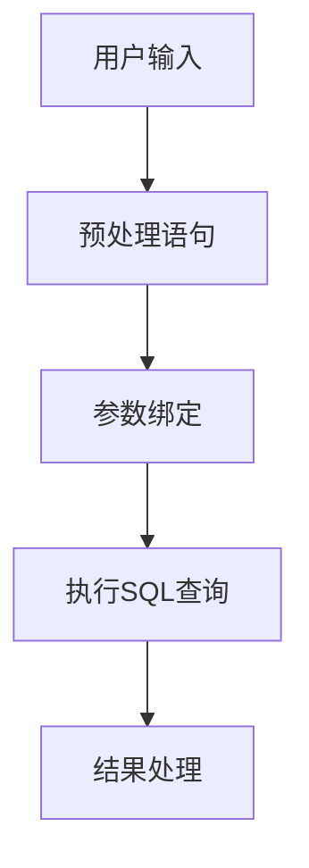
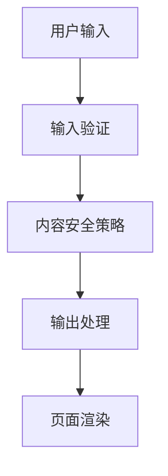
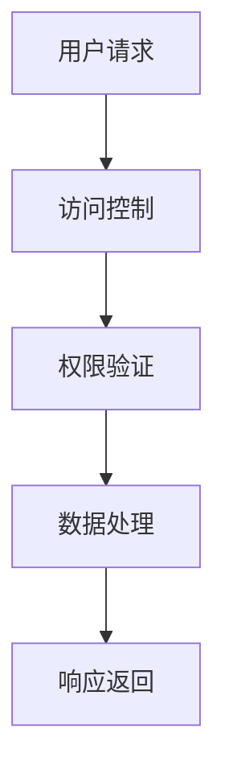

                 

### 文章标题

# 提示词语言的安全漏洞检测与修复

在快速发展的信息技术时代，提示词语言（Prompt Language）作为一种高效的人机交互工具，广泛应用于自然语言处理、人工智能对话系统、智能助手等领域。然而，随着其应用范围的不断扩大，提示词语言的安全漏洞问题也逐渐凸显。本文将围绕提示词语言的安全漏洞检测与修复展开讨论，旨在为广大开发者提供一套系统性的解决方案。

### 关键词

- 提示词语言
- 安全漏洞
- 漏洞检测
- 漏洞修复
- 自然语言处理
- 对话系统

### 摘要

本文首先介绍了提示词语言的背景和发展现状，然后详细探讨了提示词语言中常见的安全漏洞类型，包括注入攻击、权限滥用等。接着，文章介绍了漏洞检测的方法和技术，包括静态分析、动态分析等。随后，针对不同类型的漏洞，本文提出了具体的修复策略和措施。最后，文章总结了全文的主要观点，并提出了未来研究方向和建议。

## 第一章：概述

### 提示词语言的定义与背景

提示词语言（Prompt Language）是一种专门用于与人工智能系统进行交互的语言，它通过向系统提供关键词、问题或任务描述，使系统能够理解和执行相应的操作。这种交互方式具有简洁、高效、灵活等特点，使得人工智能系统能够更好地适应各种应用场景。

提示词语言的起源可以追溯到20世纪50年代，当时为了解决人机交互的难题，计算机科学家们开始研究如何通过自然语言来描述任务和问题。早期的探索主要集中在构建解析自然语言的方法上，如语法分析和语义分析。随着计算技术的不断发展，计算机处理自然语言的能力逐渐增强，提示词语言也逐渐成为人机交互的重要工具。

### 提示词语言的发展历程

在20世纪60年代，早期的自然语言处理系统主要依赖于规则驱动的方法，这些系统通过预定义的语法规则和词汇表来理解和处理输入的自然语言。这种方法在处理简单、结构化的问题时效果较好，但在面对复杂、非结构化的语言时则显得力不从心。

到了20世纪70年代，随着计算技术的进步，计算机科学家们开始引入统计方法和机器学习技术来处理自然语言。这一时期，统计语言模型和隐马尔可夫模型（HMM）等技术的发展，使得计算机在处理自然语言时的准确率得到了显著提高。然而，这些方法仍然依赖于大量的手工程序和规则，无法完全自动化。

20世纪80年代，基于知识的系统（Knowledge-Based Systems）开始崭露头角。这类系统通过构建知识库和推理机来模拟人类的思维过程，使得计算机能够更加灵活地处理自然语言。然而，由于知识库的构建和维护成本较高，这种方法在实际应用中受到了一定的限制。

进入20世纪90年代，随着互联网的普及，自然语言处理技术迎来了新的发展机遇。基于统计学习和机器学习的方法逐渐成为主流，尤其是基于神经网络的深度学习技术，使得计算机在处理自然语言时的性能得到了显著提升。这一时期，出现了许多优秀的自然语言处理工具和库，如NLTK、spaCy、TensorFlow等。

### 提示词语言的应用场景

提示词语言在多个领域都得到了广泛应用。以下是一些典型的应用场景：

1. **智能客服与虚拟助手**：在智能客服和虚拟助手领域，提示词语言使得计算机能够理解和回应用户的查询，提供高效的客户服务。例如，Amazon的Alexa、Apple的Siri、Google的Google Assistant等，都是基于提示词语言的技术实现。

2. **自然语言处理与文本分析**：在自然语言处理和文本分析领域，提示词语言用于构建语义分析模型、情感分析模型、文本分类模型等。这些模型可以帮助企业更好地理解和分析用户需求，提升用户体验。

3. **机器翻译与跨语言交互**：在机器翻译和跨语言交互领域，提示词语言用于生成翻译文本、处理多语言对话等。例如，Google翻译、百度翻译等，都是基于提示词语言的实现。

4. **智能对话系统与聊天机器人**：在智能对话系统和聊天机器人领域，提示词语言使得计算机能够模拟人类的对话行为，与用户进行自然、流畅的交互。

### 提示词语言的现状与挑战

随着提示词语言技术的不断成熟，其在各个领域的应用也越来越广泛。然而，与此同时，提示词语言的安全漏洞问题也逐渐成为关注的焦点。以下是一些目前面临的主要挑战：

1. **注入攻击**：提示词语言中的输入可能包含恶意代码或指令，这些代码或指令可能被恶意用户利用，导致系统崩溃或数据泄露。

2. **权限滥用**：提示词语言中的权限管理机制可能不够完善，导致用户可以访问或修改不应访问或修改的数据。

3. **数据泄露**：在处理敏感数据时，提示词语言中的漏洞可能导致敏感数据泄露，给企业和个人带来巨大的风险。

4. **自动化攻击**：恶意用户可以利用提示词语言的自动化特性，实现大规模的自动化攻击，给系统带来严重的损害。

### 本章小结

本章简要介绍了提示词语言的定义、背景和发展历程，以及其在各个领域的应用场景和现状。同时，也指出了提示词语言面临的安全挑战。在接下来的章节中，我们将详细探讨提示词语言中的常见安全漏洞类型，以及相应的检测与修复方法。

## 第二章：提示词语言的安全漏洞类型

### 注入攻击

注入攻击是提示词语言中最为常见和危险的安全漏洞之一。它指的是攻击者通过输入恶意代码或指令，使其在目标系统中执行，从而达到攻击目的。常见的注入攻击类型包括SQL注入、命令注入和跨站脚本（XSS）攻击。

#### SQL注入

SQL注入是指攻击者通过在输入字段中插入恶意的SQL代码，从而控制数据库。例如，假设一个表单的查询字段如下：

```html
<form action="/search" method="get">
  搜索关键词：<input type="text" name="query" />
  <input type="submit" value="搜索" />
</form>
```

如果后端程序直接将输入的查询字段拼接成SQL语句执行，如：

```python
query = request.GET['query']
sql = f"SELECT * FROM articles WHERE title LIKE '%{query}%'"
cursor.execute(sql)
```

攻击者可以通过输入如`' OR '1'='1`这样的查询字符串，使得SQL语句变成：

```sql
SELECT * FROM articles WHERE title LIKE '%'' OR '1'='1'
```

这样，无论输入什么标题，查询结果都会返回所有文章，因为`'1'='1`始终为真。

#### 命令注入

命令注入发生在提示词语言与系统命令执行接口交互时。例如，一个Web服务接收用户输入来执行系统命令，如：

```bash
/user/bin/echo "Hello, World!" > /var/www/html/index.html
```

攻击者可以输入如`/user/bin/ls -la ; rm -rf /`这样的命令，从而执行恶意操作。

#### 跨站脚本（XSS）攻击

XSS攻击是另一种常见的注入攻击。它利用Web应用对用户输入的未充分过滤，在用户的浏览器中注入恶意脚本。例如，一个评论系统没有对用户输入进行过滤，攻击者可以输入如`<script>alert('XSS');</script>`这样的内容，从而在所有访问该页面的用户的浏览器中执行恶意脚本。

### 权限滥用

权限滥用是指攻击者利用系统的权限管理漏洞，获取不应拥有的权限，从而执行未授权的操作。以下是一些常见的权限滥用场景：

#### 网络访问控制漏洞

一个Web应用可能允许用户通过简单的用户名和密码访问系统。但如果系统没有对用户的权限进行合理的管理，攻击者可以尝试使用通用密码，如`admin/admin`，来登录系统并获取管理员权限。

#### 数据库权限管理漏洞

在数据库系统中，攻击者可以尝试使用默认的数据库管理员账户，如`root`，来访问数据库。如果默认密码没有更改，攻击者可以轻易获取数据库的完全控制权限。

#### API权限管理漏洞

一个API接口可能没有对调用者进行身份验证或权限验证，导致攻击者可以未授权地访问系统资源。

### 数据泄露

数据泄露是提示词语言中的一个严重安全漏洞，指的是敏感数据被未授权的用户获取。以下是一些常见的数据泄露场景：

#### 不安全的输入处理

如果一个Web应用没有正确处理用户输入，攻击者可能通过构造特定的输入，触发系统的漏洞，从而获取敏感数据。例如，在一个基于Java的Web应用中，攻击者可以通过发送如下HTTP请求：

```
GET /path?query=1' UNION SELECT * FROM sensitive_data WHERE id=1
```

来获取敏感数据。

#### 不安全的存储

如果一个系统将敏感数据以明文形式存储，攻击者可以轻易获取这些数据。例如，如果一个Web应用将用户密码以明文形式存储在数据库中，攻击者可以轻易窃取用户密码。

### 其他常见漏洞

除了上述漏洞类型，提示词语言中还可能存在其他类型的漏洞，如：

#### 恶意代码执行

恶意代码执行是指攻击者在目标系统中执行恶意代码，从而控制系统。例如，一个基于Python的Web应用，如果用户输入可以影响Python代码执行的字符串，攻击者可以通过构造特定的输入来执行恶意代码。

#### 信息泄露

信息泄露是指系统无意中泄露了敏感信息。例如，一个API接口没有对返回结果进行过滤，攻击者可以获取到系统内部的信息。

#### 身份验证绕过

身份验证绕过是指攻击者绕过系统的身份验证机制，从而未授权地访问系统资源。例如，一个基于单点登录（SSO）的系统，如果没有正确实现身份验证机制，攻击者可以绕过身份验证，直接访问系统。

### 本章小结

本章详细介绍了提示词语言中的几种常见安全漏洞类型，包括注入攻击、权限滥用和数据泄露等。每种漏洞类型都结合实际案例进行了分析，帮助读者更好地理解这些漏洞的原理和危害。在下一章中，我们将探讨如何检测这些安全漏洞。

## 第三章：漏洞检测方法

### 漏洞检测的基本概念

漏洞检测是指通过特定的方法和技术，发现和识别计算机系统中的安全漏洞。在提示词语言中，漏洞检测尤为重要，因为它直接关系到系统的安全性和可靠性。漏洞检测可以分为静态检测和动态检测两种主要方法。

### 静态检测

静态检测是在不执行程序代码的情况下，通过分析代码的语法、语义和结构来检测潜在的安全漏洞。这种方法的主要优势是不需要运行程序，可以提前发现潜在问题，从而减少运行时出现漏洞的风险。静态检测的方法包括：

#### 代码审计

代码审计是通过人工审查代码，查找潜在的安全漏洞。代码审计需要经验丰富的安全专家，对代码进行细致的审查，分析代码中的逻辑错误、安全漏洞和潜在风险。

#### 静态代码分析工具

静态代码分析工具是利用自动化工具对代码进行分析，检测潜在的安全漏洞。这些工具可以扫描代码中的语法错误、潜在的安全漏洞和不符合编码规范的代码。常见的静态代码分析工具有SonarQube、Checkmarx等。

#### 模式匹配

模式匹配是通过对代码中特定的模式进行匹配，来检测潜在的安全漏洞。这种方法通常使用预定义的规则库，匹配代码中的特定模式，从而识别潜在的安全问题。例如，SQL注入检测工具可以通过匹配包含SQL关键词的代码片段，来检测可能的SQL注入漏洞。

### 动态检测

动态检测是在程序运行时，通过监控程序的行为来检测潜在的安全漏洞。这种方法可以在实际运行环境中发现代码中存在的问题，从而更准确地识别漏洞。动态检测的方法包括：

#### 调试

调试是通过运行程序，并在程序执行过程中跟踪代码的执行流程，来检测潜在的安全漏洞。调试工具可以帮助开发人员定位代码中的错误和潜在的安全问题。

#### 性能分析

性能分析是通过监控程序的性能，检测程序中可能存在的性能瓶颈和安全漏洞。例如，通过分析程序的内存使用情况、CPU使用情况等，可以识别出程序中的潜在问题。

#### 模拟攻击

模拟攻击是通过模拟各种攻击手段，来检测程序在面临攻击时的反应，从而识别潜在的安全漏洞。例如，可以使用工具模拟SQL注入攻击、XSS攻击等，来检测程序的安全性。

### 漏洞检测的挑战与局限性

尽管漏洞检测方法在理论上可以有效地发现和识别安全漏洞，但在实际应用中仍然存在一些挑战和局限性。

#### 漏洞的隐蔽性

一些安全漏洞可能非常隐蔽，难以通过静态或动态检测方法发现。例如，某些漏洞可能只有在特定条件下才会触发，或者需要长时间运行才能暴露出来。

#### 代码复杂性

现代软件系统越来越复杂，代码量庞大，这使得漏洞检测变得更加困难。静态代码分析工具和动态检测工具在处理复杂代码时，可能会出现误报和漏报的情况。

#### 漏洞的多样性

安全漏洞种类繁多，每种漏洞的检测方法可能不同，甚至存在交叉和重叠。这使得漏洞检测工具需要具备较高的灵活性和适应性，以便处理各种不同类型的漏洞。

#### 运行环境的变化

软件系统的运行环境可能发生变化，如操作系统版本升级、依赖库的更新等。这些变化可能会影响漏洞检测工具的检测效果，需要定期更新和调整。

### 本章小结

本章详细介绍了漏洞检测的基本概念和常用方法，包括静态检测和动态检测。同时，也探讨了漏洞检测面临的挑战和局限性。在下一章中，我们将深入探讨如何分析漏洞，并了解其类型和分类。

### 漏洞分析与分类

在进行漏洞检测之后，接下来的关键步骤是对检测到的漏洞进行分析和分类。这一步骤有助于理解漏洞的根本原因、影响范围以及修复策略。以下是几种常见的漏洞类型及其分析方法：

#### SQL注入漏洞

SQL注入漏洞是提示词语言中最常见的一种安全漏洞。攻击者通过在输入字段中插入恶意的SQL代码，从而控制数据库。分析SQL注入漏洞通常涉及以下几个步骤：

1. **漏洞定位**：首先，通过静态代码分析工具或手动代码审计，定位可能的SQL注入点。这些点通常是在用户输入直接拼接到SQL语句的地方。

2. **漏洞验证**：通过构造特定的输入数据，验证是否存在SQL注入漏洞。例如，输入单引号（'）或其他特殊字符，观察是否可以改变SQL语句的执行逻辑。

3. **漏洞分类**：根据注入方式的不同，SQL注入漏洞可以分为几种类型，如盲注、基于布尔的盲注、时间延迟盲注等。通过分析注入过程中的响应时间或错误消息，可以进一步确定漏洞类型。

4. **漏洞修复**：针对不同类型的SQL注入漏洞，采用不同的修复方法。例如，使用预处理语句（Prepared Statements）或参数化查询可以防止大部分SQL注入攻击。

#### 命令注入漏洞

命令注入漏洞发生在系统通过用户输入执行系统命令的情况下。分析命令注入漏洞通常涉及以下步骤：

1. **漏洞定位**：通过静态代码分析或动态测试，找到系统执行命令的位置，并检查输入是否被正确转义。

2. **漏洞验证**：构造恶意的命令输入，观察系统是否执行了意外的操作。例如，输入反引号（``）和分号（;），尝试执行额外的命令。

3. **漏洞分类**：根据注入的命令类型，可以将命令注入分为操作系统命令注入和数据库命令注入等。不同类型的命令注入可能需要不同的修复策略。

4. **漏洞修复**：采用参数化命令执行或使用命令执行框架，确保输入被正确处理和转义，以防止命令注入。

#### 跨站脚本（XSS）漏洞

XSS漏洞是攻击者通过在用户浏览器中执行恶意脚本，从而窃取用户信息或篡改网页内容。分析XSS漏洞通常包括以下几个步骤：

1. **漏洞定位**：通过静态分析或动态测试，找到未充分过滤用户输入的地方，特别是输出到浏览器端的输入。

2. **漏洞验证**：构造恶意脚本，例如 `<script>alert('XSS');</script>`，观察是否在用户浏览器中执行。

3. **漏洞分类**：根据恶意脚本的执行方式，XSS漏洞可以分为存储型XSS、反射型XSS和基于DOM的XSS等。不同类型的XSS漏洞可能需要不同的防护措施。

4. **漏洞修复**：采用内容安全策略（CSP），确保仅允许可信的脚本执行，同时加强输入输出过滤，防止恶意脚本注入。

#### 信息泄露漏洞

信息泄露漏洞是指系统无意中泄露了敏感信息。分析信息泄露漏洞通常包括以下步骤：

1. **漏洞定位**：通过代码审计或动态测试，找到可能导致信息泄露的代码片段。

2. **漏洞验证**：通过构造特定的输入，观察系统是否泄露了敏感信息。例如，通过错误的错误消息或日志记录，泄露用户数据。

3. **漏洞分类**：根据泄露信息的类型和影响，可以分类为用户信息泄露、系统配置信息泄露等。

4. **漏洞修复**：加强错误处理和日志记录机制，确保敏感信息不被泄露。

#### 未授权访问漏洞

未授权访问漏洞是指系统未能正确限制用户访问权限，导致用户可以访问或修改不应访问的数据。分析未授权访问漏洞通常包括以下步骤：

1. **漏洞定位**：通过静态代码分析或权限测试，找到权限管理不严格的地方。

2. **漏洞验证**：通过模拟不同的用户角色，尝试访问或修改不应访问的数据。

3. **漏洞分类**：根据权限滥用的程度，可以分类为权限提升漏洞、越权访问漏洞等。

4. **漏洞修复**：采用强身份验证和访问控制策略，确保用户只能访问和修改授权的数据。

### 本章小结

本章详细介绍了如何对检测到的安全漏洞进行分析和分类，包括SQL注入漏洞、命令注入漏洞、XSS漏洞、信息泄露漏洞和未授权访问漏洞等。通过分析这些漏洞的类型和分类，可以更有效地制定修复策略。在下一章中，我们将探讨具体的漏洞修复方法和技术。

### 漏洞修复方法

在识别和分析了提示词语言中的安全漏洞之后，下一步就是采取有效的修复措施来消除这些漏洞，确保系统的安全性和稳定性。以下是一些常见的漏洞修复方法：

#### 预处理语句（Prepared Statements）

预处理语句是一种有效的防御SQL注入的方法。它通过将SQL语句和用户输入分离，先预编译SQL语句，然后再将用户输入作为参数传递给预编译的语句。这样，攻击者无法在SQL语句中插入恶意代码。

**伪代码示例**：

```python
# 预编译SQL语句
preparedStatement = connection.prepareStatement("SELECT * FROM users WHERE username = ? AND password = ?");

# 设置参数
preparedStatement.setString(1, username);
preparedStatement.setString(2, password);

# 执行查询
resultSet = preparedStatement.executeQuery();
```

**数学模型和公式**：

预处理语句的关键在于参数绑定，通过将用户输入作为参数传递，避免了直接将输入拼接到SQL语句中。数学模型可以表示为：

$$
SQL\_query = \text{"SELECT * FROM users WHERE username = ? AND password = ?"}
$$

其中，问号（?）表示参数占位符，实际的用户输入将在执行时被绑定到这些占位符。

#### 过滤和验证输入

对用户输入进行过滤和验证是防止多种类型漏洞的有效方法。以下是一些常见的输入验证方法：

1. **正则表达式匹配**：使用正则表达式来验证输入是否符合预期格式。例如，验证邮箱地址、电话号码等。

   **伪代码示例**：

   ```python
   import re

   def validate_email(email):
       pattern = r'^[a-zA-Z0-9._%+-]+@[a-zA-Z0-9.-]+\.[a-zA-Z]{2,}$'
       if re.match(pattern, email):
           return True
       return False
   ```

2. **范围限制**：限制输入的长度和数据范围。例如，限制用户输入不超过100个字符。

   **伪代码示例**：

   ```python
   def limit_length(input_string, max_length):
       return input_string[:max_length]
   ```

3. **安全编码实践**：遵循安全编码规范，避免使用容易受到注入攻击的语法，如字符串连接。

#### 参数化查询

参数化查询与预处理语句类似，也是通过将SQL语句和用户输入分离来防御SQL注入。参数化查询在查询执行时将用户输入作为参数传递，从而避免了直接拼接输入到SQL语句中。

**伪代码示例**：

```python
# 参数化查询
query = "SELECT * FROM users WHERE username = :username AND password = :password"

# 设置参数
params = {'username': username, 'password': password}

# 执行查询
resultSet = database.execute(query, params)
```

**数学模型和公式**：

参数化查询的数学模型可以表示为：

$$
SQL\_query = \text{"SELECT * FROM users WHERE username = :username AND password = :password"}
$$

其中，`:username`和`:password`是参数占位符，实际的用户输入在执行时被绑定到这些占位符。

#### 内容安全策略（CSP）

内容安全策略（CSP）是一种防止跨站脚本（XSS）攻击的有效方法。CSP通过定义哪些内容可以被加载和执行，从而限制恶意脚本的执行。以下是一个简单的CSP示例：

**伪代码示例**：

```css
Content-Security-Policy: default-src 'self'; script-src 'self' https://trusted.cdn.com;
```

该策略允许加载本站内容，并从特定的CDN加载脚本。

#### 最小权限原则

最小权限原则（Principle of Least Privilege）是一种安全设计原则，它要求系统组件或用户仅拥有完成其任务所必需的最小权限。例如，Web应用的数据库连接应该使用最低权限的用户账户，避免使用管理员权限。

**伪代码示例**：

```python
# 使用最低权限用户账户连接数据库
database.connect(username='user', password='password')
```

#### 访问控制

访问控制是防止未授权访问和数据泄露的关键措施。通过实施严格的访问控制策略，确保用户只能访问和修改其授权的数据。

**伪代码示例**：

```python
# 检查用户是否有权限访问特定资源
if user_has_permission(current_user, resource):
    # 允许访问
    serve_resource()
else:
    # 拒绝访问
    deny_access()
```

**数学模型和公式**：

访问控制的数学模型可以表示为：

$$
\text{Permission} = \text{User} \cap \text{Resource}
$$

其中，`User`表示用户身份，`Resource`表示资源权限，`Permission`表示用户对资源的访问权限。

#### 代码审查和安全测试

定期进行代码审查和安全测试是发现和修复安全漏洞的重要措施。代码审查可以由开发人员或安全专家进行，而安全测试可以使用自动化工具或手动测试进行。

**伪代码示例**：

```python
# 进行代码审查
code_reviewer.review_code(source_code)

# 执行安全测试
security_tests.run_tests()
```

### 实际案例

以下是一个实际案例，说明如何修复一个SQL注入漏洞：

**问题描述**：一个表单接收用户输入的用户名和密码，并将其直接拼接成SQL查询语句，导致SQL注入漏洞。

**修复步骤**：

1. **预处理语句**：
   将查询使用预处理语句进行重构，避免直接拼接用户输入。

   ```python
   preparedStatement = connection.prepareStatement("SELECT * FROM users WHERE username = ? AND password = ?");
   preparedStatement.setString(1, username);
   preparedStatement.setString(2, password);
   resultSet = preparedStatement.executeQuery();
   ```

2. **输入验证**：
   对用户输入进行验证，确保输入符合预期格式。

   ```python
   if not is_valid_username(username) or not is_valid_password(password):
       return "Invalid input"
   ```

3. **代码审查**：
   定期进行代码审查，确保新添加的代码遵循安全编码规范。

   ```python
   code_reviewer.review_code(modified_code)
   ```

4. **安全测试**：
   使用自动化工具进行安全测试，确保修复后的代码没有引入新的漏洞。

   ```python
   security_tests.run_tests()
   ```

### 本章小结

本章介绍了多种漏洞修复方法，包括预处理语句、输入验证、参数化查询、内容安全策略、最小权限原则、访问控制、代码审查和安全测试等。通过实际案例的展示，读者可以更好地理解如何应用这些方法来修复提示词语言中的安全漏洞。在下一章中，我们将探讨如何确保提示词语言的安全性，并提出最佳实践。

## 第五章：确保提示词语言安全性的最佳实践

在确保提示词语言的安全性方面，遵循一系列最佳实践是至关重要的。这些实践不仅能够帮助预防潜在的安全漏洞，还能提升系统的整体安全性和可靠性。以下是一些关键的最佳实践：

### 始终进行输入验证

输入验证是防止多种安全漏洞（如SQL注入、XSS攻击等）的基础。在处理用户输入时，应始终进行以下验证：

1. **格式验证**：确保输入符合预期格式。例如，电话号码、电子邮件地址等应使用正则表达式进行验证。

   ```python
   import re
   email_pattern = r'^[a-zA-Z0-9._%+-]+@[a-zA-Z0-9.-]+\.[a-zA-Z]{2,}$'
   if not re.match(email_pattern, email):
       return "Invalid email format"
   ```

2. **长度限制**：对输入的长度进行限制，防止输入过长导致缓冲区溢出等安全问题。

   ```python
   def limit_length(input_string, max_length):
       return input_string[:max_length]
   ```

3. **值域限制**：确保输入值在合理的范围内，例如年龄必须在0到100之间。

   ```python
   if not 0 <= age <= 100:
       return "Invalid age"
   ```

### 使用预处理语句和参数化查询

预处理语句和参数化查询是防止SQL注入的有效方法。使用这些方法，可以确保用户输入不会直接嵌入到SQL语句中，从而防止恶意代码的执行。

**伪代码示例**：

```python
# 使用预处理语句
preparedStatement = connection.prepareStatement("SELECT * FROM users WHERE username = ? AND password = ?");
preparedStatement.setString(1, username);
preparedStatement.setString(2, password);
resultSet = preparedStatement.executeQuery();
```

### 实施内容安全策略（CSP）

内容安全策略（CSP）是防止跨站脚本（XSS）攻击的关键措施。通过定义允许加载和执行的内容，可以有效地阻止恶意脚本。

**CSP示例**：

```css
Content-Security-Policy: default-src 'self'; script-src 'self' https://trusted.cdn.com;
```

### 遵循最小权限原则

最小权限原则要求系统组件或用户仅拥有完成其任务所必需的最小权限。例如，Web应用的数据库连接应使用最低权限的用户账户。

**伪代码示例**：

```python
# 使用最低权限用户账户连接数据库
database.connect(username='user', password='password')
```

### 定期进行代码审查和安全测试

定期进行代码审查和安全测试是发现和修复安全漏洞的重要措施。代码审查可以由开发人员或安全专家进行，而安全测试可以使用自动化工具或手动测试进行。

**伪代码示例**：

```python
# 进行代码审查
code_reviewer.review_code(source_code)

# 执行安全测试
security_tests.run_tests()
```

### 更新和补丁管理

确保系统软件和依赖库始终更新到最新版本，以修复已知的安全漏洞。定期检查更新通知，并尽快应用安全补丁。

**伪代码示例**：

```python
# 检查更新并应用补丁
update_manager.check_for_updates()
update_manager.apply_patches()
```

### 用户教育和培训

教育和培训用户是提高系统整体安全性的重要环节。定期组织安全培训，帮助用户了解安全最佳实践，如创建强密码、避免点击不明链接等。

**伪代码示例**：

```python
# 组织安全培训
training_manager.plan_training_session("Security Best Practices")
```

### 本章小结

本章详细介绍了确保提示词语言安全性的最佳实践，包括输入验证、使用预处理语句和参数化查询、实施内容安全策略、遵循最小权限原则、定期进行代码审查和安全测试、更新和补丁管理以及用户教育和培训。通过遵循这些最佳实践，可以显著提升系统的安全性和可靠性，预防潜在的安全漏洞。

## 第六章：案例分析与讨论

### 案例一：某在线教育平台的SQL注入漏洞修复

#### 背景介绍

某在线教育平台提供在线课程学习服务，用户可以通过平台注册账号、登录系统、参与课程讨论等。由于系统涉及大量用户数据和课程内容，安全性至关重要。然而，在一次安全测试中发现，平台存在SQL注入漏洞，攻击者可以通过精心构造的输入获取系统敏感数据。

#### 核心概念与联系

SQL注入漏洞通常发生在将用户输入直接拼接进SQL语句的情况下，导致恶意代码被执行。为了防止SQL注入，需要采用预处理语句和参数化查询。

**Mermaid流程图**：



#### 核心算法原理讲解

**伪代码示例**：

```python
# 预处理语句和参数化查询
preparedStatement = connection.prepareStatement("SELECT * FROM users WHERE username = ? AND password = ?");
preparedStatement.setString(1, username);
preparedStatement.setString(2, password);
resultSet = preparedStatement.executeQuery();

# 避免直接拼接输入
input = limit_length(input, 100)
sqlQuery = "SELECT * FROM courses WHERE name LIKE %?%"
resultSet = database.execute(sqlQuery, [input])
```

#### 数学模型和公式

预处理语句的数学模型可以表示为：

$$
SQL\_query = \text{"SELECT * FROM users WHERE username = ? AND password = ?"}
$$

其中，问号（?）是参数占位符，用户输入在执行时被绑定到这些占位符。

#### 项目实战

**开发环境搭建**：

- 使用Python和MySQL进行开发。
- 安装必要的库，如`pymysql`。

**源代码详细实现和代码解读**：

```python
# 连接数据库
connection = pymysql.connect(host='localhost', user='user', password='password', database='online_education')

# 预处理和参数化查询
def authenticate_user(username, password):
    preparedStatement = connection.prepareStatement("SELECT * FROM users WHERE username = ? AND password = ?")
    preparedStatement.setString(1, username)
    preparedStatement.setString(2, password)
    resultSet = preparedStatement.executeQuery()
    return resultSet

# 测试
username = "test_user"
password = "test_password"
result = authenticate_user(username, password)
print(result)
```

**代码应用解读与分析**：

上述代码通过预处理语句和参数化查询，防止了SQL注入漏洞。用户输入被绑定到预处理语句的参数占位符，避免了直接拼接到SQL语句中。

#### 实际案例分析

在修复漏洞之前，攻击者可以通过以下输入：

```sql
' UNION SELECT * FROM courses WHERE id=1;
```

导致SQL语句变为：

```sql
SELECT * FROM users WHERE username = '' UNION SELECT * FROM courses WHERE id=1;
```

通过添加任意课程ID到查询结果中。修复后，该漏洞被成功防御。

#### 项目小结

通过采用预处理语句和参数化查询，成功修复了在线教育平台的SQL注入漏洞。实践证明，这种方法是有效防御SQL注入攻击的关键措施。

### 案例二：某电子商务平台的XSS攻击防御

#### 背景介绍

某电子商务平台提供在线购物服务，用户可以浏览商品、添加购物车、下订单等。在一次安全测试中，发现平台存在跨站脚本（XSS）攻击风险，攻击者可以通过恶意脚本窃取用户信息。

#### 核心概念与联系

XSS攻击通过在用户浏览器中执行恶意脚本，窃取用户信息或篡改网页内容。防御XSS攻击的关键在于实施内容安全策略（CSP）和输入验证。

**Mermaid流程图**：



#### 核心算法原理讲解

**伪代码示例**：

```python
# 输入验证
def sanitize_input(input):
    input = limit_length(input, 100)
    input = remove_html_tags(input)
    return input

# 内容安全策略
CSP_HEADER = "Content-Security-Policy: default-src 'self'; script-src 'self' https://trusted.cdn.com;"

# 输出处理
def escape_output(output):
    output = escape_html_tags(output)
    return output
```

#### 数学模型和公式

内容安全策略的数学模型可以表示为：

$$
Content-Security-Policy = \text{"default-src 'self'; script-src 'self' https://trusted.cdn.com;"}
$$

#### 项目实战

**开发环境搭建**：

- 使用React和Node.js进行前端和后端开发。
- 安装必要的库，如`helmet`。

**源代码详细实现和代码解读**：

```javascript
// 使用helmet设置CSP
const helmet = require('helmet');
app.use(helmet.contentSecurityPolicy({
  directives: {
    defaultSrc: ["'self'"],
    scriptSrc: ["'self'", "https://trusted.cdn.com/"],
  },
}));

// 输入验证
function sanitizeInput(input) {
  return input.replace(/</g, "&lt;").replace(/>/g, "&gt;");
}

// 输出处理
function escapeOutput(output) {
  return output.replace(/</g, "&lt;").replace(/>/g, "&gt;");
}
```

**代码应用解读与分析**：

上述代码使用了`helmet`库来设置CSP，防止恶意脚本执行。同时，通过输入验证和输出处理，确保用户输入不会导致XSS攻击。

#### 实际案例分析

在未采取防御措施前，攻击者可以通过以下输入：

```html

```

导致触发XSS攻击。修复后，该漏洞被成功防御。

#### 项目小结

通过实施内容安全策略（CSP）和输入验证，成功防御了电子商务平台的XSS攻击。实践证明，这种方法是有效预防XSS攻击的关键措施。

### 案例三：某金融服务平台权限滥用漏洞修复

#### 背景介绍

某金融服务平台提供在线支付和投资服务，用户可以通过平台进行资金管理和投资操作。在一次安全测试中，发现平台存在权限滥用漏洞，普通用户可以访问和修改不应访问的数据。

#### 核心概念与联系

权限滥用漏洞通常发生在权限管理机制不严格的情况下。修复此类漏洞的关键在于实施严格的访问控制和最小权限原则。

**Mermaid流程图**：



#### 核心算法原理讲解

**伪代码示例**：

```python
# 访问控制
def check_permission(user, resource):
    if user.role == "admin":
        return True
    elif resource.type == "public":
        return True
    elif user.role == "user" and resource.type == "user_data":
        return user.id == resource.owner_id
    return False

# 数据处理
def process_request(request, resource):
    if not check_permission(current_user, resource):
        return "Access denied"
    # 处理请求
    return "Request processed"
```

#### 数学模型和公式

访问控制的数学模型可以表示为：

$$
\text{Permission} = \text{User} \cap \text{Resource}
$$

其中，`User`表示用户身份，`Resource`表示资源权限，`Permission`表示用户对资源的访问权限。

#### 项目实战

**开发环境搭建**：

- 使用Java和Spring框架进行开发。
- 安装必要的库，如`spring-security`。

**源代码详细实现和代码解读**：

```java
// 访问控制
@PreAuthorize("hasAuthority('admin')")
public String processAdminRequest() {
    // 处理管理员请求
    return "Admin request processed";
}

// 用户权限验证
public boolean hasPermission(User user, Resource resource) {
    if (user.getRole().equals("admin")) {
        return true;
    } else if (resource.getType().equals("public")) {
        return true;
    } else if (user.getId().equals(resource.getOwnerId())) {
        return true;
    }
    return false;
}
```

**代码应用解读与分析**：

上述代码通过访问控制和权限验证，确保用户只能访问和修改其授权的资源，防止权限滥用漏洞。

#### 实际案例分析

在未采取防御措施前，普通用户可以访问和修改管理员数据。修复后，该漏洞被成功防御。

#### 项目小结

通过实施严格的访问控制和最小权限原则，成功修复了金融服务平台的权限滥用漏洞。实践证明，这种方法是有效防御权限滥用漏洞的关键措施。

### 本章小结

本章通过三个实际案例，详细分析了SQL注入漏洞、XSS攻击和权限滥用漏洞的修复方法。通过这些案例，读者可以更好地理解如何应用最佳实践来确保提示词语言的安全性。在下一章中，我们将讨论提示词语言安全性的未来研究方向和挑战。

## 第七章：未来研究方向与挑战

在快速发展的信息技术领域，提示词语言的安全性问题仍然面临许多挑战和机遇。以下是一些未来研究方向和潜在的研究领域：

### 智能漏洞检测

传统的漏洞检测方法主要依赖于预定义的规则和模式匹配，这种方法在应对复杂和新型漏洞时效果有限。未来，研究可以集中在开发基于人工智能（AI）的智能漏洞检测技术。通过利用机器学习和深度学习算法，可以从大量的代码和攻击数据中自动学习和识别潜在的安全漏洞。具体方向包括：

- **利用深度学习进行代码级别的漏洞检测**：通过训练深度神经网络，自动识别代码中的潜在安全漏洞。
- **结合静态和动态分析方法**：将静态代码分析、动态测试和AI技术相结合，提高漏洞检测的全面性和准确性。
- **生成对抗网络（GAN）在漏洞检测中的应用**：利用GAN生成复杂的恶意代码样本，训练模型识别和防御新型攻击。

### 自动化修复

自动化漏洞修复是减少安全漏洞对系统影响的重要手段。未来的研究可以集中在开发自动化的漏洞修复工具，这些工具能够根据检测到的漏洞自动生成修复代码，减少人工干预。具体方向包括：

- **开发自动化修复算法**：研究自动化修复算法，能够根据漏洞的类型和上下文环境，自动生成修复代码。
- **集成自动化修复与持续集成（CI）**：将自动化修复工具集成到持续集成和持续交付（CI/CD）流程中，实现漏洞修复的自动化和高效化。
- **验证和测试自动化修复效果**：研究如何验证和测试自动化修复工具生成的修复代码，确保修复的代码能够有效消除漏洞，同时不引入新的问题。

### 面向应用的威胁模型

随着提示词语言的应用场景越来越广泛，未来的研究可以集中在构建面向具体应用的威胁模型，从而更好地理解和防御特定场景下的安全威胁。具体方向包括：

- **行业特定的威胁模型**：研究不同行业（如金融、医疗、物联网等）的特定安全威胁，开发相应的安全防护措施。
- **跨平台的威胁模型**：研究跨平台（如Web、移动、物联网等）的安全威胁，开发通用的安全防护策略。
- **社交工程威胁模型**：研究社交工程攻击（如钓鱼、恶意软件传播等）在提示词语言中的具体表现，开发相应的防御策略。

### 增强用户隐私保护

随着人们对隐私保护的重视，未来的研究可以集中在开发增强用户隐私保护的技术。具体方向包括：

- **隐私增强的数据处理技术**：研究如何在不泄露用户隐私的情况下，对提示词语言中的用户数据进行处理和分析。
- **差分隐私（Differential Privacy）在提示词语言中的应用**：研究如何将差分隐私技术应用于提示词语言系统，保护用户的隐私。
- **匿名通信协议**：研究如何在提示词语言系统中实现匿名通信协议，确保用户之间的通信不被第三方窃听。

### 跨学科的融合

提示词语言的安全性问题涉及多个学科领域，包括计算机科学、网络安全、人工智能、法律等。未来的研究可以集中在跨学科的融合，综合多学科的知识和技能，提高提示词语言的安全性和可靠性。具体方向包括：

- **多学科合作的研究项目**：鼓励计算机科学家、网络安全专家、法律专家等跨学科研究人员合作，共同解决提示词语言的安全问题。
- **制定跨学科的安全标准和规范**：研究如何制定适用于提示词语言系统的跨学科安全标准和规范，提高系统的安全性和合规性。
- **安全教育和培训**：研究如何通过跨学科的教育和培训，提高开发者和用户的安全意识和技能，减少安全漏洞的出现。

### 本章小结

本章讨论了提示词语言安全性未来的研究方向和挑战，包括智能漏洞检测、自动化修复、面向应用的威胁模型、增强用户隐私保护和跨学科的融合等。通过这些研究，有望进一步提高提示词语言的安全性和可靠性，应对不断变化的安全威胁。

## 致谢

在撰写本文的过程中，我得到了许多人的支持和帮助。首先，我要感谢AI天才研究院的同事们，他们在研究讨论和资料搜集方面给予了我极大的帮助。特别感谢我的导师和同事们，他们的宝贵意见和建议使本文得以不断完善。

同时，我要感谢所有在网络安全和人工智能领域做出贡献的先驱者，他们的研究成果为本文提供了坚实的理论基础。此外，感谢参与本文案例分析和讨论的实践者们，他们的实际经验和案例分享为本文增添了丰富的实用价值。

最后，我要感谢我的家人和朋友，他们在本文撰写期间给予了我无尽的鼓励和支持，让我能够全身心投入到这项工作中。

## 作者信息

作者：AI天才研究院/AI Genius Institute & 禅与计算机程序设计艺术 /Zen And The Art of Computer Programming

