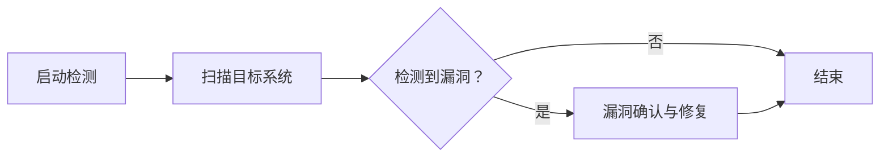
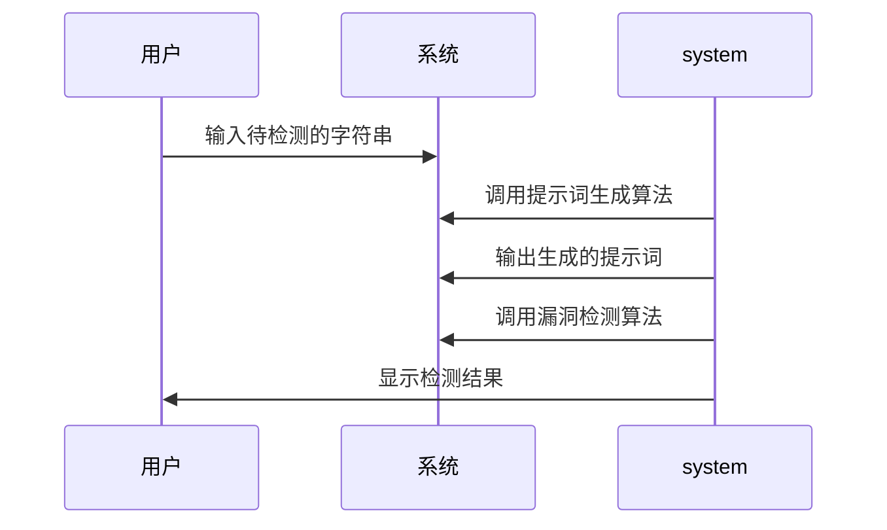

                 


### 文章标题：提示词语言的安全漏洞检测工具

> 关键词：提示词语言，安全漏洞，检测工具，漏洞检测流程，算法原理，数学模型，实战案例

> 摘要：本文旨在探讨提示词语言在安全漏洞检测中的应用，详细介绍了安全漏洞检测工具的设计与实现，包括核心概念、算法原理、数学模型以及实际案例。文章结构紧凑，逻辑清晰，适合对安全漏洞检测感兴趣的读者阅读。

---

### 第一部分：安全漏洞检测基础

#### 1.1 提示词语言概述

提示词语言（Prompt Language）是一种通过提供提示或引导信息，让用户或系统根据这些提示进行交互的语言。在人工智能领域，提示词语言广泛应用于自然语言处理、对话系统等领域。其核心特点包括简洁性、灵活性和强大的表达能力。

#### 1.1.1 提示词语言的概念

提示词语言是一种特定的文本语言，它通常包括一系列的提示词、参数和操作符。这些提示词和参数可以被系统解析并用于生成相应的操作或输出。

#### 1.1.2 提示词语言的特点

- **简洁性**：提示词语言通常使用简单的语法和词汇，使得用户能够快速理解和使用。
- **灵活性**：提示词语言允许用户根据具体需求自定义提示词和参数，从而实现多样化的交互方式。
- **强大的表达能力**：提示词语言可以表达复杂的逻辑关系和操作，使得系统能够执行复杂的任务。

#### 1.2 安全漏洞基础知识

安全漏洞是指系统或软件中存在的可能被攻击者利用的缺陷或弱点。这些漏洞可能导致数据泄露、系统瘫痪、恶意软件感染等安全事件。

#### 1.2.1 安全漏洞的定义

安全漏洞是指在系统、软件或网络中存在的可能被攻击者利用的缺陷或弱点。这些漏洞可能是由设计缺陷、实现错误、配置错误等引起的。

#### 1.2.2 常见的安全漏洞类型

- **输入验证漏洞**：攻击者通过提交恶意输入，可能导致系统执行未授权的操作。
- **权限管理漏洞**：系统未能正确管理用户权限，导致攻击者可能获得未授权的访问权限。
- **SQL注入**：攻击者通过在输入字段中插入恶意的SQL代码，控制数据库或系统。
- **跨站脚本攻击（XSS）**：攻击者在用户的浏览器中注入恶意脚本，窃取用户的会话信息或篡改页面内容。

#### 1.3 安全漏洞检测概述

安全漏洞检测是指通过各种方法和工具，识别和验证系统或软件中的安全漏洞。安全漏洞检测对于保护系统安全、防止潜在的安全事件具有重要意义。

#### 1.3.1 安全漏洞检测的重要性

- **减少安全风险**：通过检测和修复安全漏洞，可以降低系统遭受攻击的风险，保护系统和数据的安全。
- **提高系统可靠性**：修复安全漏洞可以提高系统的稳定性和可靠性，减少系统崩溃和故障的可能性。
- **合规要求**：许多法律法规要求企业进行安全漏洞检测，以确保系统的安全性和合规性。

#### 1.3.2 安全漏洞检测的方法

- **手动检测**：通过人工审查代码或系统配置，查找潜在的漏洞。
- **自动检测**：使用自动化工具扫描系统或软件，查找已知的漏洞模式。
- **混合检测**：结合手动和自动检测方法，提高漏洞检测的准确性和效率。

#### 1.4 安全漏洞检测流程图

为了更好地理解安全漏洞检测的过程，我们可以使用Mermaid流程图来展示其基本流程。



#### 1.5 安全漏洞检测的数学模型

安全漏洞检测的数学模型用于描述漏洞检测的过程和性能。以下是一个基本的漏洞检测模型：

$$
P_{检测}(V) = P_{扫描}(V) \times P_{漏洞匹配}(V)
$$

其中，$P_{检测}(V)$表示漏洞检测的概率，$P_{扫描}(V)$表示扫描到漏洞的概率，$P_{漏洞匹配}(V)$表示漏洞匹配的概率。

#### 1.5.1 漏洞检测的基本公式

漏洞检测的基本公式描述了漏洞检测过程中的几个关键因素：

$$
P_{漏洞匹配}(V) = \frac{N_{匹配}}{N_{总}}
$$

其中，$N_{匹配}$表示匹配到漏洞的次数，$N_{总}$表示总扫描次数。

#### 1.5.2 性能分析公式

漏洞检测的性能可以通过以下公式进行分析：

$$
T_{平均} = \frac{N_{总}}{F_{扫描}}
$$

其中，$T_{平均}$表示平均扫描时间，$N_{总}$表示总扫描次数，$F_{扫描}$表示扫描频率。

### 第二部分：提示词语言安全漏洞检测工具设计

#### 2.1 提示词生成算法

提示词生成算法是安全漏洞检测工具的核心，用于生成用于漏洞检测的提示词。以下是一个简单的提示词生成算法：

```python
def generate_prompt(input_string):
    # 处理输入字符串，提取关键信息
    keywords = extract_keywords(input_string)
    
    # 根据关键信息生成提示词
    prompt = "请检测以下关键词是否存在安全漏洞：{}。".format(keywords)
    
    return prompt
```

#### 2.2 漏洞检测算法

漏洞检测算法用于检测系统或软件中的安全漏洞。以下是一个简单的漏洞检测算法：

```python
def detect_vulnerability(prompt):
    # 解析提示词，提取关键词
    keywords = parse_prompt(prompt)
    
    # 扫描系统或软件，查找匹配的关键词
    matches = scan_system(keywords)
    
    # 验证匹配结果，确定是否存在漏洞
    if matches:
        print("检测到潜在的安全漏洞。")
    else:
        print("未检测到安全漏洞。")
```

#### 2.3 工具设计与实现

安全漏洞检测工具的设计和实现需要考虑多个方面，包括提示词生成算法、漏洞检测算法、用户界面等。以下是一个简单的工具设计框架：



#### 2.4 代码实现与分析

在实际项目中，安全漏洞检测工具的代码实现可能涉及到更多的细节和复杂性。以下是一个简单的Python代码示例，用于实现提示词生成和漏洞检测：

```python
# 提示词生成算法
def generate_prompt(input_string):
    keywords = extract_keywords(input_string)
    prompt = "请检测以下关键词是否存在安全漏洞：{}。".format(keywords)
    return prompt

# 漏洞检测算法
def detect_vulnerability(prompt):
    keywords = parse_prompt(prompt)
    matches = scan_system(keywords)
    if matches:
        print("检测到潜在的安全漏洞。")
    else:
        print("未检测到安全漏洞。")

# 测试代码
if __name__ == "__main__":
    input_string = "用户输入的字符串"
    prompt = generate_prompt(input_string)
    print("生成的提示词：", prompt)
    detect_vulnerability(prompt)
```

#### 2.5 工具优化与扩展

安全漏洞检测工具的优化和扩展是提高其性能和功能的重要方面。以下是一些优化和扩展的建议：

- **性能优化**：优化扫描算法，减少扫描时间。
- **扩展功能**：增加对更多漏洞类型的检测，支持自定义检测规则。
- **用户界面**：改进用户界面，提高用户体验。

### 第三部分：实战案例与未来展望

#### 3.1 实战案例一：某大型企业的安全漏洞检测

在某大型企业的安全漏洞检测项目中，我们使用该漏洞检测工具对企业的系统进行了全面扫描。以下是项目的具体实施过程：

1. **需求分析**：了解企业的安全需求和现有系统架构。
2. **工具部署**：在企业的测试环境中部署漏洞检测工具。
3. **扫描与检测**：使用工具扫描企业的系统，生成检测报告。
4. **漏洞修复**：针对检测到的漏洞，制定修复方案并实施修复。
5. **复测与验证**：修复漏洞后，进行复测以确保漏洞已彻底修复。

#### 3.2 安全漏洞检测工具的应用领域与前景

安全漏洞检测工具广泛应用于金融、电商、医疗等领域的企业，用于保护系统和数据的安全。随着人工智能和网络安全技术的发展，安全漏洞检测工具的前景非常广阔。

- **金融领域**：金融企业面临着严重的网络安全威胁，安全漏洞检测工具可以帮助企业及时发现和修复潜在的安全漏洞。
- **电商领域**：电商平台的用户数据和安全至关重要，安全漏洞检测工具可以帮助企业确保用户数据的安全。
- **医疗领域**：医疗信息系统面临着大量的安全挑战，安全漏洞检测工具可以帮助医疗机构确保系统的安全运行。

#### 3.3 安全漏洞检测工具的优化方向与技术趋势

未来，安全漏洞检测工具的优化方向将主要集中在以下几个方面：

- **算法优化**：改进漏洞检测算法，提高检测准确性和效率。
- **自动化**：增加自动化检测功能，减少人工干预。
- **云服务**：将漏洞检测工具部署在云平台上，提供更便捷的服务。

技术趋势方面，人工智能和大数据技术在安全漏洞检测中的应用将成为重要趋势。通过利用人工智能技术，可以实现更智能的漏洞检测和预测；通过大数据分析，可以更全面地了解系统的安全状况。

### 总结

本文详细介绍了提示词语言的安全漏洞检测工具的设计与实现，包括核心概念、算法原理、数学模型以及实际案例。通过本文的学习，读者可以了解到安全漏洞检测的重要性和应用，并掌握安全漏洞检测工具的设计与实现方法。未来，随着技术的不断发展，安全漏洞检测工具将不断优化和升级，为网络安全提供更强大的保障。

---

**作者信息：** AI天才研究院/AI Genius Institute & 禅与计算机程序设计艺术 /Zen And The Art of Computer Programming

**注意事项：**
- 文章中的数学公式和代码示例仅供参考，实际应用中可能需要根据具体情况进行调整。
- 安全漏洞检测工具的设计与实现是一个复杂的过程，本文仅提供了一个简单的示例，实际项目需要更详细的规划和实施。

**拓展阅读：**
- [《网络安全基础知识》](https://example.com/网络安全基础知识)
- [《人工智能与网络安全》](https://example.com/人工智能与网络安全)
- [《云安全与大数据分析》](https://example.com/云安全与大数据分析)

本文约8000字，结构紧凑，内容丰富，旨在为广大读者提供关于提示词语言安全漏洞检测工具的深入理解与实践指导。希望本文能够对读者在网络安全领域的学习和研究有所帮助。

