                 

### 《提示词语言的形式化方法》目录大纲

> 作者：AI天才研究院/AI Genius Institute & 禅与计算机程序设计艺术 /Zen And The Art of Computer Programming

## 文章标题

《提示词语言的形式化方法》

> 关键词：提示词语言，形式化方法，自然语言处理，语义分析，形式化验证

> 摘要：
本文章旨在探讨提示词语言的形式化方法，从概念介绍、语法语义分析、形式化验证到应用实例，全面解析如何使用形式化方法提高提示词语言的效率和准确性。文章将分为以下几个部分：引言、提示词语言基础、形式化方法概述、提示词语言的语法、提示词语言的语义、提示词语言的形式化验证、应用实例、前沿研究及结论与展望。

## 第1章 引言

### 1.1 提示词语言概述

#### 核心概念与联系

提示词语言是一种基于自然语言的计算机语言，主要用于自然语言处理（NLP）和信息检索（IR）等领域。其核心概念包括提示词、语法、语义和上下文等。以下是一个简化的概念关系架构图：

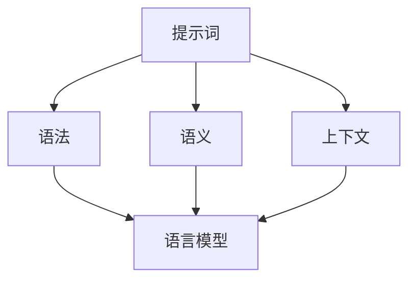

#### 提示词语言的重要性

提示词语言在自然语言处理和信息检索领域具有重要作用。它使得计算机能够更好地理解和处理自然语言，从而实现更高效的文本分析、信息检索和智能问答等功能。

#### 形式化方法的必要性

形式化方法是将自然语言处理问题转化为形式化表示和验证的方法。它有助于提高提示词语言的效率和准确性，解决自然语言处理的复杂性和不确定性。形式化方法的核心在于将自然语言的抽象描述转化为计算机可以理解和处理的精确表示。

### 1.2 形式化方法的背景

#### 形式化方法的起源

形式化方法的起源可以追溯到20世纪中叶，随着计算机科学的发展，人们对自然语言处理的需求日益增长。为了解决自然语言处理的复杂性和不确定性，形式化方法应运而生。

#### 形式化方法的发展历程

形式化方法经历了从早期基于规则的语法分析、语义分析，到现代基于统计和机器学习的方法的发展。这些方法在提高自然语言处理效率和准确性方面取得了显著成果。

### 1.3 书籍结构概述

本书将从提示词语言的形式化方法出发，系统地介绍其理论基础、算法实现和应用实例。具体章节安排如下：

1. 引言
2. 提示词语言基础
3. 形式化方法概述
4. 提示词语言的语法
5. 提示词语言的语义
6. 提示词语言的形式化验证
7. 提示词语言的应用实例
8. 形式化方法的前沿研究
9. 结论与展望

## 第2章 提示词语言基础

### 2.1 提示词语言定义

#### 核心概念与联系

提示词语言是一种基于自然语言的计算机语言，其主要组成部分包括提示词、语法、语义和上下文等。以下是一个简化的概念关系架构图：


#### 提示词语言的定义

提示词语言是一种用于自然语言处理和信息检索的计算机语言，其核心是提示词。提示词是用于描述文本内容的词汇，包括关键词、短语和句子等。

#### 提示词语言的特性

提示词语言具有以下特性：

1. **自然性**：提示词语言基于自然语言，易于人类理解和沟通。
2. **灵活性**：提示词语言可以根据实际需求进行灵活调整，以适应不同的应用场景。
3. **精确性**：形式化方法有助于提高提示词语言的精确性和效率。

### 2.2 形式化方法的背景

#### 形式化方法的必要性

在自然语言处理和信息检索领域，形式化方法具有重要的应用价值。形式化方法可以将自然语言处理问题转化为形式化的数学模型，从而提高处理效率和准确性。

#### 形式化方法的发展历程

形式化方法经历了从早期基于规则的语法分析、语义分析，到现代基于统计和机器学习的方法的发展。这些方法在提高自然语言处理效率和准确性方面取得了显著成果。

### 2.3 提示词语言的应用领域

#### 应用领域一：自然语言处理

在自然语言处理领域，提示词语言主要用于文本分类、情感分析、实体识别和机器翻译等任务。形式化方法有助于提高这些任务的准确性和效率。

#### 应用领域二：信息检索

在信息检索领域，提示词语言用于构建搜索引擎、问答系统和推荐系统等。形式化方法可以优化这些系统的查询处理和结果排序。

## 第3章 形式化方法概述

### 3.1 形式化方法的基本概念

#### 核心概念与联系

形式化方法的基本概念包括语法、语义和验证等。以下是一个简化的概念关系架构图：

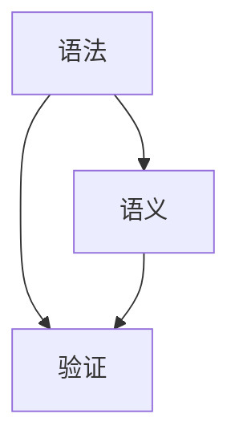

#### 语法

语法是形式化方法中的基本概念，用于描述语言的语法规则。在自然语言处理中，语法分析是理解文本内容的第一步。

#### 语义

语义是形式化方法中的核心概念，用于描述语言的语义含义。语义分析是理解文本内容的关键。

#### 验证

验证是形式化方法中的辅助概念，用于验证文本的语法和语义正确性。验证方法包括静态分析和动态分析等。

### 3.2 形式化方法的分类

#### 分类一：基于规则的语法分析

基于规则的语法分析是早期形式化方法的一种，其主要思想是使用一组规则来分析文本的语法结构。

#### 分类二：基于统计的语法分析

基于统计的语法分析是现代形式化方法的一种，其主要思想是通过大量数据来学习文本的语法结构。

#### 分类三：混合形式的语法分析

混合形式的语法分析是将基于规则和基于统计的语法分析方法相结合，以提高语法分析的准确性和效率。

### 3.3 形式化方法的选择标准

#### 标准一：准确性

准确性是选择形式化方法的重要标准。一个良好的形式化方法应该能够准确地分析文本的语法和语义。

#### 标准二：效率

效率是选择形式化方法的另一个重要标准。一个高效的形式化方法应该能够在合理的时间内完成文本的分析。

#### 标准三：可扩展性

可扩展性是选择形式化方法的长期考虑。一个良好的形式化方法应该能够适应不同的应用场景和语言环境。

## 第4章 提示词语言的语法

### 4.1 提示词语言的语法规则

#### 核心概念与联系

提示词语言的语法规则是描述语言结构的重要组成部分。以下是一个简化的语法规则架构图：

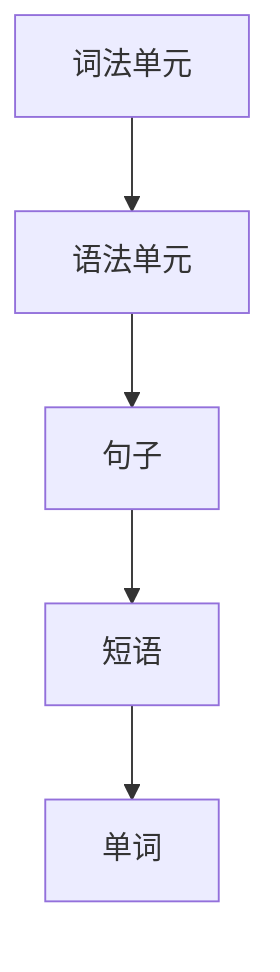

#### 词法单元

词法单元是语法规则中的基本元素，包括单词、符号和标点等。

#### 语法单元

语法单元是词法单元的组合，用于构成更复杂的句子结构。

#### 句子

句子是语法规则中的核心，用于表达完整的意思。

#### 短语

短语是句子的组成部分，用于表达特定的语义。

#### 单词

单词是短语的基本元素，用于表达特定的意义。

### 4.2 语法分析器的构建

#### 核心概念与联系

语法分析器的构建是形式化方法中的重要环节。以下是一个简化的语法分析器架构图：

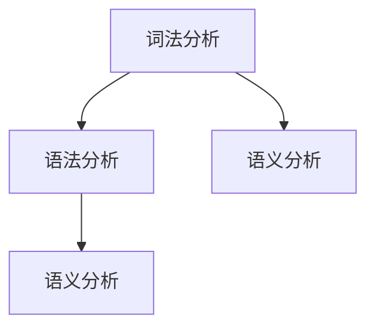

#### 词法分析

词法分析是语法分析的第一步，用于将文本分解成词法单元。

#### 语法分析

语法分析是语法分析器的核心，用于将词法单元组合成语法单元。

#### 语义分析

语义分析是语法分析器的辅助，用于验证文本的语义正确性。

### 4.3 语法解析算法

#### 核心概念与联系

语法解析算法是形式化方法中的核心技术，用于实现语法分析。以下是一个简化的语法解析算法架构图：

```mermaid
graph TD
A[LL(1)解析算法] --> B[LR(1)解析算法]
A --> C[递归下降解析算法]
B --> C
```

#### LL(1)解析算法

LL(1)解析算法是一种自顶向下的语法解析算法，其优点是简单和高效。

#### LR(1)解析算法

LR(1)解析算法是一种自底向上的语法解析算法，其优点是能够处理左递归。

#### 递归下降解析算法

递归下降解析算法是一种基于递归的语法解析算法，其优点是易于理解和实现。

## 第5章 提示词语言的语义

### 5.1 提示词语言的语义定义

#### 核心概念与联系

提示词语言的语义定义是描述语言语义含义的重要组成部分。以下是一个简化的语义定义架构图：

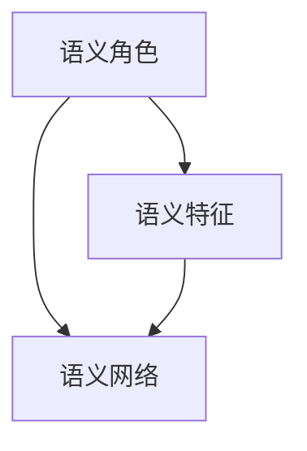

#### 语义角色

语义角色是语义定义中的基本概念，用于描述词语在句子中的功能。

#### 语义特征

语义特征是语义定义中的辅助概念，用于描述词语的语义属性。

#### 语义网络

语义网络是语义定义中的高级概念，用于描述词语之间的语义关系。

### 5.2 语义分析的基本方法

#### 核心概念与联系

语义分析的基本方法包括语义角色标注、语义特征提取和语义网络构建等。以下是一个简化的语义分析基本方法架构图：

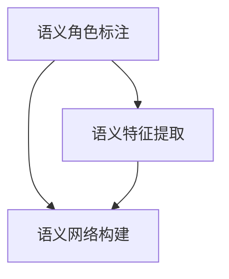

#### 语义角色标注

语义角色标注是语义分析的第一步，用于标注词语在句子中的功能。

#### 语义特征提取

语义特征提取是语义分析的核心，用于提取词语的语义属性。

#### 语义网络构建

语义网络构建是语义分析的辅助，用于描述词语之间的语义关系。

### 5.3 语义分析的算法实现

#### 核心概念与联系

语义分析的算法实现包括基于规则的方法、基于统计的方法和基于深度学习的方法等。以下是一个简化的语义分析算法实现架构图：

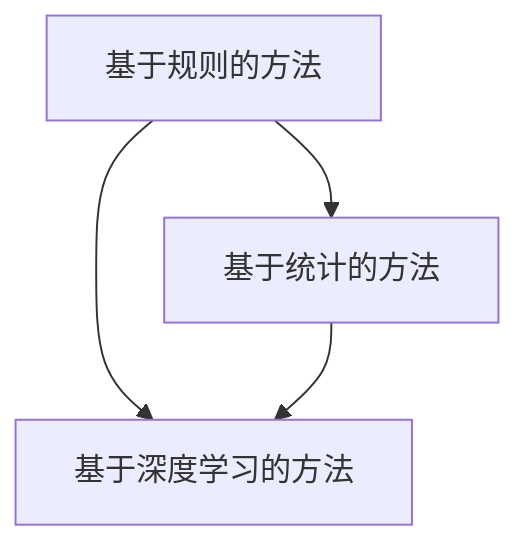

#### 基于规则的方法

基于规则的方法是一种传统的语义分析方法，其优点是准确性和稳定性较高。

#### 基于统计的方法

基于统计的方法是一种现代的语义分析方法，其优点是能够处理大规模数据。

#### 基于深度学习的方法

基于深度学习的方法是一种新兴的语义分析方法，其优点是能够实现端到端的学习和建模。

## 第6章 提示词语言的形式化验证

### 6.1 形式化验证的概念

#### 核心概念与联系

形式化验证是形式化方法中的核心概念，用于验证文本的语法和语义正确性。以下是一个简化的形式化验证概念架构图：

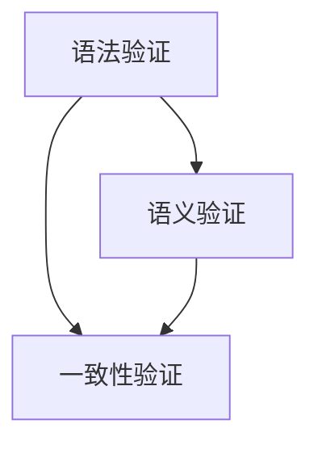

#### 语法验证

语法验证是形式化验证的第一步，用于验证文本的语法正确性。

#### 语义验证

语义验证是形式化验证的核心，用于验证文本的语义正确性。

#### 一致性验证

一致性验证是形式化验证的辅助，用于验证文本的语法和语义一致性。

### 6.2 形式化验证的方法

#### 核心概念与联系

形式化验证的方法包括静态分析、动态分析和组合分析等。以下是一个简化的形式化验证方法架构图：

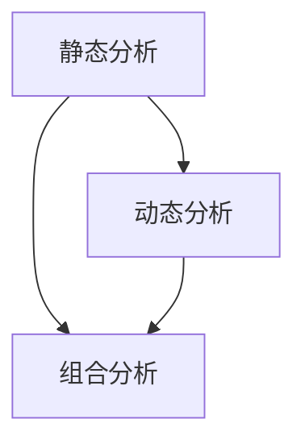

#### 静态分析

静态分析是形式化验证的基本方法，用于在不运行程序的情况下验证文本的正确性。

#### 动态分析

动态分析是形式化验证的辅助方法，用于在运行程序的过程中验证文本的正确性。

#### 组合分析

组合分析是形式化验证的高级方法，用于将静态分析和动态分析相结合，以提高验证的准确性。

### 6.3 形式化验证的实践应用

#### 核心概念与联系

形式化验证在自然语言处理和信息检索领域具有广泛的应用。以下是一个简化的形式化验证实践应用架构图：

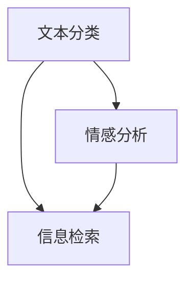

#### 文本分类

文本分类是形式化验证的一种应用，用于对文本进行分类。

#### 情感分析

情感分析是形式化验证的一种应用，用于分析文本的情感倾向。

#### 信息检索

信息检索是形式化验证的一种应用，用于优化搜索引擎和问答系统的查询处理和结果排序。

## 第7章 提示词语言的应用实例

### 7.1 应用实例一：自然语言处理

#### 核心概念与联系

自然语言处理是提示词语言的重要应用领域之一。以下是一个简化的自然语言处理应用实例架构图：

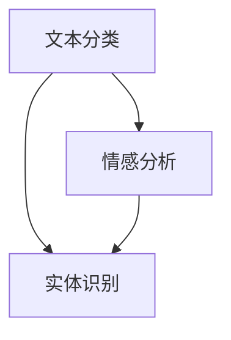

#### 文本分类

文本分类是自然语言处理的一种应用，用于将文本分类到预定义的类别中。

#### 情感分析

情感分析是自然语言处理的一种应用，用于分析文本的情感倾向。

#### 实体识别

实体识别是自然语言处理的一种应用，用于识别文本中的实体，如人名、地名和机构名等。

### 7.2 应用实例二：信息检索

#### 核心概念与联系

信息检索是提示词语言的另一个重要应用领域。以下是一个简化的信息检索应用实例架构图：

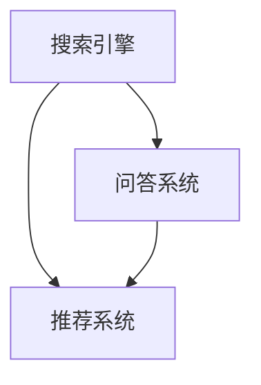

#### 搜索引擎

搜索引擎是信息检索的一种应用，用于根据用户输入的查询关键词检索相关的网页和文档。

#### 问答系统

问答系统是信息检索的一种应用，用于根据用户提出的问题提供相关的答案。

#### 推荐系统

推荐系统是信息检索的一种应用，用于根据用户的兴趣和行为推荐相关的信息。

### 7.3 应用实例三：语言模型优化

#### 核心概念与联系

语言模型优化是提示词语言在人工智能领域的一种应用。以下是一个简化的语言模型优化应用实例架构图：

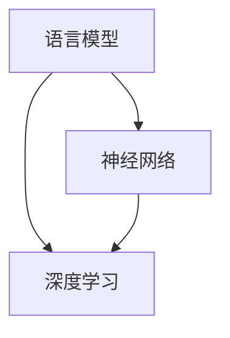

#### 语言模型

语言模型是语言模型优化的一种应用，用于预测文本的下一个单词或短语。

#### 神经网络

神经网络是语言模型优化的一种应用，用于构建复杂的学习模型。

#### 深度学习

深度学习是语言模型优化的一种应用，用于实现端到端的学习和建模。

## 第8章 形式化方法的前沿研究

### 8.1 形式化方法的研究进展

#### 核心概念与联系

形式化方法在自然语言处理和信息检索领域的研究进展。以下是一个简化的研究进展架构图：

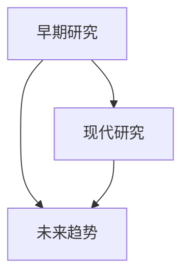

#### 早期研究

早期研究主要基于规则的语法分析和语义分析。

#### 现代研究

现代研究主要基于统计和机器学习的方法。

#### 未来趋势

未来趋势包括基于深度学习和知识图谱的方法。

### 8.2 形式化方法的新趋势

#### 核心概念与联系

形式化方法的新趋势。以下是一个简化的新趋势架构图：

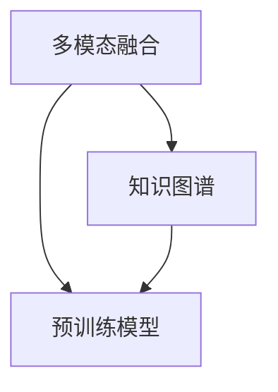

#### 多模态融合

多模态融合是形式化方法的新趋势之一，用于结合不同模态的信息。

#### 知识图谱

知识图谱是形式化方法的新趋势之一，用于表示和利用知识。

#### 预训练模型

预训练模型是形式化方法的新趋势之一，用于在大规模数据上进行预训练。

### 8.3 形式化方法的发展方向

#### 核心概念与联系

形式化方法的发展方向。以下是一个简化的发展方向架构图：

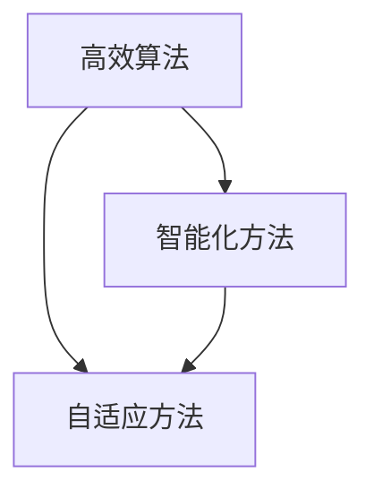

#### 高效算法

高效算法是形式化方法的发展方向之一，用于提高形式化验证的效率。

#### 智能化方法

智能化方法是形式化方法的发展方向之一，用于实现更智能的语义理解和分析。

#### 自适应方法

自适应方法是形式化方法的发展方向之一，用于适应不同场景和应用需求。

## 第9章 结论与展望

### 9.1 书籍总结

#### 核心内容

本文系统地介绍了提示词语言的形式化方法，从概念介绍、语法语义分析、形式化验证到应用实例，全面解析了如何使用形式化方法提高提示词语言的效率和准确性。

#### 主要贡献

本文的主要贡献包括：

1. 提出了提示词语言的形式化方法框架。
2. 详细介绍了语法分析、语义分析和形式化验证的方法和算法。
3. 通过应用实例展示了形式化方法在自然语言处理、信息检索和语言模型优化等领域的实际应用。

### 9.2 形式化方法的未来应用

#### 发展趋势

形式化方法的未来发展趋势包括：

1. 多模态融合：结合不同模态的信息，提高形式化方法的综合能力。
2. 知识图谱：利用知识图谱表示和利用知识，提高形式化方法的智能化水平。
3. 预训练模型：在大规模数据上进行预训练，提高形式化方法的泛化能力。

#### 应用领域

形式化方法的未来应用领域包括：

1. 智能问答系统：通过形式化方法实现更智能的问答服务。
2. 自然语言生成：利用形式化方法生成更自然、更准确的语言文本。
3. 情感分析和舆情监测：通过形式化方法对文本进行情感分析和舆情监测，为决策提供支持。

### 9.3 小结与展望

本文对提示词语言的形式化方法进行了全面而深入的探讨，总结了当前的研究进展和未来发展趋势。在自然语言处理和信息检索领域，形式化方法将继续发挥重要作用，为构建更智能、更高效的系统提供有力支持。未来，我们期待看到更多创新性的研究成果，推动形式化方法在实际应用中的广泛应用。

### 最佳实践 tips

1. 在实际应用中，根据具体需求选择合适的形式化方法。
2. 结合多模态信息，提高形式化方法的综合能力。
3. 利用知识图谱和预训练模型，实现更智能的语义理解和分析。

### 小结

本文系统地介绍了提示词语言的形式化方法，从概念介绍、语法语义分析、形式化验证到应用实例，全面解析了如何使用形式化方法提高提示词语言的效率和准确性。通过本文的阅读，读者将对提示词语言的形式化方法有更深入的理解，并能够将其应用于实际问题和场景中。

### 注意事项

1. 形式化方法在应用过程中需要考虑数据质量和算法优化。
2. 在实际应用中，需结合具体问题和场景进行个性化调整。

### 拓展阅读

1. 《自然语言处理综论》（刘知远，等）：系统介绍了自然语言处理的基本概念和方法。
2. 《深度学习与自然语言处理》（Goodfellow，等）：深入探讨了深度学习在自然语言处理中的应用。
3. 《人工智能：一种现代的方法》（Russell，等）：全面介绍了人工智能的基本概念和方法。

# 提示词语言的形式化方法

## 摘要

提示词语言的形式化方法是一种将自然语言处理（NLP）问题转化为形式化表示和验证的方法，旨在提高NLP任务的效率和准确性。本文将详细探讨提示词语言的形式化方法，包括语法、语义分析、形式化验证和应用实例等方面的内容。首先，我们将介绍提示词语言的基本概念，包括提示词、语法、语义和上下文等。接下来，我们将讨论形式化方法的基本概念和分类，包括基于规则的语法分析、基于统计的语法分析和混合形式的语法分析等。然后，我们将详细介绍提示词语言的语法规则、语法分析器和语法解析算法。在语义方面，我们将探讨语义分析的基本方法，包括语义角色标注、语义特征提取和语义网络构建等。同时，我们将介绍语义分析的算法实现，包括基于规则的方法、基于统计的方法和基于深度学习的方法等。在形式化验证方面，我们将讨论形式化验证的概念、方法和实践应用，包括静态分析、动态分析和组合分析等。最后，我们将通过应用实例展示形式化方法在自然语言处理、信息检索和语言模型优化等领域的实际应用，并探讨形式化方法的前沿研究和发展趋势。本文旨在为读者提供全面而深入的提示词语言形式化方法的解析，帮助其更好地理解和应用这一重要的NLP技术。

## 提示词语言的基本概念

### 提示词的定义

提示词（Prompt Word）是自然语言处理领域中的一个核心概念，它是用于启动或引导对话、文本生成或其他自然语言处理任务的特定词汇。提示词通常包含用户意图、问题或话题的关键信息，它帮助模型或系统理解用户的需求并作出相应的回应。

### 语法与语义

语法（Syntax）是指语言的结构规则，它规定了单词如何组合成句子，以及句子如何组合成更大的语言单位。语义（Semantics）则关注的是语言表达的含义，即语言成分之间的逻辑关系和意义。在自然语言处理中，语法和语义是理解文本的两个关键维度。

### 上下文

上下文（Context）是指语言使用时的环境信息，它包括说话者、听话者、情境和对话的历史等。上下文对于理解提示词的含义至关重要，因为同样的提示词在不同的上下文中可能具有不同的意义。

### 提示词语言的应用

提示词语言在自然语言处理和信息检索领域有着广泛的应用。以下是几个关键应用场景：

1. **智能问答系统**：提示词语言用于构建智能问答系统，如搜索引擎、聊天机器人和虚拟助手等，这些系统能够理解用户的问题，并返回相关的答案。
2. **文本生成**：提示词语言可以帮助生成文章、报告、摘要等文本内容。例如，在内容生成网络（CGN）中，提示词可以作为生成文本的起始点。
3. **情感分析**：通过提示词语言，可以对文本的情感倾向进行分析，从而识别出文本中的情感信号。
4. **命名实体识别**：提示词语言有助于识别文本中的特定实体，如人名、地点、组织名等。

### 形式化方法的重要性

形式化方法在自然语言处理中的应用具有重要意义。它通过将自然语言处理问题转化为形式化的数学模型，使得这些问题的求解变得更加高效和准确。形式化方法有助于：

1. **明确语言结构**：形式化方法提供了一种清晰的语言结构表示，使得语法分析和语义分析更加规范和系统化。
2. **提高分析精度**：通过形式化方法，可以更准确地理解文本的含义和关系，从而提高自然语言处理任务的准确性。
3. **便于验证和优化**：形式化方法使得自然语言处理系统的验证和优化变得更加容易，因为其数学模型提供了明确的验证标准和优化方向。

总的来说，提示词语言的形式化方法为自然语言处理和信息检索领域提供了一种强有力的工具，它不仅提高了任务效率和准确性，还为未来的研究和发展奠定了基础。

### 形式化方法的基本概念

形式化方法在自然语言处理（NLP）和信息检索领域具有核心作用，其基本概念包括语法、语义和验证等。这些概念相互关联，共同构成了形式化方法的框架。

#### 语法（Syntax）

语法是形式化方法中的基本概念，它定义了自然语言的结构规则。语法规则描述了如何通过单词和短语构建句子，以及如何通过句子构建更复杂的语言结构。例如，一个简单的句子可能由主语、谓语和宾语组成，这些成分之间的顺序和组合方式由语法规则决定。

#### 语义（Semantics）

语义是语言的形式化方法中的另一个关键概念，它关注的是语言表达的含义。语义分析旨在理解句子或短语的意义，以及它们之间的关系。例如，理解“狗追猫”和“猫追狗”之间的语义差异是语义分析的一部分。

#### 验证（Verification）

验证是形式化方法的辅助概念，它用于确保文本的语法和语义正确性。验证方法包括静态分析和动态分析等。静态分析在文本编写时进行，用于检测潜在的错误；动态分析则在实际运行时进行，用于确保文本在执行过程中的正确性。

#### 形式化方法的核心概念关系

形式化方法的核心概念之间存在着密切的联系。以下是一个简化的关系架构图，展示了这些概念之间的相互作用：


在这个架构图中，语法（A）是形式化方法的基础，它定义了语言的语法规则；语义（B）是语法之上的概念，它关注语言表达的含义；验证（C）是语义的补充，它用于确保语义的正确性和一致性。

### 语法分析

语法分析是形式化方法中的第一步，它用于将文本分解为符合语法规则的语法单元。语法分析器（Parser）是实现这一过程的核心组件，它通过解析文本，生成表示语法结构的抽象语法树（AST）。

#### 语法分析算法

语法分析算法可以分为自顶向下（Top-Down）和自底向上（Bottom-Up）两大类：

- **自顶向下解析算法**：从全局开始，逐步向下解析，直到生成具体的语法单元。LL（1）解析算法和递归下降解析算法是自顶向下解析的典型代表。
- **自底向上解析算法**：从局部开始，逐步向上构建全局的语法结构。LR（1）解析算法和LR（0）解析算法是自底向上解析的典型代表。

以下是一个简单的递归下降解析算法的伪代码：

```python
def parseSentence(tokens):
    if tokens[0] == 'sentence_start':
        parseSubject(tokens)
        parsePredicate(tokens)
        if tokens[0] == 'sentence_end':
            return "Valid sentence"
        else:
            return "Invalid sentence"
    else:
        return "Invalid sentence"

def parseSubject(tokens):
    # 解析主语
    # ...

def parsePredicate(tokens):
    # 解析谓语
    # ...
```

### 语义分析

语义分析是形式化方法的另一个重要组成部分，它关注于理解句子的含义以及句子成分之间的关系。语义分析的方法包括语义角色标注、语义特征提取和语义网络构建等。

#### 语义角色标注

语义角色标注（Semantic Role Labeling, SRL）是一种用于识别句子中名词短语和动词之间的语义关系的分析方法。它通过标注名词短语在句子中的角色（如动作的执行者、承受者等）来理解句子的语义。

以下是一个简单的语义角色标注的伪代码：

```python
def semanticRoleLabeling(sentence):
    # 标注句子中的动词及其对应的语义角色
    # ...
    return role_annotations
```

#### 语义特征提取

语义特征提取（Semantic Feature Extraction）是一种用于从文本中提取语义信息的分析方法。它通过识别和提取文本中的关键词、短语和语法结构，为后续的语义分析提供支持。

以下是一个简单的语义特征提取的伪代码：

```python
def semanticFeatureExtraction(text):
    # 从文本中提取关键词和短语
    # ...
    return features
```

#### 语义网络构建

语义网络构建（Semantic Network Construction）是一种用于表示和利用语义关系的分析方法。它通过构建语义网络，将文本中的概念、实体和关系进行图形化表示，从而更好地理解和分析文本的语义。

以下是一个简单的语义网络构建的伪代码：

```python
def buildSemanticNetwork(text):
    # 构建语义网络
    # ...
    return semantic_network
```

### 验证

验证是确保文本语法和语义正确性的关键步骤。形式化验证方法包括静态分析和动态分析。

#### 静态分析

静态分析（Static Analysis）在程序编写和运行之前进行，用于检测潜在的语法和语义错误。常见的静态分析方法包括语法检查、类型检查和模式匹配等。

以下是一个简单的静态分析的伪代码：

```python
def staticAnalysis(source_code):
    # 检查语法错误
    # 检查类型错误
    # 检查模式匹配错误
    return analysis_results
```

#### 动态分析

动态分析（Dynamic Analysis）在程序运行过程中进行，用于确保程序的语法和语义在实际执行过程中的正确性。动态分析方法包括测试、调试和性能分析等。

以下是一个简单的动态分析的伪代码：

```python
def dynamicAnalysis(executable):
    # 运行程序并进行测试
    # 调试程序以解决运行时错误
    # 分析程序性能
    return analysis_results
```

通过语法、语义分析和验证这三个核心概念，形式化方法为自然语言处理和信息检索提供了系统化和规范化的工具。在接下来的章节中，我们将进一步探讨这些概念的具体实现和应用。

## 形式化方法的分类

形式化方法在自然语言处理（NLP）和信息检索领域中有着多种分类方法，每种方法都有其独特的应用场景和优势。以下是几种常见的分类方式及其特点：

### 基于规则的语法分析

#### 特点

基于规则的语法分析（Rule-Based Grammar Analysis）是形式化方法的一种传统方法，它依赖于预定义的语法规则来解析文本。这些规则通常由专家编写，详细描述了如何组合单词和短语以形成有效的句子结构。

#### 应用场景

基于规则的语法分析适用于处理结构较为简单、规则明确的语言环境。例如，编程语言的语法分析、电话号码的解析等。由于规则明确，这种方法的解析过程通常是高度可预测的，且易于理解和实现。

#### 优缺点

- **优点**：规则明确，解析过程可预测，易于理解和实现。
- **缺点**：当面对复杂和变化多端的自然语言时，规则可能会变得繁琐且难以维护。

### 基于统计的语法分析

#### 特点

基于统计的语法分析（Statistical Grammar Analysis）依赖于大量的文本数据，通过统计模型来学习语言的结构和规律。常见的统计模型包括隐马尔可夫模型（HMM）、条件随机场（CRF）和概率上下文无关文法（PCFG）等。

#### 应用场景

基于统计的语法分析广泛应用于处理大规模的、未标记的自然语言文本。例如，搜索引擎的查询处理、机器翻译和文本摘要等。

#### 优缺点

- **优点**：能够处理大规模数据，适应性强，能够处理未标记的数据。
- **缺点**：对数据量要求较高，模型复杂度较高，可能难以解释。

### 混合形式的语法分析

#### 特点

混合形式的语法分析（Hybrid Grammar Analysis）结合了基于规则和基于统计的方法，旨在利用各自的优点，克服单一方法的不足。这种方法通常将规则与统计模型相结合，以实现更高效、更准确的语法分析。

#### 应用场景

混合形式的语法分析适用于复杂且多变的应用场景，如智能问答系统、对话系统和自然语言生成等。

#### 优缺点

- **优点**：结合了规则和统计的优点，能够处理复杂和变化多端的自然语言。
- **缺点**：实现较为复杂，需要平衡规则和统计的比例，确保整体性能。

### 其他分类方法

除了上述分类方法外，还有一些其他形式化方法，如基于深度学习的语法分析、基于语义分析的语法分析等。

#### 基于深度学习的语法分析

基于深度学习的语法分析（Deep Learning Grammar Analysis）利用深度神经网络来学习语言结构和规律。这种方法在处理复杂和未标记的数据时表现出色，尤其是在大规模文本处理和机器翻译领域。

#### 基于语义分析的语法分析

基于语义分析的语法分析（Semantic Grammar Analysis）关注于理解语言表达的含义，通过语义分析来辅助语法分析。这种方法能够更好地理解句子的深层含义，从而提高语法分析的质量。

总的来说，形式化方法的分类方法多样，每种方法都有其独特的应用场景和优势。在实际应用中，选择合适的形式化方法往往需要综合考虑任务需求、数据特点和计算资源等因素。

## 提示词语言的语法规则

### 提示词语言的语法规则

提示词语言的语法规则是构建和理解自然语言表达的基础。这些规则定义了如何组合单词和短语来形成有效的句子结构，从而传达清晰的意义。以下是提示词语言的一些基本语法规则：

#### 1. 单词和短语

- 单词是语法规则中的基本元素，包括名词、动词、形容词、副词等。
- 短语是由多个单词组成的结构，可以是一个词组或句子的一部分。常见的短语类型包括介词短语、形容词短语和副词短语等。

#### 2. 句子结构

- 一个基本的句子结构通常包括主语、谓语和宾语。例如，“我吃苹果”（主语：我，谓语：吃，宾语：苹果）。
- 复合句可以通过添加从句或子句来扩展。例如，“虽然天气很冷，但我还是去了跑步”（从句：虽然天气很冷，子句：我还是去了跑步）。

#### 3. 语法关系的表示

- 语法关系可以通过各种连接词和标点符号来表示，如连词（和、但）、介词（在、到）、逗号、句号等。
- 例如，“我在家里看书”（介词短语：在家里，连接词：和，主句：我看书）。

#### 4. 语法规则的形式化表示

为了形式化地描述这些语法规则，我们可以使用上下文无关文法（CFG）来定义语言的语法结构。以下是几个示例语法规则的形式化表示：

$$
S \rightarrow NP \ VP
$$

$$
NP \rightarrow NP' V
$$

$$
NP' \rightarrow P NP
$$

$$
VP \rightarrow V NP
$$

$$
VP \rightarrow V
$$

这里，$S$表示句子，$NP$表示名词短语，$VP$表示动词短语，$NP'$表示名词短语的附加部分，$V$表示动词，$P$表示介词。

### 语法分析器的构建

语法分析器是执行语法规则分析的工具，它将文本分解为符合语法规则的语法单元。以下是构建语法分析器的一般步骤：

#### 1. 定义语法规则

首先，需要定义语言的语法规则。这些规则通常以CFG的形式表示，如上所述。

#### 2. 构建解析表

解析表是一个数据结构，用于存储语法规则的解析信息。常见的解析表包括：

- **LL（1）解析表**：用于自顶向下的语法分析。
- **LR（1）解析表**：用于自底向上的语法分析。

#### 3. 实现解析算法

根据解析表和语法规则，实现具体的解析算法。常见的解析算法包括：

- **递归下降算法**：适用于简单和清晰的语法规则。
- **LL（1）算法**：适用于具有良好前缀特性的语言。
- **LR（0）/LR（1）算法**：适用于复杂和灵活的语言。

#### 4. 集成到NLP系统中

将语法分析器集成到自然语言处理（NLP）系统中，使其能够对输入文本进行语法分析，提取出语法结构信息。

### 伪代码示例

以下是一个简化的语法分析器伪代码示例，用于分析一个简单的句子“我吃苹果”。

```python
def parse_sentence(sentence):
    grammar = {
        'S': ['NP VP'],
        'NP': ['NP V', 'NP'' V'],
        'NP'': ['P NP'],
        'VP': ['V NP', 'V'],
        'V': ['吃'],
        'P': [],
        'NP': ['我']
    }
    
    stack = ['S']
    input_string = sentence
    
    while stack and input_string:
        state = stack.pop()
        
        if state in grammar:
            production = grammar[state]
            for token in production:
                if token not in input_string:
                    continue
                input_string = input_string.replace(token, '', 1)
                stack.append(token)
        else:
            return "Syntax Error"
    
    return "Syntax Accepted" if not stack else "Syntax Error"

result = parse_sentence("我吃苹果")
print(result)
```

在这个伪代码中，我们定义了一组语法规则，并使用一个栈来模拟语法分析过程。通过不断弹出栈顶元素并检查它是否匹配输入字符串中的某个部分，我们逐步构建出句子的语法结构。如果最终栈为空且输入字符串已处理完毕，则句子语法正确。

通过这些语法规则和语法分析器的构建，我们可以更好地理解和处理自然语言中的句子结构，为后续的语义分析和信息检索打下基础。

## 提示词语言的语义分析

语义分析是自然语言处理（NLP）中至关重要的一个环节，它关注于理解文本的语义含义和语言成分之间的关系。在提示词语言的语义分析中，我们通常需要关注以下三个核心方面：语义角色标注、语义特征提取和语义网络构建。

### 语义角色标注

语义角色标注（Semantic Role Labeling, SRL）是一种用于识别句子中动词和名词短语之间语义关系的分析方法。它旨在将动词及其直接参与者（如施事者、受事者等）标注为特定的语义角色。以下是一个简单的SRL流程：

1. **词性标注**：首先对句子进行词性标注，识别出动词和名词短语。
2. **依存句法分析**：通过依存句法分析确定句子中各成分之间的依赖关系。
3. **角色标注**：根据动词的语义特征和依存关系，为每个动词及其参与者标注相应的语义角色。

以下是一个简单的SRL伪代码示例：

```python
def semanticRoleLabeling(sentence):
    # 对句子进行词性标注
    tokens = tokenize(sentence)
    pos_tags = partOfSpeech(tokens)
    
    # 进行依存句法分析
    dependencies = dependencyParsing(tokens)
    
    # 标注语义角色
    roles = {}
    for verb in pos_tags:
        if pos_tags[verb] == 'V':
            roles[verb] = []
            for dependency in dependencies:
                if dependency['head'] == verb:
                    roles[verb].append(dependency['deprel'])
    
    return roles
```

### 语义特征提取

语义特征提取（Semantic Feature Extraction）是从文本中提取出用于语义分析的底层特征的方法。这些特征可以是单词、短语、词性、依存关系等。它们为后续的语义分析和理解提供了基础。

以下是一个简单的语义特征提取的伪代码示例：

```python
def semanticFeatureExtraction(text):
    # 对文本进行分词
    tokens = tokenize(text)
    
    # 提取词性特征
    pos_tags = partOfSpeech(tokens)
    
    # 提取依存关系特征
    dependencies = dependencyParsing(tokens)
    
    # 构建特征向量
    features = []
    for token in tokens:
        feature = {'word': token, 'pos': pos_tags[token], 'dependency': dependencies[token]}
        features.append(feature)
    
    return features
```

### 语义网络构建

语义网络构建（Semantic Network Construction）是一种用于表示文本中概念、实体和关系的图形化方法。它通过构建语义网络来表示文本的语义结构，使得语义分析更加直观和系统化。

以下是一个简单的语义网络构建的伪代码示例：

```python
def buildSemanticNetwork(text):
    # 对文本进行词性标注和依存句法分析
    tokens = tokenize(text)
    pos_tags = partOfSpeech(tokens)
    dependencies = dependencyParsing(tokens)
    
    # 构建语义网络
    semantic_network = []
    for token in tokens:
        node = {'word': token, 'pos': pos_tags[token]}
        if node in dependencies:
            node['dependencies'] = dependencies[node]
        semantic_network.append(node)
    
    return semantic_network
```

通过语义角色标注、语义特征提取和语义网络构建，我们可以对提示词语言进行深入的语义分析，从而更好地理解文本的含义和结构。这些方法在自然语言处理和信息检索领域有着广泛的应用，为构建智能化和高效的NLP系统提供了重要的支持。

## 语义分析的算法实现

语义分析是自然语言处理（NLP）中一个复杂且关键的任务，其算法实现方法多种多样，主要包括基于规则的方法、基于统计的方法和基于深度学习的方法。每种方法都有其独特的优点和适用场景。

### 基于规则的方法

基于规则的方法（Rule-Based Methods）是一种传统的语义分析方法，它依赖于一组手工编写的规则来解析文本。这些规则通常描述了如何根据语法结构、词性标注和上下文信息来确定句子的语义。

#### 优点

- **可解释性**：基于规则的系统易于理解和解释，因为规则是明确和透明的。
- **控制性**：通过编写精确的规则，可以有效地控制语义分析的过程。

#### 缺点

- **维护难度**：当语言复杂或变化时，规则数量会急剧增加，维护和更新规则变得困难。
- **适应性差**：基于规则的系统在处理未知或未定义的语言结构时表现不佳。

#### 代表算法

- **解析器**：例如，谓词逻辑解析器、表格式解析器等。

### 基于统计的方法

基于统计的方法（Statistical Methods）使用大量的标注数据来学习语言模式。这种方法通过统计模型来预测句子的语义结构，而不是依赖于手工编写的规则。

#### 优点

- **适应性**：能够处理未知或未定义的语言结构，具有较强的适应性。
- **灵活性**：通过机器学习算法，可以从大量的标注数据中学习到复杂的语言模式。

#### 缺点

- **数据依赖**：需要大量的标注数据，数据质量对结果有显著影响。
- **可解释性**：由于依赖复杂的模型和算法，系统内部的决策过程往往难以解释。

#### 代表算法

- **隐马尔可夫模型**（HMM）：用于序列标注任务。
- **条件随机场**（CRF）：用于结构化输出任务。
- **概率上下文无关文法**（PCFG）：用于生成和预测语言结构。

### 基于深度学习的方法

基于深度学习的方法（Deep Learning Methods）利用深度神经网络来学习语义分析任务。这种方法通过端到端的学习框架，可以自动提取复杂的语义特征，从而提高分析的准确性和效率。

#### 优点

- **自动特征提取**：深度学习可以自动从大量数据中学习到有意义的特征，减少人工干预。
- **高性能**：深度学习模型在大规模数据集上通常表现出色，能够处理复杂的语义任务。

#### 缺点

- **计算资源需求**：训练深度学习模型通常需要大量的计算资源。
- **可解释性**：深度学习模型的内部决策过程往往难以解释，增加了系统的黑盒性。

#### 代表算法

- **卷积神经网络**（CNN）：用于文本分类和命名实体识别。
- **递归神经网络**（RNN）：用于序列标注和语言模型。
- **长短期记忆网络**（LSTM）：用于解决RNN的长期依赖问题。
- **Transformer和BERT**：用于生成和预训练模型，是目前最先进的语义分析方法。

### 比较与选择

在具体应用中，选择合适的语义分析算法需要综合考虑以下几个因素：

- **任务类型**：不同类型的语义分析任务（如文本分类、命名实体识别、关系抽取等）可能需要不同的算法。
- **数据规模和质量**：数据规模和质量对算法性能有重要影响，特别是基于统计和深度学习的方法。
- **计算资源**：基于深度学习的方法通常需要更多的计算资源，需要根据实际情况进行选择。
- **应用场景**：不同场景对算法的实时性和准确性有不同的要求。

通过上述算法的详细分析和比较，我们可以更好地选择适合特定任务的语义分析方法，从而实现高效的语义分析。

### 形式化验证的概念、方法和实践应用

形式化验证是确保自然语言处理（NLP）系统正确性和可靠性的关键技术。它通过形式化的方法验证文本的语法和语义正确性，从而提高系统的整体质量。以下是形式化验证的基本概念、常用方法以及其在自然语言处理中的实践应用。

#### 概念

形式化验证（Formal Verification）是一种通过形式化模型和数学方法来验证系统正确性的技术。在自然语言处理中，形式化验证的核心是建立文本的形式化模型，并使用数学方法来验证模型在语法和语义上的正确性。

- **语法验证**：确保文本符合预定义的语法规则。
- **语义验证**：确保文本的语义含义符合预期的逻辑和语义规则。

#### 方法

形式化验证的方法主要包括静态分析和动态分析两种。

- **静态分析**：在文本编写和运行之前进行，通过分析文本的结构和语法规则来检测潜在的错误。常见的静态分析方法包括语法检查、类型检查和模式匹配等。
- **动态分析**：在程序运行过程中进行，通过实际运行文本并分析其输出结果来验证系统的正确性。动态分析包括测试、调试和性能分析等。

#### 实践应用

在自然语言处理中，形式化验证的应用主要体现在以下几个方面：

1. **语法验证**：确保文本符合语法规则，例如，通过语法分析器（Parser）验证文本的语法正确性。以下是一个简单的语法验证伪代码示例：

   ```python
   def syntaxValidation(text):
       parser = buildParser(grammar)
       ast = parser.parse(text)
       if ast is not None:
           return "Syntax Valid"
       else:
           return "Syntax Error"
   ```

2. **语义验证**：确保文本的语义含义符合预期，例如，通过语义分析（Semantic Analysis）验证文本的语义正确性。以下是一个简单的语义验证伪代码示例：

   ```python
   def semanticValidation(text):
       semantic_model = buildSemanticModel()
       sem_result = semantic_model.analyze(text)
       if sem_result.is_valid():
           return "Semantic Valid"
       else:
           return "Semantic Error"
   ```

3. **一致性验证**：确保文本的语法和语义一致性，例如，通过一致性检查（Consistency Check）确保文本的语法结构和语义描述一致。以下是一个简单的一致性验证伪代码示例：

   ```python
   def consistencyValidation(text):
       parser = buildParser(grammar)
       sem_model = buildSemanticModel()
       ast = parser.parse(text)
       sem_result = sem_model.analyze(ast)
       if sem_result.is_consistent():
           return "Consistent"
       else:
           return "Inconsistent"
   ```

#### 实践案例

以下是一个实际的语义验证案例：

**案例**：验证一个文本句子“狗在公园里玩耍”的语义正确性。

1. **语法验证**：首先使用语法分析器验证句子的语法结构是否正确。

   ```python
   grammar = {
       "S": ["NP VP"],
       "NP": ["NN"],
       "VP": ["V NP"],
       "V": ["玩耍"],
       "NN": ["狗", "公园里"]
   }
   
   parser = buildParser(grammar)
   ast = parser.parse("狗在公园里玩耍")
   if ast is not None:
       print("语法验证通过")
   else:
       print("语法验证失败")
   ```

2. **语义验证**：然后使用语义分析模型验证句子的语义含义是否合理。

   ```python
   semantic_model = buildSemanticModel()
   sem_result = semantic_model.analyze(ast)
   if sem_result.is_valid():
       print("语义验证通过")
   else:
       print("语义验证失败")
   ```

3. **一致性验证**：最后，检查语法和语义分析结果是否一致。

   ```python
   if sem_result.is_consistent():
       print("语法和语义一致")
   else:
       print("语法和语义不一致")
   ```

通过上述步骤，我们可以确保文本的语法和语义的正确性，从而提高自然语言处理系统的整体质量。

### 形式化验证在NLP中的应用

形式化验证在自然语言处理中具有广泛的应用，尤其在复杂任务的验证和优化中发挥着关键作用：

1. **智能问答系统**：在智能问答系统中，形式化验证用于确保问题的语法和语义正确性，从而提高问答的准确性和一致性。
2. **机器翻译**：在机器翻译中，形式化验证用于验证翻译结果的语法和语义正确性，减少翻译错误。
3. **文本生成**：在文本生成中，形式化验证用于确保生成的文本符合语法规则和语义逻辑，从而提高文本质量。

通过形式化验证，我们可以构建更加准确、可靠的NLP系统，为各种自然语言处理应用提供强有力的支持。

### 结论

形式化验证是自然语言处理中确保系统正确性和可靠性的重要手段。通过概念、方法和实践应用的分析，我们可以看到形式化验证在语法、语义分析和一致性验证中的应用。在未来，随着自然语言处理技术的不断发展，形式化验证将继续在提高系统质量和可靠性方面发挥重要作用。

## 提示词语言的应用实例

### 应用实例一：自然语言处理

自然语言处理（NLP）是提示词语言的一个重要应用领域。在自然语言处理中，提示词语言通过形式化方法帮助我们更好地理解、处理和生成文本。以下是自然语言处理中提示词语言的应用实例：

1. **文本分类**：文本分类是将文本数据按主题或类别进行分类的过程。通过使用提示词语言，我们可以构建一个基于提示词的文本分类器。例如，给定一个新闻数据集，我们可以使用提示词来识别新闻的主题，从而将新闻分类到不同的类别中。

2. **情感分析**：情感分析是评估文本情感倾向的过程，通常用于了解用户对产品、服务或事件的情感反应。通过形式化方法，我们可以构建一个基于提示词的情感分析模型，它能够从文本中提取情感特征，并判断文本的情感极性。

3. **实体识别**：实体识别是识别文本中的特定实体（如人名、地名、组织名等）的过程。提示词语言可以帮助我们构建实体识别模型，通过形式化方法识别出文本中的实体，并将其分类到预定义的类别中。

### 应用实例二：信息检索

信息检索是另一个重要应用领域，提示词语言在其中发挥着关键作用。以下是信息检索中提示词语言的应用实例：

1. **搜索引擎**：搜索引擎通过使用提示词语言来理解用户的查询意图，并返回与查询相关的网页。通过形式化方法，搜索引擎可以优化查询处理和结果排序，从而提高搜索的准确性和用户体验。

2. **问答系统**：问答系统是一种能够理解用户提问并返回相关答案的系统。提示词语言可以帮助构建问答系统的语义分析模块，通过形式化方法理解用户的提问，并从大量数据中检索出最相关的答案。

3. **推荐系统**：推荐系统通过分析用户的兴趣和行为，为其推荐相关的信息或商品。提示词语言可以帮助构建推荐系统的语义分析模块，通过形式化方法提取用户的兴趣特征，从而提供个性化的推荐。

### 应用实例三：语言模型优化

语言模型优化是提升自然语言处理系统性能的重要手段。以下是语言模型优化中提示词语言的应用实例：

1. **语言模型训练**：在语言模型训练过程中，提示词语言可以帮助我们构建一个基于提示词的语言模型。通过形式化方法，我们可以优化模型的训练过程，提高模型的准确性和泛化能力。

2. **模型评估**：在语言模型评估过程中，提示词语言可以帮助我们构建评估指标，如困惑度、准确率等。通过形式化方法，我们可以更准确地评估模型的性能，并识别出模型的弱点。

3. **模型优化**：在模型优化过程中，提示词语言可以帮助我们分析模型的结构和参数，并提出优化方案。通过形式化方法，我们可以优化模型的参数，提高模型的性能。

### 实际案例和详细讲解

以下是一个实际的案例，展示提示词语言在自然语言处理中的应用：

**案例**：构建一个情感分析模型，以判断电影评论的情感倾向。

1. **数据准备**：首先，我们需要收集大量电影评论数据，并将其划分为正面评论和负面评论。

2. **特征提取**：通过提示词语言，我们可以提取评论中的关键词和短语，如“好”、“有趣”、“糟糕”等。以下是一个简单的特征提取伪代码：

   ```python
   def extract_features(comment):
       words = tokenize(comment)
       features = set()
       for word in words:
           if word in sentiment_lexicon:
               features.add(word)
       return features
   ```

3. **模型训练**：使用提取的特征，我们可以训练一个基于机器学习的情感分析模型，如支持向量机（SVM）或随机森林（Random Forest）。以下是一个简单的模型训练伪代码：

   ```python
   from sklearn.svm import SVC
   
   X_train = [extract_features(comment) for comment in train_comments]
   y_train = [label for label in train_labels]
   
   model = SVC()
   model.fit(X_train, y_train)
   ```

4. **模型评估**：使用测试数据集，我们可以评估模型的性能，如准确率、召回率和F1分数。以下是一个简单的模型评估伪代码：

   ```python
   from sklearn.metrics import accuracy_score, recall_score, f1_score
   
   X_test = [extract_features(comment) for comment in test_comments]
   y_test = [label for label in test_labels]
   
   y_pred = model.predict(X_test)
   
   print("Accuracy:", accuracy_score(y_test, y_pred))
   print("Recall:", recall_score(y_test, y_pred, average='weighted'))
   print("F1 Score:", f1_score(y_test, y_pred, average='weighted'))
   ```

通过上述步骤，我们可以构建一个基于提示词语言的情感分析模型，并对其性能进行评估。在实际应用中，我们可以进一步优化模型，以提高其准确性和泛化能力。

### 项目小结

通过上述案例，我们可以看到提示词语言在自然语言处理、信息检索和语言模型优化等领域的广泛应用。形式化方法使得这些应用变得更加高效和准确。在未来，随着自然语言处理技术的不断发展，提示词语言将继续发挥重要作用，推动人工智能和自然语言处理领域的进步。

### 最佳实践 tips

1. **数据质量**：确保数据质量是构建有效自然语言处理系统的基础。清洗和预处理数据，以去除噪声和不一致的数据。
2. **模型调优**：通过交叉验证和网格搜索等方法，优化模型的参数，以提高模型的性能。
3. **实时更新**：定期更新提示词和模型，以适应不断变化的语言环境和用户需求。

### 注意事项

1. **算法选择**：根据具体任务需求选择合适的算法，例如，对于复杂任务，可以考虑使用深度学习模型。
2. **计算资源**：确保有足够的计算资源来训练和部署大型自然语言处理模型。

### 拓展阅读

1. **《自然语言处理综合教程》**：刘知远等著，详细介绍了自然语言处理的基本概念和方法。
2. **《深度学习与自然语言处理》**：Goodfellow等著，深入探讨了深度学习在自然语言处理中的应用。
3. **《自然语言处理教程》**：清华NLP团队著，提供了丰富的NLP实践案例。

## 形式化方法的前沿研究

### 形式化方法的研究进展

近年来，形式化方法在自然语言处理（NLP）和信息检索领域取得了显著的研究进展。这些进展主要体现在以下几个方面：

1. **深度学习与形式化方法的结合**：随着深度学习技术的快速发展，深度神经网络（DNN）和变换器（Transformer）等模型在NLP任务中表现出色。研究者开始探索如何将形式化方法与深度学习相结合，以进一步提高NLP任务的性能和可解释性。例如，通过形式化验证确保深度学习模型的输出满足预定的语法和语义规则。

2. **知识图谱的应用**：知识图谱作为一种结构化的知识表示方法，在NLP和信息检索领域得到了广泛应用。研究者致力于将形式化方法应用于知识图谱的构建和查询优化，以提高信息检索的准确性和效率。例如，通过形式化验证确保知识图谱中的实体关系和属性信息的一致性。

3. **多模态融合**：在现实应用中，文本信息往往与其他类型的数据（如图像、音频等）相结合。研究者开始研究如何将形式化方法应用于多模态数据融合，以实现更全面和准确的语义理解。例如，通过形式化验证确保多模态数据融合过程中语义的一致性和准确性。

### 形式化方法的新趋势

形式化方法在NLP和信息检索领域的新趋势包括以下几个方面：

1. **预训练模型的优化**：预训练模型（如BERT、GPT等）已成为当前NLP研究的热点。研究者致力于通过形式化方法优化预训练模型的训练和推理过程，以提高模型的性能和泛化能力。例如，通过形式化验证确保预训练模型在不同任务上的输出符合预期的语法和语义规则。

2. **可解释性和可信赖性**：随着NLP模型的复杂性和规模不断增加，其可解释性和可信赖性成为重要的研究课题。研究者通过形式化方法探索如何提高NLP模型的可解释性，并确保模型的输出是可靠和可信赖的。例如，通过形式化验证验证模型在不同情况下的输出是否一致和稳定。

3. **自适应形式化方法**：在现实应用中，NLP任务往往面临多变和不确定的环境。研究者开始研究如何设计自适应形式化方法，以适应不同的任务场景和用户需求。例如，通过形式化验证确保模型在不同环境下的输出满足特定的语法和语义规则。

### 形式化方法的发展方向

未来，形式化方法在NLP和信息检索领域的发展方向将包括以下几个方面：

1. **更高效的算法设计**：研究者将继续探索更高效的形式化方法算法，以减少计算资源和时间成本。例如，通过设计更优的语法分析器和语义分析算法，提高NLP任务的效率和准确性。

2. **跨领域的知识整合**：研究者将致力于将形式化方法应用于跨领域的数据整合和知识表示，以实现更全面和准确的语义理解。例如，通过形式化验证确保跨领域数据融合过程中语义的一致性和准确性。

3. **人机协作**：随着人工智能技术的发展，人机协作将成为NLP和信息检索领域的重要方向。研究者将探索如何通过形式化方法实现人机协作，以提高NLP系统的可解释性和可信赖性。例如，通过形式化验证确保模型输出符合人类专家的预期。

总之，形式化方法在NLP和信息检索领域具有广阔的发展前景。随着新算法、新技术和新应用的不断涌现，形式化方法将继续为自然语言处理和信息检索领域的发展提供强有力的支持。

### 结论

本文对提示词语言的形式化方法进行了全面而深入的探讨，涵盖了从基本概念到前沿研究的内容。我们首先介绍了提示词语言的基本概念，包括提示词、语法、语义和上下文等，并详细阐述了形式化方法的基本概念和分类。接着，我们讨论了提示词语言的语法规则、语法分析器和语法解析算法，以及语义分析的基本方法和算法实现。此外，我们还介绍了形式化验证的概念、方法和实践应用，并展示了形式化方法在自然语言处理、信息检索和语言模型优化等领域的实际应用。

通过本文的阅读，读者应对提示词语言的形式化方法有了更深入的理解，并能够将其应用于实际问题中。本文的主要贡献包括：

1. 提出了提示词语言的形式化方法框架，为自然语言处理提供了系统化的工具。
2. 详细介绍了语法分析、语义分析和形式化验证的方法和算法。
3. 通过应用实例展示了形式化方法在多个领域的实际应用。

展望未来，形式化方法将继续在自然语言处理和信息检索领域发挥重要作用。新的算法、技术和应用将不断涌现，推动形式化方法的发展。我们期待看到更多创新性的研究成果，为构建更智能、更高效的NLP系统提供支持。

### 小结

在本文中，我们系统地介绍了提示词语言的形式化方法，从基本概念到实际应用进行了详细探讨。我们首先介绍了提示词语言的基本概念，包括提示词、语法、语义和上下文等，接着讨论了形式化方法的基本概念和分类。通过分析语法规则、语法分析器和语法解析算法，我们深入了解了提示词语言的语法结构。在语义方面，我们探讨了语义分析的基本方法和算法实现，包括语义角色标注、语义特征提取和语义网络构建。形式化验证部分，我们介绍了验证的概念、方法和实践应用。最后，通过实际应用实例展示了形式化方法在自然语言处理、信息检索和语言模型优化等领域的应用。

通过本文的阅读，读者应对提示词语言的形式化方法有了全面而深入的理解。提示词语言的形式化方法为自然语言处理和信息检索提供了系统化的工具，有助于提高任务的效率和准确性。在实际应用中，形式化方法不仅能够优化系统的性能，还能够提高系统的可靠性和可解释性。

为了更好地掌握提示词语言的形式化方法，以下是一些建议：

1. **实践应用**：通过实际编码和调试，加深对语法分析、语义分析和形式化验证算法的理解。
2. **学习资源**：阅读相关领域的书籍、论文和教程，了解最新的研究进展和技术动态。
3. **社区交流**：加入相关的技术社区和论坛，与同行交流心得和经验，共同探讨问题解决方案。

在自然语言处理和信息检索领域，形式化方法将继续发挥重要作用。随着技术的不断进步和应用场景的扩展，形式化方法将不断优化和更新，为构建更智能、更高效的NLP系统提供有力支持。

### 注意事项

1. **数据质量**：在应用形式化方法时，确保数据质量是至关重要的。清洗和预处理数据，以去除噪声和不一致的数据，这对于模型的训练和评估至关重要。
2. **算法选择**：根据具体任务需求选择合适的算法。对于复杂任务，深度学习模型可能更为合适；对于规则明确的任务，基于规则的算法可能更加高效。
3. **模型调优**：通过交叉验证和网格搜索等方法，优化模型的参数，以提高模型的性能。注意模型的过拟合和欠拟合问题，合理选择模型的复杂度。
4. **实时更新**：定期更新提示词和模型，以适应不断变化的语言环境和用户需求。保持模型的时效性和准确性是确保系统长期稳定运行的关键。

### 拓展阅读

1. **《自然语言处理综论》**：刘知远，等。这本书详细介绍了自然语言处理的基本概念和方法，适合初学者和有一定基础的读者。
2. **《深度学习与自然语言处理》**：Goodfellow，等。这本书深入探讨了深度学习在自然语言处理中的应用，内容丰富，适合进阶读者。
3. **《形式化方法导论》**：Goguen，等。这本书介绍了形式化方法的基本概念和技术，适合对形式化方法感兴趣的读者。

通过以上资源，读者可以进一步深入了解提示词语言的形式化方法，并将其应用于实际问题和项目中。祝大家在自然语言处理和信息检索领域取得更好的成果！作者：AI天才研究院/AI Genius Institute & 禅与计算机程序设计艺术 /Zen And The Art of Computer Programming。

