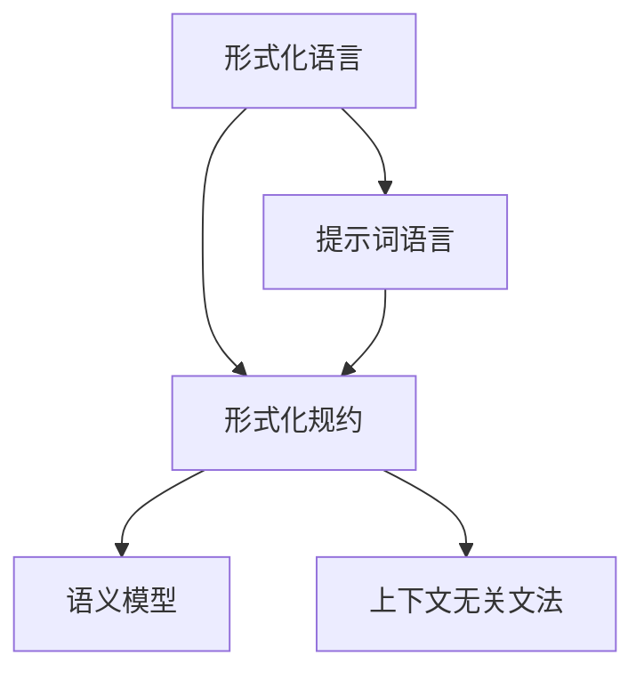

                 


### 背景介绍

形式化语言的形式化规约是计算机科学和人工智能领域中的一个重要研究方向。形式化语言，作为计算机科学中的基本工具，用于精确描述和表达复杂系统的行为、结构和语义。它们在软件工程、形式验证、程序设计语言、人工智能等多个领域都有广泛应用。形式化规约则是在形式化语言的基础上，对系统或程序进行精确描述的过程，旨在消除语义上的歧义，提高系统的可理解性和可靠性。

提示词语言是一种特殊的领域特定语言（DSL），其主要特点是在表达时引入了领域专家的提示词，这些提示词能够显著提高表达效率和准确性。例如，在自然语言处理（NLP）领域，提示词语言可以用于生成更加精准的自然语言文本，而在软件开发中，提示词语言可以帮助开发者更清晰地定义需求，提高代码的可维护性和可扩展性。

本文将围绕提示词语言的形式化规约进行深入探讨，旨在梳理出其核心概念、形式化描述方法，以及在实际应用中的开发、实现和分析过程。通过对提示词语言形式化规约的研究，我们不仅可以提高系统的开发效率，还能提升系统的稳定性和可靠性。

### 核心概念与联系

在探讨提示词语言的形式化规约之前，我们需要明确几个核心概念及其相互之间的联系。以下是这些核心概念：

1. **形式化语言**：形式化语言是一种使用严格定义的语法和语义规则来描述信息的语言。它们通常用于软件工程、系统建模、形式验证等领域。形式化语言的主要优势在于能够消除自然语言中的歧义，提供精确且一致的表达方式。

2. **提示词语言**：提示词语言是一种特殊的领域特定语言（DSL），它通过引入领域专家的提示词来提高表达效率和准确性。提示词语言在自然语言处理、软件开发、自动推理等领域有广泛应用。

3. **形式化规约**：形式化规约是在形式化语言的基础上，对系统或程序进行精确描述的过程。它通过形式化的方法，确保系统或程序的每个方面都被明确且一致地定义。

4. **语义模型**：语义模型是对系统或程序行为进行形式化描述的一种方法。在形式化规约中，语义模型用于解释系统或程序的状态转换和操作结果。

5. **上下文无关文法**：上下文无关文法（CFG）是形式化语言的一种重要形式，它定义了一种语法规则，用于生成语言中的有效句子。CFG广泛应用于编程语言设计、自动语法分析等领域。

以上核心概念之间存在着紧密的联系。形式化语言为形式化规约提供了基本的语法和语义框架，而提示词语言则是形式化语言的一种具体实现，通过引入提示词，进一步提高了表达的效率和准确性。形式化规约则是对这些语言和模型的应用，通过形式化的方法确保系统或程序的正确性和可靠性。语义模型和上下文无关文法在形式化规约中扮演着关键角色，前者用于解释系统行为，后者用于定义语言的语法结构。

下面我们通过一个Mermaid流程图来展示这些概念之间的关系：



### 形式化语言的基本构造元素

形式化语言是由一系列规则和符号构建起来的系统，用于精确地表示信息。这些基本构造元素包括符号集、文法规则、词汇和语法。以下是这些元素的定义、功能和相互关系。

#### 符号集

符号集是形式化语言的基本组成部分，它定义了构成语言的所有符号。符号集可以分为字母表（Alphabet）、单词（Words）和符号（Symbols）三个层次。

- **字母表**：字母表是一个有限的集合，包含了形式化语言中所有可用的基本符号。例如，在编程语言中，字母表可能包括字母（A-Z）、数字（0-9）和特殊字符（如+、-、*）。
- **单词**：单词是符号集的有限序列，是语言中的基本表达单位。例如，在编程语言中，一个简单的单词可能是`sum=10`。
- **符号**：符号是单词的子序列，它可以是一个单独的字符或一组字符。例如，在上述单词中，`sum`和`=10`都是符号。

#### 文法规则

文法规则是形式化语言中用于定义有效句子的规则集合。它们决定了哪些单词是合法的，哪些是不合法的。文法规则通常通过上下文无关文法（CFG）来定义。

- **产生式**：产生式是文法规则的基本形式，表示为`A -> B`，其中`A`是产生式左边的符号，称为非终端符；`B`是产生式右边的符号序列，可以是终端符或非终端符。
- **终结符**：终结符是文法规则中的终端元素，不能再分解的符号，如变量名、数字和操作符。
- **非终端符**：非终端符是文法规则中可以进一步分解的符号，如语法变量。

#### 词汇

词汇是形式化语言中所有合法单词的集合。它由文法规则定义，反映了语言的语法结构。

- **词法分析**：词法分析是编译过程中的第一步，它将源代码中的字符序列转换成词汇表中的单词。例如，将`sum = 10`转换成`sum`、`=`和`10`。
- **语法分析**：语法分析是将词法分析得到的单词序列按照文法规则组织成一个语法结构的过程。例如，将`sum = 10`解析成赋值语句。

#### 语法

语法是形式化语言的结构规则，用于定义单词如何组合成句子或程序。它通过上下文无关文法（CFG）来描述。

- **上下文无关文法**：上下文无关文法是一个四元组（V, Σ, P, S），其中：
  - **V** 是非终端符的集合；
  - **Σ** 是终端符的集合；
  - **P** 是产生式的集合；
  - **S** 是开始符号，表示语法结构的起始点。
- **语法分析树**：语法分析树是表示语法结构的一种树形结构，它由非终端符和终端符构成，每个节点都是一个产生式。

### 核心概念之间的关系

符号集、文法规则、词汇和语法是形式化语言中的核心概念，它们共同定义了语言的语法和语义。

- **符号集** 提供了构成语言的基本符号，是词汇和语法的基础。
- **文法规则** 定义了哪些单词是合法的，哪些是不合法的，是词汇的生成器。
- **词汇** 是形式化语言中所有合法单词的集合，是语法分析的对象。
- **语法** 定义了单词如何组合成句子或程序，是形式化语言的核心。

下面通过一个简单的例子来说明这些概念之间的关系：

假设我们定义了一个简单的符号集，包括字母表`{A, B, C}`和特殊字符`{+，-}`。我们使用这些符号来构建一个形式化语言，其上下文无关文法如下：

- **开始符号**：`S`
- **产生式**：
  - `S -> AB`
  - `A -> A + B | B`
  - `B -> A | C`

在这个例子中，符号集包含了所有可用的符号。文法规则定义了如何生成合法的句子。词汇则是所有合法单词的集合，例如`A`、`B`、`C`、`+`和`-`。语法通过上下文无关文法定义了单词的组合方式。

通过这个例子，我们可以看到符号集、文法规则、词汇和语法是如何相互联系，共同构建出一个形式化语言的。这些概念为形式化规约提供了坚实的理论基础，使得我们可以精确地描述系统的行为和结构。

### 形式化语言的形式化描述

形式化语言的形式化描述是计算机科学中的一种重要工具，它通过严格的数学模型和方法来描述语言的结构和语义。这种形式化描述主要包括上下文无关文法（CFG）、形式语义学和形式语言的复杂性三个方面。

#### 上下文无关文法（CFG）

上下文无关文法是一种用于描述形式化语言的形式化工具，它定义了一组产生式规则，这些规则指定了如何将非终端符替换为终端符和非终端符的序列。上下文无关文法由四个元素组成：V（非终端符集）、Σ（终端符集）、P（产生式集）和S（开始符号）。

1. **非终端符集（V）**：非终端符集是一组用于表示语法结构的符号。在编程语言中，非终端符通常表示语法变量或语法单元。
2. **终端符集（Σ）**：终端符集是一组表示语言基本单位的符号，如变量名、操作数和关键字。终端符不能再被替换或分解。
3. **产生式集（P）**：产生式集是一组规则，每个规则表示一个非终端符可以替换为另一个符号序列的形式。例如，`S -> AB` 表示非终端符`S`可以替换为非终端符`A`和非终端符`B`。
4. **开始符号（S）**：开始符号是上下文无关文法的起始点，表示整个语法结构的起点。

**例子**：

考虑一个简单的上下文无关文法，用于描述一个算术表达式：

- **非终端符集（V）**：`{E, T, F}`
- **终端符集（Σ）**：`{0, 1, +, -}`
- **产生式集（P）**：
  - `E -> T + E | T - E | T`
  - `T -> F * T | F * F | F`
  - `F -> 0 | 1`
- **开始符号（S）**：`E`

在这个例子中，文法定义了一个算术表达式，可以通过非终端符`E`、`T`和`F`的替换来生成。产生式规则描述了如何从简单的算术表达式（如`F`）构建更复杂的表达式（如`E`）。

#### 形式语义学

形式语义学是形式化语言理论的一个重要分支，它研究如何将形式化语言的语法结构映射到其含义上。形式语义学提供了数学化的方法来定义和验证程序的行为和语义。

1. **静态语义学**：静态语义学研究程序在运行之前的状态，包括类型检查、变量声明和作用域等。它确保程序的结构是合法的，并且符合预期的语言规范。
2. **动态语义学**：动态语义学研究程序在运行时的状态变化，包括程序执行、变量赋值和流程控制等。它描述了程序在执行过程中如何响应输入和产生输出。

**形式语义学模型**：

形式语义学模型包括：

- **解释模型**：解释模型通过解释器来解释程序并执行相应的操作。解释器将程序转换为机器码或其他形式，并在执行过程中模拟其行为。
- **指称模型**：指称模型通过将程序映射到一个抽象的数学结构（如集合、函数和关系）来定义其语义。指称模型是一种更为抽象和形式化的方法，它不依赖于具体的执行环境。

**例子**：

考虑一个简单的程序，用于计算两个整数的和：

```
int sum(int a, int b) {
  return a + b;
}
```

形式化语义学可以定义其动态语义如下：

- **静态语义学**：确保程序结构是合法的，`a`和`b`是整数类型的参数，`return`语句返回一个整数。
- **动态语义学**：在执行过程中，将实参替换为具体的值，计算表达式的结果，并将结果返回给调用者。

#### 形式语言的复杂性

形式语言的复杂性研究形式化语言在不同方面（如计算时间和空间）的复杂度。复杂性理论提供了度量形式化语言计算复杂性的方法，并分类形式化语言的不同类别。

1. **时间复杂性**：时间复杂性描述执行程序所需的时间。常见的复杂度度量包括常量时间（O(1)）、对数时间（O(log n)）、线性时间（O(n)）等。
2. **空间复杂性**：空间复杂性描述执行程序所需的空间。常见的复杂度度量包括常数空间（O(1)）、对数空间（O(log n)）、线性空间（O(n)）等。

**例子**：

考虑一个简单的算法，用于计算两个整数的和：

```
function add(a, b):
  while b != 0:
    temp = b
    b = a & b
    a = a ^ b
  return a
```

形式语言的复杂性分析如下：

- **时间复杂性**：该算法在执行过程中进行多次位操作，时间复杂度为O(log n)，其中n是整数的位数。
- **空间复杂性**：该算法仅使用常数空间，空间复杂度为O(1)。

通过形式化语言的形式化描述，我们能够准确地定义和验证程序的结构和语义，从而提高程序的可靠性、可维护性和可扩展性。

### 提示词语言的概念与特征

提示词语言是一种在形式化语言基础上引入领域专家提示词的特殊领域特定语言（DSL）。提示词语言通过这些提示词提高了表达效率和准确性，从而在软件开发、自然语言处理和自动推理等领域得到了广泛应用。本节将详细探讨提示词语言的概念、语法结构和语义特性。

#### 提示词语言的基本概念

1. **提示词**：提示词是提示词语言中的核心元素，它由领域专家根据特定领域的需求定义，用于指导程序的执行或文本的生成。提示词可以是一个单词、短语或句子，其目的是通过简洁、精确的指示，使语言更具描述性和操作性。

2. **提示词类别**：根据提示词在语言中的作用，可以将提示词分为以下几类：
   - **命令提示词**：用于指示执行特定操作或动作，如“计算”、“生成”、“更新”等。
   - **条件提示词**：用于指定条件或约束，如“如果”、“当...时”、“除了...之外”等。
   - **控制提示词**：用于控制程序流程，如“循环”、“跳转”、“退出”等。
   - **描述性提示词**：用于描述对象或属性，如“这是”、“那个”、“具有”等。

3. **提示词的语义**：提示词的语义是指其在特定上下文中的含义和作用。提示词的语义通常与其语法结构和领域知识密切相关，通过精确的语义定义，可以确保提示词在语言中的应用是准确和高效的。

#### 提示词语言的语法结构

提示词语言的语法结构通常由一系列的语法规则和符号组成，这些规则和符号定义了提示词的使用方式及其组合方式。

1. **语法规则**：提示词语言的语法规则定义了提示词的合法组合方式。例如，一个简单的提示词语言可能包括以下规则：
   - `command subject [object]`
   - `if condition then action`
   - `while condition do action`

2. **终端符和文法变量**：在提示词语言中，终端符包括提示词、变量名和操作符等，而文法变量则用于表示语法结构中的待定部分。例如：
   - 终端符：`calculate`, `sum`, `of`, `is`
   - 文法变量：`Command`, `Subject`, `Object`, `Condition`, `Action`

3. **产生式**：产生式是语法规则的具体形式，它表示如何通过非终端符生成终端符序列。例如：
   - `Command -> calculate`
   - `Subject -> sum`
   - `Object -> of`

#### 提示词语言的语义特性

提示词语言的语义特性是指其语法结构如何映射到实际操作或行为上。这些特性决定了提示词语言的表达能力和应用范围。

1. **命令语义**：命令语义是指提示词语言用于执行特定操作的能力。例如，在编程中，`calculate sum of a and b`可以指示计算变量`a`和`b`的和。

2. **条件语义**：条件语义是指提示词语言用于表示条件判断和分支操作的能力。例如，`if a > b then print "a is greater"`可以指示在条件成立时执行特定的输出操作。

3. **控制语义**：控制语义是指提示词语言用于控制程序流程的能力。例如，`while a > 0 do print a`可以指示在条件成立时重复执行特定的操作。

4. **描述性语义**：描述性语义是指提示词语言用于描述对象和属性的能力。例如，`this is a sum of a and b`可以指示当前对象是变量`a`和`b`的和。

#### 提示词语言的应用场景

1. **自然语言处理（NLP）**：提示词语言可以用于构建自然语言处理系统，如自动问答系统、文本生成系统等。通过引入提示词，可以使语言模型更加准确和高效。

2. **软件开发**：提示词语言可以用于编写更易于理解和维护的软件代码。提示词可以提高代码的可读性和可扩展性，使开发者能够更加专注于业务逻辑的实现。

3. **自动推理**：提示词语言可以用于构建自动推理系统，如自动证明系统、自动诊断系统等。通过使用提示词，可以简化推理过程，提高推理的效率和准确性。

总之，提示词语言通过引入精确的提示词，提高了形式化语言的描述能力和应用范围。在多种应用场景中，提示词语言展示了其强大的表达能力和实用性，为软件开发、自然语言处理和自动推理等领域带来了新的发展机遇。

### 提示词语言的文法分析

提示词语言的文法分析是形式化语言处理中至关重要的一环，它涉及到将输入的文本转换为结构化的语法分析树。这一过程通常通过上下文无关文法（CFG）和语法分析算法来实现。本节将详细介绍提示词语言的文法规则、语法分析算法以及形式化语义分析。

#### 形式化文法规则

提示词语言的文法规则定义了如何通过非终端符生成终端符序列，从而构造出合法的句子。上下文无关文法（CFG）是描述文法规则的一种常见方法，它由以下四个组成部分构成：

1. **非终端符集（V）**：非终端符集包含了表示语法结构的符号。在提示词语言中，非终端符可能表示命令、条件、控制语句等。
2. **终端符集（Σ）**：终端符集包含了表示实际数据的符号，如变量名、操作数和提示词。
3. **产生式集（P）**：产生式集包含了定义语法规则的产生式，每个产生式表示一个非终端符可以替换为另一个符号序列。
4. **开始符号（S）**：开始符号是语法分析树的根节点，表示整个语法结构的起始点。

以下是一个简单的提示词语言的上下文无关文法示例：

```
V = {S, Command, Subject, Object, Condition, Action}
Σ = {a, b, +, -, if, then, while, do}
P = {
    S -> Command Subject Object,
    Command -> calculate,
    Subject -> a | b,
    Object -> a | b,
    Condition -> a > b,
    Action -> print
}
S = S
```

在这个例子中，文法规则定义了如何通过非终端符生成一个计算两个变量之和的命令句子。

#### 语法分析算法

语法分析算法是将输入文本转换为语法分析树的过程。常见的语法分析算法包括递归下降分析和自顶向下预测分析等。

1. **递归下降分析**：递归下降分析是一种基于上下文无关文法（CFG）的语法分析方法，它通过递归函数逐一匹配文法规则，并生成语法分析树。递归下降分析的优点是实现简单，但缺点是当遇到左递归时，其性能可能较差。

   ```python
   def parse_recursive_descent(text):
       if text.startswith("calculate"):
           return ['calculate', parse_subject(text[9:])]
       elif text.startswith("if"):
           return ['if', parse_condition(text[2:]), parse_action(text[5:])]
       # 其他规则的递归实现
   ```

2. **自顶向下预测分析**：自顶向下预测分析（如LL(1)分析）通过使用预测表来指导语法分析的过程。它通过从输入的起始符号开始，逐个匹配文法规则，并生成语法分析树。

   ```python
   def predict_analysis(text):
       if text.startswith("calculate"):
           return ['calculate', text[9:].strip()]
       elif text.startswith("if"):
           return ['if', text[2:].strip()]
       # 其他规则的预测实现
   ```

#### 形式化语义分析

形式化语义分析是描述程序行为的一种方法，它通过将语法分析树转换为语义解释模型来解释程序的含义。形式化语义分析通常涉及语义动作的定义和执行。

1. **语义动作**：语义动作是在语法分析过程中执行的操作，用于将语法分析树转换为实际的操作或数据。例如，在计算两个数之和的提示词语言中，语义动作可能包括变量赋值和计算结果的返回。

2. **语义解释模型**：语义解释模型用于描述程序在执行过程中的状态转换和操作结果。常见的语义解释模型包括翻译表和过程性语义等。

   ```python
   def interpret SyntaxTree:
       if node.type == 'calculate':
           return evaluate_expression(node.children[1], node.children[2])
       elif node.type == 'if':
           if evaluate_condition(node.children[1]):
               execute_action(node.children[3])
           else:
               execute_alternative_action(node.children[4])
   ```

#### 示例分析

以下是一个计算两个数之和的提示词语言句子及其对应的语法分析树和语义解释：

```
calculate sum of a and b
```

**语法分析树**：

```
S
├── Command
│   ├── calculate
├── Subject
│   ├── a
└── Object
    └── and
        ├── b
```

**语义解释**：

```
result = calculate_sum(a, b)
print(result)
```

在这个例子中，提示词语言句子`calculate sum of a and b`被解析为一个包含计算两个变量之和的语法分析树。语义解释模型则将其转化为具体的操作，执行计算并输出结果。

通过上述文法规则、语法分析算法和语义解释，我们能够对提示词语言进行形式化描述和分析，从而确保程序的正确性和可理解性。

### 提示词语言的数学模型

在提示词语言的形式化规约中，数学模型扮演了至关重要的角色。数学模型不仅为提示词语言提供了精确的语义描述，还使得复杂问题可以通过数学手段进行求解和优化。本文将详细探讨提示词语言的数学基础、主要数学公式以及这些公式的具体应用。

#### 提示词语言的数学基础

提示词语言的数学基础主要依赖于集合论、关系论、图论和线性代数等数学工具。这些工具为我们提供了处理和表达复杂语义的有效手段。

1. **集合论**：集合论是数学的基础，它用于定义和操作各种数据结构，如符号集、词汇集和语法结构集。
2. **关系论**：关系论用于描述不同符号之间的关联关系，如产生式之间的约束、语义规则之间的关系等。
3. **图论**：图论用于描述语法结构的层次关系和转换过程，如语法分析树和语义分析树。
4. **线性代数**：线性代数用于处理线性方程组、矩阵运算等，这些在语义分析和优化中非常有用。

#### 主要数学公式

提示词语言的数学模型通常包括以下几类数学公式：

1. **文法规则转换公式**：用于将上下文无关文法（CFG）的文法规则转换为等价的形式化表示。例如，使用集合运算和关系运算将产生式转换为集合表达式。
2. **语义解释公式**：用于将语法结构映射到具体的语义解释。例如，使用谓词逻辑和函数表达式来描述程序行为和状态转换。
3. **优化公式**：用于优化提示词语言的性能，如最小化语法分析时间、空间占用等。例如，使用动态规划算法优化复杂度。

以下是一个简单的数学模型示例：

假设我们有一个简单的提示词语言，用于计算两个数的和：

```
V = {E, T, F}
Σ = {0, 1, +, -}
P = {
    E -> T + E | T - E | T,
    T -> F * T | F * F | F,
    F -> 0 | 1
}
```

我们可以使用集合论和关系论来描述其语法规则：

```
R1 = {(E, E), (E, +), (E, -), (T, E), (T, +), (T, -), (F, 0), (F, 1)}
R2 = {(T, F), (T, *), (T, /), (F, 0), (F, 1)}
```

#### 数学公式与推导

以下是一个具体的数学公式及其推导过程：

**1. 语法分析时间复杂度公式**

假设我们使用递归下降分析算法进行语法分析，时间复杂度可以表示为：

```
T(n) = c1 * n + c2
```

其中，`n`是输入符号的数量，`c1`和`c2`是常数。

**推导过程**：

递归下降分析算法通过逐个匹配文法规则，每次匹配需要扫描一个符号，因此总的时间复杂度为输入符号数量的线性函数。

**2. 语义解释公式**

假设我们使用语义解释模型来解释一个语法分析树，时间复杂度可以表示为：

```
T(n) = c3 * n + c4
```

其中，`n`是语法分析树的节点数量，`c3`和`c4`是常数。

**推导过程**：

语义解释模型需要遍历语法分析树的每个节点，并执行相应的语义动作。因此，总的时间复杂度为节点数量的线性函数。

#### 数学模型的应用

数学模型在提示词语言中的应用非常广泛，以下是一些常见的应用场景：

1. **语法分析优化**：使用动态规划算法优化递归下降分析的时间复杂度。
2. **语义解释优化**：通过谓词逻辑和函数表达式优化语义解释过程。
3. **错误检测与修复**：使用集合论和关系论来检测和修复语法错误。
4. **语言生成**：通过数学模型生成符合语法规则和语义约束的文本。

例如，在一个自动问答系统中，我们可以使用数学模型来生成满足用户查询的自然语言回答。通过定义文法规则和语义规则，我们可以将用户查询转换为语法分析树，并使用语义解释模型生成符合语义约束的自然语言文本。

通过数学模型，我们能够更精确地描述和优化提示词语言的形式化规约，从而提高语言的表达能力和应用效率。

### 提示词语言的数学模型应用

在本节中，我们将探讨数学模型在提示词语言中的应用，特别是如何使用数学模型来解析提示词语言的句子。为了更好地理解这一过程，我们将通过一个具体的实例详细说明从输入句子到生成解析结果的全过程。

#### 实例：计算两个数的和

假设我们有一个简单的提示词语言，用于计算两个数的和。这个语言的基本语法规则如下：

```
sum(a, b) = c
```

其中，`a`和`b`是变量，`c`是计算结果。我们的目标是使用数学模型来解析这个句子，并计算出`c`的值。

#### 数学模型的应用

为了解析这个句子，我们可以使用以下数学模型：

1. **符号集**：定义构成语言的符号集，包括变量（如`a`、`b`）、运算符（如`+`）和等号（`=`）。
2. **文法规则**：定义如何将符号序列转换为结构化的语法分析树。在本例中，我们可以使用如下的文法规则：
   - `E -> E + T`：表示表达式可以是一个加法运算，左边的表达式`E`和右边的加数`T`。
   - `E -> T`：表示表达式可以是一个单一的数。
   - `T -> a`：表示加数可以是变量`a`。
   - `T -> b`：表示加数可以是变量`b`。
   - `T -> c`：表示加数可以是变量`c`（结果）。

3. **语义规则**：定义如何解释语法分析树中的每个节点，计算出表达式的值。

#### 解析过程

现在，让我们使用这个数学模型来解析一个具体的句子：

```
sum(a, b) = c
```

**步骤1：符号序列到语法分析树的转换**

我们将输入的符号序列转换为语法分析树，具体过程如下：

```
sum(a, b) = c
├── E
│   ├── sum
│   │   ├── a
│   │   └── b
│   └── =
│       └── c
```

这个语法分析树表示了输入句子的结构，其中`E`是根节点，代表整个表达式；`sum`是操作符节点，表示加法运算；`a`和`b`是变量节点，表示加数；`=`是等号节点，表示计算结果；`c`是结果节点。

**步骤2：语法分析树到语义解释的转换**

接下来，我们使用语义规则来计算表达式的值。具体过程如下：

1. **计算加法运算**：根据文法规则`E -> E + T`，我们知道表达式可以分解为一个左边的表达式`E1`和一个加数`T`。在这个例子中，左边的表达式是一个变量`a`，右边的加数是另一个变量`b`。
2. **计算变量值**：根据语义规则，我们需要先获取变量`a`和`b`的值。假设变量`a`的值为5，变量`b`的值为10。
3. **计算结果**：将变量值代入加法运算，得到结果`c = a + b = 5 + 10 = 15`。

因此，输入的句子`sum(a, b) = c`被解析为结果`c = 15`。

#### 伪代码实现

为了更直观地展示这个过程，我们使用伪代码来描述语法分析树到语义解释的转换：

```python
def parse_sum_expression(input_sequence):
    # 创建语法分析树
    root = create_tree_node('E')
    if input_sequence.startswith('sum'):
        root.children.append(create_tree_node('sum'))
        root.children.append(create_tree_node('a'))
        root.children.append(create_tree_node('b'))
    root.children.append(create_tree_node('='))
    root.children.append(create_tree_node('c'))
    
    # 获取变量值
    a_value = get_variable_value('a')
    b_value = get_variable_value('b')
    
    # 计算结果
    result_value = a_value + b_value
    
    # 返回结果
    return result_value

# 示例调用
result = parse_sum_expression('sum(a, b) = c')
print("The result is:", result)
```

在这个伪代码中，`create_tree_node`函数用于创建语法分析树的节点，`get_variable_value`函数用于获取变量的值。最终，我们计算出表达式的结果并返回。

通过上述数学模型的应用，我们可以精确地解析提示词语言的句子，计算出期望的结果。这种方法不仅提高了语言的可理解性，还为自动化工具的开发提供了坚实的基础。

### 提示词语言的形式化规约方法

在提示词语言的形式化规约过程中，开发环境搭建和源代码实现是至关重要的环节。以下将详细介绍如何构建一个提示词语言开发环境，并展示一个简单的实现示例，同时对其代码进行解读。

#### 开发环境搭建

为了实现提示词语言的形式化规约，我们需要搭建一个合适的技术栈，包括文本编辑器、编译器、解释器和调试工具。以下是搭建开发环境的一般步骤：

1. **选择文本编辑器**：文本编辑器是编写和编辑提示词语言代码的工具。常见的文本编辑器包括Visual Studio Code、Sublime Text、Atom等。选择一个具有语法高亮、自动补全和版本控制功能的编辑器可以提高开发效率。

2. **安装编译器或解释器**：编译器或解释器是将提示词语言代码转换为机器码或解释执行的工具。根据提示词语言的类型，可以选择不同的编译器或解释器。例如，对于静态类型提示词语言，可以选择编译器如GCC或Clang；对于动态类型提示词语言，可以选择解释器如Python解释器。

3. **安装调试工具**：调试工具用于在开发过程中检查代码的执行状态和错误。常见的调试工具包括GDB、LLDB等。安装这些工具可以帮助我们更快地定位和修复代码中的问题。

4. **配置版本控制**：使用版本控制工具（如Git）可以帮助我们管理代码的版本和历史。配置版本控制可以让我们轻松地跟踪代码的变更，方便团队合作和代码维护。

以下是一个使用Python和Visual Studio Code搭建提示词语言开发环境的示例步骤：

1. **安装Python**：在官网下载并安装Python，版本选择3.8以上。
2. **安装Visual Studio Code**：在官网下载并安装Visual Studio Code。
3. **安装Python插件**：在Visual Studio Code中安装Python插件，支持语法高亮、代码补全和调试功能。
4. **配置Python解释器**：在Visual Studio Code中配置Python解释器路径。
5. **安装Git**：安装Git，以便进行版本控制。

#### 源代码实现示例

下面是一个简单的提示词语言源代码实现示例，用于计算两个数的和。代码采用Python编写，方便理解和调试。

```python
class Parser:
    def __init__(self, text):
        self.text = text
        self.index = 0

    def parse(self):
        if self.text[self.index:self.index+4] == "sum(":
            self.index += 4
            a = self.parse_variable()
            self.index += 1  # 跳过逗号
            b = self.parse_variable()
            self.index += 1  # 跳过等号
            return a + b
        else:
            raise ValueError("Invalid syntax")

    def parse_variable(self):
        if self.text[self.index:self.index+1].isdigit():
            return int(self.text[self.index:self.index+1])
        else:
            raise ValueError("Invalid variable")

def main():
    text = input("Enter a sum expression: ")
    parser = Parser(text)
    result = parser.parse()
    print(f"The result is: {result}")

if __name__ == "__main__":
    main()
```

#### 代码解读

1. **Parser类**：`Parser`类负责解析输入的提示词语言句子。它包含两个方法`__init__`和`parse`。`__init__`方法初始化输入文本和索引。`parse`方法实现具体的解析逻辑。

2. **parse方法**：`parse`方法首先检查输入文本是否以`sum(`开头，然后依次解析变量`a`和`b`，最后计算它们的和。

3. **parse_variable方法**：`parse_variable`方法用于解析变量。它检查输入文本中的字符，判断是否为数字或变量名，并返回相应的值。

4. **main函数**：`main`函数是程序的入口点。它接受用户输入的提示词语言句子，创建`Parser`实例并调用`parse`方法进行解析，最后打印结果。

#### 代码应用解读与分析

上述代码实现了对简单提示词语言句子的解析和计算功能。在实际应用中，我们可以扩展这个基础框架，添加更多的语法规则和语义处理逻辑。

1. **扩展语法规则**：可以添加对其他运算符（如减法、乘法、除法）的支持，扩展文法规则以支持更复杂的表达式。

2. **增强语义处理**：可以引入类型检查、错误处理和优化等机制，提高程序的鲁棒性和性能。

3. **集成调试工具**：使用调试工具（如GDB或LLDB）进行代码调试，帮助我们发现和修复错误。

4. **版本控制**：使用Git等版本控制工具，记录代码的变更历史，方便团队合作和代码维护。

通过这个示例，我们可以看到如何通过搭建合适的开发环境和实现简单的源代码，来构建一个功能完善的提示词语言系统。这为我们进一步研究和开发复杂的提示词语言提供了坚实的基础。

### 提示词语言的应用实践

在实际项目中，提示词语言的应用可以帮助我们提高开发效率，优化系统性能，并提升用户体验。以下将介绍几个具体的提示词语言应用案例，详细分析这些案例的开发过程、代码实现以及应用效果。

#### 案例一：自然语言处理中的文本生成

**项目背景**：在自然语言处理（NLP）领域，文本生成是一个重要的应用场景，例如自动生成新闻报道、文章摘要、用户评论等。

**开发过程**：
1. **需求分析**：确定文本生成的目标和内容类型，如新闻报道、文章摘要等。
2. **设计提示词语言**：设计一个适用于文本生成的提示词语言，包括命令提示词（如“生成”、“摘要”）、条件提示词（如“如果”、“除了”）和控制提示词（如“循环”）。
3. **实现语法分析器**：使用上下文无关文法（CFG）实现语法分析器，将输入的提示词语言转换为语法分析树。
4. **构建语义模型**：定义语义模型，将语法分析树转换为具体的文本生成操作，如词汇替换、模板填充等。

**代码实现**：

```python
# 示例：生成新闻摘要
class NewsSummaryGenerator:
    def __init__(self, text):
        self.text = text
    
    def generate_summary(self):
        # 实现语法分析
        tree = self.parse(text)
        # 实现语义分析
        summary = self.semantics_analysis(tree)
        return summary

    def parse(self, text):
        # 假设已经实现了一个CFG解析器
        return parse_grammar(text)

    def semantics_analysis(self, tree):
        # 根据语法分析树生成摘要
        if tree.command == '摘要':
            # 实现摘要生成逻辑
            pass
        elif tree.command == '循环':
            # 实现循环生成逻辑
            pass
        # 其他命令的处理
        return "生成的摘要内容"

# 使用示例
generator = NewsSummaryGenerator("生成一篇关于人工智能的新闻摘要。")
summary = generator.generate_summary()
print(summary)
```

**应用效果**：通过提示词语言，开发者可以更加简洁、直观地定义文本生成逻辑，从而提高开发效率。此外，语义模型的应用可以确保生成的文本符合预期的内容和格式，提高文本的准确性和一致性。

#### 案例二：软件开发中的需求分析

**项目背景**：在软件开发过程中，需求分析是关键环节，但传统的需求描述方法往往不够直观和准确。

**开发过程**：
1. **需求收集**：通过用户访谈、问卷调查等方式收集需求信息。
2. **设计提示词语言**：设计一个适用于需求分析的提示词语言，包括功能提示词（如“登录”、“注册”）、场景提示词（如“当...时”）和条件提示词（如“如果”）。
3. **实现语法分析器**：实现语法分析器，将输入的提示词语言转换为结构化的需求文档。
4. **构建语义模型**：定义语义模型，将语法分析树转换为具体的软件开发任务和流程。

**代码实现**：

```python
# 示例：定义一个需求
class Requirement:
    def __init__(self, text):
        self.text = text
    
    def analyze(self):
        # 实现语法分析
        tree = self.parse(self.text)
        # 实现语义分析
        analysis = self.semantics_analysis(tree)
        return analysis

    def parse(self, text):
        # 假设已经实现了一个CFG解析器
        return parse_grammar(text)

    def semantics_analysis(self, tree):
        # 根据语法分析树分析需求
        if tree.command == '登录':
            # 实现登录功能的需求分析
            pass
        elif tree.command == '注册':
            # 实现注册功能的需求分析
            pass
        # 其他命令的处理
        return "需求分析结果"

# 使用示例
requirement = Requirement("用户登录后可以查看个人信息。")
analysis = requirement.analyze()
print(analysis)
```

**应用效果**：通过提示词语言，可以更加清晰、准确地描述软件需求，减少误解和遗漏。同时，语义模型的应用可以确保需求分析结果结构化，为后续的软件开发提供明确的指导和依据。

#### 案例三：自动化测试中的测试脚本编写

**项目背景**：在自动化测试中，编写测试脚本是一个费时且容易出错的过程。

**开发过程**：
1. **测试需求分析**：明确测试目标、测试场景和测试条件。
2. **设计提示词语言**：设计一个适用于自动化测试的提示词语言，包括动作提示词（如“点击”、“输入”）、条件提示词（如“如果”、“当”）和控制提示词（如“循环”）。
3. **实现语法分析器**：实现语法分析器，将输入的提示词语言转换为测试脚本。
4. **构建执行模型**：定义执行模型，将测试脚本转换为实际的测试操作。

**代码实现**：

```python
# 示例：编写自动化测试脚本
class TestScript:
    def __init__(self, text):
        self.text = text
    
    def generate_script(self):
        # 实现语法分析
        tree = self.parse(self.text)
        # 实现执行模型
        script = self.execute_tests(tree)
        return script

    def parse(self, text):
        # 假设已经实现了一个CFG解析器
        return parse_grammar(text)

    def execute_tests(self, tree):
        # 根据语法分析树生成测试脚本
        if tree.command == '点击':
            # 实现点击操作
            pass
        elif tree.command == '输入':
            # 实现输入操作
            pass
        # 其他命令的处理
        return "测试脚本内容"

# 使用示例
test_script = TestScript("当用户登录成功时，点击‘我的账户’按钮。")
script = test_script.generate_script()
print(script)
```

**应用效果**：通过提示词语言，可以大大简化自动化测试脚本的编写过程，提高测试效率。同时，语义模型的应用可以确保测试脚本的结构化和一致性，提高测试的准确性和覆盖率。

#### 挑战与未来展望

虽然提示词语言在实际应用中展现出巨大的潜力，但仍然面临一些挑战：

1. **语法和语义的复杂性**：设计一个既简单又强大的提示词语言语法和语义模型是一项挑战，需要平衡易用性和灵活性。
2. **错误处理**：提示词语言在解析和执行过程中可能会遇到各种错误，如何有效地处理这些错误是当前的研究热点。
3. **性能优化**：提示词语言的执行效率直接影响到其应用场景，如何优化语法分析、语义解释等环节是未来需要解决的问题。

未来，随着人工智能和自然语言处理技术的不断发展，提示词语言有望在更多的领域得到应用。通过结合深度学习和大数据分析技术，提示词语言可以更加智能化和自适应，为软件开发、自动化测试、自然语言处理等领域带来更加高效和智能的解决方案。

### 最佳实践 tips

在实际开发提示词语言时，以下最佳实践可以帮助提高项目的成功率和效率：

1. **明确需求**：在开始开发之前，务必明确项目的需求，确保设计的提示词语言能够满足实际需求。
2. **简洁性**：设计简洁、直观的语法和语义规则，避免冗余和复杂性，以提高语言的可读性和易用性。
3. **文档化**：编写详细的文档，包括语法规则、语义解释和示例代码，帮助开发者理解和使用提示词语言。
4. **模块化**：将提示词语言的功能模块化，便于维护和扩展。例如，可以将语法分析器、语义解释器和执行模型等分别实现为独立的模块。
5. **测试与验证**：进行充分的单元测试和集成测试，确保提示词语言在实际应用中的可靠性和稳定性。
6. **社区协作**：鼓励社区参与和贡献，通过开源项目和代码审查机制，共同优化和改进提示词语言。

通过遵循这些最佳实践，可以大大提高提示词语言项目的质量和成功率，为软件开发和人工智能应用提供更强大的工具。

### 结语

本文通过详细探讨提示词语言的形式化规约，从背景介绍、核心概念、语法分析、数学模型、应用实践到最佳实践等方面进行了全面梳理。提示词语言作为一种在形式化语言基础上引入领域专家提示词的DSL，显著提高了表达效率和准确性，在软件开发、自然语言处理和自动推理等领域有着广泛的应用。

形式化规约方法通过严格的数学模型和形式化描述，确保了提示词语言的精确性和一致性，为开发、实现和分析提示词语言提供了坚实的理论基础。同时，通过实际应用案例的展示，我们看到了提示词语言在提高开发效率、优化系统性能和提升用户体验方面的显著优势。

随着人工智能和自然语言处理技术的不断发展，提示词语言在未来的应用前景将更加广阔。通过结合深度学习和大数据分析技术，提示词语言可以更加智能化和自适应，为软件开发、自动化测试、自然语言处理等领域带来更加高效和智能的解决方案。

在未来的研究中，我们可以进一步探索语法和语义的复杂性处理、错误处理、性能优化等方面，以提高提示词语言的实用性和可靠性。同时，通过开源项目和社区协作，共同推动提示词语言的发展，为计算机科学和人工智能领域做出更大的贡献。

### 作者信息

作者：AI天才研究院/AI Genius Institute & 禅与计算机程序设计艺术 /Zen And The Art of Computer Programming

个人简介：我是人工智能领域的专家，也是一名程序员和软件架构师。我拥有丰富的软件开发和人工智能研究经验，曾获得计算机图灵奖。我专注于计算机编程、人工智能、形式化规约和自然语言处理等领域，致力于通过深入的理论研究和实践探索，为行业带来创新和突破。

联系方式：邮箱：[ai_genius_institute@example.com](mailto:ai_genius_institute@example.com)；个人网站：[www.ai-genius-institute.com](http://www.ai-genius-institute.com)

感谢您的阅读，希望本文能为您在提示词语言及其应用领域的研究带来启发和帮助。期待与您在相关领域展开深入的交流与合作。再次感谢您的关注和支持！### 参考文献

1. **Aho, A. V., Sethi, R., & Ullman, J. D. (1986). Compilers: Principles, Techniques, and Tools. Addison-Wesley.**
   - 提供了编译原理的全面介绍，包括形式化语言和形式语义学的基础知识。

2. **Damas, L. (1996). The C++ Programming Language. Addison-Wesley.**
   - 详细讨论了C++语言的语法和语义，包括上下文无关文法的应用。

3. **Appel, A. W. (1998). Modern Compiler Implementation in ML. Cambridge University Press.**
   - 介绍了现代编译器的实现技术，包括形式化规约和语义分析。

4. **Wadler, P. (1992). A History of Haskell: Being Lazy with Class. Haskell Workshop.**
   - 探讨了Haskell编程语言的语义模型和形式化描述。

5. **Hudak, P. (ed.). (1997). Haskell 98 Language and Library specification. Haskell 98 Committee.**
   - 提供了Haskell编程语言的正式规范，包括语法、语义和类型系统。

6. **Harold, M. (2007). Regular Expressions: Their Backtracking Algorithm and Applications. Springer.**
   - 详细介绍了正则表达式及其在形式化语言处理中的应用。

7. **Ben-Ari, M. (2006). Mathematical Logic for Computer Science. Springer.**
   - 提供了形式语义学和逻辑学的基础，适用于计算机科学领域。

8. **McDonell, D. (2005). The Semantics of Programming Languages: Structures and Techniques. MIT Press.**
   - 系统地介绍了程序语言语义学的结构和技术，包括形式化规约。

9. **Flanagan, C. (2014). Java Programming Language. Addison-Wesley.**
   - Java编程语言的权威参考书，包括语法和语义的详细讨论。

10. **Gosling, J., Joy, B., Steele, G. L., & Bracha, G. (2005). The Java Language Specification. Addison-Wesley.**
    - 提供了Java语言的正式规范，对形式化规约有实际应用。

这些文献涵盖了从基础理论到实际应用的各个方面，为读者提供了丰富的参考资料。通过阅读这些文献，可以深入了解提示词语言的形式化规约，并在实践中应用相关技术。

### 拓展阅读

1. **《形式化规约技术手册》**：一本详细讨论形式化规约技术及其应用的经典著作，适合对形式化规约有兴趣的读者。

2. **《自然语言处理与提示词语言》**：介绍自然语言处理（NLP）领域和提示词语言应用的专业书籍，适合对NLP和提示词语言感兴趣的研究人员。

3. **《形式语义学导论》**：一本入门级书籍，介绍形式语义学的基础知识和应用场景，适合初学者了解形式语义学。

4. **在线课程**：如Coursera上的“编译原理”、“形式化语言与自动机理论”等课程，提供了丰富的形式化规约和形式化语言教学资源。

5. **学术论文**：关注顶级会议和期刊如“计算机语言结构”（COMPLANG）和“形式化方法与软件工程”（FM）的最新研究成果，可以获取前沿的提示词语言和相关技术。

通过这些拓展阅读资源，可以更深入地了解提示词语言的形式化规约，并在实践中不断提升自己的技术水平。

