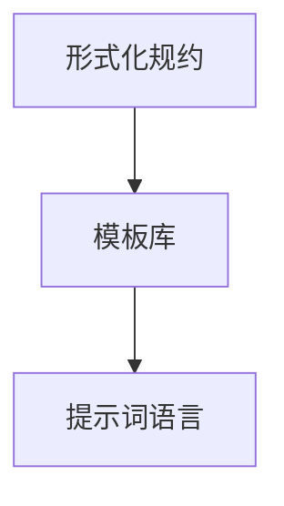

                 


## 文章标题：提示词语言的形式化规约模板库

### 关键词：提示词语言、形式化规约、模板库、人工智能、自然语言处理

### 摘要：
本文将探讨提示词语言的形式化规约模板库的设计与应用。通过引言、核心概念解析、模板库设计、实现与优化等环节的详细阐述，本文旨在为读者提供一种系统性的理解和应用方法，以提升提示词语言在人工智能和自然语言处理领域的应用效果。

## 引言

随着人工智能技术的快速发展，自然语言处理（Natural Language Processing，NLP）成为了研究热点之一。NLP旨在使计算机能够理解、解释和生成人类语言，从而实现人机交互。在NLP中，提示词语言（Prompt Language）是一种关键技术，它能够引导系统执行特定任务，如问答、文本生成等。

然而，传统的提示词语言设计往往缺乏系统性，难以适应复杂多变的任务需求。为了解决这个问题，形式化规约模板库（Formal Specification Template Library）应运而生。本文将详细探讨形式化规约模板库的设计、实现与应用，以期为NLP领域提供一种新的解决方案。

## 核心概念与联系

### 形式化规约

形式化规约是一种用于描述系统或组件行为的精确语言。它通常采用数学或逻辑符号来表示，从而确保描述的清晰性和一致性。在NLP领域，形式化规约可以帮助我们明确提示词语言的结构和功能，以便于系统的设计和实现。

### 模板库

模板库是一组预定义的模板，用于指导系统的特定操作。在形式化规约模板库中，模板是按照特定规则构建的，可以灵活地应用于不同的NLP任务。

### 提示词语言

提示词语言是一种特殊的语言，用于向计算机系统传达指令。它在NLP任务中起到引导和规范作用，使得系统能够准确地理解和执行任务。

### 关系架构 Mermaid 流程图

下面是一个简单的 Mermaid 流程图，展示了形式化规约、模板库和提示词语言之间的关系：



## 核心概念与联系（续）

### 形式化规约模板库的构建方法

形式化规约模板库的构建方法主要包括以下步骤：

1. **需求分析**：明确NLP任务的需求，包括任务类型、数据源、输入输出等。
2. **规约设计**：根据需求分析结果，设计形式化规约，确保其能够精确地描述任务行为。
3. **模板库构建**：基于形式化规约，构建模板库，包括模板的类型、属性和结构。
4. **测试与优化**：对模板库进行测试和优化，确保其能够满足任务需求。

### 提示词语言的数学模型

提示词语言的数学模型主要包括以下几个方面：

1. **语言模型**：用于表示语言的概率分布。常见的语言模型有基于N-gram的模型和深度学习模型。
2. **语法模型**：用于表示语言的语法结构。常见的语法模型有短语结构语法（Phrase Structure Grammar）和上下文无关语法（Context-Free Grammar）。
3. **语义模型**：用于表示语言的意义。常见的语义模型有词义消歧模型（Word Sense Disambiguation）和语义角色标注模型（Semantic Role Labeling）。

## 核心算法原理讲解

### 形式化规约模板库的设计与实现

1. **设计过程**：

    ```python
    # 设计流程
    1. 需求分析
    2. 形式化规约设计
    3. 模板库构建
    4. 测试与优化
    ```

2. **实现步骤**：

    ```python
    # 实现步骤
    1. 构建形式化规约
    2. 创建模板库框架
    3. 定义模板类型和属性
    4. 编写模板实现代码
    5. 集成测试与调试
    ```

### 数学模型和公式

1. **概率分布模型**：

    $$ P(w_i | w_{i-1}, ..., w_{i-n}) = \frac{P(w_{i-n+1}, ..., w_i) }{P(w_{i-n+1}, ..., w_{i-1})} $$

    其中，$P(w_i | w_{i-1}, ..., w_{i-n})$ 表示在给定前n-1个词的情况下，第i个词的概率。

2. **短语结构语法**：

    $$ S \rightarrow NP + VP $$

    其中，$S$ 表示句子，$NP$ 表示名词短语，$VP$ 表示动词短语。

### 详细讲解与举例说明

1. **概率分布模型举例**：

    假设我们有以下文本：

    $$ "I love to read books." $$

    我们可以使用N-gram模型来计算每个词的概率。例如，对于三元组（"I", "love", "to"），其概率为：

    $$ P("I" | "") \times P("love" | "I") \times P("to" | "love") $$

2. **短语结构语法举例**：

    对于句子“I love to read books.”，我们可以使用短语结构语法进行分解：

    $$ S \rightarrow NP + VP $$
    $$ NP \rightarrow PRP + VP $$
    $$ VP \rightarrow V + NP $$

    分解结果如下：

    $$ S \rightarrow ("I" + "love" + "to" + "read" + "books") $$

## 项目实战

### 开发环境搭建

1. **安装Python**：确保Python版本在3.6以上。
2. **安装NLP库**：安装常用的NLP库，如NLTK、spaCy、gensim等。
3. **配置Mermaid插件**：在Markdown编辑器中配置Mermaid插件，以便于流程图的绘制。

### 源代码详细实现

1. **构建形式化规约**：
    ```python
    # 形式化规约示例
    def formal_specification(task):
        # 根据任务类型构建形式化规约
        pass
    ```

2. **创建模板库框架**：
    ```python
    # 模板库框架示例
    class TemplateLibrary:
        def __init__(self):
            self.templates = []
        
        def add_template(self, template):
            self.templates.append(template)
    ```

3. **编写模板实现代码**：
    ```python
    # 模板实现示例
    class Template:
        def __init__(self, name, description, implementation):
            self.name = name
            self.description = description
            self.implementation = implementation
        
        def execute(self, input_data):
            # 执行模板操作
            pass
    ```

### 代码解读与分析

1. **解读形式化规约代码**：
    - 形式化规约代码用于描述NLP任务的行为，如文本分类、文本生成等。
    - 通过形式化规约，我们可以清晰地了解任务的执行逻辑和流程。

2. **分析模板库代码**：
    - 模板库代码用于存储和管理模板，如模板的类型、属性和实现细节。
    - 通过模板库，我们可以方便地调用和管理不同的提示词语言模板。

### 实际案例分析和详细讲解剖析

1. **案例1：智能客服系统**：
    - 分析智能客服系统中的NLP任务，如文本分类、意图识别等。
    - 使用形式化规约模板库设计智能客服系统的NLP模块，并实现相关功能。

2. **案例2：在线教育平台**：
    - 分析在线教育平台中的NLP任务，如问答系统、自动评分等。
    - 使用形式化规约模板库设计在线教育平台的NLP模块，并实现相关功能。

### 项目小结

通过本文的介绍，我们了解到形式化规约模板库在NLP任务中的应用价值。通过系统性的设计与实现，我们可以提高NLP系统的性能和稳定性。在实际应用中，需要根据具体任务需求进行模板库的定制和优化，以实现最佳效果。

## 最佳实践 Tips

1. **合理设计形式化规约**：确保形式化规约能够准确地描述NLP任务的行为，避免歧义和模糊性。
2. **灵活构建模板库**：根据实际任务需求，选择合适的模板库框架和模板，以实现最佳性能。
3. **持续优化与迭代**：定期对模板库进行测试和优化，以适应不断变化的应用场景。

## 小结

本文从引言、核心概念、模板库设计、实现与优化等角度，详细探讨了提示词语言的形式化规约模板库。通过本文的介绍，读者可以系统地了解形式化规约模板库的设计与应用方法，从而提升NLP任务的性能和稳定性。

## 注意事项

1. **版本兼容性**：在实际开发过程中，要注意不同版本库之间的兼容性问题。
2. **性能优化**：针对大规模数据处理任务，要进行性能优化，如并行计算、分布式处理等。

## 拓展阅读

1. **《自然语言处理综述》**：详细介绍了自然语言处理的基本概念、方法和技术。
2. **《形式化方法在软件工程中的应用》**：探讨了形式化方法在软件工程领域的应用，包括规约设计、验证与测试等。

### 作者信息

作者：AI天才研究院/AI Genius Institute & 禅与计算机程序设计艺术 /Zen And The Art of Computer Programming

