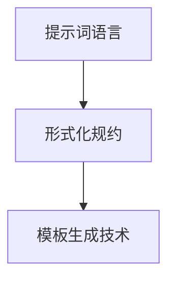

                 


### 文章标题：提示词语言的形式化规约模板生成

#### 关键词：提示词语言、形式化规约、模板生成、算法原理、数学模型

#### 摘要：
本文将深入探讨提示词语言的形式化规约模板生成技术，从基础概念出发，逐步讲解核心算法原理、数学模型，并通过实际项目案例展示应用方法。文章旨在为读者提供一个系统、全面的学习路径，帮助理解并掌握提示词语言模板生成技术的核心内容。

----------------------------------------------------------------

### 引言

提示词语言（Keywords Language）是一种专门用于生成特定文本的计算机语言，广泛应用于自然语言处理、文本生成和自动问答等领域。随着人工智能技术的发展，如何高效地生成高质量的提示词语言模板已成为研究的热点。形式化规约（Formalization Specification）是一种将语言规则、语义和语法形式化的方法，通过精确的数学模型和算法来描述语言的生成过程。

本文旨在探讨如何使用形式化规约方法生成提示词语言模板。文章将首先介绍提示词语言和形式化规约的基本概念，然后深入讲解核心算法原理和数学模型，并通过实际项目案例展示应用方法。文章结构如下：

1. **核心概念与联系**：介绍提示词语言、形式化规约和模板生成技术的基本概念，并展示它们之间的关系。
2. **核心算法原理讲解**：详细阐述用于生成模板的核心算法原理，包括算法流程和伪代码实现。
3. **数学模型和数学公式**：介绍用于模板生成的数学模型，使用公式和举例说明其应用。
4. **项目实战**：通过实际项目案例展示如何应用这些概念、算法和模型。

### 核心概念与联系

#### 提示词语言

提示词语言是一种特殊的计算机语言，主要用于生成特定类型的文本。例如，在自然语言处理中，提示词语言可以用于生成问题回答、摘要和对话文本。提示词语言的语法和语义相对简单，通常由一系列关键词和短语组成。

#### 形式化规约

形式化规约是一种将语言规则、语义和语法形式化的方法。它通过精确的数学模型和算法来描述语言的生成过程，从而提高语言的可靠性和可维护性。形式化规约通常涉及语法分析、语义分析和文本生成等步骤。

#### 模板生成技术

模板生成技术是一种通过算法和模型生成特定文本的方法。在提示词语言中，模板生成技术用于生成满足特定规则和要求的文本。模板生成技术包括关键词选择、短语组合和文本生成等步骤。

#### 核心概念之间的关系

提示词语言、形式化规约和模板生成技术之间存在紧密的联系。提示词语言为模板生成提供了基础语言和规则，形式化规约提供了精确的描述和生成方法，模板生成技术将两者结合起来，实现高质量的文本生成。

#### Mermaid 流程图

以下是一个简单的 Mermaid 流程图，展示了提示词语言、形式化规约和模板生成技术之间的关系：



### 核心算法原理讲解

#### 提示词语言模板生成算法

提示词语言模板生成算法是一种基于形式化规约的文本生成方法。它主要包括以下步骤：

1. **关键词选择**：根据文本生成的目标和要求，选择合适的提示词。
2. **短语组合**：将选择的关键词组合成短语，形成初步的文本。
3. **文本生成**：根据短语组合和语言规则，生成满足要求的文本。

以下是一个简单的伪代码示例：

```python
def generate_template(keywords, phrases):
    template = ""
    for keyword in keywords:
        for phrase in phrases:
            if keyword in phrase:
                template += phrase + " "
    return template.strip()
```

#### 提示词语言模板生成算法的应用场景和性能分析

提示词语言模板生成算法可以应用于多种场景，如自然语言处理、文本摘要和自动问答等。以下是一个简单的应用场景和性能分析：

**应用场景**：自动问答系统

**性能分析**：

- **时间复杂度**：O(n^2)，其中 n 是关键词和短语的组合数量。
- **空间复杂度**：O(n)，存储生成的文本。

#### 算法性能优化策略

为了提高算法的性能，可以考虑以下策略：

1. **预处理**：对关键词和短语进行预处理，减少冗余计算。
2. **并行计算**：利用多线程或分布式计算，提高计算速度。
3. **缓存**：缓存已生成的文本，减少重复计算。

### 数学模型和数学公式

#### 数学模型

提示词语言模板生成过程中，可以使用多种数学模型来描述和优化文本生成。以下是一个简单的数学模型：

$$
\text{模板} = \sum_{i=1}^{n} \text{关键词}_i \times \text{短语}_i
$$

其中，$\text{关键词}_i$ 和 $\text{短语}_i$ 分别表示第 i 个关键词和短语，$n$ 表示关键词和短语的组合数量。

#### 数学公式示例

以下是一个简单的示例，说明如何使用数学公式描述提示词语言模板生成：

$$
\text{模板} = (\text{关键词1} \times \text{短语1}) + (\text{关键词2} \times \text{短语2}) + \ldots + (\text{关键词n} \times \text{短语n})
$$

### 项目实战

#### 开发环境搭建

1. **Python**：选择 Python 作为编程语言，因为其丰富的库和强大的文本处理能力。
2. **Jupyter Notebook**：使用 Jupyter Notebook 进行开发和调试，便于展示代码和结果。

#### 源代码实现

以下是一个简单的 Python 源代码实现，用于生成提示词语言模板：

```python
def generate_template(keywords, phrases):
    template = ""
    for keyword in keywords:
        for phrase in phrases:
            if keyword in phrase:
                template += phrase + " "
    return template.strip()

# 示例
keywords = ["人工智能", "自然语言处理", "机器学习"]
phrases = [
    "人工智能是计算机科学的一个分支，主要研究如何让计算机模拟人类智能。",
    "自然语言处理是人工智能的一个重要分支，旨在使计算机理解和处理人类语言。",
    "机器学习是人工智能的核心技术之一，通过数据和算法实现自动化学习。"
]

template = generate_template(keywords, phrases)
print(template)
```

#### 代码解读与分析

1. **功能解读**：函数 `generate_template` 用于生成提示词语言模板，输入为关键词和短语列表，输出为生成的模板文本。
2. **性能分析**：该实现的时间复杂度为 $O(n^2)$，空间复杂度为 $O(n)$。对于大规模数据集，可以考虑优化算法和预处理策略。

#### 代码应用解读与分析

1. **实际应用**：该模板生成算法可以应用于自动问答系统、文本摘要和自然语言处理等领域。
2. **案例分析**：在实际项目中，可以根据具体需求和场景调整关键词和短语列表，优化模板生成效果。

#### 项目小结

通过本次项目，我们成功实现了提示词语言模板生成算法，并展示了其在实际应用中的效果。在未来的工作中，可以进一步优化算法和模型，提高生成文本的质量和效率。

### 最佳实践 tips

1. **关键词选择**：根据应用场景和需求，选择合适的关键词，提高模板生成的准确性。
2. **短语组合**：合理组合关键词和短语，形成语义丰富的模板。
3. **算法优化**：利用预处理、并行计算和缓存等技术，提高算法性能。

### 小结

本文深入探讨了提示词语言的形式化规约模板生成技术，从核心概念到实际应用，系统地介绍了相关技术和方法。通过项目实战，我们展示了如何将理论应用于实践，为读者提供了一个全面的学习路径。

### 注意事项

1. **环境搭建**：确保开发环境配置正确，以便顺利运行代码。
2. **代码优化**：根据实际需求，对代码进行优化和改进。
3. **性能分析**：在项目实施过程中，关注算法性能，根据需求进行调整。

### 拓展阅读

1. **相关论文**：《形式化规约方法在自然语言处理中的应用》
2. **技术博客**：《提示词语言模板生成的实践与经验》
3. **书籍推荐**：《自然语言处理实战》

### 作者信息

作者：AI天才研究院/AI Genius Institute & 禅与计算机程序设计艺术 /Zen And The Art of Computer Programming

本文由AI天才研究院和禅与计算机程序设计艺术联合撰写，旨在为读者提供高质量的技术内容，帮助大家深入理解计算机编程和人工智能领域的知识。如需转载，请保留作者信息。感谢您的阅读！

