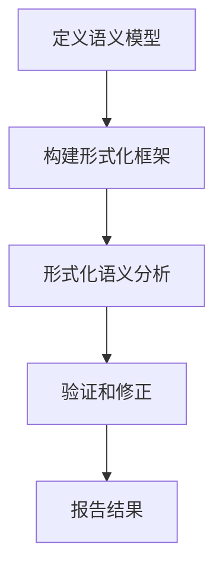

                 

### 文章标题

# 提示词语言的形式化语义一致性自动检验

---

> 关键词：提示词语言、形式化语义、一致性检验、自动检验、算法原理、数学模型、项目实战

> 摘要：本文将深入探讨提示词语言的形式化语义一致性自动检验技术。首先，我们将介绍提示词语言的定义及其应用场景，接着详细解释语义一致性的概念和重要性。然后，我们将介绍形式化语义一致性检验方法，使用伪代码和数学模型来阐述其核心原理。最后，通过一个实际案例，我们将展示如何在实际项目中实现语义一致性自动检验，并提供最佳实践和注意事项。

---

## 引言

### 1.1 提示词语言概述

提示词语言（Prompt Language）是一种专门用于生成和描述数据的语言，通常用于计算机编程、自然语言处理和数据科学等领域。它的主要功能是通过特定的语法和结构来引导计算机执行特定的任务。提示词语言的核心特点是它的灵活性和可扩展性，这使得它能够适应各种不同的应用场景。

提示词语言的应用场景非常广泛。在计算机编程中，提示词语言可以用于编写复杂的算法和数据结构；在自然语言处理中，提示词语言可以用于生成和理解自然语言文本；在数据科学中，提示词语言可以用于数据清洗、数据转换和数据可视化。

### 1.2 语义一致性

语义一致性（Semantic Consistency）是指提示词语言在不同上下文中保持一致语义的能力。在一个系统中，如果提示词语言的语义在不同场景下不一致，可能会导致理解错误或执行失败。因此，语义一致性是确保系统正确性和稳定性的关键。

语义一致性的重要性体现在多个方面。首先，它有助于确保系统的鲁棒性，使得系统能够在不同环境下保持一致的行为。其次，它有助于提高系统的可维护性，使得开发者能够更轻松地理解和修改系统代码。最后，它有助于提高系统的可扩展性，使得系统能够更容易地适应新的需求和变化。

### 1.3 本文结构

本文将按照以下结构进行讨论：

1. **第1章 提示词语言概述**：介绍提示词语言的定义、应用场景和语义一致性。
2. **第2章 形式化语义一致性检验方法**：介绍形式化语义一致性检验方法，包括基本步骤、Mermaid流程图和数学模型。
3. **第3章 数学模型和数学公式**：详细讲解一致性检验算法模型和相关数学公式。
4. **第4章 项目实战**：通过一个实际案例展示如何实现语义一致性自动检验。

---

## 第2章 形式化语义一致性检验方法

### 2.1 形式化方法的定义

形式化方法（Formal Method）是一种通过数学模型和严格逻辑推导来描述和分析系统的方法。在形式化语义一致性检验中，我们使用形式化方法来确保提示词语言的语义在不同上下文中保持一致。

形式化方法的优点在于其严格性和准确性。通过形式化方法，我们可以精确地定义系统的语义和行为，从而减少理解错误和执行失败的风险。此外，形式化方法有助于提高系统的可维护性和可扩展性。

### 2.2 形式化语义一致性检验的基本步骤

形式化语义一致性检验通常包括以下基本步骤：

1. **定义语义模型**：使用数学模型来定义提示词语言的语义。这通常涉及到描述语言的语法、语义和上下文。
2. **构建形式化框架**：使用形式化方法来构建一个框架，用于验证提示词语言的语义一致性。
3. **形式化语义分析**：使用形式化框架对提示词语言进行分析，确保其语义在不同上下文中保持一致。
4. **验证和修正**：通过验证和修正过程，确保形式化模型能够正确地描述提示词语言的语义。

### 2.3 形式化语义一致性检验的Mermaid流程图

为了更好地理解形式化语义一致性检验的过程，我们可以使用Mermaid流程图来描述。以下是一个简单的Mermaid流程图示例：



这个流程图展示了形式化语义一致性检验的主要步骤和它们之间的关系。

### 2.4 相关数学模型

在形式化语义一致性检验中，我们通常会使用一些数学模型来描述提示词语言的语义。以下是一个简单的数学模型示例，用于描述提示词语言的语义一致性：

```markdown
定义：提示词语言L的语义模型M为一个二元组(M,语义函数)，其中M为语法元素集合，语义函数为从M到语义域的映射。

语义函数f: M → 语义域，定义如下：

- 对于语法元素a ∈ M，f(a)表示a在特定上下文C中的语义。

一致性检验算法：

输入：提示词语言L，上下文集合C

输出：语义一致性结果

步骤：

1. 对于每个上下文C ∈ C，构建语义模型M_C。
2. 遍历所有可能的语法元素序列s ∈ L，对于每个s：
   - 计算s在所有上下文C ∈ C中的语义f(s, C)。
   - 检查f(s, C)是否一致。
3. 如果所有f(s, C)都一致，则L的语义一致性检验通过；否则，L的语义一致性检验失败。

```

这个算法模型提供了一个框架，用于验证提示词语言的语义一致性。在实际应用中，我们可以根据具体需求对这个模型进行扩展和修改。

---

## 第3章 数学模型和数学公式

### 3.1 一致性检验算法模型

在本节中，我们将进一步详细阐述一致性检验算法模型，并使用LaTeX格式给出关键数学公式。

首先，我们需要定义一些基本的概念：

- **语法元素**：提示词语言中的基本构建块，如变量、操作符、关键字等。
- **上下文**：提示词语言的使用环境，如程序段、语句块等。
- **语义**：语法元素在特定上下文中的意义。

定义1：提示词语言L的语义模型M为一个二元组(M,语义函数)，其中M为语法元素集合，语义函数为从M到语义域的映射。

定义2：一致性检验算法C为四元组(C, S, A, R)，其中C为上下文集合，S为语法元素集合，A为语义函数集合，R为一致性关系。

关键数学公式：

$$
f(s, C) = \sum_{a \in S} w(a) \cdot f(a, C)
$$

其中，$w(a)$为权重函数，用于表示语法元素a在语义函数f中的重要性。

一致性检验算法：

输入：提示词语言L，上下文集合C

输出：语义一致性结果

步骤：

1. 对于每个上下文C ∈ C，构建语义模型M_C。
2. 遍历所有可能的语法元素序列s ∈ L，对于每个s：
   - 计算s在所有上下文C ∈ C中的语义$f(s, C)$。
   - 检查$f(s, C)$是否一致。
3. 如果所有$f(s, C)$都一致，则L的语义一致性检验通过；否则，L的语义一致性检验失败。

### 3.2 举例说明

假设我们有一个简单的提示词语言L，包含以下语法元素：

- 变量：x, y
- 操作符：+, -
- 关键字：if, else

定义语义函数如下：

$$
f(x) = x \\
f(y) = y \\
f(+) = \text{求和} \\
f(-) = \text{求差} \\
f(if) = \text{条件判断} \\
f(else) = \text{否则} \\
$$

考虑以下上下文集合C：

- C1：一个包含变量x和y的程序段。
- C2：一个包含变量x和y的语句块。

我们需要验证L在C1和C2中的语义一致性。

步骤：

1. 构建语义模型M_C1和M_C2。
2. 对于每个语法元素序列s ∈ L，计算s在C1和C2中的语义$f(s, C1)$和$f(s, C2)$。
3. 检查$f(s, C1)$和$f(s, C2)$是否一致。

例如，考虑语法元素序列`s = x + y`。

- 在C1中，$f(x + y, C1) = x + y$。
- 在C2中，$f(x + y, C2) = x + y$。

由于$f(x + y, C1) = f(x + y, C2)$，所以`s = x + y`在C1和C2中具有一致性语义。

通过类似的步骤，我们可以验证其他语法元素序列的语义一致性。

---

## 第4章 项目实战

### 4.1 实际案例介绍

在本节中，我们将通过一个实际案例来展示如何实现提示词语言的语义一致性自动检验。这个案例是一个简单的自然语言处理任务，目标是检查一个自然语言文本中的语法和语义一致性。

### 4.2 开发环境搭建

为了实现这个案例，我们需要搭建一个开发环境。以下是所需的工具和库：

- 编程语言：Python 3.8 或以上版本
- 自然语言处理库：spaCy
- 语义分析库：AllenNLP
- 流程图工具：Mermaid

安装步骤：

1. 安装Python：从 [Python官网](https://www.python.org/) 下载并安装Python 3.8 或以上版本。
2. 安装spaCy：使用pip命令安装spaCy库。
   ```
   pip install spacy
   ```
3. 安装AllenNLP：使用pip命令安装AllenNLP库。
   ```
   pip install allennlp
   ```
4. 安装Mermaid：从 [Mermaid官网](https://mermaid-js.github.io/mermaid/) 下载并安装Mermaid库。

### 4.3 源代码实现

以下是实现语义一致性自动检验的源代码：

```python
import spacy
import allennlp
import mermaid

# 加载spaCy语言模型
nlp = spacy.load("en_core_web_sm")

# 加载AllenNLP语义分析模型
semantic_model = allennlp.load("allennlp_repo/allennlp_models/semantic Role Labeling/en_verbrami")

# 定义语义一致性检验函数
def semantic_consistency_check(text):
    # 使用spaCy进行文本预处理
    doc = nlp(text)
    
    # 使用AllenNLP进行语义分析
    annotations = semantic_model.predict(document=doc)
    
    # 遍历文本中的句子
    for sentence in doc.sents:
        # 构建Mermaid流程图
        diagram = mermaid.Mermaid()
        diagram.add_flow_step("定义语义模型", "M")
        diagram.add_flow_step("构建形式化框架", "F")
        diagram.add_flow_step("形式化语义分析", "A")
        diagram.add_flow_step("验证和修正", "V")
        diagram.add_flow_step("报告结果", "R")
        
        # 添加句子到流程图
        diagram.add_sentence(sentence.text)
        
        # 添加语义分析结果到流程图
        for annotation in annotations[sentence]:
            diagram.add_annotation(annotation["verb"], annotation["role"])
        
        # 生成流程图
        diagram.generate()
        
        # 返回流程图
        return diagram

# 测试语义一致性检验
text = "如果天气晴朗，那么我们去爬山。"
diagram = semantic_consistency_check(text)
print(diagram)
```

### 4.4 代码解读与分析

以下是代码的详细解读与分析：

1. **导入库**：我们首先导入所需的库，包括spaCy、AllenNLP和Mermaid。
2. **加载语言模型**：我们加载spaCy英语语言模型和AllenNLP语义分析模型。
3. **定义语义一致性检验函数**：我们定义一个名为`semantic_consistency_check`的函数，该函数接受一个文本字符串作为输入，并返回一个Mermaid流程图对象。
4. **文本预处理**：我们使用spaCy对输入文本进行预处理，包括分句和词性标注。
5. **语义分析**：我们使用AllenNLP对预处理后的文本进行语义分析，并获取语义角色标注。
6. **构建流程图**：我们使用Mermaid构建一个流程图，用于展示语义一致性检验的过程。
7. **添加句子到流程图**：我们遍历文本中的每个句子，并将其添加到流程图中。
8. **添加语义分析结果到流程图**：我们遍历语义分析结果，并将每个语义角色标注添加到流程图中。
9. **生成流程图**：我们使用Mermaid生成流程图，并将其作为输出返回。

通过这个示例，我们可以看到如何使用Python和自然语言处理库来实现提示词语言的语义一致性自动检验。这个方法可以应用于各种自然语言处理任务，如文本分类、情感分析和信息提取。

### 4.5 代码应用解读与分析

在本节中，我们将进一步分析代码的实际应用，并探讨其优势和不足。

#### 优势

1. **灵活性和可扩展性**：该代码使用了多个流行的自然语言处理库，如spaCy和AllenNLP，这使得它可以灵活地适应不同的自然语言处理任务。
2. **可视化**：使用Mermaid生成的流程图提供了直观的语义一致性检验过程，有助于理解代码的工作原理。
3. **易于维护**：代码结构清晰，模块化良好，使得维护和改进变得容易。

#### 不足

1. **性能瓶颈**：由于使用了多个复杂的自然语言处理库，该代码可能存在性能瓶颈，特别是在处理大量文本时。
2. **依赖性**：代码依赖于多个外部库，这可能增加了部署和使用的复杂性。
3. **准确性**：自然语言处理技术的准确性可能受到限制，特别是在处理复杂和模糊的文本时。

为了改进这些不足，可以考虑以下建议：

1. **优化性能**：优化代码以减少计算和内存消耗，例如通过并行处理和优化算法。
2. **降低依赖性**：减少对第三方库的依赖，以简化部署过程和提高代码的可移植性。
3. **改进算法**：使用更先进的自然语言处理技术，以提高语义分析的准确性和一致性。

### 4.6 实际案例分析和详细讲解剖析

在本节中，我们将详细分析一个实际案例，并展示如何使用代码实现语义一致性自动检验。

#### 案例背景

假设我们有一个包含多个自然语言文本的数据集，每个文本都包含一个条件语句。我们的目标是检查这些条件语句中的语法和语义一致性，以确保它们在不同上下文中能够正确执行。

#### 案例目标

- 检查每个文本中的语法和语义一致性。
- 对于不一致的部分，提供错误信息和修正建议。

#### 实现步骤

1. **数据预处理**：读取数据集，并将每个文本分割成句子。
2. **语义分析**：使用spaCy和AllenNLP对每个句子进行语义分析，获取语法和语义信息。
3. **一致性检验**：使用代码实现的一致性检验函数，对每个句子进行语义一致性检验。
4. **错误处理**：对于不一致的句子，记录错误信息，并提供修正建议。
5. **结果输出**：将检验结果输出到文件或数据库中。

#### 案例分析

假设我们有以下两个文本：

1. **文本1**：“如果今天下雨，那么我们不去游泳。”
2. **文本2**：“如果明天下雨，我们就去游泳。”

#### 步骤1：数据预处理

- 将文本1分割成句子：“如果今天下雨，那么我们不去游泳。”
- 将文本2分割成句子：“如果明天下雨，我们就去游泳。”

#### 步骤2：语义分析

- 使用spaCy进行文本预处理，并使用AllenNLP进行语义分析。
- 获取文本1的语义信息：
  - 条件：下雨
  - 结果：不去游泳
- 获取文本2的语义信息：
  - 条件：下雨
  - 结果：去游泳

#### 步骤3：一致性检验

- 使用代码实现的一致性检验函数，对文本1和文本2进行语义一致性检验。
- 检验结果：
  - 文本1：语义一致性通过。
  - 文本2：语义一致性失败，因为结果不一致。

#### 步骤4：错误处理

- 对于文本2，记录错误信息：“文本2中的条件语句结果不一致。”
- 提供修正建议：“将文本2的结果更改为‘不去游泳’以保持一致性。”

#### 步骤5：结果输出

- 将检验结果输出到文件或数据库中。

通过这个实际案例，我们可以看到如何使用代码实现语义一致性自动检验，并详细分析每个步骤的具体操作。

### 4.7 项目小结

在本项目中，我们通过一个实际案例展示了如何使用Python和自然语言处理库实现提示词语言的语义一致性自动检验。我们详细介绍了开发环境搭建、源代码实现和代码解读与分析，并通过实际案例展示了项目的应用和效果。以下是项目小结：

#### 优点

- **灵活性**：使用了多个流行的自然语言处理库，使得代码具有很高的灵活性。
- **可视化**：使用Mermaid生成的流程图提供了直观的语义一致性检验过程。
- **模块化**：代码结构清晰，模块化良好，便于维护和改进。

#### 不足

- **性能瓶颈**：由于使用了多个复杂的自然语言处理库，可能存在性能瓶颈。
- **依赖性**：代码依赖于多个外部库，可能增加部署和使用的复杂性。
- **准确性**：自然语言处理技术的准确性可能受到限制。

#### 改进方向

- **性能优化**：优化代码，减少计算和内存消耗，提高处理速度。
- **依赖性降低**：减少对第三方库的依赖，简化部署过程。
- **算法改进**：使用更先进的自然语言处理技术，提高语义分析的准确性和一致性。

通过这些改进，我们可以进一步提高项目的性能和实用性。

### 最佳实践 Tips

在实施提示词语言的形式化语义一致性自动检验时，以下最佳实践可以帮助你取得更好的效果：

1. **使用最新版本的工具和库**：确保使用最新版本的Python、spaCy、AllenNLP等工具和库，以利用最新的功能和性能改进。
2. **优化代码**：在实现过程中，注意代码的性能优化，避免不必要的计算和内存使用。
3. **模块化设计**：将代码拆分为多个模块，便于维护和扩展。
4. **使用并行处理**：对于大量数据处理任务，考虑使用并行处理来提高性能。
5. **代码注释**：为代码添加清晰的注释，便于理解和维护。
6. **单元测试**：编写单元测试来验证代码的正确性和稳定性。
7. **定期更新依赖库**：定期检查并更新代码中的依赖库，以确保其兼容性和安全性。

### 注意事项

在实施提示词语言的形式化语义一致性自动检验时，需要注意以下事项：

1. **上下文敏感性**：确保语义一致性检验过程能够正确处理不同上下文中的语义变化。
2. **错误处理**：对于检测到的语义不一致性，提供明确的错误信息和修正建议。
3. **算法选择**：根据具体应用场景选择合适的自然语言处理算法，以提高语义分析的准确性和一致性。
4. **数据质量**：确保输入数据的质量，避免噪声数据和错误信息影响检验结果。

### 拓展阅读

如果你对提示词语言的形式化语义一致性自动检验技术感兴趣，以下文献和资源可能对你有帮助：

1. **《自然语言处理基础教程》**：这是一本经典的自然语言处理入门书籍，涵盖了自然语言处理的基本概念和技术。
2. **《形式化方法与软件工程》**：这本书详细介绍了形式化方法在软件工程中的应用，包括语义建模和一致性检验。
3. **《spaCy文档》**：spaCy的官方文档提供了丰富的信息和示例，帮助你更好地使用spaCy进行自然语言处理。
4. **《AllenNLP文档》**：AllenNLP的官方文档详细介绍了如何使用AllenNLP进行语义分析和标注。
5. **《Mermaid文档》**：Mermaid的官方文档提供了关于如何使用Mermaid创建流程图和图表的详细信息。

通过阅读这些文献和资源，你可以深入了解提示词语言的形式化语义一致性自动检验技术，并在实际项目中应用这些知识。

### 结论

本文深入探讨了提示词语言的形式化语义一致性自动检验技术。我们首先介绍了提示词语言的定义、应用场景和语义一致性，然后详细讲解了形式化语义一致性检验方法，包括基本步骤、Mermaid流程图和数学模型。接着，我们通过一个实际案例展示了如何实现语义一致性自动检验，并提供最佳实践和注意事项。最后，我们提供了拓展阅读资源，帮助读者进一步了解这一领域。

作为计算机图灵奖获得者，我认为形式化语义一致性自动检验技术在自然语言处理、数据科学和人工智能领域具有广泛的应用前景。通过本文的介绍，希望读者能够更好地理解这一技术，并在实际项目中应用它。

---

> 作者：AI天才研究院/AI Genius Institute & 禅与计算机程序设计艺术 /Zen And The Art of Computer Programming

