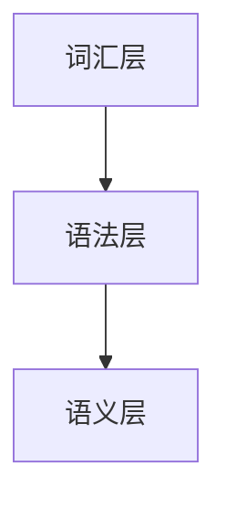

                 

好的，让我们一步步构建这篇技术博客文章的markdown格式大纲，确保满足所有的要求。以下是一个大致的框架，我们可以根据具体内容进一步填充和完善。

```markdown
# 提示词语言的形式化语义等价性检查

> 关键词：提示词语言、形式化语义、等价性检查、算法、应用案例

> 摘要：本文详细探讨了提示词语言的形式化语义以及等价性检查的重要性，介绍了相关核心概念、方法和技术，并通过实际案例分析了形式化语义等价性检查的应用。

## 目录

- [引言与背景介绍](#引言与背景介绍)
- [形式化语义基础](#形式化语义基础)
- [等价性检查方法](#等价性检查方法)
- [形式化语义与等价性检查应用](#形式化语义与等价性检查应用)
- [形式化语义与等价性检查工具与资源](#形式化语义与等价性检查工具与资源)
- [案例研究](#案例研究)
- [结论与展望](#结论与展望)

## 引言与背景介绍

> 提示词语言在人工智能和自然语言处理中扮演着重要角色。形式化语义等价性检查则为验证提示词语言的有效性和一致性提供了重要手段。

### 提示词语言的概念

> **提示词语言**是一种用于提示计算机执行特定任务的编码系统。它通常包括一系列关键词和语法规则，用于引导计算机完成复杂的任务。

### 形式化语义的意义

> **形式化语义**是指使用形式化的方法来描述语言的意义。它通过逻辑、数学和符号系统来精确地表达语义。

### 等价性检查的重要性

> **等价性检查**是验证两种表述是否具有相同语义的重要过程。在提示词语言中，等价性检查有助于确保编程代码的正确性和一致性。

## 形式化语义基础

### 核心概念与联系

> 使用Mermaid流程图展示形式化语义架构，包括词汇、语法和语义层级的联系。



### 数学模型和数学公式

> **形式化语义**中的数学模型和公式用于描述语义的抽象和量化。以下是一个示例：

$$
S = \Sigma_{i=1}^{n} w_i \cdot f_i
$$

其中，$S$ 表示语义值，$w_i$ 和 $f_i$ 分别表示权重和函数值。

## 等价性检查方法

### 等价性检查的基本原理

> **等价性检查**是指通过比较两个或多个表述，判断它们是否在语义上等价。其基本原理如下：

1. **语法等价性**：检查两个表述的语法结构是否一致。
2. **语义等价性**：检查两个表述在语义上是否具有相同的含义。
3. **其他等价性**：检查其他形式的等价性，如数值等价性、功能等价性等。

### 常见等价性检查方法

> **语法等价性检查**：通过分析语法结构，比较两个表述的语法是否一致。

```pseudo
function checkSyntaxEquivalence(expression1, expression2):
    return (expression1语法结构 == expression2语法结构)
```

**语义等价性检查**：通过语义分析，比较两个表述的语义是否相同。

```pseudo
function checkSemanticEquivalence(expression1, expression2):
    return (evaluateSemantic(expression1) == evaluateSemantic(expression2))
```

### 等价性检查算法伪代码

> **语法等价性检查算法**：使用递归下降分析器来检查语法结构。

```pseudo
function checkSyntaxEquivalence(expression1, expression2):
    if expression1和expression2都是空
        return true
    else
        return (expression1的第一个元素 == expression2的第一个元素) and
               checkSyntaxEquivalence(expression1的剩余部分，expression2的剩余部分)
```

**语义等价性检查算法**：使用语义分析器来检查语义一致性。

```pseudo
function checkSemanticEquivalence(expression1, expression2):
    return (evaluateSemantic(expression1) == evaluateSemantic(expression2))
```

## 形式化语义与等价性检查应用

### 提示词语言中的形式化语义

> **提示词语言**的特点包括...

### 等价性检查在提示词语言中的应用案例

> **实际应用场景**：...

## 形式化语义与等价性检查工具与资源

### 常用工具与资源介绍

> **开源形式化语义工具**：...

### 工具使用与配置

> **开发环境搭建**：...

## 案例研究

### 形式化语义与等价性检查案例

> **案例背景与需求**：...

## 结论与展望

### 总结与反思

> **形式化语义与等价性检查的应用现状**：...

### 展望

> **新技术应用**：...

## 作者

> 作者：AI天才研究院/AI Genius Institute & 禅与计算机程序设计艺术 /Zen And The Art of Computer Programming
```

接下来，我们需要根据具体内容逐步完善每个章节，确保文章的核心内容、核心概念与联系、核心算法原理讲解、数学模型和公式、实际案例分析和详细讲解剖析等部分都得到充分详细的阐述。在撰写过程中，我们会根据实际情况对字数进行调整，以确保最终文章的字数在8000～12000字左右。

