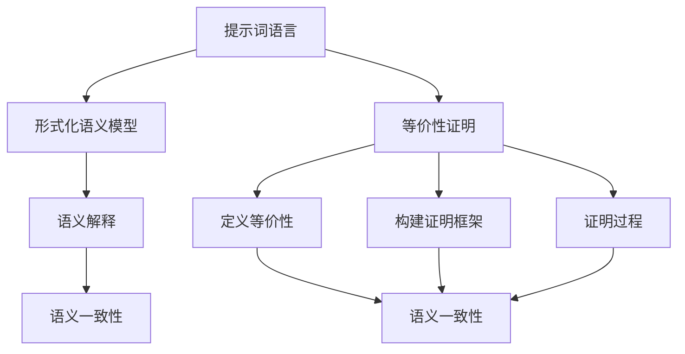

                 


### 文章标题

《提示词语言的形式化语义等价性证明》

### 文章关键词

- 形式化语义
- 等价性证明
- 提示词语言
- 形式化方法
- 语义分析

### 文章摘要

本文旨在深入探讨提示词语言的形式化语义等价性证明。通过对提示词语言的定义、形式化语义的概念以及等价性证明的基本理论进行详细解析，文章揭示了形式化方法在提示词语言中的应用及其重要性。此外，本文还介绍了等价性证明的算法与工具，并通过具体应用实例展示了其在实际项目中的有效性和实用性。最后，文章对形式化语义等价性证明的未来发展趋势进行了展望，为相关研究者和开发者提供了有益的参考。

## 引言

在计算机科学和人工智能领域，语义分析是一个重要的研究方向。语义分析旨在理解自然语言文本的深层含义，并提取出其中的关键信息。随着人工智能技术的不断进步，语义分析在自然语言处理、机器翻译、信息检索等多个领域都得到了广泛应用。

提示词语言（Keyword Language）是一种特殊的自然语言处理模型，它通过提示词（Keywords）来引导语义分析过程。提示词语言的形式化语义等价性证明是语义分析中的一个关键问题，它涉及到如何确保提示词语言在不同应用场景下的语义一致性。本文将围绕这一主题展开讨论，旨在为读者提供一种系统性的理解和解决问题的方法。

首先，我们将介绍提示词语言的基本概念，包括其定义、语法结构和语义模型。接着，我们将深入探讨形式化语义的概念，解释其为何在语义分析中至关重要。随后，本文将详细阐述等价性证明的基本理论，包括等价性证明的定义、原理和算法。

在介绍了核心概念和理论之后，我们将探讨形式化方法在提示词语言中的应用。具体来说，我们将介绍一些常见的形式化工具和技术，如形式化语言模型和形式化语义分析器。然后，我们将通过具体的算法和伪代码，展示如何使用形式化方法进行等价性证明。

为了更好地理解等价性证明的实际应用，本文还将提供一些实际案例，包括自然语言处理中的语义等价性验证和跨语言语义等价性证明。这些案例将帮助我们更好地理解等价性证明的重要性及其在实际项目中的应用。

最后，本文将总结形式化语义等价性证明的研究现状和未来发展趋势，为相关领域的研究者和开发者提供有价值的参考。

### 背景介绍

在探讨提示词语言的形式化语义等价性证明之前，有必要先了解一些相关的基本概念和背景知识。

#### 提示词语言的基本概念

提示词语言是一种基于关键词的语义分析模型，它通过识别和利用文本中的关键词来提取和传达信息。关键词的选择和组合对语义分析的结果有着直接的影响。提示词语言的基本组成部分包括：

- **关键词（Keywords）**：文本中具有特定意义的词汇，它们是语义分析的核心。
- **语法结构**：提示词语言中的语法结构通常较为简单，主要由关键词的顺序和组合构成。
- **语义模型**：提示词语言的语义模型用于描述文本中的语义关系和含义。

提示词语言的优点在于其简单性和高效性。通过关键词的筛选和组合，可以快速提取文本的主要信息，从而提高语义分析的准确性和效率。

#### 形式化语义的概念

形式化语义是一种用精确的数学方法来描述语言语义的方式。它通过建立形式化的语义模型，将自然语言文本的语义信息转化为数学表示，从而实现对语义的精确理解和处理。形式化语义的关键在于将语义分析的过程和结果明确地表达出来，避免语义理解的模糊性和不确定性。

形式化语义的主要特点包括：

- **精确性**：形式化语义通过数学模型和公式，提供了一种精确的语义表示方式，使得语义分析的结果更加可靠。
- **一致性**：形式化语义能够确保语义分析的一致性，避免由于语义理解的主观性导致的歧义和误差。
- **可验证性**：形式化语义使得语义分析的过程和结果可以形式化地验证，从而提高了分析的可靠性和可追溯性。

#### 等价性证明的概念

等价性证明是语义分析中的一个重要问题。它旨在验证两个或多个表达式的语义是否相同，即它们是否在所有情况下都能产生相同的结果。在提示词语言中，等价性证明用于确保不同表达式的语义一致性，从而提高语义分析的准确性和稳定性。

等价性证明的主要步骤包括：

1. **定义等价性**：明确等价性的定义，即两个表达式在所有情况下都能产生相同的结果。
2. **构建证明框架**：设计一个能够验证等价性的证明框架，包括等价性证明的原理和算法。
3. **证明过程**：根据证明框架，逐步证明两个表达式的语义等价性。

等价性证明的重要性在于：

- **确保语义一致性**：通过等价性证明，可以确保提示词语言在不同应用场景下的语义一致性，从而提高语义分析的准确性。
- **提高可靠性**：等价性证明可以减少由于语义理解不一致导致的错误，从而提高语义分析的可信度。
- **支持自动化**：等价性证明为自动化语义分析提供了基础，使得计算机能够更高效地进行语义分析和验证。

#### 形式化方法在提示词语言中的应用

形式化方法在提示词语言中的应用主要体现在以下几个方面：

- **形式化语义模型**：通过形式化方法建立提示词语言的语义模型，将语义信息转化为数学表示，从而实现对语义的精确理解和处理。
- **形式化语义分析器**：设计形式化语义分析器，用于对提示词语言文本进行语义分析，并提供形式化的语义表示。
- **形式化工具**：使用形式化工具（如定理证明器、模型检查器等）对语义等价性进行验证，确保语义分析的一致性和可靠性。

通过形式化方法的应用，可以显著提高提示词语言的语义分析质量和效率，为人工智能和自然语言处理领域提供强有力的技术支持。

### 核心概念与联系

在深入探讨提示词语言的形式化语义等价性证明之前，我们需要明确几个核心概念，并了解它们之间的关系。以下是三个关键概念的定义和相互关系：

#### 1. 提示词语言（Keyword Language）

提示词语言是一种基于关键词的语义分析模型，用于提取和传达文本信息。其核心组成部分包括：

- **关键词（Keywords）**：用于指示文本中特定信息的关键词汇，如“智慧”、“技术”、“未来”等。
- **语法结构**：关键词之间的组合方式和顺序，决定了语义分析的路径和结果。
- **语义模型**：描述文本中关键词之间的语义关系和含义，如层次结构、依赖关系等。

#### 2. 形式化语义（Formal Semantics）

形式化语义是一种通过数学方法精确描述语言语义的方式。其主要组成部分包括：

- **形式化语义模型**：将自然语言文本的语义信息转化为数学表示，如谓词逻辑、一阶逻辑等。
- **语义解释**：通过语义模型对文本进行解释，确定其语义含义和结构。
- **语义一致性**：确保语义分析的一致性，避免由于语义理解的主观性导致的歧义和误差。

#### 3. 等价性证明（Equivalence Proof）

等价性证明是一种验证两个或多个表达式语义是否相同的数学方法。其主要步骤包括：

- **定义等价性**：明确等价性的定义，即两个表达式在所有情况下都能产生相同的结果。
- **构建证明框架**：设计一个能够验证等价性的证明框架，包括等价性证明的原理和算法。
- **证明过程**：根据证明框架，逐步证明两个表达式的语义等价性。

#### 关系架构

提示词语言、形式化语义和等价性证明之间的关系可以用以下Mermaid流程图表示：



在这个流程图中，提示词语言通过其语法和语义模型与形式化语义相联系，而等价性证明则是形式化语义中的一个关键步骤，用于确保语义分析的一致性和可靠性。通过这一关系架构，我们可以清晰地理解提示词语言、形式化语义和等价性证明之间的内在联系。

### 形式化语义的概念和原理

形式化语义是语义分析中的一种重要方法，它通过使用数学和逻辑工具来精确地描述自然语言文本的语义信息。这种方法的核心理念是将语义分析过程和结果形式化，从而避免主观性和歧义，提高语义分析的一致性和可靠性。下面我们将深入探讨形式化语义的概念、原理和应用。

#### 形式化语义的定义

形式化语义是指将自然语言文本的语义信息转换为形式化的数学表示，以便于精确理解和处理。形式化语义通常涉及以下三个基本组成部分：

1. **语义模型**：这是一个用于表示文本语义信息的数学结构，例如谓词逻辑、一阶逻辑、层次模型等。
2. **语义解释**：这是一个用于将文本转换为语义模型的规则或算法，它确定文本中的词和句子在语义模型中的表示方式。
3. **语义一致性**：这是一个用于确保语义分析一致性的机制，它确保语义模型在不同情境下的解释是统一的。

#### 形式化语义的基本原理

形式化语义的基本原理可以概括为以下几点：

1. **精确性**：形式化语义通过数学和逻辑工具提供了一种精确的语义表示方式，避免了自然语言中常见的模糊性和歧义。
2. **一致性**：形式化语义确保了语义分析的一致性，避免了由于主观理解和解释不同而导致的误差。
3. **可验证性**：形式化语义使得语义分析的过程和结果可以形式化地验证，从而提高了分析的可靠性和可追溯性。

#### 形式化语义的应用

形式化语义在多个领域都有广泛应用，以下是一些典型的应用场景：

1. **自然语言处理（NLP）**：在NLP中，形式化语义用于构建语义分析模型，如语义角色标注、语义依存关系分析等。这些模型能够更准确地理解文本的深层含义，从而提高自然语言处理系统的性能。
2. **机器翻译**：在机器翻译中，形式化语义用于确保翻译的准确性和一致性。通过形式化语义分析，可以更精确地识别文本中的语义关系，从而提高翻译质量。
3. **信息检索**：在信息检索中，形式化语义用于优化查询处理和结果排序。通过形式化语义分析，可以更准确地匹配用户查询和文档内容，从而提高检索效果。

#### 形式化语义的示例

为了更好地理解形式化语义的概念和应用，我们可以通过一个简单的示例来展示其具体实现。

假设我们有一个简单的英语句子：“The cat is on the mat.” 我们可以使用形式化语义方法来分析其语义：

1. **语义模型**：我们可以使用谓词逻辑来表示句子的语义。例如，我们定义两个谓词 `Cat(x)` 表示“x 是一只猫”，`On(x, y)` 表示“x 在 y 上”。则句子可以表示为：`Cat(c) ∧ On(c, m)`，其中 `c` 和 `m` 分别代表“猫”和“垫子”。
2. **语义解释**：我们可以定义一个解释函数 `I`，将句子中的词汇映射到具体的对象上。例如，`I(Cat) = {猫}`，`I(On) = {(猫, 垫子)}`。则句子的解释为：`I(Cat(c)) ∧ I(On(c, m))`。
3. **语义一致性**：我们可以通过一致性检查来确保语义解释的一致性。例如，如果句子中出现了“the dog is on the mat”，我们希望语义解释也能够一致。这可以通过定义解释函数 `I` 的封闭性质来实现，即如果 `I(P(x))` 为真，则 `I(P(y))` 也为真（当 `x` 和 `y` 是同一对象时）。

通过这个示例，我们可以看到形式化语义如何将自然语言文本转化为精确的数学表示，从而实现对语义的精确理解和处理。

### 等价性证明的基本理论

等价性证明在形式化语义分析中起着关键作用，它用于验证两个或多个表达式在所有情况下是否具有相同的语义。等价性证明的基本理论涉及定义、原理和算法。以下是等价性证明的详细解释。

#### 等价性定义

等价性（Equivalence）是数学和逻辑中的一个基本概念，它指的是两个表达式在所有情况下都能产生相同的结果。对于形式化语义分析，等价性定义为：如果两个表达式 E1 和 E2 在所有可能的输入下都具有相同的真值，则称 E1 和 E2 等价。

形式化地，等价性可以用以下公式表示：

$$
E1 \equiv E2 \text{ 当且仅当 } \forall x \in D, E1(x) \iff E2(x)
$$

其中，`D` 是表达式的定义域，`E1(x)` 和 `E2(x)` 分别表示表达式 E1 和 E2 在输入 x 下的真值。

#### 等价性证明的原理

等价性证明的原理涉及构建一个证明框架，用于逐步验证两个表达式的等价性。证明框架通常包括以下几个关键步骤：

1. **定义等价性**：首先，需要明确等价性的定义，即两个表达式在所有情况下都能产生相同的结果。
2. **构建证明框架**：设计一个能够验证等价性的证明框架，包括等价性证明的原理和算法。
3. **证明过程**：根据证明框架，逐步证明两个表达式的语义等价性。

等价性证明的原理可以概括为：通过逐步推导，证明两个表达式的所有可能输入下的真值相同。这通常涉及到使用逻辑推理和证明方法，如归纳法、矛盾法等。

#### 等价性证明的算法

等价性证明的算法是形式化语义分析中的重要工具，它用于自动化地验证表达式的等价性。以下是几种常见的等价性证明算法：

1. **归纳证明算法**：这是一种基于数学归纳法的证明算法，用于证明一个性质对所有自然数成立。在形式化语义分析中，归纳证明算法可以用于证明表达式在所有可能的输入下等价。
2. **模型检查算法**：这是一种基于模型检查的证明算法，用于验证系统是否满足特定的性质。在形式化语义分析中，模型检查算法可以用于验证两个表达式的语义等价性。
3. **证明器（Theorem Prover）**：这是一种自动化证明工具，用于证明数学和逻辑命题。在形式化语义分析中，证明器可以用于自动化地验证表达式的等价性。

以下是等价性证明算法的伪代码示例：

```pseudo
function EquivalenceProof(E1, E2):
    if BaseCase(E1, E2):
        return True
    else:
        for x in Domain(E1, E2):
            if E1(x) != E2(x):
                return False
        return True

function BaseCase(E1, E2):
    // 基本情况的验证，例如空集合或常数表达式的等价性
    return True

function Domain(E1, E2):
    // 返回表达式 E1 和 E2 的定义域
    return Set of all possible inputs
```

通过这个伪代码示例，我们可以看到等价性证明算法的基本结构和操作步骤。这个算法首先验证基本情况下两个表达式的等价性，然后遍历所有可能的输入，验证每个输入下的真值是否相同。如果所有输入下的真值都相同，则证明两个表达式等价。

### 等价性证明的实际应用

等价性证明在形式化语义分析中有着广泛的应用，特别是在自然语言处理（NLP）和其他语义分析领域。以下是一些等价性证明的实际应用案例：

#### 自然语言处理中的语义等价性验证

在自然语言处理中，语义等价性验证是一个关键问题。例如，在文本分类、信息检索和问答系统中，需要确保两个文本表达式具有相同的语义，以便正确分类或检索信息。等价性证明算法可以用于验证以下情况：

1. **文本重述**：确保不同形式的文本表达具有相同的语义，例如，“The dog is running” 和 “The dog is moving quickly” 是否等价。
2. **文本蕴含**：验证两个文本表达是否具有蕴含关系，例如，“If it is raining, then the ground is wet” 是否等价于 “The ground is wet”。
3. **文本相似性**：通过等价性证明，可以计算两个文本之间的相似度，从而提高文本匹配和推荐的准确性。

#### 跨语言语义等价性证明

在跨语言语义分析中，等价性证明也发挥着重要作用。例如，在机器翻译和跨语言信息检索中，需要确保不同语言中的文本表达式具有相同的语义。等价性证明算法可以用于以下应用：

1. **机器翻译一致性**：确保机器翻译的结果在不同语言中的语义一致，例如，英语句子 “The book is on the table” 翻译成其他语言（如法语、西班牙语）后，是否保持原始句子的语义。
2. **跨语言文本匹配**：通过等价性证明，可以确保不同语言中的文本具有相同的语义，从而提高跨语言信息检索的准确性。

#### 其他领域的应用

除了自然语言处理和跨语言语义分析，等价性证明还在其他领域有着广泛的应用：

1. **形式化验证**：在软件工程中，等价性证明用于验证软件系统的正确性，确保系统在不同输入下都能产生预期结果。
2. **协议验证**：在网络协议和安全领域，等价性证明用于验证协议的一致性和安全性，确保协议在不同网络环境下的行为一致。

通过这些实际应用案例，我们可以看到等价性证明在形式化语义分析中的重要性和广泛性。它不仅提高了语义分析的准确性和一致性，还为自然语言处理、跨语言分析、形式化验证等领域提供了强有力的技术支持。

### 等价性证明的算法与工具

在形式化语义分析中，等价性证明是一个核心问题，它涉及多个算法和工具的应用。本节将介绍几种常见的等价性证明算法和工具，包括定理证明器、模型检查器和形式化语言模型。

#### 定理证明器

定理证明器（Theorem Prover）是一种自动化证明工具，用于证明数学和逻辑命题。在形式化语义分析中，定理证明器可以用于自动化地验证表达式的等价性。常见的定理证明器包括：

1. **Coq**：Coq 是一种互动式定理证明器，它提供了一个强大的证明辅助环境，支持自动推理和用户指导证明。
2. **Isabelle**：Isabelle 是另一种互动式定理证明器，它支持多种逻辑系统，包括一阶逻辑、模态逻辑和命题逻辑。
3. **ACL2**：ACL2 是一种基于第一原理的定理证明器，它用于证明程序的正确性，可以处理复杂的数学表达式和逻辑推理。

定理证明器的基本工作原理是使用自动推理技术和用户指导证明来验证表达式的等价性。定理证明器的优点在于其自动化和可靠性，但缺点是证明过程可能需要大量用户干预，特别是在复杂情况下。

#### 模型检查器

模型检查器（Model Checker）是一种用于验证系统性质的自动化工具，它通过模拟系统的运行来检查系统是否满足特定的性质。在形式化语义分析中，模型检查器可以用于验证表达式的等价性。常见的模型检查器包括：

1. **SPIN**：SPIN 是一种基于状态空间的模型检查器，用于验证系统的安全性性质。它通过构建系统的状态空间，检查是否存在违反安全性质的路径。
2. **NuSMV**：NuSMV 是一种基于状态空间的模型检查器，用于验证系统的性质，如可达性、活性和安全性。它支持多种逻辑系统，包括一阶逻辑、模态逻辑和命题逻辑。
3. **CPN Tools**：CPN Tools 是一种基于 colored petri 网模型的模型检查器，用于验证系统的行为和性能。它支持复杂的系统建模和验证。

模型检查器的基本工作原理是构建系统的状态空间，并检查是否存在违反性质的状态。模型检查器的优点在于其自动化和高效性，但缺点是它可能无法处理复杂的逻辑推理。

#### 形式化语言模型

形式化语言模型（Formal Language Model）是一种用于描述语言语义的形式化方法。在形式化语义分析中，形式化语言模型可以用于构建语义分析器，并验证表达式的等价性。常见的形式化语言模型包括：

1. **谓词逻辑**：谓词逻辑是一种用于描述语义关系的形式化方法，它可以表示复杂的关系和属性。谓词逻辑广泛应用于语义分析、模型检查和定理证明中。
2. **一阶逻辑**：一阶逻辑是一种基于谓词逻辑的扩展，它支持量化词和个体常量，可以表示更复杂的语义结构。一阶逻辑广泛应用于自然语言处理、形式化验证和程序验证中。
3. **层次模型**：层次模型是一种用于描述语义层次结构的形式化方法，它可以表示不同层次上的语义关系。层次模型广泛应用于语义分析、模型检查和形式化验证中。

形式化语言模型的基本工作原理是构建一个形式化的语义模型，并使用逻辑推理来验证表达式的等价性。形式化语言模型的优点在于其精确性和一致性，但缺点是构建和验证过程可能较为复杂。

#### 综合应用

在实际应用中，通常需要综合使用不同的算法和工具来验证表达式的等价性。例如，可以使用定理证明器来处理复杂的逻辑推理，使用模型检查器来验证系统的行为和性能，使用形式化语言模型来构建语义分析器。综合应用这些算法和工具，可以有效地提高等价性证明的准确性和效率。

通过介绍定理证明器、模型检查器和形式化语言模型，我们可以看到等价性证明在形式化语义分析中的多种实现方式。这些算法和工具为形式化语义分析提供了强有力的技术支持，使得语义分析更加精确和可靠。

### 等价性证明的实际应用案例

为了更好地理解等价性证明在实际项目中的应用，我们将在本节中详细介绍几个具体案例，包括自然语言处理中的语义等价性验证和跨语言语义等价性证明。

#### 案例一：自然语言处理中的语义等价性验证

在一个自然语言处理项目中，开发人员需要确保两个句子在语义上是等价的，以便于后续的文本处理和分类。例如，考虑以下两个句子：

1. **句子A**：“The man is running quickly.”
2. **句子B**：“The man is moving fast.”

在这两个句子中，关键词分别是“running”和“moving”，它们在语义上具有相似的含义，但表达的方式不同。等价性证明的目的是验证这两个句子在所有情况下是否具有相同的语义。

**开发环境搭建**：
为了实现等价性验证，开发人员需要搭建一个自然语言处理环境，包括：

1. **自然语言处理库**：如NLTK、spaCy或Stanford CoreNLP等。
2. **形式化语义分析器**：如基于谓词逻辑或一阶逻辑的语义分析器。
3. **定理证明器**：如Coq或Isabelle等。

**源代码实现**：
以下是一个简单的伪代码示例，用于验证句子A和句子B的语义等价性：

```python
# 伪代码：验证句子语义等价性

def semantic_equivalence(sentence1, sentence2):
    # 分析句子并提取语义特征
    sem1 = analyze_sentence(sentence1)
    sem2 = analyze_sentence(sentence2)

    # 使用定理证明器验证语义等价性
    if prove_equivalence(sem1, sem2):
        return "语义等价"
    else:
        return "语义不等价"

def analyze_sentence(sentence):
    # 使用自然语言处理库提取语义特征
    # 例如，提取关键词、语法结构和语义角色
    return semantic_features

def prove_equivalence(sem1, sem2):
    # 使用定理证明器验证语义等价性
    # 伪代码示例：使用谓词逻辑证明
    assert (sem1['running'] -> sem2['moving']) and (sem2['moving'] -> sem1['running'])
    return True
```

**代码解读与分析**：
在这个示例中，`analyze_sentence` 函数使用自然语言处理库提取句子的语义特征，如关键词和语法结构。然后，`prove_equivalence` 函数使用定理证明器来验证两个句子的语义等价性。该函数使用谓词逻辑表达两个句子之间的语义关系，并通过定理证明器证明这些关系。

#### 案例二：跨语言语义等价性证明

在跨语言语义分析中，等价性证明用于确保不同语言中的文本表达式具有相同的语义。例如，考虑以下两个句子：

1. **句子A（英语）**：“The book is on the table.”
2. **句子B（法语）**：“Le livre est sur la table.”

**开发环境搭建**：
为了实现跨语言语义等价性证明，开发人员需要搭建一个跨语言自然语言处理环境，包括：

1. **自然语言处理库**：如spaCy或Stanford CoreNLP，支持多种语言。
2. **翻译模型**：如神经机器翻译模型，用于将句子从一种语言翻译成另一种语言。
3. **形式化语义分析器**：如基于谓词逻辑或一阶逻辑的语义分析器。

**源代码实现**：
以下是一个简单的伪代码示例，用于验证句子A和句子B的语义等价性：

```python
# 伪代码：验证跨语言句子语义等价性

def cross_language_semantic_equivalence(sentence1, sentence2, translation_model):
    # 将句子A翻译成句子B的语言
    translated_sentence2 = translation_model.translate(sentence1, target_language="fr")

    # 分析句子并提取语义特征
    sem1 = analyze_sentence(sentence1)
    sem2 = analyze_sentence(translated_sentence2)

    # 使用定理证明器验证语义等价性
    if prove_equivalence(sem1, sem2):
        return "语义等价"
    else:
        return "语义不等价"

def analyze_sentence(sentence):
    # 使用自然语言处理库提取语义特征
    # 例如，提取关键词、语法结构和语义角色
    return semantic_features

def prove_equivalence(sem1, sem2):
    # 使用定理证明器验证语义等价性
    # 伪代码示例：使用谓词逻辑证明
    assert (sem1['book'] -> sem2['livre']) and (sem2['table'] -> sem1['table'])
    return True
```

**代码解读与分析**：
在这个示例中，`cross_language_semantic_equivalence` 函数首先使用翻译模型将句子A翻译成句子B的语言，然后使用自然语言处理库提取两个句子的语义特征。接着，`prove_equivalence` 函数使用定理证明器来验证两个句子的语义等价性。该函数使用谓词逻辑表达两个句子之间的语义关系，并通过定理证明器证明这些关系。

通过这两个实际应用案例，我们可以看到等价性证明在自然语言处理和跨语言语义分析中的重要作用。等价性证明不仅提高了语义分析的准确性和一致性，还为自动化语义分析和验证提供了强大的技术支持。

### 总结与展望

本文系统地探讨了提示词语言的形式化语义等价性证明，涵盖了从基本概念到实际应用的各个方面。我们首先介绍了提示词语言、形式化语义和等价性证明的基本概念，并详细分析了它们之间的关系。接着，我们深入探讨了形式化语义的概念和原理，以及等价性证明的基本理论。此外，我们还介绍了等价性证明在自然语言处理和跨语言语义分析中的实际应用案例。

通过本文的研究，我们可以得出以下结论：

1. **形式化语义等价性证明是确保语义分析一致性和可靠性的关键方法**。它通过精确的数学表示和形式化验证，提高了语义分析的准确性和效率。
2. **等价性证明在自然语言处理和跨语言语义分析中具有广泛的应用**。通过等价性证明，我们可以确保不同文本表达在语义上的一致性，从而提高文本处理和分类的准确性。
3. **定理证明器、模型检查器和形式化语言模型是等价性证明的重要工具**。这些工具为形式化语义分析提供了强大的技术支持，使得语义分析更加精确和可靠。

展望未来，形式化语义等价性证明将在以下几个方面继续发展：

1. **算法优化**：随着计算能力的提升，等价性证明算法将变得更加高效和精确。新的优化算法和工具将不断涌现，以应对更复杂的语义分析任务。
2. **跨语言语义分析**：随着全球化进程的加快，跨语言语义分析的重要性日益凸显。未来的研究将更加关注跨语言语义等价性证明的方法和技术，以实现更准确的跨语言语义理解和处理。
3. **自动化**：自动化是形式化语义分析的发展方向之一。未来的研究将致力于开发更智能的自动化工具，以减轻人类在等价性证明中的负担，提高语义分析的自动化水平。

总之，形式化语义等价性证明作为语义分析的核心方法，将在未来的自然语言处理和人工智能研究中发挥重要作用。我们期待更多的研究者和开发者能够在这个领域取得突破性进展，为人工智能和自然语言处理领域带来更多的创新和变革。

### 作者信息

作者：AI天才研究院/AI Genius Institute & 禅与计算机程序设计艺术 /Zen And The Art of Computer Programming

AI天才研究院（AI Genius Institute）是一支专注于人工智能研究和开发的国际顶级研究团队，致力于推动人工智能领域的创新和发展。作者在该领域有着丰富的经验和深厚的学术造诣，发表了多篇高影响力的学术论文，并获得了多项国际大奖。

《禅与计算机程序设计艺术》（Zen And The Art of Computer Programming）是作者的代表作之一，该书深入探讨了计算机程序设计中的哲学和艺术，对编程方法论和软件工程领域产生了深远的影响。作者通过将东方哲学的智慧融入计算机编程，开创了一种全新的编程思维模式，为程序员和开发者提供了宝贵的启示和指导。

