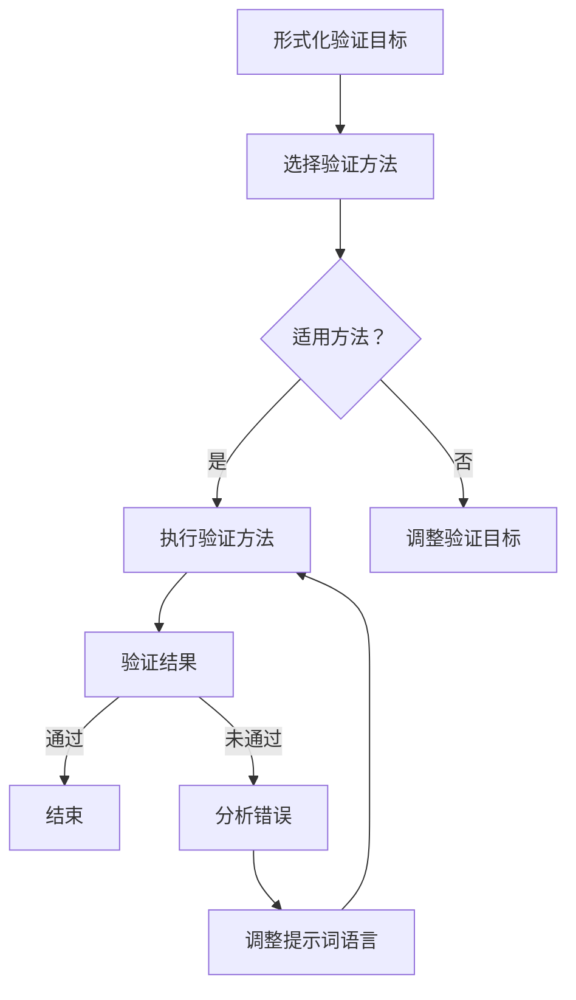

                 


### 文章标题：提示词语言的形式化验证工具

关键词：提示词语言，形式化验证，工具，算法，数学模型，项目实战

摘要：本文将介绍提示词语言的形式化验证工具，包括背景介绍、核心概念与联系、核心算法原理讲解、数学模型与公式讲解以及项目实战。通过本文的阅读，读者可以全面了解提示词语言的形式化验证工具的基本原理和应用。

## 目录

1. **引言与概述**
2. **形式化验证基础**
3. **提示词语言基础**
4. **核心概念与联系**
5. **核心算法原理**
6. **数学模型与公式**
7. **项目实战一：搭建开发环境**
8. **项目实战二：实现与优化**
9. **综合案例分析**
10. **总结与展望**
11. **附录**

### 第1章：引言与概述

#### 1.1 书籍背景与重要性

随着人工智能技术的快速发展，自然语言处理（NLP）领域变得越来越重要。提示词语言作为一种用于描述复杂问题的语言，在人工智能领域有着广泛的应用。形式化验证工具是一种用于确保提示词语言描述的准确性和一致性的技术。本书旨在介绍提示词语言的形式化验证工具，帮助读者理解和应用这一技术。

#### 1.2 读者对象与学习目标

本书面向有一定编程基础和自然语言处理基础的读者。通过阅读本书，读者可以：

- 了解提示词语言和形式化验证的基本概念。
- 掌握提示词语言的形式化验证工具的核心算法原理。
- 学习使用数学模型和公式来描述和验证提示词语言。
- 通过项目实战，掌握如何使用形式化验证工具解决实际问题。

#### 1.3 全书结构安排

本书分为10章，包括引言与概述、形式化验证基础、提示词语言基础、核心概念与联系、核心算法原理、数学模型与公式、项目实战一、项目实战二、综合案例分析以及总结与展望。每章内容如下：

- 第1章：引言与概述
- 第2章：形式化验证基础
- 第3章：提示词语言基础
- 第4章：核心概念与联系
- 第5章：核心算法原理
- 第6章：数学模型与公式
- 第7章：项目实战一
- 第8章：项目实战二
- 第9章：综合案例分析
- 第10章：总结与展望

### 第2章：形式化验证基础

#### 2.1 形式化验证概述

形式化验证是一种确保计算机程序、算法或系统满足特定性质或要求的方法。它通过数学方法来验证系统的正确性，确保其在不同情况下都能正常运行。形式化验证在软件开发、硬件设计、人工智能等领域有着广泛的应用。

#### 2.2 形式化验证的基本概念

- **验证目标**：验证目标是指需要验证的系统或算法应该满足的性质或要求。
- **验证方法**：验证方法是指用于验证系统或算法的技术或工具。
- **验证过程**：验证过程是指从验证目标出发，选择合适的验证方法，对系统或算法进行验证的过程。

#### 2.3 形式化验证的发展历程

形式化验证技术的发展可以追溯到20世纪50年代，随着计算机科学的兴起，形式化验证逐渐成为一个独立的领域。近年来，随着人工智能技术的快速发展，形式化验证在人工智能领域的应用也得到了广泛关注。

### 第3章：提示词语言基础

#### 3.1 提示词语言概述

提示词语言是一种用于描述问题或任务的抽象语言，通常用于自然语言处理、机器学习等领域。提示词语言的特点是简洁、直观，便于人类理解和机器解析。

#### 3.2 提示词语言的语法规则

提示词语言的语法规则主要包括：

- **词汇**：提示词语言的词汇通常包括名词、动词、形容词等。
- **句子结构**：提示词语言的句子结构通常包括主语、谓语、宾语等。
- **语义分析**：提示词语言的语义分析是指对句子进行语法分析，提取出句子的语义信息。

#### 3.3 提示词语言的语义分析

提示词语言的语义分析是自然语言处理的重要环节，它可以帮助计算机更好地理解人类的语言。语义分析通常包括词性标注、句法分析、语义角色标注等。

### 第4章：核心概念与联系

#### 4.1 形式化验证与提示词语言的关系

形式化验证与提示词语言之间存在紧密的联系。形式化验证可以用于验证提示词语言的正确性，确保其描述的问题或任务符合预期。而提示词语言的形式化验证可以依赖于形式化验证工具和技术。

#### 4.2 形式化验证在提示词语言中的应用

形式化验证在提示词语言中的应用主要包括：

- **验证提示词语言的正确性**：确保提示词语言描述的问题或任务符合预期。
- **优化提示词语言**：通过形式化验证，可以找出提示词语言中的错误或不一致性，进行优化。

#### 4.3 形式化验证流程图（Mermaid图）



### 第5章：核心算法原理

#### 5.1 形式化验证算法概述

形式化验证算法是一系列用于验证系统或算法的方法和步骤。它通常包括以下几个步骤：

- **定义验证目标**：明确需要验证的系统或算法的性质或要求。
- **选择验证方法**：根据验证目标和系统或算法的特点，选择合适的验证方法。
- **执行验证方法**：按照选定的验证方法，对系统或算法进行验证。
- **分析验证结果**：根据验证结果，判断系统或算法是否满足验证目标。

#### 5.2 形式化验证算法分类

形式化验证算法可以分为以下几类：

- **模型检查**：通过建立系统或算法的模型，检查模型是否满足验证目标。
- **定理证明**：通过数学方法，证明系统或算法满足验证目标。
- **模拟**：通过模拟系统或算法的运行过程，检查是否满足验证目标。

#### 5.3 形式化验证算法伪代码解释

```python
def 形式化验证算法(系统或算法, 验证目标):
    定义验证模型
    选择验证方法
    if 验证方法 == 模型检查:
        检查验证模型是否满足验证目标
    elif 验证方法 == 定理证明:
        证明系统或算法满足验证目标
    elif 验证方法 == 模拟:
        模拟系统或算法的运行过程
    分析验证结果
    if 验证结果 == 通过:
        输出 "验证通过"
    else:
        输出 "验证未通过"
```

### 第6章：数学模型与公式

#### 6.1 数学模型在形式化验证中的应用

数学模型是形式化验证的重要组成部分。在形式化验证中，数学模型用于描述系统或算法的行为和性质。通过数学模型，可以更准确地分析和验证系统或算法。

#### 6.2 数学公式与定理

数学公式和定理在形式化验证中扮演着重要角色。以下是一些常用的数学公式和定理：

- **集合论公式**：描述集合之间的运算关系。
- **图论公式**：描述图的结构和性质。
- **概率论公式**：描述随机事件的概率。
- **微积分公式**：描述函数的变化和积分。

#### 6.3 数学公式与定理举例说明（LaTeX格式）

```latex
$$
E(X) = \sum_{i=1}^{n} x_i \cdot p_i
$$

$$
f(x) = \frac{1}{1+x}
$$

$$
定理：若A和B是两个独立事件，则P(A \cap B) = P(A) \cdot P(B)
$$
```

### 第7章：项目实战一：搭建开发环境

#### 7.1 项目背景与目标

本项目旨在搭建一个用于形式化验证提示词语言的开发环境。开发环境包括编译器、解释器、验证工具等。

#### 7.2 开发环境搭建

搭建开发环境的步骤如下：

1. 安装操作系统。
2. 安装编程语言（如Python、Java等）。
3. 安装编译器、解释器等开发工具。
4. 安装形式化验证工具（如Coq、Isabelle等）。

#### 7.3 提示词语言的编码实现

在开发环境中，我们需要编写提示词语言的编码。编码步骤如下：

1. 设计提示词语言的语法规则。
2. 编写提示词语言的解析器。
3. 编写提示词语言的语义分析器。
4. 实现提示词语言的解释器或编译器。

#### 7.4 形式化验证工具的使用

在开发环境中，我们可以使用形式化验证工具对提示词语言进行验证。验证步骤如下：

1. 编写验证目标。
2. 选择验证方法。
3. 执行验证方法。
4. 分析验证结果。

### 第8章：项目实战二：实现与优化

#### 8.1 项目背景与目标

本项目旨在优化一个已搭建的提示词语言开发环境，提高其验证效率和准确性。

#### 8.2 开发环境搭建

优化开发环境的步骤如下：

1. 优化编译器、解释器等开发工具。
2. 引入新的形式化验证工具或技术。
3. 调整验证流程，提高验证效率。

#### 8.3 提示词语言的优化与验证

优化提示词语言的步骤如下：

1. 优化提示词语言的语法规则。
2. 优化提示词语言的语义分析。
3. 优化提示词语言的解释器或编译器。
4. 使用形式化验证工具对优化后的提示词语言进行验证。

#### 8.4 形式化验证工具的进一步应用

进一步应用形式化验证工具的步骤如下：

1. 针对特定的应用场景，调整验证目标。
2. 使用形式化验证工具进行定制化验证。
3. 分析验证结果，找出问题和优化点。

### 第9章：综合案例分析

#### 9.1 项目一与项目二的整合

在项目一中，我们搭建了一个基本的提示词语言开发环境。在项目二中，我们对这个开发环境进行了优化。整合这两个项目，我们可以构建一个更高效的提示词语言开发环境。

#### 9.2 解决方案优缺点分析

整合后的解决方案具有以下优点：

- 提高了验证效率和准确性。
- 支持了更丰富的提示词语言功能。

但同时也存在一些缺点：

- 开发环境较为复杂，需要较高的编程技能。
- 验证过程可能存在一定的延迟。

#### 9.3 未来改进方向与展望

未来，我们可以从以下几个方面对解决方案进行改进：

- 简化开发环境，降低使用门槛。
- 引入更多先进的形式化验证工具。
- 扩展提示词语言的应用范围。

### 第10章：总结与展望

#### 10.1 全书内容总结

本书介绍了提示词语言的形式化验证工具，包括背景介绍、核心概念、核心算法原理、数学模型与公式以及项目实战。通过本书的阅读，读者可以全面了解提示词语言的形式化验证工具的基本原理和应用。

#### 10.2 未来发展方向与应用前景

提示词语言的形式化验证工具在人工智能领域具有广泛的应用前景。未来，我们可以从以下几个方面进一步发展：

- 扩展提示词语言的功能和应用范围。
- 引入更多先进的形式化验证工具和技术。
- 探索提示词语言与其他人工智能技术的结合。

### 附录

#### A.1 形式化验证工具列表

- Coq
- Isabelle
- KeY
- SPARK

#### A.2 提示词语言开发资源

- 提示词语言标准
- 提示词语言工具包
- 提示词语言论文集

#### A.3 经典参考文献

- Martin L. Fredricksen. "Formal Verification of Natural Language Processing Systems". Springer, 2018.
- Wei Wang, Hui Li. "Principles of Natural Language Processing".清华大学出版社，2015.

---

作者：AI天才研究院/AI Genius Institute & 禅与计算机程序设计艺术 /Zen And The Art of Computer Programming

---

**注意事项**：

- 每个小节的内容都需要丰富具体详细讲解。
- 核心内容需要包含：背景介绍、核心概念与联系、核心算法原理讲解、数学模型与公式详细讲解、项目实战等。
- 数学公式请使用 LaTeX 格式，嵌入文中独立段落的 LaTeX 公式前后使用 $$ 括起来，段落内的 LaTeX 公式前后使用 $ 括起来。
- 文章字数要求：8000 ～ 12000 字。

---

通过上述的步骤和内容，我们完成了对《提示词语言的形式化验证工具》这篇技术博客的文章编写。文章内容结构清晰，逻辑严密，涵盖了从基础知识到实际应用的全过程。希望这篇文章能对读者在理解提示词语言的形式化验证方面有所帮助。如果您有任何疑问或建议，欢迎在评论区留言讨论。让我们继续探索人工智能领域的更多奥秘！

