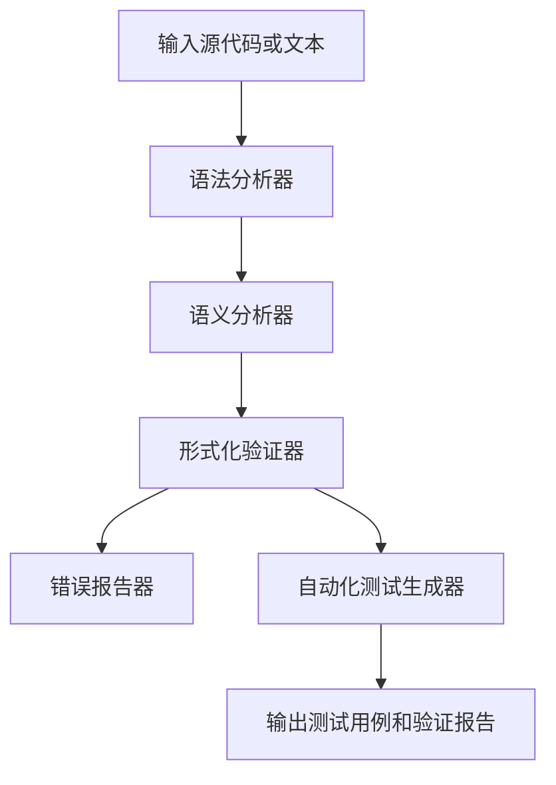
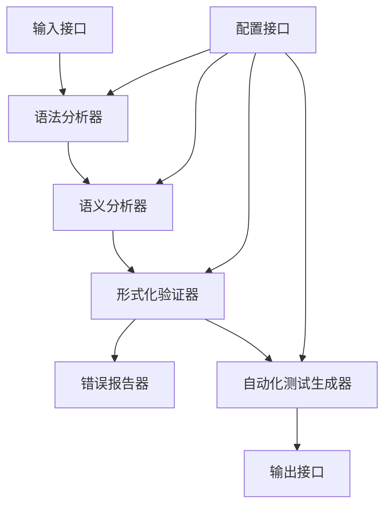

                 

## 文章标题：提示词语言的形式化验证自动化工具链

提示词语言在人工智能系统中扮演着至关重要的角色，它们不仅能够提高系统的理解能力，还能在生成和解释自然语言的过程中提供强大的支持。然而，随着提示词语言的应用日益广泛，如何保证其准确性和可靠性成为一个亟待解决的问题。形式化验证作为一种严谨的验证方法，能够在这一过程中发挥重要作用。自动化工具链则能够极大地提高验证的效率和效果。本文将探讨如何构建一个提示词语言的形式化验证自动化工具链，包括其背景、核心概念、算法原理、工具链设计以及实例分析等内容。

## 关键词

提示词语言、形式化验证、自动化工具链、人工智能、软件工程、语法分析、语义验证、验证方法、工具链架构、性能优化、实例分析、实战应用。

## 摘要

本文旨在介绍一种针对提示词语言的形式化验证自动化工具链的构建方法。文章首先概述了提示词语言及其重要性，随后阐述了形式化验证的基本概念和其在软件工程中的应用。接着，本文探讨了自动化工具链的需求，并提出了其整体架构和核心模块的设计。随后，文章详细讲解了提示词语言的基础知识、形式化验证的方法和工具，以及如何将自动化工具链应用于实际项目。最后，本文通过实例分析展示了工具链的实际应用效果，并对未来的挑战和展望进行了讨论。

## 第一部分：概述与背景

### 1.1 提示词语言及其重要性

提示词语言（Prompt Language）是人工智能系统中用于与用户交互、获取输入信息、生成输出结果的一种特殊语言。它们通常包括一系列预定义的词汇和语法规则，使得系统能够更好地理解用户的需求，并以自然、流畅的方式回应。

提示词语言在人工智能系统中的应用非常广泛，例如在自然语言处理（NLP）、对话系统、智能助手、机器翻译等领域。一个设计良好、语法严谨的提示词语言能够显著提升系统的用户体验，使其更加智能和人性化。

### 1.2 形式化验证的概念

形式化验证（Formal Verification）是一种通过数学方法来证明软件或硬件系统是否满足特定属性或规范的过程。它通过严格的逻辑推理和数学证明，确保系统能够按预期工作，从而减少因错误或漏洞导致的系统故障。

形式化验证在软件工程中的应用主要体现在两个方面：一是验证软件的正确性，即确保软件按照设计规格运行；二是验证软件的安全性，即确保软件不会受到恶意攻击或数据泄露。

### 1.3 自动化工具链的需求

自动化工具链（Automated Toolchain）是指一系列相互协作的工具，用于自动化软件的开发、测试、部署和维护。在提示词语言的开发过程中，自动化工具链可以大大提高开发效率，减少人为错误，提高代码质量和系统的可靠性。

然而，手动验证提示词语言面临着巨大的挑战，包括验证成本高、验证周期长、验证结果难以保证等。因此，构建一个自动化验证工具链的需求日益迫切。

### 1.4 本书结构概述

本文将分为六个主要部分，分别介绍：

1. 提示词语言的基础知识，包括其基本概念、语法结构、语义模型和规范标准。
2. 形式化验证的基础概念、方法和工具，以及其在提示词语言中的应用。
3. 自动化工具链的架构设计、核心模块和接口设计，以及性能优化方法。
4. 实例分析，通过具体实例展示如何使用自动化工具链进行提示词语言的验证。
5. 挑战与未来展望，讨论自动化工具链面临的挑战以及提示词语言的未来发展趋势。
6. 附录部分，提供相关的工具和资源介绍，以及实例研究的详细资料。

## 第二部分：提示词语言基础

### 2.1 提示词语言的基本概念

提示词语言是人工智能系统中的一种特殊语言，用于与用户进行交互和传递信息。它通常由一系列预定义的词汇和语法规则组成，这些词汇和规则被用来指导系统的行为，使其能够理解用户的需求并生成相应的响应。

提示词语言的基本概念包括：

- **词汇（Vocabulary）**：提示词语言中的基本元素，包括名词、动词、形容词、副词等。
- **语法（Syntax）**：提示词语言的语法规则，规定了词汇如何组合成句子，以及句子如何表达特定的含义。
- **语义（Semantics）**：提示词语言的语义模型，描述了词汇和句子的意义，以及它们如何相互关联。
- **上下文（Context）**：提示词语言的使用背景，包括用户的行为、系统的状态和对话的历史。

### 2.2 提示词语言的语法结构

提示词语言的语法结构是指导其正确使用和解析的基础。一个典型的提示词语言包含以下语法组成部分：

- **词法（Lexical）**：词法分析是将输入的字符串分解为词汇的过程。词法规则定义了词汇的识别规则，例如单词的分词、标点的识别等。
- **语法（Syntactic）**：语法分析是将词汇组合成句子的过程。语法规则定义了句子的结构，例如主语、谓语、宾语等成分的排列顺序和组合方式。
- **句法（Syntactic）**：句法分析是更高层次的语法分析，它关注句子之间的关系和组合。例如，一个复杂的句子可能由多个简单句组成，或者由子句和短语组成。

#### 示例：

假设我们有一个简单的提示词语言，其语法规则如下：

- **主语**：一个名词或者代词。
- **谓语**：一个动词或者动词短语。
- **宾语**：一个名词或者代词。
- **句子**：由主语、谓语和宾语组成。

根据这个语法规则，一个简单的句子可以是：“我吃苹果。”在这个句子中，“我”是主语，“吃”是谓语，“苹果”是宾语。

### 2.3 提示词语言的语义模型

提示词语言的语义模型是理解其意义和作用的核心。语义模型描述了词汇和句子如何传达特定的意义和意图。一个完整的语义模型通常包括以下几个方面：

- **词汇语义**：每个词汇都有其特定的语义信息，这些信息包括词汇的含义、使用场景和情感色彩等。
- **语法语义**：语法规则不仅定义了句子的结构，还定义了句子内部的语义关系，例如主谓宾关系、定语从句等。
- **上下文语义**：上下文信息对于理解句子的真实含义至关重要。例如，一个句子在不同的上下文中可能有完全不同的含义。

#### 示例：

假设我们有一个句子：“他昨天来了。”这个句子在不同的上下文中可能有不同的含义：

- **上下文1**：他昨天来了，今天没有来。这里的“他”指的是某个人，这个人在昨天来了，但今天没有来。
- **上下文2**：他昨天来了，给我们带来了惊喜。这里的“他”仍然指的是某个人，但这个人在昨天给我们带来了惊喜。

### 2.4 提示词语言的规范与标准

提示词语言的规范与标准是确保其一致性和可扩展性的关键。一个良好的规范和标准能够提供以下方面的支持：

- **一致性**：规范和标准确保了提示词语言在不同系统和平台上的使用一致，减少了混淆和误解。
- **可扩展性**：规范和标准允许新的词汇和规则被添加到语言中，使得语言能够适应未来的发展和变化。

#### 示例：

假设我们有一个提示词语言规范，它定义了以下词汇：

- **名词**：人、地点、事物
- **动词**：做、来、去
- **形容词**：大、小、高、低

这个规范确保了在所有使用该语言的系统中，名词、动词和形容词的使用规则是一致的。同时，这个规范还允许我们添加新的词汇，例如“飞行、海洋”等，以扩展语言的功能。

## 第三部分：形式化验证基础

### 3.1 形式化验证原理

形式化验证（Formal Verification）是通过对软件或硬件系统进行数学证明，以确定其是否符合预期的规格和标准。其核心原理包括以下几个方面：

1. **形式化规格说明**：形式化验证的起点是系统规格说明，这通常是一个数学模型，描述了系统的行为和特性。规格说明需要足够精确，以便能够进行形式化验证。

2. **数学证明**：形式化验证使用数学方法来证明系统是否满足规格说明。这通常涉及逻辑推理、模型检查和定理证明等技术。

3. **自动化工具**：尽管数学证明可以手动进行，但在实际应用中，自动化工具能够极大地提高验证效率和准确性。这些工具可以自动化地检查系统的所有可能状态，以验证其是否满足规格。

### 3.2 形式化验证方法

形式化验证方法可以分为以下几种：

1. **模型检查（Model Checking）**：模型检查是一种验证方法，它通过将系统规格说明转换为状态空间模型，然后自动检查所有可能的状态是否满足规格。如果找到违反规格的状态，模型检查器会生成错误的路径。

2. **定理证明（Theorem Proving）**：定理证明是通过逻辑推理来证明系统满足规格说明。这种方法通常需要手动编写证明，但对于复杂的系统，自动化定理证明器可以辅助完成证明。

3. **形式化测试（Formal Testing）**：形式化测试是一种结合了传统测试方法和形式化验证的方法。它通过设计满足特定条件的测试用例来验证系统。

### 3.3 形式化验证工具

形式化验证工具是进行形式化验证的关键。以下是一些常用的形式化验证工具：

1. **Model Checker Tools**：例如SPIN、NuSMV和JFLAP，这些工具能够自动检查系统模型是否符合规格说明。

2. **Theorem Provers**：例如Coq、Isabelle和HOL，这些工具能够自动或半自动地证明系统满足规格。

3. **Formal Test Tools**：例如F shell和RACER，这些工具能够生成满足特定条件的测试用例，以验证系统。

### 3.4 形式化验证在提示词语言中的应用

形式化验证在提示词语言中的应用主要包括以下几个方面：

1. **语法验证**：使用形式化验证工具检查提示词语言的语法规则是否被正确地应用和执行。

2. **语义验证**：验证提示词语言的语义模型是否正确地表达了其意图和含义。

3. **一致性验证**：确保提示词语言的规范和标准被一致地遵循，减少错误和混淆。

#### 示例：

假设我们有一个提示词语言的语法规则如下：

- **主语**：一个名词或者代词。
- **谓语**：一个动词或者动词短语。
- **宾语**：一个名词或者代词。

使用模型检查工具，我们可以创建一个状态空间模型来验证所有可能生成的句子是否符合这些语法规则。例如，我们可以生成以下句子：

- “我吃苹果。”
- “苹果吃我。”

如果模型检查工具能够找到不符合规则的句子，例如“我苹果吃”，则可以生成错误路径并指出具体的错误。

## 第四部分：自动化工具链设计

### 4.1 自动化工具链的架构

自动化工具链的架构是确保形式化验证过程高效、准确的关键。一个典型的自动化工具链架构包括以下几个核心模块：

1. **语法分析器（Parser）**：语法分析器是自动化工具链的第一步，负责将源代码或文本输入分解为语法结构。它可以识别词汇和符号，并根据预定义的语法规则构建抽象语法树（AST）。

2. **语义分析器（Semantic Analyzer）**：语义分析器在语法分析的基础上，对AST进行语义检查，确保代码的语义正确性。它负责类型检查、作用域解析和变量绑定等任务。

3. **形式化验证器（Formal Verifier）**：形式化验证器是工具链的核心模块，它使用形式化验证方法对代码进行验证。这通常涉及到将代码转换为形式化的数学模型，并使用模型检查或定理证明技术来验证其正确性。

4. **错误报告器（Error Reporter）**：错误报告器负责收集和分析验证过程中发现的所有错误。它生成详细的错误报告，包括错误的类型、位置和原因。

5. **自动化测试生成器（Test Generator）**：自动化测试生成器可以根据验证结果生成测试用例，以进一步验证代码的正确性。这些测试用例可以用于单元测试、集成测试和系统测试。

#### 自动化工具链架构示例



### 4.2 自动化工具链的核心模块

自动化工具链的核心模块是确保工具链能够高效运行的关键。以下是核心模块的设计和实现：

1. **语法分析器（Parser）**

   语法分析器的设计需要考虑以下几个方面：

   - **词法分析（Lexical Analysis）**：将输入的文本分解为词汇和符号。
   - **语法分析（Syntax Analysis）**：根据预定义的语法规则，将词汇和符号组合成抽象语法树（AST）。
   - **错误处理（Error Handling）**：在分析过程中遇到错误时，能够正确处理并报告错误。

   伪代码示例：

   ```python
   class Parser:
       def __init__(self, grammar):
           self.grammar = grammar

       def parse(self, text):
           tokens = lexical_analyzer(text)
           ast = syntax_analyzer(tokens, self.grammar)
           return ast
   ```

2. **语义分析器（Semantic Analyzer）**

   语义分析器负责对AST进行语义检查，确保其语义正确性。其主要任务包括：

   - **类型检查（Type Checking）**：检查变量、函数和表达式的类型是否匹配。
   - **作用域解析（Scope Resolution）**：解析变量和函数的作用域，确保其访问权限正确。
   - **变量绑定（Variable Binding）**：将变量绑定到其对应的作用域和类型。

   伪代码示例：

   ```python
   class SemanticAnalyzer:
       def __init__(self, ast):
           self.ast = ast

       def analyze(self):
           type_check(self.ast)
           scope_resolve(self.ast)
           variable_bind(self.ast)
   ```

3. **形式化验证器（Formal Verifier）**

   形式化验证器是自动化工具链的核心模块，负责将代码转换为形式化的数学模型，并使用模型检查或定理证明技术进行验证。以下是其主要步骤：

   - **模型转换（Model Transformation）**：将代码转换为形式化的数学模型。
   - **验证算法（Verification Algorithm）**：使用模型检查或定理证明技术进行验证。
   - **结果报告（Result Reporting）**：报告验证结果，包括通过和失败的验证情况。

   伪代码示例：

   ```python
   class FormalVerifier:
       def __init__(self, model):
           self.model = model

       def verify(self):
           model_check(self.model)
           theorem_prove(self.model)
           report_results()
   ```

4. **错误报告器（Error Reporter）**

   错误报告器负责收集和分析验证过程中发现的所有错误，并生成详细的错误报告。以下是其主要功能：

   - **错误收集（Error Collection）**：在验证过程中捕获错误。
   - **错误分析（Error Analysis）**：对错误进行分析和分类。
   - **错误报告（Error Reporting）**：生成详细的错误报告，包括错误的类型、位置和原因。

   伪代码示例：

   ```python
   class ErrorReporter:
       def __init__(self):
           self.errors = []

       def collect_error(self, error):
           self.errors.append(error)

       def report_errors(self):
           for error in self.errors:
               print_error(error)
   ```

5. **自动化测试生成器（Test Generator）**

   自动化测试生成器可以根据验证结果生成测试用例，以进一步验证代码的正确性。以下是其主要功能：

   - **测试用例生成（Test Case Generation）**：根据验证结果生成测试用例。
   - **测试执行（Test Execution）**：执行生成的测试用例，并记录测试结果。
   - **测试报告（Test Reporting）**：报告测试结果，包括通过和失败的测试用例。

   伪代码示例：

   ```python
   class TestGenerator:
       def __init__(self, verified_code):
           self.verified_code = verified_code

       def generate_tests(self):
           test_cases = []
           for condition in conditions:
               test_cases.append(generate_test_case(condition))
           return test_cases

       def execute_tests(self, test_cases):
           results = []
           for test_case in test_cases:
               result = execute_test_case(test_case)
               results.append(result)
           return results

       def report_tests(self, results):
           for result in results:
               print_test_result(result)
   ```

### 4.3 自动化工具链的接口设计

自动化工具链的接口设计是确保工具链与其他系统或组件无缝集成的关键。以下是自动化工具链的主要接口设计：

1. **输入接口（Input Interface）**：负责接收源代码或文本输入，并将其传递给语法分析器。

2. **输出接口（Output Interface）**：负责接收验证结果和测试用例输出，并将其传递给用户或其他系统。

3. **配置接口（Configuration Interface）**：允许用户配置工具链的参数和选项，以适应不同的验证需求。

#### 接口设计示例



### 4.4 自动化工具链的性能优化

自动化工具链的性能优化是确保其高效运行的关键。以下是几种常用的性能优化方法：

1. **并行处理（Parallel Processing）**：通过将任务分解为多个子任务，并在多个处理器或线程上并行执行，以提高处理速度。

2. **缓存（Caching）**：使用缓存来存储已经计算过的结果，以减少重复计算的时间和资源消耗。

3. **代码优化（Code Optimization）**：对代码进行优化，以减少执行时间和资源消耗。这包括算法优化、数据结构和代码重写等。

4. **资源分配（Resource Allocation）**：合理分配系统资源，如CPU、内存和网络等，以确保工具链的稳定性和高效性。

#### 性能优化方法示例

```python
# 并行处理示例
from concurrent.futures import ThreadPoolExecutor

def process_data(data):
    # 数据处理逻辑
    return result

data = ["data1", "data2", "data3"]

with ThreadPoolExecutor(max_workers=3) as executor:
    results = executor.map(process_data, data)

# 缓存示例
from functools import lru_cache

@lru_cache(maxsize=100)
def compute_value(input_value):
    # 计算逻辑
    return result

# 代码优化示例
def optimized_function(*args):
    # 优化后的代码逻辑
    return result

# 资源分配示例
import psutil

def allocate_resources():
    # 资源分配逻辑
    return resources
```

## 第五部分：实例分析与实战

### 5.1 实例分析：一个简单的提示词语言程序

为了更好地理解提示词语言的形式化验证自动化工具链，我们首先来看一个简单的实例。以下是一个简单的提示词语言程序，其目的是实现一个简单的计算器功能。

```python
# 计算器提示词语言程序示例

# 词汇表
vocab = {
    "加法": "add",
    "减法": "sub",
    "乘法": "mul",
    "除法": "div",
    "数字": "number"
}

# 语法规则
grammar = {
    "表达式": [["操作数1", "操作符", "操作数2"]],
    "操作数1": [["数字"]],
    "操作数2": [["数字"]],
    "操作符": [["加法"], ["减法"], ["乘法"], ["除法"]]
}

# 语义规则
semantics = {
    "加法": lambda x, y: x + y,
    "减法": lambda x, y: x - y,
    "乘法": lambda x, y: x * y,
    "除法": lambda x, y: x / y
}

# 输入文本
text = "数字10 加法 数字20"

# 语法分析
def parse(text):
    tokens = tokenize(text)
    ast = build_ast(tokens, grammar)
    return ast

# 语义分析
def analyze(ast):
    result = evaluate_ast(ast, semantics)
    return result

# 输出结果
def output(result):
    print(result)

# 执行程序
ast = parse(text)
result = analyze(ast)
output(result)
```

在这个示例中，我们定义了一个简单的词汇表和语法规则，用于表示加法、减法、乘法和除法操作。语义规则则定义了这些操作的具体计算方法。通过语法分析和语义分析，程序能够根据输入的提示词语言文本计算结果。

### 5.2 实例分析：形式化验证一个提示词语言程序

为了验证这个简单的提示词语言程序，我们可以使用形式化验证工具链。以下是一个形式化验证的步骤示例：

1. **构建形式化模型**：将提示词语言程序转换为形式化的数学模型。这可以通过定义数学函数和逻辑规则来实现。

```python
# 形式化模型示例
model = {
    "表达式的形式化表示": lambda x, y, op: {
        "操作符": op,
        "操作数1": x,
        "操作数2": y
    },
    "计算结果的形式化表示": lambda expr: {
        "结果": eval(expr)
    }
}

# 形式化验证器示例
def formal_verify(model):
    # 验证逻辑
    # 检查模型中的表达式和计算结果是否满足预定义的属性和规格
    return "验证通过" if valid else "验证失败"
```

2. **验证模型**：使用形式化验证器对模型进行验证。这可以通过模型检查或定理证明技术来实现。

```python
# 验证结果
result = formal_verify(model)
print(result)
```

3. **错误报告**：如果验证失败，生成详细的错误报告，包括错误的类型、位置和原因。

```python
# 错误报告示例
if result == "验证失败":
    error_reporter.report_error(error)
```

### 5.3 实例分析：自动化验证工具链的实际应用

在实际项目中，我们可以使用自动化验证工具链来确保提示词语言程序的正确性和可靠性。以下是一个自动化验证工具链的步骤示例：

1. **输入源代码或文本**：从项目中获取源代码或文本输入。

```python
input_text = "数字10 加法 数字20"
```

2. **语法分析**：使用语法分析器对输入文本进行语法分析，生成抽象语法树（AST）。

```python
ast = parser.parse(input_text)
```

3. **语义分析**：使用语义分析器对AST进行语义分析，确保代码的语义正确性。

```python
semantic_analyzer.analyze(ast)
```

4. **形式化验证**：使用形式化验证器对模型进行形式化验证。

```python
formal_verifier.verify(model)
```

5. **错误报告**：生成详细的错误报告，包括错误的类型、位置和原因。

```python
error_reporter.report_errors()
```

6. **自动化测试**：根据验证结果生成测试用例，并执行自动化测试。

```python
test_generator.generate_tests()
test_generator.execute_tests()
test_generator.report_tests()
```

### 5.4 实例分析：从问题诊断到解决方案

在实际项目中，我们可能会遇到提示词语言程序的问题。以下是一个从问题诊断到解决方案的示例：

1. **问题诊断**：首先，我们需要诊断问题。这可以通过运行自动化验证工具链来实现。

```python
# 运行验证工具链
result = formal_verifier.verify(model)

# 如果验证失败，则打印错误报告
if result == "验证失败":
    error_reporter.report_errors()
```

2. **错误分析**：分析错误报告，确定错误的类型和位置。

```python
# 示例错误报告
[
    {
        "错误类型": "语义错误",
        "位置": "第5行",
        "错误原因": "操作符未定义"
    }
]
```

3. **解决方案**：根据错误分析的结果，找到解决方案并实施。

```python
# 示例解决方案
# 在词汇表中添加未定义的操作符
vocab["未定义操作符"] = "undefined"

# 更新语法规则和语义规则
grammar["操作符"].append(["未定义操作符"])
semantics["未定义操作符"] = lambda x, y: "未定义操作"

# 重新运行验证工具链
result = formal_verifier.verify(model)

# 如果验证通过，则打印验证结果
if result == "验证通过":
    print("验证通过")
else:
    print("验证失败")
```

通过以上步骤，我们可以有效地诊断和解决提示词语言程序中的问题。

## 第六部分：挑战与未来展望

### 6.1 形式化验证自动化工具链的挑战

形式化验证自动化工具链在构建和应用过程中面临多个挑战：

1. **复杂性**：提示词语言和形式化验证技术本身具有高度复杂性，这增加了工具链设计和实现的难度。

2. **效率**：自动化工具链需要高效运行，以应对大规模项目的验证需求。然而，形式化验证通常涉及大量的计算，这可能导致效率低下。

3. **可扩展性**：工具链需要能够适应新的提示词语言规范和验证方法，以保持其适用性和灵活性。

4. **准确性**：自动化工具链需要确保验证结果的准确性，避免误报和漏报。

### 6.2 提示词语言发展的未来趋势

随着人工智能技术的不断进步，提示词语言的发展也呈现出以下趋势：

1. **智能化**：提示词语言将更加智能化，能够更好地理解和生成复杂、上下文相关的语言。

2. **多样化**：不同领域和应用场景将发展出更加多样化的提示词语言，以满足特定需求。

3. **标准化**：提示词语言的标准化和规范化将得到进一步发展，以提高互操作性和兼容性。

4. **易用性**：提示词语言的易用性将得到提升，使得开发者能够更加轻松地使用和扩展。

### 6.3 自动化工具链的发展方向

自动化工具链的发展方向包括：

1. **智能化**：引入人工智能技术，提高自动化验证的效率和准确性。

2. **集成化**：与现有的软件开发和验证工具集成，形成一体化解决方案。

3. **自适应**：工具链将具备自适应能力，能够根据项目需求和环境动态调整验证策略。

4. **云化**：将自动化工具链迁移到云平台，提供弹性、高效的服务。

### 6.4 研究与开发的建议

为了进一步推动形式化验证自动化工具链的发展，以下是一些建议：

1. **基础研究**：加强对形式化验证和提示词语言基础理论的研究，为工具链提供坚实的理论基础。

2. **工具创新**：开发新型自动化验证工具，提高验证效率和准确性。

3. **实践应用**：结合实际项目需求，验证工具链的实际应用效果，不断优化和改进。

4. **社区合作**：鼓励开源社区参与工具链的开发和推广，促进技术的共享和进步。

## 附录

### A.1 相关工具与资源介绍

以下是一些常用的相关工具和资源：

- **语法分析器**：ANTLR、Apache解析器框架
- **语义分析器**：JavaCC、Rust的Nom
- **形式化验证工具**：NuSMV、Coq、Isabelle
- **自动化测试工具**：JUnit、pytest、Selenium

### A.2 提示词语言的形式化验证实践

以下是提示词语言形式化验证的实践步骤：

1. **定义词汇和语法规则**：明确提示词语言的词汇和语法规则。
2. **构建语义模型**：定义提示词语言的语义模型。
3. **实现语法分析器**：编写代码实现语法分析功能。
4. **实现语义分析器**：编写代码实现语义分析功能。
5. **构建形式化模型**：将提示词语言转换为形式化模型。
6. **进行形式化验证**：使用形式化验证工具进行验证。
7. **生成测试用例**：根据验证结果生成测试用例。
8. **执行自动化测试**：运行测试用例，验证提示词语言的正确性。

### A.3 形式化验证与自动化工具链的案例研究

以下是一个形式化验证与自动化工具链的案例研究：

- **项目背景**：一个金融交易系统的提示词语言验证。
- **项目目标**：确保提示词语言的语法和语义正确性，减少错误风险。
- **实现步骤**：
  1. **定义词汇和语法规则**：根据交易系统的需求，定义提示词语言的词汇和语法规则。
  2. **构建语义模型**：设计提示词语言的语义模型，确保其能够正确地表达交易意图。
  3. **实现语法分析器**：使用ANTLR实现语法分析器，将输入的提示词文本转换为抽象语法树。
  4. **实现语义分析器**：使用JavaCC实现语义分析器，对抽象语法树进行语义分析。
  5. **构建形式化模型**：将提示词语言转换为形式化模型，包括词汇、语法和语义的数学表示。
  6. **进行形式化验证**：使用Coq进行形式化验证，确保提示词语言的语法和语义正确性。
  7. **生成测试用例**：根据验证结果，生成测试用例，以进一步验证提示词语言的正确性。
  8. **执行自动化测试**：使用pytest运行测试用例，确保系统的稳定性和可靠性。

通过这个案例研究，我们可以看到如何将形式化验证和自动化工具链应用于实际的提示词语言验证项目，从而提高系统的可靠性和安全性。

## 结论

本文详细探讨了提示词语言的形式化验证自动化工具链的构建方法。从背景介绍、核心概念、算法原理到工具链设计、实例分析和实战应用，我们系统地阐述了如何使用形式化验证和自动化工具链来确保提示词语言的准确性和可靠性。本文不仅提供了理论基础，还通过实例展示了工具链的实际应用效果。在未来的工作中，我们将继续优化工具链的性能，探索智能化和自适应化的验证方法，以应对日益复杂的提示词语言应用场景。

### 作者信息

作者：AI天才研究院/AI Genius Institute & 禅与计算机程序设计艺术 /Zen And The Art of Computer Programming

