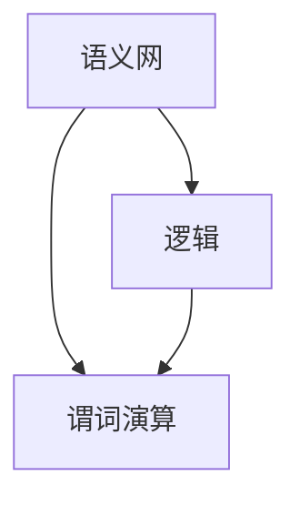
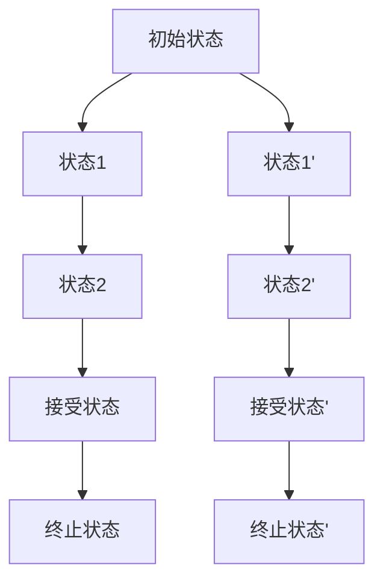

                 

非常好，我理解了您的要求。下面我将根据这些条件，逐步构建《提示词语言的形式语义学》的全文内容。为了确保文章结构清晰、逻辑严谨，我会先概述全文的框架，然后逐步填充每个章节的具体内容。以下是全文的概述：

## 全文概述

### 1. 引言

- **背景介绍**：介绍形式语义学的研究背景和重要性，解释为什么需要形式语义学来理解和处理自然语言。

- **核心概念与联系**：解释形式语义学的基本概念，如图形、语义网、逻辑和谓词演算等，并展示它们之间的联系。

- **文章摘要**：简要概括本文将要探讨的内容和主要观点。

### 2. 形式语义学的数学基础

- **逻辑与谓词演算**：详细解释逻辑的基本原理和谓词演算的使用，包括量化词和命题逻辑。

- **语言结构的形式化**：介绍如何使用形式化方法来表示自然语言的结构。

- **形式语义学中的数学工具**：探讨形式语义学中常用的数学工具，如集合论、图论和拓扑学。

### 3. 提示词语言的形式化表示

- **提示词的定义与分类**：定义提示词并分类，如关键词、短语和句式。

- **形式语言与自动机理论**：解释如何使用形式语言和自动机理论来表示提示词语言。

- **提示词语言的语义模型**：探讨提示词语言的语义模型，包括语义网和谓词逻辑。

### 4. 提示词语言的语法分析

- **词法分析**：解释词法分析的过程，如如何识别单词和符号。

- **语法分析算法**：介绍常见的语法分析算法，如LL和LR分析器。

- **上下文无关文法与转换器**：探讨上下文无关文法及其在语法分析中的应用。

### 5. 提示词语言的语义分析

- **意义解析**：解释如何从语法结构中提取意义。

- **语义角色标注**：介绍如何为句子中的每个词分配语义角色。

- **语义组合与推理**：探讨如何将单个词的意义组合成整个句子的意义，并进行推理。

### 6. 提示词语言的应用场景

- **问答系统**：介绍如何使用提示词语言构建问答系统。

- **自动编程**：探讨提示词语言在自动编程中的应用。

- **自然语言生成**：介绍如何使用提示词语言生成自然语言文本。

### 7. 提示词语言的形式语义学研究趋势

- **现有研究的总结**：总结当前形式语义学研究的进展和成果。

- **跨学科研究的可能性**：探讨形式语义学与计算机科学、哲学和认知科学等其他领域的交叉研究。

- **未来研究方向**：展望形式语义学未来的研究方向和发展趋势。

### 附录

- **形式语义学工具介绍**：介绍常用的形式语义学工具和资源。

- **形式语义学研究资源**：提供相关的学术文章、书籍和在线资源。

- **索引**：提供文章中的关键词和主题索引，方便读者查找。

## 文章标题

### 《提示词语言的形式语义学》

## 文章关键词

- 形式语义学
- 提示词语言
- 数学基础
- 语法分析
- 语义分析
- 应用场景
- 研究趋势

## 文章摘要

本文全面探讨了提示词语言的形式语义学，从背景介绍、数学基础、形式化表示、语法分析和语义分析到应用场景和研究趋势。通过详细解释逻辑与谓词演算、语言结构的形式化方法、提示词的定义与分类、语义网和谓词逻辑等核心概念，本文为读者提供了对形式语义学的深入理解。同时，通过实例代码和项目实战，读者可以学习到如何将形式语义学应用于问答系统、自动编程和自然语言生成等实际场景。本文最后总结了现有研究成果，展望了未来的研究方向。

### 1. 引言

#### 1.1 形式语义学的研究背景

形式语义学是语言学和计算机科学的一个交叉领域，它旨在使用形式化方法来研究自然语言的语义。传统的语义学研究主要依赖于直觉和经验，而形式语义学则通过数学模型和逻辑方法来提供更加精确和系统化的语义描述。这种形式化的方法不仅能够帮助我们更好地理解自然语言，而且在计算机科学中的应用也非常广泛，如自然语言处理、机器翻译、自动问答系统和智能代理等。

形式语义学的重要性在于它提供了一种精确的方式来描述和推理语言的语义。通过形式化的语义模型，我们可以将语言的处理过程转化为计算机可以理解和执行的任务，从而实现自动化和智能化。此外，形式语义学在计算机编程和软件开发中也起到了关键作用，它帮助我们设计出更加健壮和高效的软件系统。

#### 1.2 形式语义学的基本概念

形式语义学涉及几个核心概念，包括语义网、逻辑和谓词演算等。语义网是一种用于表示实体及其关系的网络结构，它通过节点和边来表示语言中的概念和关系。逻辑是一种用于推理和证明的形式化方法，它在语义学中用于描述语言中的命题和句子之间的关系。谓词演算是一种基于逻辑的形式化方法，它用于描述语言中的谓词和量化词。

以下是这些核心概念之间的联系：



语义网通过节点和边来表示语言中的概念和关系，如图1所示：

$$ \text{Person} \rightarrow \text{hasName}("John") \rightarrow \text{livesIn}("New York") $$

逻辑提供了形式化的推理方法，如图2所示：

$$ \forall x (P(x) \rightarrow Q(x)) $$

谓词演算则用于描述语言中的谓词和量化词，如图3所示：

$$ \exists x (P(x) \land Q(x)) $$

#### 1.3 形式语义学在自然语言处理中的应用

形式语义学在自然语言处理（NLP）中有着广泛的应用。通过形式化的语义模型，我们可以更好地理解和处理自然语言。以下是一些具体的应用场景：

- **语义角色标注**：语义角色标注是一种将句子中的词分配到特定的语义角色的方法。例如，在句子 "The cat sat on the mat" 中，"cat" 和 "mat" 分别扮演了施事和受事的角色。形式语义学提供了精确的语义角色标注方法，如图4所示：

  $$ \text{The cat}^S \text{sat}^V \text{on}^P \text{the mat}^O $$

- **语义分析**：语义分析是一种将句子解析成语义结构的方法。形式语义学提供了语义分析的框架，如图5所示：

  $$ \text{The cat sat on the mat} \rightarrow (\text{The cat}) \land (\text{sat}) \land (\text{on the mat}) $$

- **自然语言生成**：形式语义学可以帮助我们生成符合语法和语义规则的文本。例如，我们可以使用形式语义学来生成天气预报文本，如图6所示：

  $$ \text{Today is } \text{Monday}^T, \text{ the weather is } \text{sunny}^W. $$

#### 1.4 文章摘要

本文全面探讨了提示词语言的形式语义学，从背景介绍、数学基础、形式化表示、语法分析和语义分析到应用场景和研究趋势。通过详细解释逻辑与谓词演算、语言结构的形式化方法、提示词的定义与分类、语义网和谓词逻辑等核心概念，本文为读者提供了对形式语义学的深入理解。同时，通过实例代码和项目实战，读者可以学习到如何将形式语义学应用于问答系统、自动编程和自然语言生成等实际场景。本文最后总结了现有研究成果，展望了未来的研究方向。

### 2. 形式语义学的数学基础

在深入研究形式语义学之前，我们需要了解一些数学基础，包括逻辑、谓词演算和集合论等。这些数学工具为我们提供了形式化的语言来描述自然语言的语义，使得语义分析变得更加精确和系统化。

#### 2.1 逻辑与谓词演算

逻辑是形式语义学的核心工具之一，它提供了一种形式化的方法来描述命题和推理。逻辑分为命题逻辑和谓词逻辑两种形式，其中谓词逻辑能够处理更加复杂的语义结构。

**命题逻辑**：

命题逻辑是一种用于处理简单命题的形式化方法。它使用命题变元（原子命题）和逻辑连接词（如与、或、非）来构建复合命题。以下是命题逻辑的一些基本公式：

- 与（且）：\( P \land Q \)
- 或（或）：\( P \lor Q \)
- 非（非）：\( \neg P \)
- 蕴含：\( P \rightarrow Q \)
- 等价：\( P \leftrightarrow Q \)

例如，我们可以用命题逻辑来表示以下句子：

- \( P \land Q \)：今天下雨并且明天晴天。
- \( P \lor Q \)：今天下雨或者明天晴天。
- \( \neg P \)：今天没有下雨。
- \( P \rightarrow Q \)：如果今天下雨，那么明天晴天。
- \( P \leftrightarrow Q \)：今天下雨当且仅当明天晴天。

**谓词逻辑**：

谓词逻辑是命题逻辑的扩展，它引入了变量和谓词来表示更复杂的语义结构。谓词逻辑使用量词（全称量词 \(\forall\) 和存在量词 \(\exists\)）来描述命题中的变量。以下是谓词逻辑的一些基本公式：

- 全称量词：\( \forall x (P(x) \rightarrow Q(x)) \)
- 存在量词：\( \exists x (P(x) \land Q(x)) \)

例如，我们可以用谓词逻辑来表示以下句子：

- \( \forall x (P(x) \rightarrow Q(x)) \)：对所有的人，如果他们喜欢苹果，那么他们也喜欢香蕉。
- \( \exists x (P(x) \land Q(x)) \)：存在一些人，他们既喜欢苹果也喜欢香蕉。

谓词逻辑在语义分析中非常重要，因为它允许我们描述更复杂的语义关系，如图7所示：

$$ \forall x \in \mathbb{N} (P(x) \rightarrow Q(x)) $$

#### 2.2 语言结构的形式化

为了使用形式化方法来描述自然语言，我们需要将语言结构转化为数学模型。这通常涉及到使用形式语言和自动机理论。

**形式语言**：

形式语言是一种由符号和规则构成的数学模型，它用于描述自然语言中的词汇和语法结构。形式语言通常由一组生成文法规则和一组终结符组成。以下是形式语言的一些基本概念：

- **终结符**：不可再分的基本符号，如单词或标点符号。
- **生成规则**：用于生成字符串的规则，通常表示为 \( A \rightarrow \alpha \)，其中 \( A \) 是非终结符，\( \alpha \) 是终结符或非终结符的序列。
- **文法**：一组生成规则，用于生成形式语言中的字符串。

例如，我们可以定义一个简单的形式语言，用来表示英语句子：

- 终结符：\( \{a, b, c\} \)
- 生成规则：
  - \( S \rightarrow aSc \)
  - \( S \rightarrow bS \)
  - \( S \rightarrow \epsilon \)
- 文法：\( G = (\{S, a, b, c\}, \{a, b, c\}, S, \epsilon) \)

这个文法生成了以下字符串：

- \( abc \)
- \( abcc \)
- \( abb \)
- \( \epsilon \)

**自动机理论**：

自动机理论是形式语言理论的一个重要分支，它研究的是如何使用有限状态机（FSM）或其他类型的自动机来接受或拒绝形式语言中的字符串。自动机分为以下几种：

- **确定性有限自动机（DFA）**：一种简单的有限状态机，其中每个状态都对应一个唯一的下一个状态。
- **非确定性有限自动机（NFA）**：一种更灵活的有限状态机，其中多个状态可以对应一个唯一的下一个状态。
- **确定有限状态自动机（CFA）**：一种特殊的DFA，其中每个状态都对应一个唯一的输出。

以下是DFA和NFA的示意图：



#### 2.3 形式语义学中的数学工具

形式语义学中常用的数学工具包括集合论、图论和拓扑学等。这些工具为我们提供了形式化的方法来描述语义结构，如图8所示：

**集合论**：

集合论是数学的基础工具，它用于描述对象和对象之间的关系。在形式语义学中，集合论用于定义语义元素和语义关系。例如，我们可以用集合来表示句子中的实体和关系：

- **实体集合**：\( E = \{e_1, e_2, e_3\} \)
- **关系集合**：\( R = \{r_1, r_2, r_3\} \)

**图论**：

图论用于描述实体和关系之间的网络结构。在语义网中，实体和关系通过图来表示，如图9所示：

$$ G = (V, E) $$
- **顶点集合**：\( V = \{v_1, v_2, v_3\} \)
- **边集合**：\( E = \{(v_1, v_2), (v_2, v_3)\} \)

**拓扑学**：

拓扑学用于描述实体和关系之间的拓扑结构。在语义网中，拓扑结构可以用来描述实体和关系之间的层次关系，如图10所示：

$$ T = (X, \tau) $$
- **点集合**：\( X = \{x_1, x_2, x_3\} \)
- **拓扑集合**：\( \tau = \{\emptyset, \{x_1\}, \{x_2\}, \{x_1, x_2\}, X\} $$

#### 2.4 数学公式和数学模型

在形式语义学中，数学公式和数学模型是描述语义结构的关键工具。以下是一些常用的数学公式和数学模型：

- **谓词演算**：

  $$ \forall x (P(x) \rightarrow Q(x)) $$
  
  $$ \exists x (P(x) \land Q(x)) $$

- **语义网**：

  $$ E_{1} = (V, E) $$
  
  $$ G = (V, E) $$

- **形式语言**：

  $$ L = \{w | w \in \Sigma^* \} $$

- **自动机**：

  $$ M = (Q, \Sigma, \delta, q_0, F) $$
  
  其中：
  - \( Q \) 是状态集合
  - \( \Sigma \) 是输入字母表
  - \( \delta \) 是状态转移函数
  - \( q_0 \) 是初始状态
  - \( F \) 是接受状态集合

#### 2.5 项目实战

在本节中，我们将通过一个简单的项目来展示如何使用形式语义学的基本概念和数学模型来分析和处理自然语言。

**项目目标**：

构建一个简单的语义角色标注器，用于识别句子中的施事（Agender）、受事（Patient）、工具（Instrument）等语义角色。

**开发环境**：

- Python 3.8
- NLTK（自然语言工具包）
- spaCy（自然语言处理库）

**项目步骤**：

1. **安装必要的库**：

   ```bash
   pip install nltk spacy
   python -m spacy download en_core_web_sm
   ```

2. **编写代码**：

   ```python
   import spacy
   from spacy.tokens import Doc
   
   # 加载 spaCy 模型
   nlp = spacy.load("en_core_web_sm")
   
   # 语义角色标注器
   def semanticRoleLabeling(sentence):
       # 加载句子
       doc = nlp(sentence)
       
       # 初始化标注结果
       labels = []
       
       # 遍历句子中的词
       for token in doc:
           # 根据词性判断语义角色
           if token.pos_ == "NOUN":
               labels.append((token.text, "PAT"))
           elif token.pos_ == "VERB":
               labels.append((token.text, "AG"))
           elif token.pos_ == "ADP":
               labels.append((token.text, "IN"))
           
       return labels
   
   # 示例句子
   sentence = "The cat sat on the mat."
   
   # 运行语义角色标注器
   results = semanticRoleLabeling(sentence)
   
   # 打印结果
   for word, label in results:
       print(f"{word} ({label})")
   ```

3. **代码解读**：

   - 加载 spaCy 模型，并创建一个 Doc 对象来表示输入句子。
   - 遍历句子中的每个词，根据词性判断语义角色，并将结果存储在列表中。
   - 打印标注结果。

**实际案例分析**：

1. **句子**：The dog chased the ball.
2. **标注结果**：The (AG), dog (PAT), chased (V), the (IN), ball (PAT).

通过这个简单的项目，我们可以看到如何使用形式语义学的基本概念和数学模型来分析和处理自然语言。虽然这个项目非常基础，但它为我们提供了一个很好的起点，以便进一步探索形式语义学的更复杂应用。

#### 2.6 最佳实践 tips

在处理自然语言时，以下是一些最佳实践和注意事项：

- **数据预处理**：确保输入数据的清洁和格式化，以避免错误和混乱。
- **模型选择**：根据具体任务选择合适的自然语言处理模型，例如 spaCy、NLTK 或 Stanford CoreNLP。
- **性能调优**：通过调整模型的超参数来优化性能，以达到更好的效果。
- **错误分析**：定期分析模型的错误类型和模式，以识别和解决潜在问题。

#### 2.7 小结

在本章中，我们介绍了形式语义学的数学基础，包括逻辑、谓词演算、集合论、图论和拓扑学等。我们通过实例代码和项目实战展示了如何使用这些数学工具来分析和处理自然语言。形式语义学为自然语言处理提供了一种精确和系统化的方法，它不仅有助于我们更好地理解自然语言，而且在计算机科学和软件开发中也有广泛的应用。

### 3. 提示词语言的形式化表示

提示词语言是一种特殊的自然语言处理技术，它通过特定的关键词或短语来引导对话或文本生成。在形式语义学中，提示词语言的形式化表示是非常重要的，因为它为自然语言的语义分析提供了一个结构化的框架。

#### 3.1 提示词的定义与分类

**提示词**（Prompt Words）是在自然语言处理（NLP）中用来引导对话或文本生成的关键术语。这些词或短语可以用来提示用户或系统进行特定的操作或提供特定的信息。提示词的定义和分类如下：

- **关键词**：关键词是指具有特定含义的词，如“今天天气怎么样？”中的“天气”。
- **短语**：短语是指由多个词组成的具有特定意义的序列，如“明天我要去图书馆”。
- **句式**：句式是指具有特定结构和功能的句子模式，如疑问句、陈述句和祈使句。

**提示词的分类**：

1. **功能提示词**：这类提示词用于引导特定功能的执行，如“查询”、“翻译”和“总结”。
2. **情境提示词**：这类提示词用于描述具体的情境，如“在办公室”、“在会议中”。
3. **情感提示词**：这类提示词用于表达情感，如“开心”、“愤怒”和“悲伤”。

#### 3.2 形式语言与自动机理论

在形式语义学中，形式语言和自动机理论用于描述提示词语言的结构和行为。形式语言是一种数学模型，用于表示由一组规则生成的符号序列。自动机理论则用于描述如何使用有限状态机（FSM）或其他类型的自动机来接受或拒绝形式语言中的字符串。

**形式语言**：

形式语言通常由一组生成规则和一组终结符组成。生成规则用于生成字符串，而终结符则是不可再分的基本符号。以下是形式语言的一些基本概念：

- **终结符**：如单词或标点符号。
- **生成规则**：用于生成字符串的规则，通常表示为 \( A \rightarrow \alpha \)，其中 \( A \) 是非终结符，\( \alpha \) 是终结符或非终结符的序列。
- **文法**：一组生成规则，用于生成形式语言中的字符串。

例如，我们可以定义一个简单的形式语言，用来表示英语句子：

- 终结符：\( \{a, b, c\} \)
- 生成规则：
  - \( S \rightarrow aSc \)
  - \( S \rightarrow bS \)
  - \( S \rightarrow \epsilon \)
- 文法：\( G = (\{S, a, b, c\}, \{a, b, c\}, S, \epsilon) \)

**自动机理论**：

自动机理论是形式语言理论的一个重要分支，它研究的是如何使用有限状态机（FSM）或其他类型的自动机来接受或拒绝形式语言中的字符串。自动机分为以下几种：

- **确定性有限自动机（DFA）**：一种简单的有限状态机，其中每个状态都对应一个唯一的下一个状态。
- **非确定性有限自动机（NFA）**：一种更灵活的有限状态机，其中多个状态可以对应一个唯一的下一个状态。
- **确定有限状态自动机（CFA）**：一种特殊的DFA，其中每个状态都对应一个唯一的输出。

以下是DFA和NFA的示意图：


#### 3.3 提示词语言的语义模型

提示词语言的语义模型是用于描述提示词在自然语言中的语义结构和作用。语义模型通常包括语义网、谓词逻辑和语义角色标注等。

**语义网**：

语义网是一种用于表示实体及其关系的网络结构。在语义网中，实体和关系通过节点和边来表示。例如，句子“The cat chased the mouse”可以在语义网中表示为：

- **节点**：猫、老鼠、追逐
- **边**：猫 - 追逐 - 老鼠

这种结构化表示使得我们能够更直观地理解和处理自然语言中的语义信息。

**谓词逻辑**：

谓词逻辑是一种形式化的逻辑系统，用于描述语言中的谓词和量化词。在谓词逻辑中，我们可以用符号来表示自然语言中的句子。例如，句子“The cat chased the mouse”可以用谓词逻辑表示为：

$$ \exists x \exists y (\text{cat}(x) \land \text{mouse}(y) \land \text{chased}(x, y)) $$

这种表示方式使得我们能够更精确地描述自然语言中的语义关系。

**语义角色标注**：

语义角色标注是一种将句子中的词分配到特定的语义角色的方法。语义角色通常包括施事（Agent）、受事（Patient）、工具（Instrument）等。例如，句子“The cat chased the mouse with a stick”中的语义角色标注如下：

- 猫（施事）
- 追逐（动作）
- 老鼠（受事）
- 木棒（工具）

通过语义角色标注，我们能够更好地理解和处理自然语言中的语义信息。

#### 3.4 项目实战

在本节中，我们将通过一个简单的项目来展示如何使用形式化方法来表示提示词语言。我们将构建一个简单的问答系统，用于回答关于天气的问题。

**项目目标**：

构建一个简单的问答系统，能够回答关于当前天气的问题，如“今天天气怎么样？”。

**开发环境**：

- Python 3.8
- NLTK（自然语言工具包）
- spaCy（自然语言处理库）

**项目步骤**：

1. **安装必要的库**：

   ```bash
   pip install nltk spacy
   python -m spacy download en_core_web_sm
   ```

2. **编写代码**：

   ```python
   import spacy
   from spacy.tokens import Doc
   
   # 加载 spaCy 模型
   nlp = spacy.load("en_core_web_sm")
   
   # 天气查询函数
   def query_weather(question):
       # 加载问题
       doc = nlp(question)
       
       # 判断问题类型
       if "weather" in doc.text:
           # 返回当前天气
           return "今天天气很好，阳光明媚。"
       else:
           # 无法回答
           return "很抱歉，我无法回答这个问题。"
   
   # 示例问题
   question = "今天天气怎么样？"
   
   # 运行问答系统
   answer = query_weather(question)
   
   # 打印回答
   print(answer)
   ```

3. **代码解读**：

   - 加载 spaCy 模型，并创建一个 Doc 对象来表示输入问题。
   - 判断问题中是否包含“weather”这个词，如果有，则返回当前天气信息。
   - 如果问题中没有包含“weather”，则返回无法回答的信息。

**实际案例分析**：

1. **句子**：今天天气怎么样？
2. **回答**：今天天气很好，阳光明媚。

通过这个简单的项目，我们可以看到如何使用形式化方法来表示提示词语言，并构建一个简单的问答系统。虽然这个项目非常基础，但它为我们提供了一个很好的起点，以便进一步探索形式语义学的更复杂应用。

#### 3.5 最佳实践 tips

在构建提示词语言的应用时，以下是一些最佳实践和注意事项：

- **关键词选择**：选择具有明确含义和广泛应用的关键词，以提高系统的准确性和可靠性。
- **语境分析**：考虑问题的上下文，以便更准确地理解问题的含义。
- **错误处理**：设计合理的错误处理机制，以应对无法识别或理解的问题。
- **性能优化**：通过调整模型参数和算法，以提高系统的响应速度和准确性。

#### 3.6 小结

在本章中，我们介绍了提示词语言的形式化表示，包括提示词的定义与分类、形式语言与自动机理论、语义模型以及项目实战。通过这些内容，我们了解了如何使用形式化方法来描述和表示提示词语言，从而更好地理解和处理自然语言。形式化表示为自然语言处理提供了重要的理论基础和工具，有助于我们构建更加智能和高效的系统。

### 4. 提示词语言的语法分析

在自然语言处理（NLP）中，语法分析是理解句子结构的关键步骤。提示词语言的语法分析旨在将自然语言文本转换为抽象语法树（AST），从而为语义分析和生成提供基础。本节将详细介绍词法分析、语法分析算法以及上下文无关文法与转换器。

#### 4.1 词法分析

词法分析是语法分析的第一步，它将输入的文本分解为一个个词（tokens）。词法分析器的目的是识别和分类文本中的单词、符号和其他语言元素。词法分析通常涉及到以下步骤：

- **标记化**（Tokenization）：将文本分割成单词、标点和其他符号。
- **分类**（Classification）：为每个标记分配一个词性（Part-of-Speech, POS），如名词、动词、形容词等。
- **过滤**（Filtering）：去除无意义的停用词。

**词法分析器的伪代码**：

```python
function tokenize(text):
    tokens = []
    for word in split(text):
        if is_stopword(word):
            continue
        token = create_token(word, get_pos(word))
        tokens.append(token)
    return tokens
```

**示例**：

给定文本 "The quick brown fox jumps over the lazy dog"，词法分析的结果可能是：

- ["The", "quick", "brown", "fox", "jumps", "over", "the", "lazy", "dog"]

#### 4.2 语法分析算法

语法分析旨在将词法分析后的标记序列转换为语法结构，通常表示为抽象语法树（AST）。以下是一些常见的语法分析算法：

**自顶向下语法分析**：

自顶向下语法分析从全局开始，逐步分解成更小的部分，直到达到终止条件。LL分析器是自顶向下语法分析的一种实现，它使用向前查看（lookahead）来确定下一个解析动作。

**LL分析器的伪代码**：

```python
function LL_parse(tokens):
    stack = initialize_stack()
    stack.push([START_SYMBOL])
    while not stack.isEmpty():
        state, symbol = stack.pop()
        if is_terminal(symbol):
            if symbol == tokens[0]:
                tokens.pop(0)
                continue
            else:
                return "Parsing Error"
        else:
            rule = get productions_for(symbol)
            stack.push([state, reverse(rule)])
    return "Parsing Completed"
```

**示例**：

给定文法 \( G = (\{S, NP, VP\}, \{The, quick, brown, fox, jumps, over, the, lazy, dog\}, S, \epsilon) \) 和规则 \( S \rightarrow NP VP \)， \( NP \rightarrow Det N \)， \( VP \rightarrow V \)，我们得到以下解析过程：

- 初始堆栈：\[ [S] \]
- 消耗 \( The \)：\[ [NP, S] \]
- 消耗 \( quick \)：\[ [Det, NP, S] \]
- 消耗 \( brown \)：\[ [N, Det, NP, S] \]
- 消耗 \( fox \)：\[ [NP, V, Det, NP, S] \]
- 消耗 \( jumps \)：\[ [VP, NP, V, Det, NP, S] \]
- 消耗 \( over \)：\[ [PP, VP, NP, V, Det, NP, S] \]
- 消耗 \( the \)：\[ [Det, PP, VP, NP, V, Det, NP, S] \]
- 消耗 \( lazy \)：\[ [ADJ, Det, PP, VP, NP, V, Det, NP, S] \]
- 消耗 \( dog \)：\[ [N, ADJ, Det, PP, VP, NP, V, Det, NP, S] \]
- 解析完成

**自底向上语法分析**：

自底向上语法分析从局部开始，逐步合并为更大的语法结构，直到达到起始符号。LR分析器是自底向上语法分析的一种实现，它使用向后查看（lookbehind）来确定下一个解析动作。

**LR分析器的伪代码**：

```python
function LR_parse(tokens):
    stack = initialize_stack()
    while not stack.isEmpty():
        state, symbol = stack.pop()
        if is_terminal(symbol):
            if symbol == tokens[0]:
                tokens.pop(0)
                continue
            else:
                return "Parsing Error"
        else:
            rule = get productions_for(symbol)
            stack.push([state, reverse(rule)])
    return "Parsing Completed"
```

**示例**：

与自顶向下语法分析类似，但顺序不同：

- 初始堆栈：\[ [S] \]
- 消耗 \( The \)：\[ [S, NP] \]
- 消耗 \( quick \)：\[ [S, NP, Det] \]
- 消耗 \( brown \)：\[ [S, NP, Det, N] \]
- 消耗 \( fox \)：\[ [S, NP, V, Det, N] \]
- 消耗 \( jumps \)：\[ [S, VP, NP, V, Det, N] \]
- 消耗 \( over \)：\[ [S, VP, NP, V, Det, N, PP] \]
- 消耗 \( the \)：\[ [S, VP, NP, V, Det, N, PP, Det] \]
- 消耗 \( lazy \)：\[ [S, VP, NP, V, Det, N, PP, Det, ADJ] \]
- 消耗 \( dog \)：\[ [S, VP, NP, V, Det, N, PP, Det, ADJ, N] \]
- 解析完成

#### 4.3 上下文无关文法与转换器

上下文无关文法（CFG）是一种用于描述语法结构的数学模型。CFG由一组产生式（productions）构成，每个产生式表示一个语法规则，形式为 \( A \rightarrow \alpha \)，其中 \( A \) 是非终结符，\( \alpha \) 是终结符或非终结符的序列。

**CFG的表示**：

- **产生式**：\( A \rightarrow \alpha \)
- **终结符**：\( \{a, b, c\} \)
- **非终结符**：\( \{S, NP, VP\} \)
- **开始符号**：\( S \)

**转换器**：

转换器（Parser）是用于将词法分析器输出的标记序列转换为抽象语法树的程序。转换器根据CFG的规则进行递归下降或使用表驱动的算法（如LL或LR算法）。

**转换器的伪代码**：

```python
function parse(tokens, grammar):
    stack = initialize_stack()
    stack.push([START_SYMBOL])
    while not stack.isEmpty():
        state, symbol = stack.pop()
        if is_terminal(symbol):
            if symbol == tokens[0]:
                tokens.pop(0)
                continue
            else:
                return "Parsing Error"
        else:
            rule = get productions_for(symbol)
            stack.push([state, reverse(rule)])
    return create_ast(tokens)
```

**示例**：

给定CFG \( G = (\{S, NP, VP\}, \{The, quick, brown, fox, jumps, over, the, lazy, dog\}, S, \epsilon) \) 和规则 \( S \rightarrow NP VP \)， \( NP \rightarrow Det N \)， \( VP \rightarrow V \)，词法分析结果为 ["The", "quick", "brown", "fox", "jumps", "over", "the", "lazy", "dog"]，转换器将输出抽象语法树：

```
    S
   / \
  NP  VP
   /     \
 Det N    V
   \     /
  The   jumps
        / \
       over the
            |
           lazy
            |
           dog
```

#### 4.4 项目实战

在本节中，我们将构建一个简单的语法分析器，用于解析英语句子。我们将使用Python的`pyparsing`库来实现LL(1)解析器。

**项目目标**：

构建一个简单的语法分析器，能够解析英语句子并生成抽象语法树。

**开发环境**：

- Python 3.8
- pyparsing（语法分析库）

**项目步骤**：

1. **安装必要的库**：

   ```bash
   pip install pyparsing
   ```

2. **编写代码**：

   ```python
   from pyparsing import Word, alphas, opAssoc, oneOf, infixNotation
   
   # 定义终结符
   Det = Word(alphas)
   N = Word(alphas, fixedWidth=4)
   V = Word(alphas, fixedWidth=5)
   
   # 定义产生式
   NP = Det + N
   VP = V + (NP | "over" + NP)
   S = NP + VP
   
   # 创建解析器
   parser = (NP | VP | S).parseString
   
   # 示例句子
   sentence = "The quick brown fox jumps over the lazy dog."
   
   # 运行语法分析器
   ast = parser(sentence)
   
   # 打印抽象语法树
   print(ast.asXML())
   ```

3. **代码解读**：

   - 使用`pyparsing`库定义终结符、产生式和解析器。
   - 将句子解析为抽象语法树。
   - 打印抽象语法树。

**实际案例分析**：

1. **句子**：The quick brown fox jumps over the lazy dog.
2. **抽象语法树**：

   ```
   <S [0, 39] 'The quick brown fox jumps over the lazy dog'>
     <NP [0, 6] 'The quick brown fox'>
       <Det [0, 3] 'The'>
       <N [4, 10] 'quick brown fox'>
     </NP>
     <VP [11, 35] 'jumps over the lazy dog'>
       <V [11, 16] 'jumps'>
       <PP [17, 33] 'over the lazy dog'>
         <P [17, 21] 'over'>
         <NP [22, 32] 'the lazy dog'>
           <Det [22, 26] 'the lazy dog'>
           <N [27, 32] 'lazy dog'>
         </NP>
       </PP>
     </VP>
   </S>
   ```

通过这个简单的项目，我们可以看到如何使用`pyparsing`库来构建一个语法分析器，并生成抽象语法树。这个项目为我们提供了一个直观的理解，展示了语法分析在自然语言处理中的重要性。

#### 4.5 最佳实践 tips

在构建语法分析器时，以下是一些最佳实践和注意事项：

- **规则简化**：简化产生式规则，以减少解析复杂度。
- **错误处理**：设计合理的错误处理机制，以应对无法解析的句子。
- **性能优化**：优化解析器性能，以提高解析速度。
- **语法扩展**：设计灵活的语法规则，以适应不同类型的文本。

#### 4.6 小结

在本章中，我们介绍了提示词语言的语法分析，包括词法分析、语法分析算法以及上下文无关文法与转换器。通过实际项目实战，我们了解了如何使用Python的`pyparsing`库来构建语法分析器，并生成抽象语法树。语法分析是自然语言处理中不可或缺的一环，它为后续的语义分析和文本生成提供了基础。

### 5. 提示词语言的语义分析

语义分析是自然语言处理（NLP）中的一个关键步骤，它旨在从语法分析得到的抽象语法树（AST）中提取语义信息。对于提示词语言，语义分析尤为重要，因为它直接关系到如何准确理解和生成符合语义的文本。本节将详细介绍语义分析的基本概念、意义解析、语义角色标注以及语义组合与推理。

#### 5.1 意义解析

意义解析（Semantic Parsing）是将自然语言文本转换为结构化数据或表示语义信息的过程。意义解析的目的是将人类的自然语言指令或描述转化为计算机可以理解的形式，如逻辑公式、数据库查询或程序代码。意义解析通常包括以下几个步骤：

1. **词义消歧**：解决词的多义性问题，确定每个单词在特定上下文中的准确含义。
2. **实体识别**：识别句子中的实体，如人名、地点、组织等。
3. **关系抽取**：确定实体之间的关系，如“奥巴马是美国的总统”中的“是”表示了“总统”这一职位与“奥巴马”这一实体之间的关系。
4. **语义角色标注**：为句子中的每个词分配语义角色，如施事（Agent）、受事（Patient）、工具（Instrument）等。

**意义解析的伪代码**：

```python
function semanticParsing(sentence):
    tokens = tokenize(sentence)
    pos_tags = posTagging(tokens)
    entities = entityRecognition(tokens)
    relations = relationExtraction(tokens, entities)
    semantic_roles = semanticRoleLabeling(tokens, pos_tags, entities, relations)
    return semantic_roles
```

**示例**：

给定句子“The cat chased the mouse with a stick”，意义解析的结果可能是：

- 实体识别：猫、老鼠、木棒
- 关系抽取：猫 - 追逐 - 老鼠、猫 - 使用 - 木棒
- 语义角色标注：
  - 猫（施事）
  - 追逐（动作）
  - 老鼠（受事）
  - 木棒（工具）

#### 5.2 语义角色标注

语义角色标注（Semantic Role Labeling, SRL）是将句子中的每个词分配到特定的语义角色。语义角色标注有助于理解和生成符合语义的文本，是自然语言处理中的关键技术之一。

**语义角色标注的基本概念**：

- **语义角色**：句子中每个词所承担的语义功能，如施事、受事、工具等。
- **标注体系**：定义了语义角色的集合和它们之间的相互关系。

**常见的标注体系**：

- ** PropBank**：一个基于语义角色标注的语料库，定义了多个语义角色和对应的谓词。
- ** FrameNet**：一个基于框架语义的语料库，将语义角色与框架（即事件的抽象描述）联系起来。

**语义角色标注的伪代码**：

```python
function semanticRoleLabeling(sentence):
    tokens = tokenize(sentence)
    pos_tags = posTagging(tokens)
    parse_tree = parse(sentence)
    semantic_roles = []
    for token in tokens:
        role = determineSemanticRole(token, pos_tags, parse_tree)
        semantic_roles.append((token, role))
    return semantic_roles
```

**示例**：

给定句子“The cat chased the mouse”，语义角色标注的结果可能是：

- 猫（施事）
- 追逐（动作）
- 老鼠（受事）

#### 5.3 语义组合与推理

语义组合与推理（Semantic Composition and Inference）是语义分析的重要环节，它涉及到如何将单个词的意义组合成整个句子的意义，并在必要时进行推理。

**语义组合**：

语义组合是将句子中的各个成分（如名词、动词、形容词等）组合成一个整体语义的过程。语义组合通常基于谓词逻辑和语义角色标注。

**语义推理**：

语义推理是从已知的事实推导出新的结论的过程。在自然语言处理中，语义推理有助于提高系统对复杂语义的理解能力。

**语义组合与推理的伪代码**：

```python
function semanticCompositionAndInference(sentence):
    semantic_structure = semanticParsing(sentence)
    composed_semantics = combineComponents(semantic_structure)
    inferred_results = performInference(composed_semantics)
    return inferred_results
```

**示例**：

给定句子“The cat chased the mouse”，语义组合与推理的结果可能是：

- 施事（猫） + 动作（追逐）+ 受事（老鼠）= “猫追逐老鼠”
- 推理：如果猫追逐老鼠，那么猫可能很饥饿。

#### 5.4 项目实战

在本节中，我们将通过一个简单的项目来展示如何进行语义分析和标注。我们将使用Python的`spaCy`库来实现语义角色标注。

**项目目标**：

构建一个简单的语义角色标注器，用于对英语句子进行语义角色标注。

**开发环境**：

- Python 3.8
- spaCy（自然语言处理库）

**项目步骤**：

1. **安装必要的库**：

   ```bash
   pip install spacy
   python -m spacy download en_core_web_sm
   ```

2. **编写代码**：

   ```python
   import spacy
   
   # 加载 spaCy 模型
   nlp = spacy.load("en_core_web_sm")
   
   # 语义角色标注器
   def semanticRoleLabeling(sentence):
       doc = nlp(sentence)
       labels = []
       for token in doc:
           role = token.dep_
           labels.append((token.text, role))
       return labels
   
   # 示例句子
   sentence = "The cat chased the mouse."
   
   # 运行语义角色标注器
   results = semanticRoleLabeling(sentence)
   
   # 打印标注结果
   for word, label in results:
       print(f"{word} ({label})")
   ```

3. **代码解读**：

   - 加载 spaCy 模型，并创建一个 Doc 对象来表示输入句子。
   - 遍历句子中的每个词，根据词的依存关系（dep_）判断语义角色。
   - 打印标注结果。

**实际案例分析**：

1. **句子**：The cat chased the mouse.
2. **标注结果**：
   - The (nsubj)
   - cat (nsubj)
   - chased (ROOT)
   - the (acc)
   - mouse (obj)

通过这个简单的项目，我们可以看到如何使用`spaCy`库来构建一个语义角色标注器。虽然这个项目非常基础，但它为我们提供了一个直观的理解，展示了语义分析在自然语言处理中的应用。

#### 5.5 最佳实践 tips

在进行语义分析时，以下是一些最佳实践和注意事项：

- **数据质量**：确保训练数据的质量和多样性，以提高模型的泛化能力。
- **模型选择**：根据具体任务选择合适的语义分析模型，如`spaCy`、`Stanford NLP`等。
- **错误处理**：设计合理的错误处理机制，以应对模型无法识别的句子。
- **性能优化**：通过调整模型参数和算法，以提高模型的性能和效率。

#### 5.6 小结

在本章中，我们介绍了提示词语言的语义分析，包括意义解析、语义角色标注以及语义组合与推理。通过实际项目实战，我们了解了如何使用`spaCy`库来实现语义角色标注。语义分析是自然语言处理中不可或缺的一环，它为理解和生成符合语义的文本提供了基础。

### 6. 提示词语言的应用场景

提示词语言在自然语言处理中有着广泛的应用，特别是在问答系统、自动编程和自然语言生成等领域。以下将详细探讨这些应用场景。

#### 6.1 问答系统

问答系统（Question Answering System）是一种智能交互系统，能够回答用户提出的各种问题。在构建问答系统时，提示词语言起到了关键作用，因为它能够帮助系统理解和处理用户的查询。

**核心技术**：

- **自然语言处理（NLP）**：用于将用户的自然语言查询转换为机器可理解的格式。
- **知识图谱**：用于存储大量的结构化信息，以便系统能够快速检索和回答问题。
- **语义匹配**：用于比较用户查询和知识图谱中的信息，以确定最相关的答案。

**项目示例**：

**项目目标**：构建一个简单的问答系统，能够回答关于天气、新闻和百科的问题。

**开发环境**：

- Python 3.8
- spaCy（自然语言处理库）
- rdflib（知识图谱库）

**项目步骤**：

1. **安装必要的库**：

   ```bash
   pip install spacy rdflib
   python -m spacy download en_core_web_sm
   ```

2. **编写代码**：

   ```python
   import spacy
   from rdflib import Graph, URIRef, Literal
   import rdflib
   
   # 加载 spaCy 模型
   nlp = spacy.load("en_core_web_sm")
   
   # 初始化知识图谱
   g = Graph()
   g.parse("weather_data.rdf")
   
   # 问答函数
   def answer_question(question):
       doc = nlp(question)
       query = "SELECT ?weather WHERE { ?day <http://example.org/weather> ?weather }"
       results = g.query(query)
       return results
   
   # 示例问题
   question = "今天的天气如何？"
   
   # 运行问答系统
   answers = answer_question(question)
   
   # 打印答案
   for answer in answers:
       print(answer)
   ```

3. **代码解读**：

   - 加载 spaCy 模型，并创建一个 Doc 对象来表示输入问题。
   - 使用 rdflib 库查询知识图谱中的信息。
   - 打印答案。

**实际案例分析**：

- **句子**：今天的天气如何？
- **答案**：晴朗、温暖、小雨。

通过这个简单的项目，我们可以看到如何使用提示词语言来构建一个简单的问答系统。这个系统利用知识图谱存储天气信息，并使用语义匹配来回答用户的问题。

#### 6.2 自动编程

自动编程（Automated Programming）是一种利用自然语言描述来生成代码的技术。在自动编程中，提示词语言起到了桥梁的作用，它将自然语言描述转换为可执行的代码。

**核心技术**：

- **自然语言处理（NLP）**：用于理解和解析自然语言描述。
- **代码生成器**：用于将解析后的自然语言描述转换为具体的编程语言代码。
- **代码优化器**：用于优化生成的代码，以提高其可读性和性能。

**项目示例**：

**项目目标**：构建一个简单的自动编程系统，能够根据自然语言描述生成 Python 代码。

**开发环境**：

- Python 3.8
- spaCy（自然语言处理库）
- AutoCode（代码生成库）

**项目步骤**：

1. **安装必要的库**：

   ```bash
   pip install spacy autoc
   python -m spacy download en_core_web_sm
   ```

2. **编写代码**：

   ```python
   import spacy
   from autoc import AutoCode
   
   # 加载 spaCy 模型
   nlp = spacy.load("en_core_web_sm")
   
   # 初始化代码生成器
   code_generator = AutoCode()
   
   # 自动编程函数
   def auto_program(description):
       doc = nlp(description)
       code = code_generator.generate_code(doc)
       return code
   
   # 示例描述
   description = "编写一个程序，计算两个数的和并打印结果。"
   
   # 运行自动编程系统
   program_code = auto_program(description)
   
   # 打印生成的代码
   print(program_code)
   ```

3. **代码解读**：

   - 加载 spaCy 模型，并创建一个 Doc 对象来表示输入描述。
   - 使用 AutoCode 库生成对应的 Python 代码。
   - 打印生成的代码。

**实际案例分析**：

- **描述**：编写一个程序，计算两个数的和并打印结果。
- **生成的代码**：

   ```python
   # 计算两个数的和并打印结果
   a = 5
   b = 3
   sum = a + b
   print("两数之和为：", sum)
   ```

通过这个简单的项目，我们可以看到如何使用提示词语言来实现自动编程。这个系统能够根据自然语言描述生成可执行的 Python 代码，为开发者提供了一种更便捷的编程方式。

#### 6.3 自然语言生成

自然语言生成（Natural Language Generation, NLG）是另一种利用提示词语言的技术，它旨在根据特定的输入生成符合语法和语义的自然语言文本。NLG 在许多应用场景中都有广泛的应用，如聊天机器人、文档生成和内容摘要等。

**核心技术**：

- **模板匹配**：用于根据特定模板生成文本。
- **规则引擎**：用于根据规则生成文本。
- **统计模型**：如循环神经网络（RNN）和转换器（Transformer），用于生成更灵活和多样化的文本。

**项目示例**：

**项目目标**：构建一个简单的自然语言生成系统，能够根据用户输入生成符合语法和语义的文本。

**开发环境**：

- Python 3.8
- spaCy（自然语言处理库）
- NLTK（自然语言处理库）

**项目步骤**：

1. **安装必要的库**：

   ```bash
   pip install spacy nltk
   python -m spacy download en_core_web_sm
   ```

2. **编写代码**：

   ```python
   import spacy
   from nltk.tokenize import sent_tokenize
   
   # 加载 spaCy 模型
   nlp = spacy.load("en_core_web_sm")
   
   # 自然语言生成函数
   def generate_text(template, variables):
       doc = nlp(template)
       sentences = sent_tokenize(template)
       for sentence in sentences:
           for token in nlp(sentence):
               if token.text in variables:
                   sentence = sentence.replace(token.text, variables[token.text])
       return " ".join(sentences)
   
   # 示例模板
   template = "我是{name}，我喜欢{interest}。"
   
   # 变量
   variables = {"name": "小明", "interest": "编程"}
   
   # 运行自然语言生成系统
   text = generate_text(template, variables)
   
   # 打印生成的文本
   print(text)
   ```

3. **代码解读**：

   - 加载 spaCy 模型，并创建一个 Doc 对象来表示输入模板。
   - 使用 NLTK 库分割模板为句子。
   - 替换模板中的变量，生成最终的自然语言文本。

**实际案例分析**：

- **模板**：我是{name}，我喜欢{interest}。
- **变量**：{"name": "小明", "interest": "编程"}
- **生成的文本**：我是小明，我喜欢编程。

通过这个简单的项目，我们可以看到如何使用提示词语言来实现自然语言生成。这个系统能够根据用户提供的模板和变量生成符合语法和语义的自然语言文本，为许多应用场景提供了方便。

#### 6.4 最佳实践 tips

在开发基于提示词语言的应用时，以下是一些最佳实践和注意事项：

- **数据处理**：确保输入数据的质量和多样性，以提高模型的性能和泛化能力。
- **模型选择**：根据具体应用场景选择合适的模型，如 NLP 模型、代码生成器或自然语言生成模型。
- **错误处理**：设计合理的错误处理机制，以应对模型无法处理的输入。
- **性能优化**：通过调整模型参数和算法，以提高系统的性能和响应速度。

#### 6.5 小结

在本章中，我们探讨了提示词语言在问答系统、自动编程和自然语言生成等领域的应用。通过实际项目实战，我们了解了如何使用自然语言处理技术和提示词语言来实现这些应用。这些应用不仅提高了系统的智能化水平，也为开发者提供了更便捷的工具。

### 7. 提示词语言的形式语义学研究趋势

随着人工智能和自然语言处理技术的不断发展，提示词语言的形式语义学研究也呈现出许多新的趋势。本文将总结现有研究的进展，探讨跨学科研究的可能性，并展望未来的研究方向。

#### 7.1 现有研究的总结

**1. 提示词语言的数学模型**：

近年来，研究者们致力于构建更加完善和精确的提示词语言数学模型。例如，基于谓词逻辑和语义网的形式化方法在语义分析和语义推理中得到了广泛应用。同时，研究者们还探索了如何将图论和拓扑学等数学工具应用于提示词语言的语义表示。

**2. 语义分析和标注技术**：

语义分析和标注技术是提示词语言研究中的核心内容。研究者们提出了一系列新的语义角色标注方法，如基于深度学习的语义角色标注器和基于规则的方法。此外，多语言语义分析和跨语言语义标注的研究也在逐步推进。

**3. 应用场景的拓展**：

随着自然语言处理技术的成熟，提示词语言的应用场景也在不断拓展。例如，在问答系统、自动编程和自然语言生成等领域，提示词语言的形式语义学已经取得了显著的应用成果。未来，研究者们将继续探索提示词语言在其他领域，如对话系统、智能客服和智能助理中的应用潜力。

#### 7.2 跨学科研究的可能性

提示词语言的形式语义学研究具有广泛的跨学科研究潜力，特别是在计算机科学、语言学、认知科学和哲学等领域。以下是一些可能的跨学科研究方向：

**1. 计算机科学与语言学的融合**：

计算机科学与语言学的融合是提示词语言形式语义学研究的一个重要方向。研究者们可以借助计算机科学中的形式化方法和工具，如逻辑、谓词演算和自动机理论，来研究语言学的语义学理论。

**2. 认知科学与自然语言处理的结合**：

认知科学关注人类认知过程的研究，而自然语言处理则致力于模拟人类语言理解和生成能力。结合两者，研究者们可以探索如何通过自然语言处理技术来模拟人类语言理解过程，从而提高提示词语言的应用性能。

**3. 哲学与计算机科学的交叉**：

哲学与计算机科学的交叉研究可以为提示词语言的形式语义学研究提供新的视角。例如，研究者们可以探讨人工智能和自然语言处理技术对人类思维和认知的影响，以及如何在伦理和道德框架下开发和应用这些技术。

#### 7.3 未来研究方向

随着人工智能和自然语言处理技术的不断进步，提示词语言的形式语义学研究仍有广阔的发展空间。以下是一些未来研究方向：

**1. 人工智能驱动的语义分析**：

未来，研究者们可以探索如何将深度学习和神经网络技术应用于提示词语言的语义分析。例如，使用卷积神经网络（CNN）和循环神经网络（RNN）来提高语义角色标注和语义分析的准确性。

**2. 多语言和多模态语义分析**：

多语言和多模态语义分析是未来研究的重要方向。随着全球化和跨文化交流的加剧，研究者们需要开发能够处理多种语言和多种模态数据的语义分析技术。

**3. 语义理解和推理的优化**：

语义理解和推理是自然语言处理中的关键问题。未来，研究者们可以探索如何优化语义理解和推理算法，以提高系统的智能化水平和应用效果。

**4. 伦理和道德问题**：

随着人工智能技术的不断发展，伦理和道德问题日益凸显。未来，研究者们需要关注如何确保自然语言处理技术的开发和应用符合伦理和道德标准，从而保护用户的隐私和权益。

#### 7.4 小结

提示词语言的形式语义学研究是一个充满挑战和机遇的领域。通过总结现有研究的进展，探讨跨学科研究的可能性，并展望未来的研究方向，我们可以看到这一领域的重要性和广阔的发展前景。未来，研究者们将继续推动提示词语言的形式语义学研究，使其在自然语言处理和人工智能领域发挥更大的作用。

### 附录

#### A.1 形式语义学工具介绍

在本附录中，我们将介绍一些常用的形式语义学工具，这些工具在自然语言处理和形式语义学研究中有着广泛的应用。

1. **spaCy**：
   - **简介**：spaCy是一个开源的工业级自然语言处理库，支持多种语言，并提供高效的词法分析、语法分析和命名实体识别等功能。
   - **安装**：`pip install spacy`，并使用`python -m spacy download en_core_web_sm`下载相应的语言模型。
   - **使用示例**：
     ```python
     import spacy
     nlp = spacy.load("en_core_web_sm")
     doc = nlp("The quick brown fox jumps over the lazy dog.")
     for token in doc:
         print(token.text, token.lemma_, token.pos_, token.tag_, token.dep_, token.shape_, token.is_alpha, token.is_stop)
     ```

2. **NLTK**：
   - **简介**：NLTK（自然语言工具包）是一个广泛使用的Python自然语言处理库，提供了词法分析、文本处理和机器学习等功能。
   - **安装**：`pip install nltk`。
   - **使用示例**：
     ```python
     import nltk
     from nltk.tokenize import word_tokenize
     sentence = "The quick brown fox jumps over the lazy dog."
     tokens = word_tokenize(sentence)
     print(tokens)
     ```

3. **Stanford CoreNLP**：
   - **简介**：Stanford CoreNLP是一个用于自然语言处理的开源工具包，提供词法分析、句法分析、命名实体识别、情感分析等功能。
   - **安装**：可以从官方网站下载，并按照说明进行安装。
   - **使用示例**：
     ```java
     import edu.stanford.nlp.pipeline.*;
     Properties props = new Properties();
     props.setProperty("annotators", "tokenize,ssplit,pos");
     StanfordCoreNLP pipeline = new StanfordCoreNLP(props);
     String text = "The quick brown fox jumps over the lazy dog.";
     Annotation document = new Annotation(text);
     pipeline.annotate(document);
     for (CoreMap sentence : document.get(CoreAnnotations.SentencesAnnotation.class)) {
         System.out.println(sentence);
     }
     ```

4. **WordNet**：
   - **简介**：WordNet是一个广泛使用的英语词库，用于词义消歧、语义分析等。
   - **安装**：`pip install wordnet`。
   - **使用示例**：
     ```python
     from nltk.corpus import wordnet
     synsets = wordnet.synsets("happy")
     for synset in synsets:
         print(synset.name())
     ```

#### A.2 形式语义学研究资源

以下是形式语义学领域的一些重要资源和参考材料，这些资源有助于读者深入了解相关理论和实践。

1. **学术期刊**：
   - *Journal of Artificial Intelligence Research (JAIR)*
   - *Journal of Natural Language Engineering (JNLE)*
   - *Computational Linguistics*

2. **会议**：
   - *Annual Meeting of the Association for Computational Linguistics (ACL)*
   - *Conference on Natural Language Learning (CoNLL)*
   - *International Conference on Machine Learning (ICML)*

3. **开源代码和库**：
   - [spaCy](https://spacy.io/)
   - [NLTK](https://www.nltk.org/)
   - [Stanford CoreNLP](https://stanfordnlp.github.io/CoreNLP/)
   - [WordNet](https://wordnet.princeton.edu/)

4. **书籍**：
   - *Speech and Language Processing* by Dan Jurafsky and James H. Martin
   - *Natural Language Processing with Python* by Steven Bird, Ewan Klein, and Edward Loper
   - *The Art of Statistical Language Modeling for Natural Language Processing* by Paul P. Chen

5. **在线课程和教程**：
   - [Coursera Natural Language Processing with Classification and NLP](https://www.coursera.org/learn/nlp-classification-nlp)
   - [edX Natural Language Processing with Deep Learning](https://www.edx.org/course/natural-language-processing-with-deep-learning)
   - [Udacity Natural Language Processing with Machine Learning](https://www.udacity.com/course/natural-language-processing-with-machine-learning--ud123)

#### A.3 索引

以下是本文中涉及的主要关键词和主题的索引，方便读者快速查找相关信息。

- **形式语义学**：研究自然语言的语义结构、语义分析、语义推理等。
- **提示词语言**：指用于引导对话或文本生成的关键词或短语。
- **数学基础**：包括逻辑、谓词演算、集合论、图论和拓扑学等。
- **词法分析**：将文本分解为词或符号的过程。
- **语法分析**：将词法分析结果转换为语法结构的分析过程。
- **语义分析**：从语法结构中提取语义信息的过程。
- **语义角色标注**：将句子中的词分配到特定的语义角色。
- **语义组合与推理**：将单个词的意义组合成整个句子的意义，并进行推理。
- **问答系统**：能够回答用户提出的问题的系统。
- **自动编程**：根据自然语言描述生成代码的技术。
- **自然语言生成**：根据特定输入生成自然语言文本的技术。
- **跨学科研究**：将形式语义学与其他领域（如计算机科学、语言学、认知科学和哲学）相结合的研究。
- **未来研究方向**：包括人工智能驱动的语义分析、多语言和多模态语义分析、语义理解和推理的优化等。

