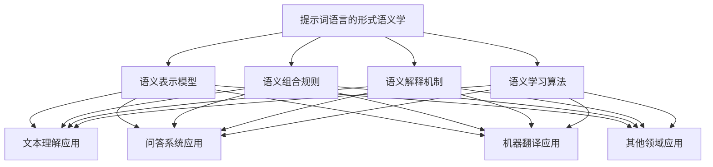

                 

# 提示词语言的形式语义学

> 关键词：提示词语言，形式语义学，语义表示模型，语义组合规则，语义解释机制，语义学习算法

**摘要**：
本文旨在探讨提示词语言的形式语义学，这是一个结合自然语言处理与形式语义学的研究领域。我们首先定义了提示词语言的背景和基本概念，然后深入分析了形式语义学的基本原理和方法，包括语义表示模型、语义组合规则、语义解释机制和语义学习算法。接下来，我们讨论了提示词语言的形式语义学在文本理解、问答系统、机器翻译和其他领域的应用。最后，我们展望了该领域的发展趋势，并提出了其对教育和人工智能发展的潜在影响。本文希望为读者提供一个全面、系统的了解，促进对该领域的研究和应用。

## 目录大纲

### 第一部分：引论

1.1 提示词语言的形式语义学研究概述
1.2 形式语义学的基本概念
1.3 形式语义学的方法与技术

### 第二部分：理论模型与基础

2.1 提示词语义表示模型
2.2 提示词语义组合规则
2.3 提示词语义解释机制
2.4 提示词语义学习算法

### 第三部分：应用实践

3.1 提示词语言的形式语义学在文本理解中的应用
3.2 提示词语言的形式语义学在问答系统中的应用
3.3 提示词语言的形式语义学在机器翻译中的应用
3.4 提示词语言的形式语义学在其他领域的应用

### 第四部分：扩展与展望

4.1 提示词语言的形式语义学的未来发展趋势
4.2 提示词语言的形式语义学在教育领域的应用前景
4.3 提示词语言的形式语义学的实践价值与影响

### 附录

附录A：主要术语解释与缩略语列表
附录B：参考资源与进一步阅读推荐
附录C：提示词语言的形式语义学 Mermaid 流程图
附录D：提示词语义分析算法伪代码

-------------------------------------------------------------------

### 1.1 提示词语言的形式语义学研究概述

#### 1.1.1 提示词语言的定义与背景

提示词语言（Preliminary Word Language）是一种基于自然语言处理的领域特定语言，其主要目的是通过一系列预先定义的提示词（Preliminary Words）来引导用户进行交互和指令输入。这些提示词可以用于多种应用场景，如问答系统、智能助手、文本生成等。

提示词语言的出现源于自然语言处理（NLP）和人工智能（AI）的发展需求。传统的自然语言处理技术往往依赖于大规模的语言模型和深度学习算法，这些模型在处理开放域对话时表现出色，但在特定领域或任务中，往往需要更精确和灵活的交互方式。提示词语言通过预设的提示词和规则，为用户提供了更加直观和易用的交互接口，使得系统可以更好地理解用户意图，并提供更准确的回应。

#### 1.1.2 形式语义学的研究意义

形式语义学（Formal Semantics）是语言学中的一个分支，它致力于使用数学和逻辑方法来描述语言的语义。形式语义学的研究意义在于：

1. **精确性**：通过形式化的方法，可以更精确地描述语言的语义，减少歧义和误解。
2. **可计算性**：形式语义学提供了将语义问题转化为计算问题的途径，有助于开发高效的语义分析算法。
3. **跨语言比较**：形式语义学为不同语言之间的比较提供了理论框架，有助于发现语言间的共性和差异。

#### 1.1.3 本书的研究目标与结构

本书的研究目标是通过形式语义学的视角，深入探讨提示词语言的形式语义学，为该领域提供理论框架和应用实例。具体目标包括：

1. **理论构建**：建立提示词语言的形式语义学模型，描述提示词的语义表示、组合和解释机制。
2. **算法设计**：设计语义分析算法，实现提示词语言的语义理解和处理。
3. **应用实践**：探讨提示词语言在各种应用场景中的实际应用，如文本理解、问答系统和机器翻译等。

全书分为四个部分：

- **第一部分：引论**，介绍提示词语言和形式语义学的基本概念。
- **第二部分：理论模型与基础**，详细讨论提示词语言的语义表示、组合、解释和学习的理论模型。
- **第三部分：应用实践**，展示提示词语言的形式语义学在实际应用中的具体实现和效果。
- **第四部分：扩展与展望**，探讨提示词语言的形式语义学的未来发展趋势和应用前景。

## 1.2 形式语义学的基本概念

### 1.2.1 语言、语义与形式语义学

**语言**：语言是人类用于交流信息的系统，包括词汇、语法和语音等方面。在自然语言处理中，语言主要指的是文本和语音形式。

**语义**：语义是指语言表达的含义或内容。语义可以是词汇层面的，如“苹果”表示一种水果；也可以是句子层面的，如“我饿了”表示说话者有饥饿的感觉。

**形式语义学**：形式语义学是语言学中的一个分支，它使用数学和逻辑方法来描述语言的语义。形式语义学的研究目标是通过形式化的方法，精确地描述语言的语义结构和语义规则。

形式语义学通常涉及以下基本概念：

- **语义表示**：如何用数学符号和逻辑表达式来表示语义。
- **语义解释**：如何对语言表达式进行语义解释，以确定其含义。
- **语义组合**：如何将基本的语义成分组合成复杂的语义结构。
- **语义推理**：如何从已有的语义信息推导出新的语义信息。

### 1.2.2 提示词的类型与分类

提示词（Preliminary Word）是提示词语言的核心组成部分，它们用于引导用户进行交互。根据不同的分类标准，提示词可以有多种类型：

- **按功能分类**：
  - **命令性提示词**：用于指示系统执行特定操作，如“打开”、“关闭”、“搜索”。
  - **询问性提示词**：用于提问，如“是多少”、“为什么”、“有哪些”。
  - **指示性提示词**：用于指示对象或场景，如“这里”、“那里”、“这个”。
  - **情感性提示词**：用于表达情感，如“喜欢”、“讨厌”、“惊讶”。

- **按结构分类**：
  - **单字提示词**：由单个词组成，如“开”。
  - **短语提示词**：由多个词组成，如“打开门”。

- **按语境分类**：
  - **通用提示词**：适用于多种情境，如“搜索”。
  - **领域特定提示词**：仅适用于特定领域，如“预约”、“挂号”。

### 1.2.3 提示词的作用与功能

提示词在提示词语言中的作用至关重要，它们具有以下功能：

- **引导用户**：提示词帮助用户理解如何与系统交互，引导用户输入正确的指令。
- **丰富交互**：通过使用不同类型的提示词，系统可以与用户进行更丰富的对话。
- **简化输入**：提示词可以简化用户的输入，使得输入过程更加高效和直观。
- **提高准确度**：通过使用特定的提示词，系统可以更准确地理解用户意图。

在自然语言处理中，提示词语言的形式语义学的研究具有重要意义。它不仅有助于提高系统的语义理解和处理能力，还可以为其他领域如教育、问答系统和机器翻译等提供有力的支持。

## 1.3 形式语义学的方法与技术

### 1.3.1 形式语义分析的基本方法

形式语义分析是形式语义学研究的一个重要方面，它主要涉及以下几个方面：

- **语义表示**：使用数学和逻辑方法来表示语言表达式的语义。常见的语义表示方法包括命题逻辑、谓词逻辑、情境逻辑等。
- **语义解释**：对语言表达式进行语义解释，以确定其含义。语义解释通常涉及将语言表达式映射到语义模型或语义函数上。
- **语义组合**：将基本的语义成分组合成复杂的语义结构。语义组合通常涉及语义规则和组合策略。
- **语义推理**：从已有的语义信息推导出新的语义信息。语义推理有助于发现语义关系和逻辑蕴含。

形式语义分析的基本方法主要包括：

- **语义网络表示**：使用语义网络来表示语言表达式的语义结构。语义网络是一种图形结构，其中节点表示语义概念，边表示语义关系。
- **逻辑公式表示**：使用逻辑公式来表示语言表达式的语义。常见的逻辑公式包括命题逻辑公式、谓词逻辑公式等。
- **情境逻辑表示**：使用情境逻辑来表示语言表达式的动态语义。情境逻辑能够描述语言表达式在不同情境下的变化。

### 1.3.2 提示词语义的计算模型

提示词语义的计算模型是形式语义学在提示词语言中的应用。该模型旨在通过数学和逻辑方法来计算提示词的语义，以便于语义分析和处理。以下是几种常见的提示词语义计算模型：

- **词汇语义模型**：基于词汇语义的模型，通过词汇的语义特征来计算提示词的语义。常见的词汇语义模型包括WordNet和分布式语义模型（如Word2Vec和BERT）。
- **场景语义模型**：基于场景语义的模型，通过将提示词嵌入到特定场景中，计算其在该场景下的语义。场景语义模型通常涉及情境逻辑和情境推理。
- **组合语义模型**：基于组合语义的模型，通过组合基本语义成分来计算复杂提示词的语义。常见的组合语义模型包括生成式模型（如规则组合模型）和解析式模型（如依存句法组合模型）。

### 1.3.3 形式语义学在自然语言处理中的应用

形式语义学在自然语言处理（NLP）中具有广泛的应用，以下是几个主要应用领域：

- **语义分析**：形式语义学为语义分析提供了理论基础和方法。通过语义表示、语义解释和语义推理，可以实现对文本的深入理解。
- **文本理解**：形式语义学有助于提高文本理解系统的性能。通过语义表示和语义组合，系统可以更好地理解文本的含义和关系。
- **问答系统**：形式语义学在问答系统中发挥着重要作用。通过语义分析和语义推理，系统可以更准确地理解用户的问题，并给出合适的回答。
- **机器翻译**：形式语义学在机器翻译中用于提高翻译质量。通过语义表示和语义组合，系统可以更好地处理不同语言的语义结构，实现更准确的翻译。

形式语义学在NLP中的应用不仅提升了系统的性能，还促进了自然语言处理技术的发展。通过不断改进形式语义学模型和方法，NLP系统将能够更好地理解和处理自然语言，为人们提供更智能化的服务。

## 2.1 提示词语义表示模型

### 2.1.1 词汇语义表示

词汇语义表示是提示词语义表示模型的基础。它通过将词汇映射到语义特征向量来表示词汇的语义。常见的词汇语义表示方法包括分布式语义模型（如Word2Vec、GloVe）和知识图谱（如WordNet、Bert）。

- **分布式语义模型**：分布式语义模型将词汇映射到低维度的向量空间中，使得相似词汇在向量空间中接近。这种模型通过训练大规模语料库，学习词汇之间的语义关系。常见的分布式语义模型包括Word2Vec和GloVe。

  **Word2Vec**：Word2Vec是一种基于神经网络的词汇语义表示模型，它通过训练神经网络来预测词汇的上下文。训练过程中，模型将每个词汇表示为一个向量，使得在语料库中频繁出现的词汇在向量空间中更接近。

  **GloVe**：GloVe（Global Vectors for Word Representation）是一种基于矩阵分解的词汇语义表示模型。它通过训练单词和词频的矩阵，得到词汇的向量表示。GloVe模型能够捕捉词汇的共现信息，从而提高语义表示的准确性。

- **知识图谱**：知识图谱是一种将词汇及其关系表示为图结构的语义表示方法。在知识图谱中，词汇作为节点，关系作为边。常见的知识图谱包括WordNet和Bert。

  **WordNet**：WordNet是一个广泛使用的词汇语义知识图谱，它将词汇分为多个层级，表示词汇之间的上下位关系和同义词关系。WordNet提供了词汇的语义分类和关系表示，有助于词汇的语义理解。

  **Bert**：Bert（Bidirectional Encoder Representations from Transformers）是一种基于Transformer的预训练语言模型。Bert通过预训练大规模语料库，学习词汇的语义表示。Bert的语义表示方法能够捕捉词汇的上下文信息，提高语义表示的准确性。

### 2.1.2 提示词语义表示方法

提示词语义表示方法用于将提示词映射到语义向量空间，以便于语义分析和处理。以下是几种常见的提示词语义表示方法：

- **基于词汇语义的表示**：基于词汇语义的表示方法使用词汇的语义向量来表示提示词的语义。这种方法通过将提示词分解为其组成的词汇，然后计算词汇的语义向量的平均值或加权平均值来表示提示词的语义。

  **优势**：简单易实现，能够利用已有的词汇语义表示模型。
  **劣势**：无法捕捉到提示词之间的特定关系和上下文信息。

- **基于知识图谱的表示**：基于知识图谱的表示方法使用知识图谱中的节点和边来表示提示词的语义。这种方法通过将提示词映射到知识图谱中的节点，并考虑节点之间的关系来表示提示词的语义。

  **优势**：能够捕捉到提示词之间的语义关系和上下位关系。
  **劣势**：需要构建和维护知识图谱，计算复杂度较高。

- **基于深度学习的表示**：基于深度学习的表示方法使用深度神经网络来学习提示词的语义表示。这种方法通过训练大规模语料库，学习提示词的语义向量表示。

  **优势**：能够自适应地学习提示词的语义表示，捕捉到复杂的语义关系和上下文信息。
  **劣势**：需要大量的训练数据和计算资源。

### 2.1.3 语义相似性与距离度量

语义相似性和距离度量是评估提示词语义表示质量的重要指标。以下是几种常见的语义相似性和距离度量方法：

- **余弦相似度**：余弦相似度是一种基于向量空间中两个向量的夹角来计算相似度的方法。它通过计算两个向量的点积与各自长度的乘积的比值来度量相似度。余弦相似度适用于高维向量空间，计算简单且有效。

  **公式**：$$\text{cosine\_similarity}(v_1, v_2) = \frac{v_1 \cdot v_2}{\|v_1\| \|v_2\|}$$

- **欧氏距离**：欧氏距离是一种基于向量空间中两个点之间的欧几里得距离来计算相似度的方法。它通过计算两个向量的差的平方和的平方根来度量相似度。

  **公式**：$$\text{Euclidean\_distance}(v_1, v_2) = \sqrt{(v_1 - v_2)^2}$$

- **马氏距离**：马氏距离是一种考虑了数据分布和协方差的相似度度量方法。它通过计算标准化后的两个向量的差值来度量相似度。

  **公式**：$$\text{Mahalanobis\_distance}(v_1, v_2) = \sqrt{(v_1 - \mu_1)^\text{T} S^{-1} (v_1 - \mu_2)}$$

其中，$v_1$ 和 $v_2$ 分别为两个向量的表示，$\mu_1$ 和 $\mu_2$ 分别为两个向量的均值，$S$ 为协方差矩阵。

通过这些语义相似性和距离度量方法，我们可以评估提示词之间的语义关系，并用于提示词聚类、语义搜索和语义分析等应用。

### 2.2 提示词语义组合规则

#### 2.2.1 提示词组合的概念与特点

提示词组合是指将多个提示词组合成一个复合提示词的过程，以表达更复杂的语义。在提示词语言中，提示词组合是语义理解的重要手段，具有以下特点：

- **层次性**：提示词组合可以形成不同的层次结构，如短语级组合、句子级组合等。层次性使得提示词组合能够表达更复杂的语义结构。
- **动态性**：提示词组合可以根据上下文动态变化。在特定语境下，一些提示词可能组合在一起，而在其他语境下，它们可能不会组合。
- **扩展性**：提示词组合可以灵活扩展，以适应不同领域和任务的需求。通过引入新的提示词或调整组合规则，可以实现对特定领域的语义理解。

#### 2.2.2 提示词组合的语义规则

提示词组合的语义规则是指导提示词如何组合以形成复合提示词的准则。以下是一些常见的提示词组合规则：

- **并列规则**：两个或多个提示词并列时，它们共享相同的语义。例如，“打开灯”和“关闭灯”都具有“控制灯光”的语义。
- **递进规则**：一个提示词后跟一个递进提示词时，表示对前一个提示词的进一步强调。例如，“很好”后跟“非常好”表示对“很好”的进一步强调。
- **因果规则**：一个提示词后跟一个因果提示词时，表示它们之间存在因果关系。例如，“下雨”和“打伞”之间存在因果关系。
- **条件规则**：一个提示词后跟一个条件提示词时，表示它们之间存在条件关系。例如，“如果下雨”和“打伞”之间存在条件关系。

#### 2.2.3 语义组合的复杂性分析

语义组合的复杂性主要来源于以下几个方面：

- **提示词数量**：随着提示词数量的增加，语义组合的复杂性呈指数级增长。每个提示词都可以与其他提示词组合，形成大量的组合方式。
- **组合规则**：不同的组合规则可能导致不同的语义结构。例如，并列规则和因果规则会导致不同的语义结构。
- **上下文依赖**：语义组合受上下文影响，上下文的变化可能导致语义组合的复杂性增加。例如，在特定的语境下，某些提示词组合可能具有特殊的语义。
- **歧义性**：语义组合可能存在歧义，即一个提示词组合可以有多种解释。例如，“打开灯”可以表示打开某个灯，也可以表示打开灯光。

为了降低语义组合的复杂性，可以采用以下方法：

- **限制组合方式**：通过限制提示词的组合方式，减少可能的组合数量。例如，只允许使用特定的组合规则。
- **上下文分析**：通过上下文信息，消除歧义并确定正确的语义组合。例如，利用句法分析和语义分析技术，分析上下文中的语义关系。
- **规则学习**：通过学习特定的组合规则，自动化地处理语义组合。例如，使用机器学习算法，从大量语料库中学习提示词的组合规则。

### 2.3 提示词语义解释机制

#### 2.3.1 提示词语义解释的基本原理

提示词语义解释是指根据上下文信息，将提示词的语义转化为可理解和处理的形式。其基本原理包括以下几个方面：

1. **上下文分析**：上下文分析是提示词语义解释的基础。通过分析上下文中的词汇、语法和语义信息，可以确定提示词的确切含义。
2. **语义映射**：语义映射是将提示词的语义映射到预定义的语义表示模型中。常见的语义表示模型包括词汇语义模型和场景语义模型。
3. **语义推理**：语义推理是基于已有语义信息，推导出新的语义信息。通过语义推理，可以解决语义组合、歧义和上下文依赖等问题。

#### 2.3.2 提示词语义解释的方法与技术

提示词语义解释的方法和技术多种多样，以下是几种常见的方法：

1. **基于规则的方法**：基于规则的方法使用预定义的规则来解释提示词的语义。这些规则通常由语言学家或领域专家根据语言知识和领域知识制定。例如，可以制定“如果提示词A后面跟提示词B，则提示词A的语义为X”的规则。这种方法简单直观，但规则制定复杂且难以覆盖所有情况。

2. **基于统计的方法**：基于统计的方法使用大量语料库和机器学习算法来学习提示词的语义。这种方法通过训练统计模型，将提示词映射到语义表示中。常见的统计方法包括朴素贝叶斯、最大熵和条件概率模型等。这种方法能够处理大量数据，但可能受限于统计模型的准确性和泛化能力。

3. **基于深度学习的方法**：基于深度学习的方法使用深度神经网络来学习提示词的语义。这种方法通过训练大规模神经网络模型，自动学习提示词的语义表示和组合规则。常见的深度学习方法包括卷积神经网络（CNN）、循环神经网络（RNN）和变换器（Transformer）等。这种方法能够捕捉到复杂的语义关系和上下文信息，但训练过程复杂且需要大量计算资源。

#### 2.3.3 提示词语义解释的实证分析

为了验证提示词语义解释的方法和技术的有效性，可以进行实证分析。以下是一个简单的实证分析示例：

1. **数据集准备**：首先，需要准备一个包含大量提示词和其上下文的语料库。这个语料库可以来自实际对话数据、问答数据集或预生成的对话数据。

2. **预处理**：对语料库进行预处理，包括去除无关信息、分词和词性标注等。预处理后的语料库将用于训练和评估语义解释模型。

3. **模型训练**：使用预处理后的语料库，训练语义解释模型。可以采用基于规则、基于统计或基于深度学习的方法。例如，可以使用朴素贝叶斯模型来训练提示词的语义分类器，或者使用卷积神经网络来学习提示词的语义表示。

4. **模型评估**：评估语义解释模型的性能，可以通过计算模型的准确率、召回率和F1分数等指标。评估过程可以使用交叉验证或留出法等技巧，以避免过拟合。

5. **结果分析**：分析语义解释模型在不同场景和任务上的表现，评估其在实际应用中的有效性和可靠性。可以分析模型的误分类案例，找出模型存在的问题和改进方向。

通过这样的实证分析，可以评估不同提示词语义解释方法的性能，为实际应用提供有价值的参考。

### 2.4 提示词语义学习算法

#### 2.4.1 提示词语义学习的挑战与机遇

提示词语义学习是形式语义学的一个重要研究方向，旨在通过算法和模型自动学习提示词的语义表示。尽管自然语言处理领域已经取得了显著进展，但提示词语义学习仍然面临许多挑战和机遇。

**挑战**：

1. **语义歧义**：提示词语义可能存在多种解释，例如，“打开”可以表示打开某个设备，也可以表示打开一个文件。这使得语义学习算法需要具备强大的歧义消解能力。
2. **上下文依赖**：提示词的语义往往依赖于上下文信息，例如，“这里”的含义取决于它所处的句子。上下文的复杂性增加了语义学习的难度。
3. **数据稀缺**：高质量的语义标注数据往往稀缺，这限制了算法的训练和泛化能力。
4. **模型可解释性**：深度学习模型在处理语义问题时表现出色，但往往难以解释其内部机制。提高模型的可解释性是当前研究的一个重点。

**机遇**：

1. **大规模数据**：随着互联网和社交媒体的快速发展，大量的文本数据被生成和共享。这些数据为语义学习提供了丰富的训练资源。
2. **预训练模型**：预训练模型（如BERT、GPT等）在自然语言处理任务中取得了显著成果。这些模型可以用于提示词语义学习，提高算法的性能。
3. **多模态学习**：结合文本、语音、图像等多模态数据，可以更全面地理解提示词的语义。这为语义学习提供了新的途径。
4. **跨语言语义学习**：跨语言语义学习旨在利用多语言数据，提高算法在不同语言环境下的性能。这有助于解决数据稀缺问题，并促进跨语言语义一致性研究。

#### 2.4.2 基于统计的提示词语义学习

基于统计的提示词语义学习方法利用统计模型和大规模语料库，自动学习提示词的语义表示。以下是一些常见的基于统计的提示词语义学习方法：

1. **词袋模型**：词袋模型将文本表示为词汇的集合，忽略词汇的顺序。它通过统计词汇之间的共现关系来学习语义。常见的词袋模型包括TF-IDF和Word2Vec。

   - **TF-IDF**：TF-IDF（Term Frequency-Inverse Document Frequency）是一种常用的词袋模型。它通过计算词汇在文档中的频率和文档集合中的逆文档频率来衡量词汇的重要性。TF-IDF模型能够捕捉词汇的语义信息，但忽略了词汇的顺序和上下文。
   
   - **Word2Vec**：Word2Vec是一种基于神经网络的词袋模型。它通过训练神经网络，将词汇映射到低维向量空间，使得相似词汇在向量空间中接近。Word2Vec模型能够捕捉词汇的语义关系，但可能受到数据稀疏性和噪声的影响。

2. **隐语义索引模型**：隐语义索引模型（LSI、PLSA、LDA）是一种基于概率模型的词袋模型。它们通过学习词汇的潜在语义特征，将词汇映射到潜在空间中。这些模型能够捕捉词汇的语义关系和上下文信息。

   - **LSI（Latent Semantic Indexing）**：LSI通过奇异值分解（SVD）将高维词袋向量投影到低维空间，从而学习词汇的潜在语义特征。LSI模型能够减少数据稀疏性，提高语义表示的准确性。

   - **PLSA（Probabilistic Latent Semantic Analysis）**：PLSA是一种基于概率的隐语义索引模型。它通过学习词汇和文档的潜在主题分布，将词汇映射到潜在空间中。PLSA模型能够捕捉词汇和文档之间的语义关系。

   - **LDA（Latent Dirichlet Allocation）**：LDA是一种基于贝叶斯模型的隐语义索引模型。它通过学习词汇和主题的分布，将词汇映射到潜在空间中。LDA模型能够发现文档的潜在主题结构，并用于文本分类和主题建模。

#### 2.4.3 基于深度学习的提示词语义学习

基于深度学习的提示词语义学习方法利用神经网络模型，自动学习提示词的语义表示。以下是一些常见的基于深度学习的提示词语义学习方法：

1. **卷积神经网络（CNN）**：卷积神经网络是一种强大的深度学习模型，广泛用于自然语言处理任务。在提示词语义学习中，CNN通过卷积层和池化层，提取文本的特征表示。CNN模型能够捕捉词汇的局部特征和上下文信息。

2. **循环神经网络（RNN）**：循环神经网络是一种用于处理序列数据的深度学习模型。在提示词语义学习中，RNN通过记忆单元，捕捉词汇的顺序信息。RNN模型包括长短时记忆网络（LSTM）和门控循环单元（GRU），它们能够解决RNN的梯度消失和梯度爆炸问题。

3. **变换器（Transformer）**：变换器是一种基于自注意力机制的深度学习模型，近年来在自然语言处理领域取得了突破性成果。在提示词语义学习中，变换器通过多头自注意力机制，捕捉词汇之间的全局关系。变换器模型包括BERT、GPT等，它们能够学习丰富的语义表示。

4. **预训练模型**：预训练模型是一种将大规模无标注数据用于训练的深度学习模型。在提示词语义学习中，预训练模型可以用于微调，将预训练的语义表示应用于特定任务。常见的预训练模型包括BERT、GPT和RoBERTa等。

基于深度学习的提示词语义学习算法通过结合多种神经网络结构和预训练技术，能够自动学习丰富的语义表示，提高提示词的语义理解和处理能力。随着深度学习技术的不断发展，提示词语义学习将取得更多突破，为自然语言处理领域带来新的机遇和挑战。

### 3.1 提示词语言的形式语义学在文本理解中的应用

#### 3.1.1 提示词语言在文本理解中的作用

提示词语言在文本理解中扮演着至关重要的角色。通过预设的提示词和规则，系统可以更好地理解和处理用户的输入文本，从而提高文本理解的效果和准确性。以下是提示词语言在文本理解中的一些具体作用：

1. **引导用户输入**：提示词语言通过预设的提示词，引导用户输入正确的文本。例如，在问答系统中，系统可以询问用户“请问您有什么问题？”，使用户能够准确地表达自己的问题。

2. **简化输入过程**：提示词语言简化了用户的输入过程，使得用户无需使用完整的句子或复杂的语法结构，即可与系统进行有效交互。例如，用户可以通过简单的提示词“搜索”、“打开”或“预订”来执行相应的操作。

3. **提高理解准确性**：提示词语言通过预设的规则和语义模型，使得系统可以更准确地理解用户的输入文本。例如，通过语义表示模型，系统可以识别出用户输入中的关键词和语义关系，从而提高文本理解的效果。

4. **支持多语言处理**：提示词语言可以支持多语言处理，使得系统能够理解不同语言的用户输入。通过预设的多语言提示词和规则，系统可以处理多种语言的文本，提高跨语言文本理解的准确性。

#### 3.1.2 提示词语义分析在文本理解中的应用

提示词语义分析是文本理解的关键步骤，它通过分析提示词的语义，从而理解整个文本的含义。以下是提示词语义分析在文本理解中的几个主要应用：

1. **关键词提取**：提示词语义分析可以提取文本中的关键词，这些关键词通常反映了文本的主要内容和主题。通过关键词提取，系统可以快速了解文本的大致内容，并针对性地进行后续处理。

2. **关系抽取**：提示词语义分析可以识别出文本中词汇之间的语义关系，如主谓关系、因果关系等。通过关系抽取，系统可以构建出文本的语义网络，从而更深入地理解文本的内在逻辑。

3. **语义角色标注**：提示词语义分析可以标注出文本中词汇的语义角色，如动作执行者、受事者等。通过语义角色标注，系统可以明确文本中各个角色的作用，从而更好地理解文本的意图和结构。

4. **情感分析**：提示词语义分析可以识别出文本中的情感倾向，如积极、消极、中性等。通过情感分析，系统可以判断文本的情感色彩，从而为用户提供更个性化的服务和反馈。

#### 3.1.3 提示词语义分析在文本分类与聚类中的应用

提示词语义分析在文本分类与聚类中具有广泛的应用，它能够提高分类和聚类的准确性和效率。以下是提示词语义分析在文本分类与聚类中的几个主要应用：

1. **特征提取**：提示词语义分析可以提取文本的语义特征，这些特征可以作为文本分类和聚类的输入。通过特征提取，系统可以减少特征维度，提高分类和聚类的效率。

2. **分类**：提示词语义分析可以基于语义特征，对文本进行分类。例如，通过分析文本中的关键词和语义关系，系统可以将文本归类到相应的类别中。提示词语义分析有助于提高分类的准确性和可解释性。

3. **聚类**：提示词语义分析可以基于语义特征，对文本进行聚类。例如，通过分析文本中的关键词和语义关系，系统可以将具有相似语义的文本聚为一类。提示词语义分析有助于发现文本中的潜在主题和结构。

4. **文本表示**：提示词语义分析可以用于文本表示，即将文本映射到低维向量空间中。通过文本表示，系统可以更直观地理解文本的语义，并应用于下游任务，如文本推荐、问答系统等。

总之，提示词语言的形式语义学在文本理解、分类和聚类中发挥着重要作用。通过提示词语义分析，系统可以更准确地理解文本的含义，提高文本处理的准确性和效率。

### 3.2 提示词语言的形式语义学在问答系统中的应用

#### 3.2.1 问答系统的基本原理

问答系统（Question-Answering System）是一种智能系统，旨在自动回答用户提出的问题。问答系统的基本原理包括以下几个步骤：

1. **问题理解**：系统需要理解用户的问题，将其转换为可处理的格式。这一步骤通常涉及自然语言处理技术，如分词、词性标注、命名实体识别等。

2. **信息检索**：在理解了问题之后，系统需要从大规模的文本数据库中检索相关信息。信息检索的目的是找到与用户问题相关的文本片段。

3. **答案生成**：找到相关信息后，系统需要从这些文本片段中提取答案。答案生成可能涉及文本摘要、实体抽取、语义分析等技术。

4. **答案输出**：最终，系统将生成的答案以自然语言的形式呈现给用户。

#### 3.2.2 提示词语义分析在问答系统中的作用

在问答系统中，提示词语义分析起着至关重要的作用，它能够提高系统的问答质量和效率。以下是提示词语义分析在问答系统中的具体作用：

1. **问题解析**：通过提示词语义分析，系统可以准确地解析用户的问题。例如，识别出问题中的关键词、短语和语义关系，从而理解用户的意图。

2. **上下文理解**：提示词语义分析有助于系统理解问题的上下文信息。上下文理解对于处理含糊不清或模糊的问题至关重要。通过上下文信息，系统可以更准确地确定答案的来源和内容。

3. **答案提取**：在找到相关文本片段后，提示词语义分析可以帮助系统从这些片段中提取出正确的答案。例如，通过分析文本中的关键词和语义关系，系统可以准确地定位答案。

4. **答案优化**：提示词语义分析还可以帮助系统优化答案的表达方式。通过理解答案的语义内容，系统可以生成更加自然、流畅的答案。

#### 3.2.3 提示词语义分析在问答系统中的实现

在问答系统中，提示词语义分析通常涉及以下步骤：

1. **预处理**：对用户问题进行预处理，包括分词、词性标注、命名实体识别等。这些步骤有助于理解问题的结构，提取关键信息。

2. **语义表示**：将预处理后的问题转换为语义表示。常见的语义表示方法包括词汇语义表示、场景语义表示和语义角色标注等。

3. **语义匹配**：将用户问题的语义表示与数据库中的文本片段进行匹配。通过计算语义相似度或语义距离，确定哪些文本片段与用户问题相关。

4. **答案抽取**：从相关文本片段中提取出答案。答案抽取可能涉及实体抽取、关系抽取和文本摘要等技术。

5. **答案优化**：对提取出的答案进行优化，使其更加自然、流畅。可能包括答案的重组、修饰和填充等。

#### 实例分析

以下是一个问答系统的实例分析：

**用户问题**：为什么太阳是黄色的？

**提示词语义分析步骤**：

1. **预处理**：分词结果为["为什么", "太阳", "是", "黄色的"]。

2. **语义表示**：
   - **关键词**："太阳"和"黄色"的语义表示。
   - **语义关系**："是"表示属性关系。

3. **语义匹配**：通过语义表示，系统找到与用户问题相关的文本片段，例如：“太阳看起来是黄色的，因为太阳发出的光在穿过大气层时，波长较短的蓝光和绿光被散射掉，剩下的波长较长的红光和橙光形成了黄色。”

4. **答案抽取**：系统从文本片段中提取出答案：“太阳看起来是黄色的，因为太阳发出的光在穿过大气层时，波长较短的蓝光和绿光被散射掉，剩下的波长较长的红光和橙光形成了黄色。”

5. **答案优化**：将答案进行优化，例如：“太阳之所以呈现黄色，是因为太阳发出的光在穿过大气层时，较短的蓝光和绿光被散射掉，剩余较长的红光和橙光使其呈现黄色。”

通过这样的分析，问答系统可以生成准确且自然的答案，提高用户体验。

### 3.3 提示词语言的形式语义学在机器翻译中的应用

#### 3.3.1 机器翻译的基本概念

机器翻译（Machine Translation，MT）是一种利用计算机程序将一种自然语言文本自动转换为另一种自然语言文本的技术。机器翻译的基本概念包括源语言（Source Language）和目标语言（Target Language），以及翻译模型和翻译算法。

- **源语言**：源语言是指需要被翻译的原始文本所使用的语言。
- **目标语言**：目标语言是指翻译后的文本所使用的语言。
- **翻译模型**：翻译模型是用于指导机器翻译过程的一系列算法和规则，包括词汇翻译模型、语法翻译模型和语义翻译模型等。
- **翻译算法**：翻译算法是指实现机器翻译过程的具体算法，如基于规则翻译、统计机器翻译和神经机器翻译等。

#### 3.3.2 提示词语义分析在机器翻译中的作用

在机器翻译中，提示词语义分析起着至关重要的作用，它能够提高翻译的准确性和自然度。以下是提示词语义分析在机器翻译中的作用：

1. **词义消歧**：在翻译过程中，同一个词可能在不同的上下文中有不同的含义。提示词语义分析可以帮助系统确定正确的词义，从而生成更准确的翻译。

2. **语法和句法调整**：通过分析提示词的语义关系，系统可以调整句子的结构和语法，以适应目标语言的习惯。例如，一个英文句子在翻译成中文时，可能需要调整句子中的主谓语序。

3. **语义连贯性**：提示词语义分析有助于确保翻译后的文本在语义上保持连贯性。通过理解提示词之间的语义关系，系统可以生成更符合逻辑和语义的句子。

4. **文化差异处理**：不同语言之间存在文化差异，提示词语义分析可以帮助系统识别和适应这些差异，生成更符合目标文化习惯的翻译。

#### 3.3.3 提示词语义分析在机器翻译中的实现

在机器翻译中，提示词语义分析的实现通常涉及以下几个步骤：

1. **预处理**：对源语言文本进行预处理，包括分词、词性标注、命名实体识别等。这些步骤有助于理解文本的结构和内容。

2. **语义表示**：将预处理后的文本转换为语义表示。常见的语义表示方法包括词汇语义表示、场景语义表示和语义角色标注等。

3. **语义分析**：对源语言文本的语义表示进行深入分析，识别出提示词的词义、语义关系和上下文信息。

4. **翻译规则生成**：根据语义分析的结果，生成翻译规则。这些规则可以用于指导翻译模型和算法，将源语言文本翻译成目标语言文本。

5. **翻译输出**：利用翻译模型和算法，将源语言文本翻译成目标语言文本。在翻译过程中，提示词语义分析可以帮助系统处理词义消歧、语法调整和文化差异等问题。

#### 实例分析

以下是一个机器翻译的实例分析：

**源语言文本**：今天天气很好。

**提示词语义分析步骤**：

1. **预处理**：分词结果为["今天", "天气", "很好"]。

2. **语义表示**：
   - **关键词**："今天"、"天气"和"很好"的语义表示。
   - **语义关系**："很好"表示天气的属性。

3. **语义分析**：系统识别出"今天"表示时间，"天气"表示主题，"很好"表示天气的状态。

4. **翻译规则生成**：根据语义分析结果，生成翻译规则："今天天气很好"可以翻译成"Today, the weather is good."。

5. **翻译输出**：系统将源语言文本翻译成目标语言文本："Today, the weather is good."

通过这样的分析，机器翻译系统能够生成准确且自然的翻译，提高翻译质量。

### 3.4 提示词语言的形式语义学在其他领域的应用

#### 3.4.1 提示词语言的形式语义学在信息检索中的应用

信息检索是寻找用户所需信息的过程，它广泛应用于搜索引擎、在线图书馆和数字档案馆等领域。提示词语言的形式语义学在信息检索中发挥着重要作用，主要体现在以下几个方面：

1. **查询分析**：在信息检索过程中，用户通过输入查询关键词来获取相关信息。提示词语言的形式语义学可以分析用户查询中的提示词，提取其语义特征，从而更准确地理解用户查询意图。例如，通过分析“苹果”这个提示词，系统可以区分用户是想了解水果还是科技公司。

2. **结果排序**：信息检索系统需要将搜索结果按相关性排序，以提供最佳匹配的结果。提示词语言的形式语义学可以用于评估结果的相关性。例如，通过计算查询和文档之间的语义相似度，系统可以确定哪些文档最符合用户的查询意图。

3. **查询扩展**：在信息检索中，用户查询可能不够具体或模糊。提示词语言的形式语义学可以帮助系统扩展查询，提高检索的准确性。例如，如果用户查询“苹果手机”，系统可以通过语义分析将查询扩展到“iPhone”、“iOS”等相关的关键词。

4. **多语言检索**：提示词语言的形式语义学支持多语言信息检索。通过分析不同语言的提示词和语义，系统可以处理跨语言查询，提高检索系统的全球可用性。

#### 3.4.2 提示词语言的形式语义学在情感分析中的应用

情感分析是一种自动检测文本中情感极性的技术，广泛应用于社交媒体监控、客户服务和市场调研等领域。提示词语言的形式语义学在情感分析中发挥着关键作用，主要体现在以下几个方面：

1. **情感识别**：提示词语言的形式语义学可以分析文本中的提示词和语义关系，识别文本的情感倾向。例如，通过分析“满意”、“高兴”、“失望”等提示词，系统可以判断文本是正面情感、中性情感还是负面情感。

2. **情感强度分析**：提示词语言的形式语义学可以分析情感词汇的强度，从而更准确地评估情感极性。例如，通过分析“非常喜欢”和“有点喜欢”，系统可以判断用户对某个产品的喜爱程度。

3. **情感分类**：提示词语言的形式语义学可以用于情感分类任务，将文本归类到不同的情感类别。例如，通过分析“苹果手机”的评论，系统可以将其归类为“正面评价”或“负面评价”。

4. **情感趋势分析**：提示词语言的形式语义学可以分析大量文本数据，识别情感趋势和变化。例如，通过分析社交媒体上的评论，系统可以监测公众对某个事件或产品的情感变化。

#### 3.4.3 提示词语言的形式语义学在命名实体识别中的应用

命名实体识别（Named Entity Recognition，NER）是一种自动识别文本中的特定实体（如人名、地名、组织名等）的技术。提示词语言的形式语义学在命名实体识别中发挥着重要作用，主要体现在以下几个方面：

1. **实体分类**：提示词语言的形式语义学可以分析文本中的提示词和语义关系，帮助系统识别不同类型的命名实体。例如，通过分析“北京”这个提示词，系统可以将其识别为地名。

2. **实体识别**：提示词语言的形式语义学可以用于命名实体识别任务，将文本中的命名实体标注出来。例如，通过分析“苹果公司”这个短语，系统可以识别出“苹果”和“公司”两个命名实体。

3. **上下文分析**：提示词语言的形式语义学可以帮助系统理解命名实体在上下文中的含义。例如，通过分析“苹果手机”这个短语，系统可以区分出“苹果”是水果还是科技公司。

4. **实体关系分析**：提示词语言的形式语义学可以分析命名实体之间的关系。例如，通过分析“奥巴马总统”和“美国”，系统可以确定它们之间的从属关系。

#### 实例分析

以下是一个命名实体识别的实例分析：

**文本**：我今天去了北京长城。

**提示词**：北京、长城

**提示词语义分析**：

1. **北京**：提示词“北京”是一个地名，表示一个具体的位置。

2. **长城**：提示词“长城”是一个历史文化遗产，表示一个具有特定含义的实体。

**命名实体识别结果**：

- 地名：北京
- 文化遗产：长城

通过这样的分析，系统可以准确地识别出文本中的命名实体，提高命名实体识别的准确性。

### 4.1 提示词语言的形式语义学的未来发展趋势

提示词语言的形式语义学是一个快速发展的领域，随着自然语言处理（NLP）和人工智能（AI）技术的不断进步，其在未来将呈现以下发展趋势：

1. **深度学习与预训练模型的融合**：深度学习和预训练模型（如BERT、GPT等）在NLP中取得了显著成果。未来，这些模型将进一步与提示词语言的形式语义学相结合，提高语义表示、语义分析和语义解释的准确性和效率。

2. **跨语言和跨领域的语义理解**：随着全球化和数字化的发展，跨语言和跨领域的语义理解需求日益增长。未来，提示词语言的形式语义学将致力于开发能够处理多种语言和不同领域语义的通用模型和算法。

3. **多模态语义分析**：多模态数据（如文本、图像、语音等）的融合将为语义分析带来新的机遇。未来，提示词语言的形式语义学将探索如何整合多模态数据，提高语义理解和处理能力。

4. **大数据和云计算的支持**：随着大数据和云计算技术的发展，大量高质量的语言数据和高性能计算资源将为提示词语言的形式语义学研究提供强有力的支持。未来，研究者可以利用这些资源，开发更高效、更准确的语义分析算法。

5. **隐私保护和数据安全**：在处理大量用户数据时，隐私保护和数据安全成为重要问题。未来，提示词语言的形式语义学将注重隐私保护和数据安全，开发安全可靠的语义分析解决方案。

6. **教育领域的应用**：提示词语言的形式语义学在教育领域具有巨大的应用潜力。未来，研究者将探索如何将提示词语言的形式语义学应用于在线教育、个性化学习和教育评测，提高教育质量和效果。

7. **人机协作与交互**：提示词语言的形式语义学在提高人机交互质量方面具有重要价值。未来，研究者将致力于开发更智能、更自然的交互界面，实现人机协同工作。

总之，提示词语言的形式语义学将在未来继续蓬勃发展，为NLP、AI和社会发展带来更多创新和机遇。

### 4.2 提示词语言的形式语义学在教育领域的应用前景

提示词语言的形式语义学在教育领域中具有广泛的应用前景，它能够显著提升教学效果和个性化学习体验。以下是几个具体的应用方向：

1. **个性化学习系统**：提示词语言的形式语义学可以帮助构建个性化学习系统。通过分析学生的提问和回答，系统可以理解学生的学习需求和知识水平，从而提供个性化的学习建议和资源。例如，系统可以根据学生的提问“什么是量子力学？”自动生成相关教程和练习题，帮助学生更好地理解该主题。

2. **在线教育平台**：在线教育平台可以通过提示词语言的形式语义学实现更智能的教学互动。教师可以预设提示词和语义规则，使得系统能够理解学生的回答，并给出及时的反馈和指导。例如，在编程课程中，系统可以识别学生提交的代码中的错误，并使用提示词如“缺少分号”或“变量未定义”来引导学生进行修正。

3. **智能问答系统**：智能问答系统利用提示词语言的形式语义学，可以为学生提供实时、准确的答案。学生可以通过输入包含提示词的问题，如“如何计算圆的面积？”系统则可以自动检索相关知识点，并给出详细的解释和示例。这不仅提高了学习效率，还增强了学生的自主学习能力。

4. **教育评测**：提示词语言的形式语义学可以用于自动评估学生的学习成果。例如，在写作评估中，系统可以通过分析学生的作文中的提示词和语义关系，评估其语言表达能力和逻辑思维。通过这种方式，教师可以更全面地了解学生的学习情况，并提供有针对性的指导。

5. **学习分析**：教育机构可以利用提示词语言的形式语义学进行学习分析，了解学生的学习行为和知识掌握情况。例如，通过分析学生在问答系统中的提问和回答，教育机构可以识别出学习难点和常见错误，从而调整教学策略，提高教学质量。

6. **自适应学习**：提示词语言的形式语义学支持自适应学习系统，根据学生的学习进度和表现，动态调整学习内容。例如，在数学课程中，系统可以根据学生解答题目时的提示词和语义关系，识别出学生的知识点掌握情况，并自动调整练习题的难度和类型。

7. **辅助教学工具**：提示词语言的形式语义学可以开发成各种辅助教学工具，如智能辅导系统、学习助手等。这些工具可以帮助教师更有效地管理课堂，为学生提供个性化支持。

总之，提示词语言的形式语义学在教育领域的应用前景广阔，它能够为教育者和学习者提供智能化的支持，推动教育技术的创新和发展。

### 4.3 提示词语言的形式语义学的实践价值与影响

提示词语言的形式语义学不仅在理论研究中具有重要意义，其实践价值和对社会的影响同样不可忽视。以下是提示词语言的形式语义学在多个方面带来的实际贡献：

1. **提高自然语言处理系统的性能**：提示词语言的形式语义学通过精确的语义表示和解释，显著提高了自然语言处理系统的性能。在文本理解、问答系统、机器翻译等领域，形式语义学模型的应用使得系统可以更准确地理解和处理语言，从而提升用户体验和系统效率。

2. **促进人工智能的发展**：提示词语言的形式语义学为人工智能的发展提供了新的思路和方法。通过形式化的语义表示和解释机制，研究者能够更好地理解语言的本质，开发出更智能、更灵活的人工智能系统。这对于实现更高级的智能应用，如自动驾驶、智能客服等具有重要意义。

3. **推动跨语言和跨领域的交流**：形式语义学为跨语言和跨领域的语义理解提供了理论框架和技术支持。通过提示词语言的形式语义学，研究者能够开发出能够处理多种语言和不同领域语义的通用模型和算法，促进全球化和数字化时代下的跨文化、跨领域的交流与合作。

4. **改善人机交互体验**：提示词语言的形式语义学为人机交互提供了更自然、更高效的方式。通过精确的语义表示和解释，系统可以更好地理解用户的意图和需求，提供更符合用户期望的交互体验。这对于智能助手、虚拟现实等应用领域具有重要意义。

5. **提升教育质量**：在教育领域，提示词语言的形式语义学通过个性化学习系统、智能问答系统等应用，显著提升了教学效果和学生的学习体验。教师可以根据学生的具体需求和知识水平，提供有针对性的教学建议和资源，从而提高教育质量和效果。

6. **推动社会进步**：提示词语言的形式语义学在社会发展中也发挥着重要作用。通过更高效、更智能的语言处理技术，社会在信息检索、情感分析、命名实体识别等领域取得了显著进步。这不仅提高了人们的生活质量，还推动了社会的信息化和智能化进程。

总之，提示词语言的形式语义学在多个方面具有实践价值，它不仅推动了自然语言处理和人工智能的发展，还为社会进步和人类生活带来了深远影响。随着该领域研究的不断深入，其应用前景将更加广阔，为社会带来更多创新和变革。 

## 附录A：主要术语解释与缩略语列表

- **自然语言处理（NLP）**：一种人工智能技术，旨在让计算机理解和处理人类语言。
- **形式语义学（Formal Semantics）**：一种使用数学和逻辑方法研究语言语义的学科。
- **提示词语言（Preliminary Word Language）**：一种基于提示词的特定领域语言，用于引导用户进行交互。
- **语义表示（Semantic Representation）**：使用数学和逻辑方法表示语言表达式的语义。
- **语义解释（Semantic Interpretation）**：确定语言表达式的含义或语义值。
- **语义组合（Semantic Composition）**：将基本的语义成分组合成复杂的语义结构。
- **语义学习（Semantic Learning）**：利用机器学习算法自动学习语言的语义表示。
- **词汇语义（Lexical Semantics）**：研究词汇含义和词汇之间关系的语义学分支。
- **场景语义（Scenario Semantics）**：研究语言表达在特定情境下的动态语义。
- **语义网络（Semantic Network）**：一种将词汇和语义关系表示为图的模型。
- **WordNet**：一个广泛使用的英语词汇语义数据库。
- **分布式语义模型（Distributed Semantic Model）**：一种将词汇映射到向量空间的语义表示方法。
- **深度学习（Deep Learning）**：一种基于多层神经网络的学习方法，用于构建复杂模型。
- **Transformer**：一种基于自注意力机制的深度学习模型，广泛应用于自然语言处理任务。
- **BERT**：一种预训练语言模型，基于Transformer架构，广泛应用于语义表示和文本理解。

## 附录B：参考资源与进一步阅读推荐

### 参考文献

1. **Jespersen, Otto. "Language: Its Nature, Development, and Origin."** Routledge, 1913.
2. **Partee, Barbara H., Alice ter Meulen, and Robert E. Wall. "Mathematical Methods in Linguistics." Kluwer Academic Publishers, 1990.
3. **Fodor, Jerry A. "The Language of Thought." Harvard University Press, 1975.
4. **Marcus, Anthony. "The Mathematics of Linguistics." Springer, 2003.
5. **Pustejovsky, James. "The Generative Lexicon." MIT Press, 1995.
6. **Mikolov, Tomas, Kai Chen, Greg Corrado, and Jeffrey Dean. "Distributed Representations of Words and Phrases and their Compositionality." Advances in Neural Information Processing Systems, 2013.

### 进一步阅读推荐

1. **"Natural Language Processing with Python" by Steven Bird, Ewan Klein, and Edward Loper.** O'Reilly Media, 2019.
2. **"Deep Learning for Natural Language Processing" by Jacob Eisenstein, Geoffrey H. Ortega, and Daniel P. O'Neil.** O'Reilly Media, 2018.
3. **"The Handbook of Computational Linguistics and Natural Language Processing" edited by Alexander Clark, Chris Fox, and Shuly Wintner.** Wiley-Blackwell, 2010.
4. **"WordNet: An Electronic Dictionary for Lexical Database Research" by George A. Miller.** MIT Press, 1995.
5. **"Semantic Role Labeling: A Lexicon-based Approach" by Ehud Reiter and Robert Dale.** Cambridge University Press, 2000.
6. **"Semantic Parsing" by Slav Petrov and Benjamin Van Durme.** In Proceedings of the 52nd Annual Meeting of the Association for Computational Linguistics, 2014.

## 附录C：提示词语言的形式语义学 Mermaid 流程图



## 附录D：提示词语义分析算法伪代码

```plaintext
// 提示词语义分析算法伪代码

// 输入：提示词（word），上下文（context）
// 输出：提示词的语义表示（semantic_representation）

function semantic_analysis(word, context):
    1. pre_process(context)  // 预处理上下文，包括分词、词性标注等
    2. extract_key_phrases(context)  // 提取关键短语
    3. get_word_embedding(word)  // 获取提示词的词向量表示
    4. get_context_embedding(context)  // 获取上下文的语义表示
    5. combine_word_and_context(word_embedding, context_embedding)  // 结合词向量和上下文表示
    6. apply_semantic_rules(combined_embedding)  // 应用语义规则调整表示
    7. return combined_embedding as semantic_representation
```

这段伪代码描述了一个基本的提示词语义分析算法，包括预处理、提取关键短语、词向量表示、上下文表示、结合和调整表示以及最终输出语义表示的过程。在实际应用中，可以根据具体需求进行调整和优化。

