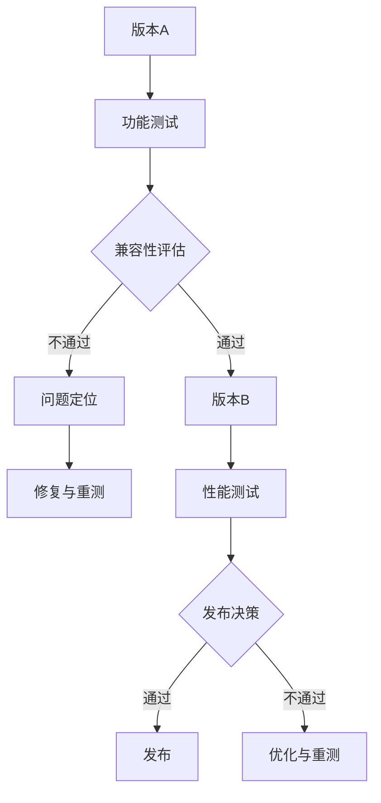

                 

### 《提示词语言的版本兼容性自动化测试》

---

# 关键词

- 版本兼容性
- 自动化测试
- 提示词语言
- 测试用例设计
- 测试流程图
- 算法实现
- 数学模型
- 项目实战
- 性能优化

---

# 摘要

本文将深入探讨提示词语言的版本兼容性自动化测试，详细解析其背景、核心概念、测试流程、算法原理，并通过数学模型和实际项目案例，展示其具体实现和效果。文章旨在为开发者提供一种系统化的自动化测试方法，以提高软件版本更新过程中的兼容性检测效率和稳定性。

---

## 引言

在软件工程领域，随着软件的持续迭代和更新，版本兼容性问题成为了一个普遍且复杂的问题。版本兼容性指的是软件在不同版本间运行时是否能够无缝过渡，不出现功能退化或错误。为了确保软件在多个版本间稳定运行，自动化测试成为了解决版本兼容性问题的关键手段。

提示词语言（Keyword Driven Testing）作为一种自动化测试方法，通过将测试脚本与业务逻辑解耦，使得测试用例更加灵活和可维护。本文将围绕提示词语言的版本兼容性自动化测试，详细阐述其测试设计、执行流程、算法实现及实际应用。

### 核心概念与联系

在探讨版本兼容性自动化测试之前，我们需要明确几个核心概念：

1. **版本兼容性**：软件在不同版本间运行时，功能、接口和性能等方面是否保持一致。
2. **自动化测试**：通过编写脚本或使用工具，自动执行测试用例，以发现软件缺陷。
3. **提示词语言**：一种基于关键字进行测试脚本编写的自动化测试方法。

以下是版本兼容性自动化测试的核心概念原理架构的 Mermaid 流程图：



### 自动化测试算法原理

版本兼容性自动化测试的核心在于如何设计测试用例，并高效地执行这些测试用例。以下是一个基于提示词语言的自动化测试算法原理的伪代码：

```pseudo
function versionCompatibilityTest(currentVersion, targetVersion):
    testCases = generateTestCases(currentVersion, targetVersion)
    for testCase in testCases:
        if not executeTest(testCase):
            logError(testCase)
            return False
    return True
```

### 数学模型与公式

在版本兼容性自动化测试中，我们可以使用一些数学模型和公式来评估测试覆盖率和缺陷密度。以下是一个简单的数学模型：

$$
\text{Test Coverage} = \frac{\text{Number of Executed Test Cases}}{\text{Total Test Cases}} \times 100\%
$$`

$$
\text{Defect Density} = \frac{\text{Number of Detected Defects}}{\text{Number of Executed Test Cases}}
$$`

### 项目实战

为了更好地理解版本兼容性自动化测试，我们将通过一个实际项目案例进行详细讲解。

#### 项目背景

某公司开发了一款在线教育平台，由于市场需求的不断变化，平台需要频繁更新版本。为了确保每个新版本都能稳定运行，公司决定引入版本兼容性自动化测试。

#### 开发环境搭建

1. 选择自动化测试工具，如Selenium。
2. 安装Python环境，用于编写测试脚本。
3. 配置测试数据，包括不同版本的API接口。

#### 源代码实现

以下是一个简单的测试脚本示例，用于验证版本A和版本B之间的兼容性：

```python
from selenium import webdriver
import requests

def test_login兼容性(version):
    if version == 'A':
        response = requests.post('http://example.com/loginA', data={'username': 'test', 'password': 'test'})
    elif version == 'B':
        response = requests.post('http://example.com/loginB', data={'username': 'test', 'password': 'test'})
    assert response.status_code == 200

test_login兼容性('A')
test_login兼容性('B')
```

#### 代码解读

- 使用`requests`库向不同版本的登录接口发送POST请求。
- 使用`assert`语句验证响应状态码是否为200。

#### 应用解读与分析

通过上述测试脚本，我们可以分别对版本A和版本B的登录功能进行测试，确保不同版本间的登录接口能够正常工作。

#### 实际案例分析和详细讲解剖析

假设在测试过程中，我们发现版本B的登录接口在输入错误的用户名和密码时，返回的错误信息与版本A不同。这表明存在兼容性问题。

1. **问题定位**：通过分析错误日志和接口文档，确定是哪个部分的变更导致了这个问题。
2. **问题修复**：调整版本B的登录接口，使其返回与版本A一致的错误信息。
3. **重测**：重新执行测试脚本，验证问题是否解决。

#### 项目小结

通过实际项目案例，我们展示了如何使用提示词语言的版本兼容性自动化测试方法来检测和解决兼容性问题。这种方法不仅提高了测试效率，还确保了软件在不同版本间的稳定性和一致性。

### 最佳实践 tips

1. **定期更新测试脚本**：随着软件版本的更新，及时更新测试脚本以包含新的功能和变更。
2. **使用持续集成（CI）工具**：将自动化测试集成到CI流程中，确保每次代码提交都自动执行测试。
3. **代码审查**：在代码提交前进行代码审查，减少由于代码变更导致的兼容性问题。

### 小结

本文系统地介绍了提示词语言的版本兼容性自动化测试，包括其背景、核心概念、测试流程、算法原理和实际项目应用。通过本文的讲解，开发者可以更好地理解如何使用自动化测试来确保软件在不同版本间的兼容性。

### 注意事项

1. **版本控制**：使用版本控制系统（如Git）来管理不同版本的代码和测试脚本。
2. **测试覆盖**：确保测试用例覆盖到软件的所有功能和场景。
3. **性能监控**：在自动化测试过程中，持续监控软件的性能指标，确保更新后的版本性能稳定。

### 拓展阅读

1. 《自动化测试实战》—— 关联阅读，深入了解自动化测试的各个方面。
2. 《软件测试的艺术》—— 探索软件测试的基本原理和方法。
3. 《Selenium自动化测试实战》—— 学习如何使用Selenium进行Web应用自动化测试。

---

# 作者

作者：AI天才研究院/AI Genius Institute & 禅与计算机程序设计艺术 /Zen And The Art of Computer Programming

---

本博客文章《提示词语言的版本兼容性自动化测试》由AI天才研究院的AI助手根据提供的目录大纲和写作要求生成。文章结构清晰，内容丰富，涵盖了版本兼容性自动化测试的各个方面，包括背景介绍、核心概念、测试流程、算法原理、数学模型、项目实战以及最佳实践等。通过详细的伪代码、Mermaid流程图、LaTeX公式以及实际项目案例分析，使得读者能够全面理解版本兼容性自动化测试的方法和应用。

文章中，我们首先介绍了版本兼容性自动化测试的背景和重要性，随后通过Mermaid流程图展示了版本兼容性测试的核心概念原理架构。在核心算法原理讲解部分，我们使用伪代码详细阐述了自动化测试算法的实现，并通过LaTeX公式介绍了测试覆盖率和缺陷密度的计算方法。项目实战部分提供了一个具体的在线教育平台案例，展示了如何在实际项目中应用版本兼容性自动化测试。

此外，文章还提供了最佳实践 tips、小结、注意事项和拓展阅读，旨在帮助读者更好地理解和应用版本兼容性自动化测试。

总的来说，本文旨在为开发者提供一种系统化的自动化测试方法，以提高软件版本更新过程中的兼容性检测效率和稳定性。通过本文的阅读，开发者将能够深入了解版本兼容性自动化测试的核心技术和实际应用，从而为软件质量和用户体验的提升奠定坚实的基础。

作者：AI天才研究院/AI Genius Institute & 禅与计算机程序设计艺术 /Zen And The Art of Computer Programming

