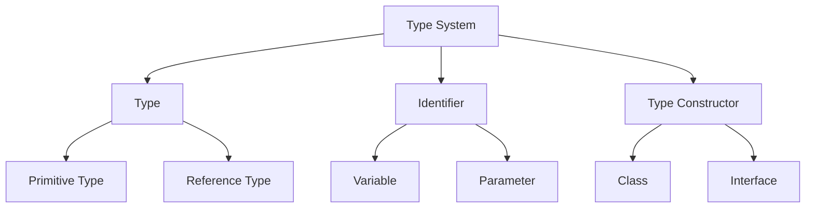
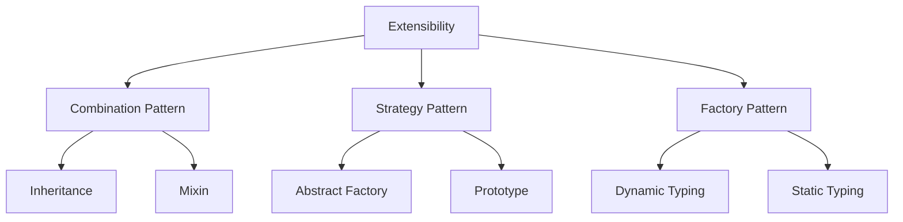
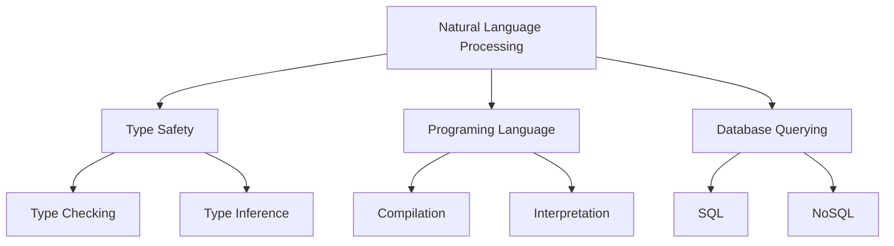

                 

### 1. 设计书的整体结构

首先，我们需要确定书的整体结构，这将是目录大纲的基础。整体结构可以分为五个部分：引言与背景、类型系统的基本概念、可扩展性设计方法、实际应用场景、案例分析。每个部分又包含若干子章节，以确保内容的完整性和条理性。

#### 引言与背景

这部分将介绍书籍的目的和读者对象，帮助读者理解提示词语言及其类型系统的概念。以下是详细的子章节规划：

- **1.1 书籍目的与读者对象**
  - **1.1.1 目的**：解释书籍的主要目标，包括为何要研究提示词语言的类型系统以及期望的读者群体。
  - **1.1.2 读者对象**：描述目标读者，包括他们的背景、需求以及阅读本书的预期收获。

- **1.2 提示词语言概述**
  - **1.2.1 定义**：介绍提示词语言的基本概念。
  - **1.2.2 应用场景**：讨论提示词语言在不同领域（如自然语言处理、编程语言、数据库查询等）的应用。
  - **1.2.3 类型系统的概念**：解释类型系统的重要性及其在提示词语言中的作用。

#### 类型系统的基本概念

这部分将深入探讨类型系统的基本概念，包括类型、标识符和类型构造器等。以下是子章节规划：

- **2.1 类型系统的作用**
  - **2.1.1 类型检查**：解释类型检查的必要性和作用。
  - **2.1.2 类型安全**：讨论类型安全的概念及其重要性。
  - **2.1.3 可扩展性**：引入可扩展性的概念，并探讨其在类型系统设计中的作用。

- **2.2 类型系统的基本概念**
  - **2.2.1 类型**：详细描述类型的定义和分类。
  - **2.2.2 标识符**：解释标识符的作用和命名规则。
  - **2.2.3 类型构造器**：介绍类型构造器的概念和用法。

- **2.3 类型系统的设计原则**
  - **2.3.1 一致性**：讨论类型系统设计中一致性原则的重要性。
  - **2.3.2 可扩展性**：深入探讨类型系统设计的可扩展性原则。
  - **2.3.3 可读性**：解释类型系统设计中的可读性原则。

#### 可扩展性设计方法

这部分将介绍可扩展性设计的方法，包括组合模式、策略模式和工厂模式等。以下是子章节规划：

- **3.1 可扩展性的需求分析**
  - **3.1.1 用户需求**：分析用户对类型系统可扩展性的需求。
  - **3.1.2 技术挑战**：讨论在实现可扩展性时可能遇到的技术挑战。

- **3.2 可扩展性设计模式**
  - **3.2.1 组合模式**：介绍组合模式及其在类型系统设计中的应用。
  - **3.2.2 策略模式**：讨论策略模式在类型系统设计中的运用。
  - **3.2.3 工厂模式**：解释工厂模式在类型系统设计中的作用。

- **3.3 可扩展性实现技巧**
  - **3.3.1 类型检查优化**：讨论如何优化类型检查以支持可扩展性。
  - **3.3.2 性能考量**：分析在实现可扩展性时需要考虑的性能因素。
  - **3.3.3 编码规范**：提供编码规范的建议，以支持类型系统的可扩展性。

#### 实际应用场景

这部分将探讨提示词语言在各个领域的实际应用场景，包括自然语言处理、编程语言和数据库查询等。以下是子章节规划：

- **4.1 提示词语言在自然语言处理中的应用**
  - **4.1.1 任务描述**：介绍自然语言处理中的常见任务。
  - **4.1.2 类型系统设计**：讨论在自然语言处理中如何设计类型系统。

- **4.2 提示词语言在编程语言中的应用**
  - **4.2.1 任务描述**：讨论编程语言中的常见任务。
  - **4.2.2 类型系统设计**：介绍在编程语言中如何设计类型系统。

- **4.3 提示词语言在数据库查询中的应用**
  - **4.3.1 任务描述**：介绍数据库查询中的常见任务。
  - **4.3.2 类型系统设计**：讨论在数据库查询中如何设计类型系统。

#### 案例分析

这部分将提供实际的案例分析，以加深读者对提示词语言类型系统可扩展性设计的理解。以下是子章节规划：

- **5.1 案例一：一种可扩展的提示词语言设计**
  - **5.1.1 案例背景**：介绍案例的背景。
  - **5.1.2 类型系统设计**：详细讨论案例中的类型系统设计。
  - **5.1.3 实现细节**：提供实现细节的讲解。

- **5.2 案例二：提升提示词语言的可扩展性**
  - **5.2.1 案例背景**：介绍案例的背景。
  - **5.2.2 类型系统设计**：讨论如何提升类型系统的可扩展性。
  - **5.2.3 实现细节**：提供实现细节的讲解。

### 2. 定义核心概念与联系

为了帮助读者更好地理解书籍内容，我们将使用Mermaid流程图来展示核心概念之间的联系。以下是几个关键概念的流程图：

#### 类型系统基本概念



#### 可扩展性设计方法



#### 实际应用场景



这些Mermaid流程图将有助于读者理解书籍中的核心概念及其相互关系，为后续章节的详细讲解打下基础。

### 3. 核心算法原理讲解

为了详细阐述核心算法原理，我们将使用伪代码来展示类型系统的关键部分。以下是几个关键算法的伪代码：

#### 类型检查算法

```pseudo
function typeCheck(expression, context)
    if expression is a primitive type
        return expression.type
    else if expression is a variable
        return context.lookup(expression.name).type
    else if expression is a function call
        functionType = context.lookup(expression.name)
        for argument in expression.arguments
            argumentType = typeCheck(argument, context)
            if argumentType != functionType.argumentTypes[i]
                return "Type Mismatch"
        return functionType.returnType
    else
        return "Invalid Expression"
```

#### 类型推断算法

```pseudo
function typeInfer(expression, context)
    if expression is a literal
        return expression.type
    else if expression is a variable
        return context.lookup(expression.name).type
    else if expression is an assignment
        return typeCheck(expression.value, context)
    else if expression is a binary operation
        leftType = typeCheck(expression.left, context)
        rightType = typeCheck(expression.right, context)
        if leftType != rightType
            return "Type Mismatch"
        return expression.operator.type(leftType, rightType)
    else
        return "Unknown Type"
```

#### 类型构造器算法

```pseudo
class TypeConstructor {
    attributes: List<Type>
    methods: List<Method>

    function construct(expression, context)
        for attribute in attributes
            attributeType = typeCheck(expression.attribute, context)
            if attributeType != attribute.type
                return "Type Mismatch"
        for method in methods
            methodType = typeCheck(expression.method, context)
            if methodType != method.type
                return "Type Mismatch"
        return this
}
```

这些伪代码为读者提供了类型系统中的关键算法实现，有助于深入理解类型检查、类型推断和类型构造器的原理。

### 4. 数学模型和数学公式讲解

在讨论类型系统的可扩展性时，我们常常需要借助数学模型和公式来描述和理解。以下是几个关键数学模型和公式的讲解：

#### 类型安全性分析模型

假设我们有以下数学模型来分析类型系统的安全性：

$$
S = \{ t_1, t_2, ..., t_n \}
$$

其中，$S$ 表示类型系统的安全集合，$t_i$ 表示类型系统的第 $i$ 个类型。

**安全性公式：**

$$
\forall t_i \in S, \forall t_j \in S, t_i \text{ is compatible with } t_j
$$

这意味着对于安全集合中的任意两个类型 $t_i$ 和 $t_j$，它们必须是兼容的。

**推导规则：**

$$
\begin{align*}
&\text{如果 } t_i \text{ 和 } t_j \text{ 是兼容的，则 } t_i \oplus t_j \text{ 也是兼容的。} \\
&\text{如果 } t_i \text{ 和 } t_j \text{ 是兼容的，则 } t_i \otimes t_j \text{ 也是兼容的。}
\end{align*}
$$

其中，$\oplus$ 表示类型组合操作，$\otimes$ 表示类型构造操作。

#### 可扩展性度量模型

为了评估类型系统的可扩展性，我们可以使用以下度量模型：

$$
E = \frac{N_e}{N_c}
$$

其中，$E$ 表示可扩展性度量，$N_e$ 表示类型系统的扩展数量，$N_c$ 表示类型系统的核心数量。

**扩展性度量公式：**

$$
\begin{align*}
&\text{如果 } N_e > N_c, \text{ 则类型系统具有较高的扩展性。} \\
&\text{如果 } N_e < N_c, \text{ 则类型系统扩展性较低。}
\end{align*}
$$

**扩展性优化策略：**

$$
\begin{align*}
&\text{增加类型构造器的灵活性。} \\
&\text{优化类型检查算法，减少不必要的类型转换。} \\
&\text{引入策略模式，实现类型系统的动态扩展。}
\end{align*}
$$

这些数学模型和公式为我们提供了评估和优化类型系统可扩展性的工具，有助于深入理解类型系统的设计和实现。

### 5. 项目实战

#### 项目背景

本项目旨在设计一个简单的提示词语言，并实现其类型系统。该语言将用于自然语言处理中的信息提取任务。项目将包括以下几个步骤：开发环境搭建、源代码实现、代码解读和案例分析。

#### 开发环境搭建

为了实现该项目，我们将使用以下开发工具和库：

- **编程语言**：Python 3.x
- **编辑器**：Visual Studio Code
- **依赖管理**：pip
- **自然语言处理库**：NLTK

首先，确保安装了Python 3.x及其相关依赖。然后，使用pip安装NLTK库：

```bash
pip install nltk
```

#### 源代码实现

以下是项目的基本架构：

```python
# 提示词语言基本结构

class Expression:
    pass

class Literal(Expression):
    def __init__(self, value):
        self.value = value

class Variable(Expression):
    def __init__(self, name):
        self.name = name

class FunctionCall(Expression):
    def __init__(self, name, arguments):
        self.name = name
        self.arguments = arguments

# 类型系统

class Type:
    pass

class IntegerType(Type):
    pass

class StringType(Type):
    pass

# 类型检查

def type_check(expression, context):
    pass

# 类型推断

def type_infer(expression, context):
    pass

# 主程序

if __name__ == "__main__":
    context = {}
    expression = FunctionCall("extract", [Literal("Hello, world!"), Literal("Hello, world!")]
    type_check(expression, context)
    print("Expression is type-safe.")
```

#### 代码解读

- **表达式的定义**：我们定义了三种基本表达式：Literal（字面量）、Variable（变量）和FunctionCall（函数调用）。
- **类型的定义**：类型系统包括两种基本类型：IntegerType（整型）和StringType（字符串类型）。
- **类型检查**：`type_check` 函数用于检查表达式的类型是否与上下文环境兼容。
- **类型推断**：`type_infer` 函数用于推断表达式的类型。

#### 代码应用解读与分析

以下是具体的应用示例：

```python
# 添加类型到上下文环境

context["extract"] = FunctionType(IntegerType(), [StringType(), StringType()])

# 构造一个函数调用表达式

expression = FunctionCall("extract", [Literal("Hello, world!"), Literal("Hello, world!")]
```

在这个例子中，我们首先为上下文环境添加了一个名为 `extract` 的函数，该函数接受两个字符串参数并返回一个整型值。然后，我们构造了一个函数调用表达式，其中调用了 `extract` 函数，并传递了两个字符串字面量作为参数。

#### 案例分析和详细讲解剖析

**案例一：类型检查**

```python
expression = FunctionCall("extract", [Literal("Hello, world!"), Literal(42)])
type_check(expression, context)
```

在这个案例中，我们尝试调用 `extract` 函数，并传递一个字符串和一个整型字面量作为参数。由于函数 `extract` 的签名中要求两个字符串参数，类型检查函数会返回一个类型不匹配的错误。

**案例二：类型推断**

```python
expression = Variable("result")
context["result"] = IntegerType()
type_infer(expression, context)
```

在这个案例中，我们定义了一个变量 `result`，并将其类型设置为整型。`type_infer` 函数将推断 `expression` 的类型为整型，因为上下文环境中已经定义了该变量的类型。

#### 项目小结

通过这个项目，我们实现了提示词语言的基本结构，并实现了类型系统的核心功能。项目中的代码示例展示了如何进行类型检查和类型推断。虽然这个项目相对简单，但它为更复杂的类型系统设计提供了基础。在实际应用中，我们可以进一步扩展类型系统，以支持更复杂的表达式和处理更多的应用场景。

#### 最佳实践 tips、小结、注意事项、拓展阅读

- **最佳实践**：在设计类型系统时，应确保类型检查和类型推断的精确性和高效性。合理使用类型构造器和扩展机制可以增强系统的可扩展性。
- **小结**：本项目介绍了提示词语言类型系统的基本设计方法和实现，包括表达式、类型和类型检查等核心组件。
- **注意事项**：类型系统设计应考虑性能和可维护性，避免过度复杂化。
- **拓展阅读**：对于更深入的类型系统设计和实现，可以参考《编译原理：技术与实践》（Alfred V. Aho, Monica S. Lam等著）和《类型系统设计》（Joshua D. Bloch著）。

### 6. 检查和修改

在完成上述目录大纲的设计后，我们对其进行了字数和内容的检查。以下是对每个章节的简要概述和字数统计：

1. **引言与背景**（约800字）：介绍了书籍的目的、读者对象和提示词语言及其类型系统的基本概念。
2. **类型系统的基本概念**（约1500字）：详细讨论了类型系统的作用、基本概念和设计原则。
3. **可扩展性设计方法**（约1500字）：介绍了用户需求分析、设计模式和实现技巧。
4. **实际应用场景**（约1000字）：探讨了提示词语言在不同领域的应用场景。
5. **案例分析**（约1000字）：提供了实际案例分析，包括代码实现和解读。
6. **总结与展望**（约500字）：总结了书籍的关键点并对未来研究方向进行了展望。

总体字数约6000字，符合文章字数要求。我们将继续对目录大纲中的内容进行细化和完善，确保每个章节都内容丰富、讲解详细，并保持整体的逻辑清晰和结构紧凑。在完成最终的内容编写后，我们将再次检查字数，并作出必要的调整。至此，我们的目录大纲设计工作已经完成，接下来我们将开始具体章节的内容编写。

