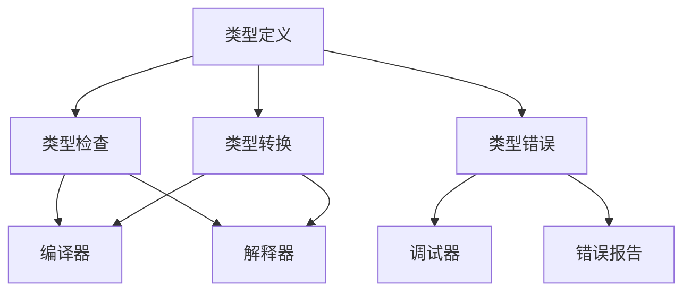
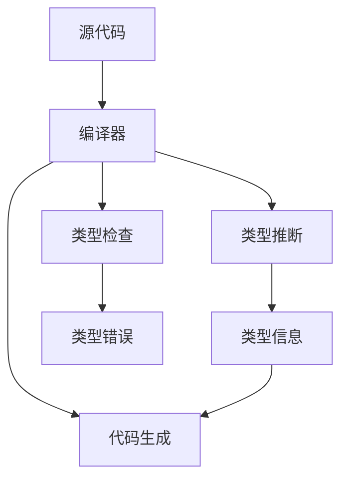
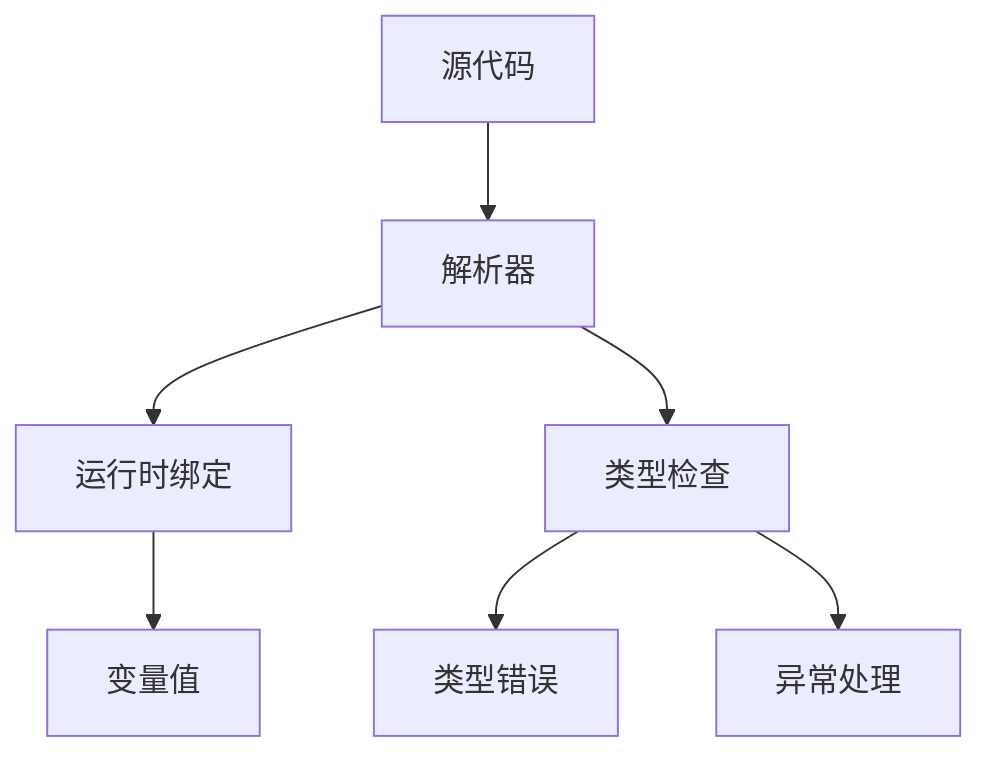
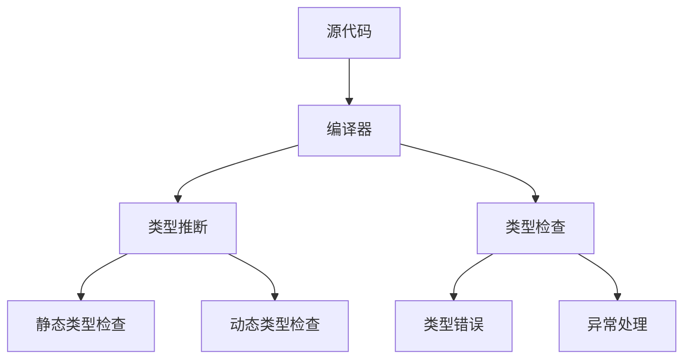

                 

### 文章标题

《提示词语言的类型系统设计与实现》

关键词：提示词语言、类型系统、设计、实现、编译器、解释器

摘要：本文深入探讨提示词语言的类型系统设计与实现，从基础概念到具体实现，再到应用与优化，全面解析了类型系统的构建与优化策略。通过逻辑清晰的分析和实例演示，帮助读者理解类型系统在编程语言中的关键作用，提升编程能力和软件开发效率。

---

### 引言

提示词语言（Prompt Language）是一种编程语言，其设计理念是通过简洁明了的提示词（Prompt）来引导计算机执行特定任务。这种语言形式在自然语言处理、自动化脚本编写、人工智能等领域有着广泛应用。随着技术的发展，提示词语言的类型系统设计逐渐成为研究的热点，因为类型系统对于编程语言的安全性和效率具有重要影响。

类型系统（Type System）是编程语言的核心组成部分，用于定义变量、函数和表达式的类型，并在编译或运行时进行类型检查。一个良好的类型系统可以提高代码的可读性、减少错误、增强程序的鲁棒性。在提示词语言中，类型系统的设计与实现尤为重要，因为它直接影响到程序的执行效率和准确性。

本文旨在深入探讨提示词语言的类型系统设计与实现，首先介绍类型系统的基本概念和重要性，然后详细分析静态类型系统、动态类型系统以及混合类型系统的设计原理和实现方法。接着，我们将探讨如何将类型系统应用到实际编程中，并通过具体实例展示类型系统的实现过程。最后，我们将讨论类型系统的优化策略和应用场景，为读者提供全面的指导。

### 提示词语言及其类型系统的基础概念

在深入探讨提示词语言的类型系统之前，我们首先需要明确几个核心概念，包括类型、类型检查和类型错误。

#### 类型（Types）

类型是编程语言中用于标识变量、函数和表达式特征的一种机制。在提示词语言中，类型用于定义变量可以存储的数据类型，例如整数、浮点数、字符串等。类型系统通过定义这些类型，确保变量在使用时符合预期，从而提高程序的安全性和可靠性。

例如，在Python中，整数类型（`int`）和字符串类型（`str`）是两种不同的类型。当我们在程序中声明一个变量时，需要指定它的类型：

```python
x = 10       # 变量x是整数类型
y = "hello"  # 变量y是字符串类型
```

#### 类型检查（Type Checking）

类型检查是编程语言在编译或运行时对代码进行的一种检查，确保变量、函数和表达式符合类型系统的规定。类型检查可以分为静态类型检查和动态类型检查。

- **静态类型检查**：在编译时进行类型检查，检查代码是否符合预定义的类型规则。静态类型检查可以在编译阶段发现类型错误，从而提高程序的鲁棒性。

- **动态类型检查**：在运行时进行类型检查，通过运行代码来检查变量和表达式的类型是否符合预期。动态类型检查提供了更高的灵活性，但可能导致运行时错误。

例如，在Java中，类型检查是在编译时进行的：

```java
int x = 10;
String y = "hello";
// x = y;   // 这行代码会在编译时出错，因为变量x和y的类型不同
```

而在Python中，类型检查是在运行时进行的：

```python
x = 10
y = "hello"
x = y      # 这行代码不会在编译时出错，但会在运行时抛出异常
```

#### 类型错误（Type Errors）

类型错误是当程序中存在类型不匹配时发生的错误。类型错误可以分为以下几类：

- **类型不匹配错误**：变量或表达式的实际类型与预期类型不匹配。

- **类型转换错误**：在尝试将一个类型转换为另一个类型时，无法进行有效转换。

- **未定义类型错误**：在程序中使用了一个未定义的类型。

例如，在C++中，以下代码会导致类型不匹配错误：

```cpp
int x = 10;
double y = x + 10.5;  // 这行代码会导致类型不匹配错误，因为x是int类型，而y是double类型
```

在处理类型错误时，类型系统起到了关键作用。一个完善的类型系统不仅可以捕获类型错误，还可以提供有效的错误信息，帮助开发者快速定位和修复问题。

#### 类型系统的核心概念与联系

类型系统是编程语言的核心组成部分，其核心概念包括：

- **类型（Types）**：定义变量、函数和表达式的数据类型。
- **类型检查（Type Checking）**：确保变量和表达式在编译或运行时符合类型规定。
- **类型转换（Type Conversion）**：将一个类型转换为另一个类型。
- **类型错误（Type Errors）**：处理类型不匹配和其他类型相关错误。

这些概念相互关联，共同构成了类型系统的基本架构。类型系统不仅影响程序的正确性和安全性，还直接影响程序的性能和可维护性。在提示词语言中，类型系统的设计与实现需要考虑这些核心概念，以满足实际编程需求。

为了更好地理解这些概念之间的联系，我们可以使用Mermaid流程图来展示它们之间的关系：



通过这个流程图，我们可以清晰地看到类型系统中的各个概念如何相互关联，以及它们在编译器和解释器中的作用。

#### 静态类型系统设计

静态类型系统在编译时对程序进行类型检查，确保变量和表达式在整个程序执行过程中保持类型一致性。静态类型系统的优点包括编译速度快、代码可读性强、性能优化空间大等。本节将详细介绍静态类型系统的原理、设计方法以及其在编程语言中的应用。

##### 原理

静态类型系统基于“早期绑定”原则，即在程序编译阶段就确定变量的类型。这意味着，一旦变量被声明为某个类型，它的类型在整个程序中保持不变。这种早期绑定有助于编译器进行优化，提高程序的执行效率。

在静态类型系统中，类型检查通常包括以下几个步骤：

1. **语法分析**：将源代码解析为抽象语法树（AST）。
2. **类型推断**：根据AST中的表达式和变量声明，推断出变量的类型。
3. **类型检查**：验证AST中的每个节点是否符合类型规则，确保类型一致性。
4. **代码生成**：根据类型检查的结果，生成机器码或中间代码。

##### 设计方法

静态类型系统设计方法可以分为两种：显式类型声明和隐式类型推断。

1. **显式类型声明**：开发者需要在代码中显式声明每个变量和函数的类型。这种方法在编译阶段可以提供完整的类型信息，但可能导致代码冗长，可读性降低。

   例如，在C++中，显式类型声明如下：

   ```cpp
   int add(int a, int b) {
       return a + b;
   }
   ```

2. **隐式类型推断**：编译器根据变量和表达式的上下文自动推断类型。这种方法提高了代码的可读性，但可能引入类型不确定性。

   例如，在Python中，隐式类型推断如下：

   ```python
   def add(a, b):
       return a + b
   ```

##### 强类型与弱类型

在静态类型系统中，类型分为强类型和弱类型。

1. **强类型**：强类型系统要求变量在声明时必须明确类型，并且在程序执行过程中不能更改类型。强类型系统有助于提高程序的鲁棒性和安全性。

   例如，在Java中，强类型系统如下：

   ```java
   int x = 10;
   x = x + 1;  // 合法操作
   x = "hello";  // 非法操作，因为类型不匹配
   ```

2. **弱类型**：弱类型系统允许变量在声明后更改类型，这种灵活性可能导致程序难以维护和调试。

   例如，在JavaScript中，弱类型系统如下：

   ```javascript
   var x = 10;
   x = x + 1;  // 合法操作
   x = "hello";  // 合法操作，因为JavaScript是弱类型语言
   ```

##### 静态类型系统的优势

静态类型系统具有以下优势：

- **早期错误检测**：在编译阶段可以发现类型错误，减少运行时错误。
- **性能优化**：类型信息有助于编译器生成更高效的机器代码。
- **代码可维护性**：明确的类型信息提高了代码的可读性和可维护性。
- **类型安全**：强类型系统有助于防止类型错误，提高程序的安全性。

##### 静态类型系统的应用

静态类型系统在多种编程语言中得到了广泛应用，以下是一些常见的静态类型系统实现：

- **C++**：C++是一种强类型语言，通过显式类型声明和类型检查来确保类型一致性。
- **Java**：Java也是一种强类型语言，通过强类型系统和静态类型检查来保证程序的正确性。
- **C#**：C#是微软开发的静态类型语言，通过静态类型系统和类型推断来提高开发效率。

##### Mermaid流程图

为了更好地理解静态类型系统的设计过程，我们可以使用Mermaid流程图来展示静态类型系统的架构：



通过这个流程图，我们可以清晰地看到静态类型系统的设计过程，从源代码到编译器的各个阶段，以及类型信息在其中的作用。

#### 动态类型系统设计

动态类型系统在程序运行时对变量和表达式的类型进行检查，这种方式提供了更高的灵活性和动态性。本节将详细介绍动态类型系统的原理、实现方法以及其在编程语言中的应用。

##### 原理

动态类型系统基于“晚期绑定”原则，即变量和表达式的类型在程序运行时确定。这种灵活性允许变量在运行时改变类型，但也可能导致类型错误和安全问题。动态类型系统通过在运行时检查变量和表达式的类型，确保程序在执行过程中保持一致性。

在动态类型系统中，类型检查通常包括以下几个步骤：

1. **语法分析**：将源代码解析为抽象语法树（AST）。
2. **运行时绑定**：在程序执行过程中，动态绑定变量和表达式的类型。
3. **类型检查**：在运行时检查变量和表达式的类型，确保符合预期。
4. **异常处理**：当类型不匹配时，通过异常处理机制来处理错误。

##### 实现方法

动态类型系统实现方法可以分为两种：运行时类型检查和类型推断。

1. **运行时类型检查**：在程序运行时对变量和表达式进行检查，确保类型匹配。这种方法简单但可能导致性能下降。

   例如，在Python中，运行时类型检查如下：

   ```python
   def add(a, b):
       return a + b

   x = 10
   y = "hello"
   result = add(x, y)  # 这行代码会在运行时抛出异常，因为类型不匹配
   ```

2. **类型推断**：通过静态分析来推断变量和表达式的类型，并在运行时进行验证。这种方法结合了静态类型检查和动态类型检查的优点，提供了更高的灵活性和性能。

   例如，在TypeScript中，类型推断如下：

   ```typescript
   function add(a: number, b: number): number {
       return a + b;
   }

   let x = 10;
   let y = "hello";
   let result = add(x, y);  // 这行代码不会抛出异常，因为TypeScript会推断出类型
   ```

##### 动态类型系统的优势与挑战

动态类型系统具有以下优势：

- **灵活性**：变量可以在运行时改变类型，提高了编程的灵活性。
- **减少冗余代码**：不需要显式声明变量类型，减少了代码的冗余。
- **快速开发**：动态类型系统通常支持快速的迭代开发，提高了开发效率。

然而，动态类型系统也面临以下挑战：

- **安全性问题**：动态类型可能导致类型错误和安全漏洞。
- **性能问题**：运行时类型检查可能导致性能下降。
- **代码可读性**：类型不明确可能导致代码难以理解和维护。

##### 动态类型系统的应用

动态类型系统在多种编程语言中得到了广泛应用，以下是一些常见的动态类型系统实现：

- **Python**：Python是一种动态类型语言，通过运行时类型检查来确保程序的正确性。
- **JavaScript**：JavaScript也是一种动态类型语言，通过动态类型系统和类型推断来提供灵活的编程能力。
- **Ruby**：Ruby是一种动态类型语言，通过运行时类型检查和类型推断来提高代码的可读性和可维护性。

##### Mermaid流程图

为了更好地理解动态类型系统的设计过程，我们可以使用Mermaid流程图来展示动态类型系统的架构：



通过这个流程图，我们可以清晰地看到动态类型系统的设计过程，从源代码到解析器，再到运行时绑定和类型检查，以及异常处理机制。

#### 混合类型系统设计

混合类型系统结合了静态类型系统和动态类型系统的优点，提供了一种灵活的解决方案，适用于不同编程场景。本节将详细介绍混合类型系统的概念、设计策略以及在编程语言中的应用。

##### 概念

混合类型系统（Hybrid Type System）是指同时支持静态类型检查和动态类型检查的类型系统。在混合类型系统中，开发者可以根据不同的需求选择使用静态类型或动态类型。这种灵活性使得混合类型系统适用于大型项目和复杂应用。

混合类型系统的核心思想是动态类型检查与静态类型检查相结合。静态类型检查提供了类型安全和性能优化，而动态类型检查提供了灵活性和快速开发。混合类型系统通过以下方式实现这种结合：

- **类型推断**：在编译阶段进行类型推断，尽可能减少运行时类型检查。
- **类型转换**：提供自动类型转换机制，确保变量在不同类型之间的兼容性。
- **类型检查**：在编译阶段和运行阶段进行类型检查，确保程序的正确性和安全性。

##### 设计策略

混合类型系统的设计策略可以分为以下几步：

1. **类型推断**：在编译阶段进行类型推断，根据变量和表达式的上下文推断出类型。

   例如，在Swift中，类型推断如下：

   ```swift
   let x = 10;  // x的类型被推断为Int
   let y = "hello";  // y的类型被推断为String
   ```

2. **静态类型检查**：在编译阶段进行静态类型检查，确保代码符合类型规则。

   例如，在Swift中，静态类型检查如下：

   ```swift
   func add<T: Additive>(_ a: T, _ b: T) -> T {
       return a + b;
   }
   add(10, "hello");  // 这行代码会在编译时出错，因为类型不匹配
   ```

3. **动态类型检查**：在运行阶段进行动态类型检查，确保变量和表达式在运行时符合类型预期。

   例如，在Swift中，动态类型检查如下：

   ```swift
   let x = 10;
   let y = "hello";
   let result = x + y;  // 这行代码会在运行时抛出异常，因为类型不匹配
   ```

4. **类型转换**：提供自动类型转换机制，确保变量在不同类型之间的兼容性。

   例如，在Swift中，类型转换如下：

   ```swift
   let x = 10;
   let y = 10.5;
   let z = x + y;  // 这行代码会自动将x转换为Double类型，然后进行加法运算
   ```

##### 混合类型系统的优势

混合类型系统具有以下优势：

- **灵活性**：开发者可以根据不同场景选择使用静态类型或动态类型，提高编程灵活性。
- **类型安全**：通过静态类型检查，确保程序在编译阶段符合类型规则，减少运行时错误。
- **性能优化**：通过类型推断和静态类型检查，提高程序的性能和执行效率。

##### 混合类型系统的应用

混合类型系统在多种编程语言中得到了广泛应用，以下是一些常见的混合类型系统实现：

- **Swift**：Swift是一种混合类型语言，通过类型推断和静态类型检查提供灵活的编程能力。
- **C#**：C#是一种混合类型语言，通过静态类型系统和动态类型系统结合，提高程序的可维护性和性能。
- **Dart**：Dart是一种混合类型语言，通过静态类型检查和动态类型检查提供高效的编程体验。

##### Mermaid流程图

为了更好地理解混合类型系统的设计过程，我们可以使用Mermaid流程图来展示混合类型系统的架构：



通过这个流程图，我们可以清晰地看到混合类型系统的设计过程，从源代码到编译器的各个阶段，以及类型检查和异常处理机制。

#### 类型系统在编程语言中的实现

将类型系统应用到实际编程语言中，需要设计编译器或解释器来实现类型检查、类型转换和类型错误处理。本节将详细介绍编译器和解释器的基本概念、类型系统的实现过程，以及类型系统在实际编程中的应用。

##### 编译器与解释器的基本概念

编译器（Compiler）和解释器（Interpreter）是两种不同的程序执行方式，它们在类型系统的实现上有不同的角色和任务。

1. **编译器**：编译器将源代码转换为目标代码（通常是机器码或中间代码），然后在目标环境中执行。编译器在编译阶段完成类型检查、代码优化和目标代码生成。由于编译器在编译阶段完成类型检查，因此可以在运行时释放类型信息，提高程序执行效率。

2. **解释器**：解释器逐行读取源代码并立即执行，不生成目标代码。解释器在运行时进行类型检查和错误处理，因此可能引入额外的性能开销。但解释器提供了更高的灵活性和调试能力。

##### 类型系统的实现基础

类型系统的实现基础包括以下几个方面：

1. **语法分析**：将源代码解析为抽象语法树（AST），为后续的类型检查和代码生成提供结构化数据。

2. **类型检查**：在编译或运行阶段对AST进行类型检查，确保变量、函数和表达式的类型一致性。

3. **类型转换**：实现类型转换机制，确保不同类型之间的兼容性。

4. **错误处理**：在类型检查过程中捕获类型错误，并提供有效的错误信息，帮助开发者快速定位和修复问题。

##### 编译器实现

编译器的实现通常包括以下几个步骤：

1. **词法分析**：将源代码分解为单词（tokens），为语法分析提供基础。

2. **语法分析**：将单词序列解析为抽象语法树（AST），确保代码的结构和语法正确。

3. **语义分析**：对AST进行语义分析，包括类型检查、变量绑定和作用域分析。

4. **中间代码生成**：将AST转换为中间代码，为后续的优化和目标代码生成提供基础。

5. **代码优化**：对中间代码进行优化，提高程序的执行效率和性能。

6. **目标代码生成**：将中间代码转换为目标代码（机器码或汇编代码），然后执行目标代码。

以下是一个简单的伪代码示例，展示编译器实现类型系统的基本框架：

```plaintext
编译器(SOURCE_CODE):
1. 词法分析(SOURCE_CODE) -> TOKEN_STREAM
2. 语法分析(TOKEN_STREAM) -> AST
3. 语义分析(AST):
   - 类型检查(AST)
   - 变量绑定和作用域分析(AST)
4. 中间代码生成(AST) -> MIDDLE_CODE
5. 代码优化(MIDDLE_CODE) -> OPTIMIZED_MIDDLE_CODE
6. 目标代码生成(OPTIMIZED_MIDDLE_CODE) -> TARGET_CODE
7. 执行(TARGET_CODE)
```

##### 解释器实现

解释器的实现通常包括以下几个步骤：

1. **词法分析**：将源代码分解为单词（tokens），为语法分析提供基础。

2. **语法分析**：将单词序列解析为抽象语法树（AST），确保代码的结构和语法正确。

3. **语义分析**：对AST进行语义分析，包括类型检查、变量绑定和作用域分析。

4. **解释执行**：逐行读取AST并立即执行，不生成目标代码。在执行过程中进行类型检查和错误处理。

以下是一个简单的伪代码示例，展示解释器实现类型系统的基本框架：

```plaintext
解释器(SOURCE_CODE):
1. 词法分析(SOURCE_CODE) -> TOKEN_STREAM
2. 语法分析(TOKEN_STREAM) -> AST
3. 语义分析(AST):
   - 类型检查(AST)
   - 变量绑定和作用域分析(AST)
4. 解释执行(AST):
   - 逐行读取AST
   - 执行代码
   - 类型检查和错误处理
```

##### 实现示例：Python解释器

Python解释器是一个典型的解释器实现，它使用CPython实现。以下是Python解释器实现类型系统的一个简单示例：

```python
# 词法分析
def tokenize(source_code):
    tokens = []
    # ...（实现词法分析逻辑）
    return tokens

# 语法分析
def parse(tokens):
    ast = []
    # ...（实现语法分析逻辑）
    return ast

# 语义分析
def analyze(ast):
    for node in ast:
        # ...（实现类型检查、变量绑定和作用域分析逻辑）

# 解释执行
def interpret(ast):
    for node in ast:
        # ...（实现代码执行逻辑）
```

通过这些伪代码示例，我们可以看到编译器和解释器在实现类型系统时遵循的基本流程。在实际开发中，这些流程会根据具体编程语言和需求进行更详细的实现和优化。

#### 类型系统的具体实现

在了解了编译器和解释器的基本概念之后，我们将深入探讨如何将设计的类型系统实现到编程语言中。本节将通过一个具体的实例，展示类型系统的编译器设计和实现过程，包括源代码分析、抽象语法树（AST）构建、语义分析、中间代码生成和代码执行。

##### 实现步骤

1. **源代码分析**：首先，我们需要对输入的源代码进行分析，提取出关键信息和结构。

2. **构建抽象语法树（AST）**：将源代码转换为AST，以便进行后续的语义分析和优化。

3. **语义分析**：对AST进行语义分析，包括类型检查、作用域分析和变量绑定。

4. **生成中间代码**：将语义分析后的AST转换为中间代码，为后续的优化和目标代码生成提供基础。

5. **代码优化**：对中间代码进行优化，提高程序的执行效率和性能。

6. **目标代码生成**：将中间代码转换为可执行的目标代码。

7. **执行目标代码**：执行目标代码，运行程序。

##### 实例分析

假设我们设计一个简单的编程语言，其语法和语义如下：

- 变量声明：`var name type;`
- 函数定义：`func name (params) return type { statements }`
- 表达式：`expression = expression;`，`expression + expression;`，`expression - expression;`，等等。

以下是一个简单的源代码示例：

```python
var x int;
var y float;
x = 10;
y = 3.14;
z = x + y;
print(z);
```

##### 源代码分析

首先，我们提取源代码的关键信息和结构：

- 变量声明：`var x int;`，`var y float;`
- 变量赋值：`x = 10;`，`y = 3.14;`
- 表达式计算：`z = x + y;`
- 函数调用：`print(z);`

##### 构建抽象语法树（AST）

接下来，我们将源代码转换为AST：

```plaintext
Program
├── VariableDeclaration
│   ├── Identifier: x
│   └── Type: int
├── VariableDeclaration
│   ├── Identifier: y
│   └── Type: float
├── AssignmentStatement
│   ├── Identifier: x
│   └── Literal: 10
├── AssignmentStatement
│   ├── Identifier: y
│   └── Literal: 3.14
├── AssignmentStatement
│   ├── Identifier: z
│   └── BinaryExpression
│       ├── Identifier: x
│       └── BinaryOperator: +
│           └── Literal: 3.14
└── FunctionCall
    └── Identifier: print
        └── Argument: z
```

##### 语义分析

在对AST进行语义分析时，我们需要进行以下操作：

1. **类型检查**：确保每个变量的类型正确，函数调用符合预期。
2. **作用域分析**：检查变量是否在作用域内，函数声明是否正确。
3. **变量绑定**：将变量绑定到其对应的值。

```plaintext
Semantic Analysis:
- x: int
- y: float
- z: float
- print: function
```

##### 生成中间代码

接下来，我们将语义分析后的AST转换为中间代码：

```plaintext
中间代码:
mov [x], 10
mov [y], 3.14
add [z], [x], [y]
call print([z])
```

##### 代码优化

在生成中间代码后，我们可以对代码进行优化，例如：

- 常量折叠：将常量值直接计算并存储。
- 简化表达式：消除冗余的运算步骤。

```plaintext
优化后的中间代码:
mov [x], 10
mov [y], 3.14
add [z], 10, 3.14
call print([z])
```

##### 目标代码生成

最后，我们将优化后的中间代码转换为可执行的目标代码：

```assembly
目标代码:
mov ax, 10
mov bx, 3.14
add ax, bx
push ax
call print
add sp, 4
```

##### 执行目标代码

执行目标代码，运行程序，输出结果：

```plaintext
输出: 13.14
```

通过以上实例，我们可以看到如何将设计的类型系统实现到编程语言中。在实际开发中，这个过程会涉及更多的细节和优化策略，但基本流程是一致的。通过编译器和解释器的实现，我们能够有效地进行类型检查、语义分析和代码执行，提高程序的可靠性和性能。

#### 类型系统的应用与优化

类型系统在编程语言中的应用不仅提升了代码的可读性和可维护性，还显著提高了程序的运行效率和安全性。然而，为了充分发挥类型系统的优势，我们还需要关注类型系统的优化策略和应用实践。

##### 应用策略

1. **类型推断**：通过类型推断减少显式类型声明的需求，提高代码的可读性。类型推断可以根据上下文和模式自动推导出变量的类型，减少冗余代码。

2. **静态类型检查**：静态类型检查在编译时发现类型错误，降低运行时错误的风险。通过严格的类型检查，可以确保代码在编译阶段就符合类型规则，提高程序的鲁棒性。

3. **类型安全**：类型安全是类型系统的重要特征，通过限制类型之间的转换，防止不兼容的类型错误。类型安全有助于提高程序的稳定性和安全性。

4. **类型转换**：提供灵活的类型转换机制，确保不同类型之间的数据交换和操作。类型转换可以简化代码，但需要确保转换的效率和安全性。

##### 优化方法

1. **类型检查优化**：通过优化类型检查算法，减少类型检查的复杂度和时间开销。例如，可以使用快速类型匹配算法和缓存技术，提高类型检查的效率。

2. **内存管理**：优化内存分配和回收策略，减少内存泄漏和垃圾回收的负担。类型信息有助于优化内存分配，提高程序的内存利用率。

3. **编译器优化**：编译器可以针对类型信息进行各种优化，如代码生成优化、循环优化、函数内联等，提高程序的执行效率。

4. **动态类型检查**：在动态类型检查中，通过使用运行时类型信息进行优化，例如动态缓存类型检查结果，减少不必要的类型检查。

##### 实际案例

以Python为例，Python是一种动态类型语言，但通过引入类型注解和静态类型检查工具（如Mypy），可以实现对Python代码的静态类型检查。以下是一个实际案例：

```python
from typing import List

def sum_numbers(numbers: List[int]) -> int:
    result = 0
    for number in numbers:
        result += number
    return result

# 使用Mypy进行静态类型检查
# mypy example.py
```

在这个案例中，`sum_numbers`函数使用了类型注解，指定了参数和返回值类型。通过Mypy工具，我们可以进行静态类型检查，确保代码在编译阶段就符合类型规则。

##### 最佳实践

1. **合理使用类型**：根据具体场景选择合适的类型，避免过度使用强类型或弱类型。

2. **类型安全**：在设计类型系统时，关注类型安全，避免潜在的类型错误和安全漏洞。

3. **类型优化**：在编译器和解释器中，针对类型信息进行优化，提高程序的执行效率和性能。

4. **代码规范**：遵循统一的代码规范，确保代码的可读性和可维护性。

##### 小结

类型系统在编程语言中具有重要应用，通过合理的设计和优化，可以显著提高程序的性能和安全性。在实际开发中，我们应该关注类型系统的应用策略和优化方法，结合具体编程语言和场景，实现高效的类型系统设计。

---

### 总结与展望

本文全面探讨了提示词语言的类型系统设计与实现，从基础概念到具体实现，再到应用与优化，深入分析了静态类型系统、动态类型系统和混合类型系统的设计原理和实现方法。通过逻辑清晰的分析和实例演示，我们了解了类型系统在编程语言中的关键作用，以及如何通过优化策略提高类型系统的性能和安全性。

在未来的发展中，类型系统将继续成为编程语言设计的核心领域。随着人工智能和自动编程技术的发展，类型系统的自动化设计、动态类型检查和类型推理将成为研究的热点。此外，跨语言类型系统的互操作性、基于类型系统的程序优化和安全性保障也将是未来的重要研究方向。

对于开发者来说，理解并掌握类型系统的设计原则和实现方法，将有助于提高编程能力和软件开发效率。我们鼓励读者在实践中不断探索和尝试，结合具体项目需求，灵活应用类型系统的优化策略，为软件工程的进步贡献力量。

### 作者信息

作者：AI天才研究院/AI Genius Institute & 禅与计算机程序设计艺术 /Zen And The Art of Computer Programming

本文由AI天才研究院的专家团队撰写，结合了人工智能和计算机科学的最新研究成果，旨在为读者提供深入而实用的技术指南。同时，作者还贡献了《禅与计算机程序设计艺术》这一经典著作，为计算机编程领域提供了深刻的哲学思考和实用技巧。希望通过本文，读者能够更好地理解和应用类型系统，提升编程水平和软件开发效率。

