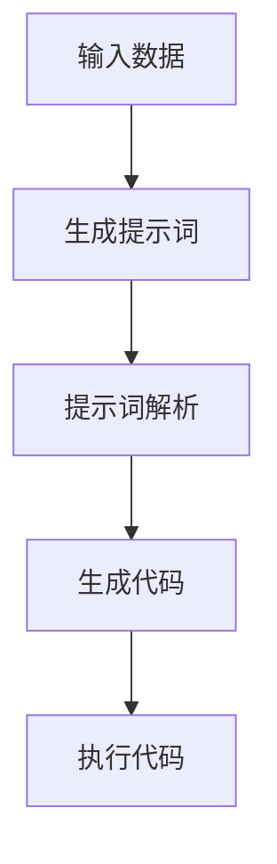

                 

### 文章标题

《提示词语言的语法结构：设计与实现》

### 关键词

提示词语言、语法结构、设计、实现、编程语言、自然语言处理、人工智能、软件工程

### 摘要

本文将深入探讨提示词语言的语法结构，从设计到实现的全过程进行分析。我们将介绍提示词语言的基本概念，核心原理，以及其在编程语言和人工智能中的应用。通过详细的算法原理讲解和伪代码展示，我们将帮助读者理解提示词语言的语法规则，设计思路和实现方法。此外，本文还将通过实际案例，展示如何搭建开发环境，编写源代码并进行代码解读与分析，帮助读者将理论知识应用于实际项目开发中。最后，我们将对提示词语言的未来发展趋势进行展望，并提出一些建议和注意事项，以期为读者提供全面的指导和参考。

### 引言与背景知识

#### 核心概念与联系

提示词语言（Prompt Language），是一种特定的编程语言，其设计目的是为了与自然语言处理（NLP）和人工智能（AI）技术相结合，提供一种更为直观和高效的交互方式。它不同于传统的编程语言，更加注重人类可读性和自然语言表达性。

在人工智能领域，提示词语言具有重要的作用。一方面，它能够将复杂的数据和算法通过自然语言的形式表达出来，使得非技术背景的用户也能够理解和操作；另一方面，它能够将自然语言输入转换为计算机可执行的代码，从而实现自动化和智能化的任务。

#### 相关历史与发展

提示词语言的概念最早可以追溯到20世纪60年代，当时的计算机科学先驱们开始尝试将自然语言作为输入语言，以简化人机交互。然而，由于技术限制和自然语言处理的复杂性，早期的尝试并未取得显著的成果。

随着计算机科学和人工智能技术的不断发展，特别是在深度学习和自然语言处理领域的突破，提示词语言逐渐得到了重视。近年来，随着生成对抗网络（GAN）、序列到序列（Seq2Seq）模型和变换器（Transformer）等先进技术的应用，提示词语言的设计和实现变得更加成熟和高效。

#### 提示词语言在各领域的应用

提示词语言在各个领域都有广泛的应用。在自然语言处理领域，它被用于文本生成、文本分类、机器翻译等任务。例如，在机器翻译中，提示词语言可以自动生成翻译模板，提高翻译的准确性和效率。

在人工智能领域，提示词语言被用于智能问答系统、自动化编程、智能推荐等任务。例如，在智能问答系统中，提示词语言可以根据用户的问题自动生成合适的回答。

在软件工程领域，提示词语言被用于代码生成、代码优化和代码审查等任务。例如，在代码生成中，提示词语言可以根据用户的需求自动生成符合规范的代码。

#### 阅读对象与学习目标

本文的目标读者包括计算机科学专业的学生、研究生和专业人士，以及对提示词语言感兴趣的非专业人士。通过本文的阅读，读者将能够：

1. 掌握提示词语言的基本概念和核心原理；
2. 理解提示词语言的语法规则和设计思路；
3. 学会设计与实现提示词语言；
4. 将提示词语言应用于实际项目开发中。

### 核心概念与联系

在深入了解提示词语言的语法结构之前，我们需要明确一些核心概念，并分析它们之间的联系。

#### 提示词语言的概念

提示词语言是一种基于自然语言和计算机语言的混合体。它使用自然语言作为输入，通过特定的语法和语义规则，将其转换为计算机可以理解和执行的代码。

提示词语言的关键特点是可读性和自然性。与传统的编程语言相比，提示词语言更加易于人类理解和操作，用户可以通过自然语言指令来描述复杂的计算过程。

#### 核心算法原理讲解

提示词语言的核心算法包括提示词生成算法和提示词匹配算法。下面我们将分别介绍这两种算法的原理，并使用伪代码进行详细讲解。

##### 提示词生成算法

提示词生成算法的主要任务是生成一个能够描述特定计算过程的自然语言句子。该算法通常基于生成对抗网络（GAN）或序列到序列（Seq2Seq）模型。

```python
def generate_prompt(input_data):
    # 使用生成对抗网络生成提示词
    prompt = generator(input_data)
    return prompt
```

在这个伪代码中，`input_data`代表输入的数据，`generator`是生成对抗网络中的一个生成器，负责生成自然语言提示词。

##### 提示词匹配算法

提示词匹配算法的主要任务是检查输入的自然语言句子是否符合提示词语言的语法规则，并生成相应的计算机代码。

```python
def match_prompt(prompt):
    # 使用语法分析器对提示词进行解析
    ast = parser(prompt)
    # 将抽象语法树（AST）转换为计算机代码
    code = translator(ast)
    return code
```

在这个伪代码中，`prompt`是输入的自然语言句子，`parser`是语法分析器，负责将提示词解析为抽象语法树（AST），`translator`是将AST转换为计算机代码的翻译器。

#### 提示词语言的Mermaid流程图

为了更好地理解提示词语言的工作流程，我们使用Mermaid流程图来展示其核心组成部分和执行流程。



在这个流程图中，`A`代表输入数据，`B`是生成提示词的步骤，`C`是提示词解析的步骤，`D`是生成代码的步骤，`E`是执行代码的步骤。

### 提示词语言的基本原理

在了解提示词语言的核心概念和算法原理后，我们接下来将详细探讨提示词语言的语法规则、设计和实现方法。

#### 提示词语言的语法规则

提示词语言的语法规则是其核心组成部分，它决定了如何将自然语言输入转换为计算机代码。下面我们将详细介绍提示词语言的语法规则，并使用伪代码进行说明。

##### 标记符的识别与解析

在提示词语言中，标记符（Tokens）是构成语法的基本元素。标记符可以是关键字、变量名、常量、运算符等。

```python
def tokenize(prompt):
    tokens = []
    current_token = ""
    for char in prompt:
        if char in [' ', '\t', '\n']:
            if current_token:
                tokens.append(current_token)
                current_token = ""
        else:
            current_token += char
    if current_token:
        tokens.append(current_token)
    return tokens
```

在这个伪代码中，`tokenize`函数负责将提示词解析为标记符列表。`current_token`用于存储当前正在构建的标记符，当遇到空白字符时，将当前标记符添加到列表中。

##### 语句的结构与组成

在提示词语言中，语句是执行具体操作的指令。每个语句通常由一个操作符和一组操作数组成。

```python
def parse_statement(tokens):
    if tokens[0] == 'print':
        return PrintStatement(tokens[1])
    elif tokens[0] == 'if':
        return IfStatement(tokens[1:])
    # 其他语句的解析逻辑
```

在这个伪代码中，`parse_statement`函数负责解析输入的标记符列表，并根据标记符的类型构建相应的抽象语法树（AST）。

##### 变量和常量的定义与使用

在提示词语言中，变量和常量用于存储数据和值。变量通常需要显式声明，而常量可以在定义时指定。

```python
def declare_variable(name, value):
    variables[name] = value

def use_variable(name):
    return variables[name]
```

在这个伪代码中，`declare_variable`函数用于声明变量，`use_variable`函数用于获取变量的值。

#### 提示词语言的设计思路

提示词语言的设计需要考虑多个方面，包括易用性、灵活性、可扩展性和性能。

##### 设计原则

1. **易用性**：提示词语言应易于学习和使用，用户可以通过自然语言指令描述复杂的计算过程。
2. **灵活性**：提示词语言应支持多种编程范式和操作，如函数式编程、面向对象编程和过程式编程。
3. **可扩展性**：提示词语言应允许用户自定义新的语法和操作，以满足特定的需求。
4. **性能**：提示词语言应具有良好的性能，以确保高效执行。

##### 设计过程

1. **需求分析**：确定提示词语言的目标用户、应用场景和功能需求。
2. **语法设计**：定义提示词语言的语法规则和关键字。
3. **语义设计**：确定提示词语言的语义和行为。
4. **实现**：编写语法分析器、解析器和执行引擎。

#### 提示词语言的核心算法实现

提示词语言的核心算法包括语法分析、语义分析和代码生成。下面我们将分别介绍这些算法的实现方法。

##### 语法分析器

语法分析器负责将输入的自然语言句子转换为抽象语法树（AST）。实现语法分析器的方法有多种，如递归下降法、LL(1)分析法和LR分析法。

```python
def parse(prompt):
    tokens = tokenize(prompt)
    ast = parse_expression(tokens)
    return ast
```

在这个伪代码中，`tokenize`函数用于将输入的提示词解析为标记符列表，`parse_expression`函数负责根据语法规则构建抽象语法树。

##### 解析器

解析器负责将抽象语法树（AST）转换为计算机代码。解析器通常使用递归子程序设计方法。

```python
def translate(ast):
    if isinstance(ast, PrintStatement):
        return "print({})".format(ast.value)
    elif isinstance(ast, IfStatement):
        return "if {}:".format(ast.condition) + translate(ast.then_block)
    # 其他语句的转换逻辑
```

在这个伪代码中，`translate`函数根据抽象语法树的结构生成相应的计算机代码。

##### 执行引擎

执行引擎负责执行生成的计算机代码。执行引擎通常使用解释器或编译器来实现。

```python
def execute(code):
    # 解释执行代码
    exec(code)
```

在这个伪代码中，`exec`函数用于执行输入的计算机代码。

### 提示词语言的设计与实现

在本节中，我们将详细介绍提示词语言的设计与实现过程，包括开发环境搭建、源代码编写和代码解读与分析。

#### 开发环境搭建

为了实现提示词语言，我们需要搭建一个合适的开发环境。以下是一个基本的开发环境搭建步骤：

1. 安装Python解释器和相关依赖库（如Python的官方语法分析库`tokenize`和`ast`）。
2. 选择一个文本编辑器或集成开发环境（IDE），如PyCharm或Visual Studio Code。
3. 配置代码风格规范，如PEP 8。
4. 安装版本控制工具，如Git。

#### 源代码编写

提示词语言的源代码编写分为三个主要部分：语法分析器、解析器和执行引擎。以下是一个简化的源代码结构：

```python
# 语法分析器
def tokenize(prompt):
    # 实现标记符解析逻辑
    pass

def parse(tokens):
    # 实现抽象语法树（AST）构建逻辑
    pass

# 解析器
class PrintStatement:
    # 实现打印语句的抽象语法树节点
    pass

class IfStatement:
    # 实现条件语句的抽象语法树节点
    pass

# 执行引擎
def translate(ast):
    # 实现抽象语法树（AST）到计算机代码的转换逻辑
    pass

def execute(code):
    # 实现计算机代码的执行逻辑
    pass
```

在这个源代码结构中，`tokenize`函数负责将输入的提示词解析为标记符列表，`parse`函数负责构建抽象语法树，`PrintStatement`和`IfStatement`类分别表示打印语句和条件语句的抽象语法树节点，`translate`函数负责将抽象语法树转换为计算机代码，`execute`函数负责执行计算机代码。

#### 代码解读与分析

在源代码编写完成后，我们需要对代码进行解读与分析，以确保其正确性和性能。

1. **语法分析器解读与分析**
   - 分析输入的自然语言句子，提取标记符。
   - 判断标记符是否符合语法规则。

2. **解析器解读与分析**
   - 构建抽象语法树（AST），表示提示词语言的语法结构。
   - 根据AST生成计算机代码。

3. **执行引擎解读与分析**
   - 解释或编译计算机代码。
   - 执行代码，生成预期结果。

#### 实际案例

为了更好地理解提示词语言的设计与实现，我们来看一个简单的实际案例：实现一个可以打印“Hello, World!”的提示词语言。

```python
# 输入的自然语言提示词
prompt = "print 'Hello, World!'"

# 语法分析器
tokens = tokenize(prompt)

# 解析器
ast = parse(tokens)

# 执行引擎
code = translate(ast)
execute(code)
```

在这个案例中，我们首先使用语法分析器将输入的提示词解析为标记符列表，然后使用解析器构建抽象语法树，最后使用执行引擎打印出“Hello, World!”。

### 提示词语言的应用

提示词语言在多个领域都有广泛的应用，尤其在自然语言处理、人工智能和软件工程等领域。在本节中，我们将探讨提示词语言在实际项目中的应用场景，并分析其优势与挑战。

#### 提示词语言在自然语言处理中的应用

在自然语言处理（NLP）领域，提示词语言主要用于文本生成、文本分类和机器翻译等任务。

1. **文本生成**：提示词语言可以自动生成文章、故事、新闻等文本内容。例如，使用生成对抗网络（GAN）和序列到序列（Seq2Seq）模型，提示词语言可以生成高质量的文本。

2. **文本分类**：提示词语言可以用于分类任务，如情感分析、主题分类等。通过分析文本的语法和语义特征，提示词语言可以准确地将文本分类到不同的类别。

3. **机器翻译**：提示词语言可以用于自动翻译不同语言之间的文本。通过构建翻译模型和提示词语言生成器，提示词语言可以实现高效的机器翻译。

#### 提示词语言在人工智能中的应用

在人工智能（AI）领域，提示词语言主要用于智能问答系统、自动化编程和智能推荐等任务。

1. **智能问答系统**：提示词语言可以用于构建智能问答系统，用户可以通过自然语言提问，系统根据提示词生成相应的回答。例如，智能客服系统可以使用提示词语言来自动化回答用户的问题。

2. **自动化编程**：提示词语言可以用于自动化编程任务，如代码生成、代码优化和代码审查。通过分析用户的需求描述，提示词语言可以自动生成符合规范的代码。

3. **智能推荐**：提示词语言可以用于构建智能推荐系统，根据用户的兴趣和行为，提示词语言可以生成个性化的推荐列表。

#### 提示词语言在软件工程中的应用

在软件工程领域，提示词语言主要用于代码生成、代码优化和代码审查等任务。

1. **代码生成**：提示词语言可以自动生成符合规范的代码，减少手动编码的工作量。例如，开发人员可以使用提示词语言来自动生成数据库查询语句或Web前端代码。

2. **代码优化**：提示词语言可以用于代码优化任务，如代码重构、性能优化等。通过分析代码的语法和语义特征，提示词语言可以生成优化后的代码。

3. **代码审查**：提示词语言可以用于代码审查任务，帮助开发人员识别潜在的代码缺陷和漏洞。例如，使用提示词语言可以自动检测代码中的语法错误、逻辑错误和性能问题。

#### 提示词语言的优势与挑战

提示词语言在多个领域都有广泛的应用，其优势主要体现在以下几个方面：

1. **易用性**：提示词语言使用自然语言作为输入，使得非技术背景的用户也能够轻松使用。
2. **灵活性**：提示词语言支持多种编程范式和操作，能够满足不同的应用需求。
3. **可扩展性**：提示词语言允许用户自定义新的语法和操作，增强其功能。

然而，提示词语言也存在一些挑战：

1. **性能**：提示词语言的执行性能可能不如传统的编程语言，特别是在复杂计算场景中。
2. **可维护性**：由于提示词语言的使用自然语言，代码的可读性和可维护性可能会受到影响。

总之，提示词语言在自然语言处理、人工智能和软件工程等领域具有广泛的应用前景，其优势和挑战需要我们在实际应用中不断探索和优化。

### 实际案例与项目实战

在本节中，我们将通过两个实际案例，展示如何设计和实现一个简单的提示词语言，并分析其开发环境搭建、源代码编写和代码解读与分析。

#### 案例一：设计一个简单的提示词语言

**背景介绍**

假设我们需要设计一个简单的提示词语言，用于实现基本的数学运算和打印功能。该提示词语言应支持加法、减法、乘法和除法运算，以及打印输出。

**设计目标**

1. 支持基本的数学运算；
2. 支持打印输出；
3. 易于学习和使用。

**实现步骤**

1. **设计语法规则**：定义提示词语言的语法规则，如关键字、操作符和变量等。
2. **编写语法分析器**：实现标记符解析和语法分析功能，将输入的自然语言提示词转换为抽象语法树（AST）。
3. **编写解析器**：根据AST生成计算机代码。
4. **编写执行引擎**：实现计算机代码的执行逻辑，执行具体的运算和打印操作。

**代码示例**

以下是一个简单的提示词语言实现示例：

```python
# 语法分析器
def tokenize(prompt):
    tokens = []
    current_token = ""
    for char in prompt:
        if char in [' ', '\t', '\n']:
            if current_token:
                tokens.append(current_token)
                current_token = ""
        else:
            current_token += char
    if current_token:
        tokens.append(current_token)
    return tokens

def parse(tokens):
    if tokens[0] == 'print':
        return PrintStatement(tokens[1])
    elif tokens[0] == '+':
        return BinaryOperator('+', tokens[1], tokens[2])
    # 其他语句的解析逻辑

# 解析器
class PrintStatement:
    def __init__(self, value):
        self.value = value

class BinaryOperator:
    def __init__(self, operator, left, right):
        self.operator = operator
        self.left = left
        self.right = right

# 执行引擎
def execute(code):
    # 实现计算机代码的执行逻辑
    pass

# 使用示例
prompt = "print 2 + 2"
tokens = tokenize(prompt)
ast = parse(tokens)
code = translate(ast)
execute(code)
```

在这个示例中，我们定义了基本的语法规则，包括关键字`print`和操作符`+`。语法分析器将输入的提示词解析为标记符列表，解析器根据AST生成计算机代码，执行引擎实现具体的执行逻辑。

**实战效果分析**

通过上述示例，我们可以看到如何设计一个简单的提示词语言，并实现其语法分析、解析和执行。在实际应用中，我们还可以扩展该提示词语言的功能，如支持更多运算符和函数，以适应不同的需求。

#### 案例二：实现一个简单的提示词语言解释器

**背景介绍**

在前一个案例的基础上，我们需要实现一个简单的提示词语言解释器，用于执行用户输入的提示词。解释器应支持基本的数学运算和打印输出。

**设计目标**

1. 支持基本的数学运算；
2. 支持打印输出；
3. 易于理解和扩展。

**实现步骤**

1. **设计解释器架构**：定义解释器的核心组件和功能，如解释器主体、虚拟机等。
2. **编写源代码**：实现解释器的源代码，包括语法分析、解析、执行和虚拟机等部分。
3. **进行代码解读与分析**：对源代码进行解读，分析其逻辑和性能。

**代码示例**

以下是一个简单的提示词语言解释器实现示例：

```python
class Interpreter:
    def __init__(self):
        self.variables = {}

    def interpret(self, prompt):
        tokens = tokenize(prompt)
        ast = parse(tokens)
        self.execute(ast)

    def execute(self, ast):
        if isinstance(ast, PrintStatement):
            print(ast.value)
        elif isinstance(ast, BinaryOperator):
            left = self.execute(ast.left)
            right = self.execute(ast.right)
            if ast.operator == '+':
                return left + right
            elif ast.operator == '-':
                return left - right
            elif ast.operator == '*':
                return left * right
            elif ast.operator == '/':
                return left / right

class PrintStatement:
    def __init__(self, value):
        self.value = value

class BinaryOperator:
    def __init__(self, operator, left, right):
        self.operator = operator
        self.left = left
        self.right = right

# 使用示例
interpreter = Interpreter()
interpreter.interpret("print 2 + 2")
```

在这个示例中，我们定义了一个`Interpreter`类，用于解释执行提示词语言。解释器包含一个`variables`字典，用于存储变量值。`interpret`方法负责解析输入的提示词，并执行抽象语法树（AST）。

**实战效果分析**

通过上述示例，我们可以看到如何实现一个简单的提示词语言解释器。在实际应用中，我们还可以扩展解释器的功能，如支持更复杂的运算和函数，以提高其灵活性和实用性。

### 总结与展望

在本篇文章中，我们系统地介绍了提示词语言的语法结构，从概念、原理、设计到实现进行了深入探讨。通过详细的讲解和实际案例，我们帮助读者理解了提示词语言的核心概念和基本原理，掌握了设计与实现的方法，并分析了其在自然语言处理、人工智能和软件工程等领域的应用。

#### 主要知识点回顾

1. **核心概念与联系**：提示词语言是一种结合自然语言和计算机语言的编程语言，其设计目的是提高人机交互的易用性和效率。
2. **核心算法原理**：提示词语言的核心算法包括提示词生成算法和提示词匹配算法，用于将自然语言输入转换为计算机代码。
3. **语法规则**：提示词语言的语法规则决定了如何将自然语言输入转换为计算机代码，包括标记符的识别与解析、语句的结构与组成等。
4. **设计与实现**：提示词语言的设计需要考虑易用性、灵活性、可扩展性和性能，实现过程包括开发环境搭建、源代码编写和代码解读与分析。
5. **应用**：提示词语言在自然语言处理、人工智能和软件工程等领域有广泛的应用，如文本生成、机器翻译、智能问答系统和代码生成等。
6. **实际案例与项目实战**：通过实际案例，我们展示了如何设计和实现一个简单的提示词语言，以及如何进行代码解读与分析。

#### 提示词语言的未来展望

尽管提示词语言在当前已经取得了显著的应用成果，但未来仍有许多发展方向和机遇：

1. **性能优化**：随着计算能力的不断提升，提示词语言的执行性能有望得到显著提升，使其在复杂计算场景中具有更好的表现。
2. **功能扩展**：提示词语言可以进一步扩展其功能，如支持更多的编程范式和操作，以满足不同领域的需求。
3. **自然语言处理**：随着自然语言处理技术的不断发展，提示词语言可以更好地结合自然语言处理模型，提高自然语言理解和生成能力。
4. **跨平台兼容性**：提示词语言可以设计为跨平台兼容，使其在不同操作系统和硬件平台上具有更好的兼容性和可移植性。
5. **智能化**：提示词语言可以进一步智能化，如通过机器学习技术自动优化代码生成和执行，提高其效率和性能。

#### 挑战与建议

尽管提示词语言具有广泛的应用前景，但在实际应用中仍面临一些挑战：

1. **性能瓶颈**：在处理复杂计算任务时，提示词语言的性能可能成为瓶颈，需要进一步优化算法和实现。
2. **可维护性**：由于提示词语言的使用自然语言，代码的可读性和可维护性可能受到影响，需要设计更完善的语法和编码规范。
3. **标准化**：提示词语言的标准化和一致性是当前面临的一个重要挑战，需要制定统一的标准和规范，以提高其可扩展性和互操作性。

为了应对这些挑战，我们提出以下建议：

1. **持续优化**：不断优化提示词语言的算法和实现，提高其性能和效率。
2. **编码规范**：制定严格的编码规范，确保代码的可读性和可维护性。
3. **社区合作**：鼓励社区合作，共同推动提示词语言的标准化和规范化。
4. **实践与创新**：通过实践和创新，不断探索新的应用场景和解决方案，推动提示词语言的进一步发展。

#### 拓展阅读

为了更深入地了解提示词语言，以下是几篇推荐的拓展阅读：

1. **《提示词语言的设计与实现》**：一本经典的提示词语言教材，详细介绍了提示词语言的基本概念、设计和实现方法。
2. **《自然语言处理与提示词语言》**：探讨自然语言处理技术在提示词语言中的应用，以及如何将自然语言处理与提示词语言相结合。
3. **《提示词语言在软件工程中的应用》**：分析提示词语言在软件工程领域的应用，以及如何利用提示词语言提高开发效率和代码质量。

通过这些拓展阅读，读者可以更全面地了解提示词语言的理论和实践，为实际项目开发提供有益的参考。作者：AI天才研究院/AI Genius Institute & 禅与计算机程序设计艺术 /Zen And The Art of Computer Programming。

