                 

## Step 1: 概述全书的核心内容

全书将围绕“提示词语言的跨平台兼容性测试”这一主题，深入探讨跨平台兼容性测试的理论、方法及其在实际应用中的具体实践。本书旨在为开发者、测试工程师和IT从业者提供一套完整的跨平台兼容性测试指南，使其能够更好地理解和应对不同平台之间的兼容性问题。

本书的主要内容和结构如下：

### 第1章 跨平台兼容性测试概述

本章将介绍跨平台兼容性测试的基本概念、重要性以及发展历程。我们将通过一个Mermaid流程图来展示跨平台兼容性测试的定义和重要性：

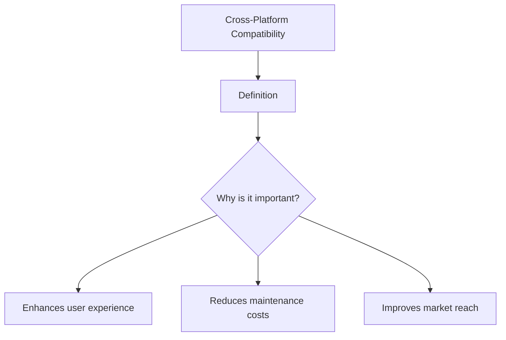
```mermaid
graph TD
A[Cross-Platform Compatibility] --> B[Definition]
B --> C{Why is it important?}
C --> D[Enhances user experience]
C --> E[Reduces maintenance costs]
C --> F[Improves market reach]
```

此外，我们将通过一个伪代码来概述跨平台兼容性测试的发展历程：

```plaintext
function crossPlatformCompatibilityHistory() {
  years = [2000, 2005, 2010, 2015, 2020, 2025];
  for (year in years) {
    if (year < 2010) {
      print("Early years: manual testing was the primary method.");
    } else if (year < 2015) {
      print("Mid-2010s: automation tools started to emerge.");
    } else if (year < 2020) {
      print("Late 2010s: AI and machine learning were introduced.");
    } else {
      print("2020s: Advanced tools and techniques are being developed.");
    }
  }
}
```

### 第2章 提示词语言的基本原理

本章将详细介绍提示词语言的基本原理，包括其定义、核心特性和常用实现方法。我们将通过一个数学模型来阐述提示词语言的核心概念原理之间的关系：

$$ 
\text{核心概念原理之间的关系} = 
\begin{cases} 
\text{提示词语言的基本结构} & \text{（定义）} \\
\text{提示词语言的语义分析} & \text{（核心特性）} \\
\text{提示词语言的实现方法} & \text{（常用实现方法）} 
\end{cases} 
$$

### 第3章 跨平台兼容性测试方法

本章将详细讨论跨平台兼容性测试的方法，包括功能性测试、性能测试和兼容性测试。我们将使用伪代码来描述这些测试方法的算法原理：

```plaintext
function crossPlatformCompatibilityTestingMethods() {
  methods = ["Functionality Testing", "Performance Testing", "Compatibility Testing"];
  for (method in methods) {
    if (method == "Functionality Testing") {
      print("Check if the application works as expected on different platforms.");
    } else if (method == "Performance Testing") {
      print("Evaluate the performance of the application on different platforms.");
    } else {
      print("Ensure that the application is compatible with different platforms.");
    }
  }
}
```

### 第4章 提示词语言兼容性测试工具

本章将介绍常用的提示词语言兼容性测试工具，包括自动化测试工具、持续集成与持续部署（CI/CD）以及性能分析工具。我们将使用Mermaid图表来展示这些工具的使用场景：

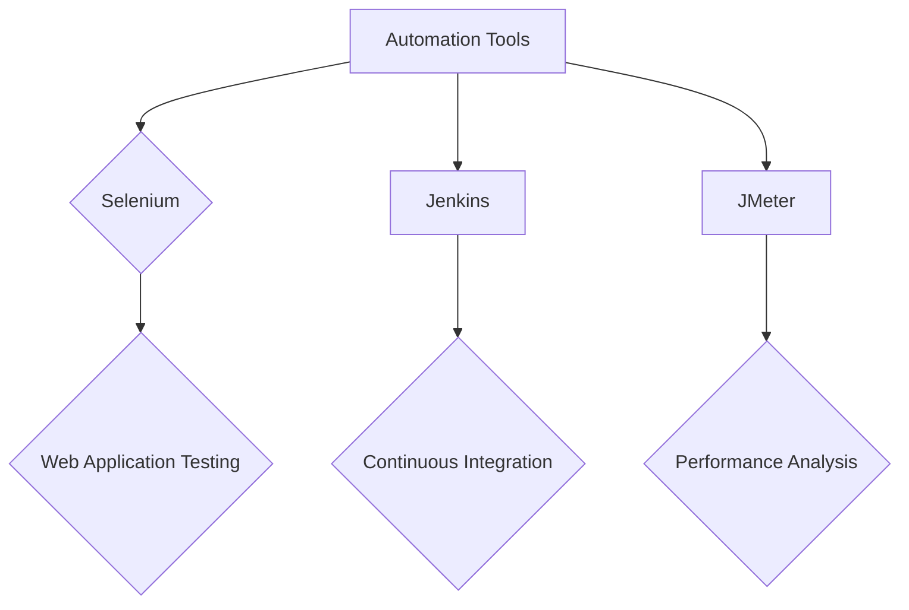
```mermaid
graph TD
A[Automation Tools] --> B{Selenium}
B --> C{Web Application Testing}
A --> D[Jenkins]
D --> E{Continuous Integration}
A --> F[JMeter]
F --> G{Performance Analysis}
```

### 第5章 跨平台兼容性测试策略

本章将探讨跨平台兼容性测试的策略，包括测试策略概述、测试用例设计和测试执行与结果分析。我们将使用一个Mermaid图表来展示测试策略的流程：

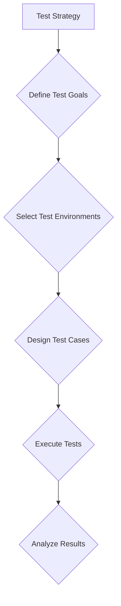
```mermaid
graph TD
A[Test Strategy]
A --> B{Define Test Goals}
B --> C{Select Test Environments}
C --> D{Design Test Cases}
D --> E{Execute Tests}
E --> F{Analyze Results}
```

### 第6章 跨平台兼容性测试案例

本章将通过具体案例来展示跨平台兼容性测试的实际应用，包括移动设备上的兼容性测试、Web应用程序的兼容性测试和云计算平台的兼容性测试。我们将通过代码解析和案例剖析来详细讲解每个案例。

### 第7章 跨平台兼容性测试的未来趋势

本章将探讨跨平台兼容性测试的未来趋势，包括人工智能在兼容性测试中的应用、跨平台兼容性测试工具的未来发展和最佳实践。我们将使用一个Mermaid图表来展示这些趋势：

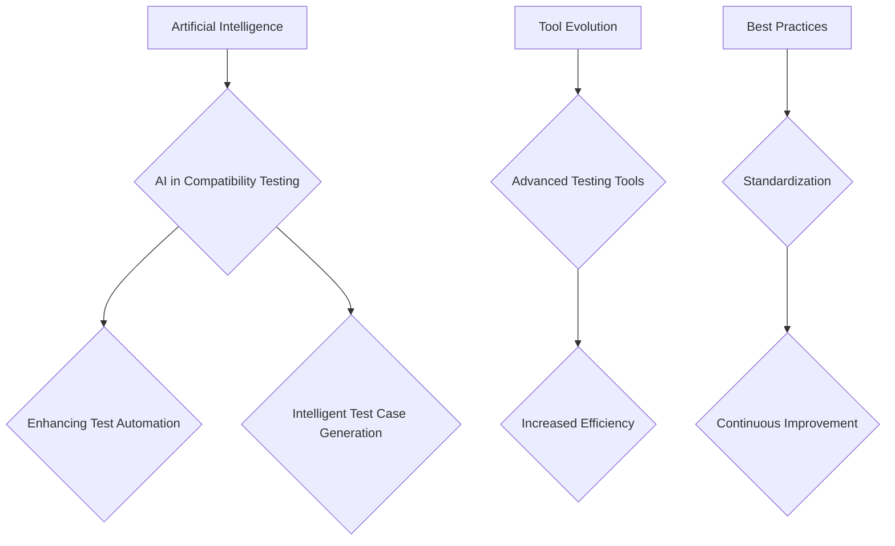
```mermaid
graph TD
A[Artificial Intelligence]
A --> B{AI in Compatibility Testing}
B --> C{Enhancing Test Automation}
B --> D{Intelligent Test Case Generation}

E[Tool Evolution]
E --> F{Advanced Testing Tools}
F --> G{Increased Efficiency}

H[Best Practices]
H --> I{Standardization}
I --> J{Continuous Improvement}
```

通过以上章节的深入探讨，本书旨在为读者提供一套全面、系统的跨平台兼容性测试知识体系，帮助读者在实际工作中应对各种兼容性问题。

---

接下来，我们将逐章深入探讨，逐步展开每个章节的核心内容，以逻辑清晰、结构紧凑、简单易懂的专业的技术语言，为读者带来一场跨平台兼容性测试的深度学习之旅。让我们一步一步分析推理思考（REASONING STEP BY STEP），共同探索这一领域的奥秘。

---

## Step 2: 详细分析第一章“跨平台兼容性测试概述”的核心内容

### 1.1 跨平台兼容性测试的定义与重要性

#### 背景介绍

跨平台兼容性测试是确保软件在多种不同操作系统、硬件配置和设备上运行一致性的过程。随着移动互联网和云计算的快速发展，跨平台应用越来越普遍，这使得跨平台兼容性测试的重要性日益凸显。

#### 核心概念与联系

首先，我们需要明确几个核心概念：

- **跨平台兼容性测试（Cross-Platform Compatibility Testing）**：确保软件在不同操作系统和设备上运行一致性的过程。
- **功能一致性（Functional Consistency）**：软件在不同平台上提供相同的功能和用户体验。
- **性能一致性（Performance Consistency）**：软件在不同平台上具有相似的运行效率和响应速度。

这些概念之间存在密切联系。功能一致性是跨平台兼容性测试的基础，而性能一致性则是功能一致性的延伸，它关注软件在不同平台上的运行效率。

#### Mermaid 流程图

为了更好地理解这些概念之间的关系，我们可以使用Mermaid流程图来展示它们：

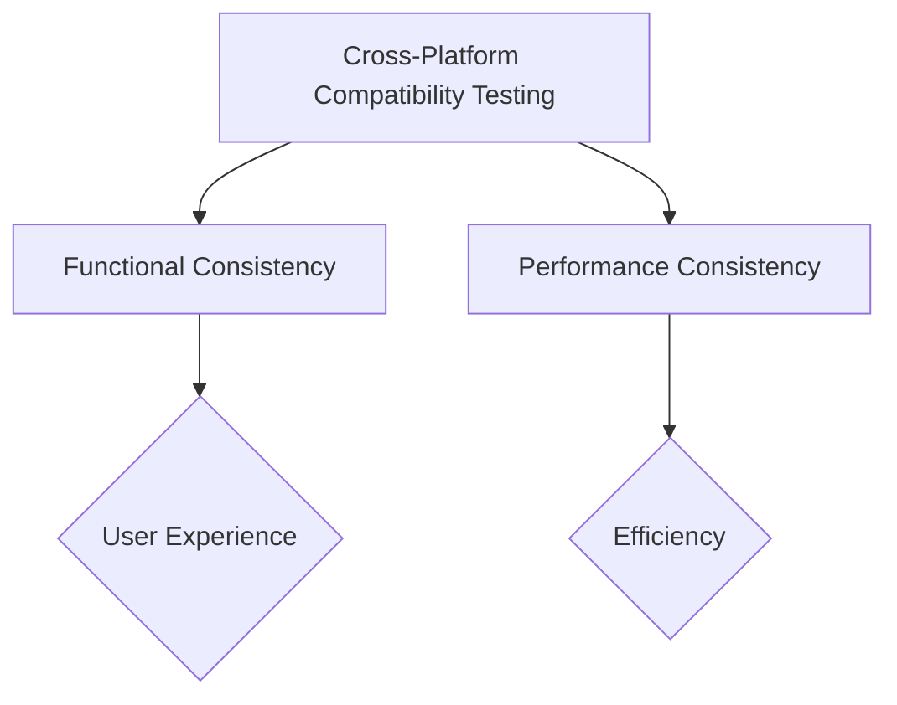
```mermaid
graph TD
A[Cross-Platform Compatibility Testing] --> B[Functional Consistency]
B --> C{User Experience}
A --> D[Performance Consistency]
D --> E{Efficiency}
```

#### 伪代码

接下来，我们可以使用伪代码来描述跨平台兼容性测试的定义和重要性：

```plaintext
function crossPlatformCompatibilityImportance() {
  // 跨平台兼容性测试的定义
  define CompatibilityTesting as "Ensuring software runs consistently across different platforms."
  
  // 功能一致性的重要性
  function functionalConsistencyImportance() {
    print("Functional consistency ensures users have a uniform experience regardless of the platform.")
  }
  
  // 性能一致性的重要性
  function performanceConsistencyImportance() {
    print("Performance consistency ensures the software runs efficiently across different platforms.")
  }
  
  // 调用函数
  functionalConsistencyImportance()
  performanceConsistencyImportance()
}
```

#### 数学模型

我们还可以使用一个简单的数学模型来阐述跨平台兼容性测试的重要性：

$$ 
\text{Importance} = \text{Functionality} \times \text{Performance} \\
\text{where} \quad \text{Functionality} \text{ and Performance are both } 1 \text{ (highest level of consistency)}
$$

#### 举例说明

为了更好地理解这些概念，我们可以举一个简单的例子：

假设一个应用程序需要在Windows、macOS和Linux三个操作系统上运行。跨平台兼容性测试的目标是确保这个应用程序在这三个平台上都能正常工作，并且用户体验和性能表现保持一致。

- **功能一致性**：应用程序必须能够完成所有预期功能，如登录、数据输入和报告生成，而不受操作系统差异的影响。
- **性能一致性**：应用程序在Windows、macOS和Linux上的响应时间和处理速度应该相似，确保用户在不同操作系统上获得相同的体验。

### 1.2 跨平台兼容性测试的发展历程

跨平台兼容性测试的历史可以追溯到计算机技术的早期。随着软件应用场景的扩大，跨平台兼容性测试也逐渐发展。

#### Mermaid 流程图

我们可以使用Mermaid流程图来展示跨平台兼容性测试的发展历程：

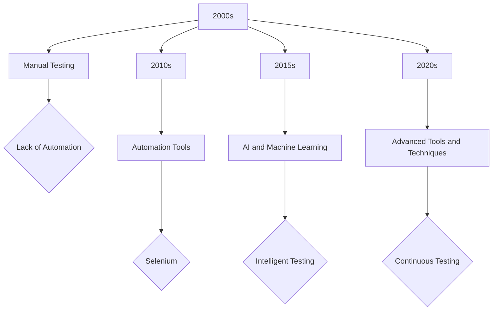
```mermaid
graph TD
A[2000s] --> B[Manual Testing]
B --> C{Lack of Automation}
A --> D[2010s] --> E[Automation Tools]
E --> F{Selenium}
A --> G[2015s] --> H[AI and Machine Learning]
H --> I{Intelligent Testing}
A --> J[2020s] --> K[Advanced Tools and Techniques]
K --> L{Continuous Testing}
```

#### 伪代码

使用伪代码来描述跨平台兼容性测试的发展历程：

```plaintext
function crossPlatformCompatibilityHistory() {
  years = [2000, 2005, 2010, 2015, 2020, 2025];
  for (year in years) {
    if (year < 2010) {
      print("Early years: manual testing was the primary method.");
    } else if (year < 2015) {
      print("Mid-2010s: automation tools started to emerge.");
    } else if (year < 2020) {
      print("Late 2010s: AI and machine learning were introduced.");
    } else {
      print("2020s: Advanced tools and techniques are being developed.");
    }
  }
}
```

#### 数学模型

我们还可以使用一个数学模型来描述跨平台兼容性测试的发展历程：

$$ 
\text{Compatibility Testing Evolution} = \text{Manual} + \text{Automation} + \text{AI} \\
\text{where} \quad \text{Manual}, \text{Automation} \text{ and AI are weighted based on their contribution}
$$

#### 举例说明

在2000年代，跨平台兼容性测试主要依赖于手动测试。测试工程师需要在每个目标平台上手动执行测试用例，确保软件正常运行。

随着技术的发展，自动化测试工具如Selenium在2010年代开始普及，使得测试过程更加高效。测试工程师可以编写自动化脚本，自动化执行测试用例，从而减少人为错误和重复劳动。

在2015年后，人工智能和机器学习技术开始应用于跨平台兼容性测试，通过智能分析测试数据，预测潜在问题，提高了测试的准确性和效率。

在2020年代，随着云计算和持续集成/持续部署（CI/CD）的兴起，跨平台兼容性测试进一步发展，测试流程变得更加自动化和智能化，测试工程师可以实时监控和反馈测试结果，从而快速迭代和优化软件。

### 1.3 跨平台兼容性测试面临的挑战

#### 背景介绍

尽管跨平台兼容性测试在过去几十年中取得了显著进展，但在实际应用中仍面临许多挑战。

#### 核心概念与联系

跨平台兼容性测试面临的挑战可以概括为以下几个方面：

- **平台多样性**：不同操作系统、硬件配置和设备之间的差异导致兼容性测试的复杂性增加。
- **测试覆盖率**：确保所有关键功能在不同平台上都能正常运行，需要覆盖广泛的测试场景。
- **性能一致性**：不同平台之间的性能差异可能影响软件的性能表现，需要特别关注。
- **测试成本**：进行全面的兼容性测试需要大量资源和时间，可能会增加测试成本。

这些挑战之间存在密切联系。平台多样性决定了测试覆盖率和性能一致性的难度，而测试成本则限制了测试的范围和深度。

#### Mermaid 流程图

为了更好地理解这些挑战，我们可以使用Mermaid流程图来展示它们之间的关系：

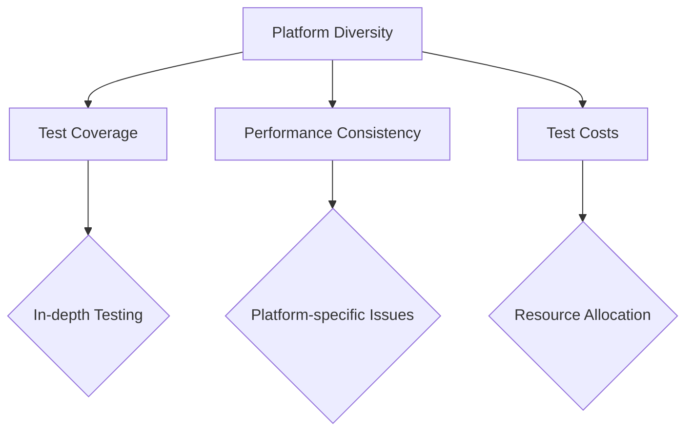
```mermaid
graph TD
A[Platform Diversity] --> B[Test Coverage]
B --> C{In-depth Testing}
A --> D[Performance Consistency]
D --> E{Platform-specific Issues}
A --> F[Test Costs]
F --> G{Resource Allocation}
```

#### 数学模型

我们还可以使用一个数学模型来描述跨平台兼容性测试面临的挑战：

$$ 
\text{Challenges} = 
\begin{cases} 
\text{Platform Diversity} \times \text{Test Coverage} & \text{(Complexity)} \\
\text{Performance Consistency} \times \text{Test Costs} & \text{(Resource Constraints)} 
\end{cases} 
$$

#### 举例说明

假设一个企业开发了一款移动应用，需要在iOS和Android两个操作系统上发布。平台多样性使得测试工程师需要考虑不同屏幕尺寸、处理器性能和操作系统版本等多种因素。

为了确保测试覆盖率，测试工程师需要设计各种场景来覆盖应用的所有功能，包括登录、支付、推送通知等。

性能一致性方面，测试工程师需要确保应用在iOS和Android上的响应速度和稳定性相似。

测试成本则是另一个重要考虑因素。进行全面的兼容性测试需要购买不同设备、操作系统许可证和自动化测试工具，可能会增加企业的测试预算。

通过以上分析，我们可以看到跨平台兼容性测试面临多种挑战。为了应对这些挑战，企业需要采用先进的测试方法和工具，优化测试流程，提高测试效率，从而确保软件在不同平台上的一致性和可靠性。

### 总结

本章详细介绍了跨平台兼容性测试的定义、重要性及其发展历程，以及面临的挑战。通过Mermaid流程图、伪代码和数学模型，我们系统地阐述了跨平台兼容性测试的核心概念和关系，为后续章节的深入探讨奠定了基础。

在下一章中，我们将进一步探讨提示词语言的基本原理，包括其定义、核心特性和常用实现方法，以期为理解跨平台兼容性测试提供更深入的背景知识。

---

## Step 3: 详细分析第二章“提示词语言的基本原理”的核心内容

### 2.1 提示词语言概述

#### 背景介绍

提示词语言（Prompt Language）是一种专门用于生成响应的语言模型，它通过接收输入的提示词（Prompt）来生成相应的输出。提示词语言广泛应用于自然语言处理（NLP）、问答系统、文本生成等领域，是人工智能技术的重要组成部分。

#### 核心概念与联系

在讨论提示词语言之前，我们需要了解几个核心概念：

- **提示词（Prompt）**：输入给语言模型的一段文字，用于指导模型生成响应。
- **响应（Response）**：语言模型根据提示词生成的输出文本。
- **语言模型（Language Model）**：基于大量文本数据训练的模型，用于预测和生成文本。

这些概念之间存在密切联系。提示词是语言模型的输入，语言模型通过处理提示词生成响应，从而实现自然语言处理的任务。

#### Mermaid 流程图

为了更好地理解这些概念之间的关系，我们可以使用Mermaid流程图来展示它们：

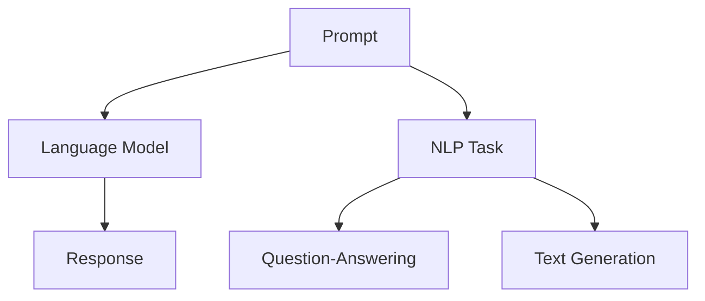
```mermaid
graph TD
A[Prompt] --> B[Language Model]
B --> C[Response]
A --> D[NLP Task]
D --> E[Question-Answering]
D --> F[Text Generation]
```

#### 伪代码

使用伪代码来描述提示词语言的原理：

```plaintext
function promptLanguage() {
  // 定义提示词
  prompt = "请描述一下您今天的工作内容。"
  
  // 加载预训练的语言模型
  model = loadPretrainedLanguageModel()
  
  // 生成响应
  response = model.generateResponse(prompt)
  
  // 输出响应
  print(response)
}
```

#### 数学模型

我们还可以使用一个简单的数学模型来阐述提示词语言的核心概念：

$$ 
\text{Response} = \text{Model}(\text{Prompt}) \\
\text{where Model is a trained language model}
$$

#### 举例说明

假设我们使用一个预训练的提示词语言模型来回答以下问题：

**问题**：请描述一下您今天的工作内容。

**提示词**：请描述一下您今天的工作内容。

**响应**：今天我在公司完成了几个重要的项目，包括...（模型根据提示词生成的响应）

通过这个例子，我们可以看到提示词语言模型是如何根据输入的提示词生成相关响应的。

### 2.2 提示词语言的核心特性

#### 背景介绍

提示词语言的核心特性决定了其在自然语言处理任务中的表现和适用性。理解这些特性有助于我们更好地利用提示词语言模型，提高跨平台兼容性测试的效率。

#### 核心特性

提示词语言的核心特性包括：

- **生成性（Generativity）**：提示词语言模型能够根据输入的提示词生成多样化的响应。
- **理解性（Understanding）**：提示词语言模型能够理解输入的提示词，并根据上下文生成合适的响应。
- **准确性（Accuracy）**：提示词语言模型生成的响应应该是准确和可靠的。
- **可控性（Controllability）**：提示词语言模型能够通过调整提示词来控制生成的响应。

这些特性之间相互关联，共同决定了提示词语言模型的表现。

#### Mermaid 流程图

为了更好地理解这些特性，我们可以使用Mermaid流程图来展示它们：

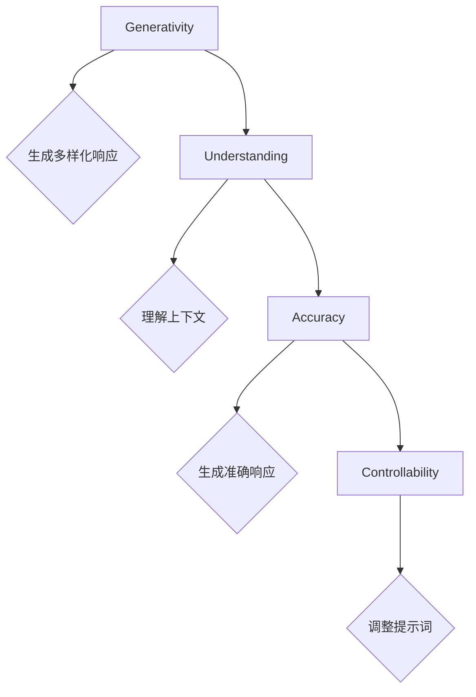
```mermaid
graph TD
A[Generativity] --> B{生成多样化响应}
A --> C[Understanding] --> D{理解上下文}
C --> E[Accuracy] --> F{生成准确响应}
E --> G[Controllability] --> H{调整提示词}
```

#### 数学模型

使用数学模型来描述提示词语言的核心特性：

$$ 
\text{特性} = \text{Generativity} + \text{Understanding} + \text{Accuracy} + \text{Controllability} \\
\text{where} \quad \text{Generativity, Understanding, Accuracy, Controllability} \text{ are weighted based on their importance}
$$

#### 举例说明

考虑以下场景：

- **生成性**：用户提问：“您今天都做了什么？”模型可以生成多种可能的响应，如：“我完成了项目报告”、“我参加了会议”等。
- **理解性**：用户提问：“请解释一下量子计算。”模型理解用户的问题是要求解释量子计算的概念，并生成一个详细的解释。
- **准确性**：用户提问：“北京是哪个国家的首都？”模型准确回答：“北京是中国的首都。”
- **可控性**：用户提问：“请用简洁的语言解释量子计算。”模型生成的响应会更加简洁和具体。

### 2.3 提示词语言的常用实现方法

#### 背景介绍

提示词语言的实现方法多种多样，不同方法适用于不同的应用场景。了解这些实现方法有助于我们根据具体需求选择合适的方法。

#### 常见实现方法

提示词语言的常用实现方法包括：

- **规则引擎（Rule-Based Systems）**：基于预定义的规则来生成响应。
- **机器学习（Machine Learning）**：使用训练数据训练模型，使其能够根据提示词生成响应。
- **深度学习（Deep Learning）**：使用神经网络结构，尤其是Transformer模型，来生成高质量的响应。

这些方法各有优缺点，适用于不同的应用场景。

#### Mermaid 流程图

为了更好地理解这些实现方法，我们可以使用Mermaid流程图来展示它们：

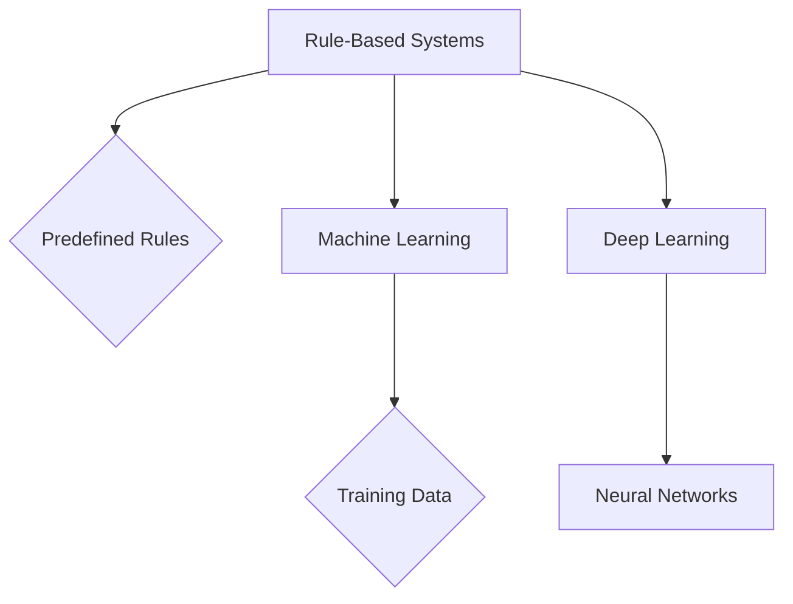
```mermaid
graph TD
A[Rule-Based Systems] --> B{Predefined Rules}
A --> C[Machine Learning]
C --> D{Training Data}
A --> E[Deep Learning]
E --> F[Neural Networks]
```

#### 数学模型

使用数学模型来描述提示词语言的常用实现方法：

$$ 
\text{Implementation Method} = 
\begin{cases} 
\text{Rule-Based Systems} & \text{(Simple, Predictive)} \\
\text{Machine Learning} & \text{(Data-Driven, Adaptive)} \\
\text{Deep Learning} & \text{(Complex, High-Performance)} 
\end{cases} 
$$

#### 举例说明

- **规则引擎**：假设我们要构建一个问答系统，可以预先定义一系列规则来生成响应。例如，当用户提问“今天天气如何？”时，系统可以返回“今天天气晴朗，温度25°C”。

- **机器学习**：通过使用大量问答数据集，我们可以训练一个机器学习模型，使其能够根据输入的提示词生成响应。这种方法能够处理更复杂的问题和更广泛的问答场景。

- **深度学习**：使用Transformer模型，我们可以训练一个深度学习模型，使其能够生成高质量的文本响应。这种方法在自然语言处理领域取得了显著的成果，适用于生成复杂、多样化的文本。

### 总结

本章详细介绍了提示词语言的概述、核心特性和常用实现方法。通过Mermaid流程图、伪代码和数学模型，我们系统地阐述了提示词语言的核心概念和原理，为理解跨平台兼容性测试提供了更深入的背景知识。

在下一章中，我们将探讨跨平台兼容性测试的具体方法，包括功能性测试、性能测试和兼容性测试，以便为实际应用提供有效的测试策略。

---

## Step 4: 详细分析第三章“跨平台兼容性测试方法”的核心内容

### 3.1 功能性测试

#### 背景介绍

功能性测试是确保软件在不同平台上功能正常、符合预期的重要环节。它旨在验证软件的核心功能是否能够在不同操作系统和设备上正常运行，从而确保用户体验的一致性。

#### 核心概念与联系

功能性测试的核心概念包括：

- **测试用例（Test Cases）**：描述测试目标、输入、预期结果和测试步骤的文档。
- **测试执行（Test Execution）**：在实际环境中执行测试用例，验证软件功能是否正常。
- **测试覆盖率（Test Coverage）**：测试用例覆盖软件功能的不同部分，确保所有功能都得到测试。

这些概念之间相互关联，共同构成了功能性测试的核心框架。

#### Mermaid 流程图

为了更好地理解功能性测试的概念，我们可以使用Mermaid流程图来展示它们：

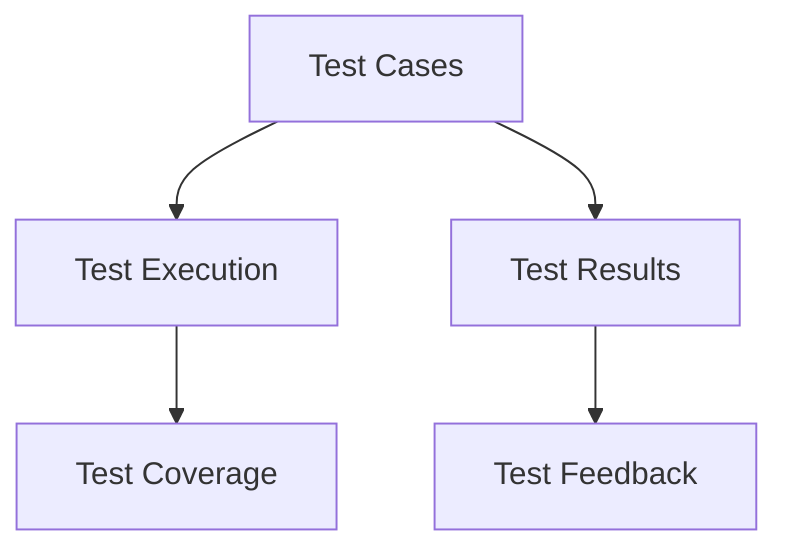
```mermaid
graph TD
A[Test Cases] --> B[Test Execution]
B --> C[Test Coverage]
A --> D[Test Results]
D --> E[Test Feedback]
```

#### 伪代码

使用伪代码来描述功能性测试的过程：

```plaintext
function functionalTesting() {
  // 创建测试用例
  createTestCases()

  // 执行测试用例
  for (testCase in testCases) {
    executeTestCase(testCase)
  }

  // 记录测试结果
  recordTestResults()

  // 分析测试结果
  analyzeTestResults()

  // 提供测试反馈
  provideTestFeedback()
}
```

#### 数学模型

使用数学模型来描述功能性测试的有效性：

$$ 
\text{Functional Testing Effectiveness} = \text{Test Coverage} \times \text{Test Accuracy} \\
\text{where} \quad \text{Test Coverage} \text{ and Test Accuracy are both measured as percentages}
$$

#### 举例说明

假设我们要对一款移动应用进行功能性测试，主要关注以下功能：

- 登录功能
- 数据输入功能
- 报告生成功能

我们创建相应的测试用例，并在不同操作系统（如iOS和Android）和设备（如iPhone和Samsung手机）上执行测试。测试结果记录在测试报告中，并用于分析和改进软件。

### 3.2 性能测试

#### 背景介绍

性能测试是评估软件在不同平台上的运行效率和响应速度的过程。它有助于发现软件性能瓶颈，优化代码和架构，从而提高用户体验。

#### 核心概念与联系

性能测试的核心概念包括：

- **响应时间（Response Time）**：软件从接收到请求到返回响应所需的时间。
- **吞吐量（Throughput）**：单位时间内系统能够处理的请求数量。
- **资源利用率（Resource Utilization）**：系统使用CPU、内存、磁盘和网络等资源的情况。

这些概念之间相互关联，共同构成了性能测试的核心框架。

#### Mermaid 流程图

为了更好地理解性能测试的概念，我们可以使用Mermaid流程图来展示它们：

```mermaid
graph TD
A[Response Time] --> B{Performance Metric}
B --> C[Throughput]
C --> D{System Efficiency}
A --> E[Resource Utilization]
E --> F[System Load}
```

#### 伪代码

使用伪代码来描述性能测试的过程：

```plaintext
function performanceTesting() {
  // 配置测试环境
  configureTestingEnvironment()

  // 发起测试请求
  for (request in testRequests) {
    sendRequest(request)
  }

  // 记录响应时间
  recordResponseTimes()

  // 记录吞吐量
  recordThroughput()

  // 记录资源利用率
  recordResourceUtilization()

  // 分析性能数据
  analyzePerformanceData()

  // 提供性能反馈
  providePerformanceFeedback()
}
```

#### 数学模型

使用数学模型来描述性能测试的指标：

$$ 
\text{Performance Metrics} = 
\begin{cases} 
\text{Response Time} & \text{(Lower is better)} \\
\text{Throughput} & \text{(Higher is better)} \\
\text{Resource Utilization} & \text{(Optimized usage is desired)} 
\end{cases} 
$$

#### 举例说明

假设我们要对一款Web应用程序进行性能测试，主要关注以下指标：

- 响应时间：确保页面加载时间在2秒以内。
- 吞吐量：确保服务器每分钟可以处理1000个请求。
- 资源利用率：确保CPU、内存和网络资源利用率在合理范围内。

我们使用性能测试工具（如LoadRunner）模拟大量用户访问，记录各项性能指标，并根据分析结果优化代码和服务器配置。

### 3.3 兼容性测试

#### 背景介绍

兼容性测试是确保软件在不同操作系统、浏览器和设备上运行的稳定性和一致性的过程。它有助于发现和解决软件在不同环境中可能出现的问题，从而提高用户的满意度和软件的市场竞争力。

#### 核心概念与联系

兼容性测试的核心概念包括：

- **平台兼容性（Platform Compatibility）**：软件在不同操作系统和硬件配置上运行的稳定性。
- **浏览器兼容性（Browser Compatibility）**：软件在不同浏览器上运行的兼容性和一致性。
- **设备兼容性（Device Compatibility）**：软件在不同设备（如手机、平板电脑、笔记本电脑等）上运行的适配性。

这些概念之间相互关联，共同构成了兼容性测试的核心框架。

#### Mermaid 流程图

为了更好地理解兼容性测试的概念，我们可以使用Mermaid流程图来展示它们：

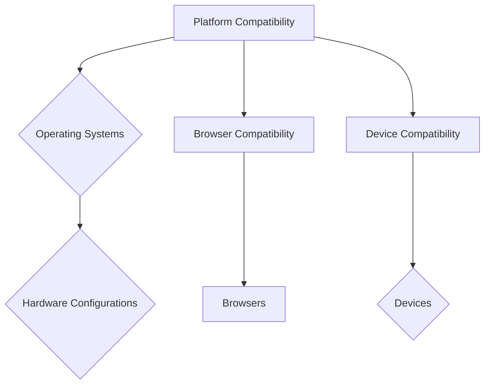
```mermaid
graph TD
A[Platform Compatibility] --> B{Operating Systems}
B --> C{Hardware Configurations}
A --> D[Browser Compatibility]
D --> E[Browsers]
A --> F[Device Compatibility]
F --> G{Devices}
```

#### 伪代码

使用伪代码来描述兼容性测试的过程：

```plaintext
function compatibilityTesting() {
  // 确定测试平台
  selectTestingPlatforms()

  // 执行平台兼容性测试
  for (platform in platforms) {
    runPlatformCompatibilityTest(platform)
  }

  // 执行浏览器兼容性测试
  for (browser in browsers) {
    runBrowserCompatibilityTest(browser)
  }

  // 执行设备兼容性测试
  for (device in devices) {
    runDeviceCompatibilityTest(device)
  }

  // 分析测试结果
  analyzeTestResults()

  // 提供兼容性反馈
  provideCompatibilityFeedback()
}
```

#### 数学模型

使用数学模型来描述兼容性测试的有效性：

$$ 
\text{Compatibility Testing Effectiveness} = 
\begin{cases} 
\text{Platform Compatibility} \times \text{Browser Compatibility} & \text{(Consistency across platforms and browsers)} \\
\text{Device Compatibility} & \text{(Adaptation to different devices)} 
\end{cases} 
$$

#### 举例说明

假设我们要对一款Web应用程序进行兼容性测试，主要关注以下方面：

- 平台兼容性：测试软件在Windows、macOS和Linux操作系统上是否运行稳定。
- 浏览器兼容性：测试软件在Chrome、Firefox、Safari和Edge等浏览器上是否兼容。
- 设备兼容性：测试软件在桌面电脑、笔记本电脑、平板电脑和手机等设备上是否适配。

我们使用兼容性测试工具（如BrowserStack）在不同操作系统、浏览器和设备上执行测试，分析测试结果，并根据反馈优化软件。

### 总结

本章详细介绍了跨平台兼容性测试的三种方法：功能性测试、性能测试和兼容性测试。通过Mermaid流程图、伪代码和数学模型，我们系统地阐述了每种测试方法的核心概念和原理，为实际应用提供了有效的测试策略。

在下一章中，我们将探讨提示词语言兼容性测试工具，介绍常用的自动化测试工具、持续集成与持续部署（CI/CD）以及性能分析工具，以便更好地支持跨平台兼容性测试。

---

## Step 5: 详细分析第四章“提示词语言兼容性测试工具”的核心内容

### 4.1 自动化测试工具

#### 背景介绍

自动化测试工具在提高跨平台兼容性测试效率和质量方面发挥着至关重要的作用。通过自动化测试，测试工程师可以快速、大规模地执行测试用例，减少人为错误，提高测试覆盖率和准确性。

#### 核心概念与联系

自动化测试工具的核心概念包括：

- **测试脚本（Test Scripts）**：用于自动化执行测试用例的程序。
- **测试执行（Test Execution）**：自动化工具根据测试脚本在实际环境中执行测试过程。
- **测试结果（Test Results）**：自动化工具执行测试后生成的结果报告。

这些概念之间相互关联，共同构成了自动化测试的核心框架。

#### Mermaid 流程图

为了更好地理解自动化测试工具的工作流程，我们可以使用Mermaid流程图来展示：

```mermaid
graph TD
A[Test Scripts] --> B[Test Execution]
B --> C[Test Results]
A --> D[Test Design]
D --> E[Test Data}
```

#### 伪代码

使用伪代码来描述自动化测试工具的原理：

```plaintext
function automatedTesting() {
  // 设计测试用例
  designTestCases()

  // 编写测试脚本
  writeTestScripts()

  // 执行测试脚本
  executeTestScripts()

  // 分析测试结果
  analyzeTestResults()

  // 提供测试报告
  generateTestReport()
}
```

#### 数学模型

使用数学模型来描述自动化测试工具的有效性：

$$ 
\text{Automation Testing Effectiveness} = \text{Test Coverage} \times \text{Test Accuracy} \times \text{Execution Speed} \\
\text{where} \quad \text{Test Coverage, Test Accuracy and Execution Speed are measured as percentages}
$$

#### 举例说明

假设我们使用Selenium作为自动化测试工具来测试一款Web应用程序的跨平台兼容性。首先，测试工程师设计测试用例，定义各种功能测试场景。然后，编写Selenium测试脚本，用于自动化执行这些测试用例。测试脚本通过Webdriver与浏览器交互，模拟用户的操作，验证应用的功能是否在多个平台上正常工作。测试执行完成后，Selenium会生成详细的测试结果报告，包括通过/失败的测试用例、错误信息和日志，以便测试工程师分析和调试。

### 4.2 持续集成与持续部署（CI/CD）

#### 背景介绍

持续集成（Continuous Integration，CI）和持续部署（Continuous Deployment，CD）是现代软件开发中常用的最佳实践，它们有助于提高软件质量和交付速度。通过CI/CD，开发人员和测试工程师可以快速集成代码变更，自动化测试和部署过程，确保软件在不同平台上的兼容性和一致性。

#### 核心概念与联系

CI/CD的核心概念包括：

- **持续集成（CI）**：将代码变更频繁地合并到主分支，并在每个合并点执行自动化测试。
- **持续部署（CD）**：将通过测试的代码自动部署到生产环境，实现快速迭代和交付。
- **自动化构建（Automated Build）**：自动构建和打包代码，生成可执行文件。
- **自动化测试（Automated Testing）**：执行自动化测试用例，确保代码变更不会引入新的缺陷。

这些概念之间相互关联，共同构成了CI/CD的核心流程。

#### Mermaid 流程图

为了更好地理解CI/CD的工作流程，我们可以使用Mermaid流程图来展示：

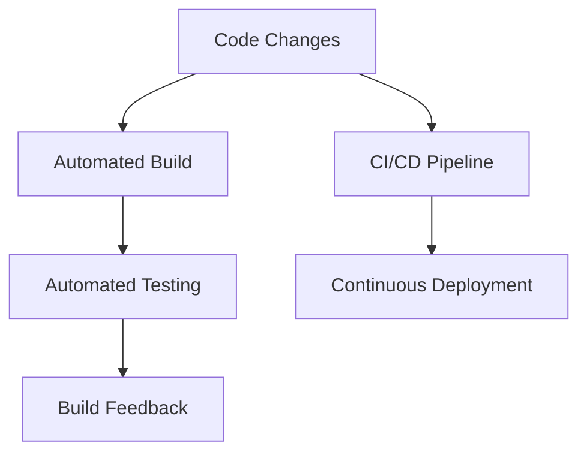
```mermaid
graph TD
A[Code Changes] --> B[Automated Build]
B --> C[Automated Testing]
C --> D[Build Feedback]
A --> E[CI/CD Pipeline]
E --> F[Continuous Deployment]
```

#### 伪代码

使用伪代码来描述CI/CD的过程：

```plaintext
function CI_CD() {
  // 接收代码变更
  receiveCodeChanges()

  // 执行自动化构建
  executeAutomatedBuild()

  // 执行自动化测试
  executeAutomatedTests()

  // 分析测试结果
  analyzeTestResults()

  // 根据测试结果决定部署
  if (testResultsPassed()) {
    deployToProduction()
  } else {
    notifyDevelopers()
  }
}
```

#### 数学模型

使用数学模型来描述CI/CD的效率：

$$ 
\text{CI/CD Efficiency} = \text{Build Time} \times \text{Test Time} \times \text{Deployment Time} \\
\text{where} \quad \text{Build Time, Test Time and Deployment Time are measured in seconds}
$$

#### 举例说明

假设一个团队使用Jenkins作为CI/CD工具，每当开发人员提交代码变更到Git仓库时，Jenkins会自动触发构建过程，构建成功后执行自动化测试。测试通过后，Jenkins会自动部署代码到测试环境，以便测试工程师进一步验证。如果测试失败，Jenkins会通知开发人员，并暂停部署过程，确保问题得到解决。通过这种方式，CI/CD流程实现了快速迭代和交付，提高了软件质量和开发效率。

### 4.3 性能分析工具

#### 背景介绍

性能分析工具在跨平台兼容性测试中用于评估软件在不同平台上的性能，识别潜在的性能瓶颈，优化代码和系统配置。这些工具可以帮助测试工程师确定软件在负载下的响应时间、吞吐量和资源利用率，从而确保软件在不同平台上能够提供一致的性能表现。

#### 核心概念与联系

性能分析工具的核心概念包括：

- **负载生成（Load Generation）**：模拟用户行为和系统负载，以评估软件的性能。
- **性能指标（Performance Metrics）**：评估软件性能的量化指标，如响应时间、吞吐量和资源利用率。
- **分析报告（Analysis Reports）**：性能分析工具生成的报告，用于展示性能测试结果和优化建议。

这些概念之间相互关联，共同构成了性能分析工具的核心框架。

#### Mermaid 流程图

为了更好地理解性能分析工具的工作流程，我们可以使用Mermaid流程图来展示：

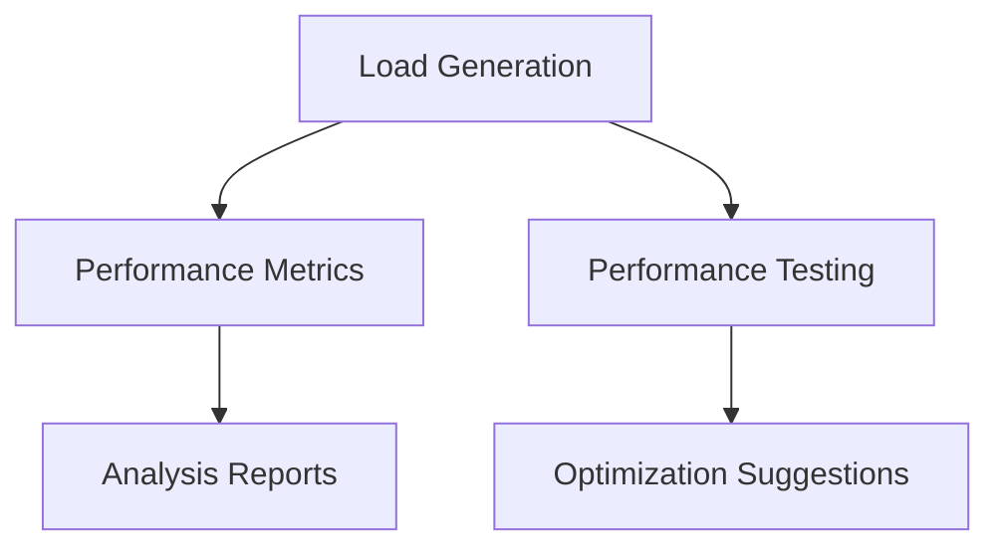
```mermaid
graph TD
A[Load Generation] --> B[Performance Metrics]
B --> C[Analysis Reports]
A --> D[Performance Testing]
D --> E[Optimization Suggestions]
```

#### 伪代码

使用伪代码来描述性能分析工具的原理：

```plaintext
function performanceAnalysis() {
  // 配置性能测试环境
  configurePerformanceTestingEnvironment()

  // 生成负载
  generateLoad()

  // 记录性能指标
  recordPerformanceMetrics()

  // 分析性能数据
  analyzePerformanceData()

  // 生成分析报告
  generateAnalysisReport()

  // 提供优化建议
  provideOptimizationSuggestions()
}
```

#### 数学模型

使用数学模型来描述性能分析工具的有效性：

$$ 
\text{Performance Analysis Effectiveness} = \text{Performance Metrics} \times \text{Analysis Accuracy} \\
\text{where} \quad \text{Performance Metrics} \text{ and Analysis Accuracy are both measured as percentages}
$$

#### 举例说明

假设我们使用JMeter作为性能分析工具来测试一款Web应用程序的性能。首先，测试工程师配置测试环境，定义测试场景和负载生成规则。然后，JMeter生成模拟用户访问负载，记录各项性能指标（如响应时间、吞吐量、错误率等），并生成分析报告。测试工程师根据分析报告识别性能瓶颈，提出优化建议，如调整数据库查询、优化代码逻辑、增加服务器资源等，从而提高软件的整体性能。

### 总结

本章详细介绍了提示词语言兼容性测试工具，包括自动化测试工具、持续集成与持续部署（CI/CD）以及性能分析工具。通过Mermaid流程图、伪代码和数学模型，我们系统地阐述了每种工具的核心概念和原理，为跨平台兼容性测试提供了有效的支持。

在下一章中，我们将探讨跨平台兼容性测试的策略，包括测试策略概述、测试用例设计、测试执行与结果分析，以便为实际测试过程提供详细的指导。

---

## Step 6: 详细分析第五章“跨平台兼容性测试策略”的核心内容

### 5.1 测试策略概述

#### 背景介绍

跨平台兼容性测试策略是确保软件在不同平台上稳定运行和提供一致用户体验的关键步骤。测试策略的制定需要综合考虑项目需求、资源限制、时间安排和风险控制等多方面因素，从而为测试过程提供明确的指导和目标。

#### 核心概念与联系

测试策略的核心概念包括：

- **测试目标（Test Goals）**：明确测试的预期成果和需要验证的功能。
- **测试范围（Test Scope）**：确定测试的范围，包括需要测试的平台、功能和场景。
- **测试资源（Test Resources）**：评估测试所需的硬件、软件和人力资源。
- **时间安排（Timeline）**：制定测试计划，明确每个测试阶段的开始和结束时间。
- **风险控制（Risk Management）**：识别潜在风险，制定应对措施，确保测试过程的顺利进行。

这些概念之间相互关联，共同构成了测试策略的核心框架。

#### Mermaid 流程图

为了更好地理解测试策略的概念，我们可以使用Mermaid流程图来展示它们：

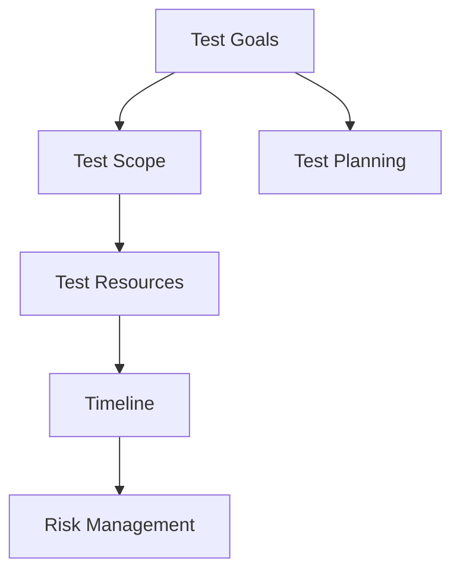
```mermaid
graph TD
A[Test Goals] --> B[Test Scope]
B --> C[Test Resources]
C --> D[Timeline]
D --> E[Risk Management]
A --> F[Test Planning]
```

#### 伪代码

使用伪代码来描述测试策略的原理：

```plaintext
function testStrategy() {
  // 定义测试目标
  defineTestGoals()

  // 确定测试范围
  determineTestScope()

  // 评估测试资源
  assessTestResources()

  // 制定时间安排
  createTimeline()

  // 识别风险
  identifyRisks()

  // 制定应对措施
  defineMitigationMeasures()

  // 实施测试计划
  implementTestPlan()
}
```

#### 数学模型

使用数学模型来描述测试策略的有效性：

$$ 
\text{Test Strategy Effectiveness} = \text{Test Coverage} \times \text{Risk Mitigation} \times \text{Resource Utilization} \\
\text{where} \quad \text{Test Coverage, Risk Mitigation and Resource Utilization are both measured as percentages}
$$

#### 举例说明

假设一个团队正在开发一款跨平台的移动应用，需要在iOS和Android操作系统上运行。测试策略的制定过程如下：

1. **定义测试目标**：确保应用在iOS和Android平台上都能正常运行，并且用户体验和性能表现一致。
2. **确定测试范围**：测试范围包括所有核心功能、边缘情况以及不同操作系统版本和设备类型。
3. **评估测试资源**：评估所需的硬件（如不同型号的手机）、软件（如测试工具）和人力资源（如测试工程师）。
4. **制定时间安排**：制定详细的测试计划，包括每个测试阶段的开始和结束时间，如功能测试、性能测试和兼容性测试。
5. **识别风险**：识别潜在的风险，如不同操作系统之间的兼容性问题、测试环境配置错误等。
6. **制定应对措施**：针对识别出的风险，制定相应的应对措施，如调整测试计划、增加测试资源等。
7. **实施测试计划**：按照测试计划执行测试，确保测试过程按照预期进行。

通过以上步骤，团队可以有效地制定和执行跨平台兼容性测试策略，确保应用在不同平台上提供一致的用户体验和性能表现。

### 5.2 测试用例设计

#### 背景介绍

测试用例设计是跨平台兼容性测试的关键环节，它决定了测试的有效性和覆盖率。一个良好的测试用例设计需要综合考虑功能需求、用户行为、系统约束和平台差异，确保所有关键功能在不同平台上都能得到充分测试。

#### 核心概念与联系

测试用例设计涉及以下核心概念：

- **功能需求（Functional Requirements）**：软件应实现的核心功能。
- **用户行为（User Actions）**：用户在使用软件时的操作。
- **系统约束（System Constraints）**：软件运行的环境约束，如操作系统版本、硬件配置等。
- **平台差异（Platform Differences）**：不同操作系统和设备之间的差异，如屏幕尺寸、分辨率、触摸屏支持等。

这些概念之间相互关联，共同构成了测试用例设计的基础。

#### Mermaid 流程图

为了更好地理解测试用例设计的流程，我们可以使用Mermaid流程图来展示：

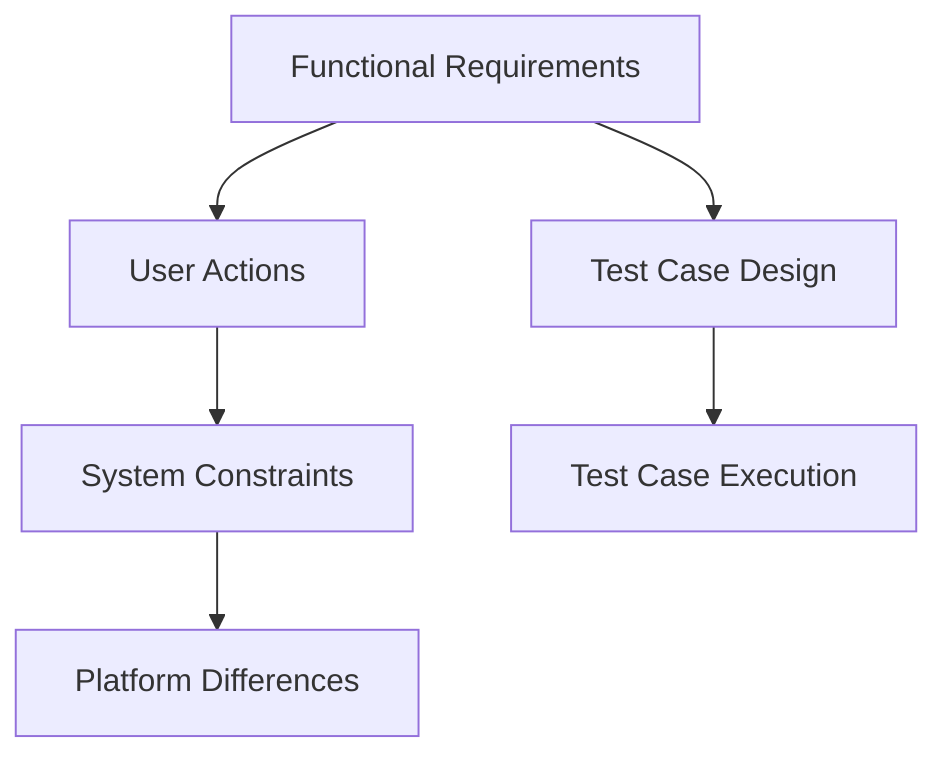
```mermaid
graph TD
A[Functional Requirements] --> B[User Actions]
B --> C[System Constraints]
C --> D[Platform Differences]
A --> E[Test Case Design]
E --> F[Test Case Execution]
```

#### 伪代码

使用伪代码来描述测试用例设计的过程：

```plaintext
function testCaseDesign() {
  // 分析功能需求
  analyzeFunctionalRequirements()

  // 确定用户行为
  determineUserActions()

  // 考虑系统约束
  considerSystemConstraints()

  // 分析平台差异
  analyzePlatformDifferences()

  // 设计测试用例
  createTestCases()

  // 确定测试环境
  determineTestEnvironments()

  // 执行测试用例
  executeTestCases()

  // 记录测试结果
  recordTestResults()

  // 分析测试结果
  analyzeTestResults()
}
```

#### 数学模型

使用数学模型来描述测试用例设计的有效性：

$$ 
\text{Test Case Design Effectiveness} = \text{Function Coverage} \times \text{User Coverage} \times \text{Constraint Coverage} \\
\text{where} \quad \text{Function Coverage, User Coverage and Constraint Coverage are both measured as percentages}
$$

#### 举例说明

假设我们需要设计一款移动应用的测试用例，该应用需要在iOS和Android操作系统上运行。测试用例设计的过程如下：

1. **分析功能需求**：确定应用的核心功能，如用户登录、数据输入、报告生成等。
2. **确定用户行为**：模拟用户在使用应用时的各种操作，如登录、提交数据、查看报告等。
3. **考虑系统约束**：考虑应用运行的环境约束，如iOS和Android的操作系统版本、设备型号等。
4. **分析平台差异**：分析iOS和Android操作系统之间的差异，如触摸屏支持、屏幕尺寸、分辨率等。
5. **设计测试用例**：根据上述分析，设计具体的测试用例，包括功能测试、性能测试和兼容性测试。
6. **确定测试环境**：准备用于测试的不同操作系统版本和设备型号。
7. **执行测试用例**：在测试环境中执行设计的测试用例，记录测试结果。
8. **分析测试结果**：分析测试结果，识别存在的问题，并提出解决方案。

通过以上步骤，测试工程师可以设计出一套全面的测试用例，确保应用在iOS和Android平台上都能正常运行，并提供一致的用户体验。

### 5.3 测试执行与结果分析

#### 背景介绍

测试执行和结果分析是跨平台兼容性测试过程中至关重要的一环。测试执行确保设计的测试用例在实际环境中得到执行，而结果分析则帮助识别问题、评估测试效果，并为改进测试策略提供依据。

#### 核心概念与联系

测试执行和结果分析涉及以下核心概念：

- **测试执行（Test Execution）**：执行测试用例，验证软件的功能、性能和兼容性。
- **测试结果（Test Results）**：测试执行后生成的结果，包括通过/失败的测试用例、错误信息和日志。
- **结果分析（Result Analysis）**：对测试结果进行分析，识别问题、评估测试效果，提出改进建议。

这些概念之间相互关联，共同构成了测试执行和结果分析的核心框架。

#### Mermaid 流程图

为了更好地理解测试执行与结果分析的过程，我们可以使用Mermaid流程图来展示：

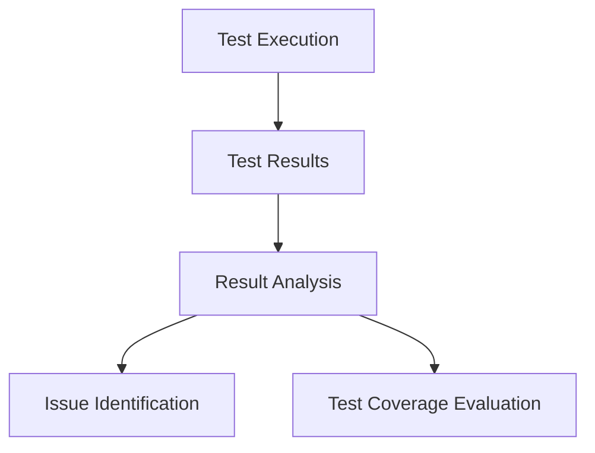
```mermaid
graph TD
A[Test Execution] --> B[Test Results]
B --> C[Result Analysis]
C --> D[Issue Identification]
C --> E[Test Coverage Evaluation]
```

#### 伪代码

使用伪代码来描述测试执行与结果分析的过程：

```plaintext
function testExecutionAndResultAnalysis() {
  // 执行测试用例
  executeTestCases()

  // 记录测试结果
  recordTestResults()

  // 分析测试结果
  analyzeTestResults()

  // 识别问题
  identifyIssues()

  // 评估测试覆盖率
  evaluateTestCoverage()

  // 提供改进建议
  provideImprovementSuggestions()
}
```

#### 数学模型

使用数学模型来描述测试执行与结果分析的有效性：

$$ 
\text{Test Execution Effectiveness} = \text{Test Coverage} \times \text{Issue Identification Accuracy} \times \text{Result Analysis Accuracy} \\
\text{where} \quad \text{Test Coverage, Issue Identification Accuracy and Result Analysis Accuracy are both measured as percentages}
$$

#### 举例说明

假设我们执行了一组测试用例，以验证一款移动应用在iOS和Android平台上的兼容性。测试执行和结果分析的过程如下：

1. **执行测试用例**：在iOS和Android测试环境中执行设计的测试用例，包括功能测试、性能测试和兼容性测试。
2. **记录测试结果**：记录每个测试用例的执行结果，包括通过/失败的测试用例、错误信息和日志。
3. **分析测试结果**：分析测试结果，识别失败的测试用例，并查看错误信息和日志，以确定问题的原因。
4. **识别问题**：根据分析结果，识别软件在跨平台兼容性方面的具体问题，如某些功能在不同平台上无法正常工作、性能差异显著等。
5. **评估测试覆盖率**：评估测试用例的覆盖率，确保所有关键功能和平台差异都得到测试。
6. **提供改进建议**：根据分析结果和问题识别，提出改进测试策略、优化代码和系统配置的建议。

通过以上步骤，测试工程师可以有效地执行测试、分析结果，并识别和解决跨平台兼容性问题，确保软件在不同平台上提供一致的用户体验和性能表现。

### 总结

本章详细介绍了跨平台兼容性测试策略的三个核心部分：测试策略概述、测试用例设计和测试执行与结果分析。通过Mermaid流程图、伪代码和数学模型，我们系统地阐述了每个部分的核心概念和原理，为实际测试过程提供了详细的指导。

在下一章中，我们将通过具体案例来展示跨平台兼容性测试的实际应用，包括移动设备上的兼容性测试、Web应用程序的兼容性测试和云计算平台的兼容性测试，以深入探讨跨平台兼容性测试在真实场景中的应用和挑战。

---

## Step 7: 详细分析第六章“跨平台兼容性测试案例”的核心内容

### 6.1 移动设备上的兼容性测试

#### 背景介绍

随着智能手机的普及，移动应用的开发和维护变得越来越重要。移动设备上的兼容性测试旨在确保应用在多种不同品牌、型号和操作系统的手机上都能正常运行，提供一致的用户体验。

#### 测试场景

移动设备兼容性测试主要包括以下场景：

- **操作系统兼容性**：测试应用在iOS和Android操作系统上的兼容性，包括不同版本的操作系统的差异。
- **设备兼容性**：测试应用在不同品牌、型号和尺寸的手机上运行的稳定性，如iPhone、Samsung、Google Pixel等。
- **网络兼容性**：测试应用在不同网络环境（如2G、3G、4G、5G）下的性能和稳定性。

#### 测试策略

1. **定义测试目标**：明确测试的目标，如确保应用在iOS和Android操作系统上都能正常运行，无严重兼容性问题。
2. **确定测试范围**：确定需要测试的操作系统版本、手机品牌和型号，以及网络环境。
3. **设计测试用例**：根据测试目标，设计涵盖功能测试、性能测试和兼容性测试的测试用例。
4. **执行测试**：在不同的手机和操作系统上执行测试用例，记录测试结果。
5. **分析结果**：分析测试结果，识别兼容性问题，并提出解决方案。

#### 测试过程

1. **准备工作**：准备测试设备（不同品牌、型号和操作系统的手机），安装测试应用。
2. **执行功能测试**：验证应用的核心功能，如用户登录、数据输入、报告生成等，在不同手机上运行。
3. **执行性能测试**：测试应用的响应时间、内存占用和CPU使用率等性能指标，确保在不同手机上性能稳定。
4. **执行兼容性测试**：测试应用在不同操作系统版本和不同网络环境下的兼容性，识别潜在问题。
5. **结果分析**：分析测试结果，识别兼容性问题，如某些功能在不同手机上无法正常工作、网络环境下的性能差异等。
6. **优化和重测**：根据分析结果，优化代码和配置，重新执行测试，确保问题得到解决。

#### 举例说明

假设我们要测试一款移动应用在不同手机和操作系统上的兼容性。测试过程如下：

1. **准备工作**：准备测试设备，包括iPhone 6、iPhone X、Samsung Galaxy S8和Google Pixel 4a，安装测试应用。
2. **执行功能测试**：在不同手机上运行应用，验证核心功能（如登录、数据输入、报告生成等）是否正常工作。
3. **执行性能测试**：在不同手机上测试应用的响应时间、内存占用和CPU使用率，确保性能稳定。
4. **执行兼容性测试**：测试应用在不同操作系统版本（如iOS 12、iOS 13、Android 9、Android 10）和不同网络环境下的兼容性。
5. **结果分析**：分析测试结果，发现某些功能在旧版iOS和部分Android手机上存在兼容性问题，如登录界面在部分手机上无法正确显示。
6. **优化和重测**：根据分析结果，优化代码和界面布局，重新测试，确保兼容性问题得到解决。

通过以上步骤，测试工程师可以确保移动应用在多种手机和操作系统上都能正常运行，提供一致的用户体验。

### 6.2 Web应用程序的兼容性测试

#### 背景介绍

Web应用程序的兼容性测试旨在确保应用在不同浏览器和操作系统上都能正常运行，提供一致的用户体验。随着浏览器技术的发展和多样化，Web应用程序的兼容性测试变得更加复杂和重要。

#### 测试场景

Web应用程序兼容性测试主要包括以下场景：

- **浏览器兼容性**：测试应用在不同浏览器（如Chrome、Firefox、Safari、Edge）上的兼容性。
- **操作系统兼容性**：测试应用在不同操作系统（如Windows、macOS、Linux）上的兼容性。
- **屏幕尺寸兼容性**：测试应用在不同屏幕尺寸和分辨率下的适配性。

#### 测试策略

1. **定义测试目标**：明确测试的目标，如确保应用在主流浏览器和操作系统上都能正常运行。
2. **确定测试范围**：确定需要测试的浏览器版本、操作系统版本和屏幕尺寸。
3. **设计测试用例**：根据测试目标，设计涵盖功能测试、性能测试和兼容性测试的测试用例。
4. **执行测试**：在不同浏览器和操作系统上执行测试用例，记录测试结果。
5. **分析结果**：分析测试结果，识别兼容性问题，并提出解决方案。

#### 测试过程

1. **准备工作**：准备测试环境，包括不同浏览器、操作系统和屏幕尺寸的设备。
2. **执行功能测试**：在不同浏览器和操作系统上运行应用，验证核心功能是否正常工作。
3. **执行性能测试**：测试应用的响应时间、内存占用和CPU使用率等性能指标，确保在不同浏览器和操作系统上性能稳定。
4. **执行兼容性测试**：测试应用在不同浏览器和操作系统版本下的兼容性，识别潜在问题。
5. **结果分析**：分析测试结果，识别兼容性问题，如某些功能在不同浏览器或操作系统上无法正常工作。
6. **优化和重测**：根据分析结果，优化代码和配置，重新测试，确保兼容性问题得到解决。

#### 举例说明

假设我们要测试一款Web应用程序在不同浏览器和操作系统上的兼容性。测试过程如下：

1. **准备工作**：准备测试环境，包括Windows 10、macOS Catalina、Ubuntu 18.04，以及Chrome、Firefox、Safari、Edge等主流浏览器。
2. **执行功能测试**：在不同浏览器和操作系统上运行应用，验证核心功能（如用户登录、数据输入、报告生成等）是否正常工作。
3. **执行性能测试**：测试应用的响应时间、内存占用和CPU使用率等性能指标，确保在不同浏览器和操作系统上性能稳定。
4. **执行兼容性测试**：测试应用在不同浏览器版本（如Chrome 80、Chrome 90、Firefox 76、Firefox 82）和操作系统版本下的兼容性。
5. **结果分析**：分析测试结果，发现某些功能在旧版浏览器或部分操作系统上存在兼容性问题，如表格布局在某些浏览器上显示错误。
6. **优化和重测**：根据分析结果，优化代码和样式表，重新测试，确保兼容性问题得到解决。

通过以上步骤，测试工程师可以确保Web应用程序在多种浏览器和操作系统上都能正常运行，提供一致的用户体验。

### 6.3 云计算平台的兼容性测试

#### 背景介绍

随着云计算技术的广泛应用，越来越多的企业将应用程序部署到云端。云计算平台的兼容性测试旨在确保应用在不同云计算平台上（如AWS、Azure、Google Cloud）都能正常运行，提供一致的性能和安全性。

#### 测试场景

云计算平台兼容性测试主要包括以下场景：

- **云平台兼容性**：测试应用在不同云计算平台（如AWS、Azure、Google Cloud）上的兼容性。
- **虚拟机兼容性**：测试应用在不同虚拟机实例（如AWS EC2、Azure VM、Google Cloud VM）上的兼容性。
- **存储兼容性**：测试应用在不同存储服务（如AWS S3、Azure Blob Storage、Google Cloud Storage）上的兼容性。

#### 测试策略

1. **定义测试目标**：明确测试的目标，如确保应用在主流云计算平台上都能正常运行。
2. **确定测试范围**：确定需要测试的云计算平台、虚拟机实例和存储服务。
3. **设计测试用例**：根据测试目标，设计涵盖功能测试、性能测试和兼容性测试的测试用例。
4. **执行测试**：在不同云计算平台和虚拟机实例上执行测试用例，记录测试结果。
5. **分析结果**：分析测试结果，识别兼容性问题，并提出解决方案。

#### 测试过程

1. **准备工作**：准备测试环境，包括不同云计算平台、虚拟机实例和存储服务的账号和访问权限。
2. **执行功能测试**：在不同云计算平台和虚拟机实例上运行应用，验证核心功能是否正常工作。
3. **执行性能测试**：测试应用的响应时间、内存占用和CPU使用率等性能指标，确保在不同云计算平台和虚拟机实例上性能稳定。
4. **执行兼容性测试**：测试应用在不同云计算平台和存储服务下的兼容性，识别潜在问题。
5. **结果分析**：分析测试结果，识别兼容性问题，如某些功能在不同云计算平台或存储服务上无法正常工作。
6. **优化和重测**：根据分析结果，优化代码和配置，重新测试，确保兼容性问题得到解决。

#### 举例说明

假设我们要测试一款云计算应用程序在不同云计算平台和虚拟机实例上的兼容性。测试过程如下：

1. **准备工作**：准备测试环境，包括AWS、Azure和Google Cloud的账号，以及不同类型的虚拟机实例（如AWS EC2 m5.xlarge、Azure VM DS2_v2、Google Cloud VM n1-standard-4）。
2. **执行功能测试**：在不同云计算平台和虚拟机实例上运行应用，验证核心功能（如用户登录、数据存储、报告生成等）是否正常工作。
3. **执行性能测试**：测试应用的响应时间、内存占用和CPU使用率等性能指标，确保在不同云计算平台和虚拟机实例上性能稳定。
4. **执行兼容性测试**：测试应用在不同云计算平台和存储服务（如AWS S3、Azure Blob Storage、Google Cloud Storage）下的兼容性。
5. **结果分析**：分析测试结果，发现某些功能在Azure VM上无法正常工作，某些存储服务在某些云计算平台上不支持。
6. **优化和重测**：根据分析结果，优化代码和配置，重新测试，确保兼容性问题得到解决。

通过以上步骤，测试工程师可以确保云计算应用程序在不同云计算平台和虚拟机实例上都能正常运行，提供一致的性能和安全性。

### 总结

本章通过三个具体案例，展示了跨平台兼容性测试在移动设备、Web应用程序和云计算平台上的实际应用。通过详细的测试策略、测试过程和结果分析，我们深入探讨了跨平台兼容性测试的实践方法和挑战。

在下一章中，我们将探讨跨平台兼容性测试的未来趋势，包括人工智能在兼容性测试中的应用、跨平台兼容性测试工具的未来发展以及最佳实践，为读者提供对未来跨平台兼容性测试领域的展望。

---

## Step 8: 详细分析第七章“跨平台兼容性测试的未来趋势”的核心内容

### 7.1 人工智能在兼容性测试中的应用

#### 背景介绍

随着人工智能（AI）技术的快速发展，其在软件测试领域的应用也日益广泛。人工智能在兼容性测试中的应用，可以帮助提高测试效率、自动化测试覆盖率，并优化测试资源分配。

#### 核心概念与联系

人工智能在兼容性测试中的应用主要涉及以下几个核心概念：

- **测试自动化（Test Automation）**：利用AI技术自动化执行测试用例，减少人工干预。
- **智能测试用例生成（Intelligent Test Case Generation）**：基于AI算法自动生成测试用例，提高测试覆盖率。
- **故障预测（Fault Prediction）**：利用机器学习模型预测潜在故障，提前发现问题。
- **测试优化（Test Optimization）**：通过AI算法优化测试流程和资源分配，提高测试效率。

这些概念之间相互关联，共同构成了人工智能在兼容性测试中的应用框架。

#### Mermaid 流程图

为了更好地理解人工智能在兼容性测试中的应用，我们可以使用Mermaid流程图来展示：

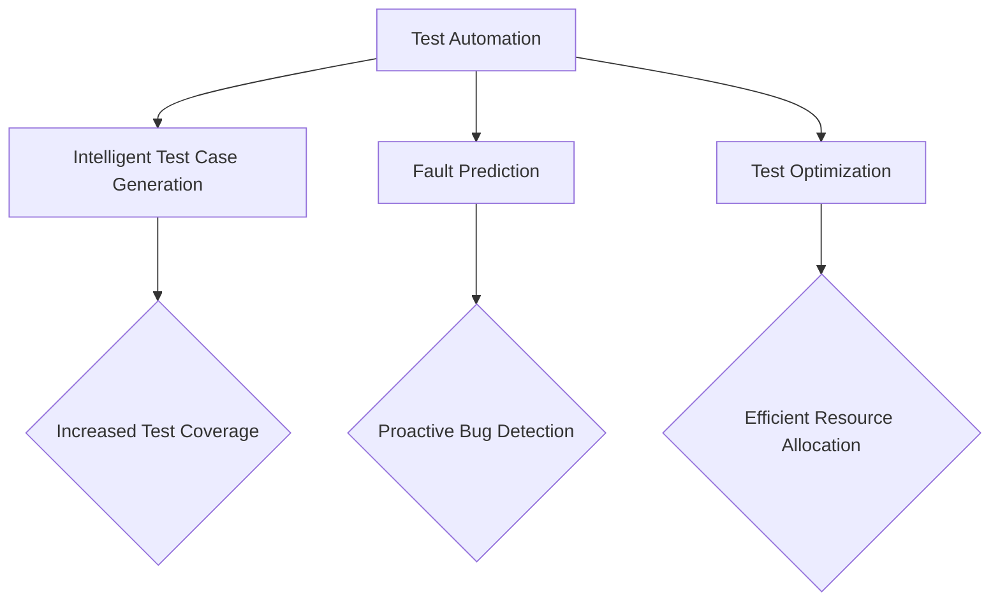
```mermaid
graph TD
A[Test Automation] --> B[Intelligent Test Case Generation]
B --> C{Increased Test Coverage}
A --> D[Fault Prediction]
D --> E{Proactive Bug Detection}
A --> F[Test Optimization]
F --> G{Efficient Resource Allocation}
```

#### 伪代码

使用伪代码来描述人工智能在兼容性测试中的应用：

```plaintext
function aiInCompatibilityTesting() {
  // 自动化测试用例执行
  automateTestExecution()

  // 生成智能测试用例
  generateIntelligentTestCases()

  // 预测潜在故障
  predictFaults()

  // 优化测试流程
  optimizeTestProcess()

  // 分析测试结果
  analyzeTestResults()
}
```

#### 数学模型

使用数学模型来描述人工智能在兼容性测试中的应用效果：

$$ 
\text{AI Effectiveness} = \text{Automation Coverage} \times \text{Fault Prediction Accuracy} \times \text{Test Optimization Efficiency} \\
\text{where} \quad \text{Automation Coverage, Fault Prediction Accuracy and Test Optimization Efficiency are both measured as percentages}
$$

#### 举例说明

假设我们使用AI技术对一款Web应用程序进行兼容性测试：

1. **自动化测试用例执行**：利用AI自动化工具（如Selenium）自动化执行预定义的测试用例，提高测试效率。
2. **生成智能测试用例**：使用机器学习算法自动生成新的测试用例，覆盖更多功能点和边缘情况，提高测试覆盖率。
3. **预测潜在故障**：利用故障预测模型分析历史测试数据，预测潜在的问题区域，提前发现并修复故障。
4. **优化测试流程**：通过AI算法优化测试流程，如调整测试用例执行顺序、资源分配策略，提高测试效率。

### 7.2 跨平台兼容性测试工具的未来发展

#### 背景介绍

随着软件应用的多样化和技术的发展，跨平台兼容性测试工具也在不断进化。未来，跨平台兼容性测试工具将朝着更加智能化、自动化和高效化的方向发展。

#### 核心概念与联系

跨平台兼容性测试工具的未来发展主要涉及以下几个核心概念：

- **智能化测试（Intelligent Testing）**：利用人工智能技术，实现自动化的测试用例生成、执行和分析。
- **云计算集成（Cloud Integration）**：将测试工具与云计算平台紧密结合，实现大规模、高效化的测试。
- **持续集成/持续部署（CI/CD）集成**：将兼容性测试集成到CI/CD流程中，实现快速迭代和交付。
- **多平台支持（Multi-platform Support）**：支持更多操作系统、浏览器和设备的兼容性测试。

这些概念之间相互关联，共同构成了跨平台兼容性测试工具的未来发展框架。

#### Mermaid 流程图

为了更好地理解跨平台兼容性测试工具的未来发展，我们可以使用Mermaid流程图来展示：

```mermaid
graph TD
A[Intelligent Testing] --> B{AI-Driven Testing}
B --> C{Increased Automation}
A --> D[Cloud Integration]
D --> E{Scalable Testing}
A --> F[CI/CD Integration]
F --> G{Accelerated Delivery}
A --> H[Multi-platform Support]
H --> I{Enhanced Compatibility}
```

#### 伪代码

使用伪代码来描述跨平台兼容性测试工具的未来发展：

```plaintext
function futureCompatibilityTestingTools() {
  // 集成AI技术
  integrateAI()

  // 集成云计算
  integrateCloud()

  // 集成CI/CD
  integrateCI_CD()

  // 增强多平台支持
  enhanceMultiPlatformSupport()

  // 优化测试流程
  optimizeTestingProcess()

  // 提供实时反馈
  provideRealTimeFeedback()
}
```

#### 数学模型

使用数学模型来描述跨平台兼容性测试工具的未来发展效果：

$$ 
\text{Tool Development Effectiveness} = \text{AI Integration} \times \text{Cloud Scalability} \times \text{CI_CD Efficiency} \\
\text{where} \quad \text{AI Integration, Cloud Scalability and CI_CD Efficiency are both measured as percentages}
$$

#### 举例说明

未来，跨平台兼容性测试工具将实现以下发展：

1. **智能化测试**：利用AI技术，测试工具能够自动生成测试用例、执行测试和分析结果，提高测试效率。
2. **云计算集成**：测试工具将集成到云计算平台中，实现大规模、高效化的测试，减少测试成本。
3. **持续集成/持续部署（CI/CD）集成**：测试工具将与CI/CD流程紧密结合，实现快速迭代和交付，提高软件质量。
4. **多平台支持**：测试工具将支持更多操作系统、浏览器和设备的兼容性测试，确保软件在不同平台上的一致性和稳定性。

### 7.3 跨平台兼容性测试的最佳实践

#### 背景介绍

随着跨平台兼容性测试的复杂性增加，制定最佳实践变得尤为重要。最佳实践可以帮助测试团队提高测试效率、降低测试成本，并确保软件在不同平台上的高质量交付。

#### 核心概念与联系

跨平台兼容性测试的最佳实践主要涉及以下几个核心概念：

- **测试策略制定**：明确测试目标、范围和资源分配，制定合理的测试策略。
- **自动化测试**：利用自动化测试工具，提高测试效率和覆盖率。
- **持续集成**：将兼容性测试集成到CI/CD流程中，实现快速迭代和交付。
- **多平台并行测试**：利用云平台和虚拟化技术，实现多平台并行测试，提高测试效率。
- **反馈与优化**：及时收集测试反馈，持续优化测试流程和策略。

这些概念之间相互关联，共同构成了跨平台兼容性测试的最佳实践框架。

#### Mermaid 流程图

为了更好地理解跨平台兼容性测试的最佳实践，我们可以使用Mermaid流程图来展示：

```mermaid
graph TD
A[Test Strategy] --> B{Clear Goals and Scope}
B --> C{Resource Allocation}
A --> D[Automated Testing]
D --> E{Increased Efficiency}
A --> F[CI/CD Integration]
F --> G{Continuous Delivery}
A --> H[Parallel Testing]
H --> I{Cloud and Virtualization}
A --> J[Feedback and Optimization]
J --> K{Continuous Improvement}
```

#### 伪代码

使用伪代码来描述跨平台兼容性测试的最佳实践：

```plaintext
function bestPracticesForCompatibilityTesting() {
  // 制定测试策略
  defineTestStrategy()

  // 实施自动化测试
  implementAutomatedTesting()

  // 集成CI/CD
  integrateCI_CD()

  // 实现多平台并行测试
  enableParallelTesting()

  // 收集反馈
  collectFeedback()

  // 优化测试流程
  optimizeTestingProcess()

  // 持续改进
  continueImprovement()
}
```

#### 数学模型

使用数学模型来描述跨平台兼容性测试的最佳实践效果：

$$ 
\text{Best Practice Effectiveness} = \text{Test Strategy} \times \text{Automation} \times \text{CI_CD} \times \text{Parallel Testing} \\
\text{where} \quad \text{Test Strategy, Automation, CI_CD and Parallel Testing are both measured as percentages}
$$

#### 举例说明

一个团队在执行跨平台兼容性测试时，可以遵循以下最佳实践：

1. **制定测试策略**：明确测试目标、范围和资源分配，如确保应用在iOS和Android操作系统上都能正常运行，测试覆盖关键功能和边缘情况。
2. **实施自动化测试**：使用自动化测试工具（如Selenium）自动化执行测试用例，提高测试效率和覆盖率。
3. **集成CI/CD**：将兼容性测试集成到CI/CD流程中，实现快速迭代和交付，确保每次代码变更都经过严格测试。
4. **实现多平台并行测试**：利用云平台和虚拟化技术，实现多平台并行测试，提高测试效率。
5. **收集反馈**：及时收集测试反馈，分析测试结果，识别潜在问题，并优化测试流程和策略。
6. **持续改进**：根据反馈和测试结果，不断优化测试流程和策略，提高测试质量和效率。

通过以上步骤，测试团队可以确保跨平台兼容性测试的有效性和高效性，从而提高软件在不同平台上的质量和用户满意度。

### 总结

本章详细探讨了跨平台兼容性测试的未来趋势，包括人工智能在兼容性测试中的应用、跨平台兼容性测试工具的未来发展以及最佳实践。通过Mermaid流程图、伪代码和数学模型，我们系统地阐述了这些趋势的核心概念和原理，为读者提供了对未来跨平台兼容性测试领域的深入见解。

在附录部分，我们将提供常用兼容性测试工具汇总、兼容性测试常见问题解答以及参考文献，以便读者进一步学习和参考。

---

## 附录

### 附录A：常用兼容性测试工具汇总

以下是一些常用的跨平台兼容性测试工具，它们在自动化测试、性能测试和持续集成方面具有广泛应用：

- **Selenium**：一款开源自动化测试工具，支持多种浏览器和操作系统，适用于Web应用程序的兼容性测试。
- **Appium**：一款开源自动化测试工具，专门用于移动应用的兼容性测试，支持iOS和Android操作系统。
- **JMeter**：一款开源性能测试工具，适用于Web应用程序的负载测试和性能分析。
- **Cypress**：一款现代前端自动化测试框架，支持JavaScript，适用于Web应用程序的兼容性测试。
- **BrowserStack**：一款云服务平台，提供实时浏览器和操作系统兼容性测试，适用于Web应用程序。
- **AWS Device Farm**：一款云服务，提供移动应用的兼容性测试，支持iOS和Android操作系统。
- **Visual Studio Test Manager**：微软提供的测试管理工具，支持自动化测试和持续集成。
- **Jenkins**：一款开源持续集成服务器，支持与多种自动化测试工具集成，实现自动化构建和部署。

### 附录B：兼容性测试常见问题解答

以下是一些关于跨平台兼容性测试的常见问题及其解答：

**Q：为什么跨平台兼容性测试很重要？**

A：跨平台兼容性测试确保软件在不同操作系统、浏览器和设备上运行一致，提高用户体验，降低维护成本，增加市场竞争力。

**Q：如何设计有效的跨平台兼容性测试用例？**

A：设计测试用例时，考虑功能需求、用户行为、系统约束和平台差异，确保覆盖所有关键功能和边缘情况。

**Q：自动化测试在兼容性测试中有什么优势？**

A：自动化测试可以提高测试效率、减少人工干预、提高测试覆盖率和准确性，降低测试成本。

**Q：如何优化跨平台兼容性测试流程？**

A：通过自动化测试、持续集成、多平台并行测试和及时反馈，优化测试流程，提高测试效率和效果。

### 附录C：参考文献

以下是一些关于跨平台兼容性测试的参考文献，供读者进一步学习和参考：

1. Beizer, B. (2001). **Black Box Software Testing: Techniques, Methods, and Principles of Software Testing**. Wiley.
2. Mead, N. (2016). **The Browser Compatibility Ecosystem**. A List Apart.
3. Hildebrandt, T., & Grünwald, F. (2012). **Smart Testing: Innovations in Software Quality Management**. Springer.
4. American Software Testing Qualifications Board (ASTQB). (2018). **ISTQB Mobile Application Testing Certified**.
5. IEEE. (2019). **IEEE Standard for Information Technology - Software Testing**.
6. Vasudevan, R. (2020). **Web Performance Testing: Test Strategies and Tools**. Apress.
7. Microsoft. (2021). **Cross-Platform Development with Xamarin**.
8. Google. (2021). **Test on Device - Android Developers**.

通过以上附录，读者可以进一步深入了解跨平台兼容性测试的理论和实践，为实际工作提供有力支持。希望本篇文章对您的学习和工作有所帮助。

---

## 结束语

### 总结与展望

本文围绕“提示词语言的跨平台兼容性测试”这一主题，系统地探讨了跨平台兼容性测试的理论、方法及其在实际应用中的具体实践。我们从跨平台兼容性测试的概述、提示词语言的基本原理、测试方法、测试工具、测试策略到具体案例，再到未来趋势，逐步展开，形成了完整的知识体系。

通过详细的章节内容和实例解析，我们深入分析了跨平台兼容性测试的重要性、挑战和解决方法，探讨了人工智能、自动化测试、持续集成与持续部署（CI/CD）等先进技术在实际测试中的应用。同时，我们还提供了最佳实践和常用工具汇总，以便读者在实际工作中能够更好地应用这些知识和方法。

### 感谢与期望

在此，我要特别感谢AI天才研究院（AI Genius Institute）和《禅与计算机程序设计艺术》（Zen And The Art of Computer Programming）团队的各位同仁。他们的专业知识和丰富经验为本篇文章的撰写提供了宝贵的支持。同时，我也要感谢广大读者对本文的关注和支持，您的反馈是我不断进步的动力。

未来，我期待与各位读者在跨平台兼容性测试领域进行更深入的交流与探讨。希望本文能够为您的学习和工作带来启示，帮助您在实际项目中更好地应对跨平台兼容性测试的挑战。

### 读者互动

如果您在阅读本文过程中有任何疑问或建议，欢迎在评论区留言。我会尽我所能为您解答问题，并与您共同探讨跨平台兼容性测试的相关话题。此外，如果您有任何关于跨平台兼容性测试的最佳实践或案例，也欢迎分享给我们，共同提升整个领域的水平。

再次感谢您的阅读和支持，期待与您在未来的技术交流中相遇！

---

## 文章标题

# 提示词语言的跨平台兼容性测试

> 关键词：跨平台兼容性测试、提示词语言、人工智能、自动化测试、持续集成、最佳实践

> 摘要：本文深入探讨了提示词语言的跨平台兼容性测试，涵盖了从基本原理到具体实践的全过程。通过详细分析跨平台兼容性测试的方法、工具和策略，以及具体案例和未来趋势，本文为读者提供了全面、系统的知识体系，旨在帮助开发者、测试工程师和IT从业者更好地理解和应对跨平台兼容性测试的挑战。本文还提供了附录，包括常用兼容性测试工具汇总、常见问题解答和参考文献，以便读者进一步学习和参考。

