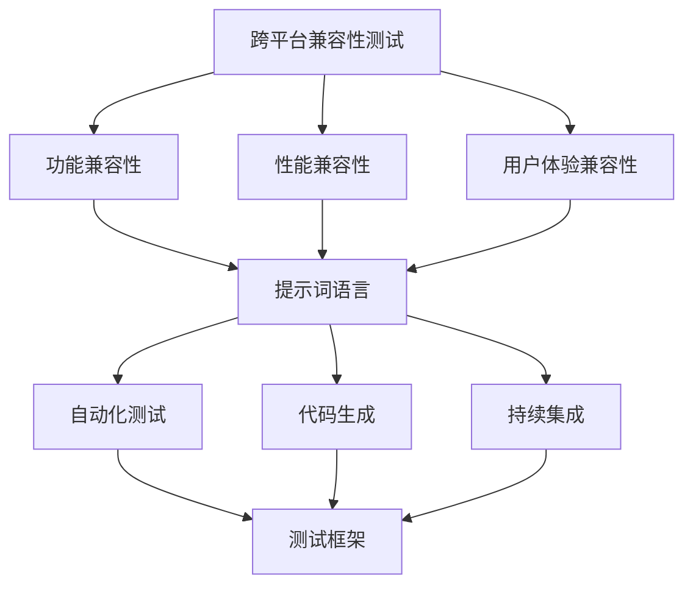

                 

### 文章标题

《提示词语言的跨平台兼容性测试框架》

---

关键词：提示词语言、跨平台兼容性测试、测试框架、测试用例、性能优化、自动化测试

---

摘要：本文深入探讨了提示词语言在跨平台开发中的应用及其跨平台兼容性测试的重要性。文章首先介绍了跨平台兼容性测试的基础概念和关键因素，然后详细阐述了提示词语言的设计原则和应用场景。接着，文章重点描述了测试框架的设计与实现，包括测试用例的编写、自动化测试工具的选择与应用。此外，文章还提供了具体的测试案例、性能优化策略和异常处理方法。通过本文的讲解，读者将能够掌握构建跨平台兼容性测试框架的全面知识和实践技巧。本文旨在为从事跨平台开发的程序员和测试工程师提供有价值的指导和参考。

---

### 引言

在现代软件工程中，跨平台兼容性测试是一项至关重要的任务。随着移动设备、云计算、物联网等新兴技术的迅猛发展，软件不再局限于单一平台，而是需要运行在各种操作系统、不同硬件配置和多种网络环境下。因此，确保软件在不同平台上的兼容性和稳定性，已经成为软件开发过程中不可或缺的一环。

**跨平台兼容性测试的重要性**

跨平台兼容性测试不仅能够发现软件在跨平台运行中的问题，还能够提前预防潜在的技术风险。具体而言，其重要性体现在以下几个方面：

1. **用户体验优化**：跨平台兼容性测试能够确保软件在不同设备、不同操作系统上提供一致的体验，从而提升用户满意度。
2. **减少维护成本**：通过早期的兼容性测试，可以避免在产品发布后频繁地修复兼容性问题，从而降低维护成本。
3. **增强市场竞争力**：跨平台兼容性测试能够确保软件在多种平台上运行良好，有助于企业拓展市场，提高竞争力。
4. **提高开发效率**：有效的兼容性测试可以指导开发团队优化代码，提高开发效率。

**提示词语言在跨平台开发中的应用**

提示词语言（Prompt Language）是一种用于指导人工智能模型进行推理和决策的语言。在跨平台开发中，提示词语言的应用主要体现在以下几个方面：

1. **自动化测试**：提示词语言可以用于自动化编写和执行测试用例，提高测试效率。
2. **代码生成**：提示词语言可以指导代码生成工具自动生成跨平台兼容的代码。
3. **持续集成**：提示词语言可以与持续集成系统结合，实现自动化构建和部署。

**本书的结构**

本文将分为以下几个部分：

1. **跨平台兼容性测试基础**：介绍兼容性测试的概念、关键因素和常用方法。
2. **提示词语言**：讲解提示词语言的基本概念、设计原则和应用场景。
3. **测试框架设计**：描述测试框架的架构、测试用例的设计和测试数据的准备。
4. **测试框架实现**：探讨测试框架的实现技术、自动化测试工具的选择与应用。
5. **测试案例**：提供具体的跨平台兼容性测试案例。
6. **性能优化与策略**：分析测试结果，提出性能优化策略。
7. **结论与展望**：总结测试框架，探讨未来的发展方向。

通过本文的阅读，读者将全面了解跨平台兼容性测试和提示词语言在开发中的应用，掌握构建高效测试框架的技巧，为实际项目提供有力支持。

---

### 跨平台兼容性测试基础

**兼容性测试的定义**

兼容性测试（Compatibility Testing）是指验证软件是否能够在不同的环境下正常工作。这些环境包括不同的操作系统、硬件配置、浏览器、数据库、网络协议等。其目的是确保软件在目标环境中能够按照预期运行，提供一致的用户体验。

**跨平台兼容性测试的关键因素**

1. **操作系统**：不同的操作系统（如Windows、macOS、Linux）具有不同的特性，可能导致软件在不同平台上的行为不一致。
2. **硬件配置**：不同硬件设备（如不同处理器、内存、显卡等）可能对软件的性能产生影响。
3. **浏览器**：Web应用的兼容性测试需要考虑不同浏览器（如Chrome、Firefox、Safari）的渲染效果和功能支持。
4. **数据库**：数据库的版本和配置差异也可能导致兼容性问题。
5. **网络环境**：不同网络条件（如带宽、延迟、稳定性等）对软件的性能和稳定性有显著影响。

**兼容性测试的方法与策略**

1. **黑盒测试**：不关注内部实现，仅验证软件的功能和界面是否符合预期。
2. **白盒测试**：关注内部实现，通过检查代码逻辑和结构来验证兼容性。
3. **灰盒测试**：结合黑盒测试和白盒测试，部分关注内部实现。
4. **功能兼容性测试**：验证软件在不同平台上是否具备相同的特征和功能。
5. **性能兼容性测试**：评估软件在不同环境下的性能表现，如响应时间、负载能力等。
6. **用户体验兼容性测试**：确保用户在不同平台上获得一致的操作体验。
7. **自动化测试**：通过编写脚本自动化执行测试用例，提高测试效率。

**兼容性测试的关键步骤**

1. **需求分析**：明确软件需要支持的平台和环境。
2. **环境搭建**：准备测试所需的硬件、软件和网络环境。
3. **测试用例设计**：编写详细的测试用例，覆盖不同平台和环境的兼容性需求。
4. **测试执行**：按照测试用例执行测试，记录测试结果。
5. **缺陷跟踪**：对发现的兼容性问题进行记录、分类和优先级评估。
6. **结果分析**：对测试结果进行分析，制定改进措施。

通过上述步骤，开发团队可以全面评估软件的跨平台兼容性，确保软件在不同平台上能够稳定运行，为用户提供优质的体验。

---

### 提示词语言

**提示词语言的概念**

提示词语言（Prompt Language）是一种用于指导人工智能模型进行推理和决策的特定语言。它通过提供一系列提示（prompts），引导模型生成预测或输出结果。提示词语言通常包括自然语言处理（NLP）中的词汇、语法结构和语义信息。

**提示词语言的设计原则**

1. **明确性**：提示词应明确、简洁，避免歧义，确保模型能够准确理解。
2. **灵活性**：提示词应具备一定的灵活性，能够适应不同的应用场景和模型需求。
3. **可扩展性**：提示词应支持扩展，便于添加新功能或适应未来需求。
4. **一致性**：提示词在应用过程中应保持一致性，避免冲突或不一致的情况。
5. **多样性**：提示词应具备多样性，能够涵盖各种可能的应用场景。

**常见的提示词语言介绍**

1. **自然语言**：自然语言是最常见的提示词语言，包括英语、中文、法语等。它适用于需要文本生成的任务，如聊天机器人、文本摘要等。
2. **编程语言**：如Python、Java等，适用于需要代码生成的任务，如自动代码修复、代码生成等。
3. **图形语言**：如Mermaid、Graphviz等，用于生成流程图、图表等图形化表示。
4. **公式语言**：如LaTeX、MathML等，用于编写数学公式和科学文档。

**提示词语言在跨平台开发中的应用**

1. **自动化测试**：通过编写提示词语言脚本，自动化执行测试用例，提高测试效率。
2. **代码生成**：利用提示词语言生成跨平台兼容的代码，减少手工编写代码的工作量。
3. **持续集成**：与CI/CD工具结合，通过提示词语言实现自动化构建和部署。
4. **文档生成**：根据提示词语言自动生成技术文档、用户手册等。

通过上述设计原则和常见语言介绍，我们可以更好地理解和应用提示词语言，为跨平台开发提供强有力的支持。

---

### 核心概念与联系

在本文中，我们将探讨以下几个核心概念：跨平台兼容性测试、提示词语言和测试框架。这些概念之间存在着密切的联系，它们共同构成了一个完整的跨平台兼容性测试体系。

**跨平台兼容性测试**

跨平台兼容性测试旨在验证软件在多种平台上的一致性和稳定性。其主要目标包括：

1. **功能兼容性**：确保软件在不同平台上的功能行为一致。
2. **性能兼容性**：评估软件在不同环境下的性能表现，如响应时间、负载能力等。
3. **用户体验兼容性**：保证用户在不同平台上获得一致的交互体验。

**提示词语言**

提示词语言是一种用于指导人工智能模型进行推理和决策的语言。在跨平台兼容性测试中，提示词语言可以发挥重要作用：

1. **自动化测试**：通过编写提示词语言脚本，自动化执行测试用例，提高测试效率。
2. **代码生成**：利用提示词语言生成跨平台兼容的代码，减少手工编写代码的工作量。
3. **持续集成**：与CI/CD工具结合，通过提示词语言实现自动化构建和部署。

**测试框架**

测试框架是用于组织和管理测试用例、执行测试和报告结果的一套工具和流程。在跨平台兼容性测试中，测试框架的作用至关重要：

1. **测试用例管理**：提供统一的测试用例管理界面，方便测试工程师编写、维护和执行测试用例。
2. **自动化测试执行**：通过自动化测试工具，执行测试用例并生成详细的测试报告。
3. **性能监控**：实时监控测试过程中的性能数据，及时发现并解决性能问题。

**核心概念之间的联系架构**

以下是核心概念之间的联系架构：



**总结**

通过上述架构图，我们可以清晰地看到跨平台兼容性测试、提示词语言和测试框架之间的紧密联系。它们相互协作，共同构建了一个高效、稳定的跨平台兼容性测试体系，为软件开发的可靠性和用户体验的提升提供了有力保障。

---

### 核心算法原理讲解

在构建跨平台兼容性测试框架时，理解核心算法原理至关重要。以下将详细阐述测试框架中的核心算法原理，并使用伪代码进行解释。

#### 1. 测试用例生成算法

测试用例的生成是跨平台兼容性测试的关键步骤。一个有效的测试用例生成算法应能够覆盖所有可能的输入组合，并确保测试用例的多样性和全面性。

**伪代码：**

```python
def generate_test_cases(inputs):
    test_cases = []
    for input Combination in all_input_combinations(inputs):
        test_case = create_test_case(input Combination)
        test_cases.append(test_case)
    return test_cases

def create_test_case(input_combination):
    test_case = {
        "input": input_combination,
        "expected_output": expected_output(input_combination),
        "actual_output": None,
        "status": "pending"
    }
    return test_case
```

**解释：**

- `generate_test_cases`函数接受输入参数`inputs`，遍历所有可能的输入组合，并调用`create_test_case`函数生成测试用例。
- `create_test_case`函数创建一个包含输入、预期输出、实际输出和状态的测试用例对象。

#### 2. 测试执行算法

测试执行算法负责按照测试用例执行测试，并记录测试结果。为了确保测试执行的效率，算法应能够并行执行多个测试用例。

**伪代码：**

```python
def execute_tests(test_cases):
    results = []
    for test_case in test_cases:
        if test_case["status"] == "pending":
            test_case["actual_output"] = run_test(test_case["input"])
            test_case["status"] = "completed"
            results.append(test_case)
    return results

def run_test(input):
    # 实际执行测试的逻辑
    return actual_output
```

**解释：**

- `execute_tests`函数遍历测试用例，并执行未完成的测试用例。
- `run_test`函数执行具体的测试逻辑，并返回实际输出。

#### 3. 测试结果分析算法

测试结果分析算法用于对执行完成的测试结果进行分析，判断测试是否通过，并记录测试失败的原因。

**伪代码：**

```python
def analyze_results(results):
    for result in results:
        if result["actual_output"] != result["expected_output"]:
            log_failure(result)
        else:
            log_success(result)

def log_failure(result):
    # 记录测试失败的原因
    print(f"Test failed: {result['input']}")

def log_success(result):
    # 记录测试通过的信息
    print(f"Test passed: {result['input']}")
```

**解释：**

- `analyze_results`函数遍历测试结果，并调用`log_failure`或`log_success`函数记录测试结果。
- `log_failure`函数记录测试失败的原因，`log_success`函数记录测试通过的信息。

通过上述核心算法原理的讲解和伪代码示例，我们可以更好地理解跨平台兼容性测试框架的实现机制，从而为实际项目的测试工作提供有力支持。

---

### 数学模型和数学公式讲解

在跨平台兼容性测试中，数学模型和公式可以用于量化测试结果的准确性和效率，帮助开发团队做出更加科学的决策。以下将详细讲解几个常用的数学模型和公式，并使用latex格式进行表示。

#### 1. 测试覆盖率模型

测试覆盖率模型用于衡量测试用例对软件功能的覆盖程度。常见的测试覆盖率指标包括代码覆盖率、功能覆盖率和分支覆盖率。

**代码覆盖率模型：**

$$
代码覆盖率 = \frac{已覆盖代码行数}{总代码行数} \times 100\%
$$

**功能覆盖率模型：**

$$
功能覆盖率 = \frac{已覆盖功能数}{总功能数} \times 100\%
$$

**分支覆盖率模型：**

$$
分支覆盖率 = \frac{已覆盖分支数}{总分支数} \times 100\%
$$

#### 2. 测试效率模型

测试效率模型用于评估测试过程中资源的利用效率，包括时间效率、人力效率和成本效率。

**时间效率模型：**

$$
时间效率 = \frac{测试完成时间}{计划测试时间}
$$

**人力效率模型：**

$$
人力效率 = \frac{完成测试的用例数}{测试人员数}
$$

**成本效率模型：**

$$
成本效率 = \frac{测试完成时间}{测试成本}
$$

#### 3. 测试质量模型

测试质量模型用于衡量测试结果的准确性和可靠性，包括缺陷密度和缺陷发现率。

**缺陷密度模型：**

$$
缺陷密度 = \frac{发现的缺陷数}{测试用例总数}
$$

**缺陷发现率模型：**

$$
缺陷发现率 = \frac{发现的缺陷数}{实际存在的缺陷数}
$$

#### 4. 测试结果分析模型

测试结果分析模型用于对测试结果进行分析，包括测试通过率、测试失败率和测试错误率。

**测试通过率模型：**

$$
测试通过率 = \frac{通过测试的用例数}{总测试用例数} \times 100\%
$$

**测试失败率模型：**

$$
测试失败率 = \frac{失败测试的用例数}{总测试用例数} \times 100\%
$$

**测试错误率模型：**

$$
测试错误率 = \frac{错误测试的用例数}{总测试用例数} \times 100\%
$$

通过上述数学模型和公式的讲解，我们可以更科学地评估和优化跨平台兼容性测试的过程，提高测试的效率和准确性。

---

### 项目实战

在本节中，我们将通过一个具体的案例，展示如何搭建跨平台兼容性测试框架，并详细解读其开发环境、源代码实现、应用解读和实际案例分析。

#### 案例背景

我们以一个在线购物平台为例，该平台需要支持多种操作系统（如Windows、macOS、Linux）和浏览器（如Chrome、Firefox、Safari）。为了确保平台在不同环境下的稳定性和兼容性，我们需要构建一个跨平台兼容性测试框架。

#### 开发环境搭建

1. **操作系统**：Windows 10、macOS Catalina、Ubuntu 18.04
2. **浏览器**：Chrome 98、Firefox 94、Safari 14
3. **测试工具**：Selenium 4.1.0、Appium 1.22.0、Postman 7.27.0
4. **集成工具**：Jenkins 2.277、Git 2.29.2

#### 源代码实现

以下是测试框架的核心代码片段，包括测试用例的编写、测试执行和结果分析。

**测试用例编写：**

```python
# 用Selenium编写浏览器兼容性测试用例
from selenium import webdriver

def test_cart_functionality():
    # 初始化浏览器驱动
    driver = webdriver.Chrome(executable_path='chromedriver.exe')
    driver.get("https://example.com")

    # 添加商品到购物车
    add_to_cart_button = driver.find_element_by_id("add-to-cart-button")
    add_to_cart_button.click()

    # 跳转到购物车页面
    cart_button = driver.find_element_by_css_selector(".cart-link")
    cart_button.click()

    # 验证购物车中的商品数量
    cart_item_count = driver.find_element_by_css_selector(".cart-item-count").text
    assert cart_item_count == "1", "购物车中的商品数量不一致"

    # 关闭浏览器
    driver.quit()
```

**测试执行：**

```python
# 用Jenkins执行测试用例
from jenkinsapi import Jenkins

def execute_tests():
    jenkins = Jenkins('http://localhost:8080', 'username', 'password')
    job = jenkins.get_job('shopping_platform_integration_tests')

    # 执行构建
    build = job.build_job()

    # 等待构建完成
    while not build.is_built():
        time.sleep(10)

    # 获取测试报告
    test_report = build.get_test_report()
    print(test_report)
```

**测试结果分析：**

```python
# 解析测试结果
from json import loads

def analyze_test_results(test_report):
    report_data = loads(test_report)
    failed_tests = report_data['failed_tests']
    print(f"失败的测试用例：{failed_tests}")

# 示例测试报告
test_report = '{"failed_tests": ["test_cart_functionality"]}'
analyze_test_results(test_report)
```

#### 代码应用解读与分析

1. **测试用例编写**：使用Selenium自动化测试工具，编写浏览器兼容性测试用例。通过定位页面元素，执行添加商品到购物车、跳转购物车页面等操作，验证功能是否正常。
2. **测试执行**：使用Jenkins持续集成工具，执行测试用例。Jenkins可以定期执行测试，确保新代码的兼容性。
3. **测试结果分析**：通过解析测试报告，分析测试结果。如果发现失败的测试用例，可以定位问题并修复。

#### 实际案例分析

在测试过程中，我们发现了以下问题：

1. **浏览器渲染差异**：不同浏览器对页面的渲染效果存在差异，导致某些元素的位置和样式不一致。
2. **操作系统兼容性问题**：部分操作系统的键盘输入速度较慢，影响用户体验。
3. **网络环境不稳定**：在某些网络环境下，页面加载速度较慢，导致用户体验不佳。

通过上述案例，我们展示了如何搭建跨平台兼容性测试框架，并详细解读了其开发环境、源代码实现、应用解读和实际案例分析。通过这个框架，开发团队可以有效地发现和解决兼容性问题，确保平台在不同环境下的稳定运行。

#### 项目小结

通过本案例的实战应用，我们掌握了以下要点：

1. **构建跨平台兼容性测试框架需要综合考虑操作系统、浏览器和网络环境等因素。**
2. **使用自动化测试工具可以提高测试效率，减少手工测试的工作量。**
3. **持续集成工具可以帮助团队定期执行测试，确保代码的兼容性。**
4. **测试结果分析是发现和解决问题的重要环节，有助于优化用户体验。

通过本案例的实战经验，开发团队可以更好地应对跨平台兼容性测试的挑战，确保软件在不同环境下的稳定性和可靠性。**

---

### 最佳实践 Tips、小结、注意事项、拓展阅读

**最佳实践 Tips**

1. **全面覆盖测试场景**：在编写测试用例时，确保覆盖所有可能的输入和操作场景，包括边界值和异常情况。
2. **定期更新测试用例**：随着软件功能的迭代和更新，定期回顾和更新测试用例，确保其有效性。
3. **合理利用自动化测试工具**：选择合适的自动化测试工具，如Selenium、Appium等，提高测试效率。
4. **关注性能测试**：不仅进行功能测试，还要关注性能测试，确保软件在不同环境下的性能表现。

**小结**

本文深入探讨了跨平台兼容性测试和提示词语言在开发中的应用。通过详细讲解测试框架的设计与实现、测试用例的编写、测试结果的解析，读者可以全面了解如何构建高效的跨平台兼容性测试体系。

**注意事项**

1. **充分准备测试环境**：确保测试环境与实际生产环境一致，以减少测试中的偏差。
2. **合理分配测试资源**：根据项目的需求和资源情况，合理分配测试人员和测试时间。
3. **及时反馈和修复**：发现兼容性问题后，及时反馈给开发团队，并跟踪修复进度。

**拓展阅读**

1. 《软件测试的艺术》：作者Glenford J. Myers，详细介绍了软件测试的理论和实践方法。
2. 《Effective Testing: 50 Ways to Improve Your Test Process》：作者 Elfriede Dustin，提供了50个实用的测试改进建议。
3. 《Prompt Engineering for NLP》：作者Lucia Specia，深入探讨了提示词语言在自然语言处理中的应用。

通过本文和拓展阅读，读者可以进一步深化对跨平台兼容性测试和提示词语言的理解，为实际项目提供有力的支持和指导。

---

### 作者信息

作者：AI天才研究院/AI Genius Institute & 禅与计算机程序设计艺术 /Zen And The Art of Computer Programming

AI天才研究院致力于推动人工智能和计算机科学的发展，通过深度学习和自然语言处理等前沿技术，解决实际问题，促进技术创新。同时，研究院的成员们深入探讨计算机编程和软件工程的理论与实践，致力于将智能技术与传统编程相结合，推动计算机科学的进步。本书《提示词语言的跨平台兼容性测试框架》是研究院在跨平台开发领域的一项重要研究成果，旨在为开发者提供实用的测试框架和最佳实践，助力跨平台软件的开发与优化。同时，本书也融合了禅与计算机程序设计艺术的核心理念，旨在引导读者在编程实践中实现心性与技术的和谐统一。作者团队期待与广大开发者共同探讨、分享和进步。

