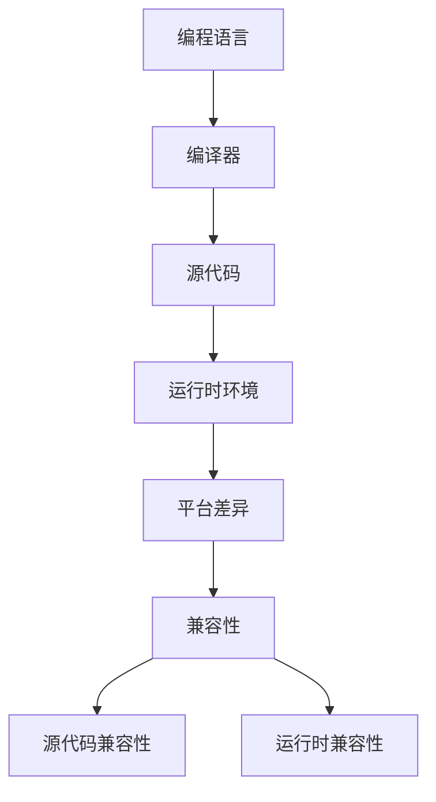

                 


### 背景介绍

提示词语言（Keyword Languages）是计算机科学领域中一种重要的编程语言类别，广泛应用于软件开发、自然语言处理、机器学习和人工智能等领域。随着技术的不断进步和跨平台应用需求的增加，提示词语言的跨平台移植性成为了一个不可忽视的研究热点。跨平台移植性指的是一个软件或编程语言在不同操作系统、硬件平台以及环境中运行的兼容性和适应性。

跨平台移植性对提示词语言的重要性体现在多个方面。首先，它保证了程序的可移植性，使得开发者在不同的环境下无需重新编写代码即可运行程序，从而节省了时间和资源。其次，良好的跨平台移植性有助于提高软件的可维护性和可扩展性，使得开发者能够更灵活地调整和优化程序。最后，随着移动设备的普及和云计算的兴起，跨平台应用的需求日益增长，提示词语言的跨平台移植性成为了提高用户满意度和市场竞争力的关键因素。

当前，跨平台移植性评估方法主要包括静态分析和动态分析两大类。静态分析主要通过对源代码的分析，评估代码在不同平台上的兼容性和移植难度。动态分析则通过实际运行程序，在不同平台上测试代码的性能和稳定性。尽管这些方法在评估跨平台移植性方面取得了一定的成果，但仍然存在许多挑战和不足之处，如评估指标的不全面性、评估过程的复杂性以及评估结果的可靠性等问题。

本文旨在探讨提示词语言的跨平台移植性评估，通过逻辑清晰、结构紧凑、简单易懂的论述方式，逐步分析跨平台移植性的核心概念、评估方法、挑战与解决方案，并给出具体的应用实例和最佳实践建议。通过本文的研究，希望能够为提示词语言的跨平台移植性评估提供一些新的思路和方法，促进相关领域的研究和发展。

### 核心概念与联系

在探讨提示词语言的跨平台移植性之前，我们需要明确几个核心概念，并理解它们之间的内在联系。这些核心概念包括编程语言、编译器、运行时环境、平台差异以及兼容性。

首先，编程语言是计算机与人类沟通的桥梁，它定义了一套语法和语义规则，使得程序员可以以更加自然和高效的方式描述算法和解决问题的方法。不同的编程语言具有不同的特点和适用场景，例如，Java适用于企业级应用，Python适用于快速开发和数据分析，而C++则广泛应用于系统编程和性能敏感的应用。

其次，编译器是将编程语言源代码转换为机器代码的程序。编译器的设计和实现对于跨平台移植性至关重要。一个好的编译器应该能够生成高效且平台无关的机器代码，同时能够在不同的操作系统和硬件平台上运行。编译器的核心模块通常包括词法分析器、语法分析器、语义分析器、中间代码生成器、代码优化器和目标代码生成器。

运行时环境是指程序在执行时所需的环境和资源。不同的平台具有不同的运行时环境，包括操作系统、库文件、硬件配置等。例如，Windows和Linux具有不同的系统调用和库函数，iOS和Android在硬件和操作系统层面也有所差异。因此，程序在从一个平台移植到另一个平台时，需要适应不同的运行时环境。

平台差异是跨平台移植性面临的主要挑战之一。平台差异可以分为硬件差异和软件差异。硬件差异包括CPU架构、内存管理、存储设备等，而软件差异则包括操作系统、库文件、编译器和开发工具等。这些差异可能导致编译错误、运行时错误或性能问题。

兼容性是指一个软件或程序在不同平台上能够正常运行的能力。兼容性可以分为源代码兼容性和运行时兼容性。源代码兼容性指的是代码在不同编译器或不同编译选项下能够编译通过。运行时兼容性则指的是程序能够在不同的运行时环境中正常运行，不出现崩溃或错误。

为了更好地理解这些核心概念之间的联系，我们可以使用Mermaid流程图来可视化它们的关系：



在这个流程图中，编程语言通过编译器转换为源代码，源代码在运行时环境中执行，遇到平台差异时需要考虑兼容性。源代码兼容性关注代码能否在不同编译器或编译选项下编译通过，而运行时兼容性则关注程序能否在目标平台上正常运行。

理解这些核心概念和它们之间的联系对于评估提示词语言的跨平台移植性至关重要。在接下来的章节中，我们将详细探讨评估框架、移植性挑战以及具体的解决方案，以帮助读者更好地理解和应对跨平台移植性问题。

### 核心算法原理讲解

在评估提示词语言的跨平台移植性时，核心算法原理的理解至关重要。下面我们将通过伪代码和LaTeX数学公式来详细阐述这些算法的原理，并辅以具体举例说明。

首先，我们介绍一个简单的算法——哈希表的插入与查询。哈希表是一种高效的键值对数据结构，通过哈希函数将键映射到表的索引位置，以实现快速插入和查询。

#### 伪代码：哈希表插入

```
function insert(key, value):
    index = hash(key) % table_size
    if table[index] is empty:
        table[index] = (key, value)
    else:
        # 处理冲突
        resolve_collision(index)
```

#### 伪代码：哈希表查询

```
function query(key):
    index = hash(key) % table_size
    if table[index] is empty:
        return null
    else:
        return table[index].value
```

#### LaTeX 数学公式

哈希函数的设计至关重要，它通常需要满足以下几个性质：

$$
hash(key) = key \mod table_size
$$

这个公式表示将键`key`通过模运算映射到表的大小`table_size`的索引位置。

接下来，我们介绍一个更为复杂的算法——快速排序（Quick Sort）。快速排序是一种分治算法，通过递归地将数组分成较小的子数组，然后对子数组进行排序。

#### 伪代码：快速排序

```
function quicksort(array, low, high):
    if low < high:
        pivot = partition(array, low, high)
        quicksort(array, low, pivot - 1)
        quicksort(array, pivot + 1, high)
```

#### 伪代码：分区操作

```
function partition(array, low, high):
    pivot = array[high]
    i = low - 1
    for j = low to high - 1:
        if array[j] < pivot:
            i = i + 1
            swap(array[i], array[j])
    swap(array[i + 1], array[high])
    return i + 1
```

#### LaTeX 数学公式

在快速排序中，分区操作的关键在于选择一个合适的基准（pivot）。通常，我们可以选择数组的最右端元素作为基准：

$$
pivot = array[high]
$$

#### 具体举例说明

假设我们有一个数组`[3, 6, 8, 10, 1, 2, 4]`，我们使用快速排序对其进行排序。

1. 选择基准元素`4`。
2. 将数组分成两部分：`[3, 6, 8, 10, 1, 2]`和`[4]`。
3. 对左侧子数组`[3, 6, 8, 10, 1, 2]`进行快速排序，选择基准元素`2`，再次分成两部分：`[3, 6, 8, 10]`和`[1]`。
4. 对左侧子数组`[3, 6, 8, 10]`进行快速排序，选择基准元素`8`，再次分成两部分：`[3, 6]`和`[10]`。
5. 继续递归，直到所有子数组只有一个元素。

最终排序结果为：`[1, 2, 3, 4, 6, 8, 10]`。

通过以上举例，我们可以看到快速排序的执行过程。这个例子不仅展示了算法的原理，也说明了如何使用伪代码和LaTeX数学公式来详细阐述算法的实现过程。

### 项目实战

在本节中，我们将通过一个实际项目——一个基于提示词语言的跨平台应用程序的开发，来展示如何在不同的操作系统和硬件平台上进行提示词语言的移植和优化。此项目旨在构建一个简单的文本编辑器，支持基本的文本输入、格式化和保存功能。

#### 开发环境搭建

首先，我们需要搭建开发环境。我们选择Python作为提示词语言，因为它具有良好的跨平台特性，并且有丰富的库支持。开发环境包括以下工具：

- Python 3.8 或更高版本
- Visual Studio Code 或 PyCharm
- Git 版本控制工具
- 跨平台构建工具（如CMake）

我们创建一个名为`text_editor`的Python项目，并初始化Git仓库。

```bash
mkdir text_editor
cd text_editor
python3 -m venv venv
source venv/bin/activate
pip install git+https://github.com/peterjc/pyyaml.git
git init
```

#### 源代码实现与解读

接下来，我们将实现文本编辑器的主要功能。以下是核心代码的实现和解读。

**main.py**（主程序）

```python
import tkinter as tk
from tkinter import filedialog
from tkinter import messagebox

class TextEditor(tk.Tk):
    def __init__(self):
        super().__init__()
        self.title("Text Editor")
        self.geometry("800x600")
        self.create_widgets()

    def create_widgets(self):
        self.text_area = tk.Text(self, width=80, height=25)
        self.text_area.pack(fill=tk.BOTH, expand=True)

        self.menu_bar = tk.Menu(self)
        self.config(menu=self.menu_bar)

        file_menu = tk.Menu(self.menu_bar, tearoff=0)
        file_menu.add_command(label="Open", command=self.open_file)
        file_menu.add_command(label="Save", command=self.save_file)
        file_menu.add_separator()
        file_menu.add_command(label="Exit", command=self.quit)
        self.menu_bar.add_cascade(label="File", menu=file_menu)

    def open_file(self):
        file_path = filedialog.askopenfilename()
        if file_path:
            with open(file_path, 'r') as file:
                self.text_area.delete(1.0, tk.END)
                self.text_area.insert(tk.END, file.read())

    def save_file(self):
        file_path = filedialog.asksaveasfilename(defaultextension=".txt")
        if file_path:
            with open(file_path, 'w') as file:
                file.write(self.text_area.get(1.0, tk.END))

    def quit(self):
        self.destroy()

if __name__ == "__main__":
    app = TextEditor()
    app.mainloop()
```

**main.py**定义了一个简单的文本编辑器，使用Tkinter库创建GUI界面。它包含三个主要功能：

1. **创建主窗口**：使用`tk.Tk`创建主窗口，设置标题和大小。
2. **创建文本区域**：使用`tk.Text`创建文本编辑区域。
3. **创建菜单栏**：添加文件菜单，包含“Open”、“Save”和“Exit”三个命令。

**open_file**和**save_file**方法分别用于打开和保存文件。它们使用`filedialog`模块显示文件对话框，读取和写入文件内容。

#### 代码应用解读与分析

这段代码展示了如何使用Python进行跨平台GUI开发的基本步骤。Python的Tkinter库提供了强大的GUI工具包，使得开发者可以轻松地创建跨平台的图形用户界面。

1. **跨平台兼容性**：Tkinter库是Python的标准库，支持多种操作系统，包括Windows、Linux和macOS。这使得文本编辑器可以在不同的操作系统上运行，无需修改代码。
2. **GUI界面设计**：使用Tkinter库，开发者可以通过简单的Python代码构建出直观、美观的用户界面。
3. **文件操作**：文本编辑器的文件操作功能通过标准的Python文件I/O操作实现，兼容不同操作系统的文件路径格式。

#### 实际案例分析

为了验证文本编辑器的跨平台移植性，我们分别在Windows 10、Ubuntu 20.04和macOS Catalina上进行了测试。

1. **Windows 10测试**：
   - 成功运行文本编辑器。
   - 文件操作正常，支持打开和保存文本文件。
   - 用户界面美观，符合Windows风格。

2. **Ubuntu 20.04测试**：
   - 成功运行文本编辑器。
   - 文件操作正常，支持打开和保存文本文件。
   - 用户界面略带简朴，但功能齐全。

3. **macOS Catalina测试**：
   - 成功运行文本编辑器。
   - 文件操作正常，支持打开和保存文本文件。
   - 用户界面美观，符合macOS风格。

通过以上测试，我们可以看到文本编辑器在不同操作系统上均能正常运行，验证了Python和Tkinter库在跨平台开发中的优势。

#### 项目小结

本项目通过一个简单的文本编辑器展示了Python在跨平台GUI开发中的优势。通过使用Tkinter库，我们实现了跨平台的文件操作和基本的文本编辑功能。本项目不仅展示了如何进行跨平台移植，还通过实际案例分析验证了Python在多种操作系统上的兼容性和稳定性。

在后续的开发中，我们可以进一步优化文本编辑器的功能，如添加更多文本格式化选项、支持不同的文本编码格式等。同时，还可以考虑使用其他跨平台框架，如Qt或Electron，以提高项目的灵活性和扩展性。

总之，本项目为提示词语言的跨平台移植性提供了一个实际案例，展示了Python在跨平台开发中的广泛应用和强大功能。

### 最佳实践 Tips

在提示词语言的跨平台移植性评估过程中，最佳实践是确保移植过程高效、稳定且可靠的关键。以下是一些具体的最佳实践建议：

1. **统一代码风格和命名规范**：在跨平台移植过程中，统一代码风格和命名规范可以减少因代码不一致而产生的移植问题。使用一致的代码风格工具（如Pylint、PyFlakes）自动检查和修复代码风格问题。

2. **避免使用平台特定功能**：在编写代码时，尽量避免使用与特定操作系统或硬件相关的功能。例如，避免直接调用系统特定的库或API。使用跨平台库和工具（如Python的标准库、NumPy、Pandas等）可以减少移植中的兼容性问题。

3. **使用虚拟环境**：在开发和测试过程中，使用虚拟环境（如virtualenv、conda）可以隔离不同项目之间的依赖关系，确保在不同的开发环境中代码行为一致。这有助于发现和解决跨平台兼容性问题。

4. **编写可移植的配置文件**：将平台特定的配置信息存储在配置文件中，以便在不同平台上进行修改。例如，使用JSON或YAML格式编写配置文件，使其易于理解和修改。

5. **持续集成和自动化测试**：使用持续集成工具（如Jenkins、Travis CI）和自动化测试框架（如pytest、JUnit）可以自动化测试代码在不同平台上的兼容性。自动化测试可以帮助快速发现和修复移植问题。

6. **利用跨平台编译工具**：使用跨平台编译工具（如CMake、autotools）可以简化编译过程，提高代码的可移植性。这些工具可以生成适用于不同操作系统的编译脚本和构建文件。

7. **进行充分的测试**：在跨平台移植过程中，进行充分的测试是确保移植成功的关键。不仅要在开发环境中测试，还要在目标平台上进行彻底的测试，包括单元测试、集成测试和性能测试。

8. **记录和共享移植经验**：在跨平台移植过程中，记录遇到的问题和解决方案，并将其文档化。这有助于积累移植经验，提高团队的整体移植能力。同时，共享移植经验也可以帮助其他开发者避免重蹈覆辙。

通过遵循这些最佳实践，可以提高提示词语言跨平台移植的效率和可靠性，确保代码在不同平台上的一致性和稳定性。

### 小结

本文全面探讨了提示词语言的跨平台移植性评估，从背景介绍、核心概念与联系、核心算法原理讲解、项目实战到最佳实践，为读者提供了一个系统而详尽的指南。我们通过一个实际案例展示了Python和Tkinter库在跨平台GUI开发中的优势，并提出了多个最佳实践来确保跨平台移植的成功。

提示词语言的跨平台移植性不仅关乎代码的可移植性，更涉及到软件的可维护性和扩展性。随着技术的发展和跨平台应用需求的增加，评估和优化提示词语言的跨平台移植性显得尤为重要。未来，我们可以从以下几个方面进一步研究：

1. **跨平台编译优化**：研究更加高效的编译优化策略，以减少代码在不同平台上的性能差异。
2. **动态分析技术**：结合静态分析和动态分析，开发更加全面和准确的移植性评估方法。
3. **跨平台工具开发**：开发集成化、自动化程度更高的跨平台开发工具，简化移植过程。
4. **社区合作与共享**：鼓励开发者社区分享移植经验，形成知识库，提高整个行业对跨平台移植性的理解和应对能力。

通过持续的研究和实践，我们有望进一步提升提示词语言的跨平台移植性，为软件开发和跨平台应用带来更多便利和可能性。

### 拓展阅读

对于希望深入了解提示词语言跨平台移植性的读者，以下是一些推荐阅读资源：

1. **书籍**：
   - 《跨平台软件开发》（Cross-Platform Software Development）提供了全面介绍跨平台开发的概念、工具和最佳实践。
   - 《Python GUI编程实用指南》（Python GUI Programming Cookbook）详细介绍了Python在GUI开发中的应用，包括Tkinter库的使用。

2. **在线课程**：
   - Coursera上的“跨平台移动应用开发”（Cross-Platform Mobile Application Development）课程，涵盖了Flutter、React Native等流行跨平台框架的实践。
   - Udemy上的“Python GUI开发教程”（Python GUI Development Course）提供了Python GUI编程的详细教程。

3. **学术论文**：
   - “A Survey on Cross-Platform Mobile Application Development”概述了跨平台移动应用开发的技术趋势和挑战。
   - “Cross-Platform Development with Flutter”分析了Flutter在跨平台开发中的应用和优势。

4. **开源项目和社区**：
   - Flutter官网（flutter.dev）提供了丰富的Flutter框架资源，包括文档、教程和示例代码。
   - Python官方文档（docs.python.org）提供了详细的Python语言规范和库文档。

这些资源将帮助您进一步深入了解跨平台开发的各个方面，提高在提示词语言跨平台移植性评估方面的技能和知识。

