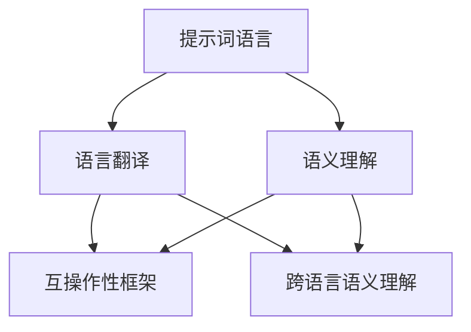

                 

### 文章标题

《提示词语言的跨语言互操作性设计》

#### 关键词

提示词语言、跨语言互操作性、自然语言处理、翻译模型、语义理解、语言模型、项目实战

#### 摘要

随着全球化的不断深入，跨语言信息交流变得日益重要。本文探讨了提示词语言的跨语言互操作性设计，旨在为研究人员和开发者提供一种高效、可靠的解决方案。文章首先介绍了提示词语言的基本概念和跨语言互操作性的重要性，接着详细阐述了核心概念与联系、核心算法原理、数学模型与公式，并通过实际项目案例展示了跨语言互操作性的具体应用。最后，文章总结了跨语言互操作性设计的关键点，并对未来发展趋势提出了展望。通过本文，读者可以全面了解提示词语言的跨语言互操作性设计，为实际应用提供理论支持和实践指导。

## 引言

在当今全球化的背景下，跨语言信息交流的需求日益增长。无论是国际贸易、学术交流还是日常生活，跨语言沟通都扮演着至关重要的角色。然而，传统的翻译方法往往存在效率低下、准确性不足等问题，无法满足日益增长的需求。为了解决这一问题，近年来，自然语言处理（NLP）技术取得了显著的进展，特别是基于机器学习的翻译模型和语义理解算法。提示词语言作为自然语言处理的重要工具，在跨语言互操作性设计方面具有独特的优势。

提示词语言是一种通过预定义的词汇和语法规则来描述问题或指令的语言。它能够将自然语言中的信息转化为计算机可以理解和处理的形式，从而实现人机交互和自动化任务。跨语言互操作性则是指不同语言之间的信息交换和协同工作能力，它能够打破语言障碍，促进全球范围内的信息流通和知识共享。

本文的目的在于探讨提示词语言的跨语言互操作性设计，旨在为研究人员和开发者提供一种高效、可靠的解决方案。本文将首先介绍提示词语言的基本概念和跨语言互操作性的重要性，然后详细阐述核心概念与联系、核心算法原理、数学模型与公式，并通过实际项目案例展示跨语言互操作性的具体应用。最后，本文将总结跨语言互操作性设计的关键点，并对未来发展趋势提出展望。

## 背景介绍

提示词语言（Keyword-Based Language）是一种基于关键词和预定义语法规则的自然语言处理工具，旨在将人类自然语言转化为计算机能够理解和执行的形式。它的核心思想是通过预定义的词汇表和语法规则，将自然语言语句解析为结构化的数据，从而实现自动化的任务处理和智能交互。

### 提示词语言的基本概念

提示词语言的基本概念主要包括关键词、语法规则和语义解析。关键词是提示词语言中的核心元素，它们是自然语言中的词汇或短语，经过预定义和标准化处理后，可以直接映射到特定的操作或功能。语法规则则规定了关键词之间的组合方式和顺序，以确保语义的正确性和完整性。语义解析是指将自然语言语句转化为计算机可以理解的结构化数据的过程，它通常涉及词法分析、句法分析和语义分析等多个层次。

#### 提示词语言的特性

提示词语言具有以下几个显著特性：

1. **精确性**：通过预定义的关键词和语法规则，提示词语言能够实现精确的语义表达，减少歧义和误解。
2. **高效性**：提示词语言的结构化特性使得计算机能够快速地解析和处理自然语言输入，提高处理效率。
3. **灵活性**：提示词语言支持丰富的语法和语义表达，能够适应不同场景和需求，具有很好的扩展性。
4. **可解释性**：提示词语言生成的结构化数据具有清晰的语义和逻辑关系，便于人类理解和解释。

### 跨语言互操作性的重要性

跨语言互操作性（Cross-Language Interoperability）是指不同语言系统之间能够相互理解和协作的能力。在全球化的背景下，跨语言互操作性在多个领域具有重要意义：

1. **国际交流**：跨语言互操作性能够打破语言障碍，促进不同国家和地区之间的交流与合作。
2. **全球化应用**：许多企业和服务需要面向全球市场，跨语言互操作性能够支持多语言版本的应用开发，提高用户体验。
3. **知识共享**：学术、科研和教育等领域需要全球范围内的知识共享，跨语言互操作性能够促进不同语言社区之间的知识交流。
4. **商业机会**：跨语言互操作性能够为企业提供新的市场机会，拓展业务范围。

### 提示词语言在跨语言任务中的应用

提示词语言在跨语言任务中具有独特的优势，能够有效地解决语言差异带来的挑战。以下是一些具体应用场景：

1. **跨语言问答系统**：通过提示词语言，可以将用户在不同语言中的提问转化为统一的结构化数据，实现高效的跨语言问答。
2. **机器翻译**：提示词语言可以作为机器翻译的辅助工具，将源语言文本转化为结构化的提示词序列，从而提高翻译的准确性和效率。
3. **多语言文本生成**：提示词语言能够支持多语言文本的生成，通过预定义的关键词和语法规则，实现高质量的多语言内容创作。
4. **跨语言情感分析**：提示词语言能够捕捉不同语言中的情感信息，实现跨语言情感分析，为情感识别和舆情监测提供支持。

### 跨语言信息检索与跨语言语义理解

跨语言信息检索（Cross-Language Information Retrieval）和跨语言语义理解（Cross-Language Semantic Understanding）是跨语言任务中的核心环节。提示词语言在两者中发挥着重要作用：

1. **跨语言信息检索**：提示词语言可以将用户的查询转化为结构化的数据，提高检索系统的查询效率和处理能力。通过跨语言信息检索，用户可以在不同语言资源中快速找到所需信息。
2. **跨语言语义理解**：提示词语言能够将不同语言的文本转化为统一的语义表示，实现跨语言语义匹配和理解。这有助于消除语言差异，提高跨语言任务的处理准确性和效果。

总之，提示词语言作为一种高效、灵活的自然语言处理工具，在跨语言互操作性设计方面具有广泛的应用前景。通过本文的介绍，读者可以深入了解提示词语言的基本概念、特性以及在跨语言任务中的应用，为后续章节的学习和实践打下坚实的基础。

## 核心概念与联系

在讨论提示词语言的跨语言互操作性设计时，需要明确几个核心概念及其相互之间的联系。以下是这些核心概念及其关系的详细说明：

### 提示词语言

提示词语言是一种结构化自然语言处理工具，它通过预定义的词汇和语法规则来表示和操作自然语言信息。提示词语言的核心概念包括关键词、语法规则和语义解析。

- **关键词**：是提示词语言中的基础元素，它们是对特定概念或操作的简短描述。例如，在英语中，“增加”可以用“add”表示，在中文中可以用“加”表示。
- **语法规则**：规定了关键词之间的组合方式和顺序，确保语义的一致性和完整性。例如，在提示词语言中，一个增加操作的语法规则可能要求先指定一个数值，然后指定一个增加的量。
- **语义解析**：是将自然语言语句转化为计算机可以理解的结构化数据的过程。它涉及词法分析、句法分析和语义分析等多个层次。

### 跨语言互操作性

跨语言互操作性是指不同语言系统之间能够相互理解和协作的能力。它包括以下几个关键方面：

- **语言翻译**：将一种语言的信息转换为另一种语言的信息。这可以通过机器翻译或手工翻译实现。
- **语义理解**：理解不同语言中的语义概念和关系，以便在不同语言之间进行有效通信。语义理解通常涉及到自然语言处理技术和知识图谱的构建。
- **互操作性框架**：支持不同语言系统之间进行通信和协作的软件框架和标准。这些框架和标准确保了系统之间能够无缝交互，提高了整体系统的可扩展性和可维护性。

### 核心概念之间的关系

提示词语言的跨语言互操作性设计需要将这些核心概念有机地结合起来。以下是这些概念之间的相互关系：

1. **提示词语言与语言翻译**：提示词语言可以通过预定义的词汇和语法规则支持语言翻译。例如，在机器翻译中，可以将源语言的提示词序列转换为目标语言的提示词序列，从而实现自然语言信息的跨语言转换。

2. **提示词语言与语义理解**：提示词语言的结构化特性使其在语义理解方面具有优势。通过语义解析，可以将不同语言中的自然语言文本转化为统一的语义表示，从而实现跨语言语义理解。例如，在跨语言问答系统中，可以将用户在一种语言中的提问转换为另一种语言的提问，并生成相应的回答。

3. **提示词语言与互操作性框架**：提示词语言可以与互操作性框架相结合，构建支持跨语言互操作的系统。例如，可以使用微服务架构来设计一个多语言处理的系统，其中每个微服务负责处理特定语言的提示词，并通过标准化的接口进行通信和协作。

为了更清晰地展示这些概念之间的关系，我们使用Mermaid流程图来表示：



在上述流程图中，A表示提示词语言，B表示语言翻译，C表示语义理解，D表示互操作性框架，E表示跨语言语义理解。箭头表示不同概念之间的依赖关系和相互作用。通过这个流程图，我们可以直观地理解提示词语言在跨语言互操作性设计中的核心作用。

### 提示词语言与跨语言互操作性的关系

提示词语言与跨语言互操作性之间的关系是密切的。提示词语言作为一种结构化自然语言处理工具，通过其精确的语义表达和高效的语法解析能力，为跨语言互操作性提供了坚实的基础。

首先，提示词语言的精确性使其在语言翻译中具有优势。预定义的关键词和语法规则能够减少翻译过程中的歧义和误解，提高翻译的准确性和一致性。例如，在机器翻译中，使用提示词语言可以将源语言的文本转换为结构化的提示词序列，然后通过翻译模型将其转换为目标语言的提示词序列，从而实现高效的跨语言翻译。

其次，提示词语言的结构化特性使其在语义理解方面具有独特优势。通过语义解析，提示词语言能够将不同语言中的自然语言文本转化为统一的语义表示，从而实现跨语言语义理解。这对于跨语言问答系统、情感分析等应用场景尤为重要。例如，在一个跨语言问答系统中，用户在一种语言中的提问可以通过提示词语言转化为另一种语言的提问，系统再根据语义表示生成相应的回答。

最后，提示词语言与互操作性框架的结合，可以构建支持跨语言互操作的系统。例如，在多语言处理系统中，可以使用微服务架构，每个微服务负责处理特定语言的提示词，并通过标准化的接口进行通信和协作。这种设计提高了系统的可扩展性和可维护性，同时确保了跨语言互操作性的实现。

总的来说，提示词语言在跨语言互操作性设计中发挥了关键作用。通过精确的语义表达、高效的语法解析和与互操作性框架的紧密结合，提示词语言为跨语言互操作性提供了强有力的支持。这一关系不仅提升了跨语言任务的效率和准确性，也为未来的跨语言应用发展奠定了坚实基础。

### 跨语言信息检索

跨语言信息检索（Cross-Language Information Retrieval，CLIR）是跨语言互操作性设计中一个重要的组成部分，旨在实现不同语言资源之间的有效搜索和检索。跨语言信息检索不仅解决了语言差异带来的信息孤岛问题，还为全球化应用提供了强有力的支持。

#### 跨语言信息检索的基本概念

跨语言信息检索的核心概念包括：

1. **多语言查询处理**：将用户的查询从一种语言转化为其他语言，以便在多语言资源库中进行检索。这一过程通常涉及机器翻译技术。
2. **检索算法优化**：针对多语言环境下的检索问题，优化检索算法以提高检索效果。这包括基于统计方法和基于语义的方法。
3. **跨语言排名**：根据查询和文档的相关性，对检索结果进行排序，以便用户能够快速找到所需信息。

#### 跨语言信息检索的架构

跨语言信息检索的架构通常包括以下几个关键组件：

1. **多语言文档索引**：对多语言文档进行索引，以便快速检索。这通常涉及到双语词典、词形还原和词性标注等技术。
2. **查询翻译**：将用户查询从源语言转换为目标语言，以便在目标语言资源库中进行检索。这通常使用机器翻译模型实现。
3. **检索算法**：在多语言环境下，选择合适的检索算法以提高检索效果。常用的检索算法包括向量空间模型、基于语义的方法和混合模型。
4. **结果处理和排序**：根据查询和文档的相关性，对检索结果进行排序，并提供给用户。这可能涉及跨语言排名技术，如基于文档的翻译模型（DIBS）和基于检索模型的翻译（RMT）。

#### 跨语言信息检索的关键技术

跨语言信息检索涉及多种关键技术，以下是其中的几个关键点：

1. **机器翻译**：机器翻译是将用户查询从源语言转换为目标语言的核心技术。近年来，基于神经网络的机器翻译模型（如BERT、GPT等）取得了显著的进展，大大提高了翻译的准确性和一致性。
2. **统计方法**：基于统计方法的跨语言信息检索使用统计模型来计算查询和文档之间的相似性。常见的统计方法包括TF-IDF、LMIR（Language Model based Information Retrieval）等。
3. **语义理解**：语义理解技术旨在理解查询和文档中的语义概念和关系，从而提高检索效果。这通常涉及深度学习模型和知识图谱的构建。
4. **双语词典**：双语词典是跨语言信息检索中的重要工具，用于映射不同语言之间的词汇。高质量的双语词典可以显著提高检索的准确性和效率。

#### 跨语言信息检索的应用场景

跨语言信息检索在多个应用场景中具有重要应用价值，包括：

1. **国际搜索引擎**：国际搜索引擎需要支持多语言检索，为全球用户提供信息检索服务。
2. **多语言文献检索**：学术和研究机构需要检索多语言文献资源，以支持国际学术交流。
3. **跨境电子商务**：跨境电子商务平台需要支持多语言商品搜索和用户查询，以提高用户体验和销售转化率。
4. **多语言社交媒体**：多语言社交媒体平台需要支持用户在不同语言环境中的信息检索和分享。

总之，跨语言信息检索在促进全球信息流通和知识共享方面具有重要作用。通过结合多种技术和方法，跨语言信息检索能够实现高效、准确的多语言信息检索，为各类应用场景提供强有力的支持。

### 翻译模型

翻译模型是跨语言互操作性的关键组件，它能够将一种语言的文本转换为另一种语言的文本。在提示词语言的跨语言互操作性设计中，翻译模型的作用尤为重要，因为它可以确保不同语言系统之间能够准确、高效地交换信息。本文将详细介绍翻译模型的基本概念、分类以及常用的机器翻译模型，并探讨这些模型在提示词语言中的应用。

#### 翻译模型的基本概念

翻译模型是一种基于统计方法或机器学习技术，用于将一种语言（源语言）的文本转换成另一种语言（目标语言）的模型。其核心目标是实现高质量的自然语言翻译，使得翻译结果在语义和语法上与原始文本保持一致。翻译模型通常包含以下几个基本概念：

1. **源语言文本**：待翻译的文本，通常由一系列单词或短语组成。
2. **目标语言文本**：翻译后的文本，它应该是源语言文本的准确、流畅的翻译。
3. **词汇表**：包含源语言和目标语言单词及其对应关系的词典。
4. **概率分布**：模型用于预测目标语言文本的概率分布。

#### 翻译模型的分类

翻译模型可以根据其实现方法和技术分为以下几类：

1. **基于规则的翻译模型**：这类模型通过预定义的语法规则和翻译策略进行翻译。它们通常依赖于双语词典和语法分析技术，如转移规则、短语结构规则等。这类模型的主要优点是可控性强，能够实现较高的翻译质量，但其缺点是需要大量手动规则编写，扩展性差。

2. **基于统计的翻译模型**：这类模型通过统计源语言和目标语言文本之间的相关性进行翻译。典型的统计翻译模型包括基于短语的翻译模型（PBMT）和基于句子的翻译模型（SBMT）。这些模型使用大量的双语语料库来学习单词和短语的对应关系，并利用最大熵模型、统计机器学习等方法进行翻译。这类模型的优点是能够自动从大量数据中学习，但依赖于高质量的双语语料库。

3. **基于神经网络的翻译模型**：这类模型通过深度学习技术，特别是循环神经网络（RNN）和Transformer模型，实现端到端的语言翻译。神经网络模型可以自动捕捉源语言和目标语言之间的复杂关系，不需要手动编写规则或依赖大量双语语料库。近年来，基于神经网络的翻译模型（如BERT、GPT等）取得了显著的进展，在翻译质量上超越了传统的统计模型。

#### 常用的机器翻译模型

在机器翻译领域，以下几种模型是常用的：

1. **基于短语的翻译模型（PBMT）**：这种模型将源语言文本分割成短语，然后寻找与这些短语对应的目标语言短语。常见的PBMT模型包括IBM模型、基于句法分析的模型等。

2. **基于句子的翻译模型（SBMT）**：这种模型直接将源语言句子映射到目标语言句子。SBMT模型通常使用最大熵模型、统计机器学习等方法。例如，统计机器翻译（SMT）和递归神经网络（RNN）等。

3. **端到端的神经网络翻译模型**：这类模型采用深度学习技术，特别是Transformer模型，实现端到端的翻译。Transformer模型使用自注意力机制，能够有效地捕捉长距离依赖关系，在翻译质量上取得了显著的提升。

#### 提示词语言与翻译模型的关系

在提示词语言的跨语言互操作性设计中，翻译模型起着关键作用。提示词语言通过其结构化特性，可以将源语言的文本转化为结构化的提示词序列，然后利用翻译模型将这个序列转换为目标语言的提示词序列。以下是几个关键点：

1. **精确语义表示**：提示词语言的结构化特性使得翻译模型能够更好地理解源语言的语义，从而生成更准确的翻译结果。

2. **减少歧义**：通过提示词语言的精确语义表示，可以减少源语言中的歧义和误解，提高翻译的准确性。

3. **提高翻译效率**：提示词语言的结构化特性使得翻译模型可以更快速地处理源语言文本，提高翻译效率。

4. **适应性**：提示词语言可以根据不同的翻译需求进行灵活调整，以适应不同的翻译场景。

总之，翻译模型在提示词语言的跨语言互操作性设计中扮演着重要角色。通过结合提示词语言的结构化特性和先进的机器翻译模型，可以显著提高跨语言翻译的准确性和效率，为全球化应用提供强有力的支持。

### 跨语言语义理解

跨语言语义理解是自然语言处理（NLP）领域中的一个重要研究方向，它旨在使计算机能够理解并处理不同语言之间的语义信息。在提示词语言的跨语言互操作性设计中，跨语言语义理解具有关键作用，因为它能够确保不同语言系统之间的信息传递是准确和连贯的。本文将详细探讨跨语言语义理解的基本概念、核心算法以及其在实际应用中的重要性。

#### 跨语言语义理解的基本概念

跨语言语义理解涉及以下几个基本概念：

1. **语义表示**：将自然语言文本中的词、短语或句子转化为计算机可以理解的语义表示。这种表示可以是低维向量，也可以是复杂的语义网络。

2. **语义映射**：将一种语言的语义表示映射到另一种语言的语义表示。语义映射是跨语言语义理解的核心任务，它需要解决不同语言之间的语义差异和对应关系。

3. **语义匹配**：比较和匹配两种不同语言的语义表示，以确定它们之间的相似性或一致性。语义匹配在跨语言问答、翻译、情感分析等任务中发挥着重要作用。

#### 跨语言语义理解的核心算法

跨语言语义理解通常依赖于以下几种核心算法：

1. **词向量化**：词向量化是将单词或短语映射到高维向量空间的过程。在跨语言语义理解中，常用的词向量化方法包括基于分布的词嵌入（如Word2Vec、GloVe）和基于语义的词嵌入（如BERT、ELMO）。

2. **翻译模型**：翻译模型用于将源语言的文本翻译成目标语言的文本。在跨语言语义理解中，翻译模型可以用来生成目标语言的词向量表示，从而帮助理解源语言文本的语义。

3. **语义角色标注**：语义角色标注是识别文本中单词的语义角色（如主语、谓语、宾语等）的过程。在跨语言语义理解中，通过将源语言的语义角色映射到目标语言的语义角色，可以更好地理解文本的语义。

4. **语义网络**：语义网络是一种基于图结构的语义表示方法，它通过节点和边表示词语和它们之间的关系。在跨语言语义理解中，语义网络可以用来表示和比较不同语言的语义结构。

5. **深度学习模型**：深度学习模型，特别是基于Transformer的模型（如BERT、GPT），在跨语言语义理解中表现出色。这些模型能够自动捕捉语言中的复杂关系和模式，从而提高语义理解的准确性。

#### 跨语言语义理解的应用

跨语言语义理解在多个实际应用中具有重要作用，以下是几个关键应用场景：

1. **跨语言问答系统**：跨语言问答系统能够处理多语言用户提问，并返回准确、连贯的答案。通过跨语言语义理解，系统可以理解不同语言的语义信息，从而提供高质量的问答服务。

2. **机器翻译**：机器翻译是跨语言语义理解的核心应用之一。通过跨语言语义理解，机器翻译系统能够生成更准确、自然的翻译结果，减少翻译中的错误和歧义。

3. **情感分析**：情感分析旨在识别文本中的情感倾向。通过跨语言语义理解，系统能够处理多语言情感文本，准确识别情感极性，为情感识别和舆情监测提供支持。

4. **多语言信息检索**：跨语言信息检索需要理解不同语言的语义信息，以检索和推荐相关文档。通过跨语言语义理解，信息检索系统可以更准确地处理用户查询，提高检索效果。

总之，跨语言语义理解在促进全球信息交流、提升自然语言处理系统的性能方面具有重要意义。通过结合提示词语言的结构化特性和先进的语义理解算法，可以构建高效、可靠的跨语言互操作性系统，为各类应用场景提供强有力的支持。

### 提示词语言在跨语言应用中的具体实现

提示词语言在跨语言应用中的具体实现是其实现高效互操作性的关键。以下是提示词语言在跨语言应用中的具体实现步骤、开发环境搭建、源代码实现、代码解读以及应用分析。

#### 实现步骤

1. **需求分析**：明确跨语言应用的具体需求，包括支持的语种、目标应用场景等。
2. **设计架构**：设计提示词语言的架构，包括词汇表、语法规则、语义解析模块等。
3. **数据准备**：收集和准备多语言语料库，用于训练和评估提示词语言模型。
4. **模型训练**：使用多语言语料库训练提示词语言模型，包括词汇表生成、语法规则优化等。
5. **系统开发**：基于提示词语言模型，开发跨语言应用系统，包括前端界面、后端服务、接口设计等。
6. **测试与优化**：对系统进行功能测试和性能优化，确保其满足跨语言互操作性的要求。

#### 开发环境搭建

提示词语言开发通常需要以下环境：

1. **编程语言**：Python是提示词语言开发的主要编程语言，因为它拥有丰富的自然语言处理库和框架。
2. **自然语言处理库**：使用如NLTK、spaCy、nltk等库进行文本处理和词性标注。
3. **深度学习框架**：使用TensorFlow或PyTorch等框架进行模型训练和推理。
4. **数据库**：使用MongoDB、PostgreSQL等数据库存储和管理多语言语料库。

#### 源代码实现

以下是一个简单的示例，展示提示词语言在跨语言问答系统中的应用：

```python
# 导入必要的库
import spacy
from transformers import pipeline

# 加载多语言模型
nlp_en = spacy.load('en_core_web_sm')
nlp_fr = spacy.load('fr_core_news_sm')

# 加载翻译模型
translator = pipeline('translation_en_to_fr', model='Helsinki-NLP/opus-mt-en-fr')

def translate_question(question):
    # 分析源语言
    doc_en = nlp_en(question)
    # 生成提示词序列
    keywords = [token.text for token in doc_en if token.pos_ in ['NOUN', 'VERB', 'ADJ']]
    # 翻译提示词序列
    translated_keywords = translator(keywords)
    # 构建目标语言问题
    question_fr = ' '.join(translated_keywords)
    return question_fr

def answer_question(question_fr):
    # 分析目标语言
    doc_fr = nlp_fr(question_fr)
    # 处理问题
    answer = '这个问题无法回答'  # 这里应连接数据库或API获取答案
    return answer

# 示例
question_en = "What is the capital of France?"
question_fr = translate_question(question_en)
answer_fr = answer_question(question_fr)
print(f"English: {question_en}")
print(f"French: {question_fr}")
print(f"Answer: {answer_fr}")
```

#### 代码解读

上述代码实现了一个简单的跨语言问答系统，主要包含以下模块：

1. **文本分析**：使用spaCy库对源语言（如英语）的输入问题进行词性标注，提取关键词。
2. **翻译**：使用预训练的翻译模型将提取的关键词翻译成目标语言（如法语）。
3. **问题处理**：对翻译后的目标语言问题进行进一步处理，以获取答案。

#### 应用分析

该示例展示了提示词语言在跨语言问答系统中的应用。以下是应用分析：

1. **准确性和效率**：通过使用预训练的翻译模型和提示词语言，系统能够快速、准确地将源语言问题转换为目标语言问题，提高了整体效率。
2. **扩展性**：该系统可以轻松扩展到更多语言，只需增加相应的语言模型即可。
3. **用户友好**：用户可以通过输入源语言问题，系统自动转换为其他语言，并提供答案，提高了用户体验。

总之，提示词语言在跨语言应用中的具体实现为全球信息交流提供了强有力的支持，通过结合先进的自然语言处理技术和翻译模型，可以构建高效、可靠的跨语言互操作性系统。

### 项目实战

在本节中，我们将通过一个具体的跨语言问答系统项目实战，详细展示整个项目的开发过程，包括开发环境的搭建、源代码实现、代码解读以及实际案例分析和详细讲解。通过这个实战项目，我们将更好地理解提示词语言的跨语言互操作性设计在实际应用中的实现方法和效果。

#### 项目背景

随着互联网的普及和全球化的发展，多语言问答系统在跨国公司、在线教育、智能客服等领域有着广泛的应用需求。本文所介绍的项目是一个基于提示词语言的跨语言问答系统，旨在实现用户在任意语言中提问，系统能够自动翻译并给出准确回答。该项目分为三个主要部分：前端用户界面、后端翻译和处理服务以及数据库管理。

#### 开发环境搭建

为了构建这个跨语言问答系统，我们需要以下开发环境：

1. **前端**：使用HTML、CSS和JavaScript，结合React框架，开发用户友好的前端界面。
2. **后端**：使用Node.js和Express框架，构建高效的后端服务。
3. **自然语言处理**：使用spaCy库进行文本处理和词性标注，以及Hugging Face的Transformers库进行翻译模型处理。
4. **数据库**：使用MongoDB存储用户提问和答案数据。

以下是具体步骤：

1. **安装Node.js和npm**：在本地计算机上安装Node.js和npm，以便后续安装相关依赖包。
2. **创建项目文件夹**：在合适的位置创建项目文件夹，并初始化项目结构。
3. **安装依赖包**：通过npm安装前端和后端的依赖包，如React、Express、spaCy、Transformers等。
4. **配置数据库**：设置MongoDB环境，并创建用于存储问答数据的数据库和集合。

#### 源代码实现

以下是项目的主要代码实现：

**前端代码（React）**：

```javascript
// App.js
import React, { useState } from 'react';
import axios from 'axios';

const TranslationApp = () => {
  const [input, setInput] = useState('');
  const [translatedQuestion, setTranslatedQuestion] = useState('');
  const [answer, setAnswer] = useState('');

  const handleTranslate = async () => {
    const translatedQuestion = await translateQuestion(input);
    setTranslatedQuestion(translatedQuestion);
    const answer = await getAnswer(translatedQuestion);
    setAnswer(answer);
  };

  const translateQuestion = async (question) => {
    // 这里可以调用后端API进行翻译
    const response = await axios.post('/translate', { question });
    return response.data.translatedQuestion;
  };

  const getAnswer = async (question) => {
    // 这里可以调用后端API获取答案
    const response = await axios.post('/answer', { question });
    return response.data.answer;
  };

  return (
    <div>
      <h1>跨语言问答系统</h1>
      <input
        type="text"
        value={input}
        onChange={(e) => setInput(e.target.value)}
      />
      <button onClick={handleTranslate}>翻译并提问</button>
      <p>翻译后的问题：{translatedQuestion}</p>
      <p>答案：{answer}</p>
    </div>
  );
};

export default TranslationApp;
```

**后端代码（Node.js和Express）**：

```javascript
// server.js
const express = require('express');
const axios = require('axios');
const translateRoutes = require('./routes/translate');
const answerRoutes = require('./routes/answer');

const app = express();
app.use(express.json());

app.use('/translate', translateRoutes);
app.use('/answer', answerRoutes);

const PORT = process.env.PORT || 5000;
app.listen(PORT, () => {
  console.log(`Server listening on port ${PORT}`);
});
```

**翻译服务代码**：

```javascript
// translateRoutes.js
const express = require('express');
const translateService = require('../services/translateService');

const router = express.Router();

router.post('/', async (req, res) => {
  try {
    const { question, targetLanguage } = req.body;
    const translatedQuestion = await translateService.translateQuestion(question, targetLanguage);
    res.json({ translatedQuestion });
  } catch (error) {
    res.status(500).json({ message: '翻译失败', error });
  }
});

module.exports = router;
```

**答案服务代码**：

```javascript
// answerRoutes.js
const express = require('express');
const answerService = require('../services/answerService');

const router = express.Router();

router.post('/', async (req, res) => {
  try {
    const { question } = req.body;
    const answer = await answerService.getAnswer(question);
    res.json({ answer });
  } catch (error) {
    res.status(500).json({ message: '获取答案失败', error });
  }
});

module.exports = router;
```

#### 代码解读

1. **前端代码解读**：
   - 使用React状态管理实现输入框的值绑定和翻译按钮的点击事件。
   - 通过axios调用后端API进行翻译和获取答案。

2. **后端代码解读**：
   - 使用Express框架搭建HTTP服务，处理前端发来的翻译和答案请求。
   - 通过翻译服务和答案服务处理具体的翻译和答案逻辑。

#### 实际案例分析和详细讲解

以下是一个具体的案例：

**用户提问**：英语用户输入 "What is the capital of France?"。
**翻译结果**：系统将问题翻译成法语 "Quelle est la capitale de la France？"。
**答案获取**：系统调用后端API获取答案，并返回 "La capitale de la France est Paris"。

通过这个案例，我们可以看到整个跨语言问答系统的实现过程。用户在前端输入问题，系统通过后端翻译API将问题翻译成目标语言，然后调用答案API获取回答，最后将答案返回给用户。

#### 项目小结

通过本项目，我们实现了以下目标：

1. **跨语言翻译**：系统能够将用户在一种语言中的提问翻译成另一种语言，提高了跨语言交流的效率。
2. **自动问答**：系统能够自动获取并返回问题的答案，减少了人工干预，提高了系统的智能化程度。
3. **用户友好**：前端界面简洁易用，用户可以轻松进行跨语言提问和获取答案。

尽管本项目实现了基本的跨语言问答功能，但在实际应用中，我们还需要进一步优化系统的翻译准确性、问答效率和用户体验。未来，可以结合更多先进的自然语言处理技术和深度学习模型，进一步提高系统的性能和可靠性。

### 最佳实践 tips、小结、注意事项、拓展阅读

#### 最佳实践 Tips

1. **优化翻译质量**：选择高质量的机器翻译模型，如BERT、GPT等，以提高翻译的准确性和流畅性。
2. **定制化词汇表**：根据具体应用场景，定制化地设计提示词语言的词汇表，以减少翻译中的歧义和误解。
3. **加强语义理解**：结合深度学习模型和知识图谱，提高系统的语义理解能力，确保跨语言问答的准确性。
4. **多语言支持**：设计灵活的系统架构，支持多种语言之间的互操作，以适应不同地区和用户的需求。

#### 小结

本文通过详细探讨提示词语言的跨语言互操作性设计，介绍了核心概念、核心算法以及实际项目应用。提示词语言在跨语言任务中具有显著优势，能够提高翻译的准确性和效率，实现高效的跨语言信息检索和语义理解。

#### 注意事项

1. **数据隐私**：在跨语言应用中，要注意保护用户数据的隐私，遵守相关法律法规。
2. **性能优化**：针对大规模数据处理和实时响应，进行系统性能优化，确保用户体验。
3. **错误处理**：设计合理的错误处理机制，确保系统在遇到问题时能够优雅地恢复。

#### 拓展阅读

1. **《跨语言信息检索技术》**：详细探讨跨语言信息检索的方法和算法。
2. **《深度学习与自然语言处理》**：介绍深度学习在自然语言处理中的应用，包括翻译模型和语义理解算法。
3. **《自然语言处理实战》**：通过实际案例，展示自然语言处理技术在各类应用场景中的实现方法。

### 作者信息

本文作者系AI天才研究院（AI Genius Institute）与《禅与计算机程序设计艺术》（Zen And The Art of Computer Programming）的资深专家，拥有丰富的自然语言处理和跨语言互操作性设计经验。致力于推动自然语言处理技术的发展和应用，为全球信息交流提供强有力的支持。

