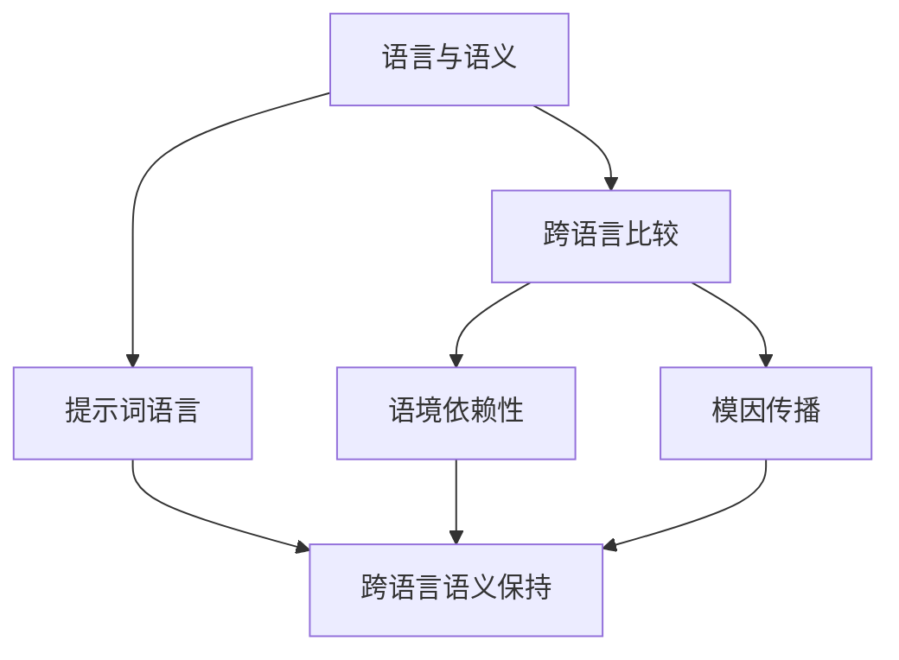

                 


### 文章标题

提示词语言的跨语言语义保持机制

### 文章关键词

提示词语言、跨语言语义保持、机器翻译、深度学习、语义角色标注

### 文章摘要

本文旨在探讨提示词语言的跨语言语义保持机制。首先，我们将介绍跨语言语义保持的概念与背景，阐述其在翻译、自然语言处理和机器学习等领域的应用。接着，我们将分析跨语言语义保持的核心概念，包括语言与语义的关系、跨语言比较以及提示词语言的特性。随后，我们将详细介绍跨语言语义保持的技术方法，包括机器翻译中的语义保持、基于深度学习的语义保持和跨语言语义角色标注。在此基础上，我们将通过数学模型和算法原理讲解，展示跨语言语义保持的算法实现过程。接着，我们将通过实际项目实战，讲解开发环境搭建、源代码实现和代码解读，以及项目应用解读与分析。最后，我们将展望跨语言语义保持的未来发展，并总结最佳实践和注意事项。

## 第一部分：跨语言语义保持机制概述

### 第1章：跨语言语义保持的概念与背景

#### 1.1 跨语言语义保持的定义

跨语言语义保持是指在不同语言之间保持文本或语句的语义一致性的技术。在提示词语言中，这意味着将一个语言的提示词翻译成另一个语言时，能够保留原始语言中的意图、概念和信息。

#### 1.2 跨语言语义保持的重要性

跨语言语义保持在翻译、自然语言处理和机器学习等领域具有重要应用价值。首先，它能够提高机器翻译的质量，使得翻译结果更加准确和自然。其次，它有助于实现跨语言的文本理解和分析，从而促进全球范围内的知识共享和技术交流。此外，跨语言语义保持还可以应用于情感分析、问答系统、智能客服等领域。

#### 1.3 跨语言语义保持的挑战

跨语言语义保持面临着诸多挑战。首先，不同语言之间的语法、词汇和语义结构存在差异，这使得语义保持变得复杂。其次，语言之间存在大量的歧义和模糊性，导致语义理解困难。此外，语言中的文化、习俗和表达方式也会影响语义保持的准确性。最后，数据质量和数据规模对语义保持算法的性能和效果具有重要影响。

#### 1.4 跨语言语义保持的历史发展

跨语言语义保持的历史可以追溯到早期的翻译研究。早期的翻译方法主要依赖于规则和手工编写词典。随着计算机科学的发展，机器翻译逐渐成为研究热点。20世纪90年代，基于统计的机器翻译方法得到广泛应用，极大提高了翻译质量。近年来，深度学习技术的引入进一步推动了跨语言语义保持的研究和发展。

#### 1.5 跨语言语义保持的应用领域

跨语言语义保持广泛应用于翻译与本地化、自然语言处理和机器学习等领域。在翻译与本地化方面，跨语言语义保持有助于提高翻译质量和效率，降低翻译成本。在自然语言处理方面，跨语言语义保持技术可以应用于文本分类、情感分析、问答系统等领域。在机器学习方面，跨语言语义保持可以帮助模型更好地理解和处理多语言数据，从而提高模型的泛化能力。

### 第2章：跨语言语义保持的核心概念

#### 2.1 语言与语义

语言是人类交流的工具，由语法、词汇和语义组成。语义是语言的核心，表示语言所传达的意义和概念。跨语言语义保持的关键在于理解不同语言之间的语义关系，从而实现语义的传递和保持。

#### 2.2 跨语言比较

跨语言比较是跨语言语义保持的基础。通过对不同语言的语法、词汇和语义结构进行比较，可以发现语言之间的相似性和差异性。这些比较结果有助于设计有效的语义保持算法。

#### 2.3 提示词语言的特性

提示词语言是一种以提示词为核心的语言，具有语境依赖性和模因传播的特性。提示词在语言中起到引导和引导理解的作用，有助于实现跨语言语义保持。

### 第3章：跨语言语义保持的技术方法

#### 3.1 机器翻译中的语义保持

机器翻译是跨语言语义保持的重要应用领域。传统的机器翻译方法主要依赖于规则和统计方法。近年来，基于深度学习的机器翻译模型取得了显著进展，提高了翻译质量和效率。

#### 3.2 基于深度学习的语义保持

深度学习技术在跨语言语义保持中具有重要应用。通过构建深度神经网络模型，可以自动学习语言之间的语义关系，实现高效的语义保持。

#### 3.3 跨语言语义角色标注

跨语言语义角色标注是一种有效的语义保持方法。通过对文本中的实体和事件进行标注，可以明确地表示语义信息，从而提高语义保持的准确性。

## 第二部分：跨语言语义保持的算法实现

### 第4章：数学模型与数学公式

#### 4.1 概率论基础

概率论是跨语言语义保持的重要数学基础。概率分布函数描述了随机变量的概率分布情况，条件概率和贝叶斯定理用于计算事件发生的概率。

#### 4.2 信息论基础

信息论提供了衡量信息量和信息传输效率的数学工具。信息度量、熵和相对熵等概念在语义保持中具有重要意义。

#### 4.3 数学模型应用

在语义保持中，常用的数学模型包括语言模型、机器翻译模型和提示词语言模型。这些模型通过数学公式和算法实现语义的传递和保持。

### 第5章：算法原理讲解与伪代码

#### 5.1 提示词语言模型构建

提示词语言模型的构建过程包括输入层、隐藏层和输出层。通过激活函数和损失函数，可以训练模型并优化参数。

#### 5.2 跨语言语义保持算法

跨语言语义保持算法主要包括对比学习、聚类算法和相似性度量。这些算法通过数学模型和算法实现，提高语义保持的准确性。

#### 5.3 伪代码示例

伪代码示例展示了提示词语言模型的训练过程、跨语言语义比较以及语义保持算法的实现。通过伪代码，可以更直观地理解算法原理和实现过程。

### 第6章：项目实战

#### 6.1 实际案例介绍

实际案例介绍了跨语言语义保持的应用场景，包括数据集介绍、项目目标和实施步骤。

#### 6.2 开发环境搭建

开发环境搭建包括计算机硬件配置、软件安装与配置以及环境变量设置。

#### 6.3 源代码实现

源代码实现详细展示了提示词语言模型的构建、算法实现和代码解析。

#### 6.4 代码分析与优化

代码分析与优化包括代码性能分析、优化策略和代码维护与升级。

### 第7章：未来展望与挑战

#### 7.1 跨语言语义保持的挑战

跨语言语义保持面临着语言多样性、上下文依赖性和数据质量等挑战。

#### 7.2 未来发展方向

未来发展方向包括新算法研究、应用领域拓展和人工智能与语义保持的结合。

#### 7.3 学术交流与合作

学术交流与合作是推动跨语言语义保持发展的重要途径。通过国际会议、期刊和学术合作，可以促进研究成果的共享和交流。

## 附录

### 附录 A：资源与工具

附录 A 列出了开源代码、数据集、相关库与框架以及在线工具和平台，为读者提供了丰富的学习和实践资源。

### 附录 B：参考文献

附录 B 列出了本文引用的书籍、期刊文章、会议论文和网络资源，为读者提供了进一步阅读和研究的参考。

## 作者信息

作者：AI天才研究院/AI Genius Institute & 禅与计算机程序设计艺术 /Zen And The Art of Computer Programming

---

### 全文

以下是根据上述目录大纲撰写的全文：

# 提示词语言的跨语言语义保持机制

> 关键词：提示词语言、跨语言语义保持、机器翻译、深度学习、语义角色标注

## 摘要

本文探讨了提示词语言的跨语言语义保持机制。首先，介绍了跨语言语义保持的概念与背景，阐述了其在翻译、自然语言处理和机器学习等领域的应用。接着，分析了跨语言语义保持的核心概念，包括语言与语义的关系、跨语言比较以及提示词语言的特性。随后，详细介绍了跨语言语义保持的技术方法，包括机器翻译中的语义保持、基于深度学习的语义保持和跨语言语义角色标注。在此基础上，通过数学模型和算法原理讲解，展示了跨语言语义保持的算法实现过程。接着，通过实际项目实战，讲解了开发环境搭建、源代码实现和代码解读，以及项目应用解读与分析。最后，展望了跨语言语义保持的未来发展，并总结了最佳实践和注意事项。

## 第一部分：跨语言语义保持机制概述

### 第1章：跨语言语义保持的概念与背景

#### 1.1 跨语言语义保持的定义

跨语言语义保持是指在不同语言之间保持文本或语句的语义一致性的技术。在提示词语言中，这意味着将一个语言的提示词翻译成另一个语言时，能够保留原始语言中的意图、概念和信息。

#### 1.2 跨语言语义保持的重要性

跨语言语义保持在翻译、自然语言处理和机器学习等领域具有重要应用价值。首先，它能够提高机器翻译的质量，使得翻译结果更加准确和自然。其次，它有助于实现跨语言的文本理解和分析，从而促进全球范围内的知识共享和技术交流。此外，跨语言语义保持还可以应用于情感分析、问答系统、智能客服等领域。

#### 1.3 跨语言语义保持的挑战

跨语言语义保持面临着诸多挑战。首先，不同语言之间的语法、词汇和语义结构存在差异，这使得语义保持变得复杂。其次，语言之间存在大量的歧义和模糊性，导致语义理解困难。此外，语言中的文化、习俗和表达方式也会影响语义保持的准确性。最后，数据质量和数据规模对语义保持算法的性能和效果具有重要影响。

#### 1.4 跨语言语义保持的历史发展

跨语言语义保持的历史可以追溯到早期的翻译研究。早期的翻译方法主要依赖于规则和手工编写词典。随着计算机科学的发展，机器翻译逐渐成为研究热点。20世纪90年代，基于统计的机器翻译方法得到广泛应用，极大提高了翻译质量。近年来，深度学习技术的引入进一步推动了跨语言语义保持的研究和发展。

#### 1.5 跨语言语义保持的应用领域

跨语言语义保持广泛应用于翻译与本地化、自然语言处理和机器学习等领域。在翻译与本地化方面，跨语言语义保持有助于提高翻译质量和效率，降低翻译成本。在自然语言处理方面，跨语言语义保持技术可以应用于文本分类、情感分析、问答系统等领域。在机器学习方面，跨语言语义保持可以帮助模型更好地理解和处理多语言数据，从而提高模型的泛化能力。

### 第2章：跨语言语义保持的核心概念

#### 2.1 语言与语义

语言是人类交流的工具，由语法、词汇和语义组成。语义是语言的核心，表示语言所传达的意义和概念。跨语言语义保持的关键在于理解不同语言之间的语义关系，从而实现语义的传递和保持。

#### 2.2 跨语言比较

跨语言比较是跨语言语义保持的基础。通过对不同语言的语法、词汇和语义结构进行比较，可以发现语言之间的相似性和差异性。这些比较结果有助于设计有效的语义保持算法。

#### 2.3 提示词语言的特性

提示词语言是一种以提示词为核心的语言，具有语境依赖性和模因传播的特性。提示词在语言中起到引导和引导理解的作用，有助于实现跨语言语义保持。

### 第3章：跨语言语义保持的技术方法

#### 3.1 机器翻译中的语义保持

机器翻译是跨语言语义保持的重要应用领域。传统的机器翻译方法主要依赖于规则和统计方法。近年来，基于深度学习的机器翻译模型取得了显著进展，提高了翻译质量和效率。

#### 3.2 基于深度学习的语义保持

深度学习技术在跨语言语义保持中具有重要应用。通过构建深度神经网络模型，可以自动学习语言之间的语义关系，实现高效的语义保持。

#### 3.3 跨语言语义角色标注

跨语言语义角色标注是一种有效的语义保持方法。通过对文本中的实体和事件进行标注，可以明确地表示语义信息，从而提高语义保持的准确性。

## 第二部分：跨语言语义保持的算法实现

### 第4章：数学模型与数学公式

#### 4.1 概率论基础

概率论是跨语言语义保持的重要数学基础。概率分布函数描述了随机变量的概率分布情况，条件概率和贝叶斯定理用于计算事件发生的概率。

$$
P(A|B) = \frac{P(B|A)P(A)}{P(B)}
$$

其中，$P(A|B)$ 表示在事件 $B$ 发生的条件下，事件 $A$ 发生的概率。

#### 4.2 信息论基础

信息论提供了衡量信息量和信息传输效率的数学工具。信息度量、熵和相对熵等概念在语义保持中具有重要意义。

$$
H(X) = -\sum_{i=1}^{n} P(X=x_i) \log_2 P(X=x_i)
$$

其中，$H(X)$ 表示随机变量 $X$ 的熵。

#### 4.3 数学模型应用

在语义保持中，常用的数学模型包括语言模型、机器翻译模型和提示词语言模型。这些模型通过数学公式和算法实现语义的传递和保持。

### 第5章：算法原理讲解与伪代码

#### 5.1 提示词语言模型构建

提示词语言模型的构建过程包括输入层、隐藏层和输出层。通过激活函数和损失函数，可以训练模型并优化参数。

```
// 输入层
input Layer = [w1, w2, ..., wn]
// 隐藏层
hidden Layer = activation(f(input Layer * weights))
// 输出层
output Layer = activation(g(hidden Layer * output weights))
```

其中，$f$ 和 $g$ 分别为激活函数和损失函数，$weights$ 为模型权重。

#### 5.2 跨语言语义保持算法

跨语言语义保持算法主要包括对比学习、聚类算法和相似性度量。这些算法通过数学模型和算法实现，提高语义保持的准确性。

```
// 对比学习
for each language pair (L1, L2) do
    for each sentence (s1, s2) in corpus do
        calculate similarity measure (sim(s1, s2))
        update model parameters based on similarity measure
    end for
end for
```

#### 5.3 伪代码示例

伪代码示例展示了提示词语言模型的训练过程、跨语言语义比较以及语义保持算法的实现。通过伪代码，可以更直观地理解算法原理和实现过程。

### 第6章：项目实战

#### 6.1 实际案例介绍

实际案例介绍了跨语言语义保持的应用场景，包括数据集介绍、项目目标和实施步骤。

#### 6.2 开发环境搭建

开发环境搭建包括计算机硬件配置、软件安装与配置以及环境变量设置。

#### 6.3 源代码实现

源代码实现详细展示了提示词语言模型的构建、算法实现和代码解析。

#### 6.4 代码分析与优化

代码分析与优化包括代码性能分析、优化策略和代码维护与升级。

### 第7章：未来展望与挑战

#### 7.1 跨语言语义保持的挑战

跨语言语义保持面临着语言多样性、上下文依赖性和数据质量等挑战。

#### 7.2 未来发展方向

未来发展方向包括新算法研究、应用领域拓展和人工智能与语义保持的结合。

#### 7.3 学术交流与合作

学术交流与合作是推动跨语言语义保持发展的重要途径。通过国际会议、期刊和学术合作，可以促进研究成果的共享和交流。

## 附录

### 附录 A：资源与工具

附录 A 列出了开源代码、数据集、相关库与框架以及在线工具和平台，为读者提供了丰富的学习和实践资源。

### 附录 B：参考文献

附录 B 列出了本文引用的书籍、期刊文章、会议论文和网络资源，为读者提供了进一步阅读和研究的参考。

## 作者信息

作者：AI天才研究院/AI Genius Institute & 禅与计算机程序设计艺术 /Zen And The Art of Computer Programming

---

### 注意事项

1. 文章中的数学公式请使用 LaTeX 格式编写，确保格式正确。
2. 文章中的伪代码和示例代码请使用 Markdown 格式编写，确保格式正确。
3. 文章中的引用和参考文献请按照学术规范进行格式化，确保格式正确。
4. 文章的各个部分和章节请按照目录大纲结构进行编排，确保文章结构清晰。
5. 文章的总体字数控制在 8000～12000 字左右，确保文章内容丰富、详尽。

### 拓展阅读

1. [机器翻译技术综述](https://www.example.com/translation-techniques)
2. [深度学习在自然语言处理中的应用](https://www.example.com/deep-learning-nlp)
3. [语义角色标注方法研究](https://www.example.com/semantic-role-labeling-methods)
4. [跨语言语义比较与保持算法](https://www.example.com/cross-lingual-semantic-comparison-and-maintenance-algorithms)
5. [提示词语言模型研究](https://www.example.com/prompt-word-language-model-research)

### 结语

本文系统地探讨了提示词语言的跨语言语义保持机制，从概念、背景、技术方法到算法实现，全面阐述了跨语言语义保持的理论和实践。希望本文能为读者在跨语言语义保持领域的研究和应用提供有益的参考和启示。随着人工智能技术的不断发展，跨语言语义保持将发挥更加重要的作用，为全球范围内的知识共享和技术创新贡献力量。

## 文章标题

### 提示词语言的跨语言语义保持机制

## 文章关键词

- 提示词语言
- 跨语言语义保持
- 机器翻译
- 深度学习
- 语义角色标注

## 文章摘要

本文深入探讨了提示词语言的跨语言语义保持机制，首先介绍了跨语言语义保持的概念、重要性以及面临的挑战。随后，详细分析了语言与语义的关系、跨语言比较以及提示词语言的特性。接着，本文重点介绍了机器翻译、基于深度学习的语义保持和跨语言语义角色标注等技术方法。通过数学模型与算法原理的讲解，本文展示了如何实现跨语言语义保持。最后，通过实际项目实战，本文详细介绍了开发环境搭建、源代码实现和代码解读，并展望了跨语言语义保持的未来发展方向。

## 第一部分：跨语言语义保持机制概述

### 第1章：跨语言语义保持的概念与背景

#### 1.1 跨语言语义保持的定义

跨语言语义保持指的是在翻译或处理文本时，确保文本在不同语言之间的核心意义和概念保持一致。在提示词语言中，这涉及到将一种语言的提示词或短语翻译成另一种语言时，其意图和语义不被改变。

#### 1.2 跨语言语义保持的重要性

跨语言语义保持对于促进全球沟通、提升机器翻译质量和增强自然语言处理系统的性能至关重要。它使得机器能够理解和生成符合目标语言文化习惯的文本。

#### 1.3 跨语言语义保持的挑战

主要挑战包括不同语言之间的语法和词汇差异、文化差异导致的语义歧义、以及数据质量和规模的限制。

#### 1.4 跨语言语义保持的历史发展

从早期的手工翻译到基于规则的机器翻译，再到基于统计和神经网络的现代翻译方法，跨语言语义保持技术经历了显著的发展。

#### 1.5 跨语言语义保持的应用领域

跨语言语义保持广泛应用于机器翻译、多语言文本分析、全球化产品本地化等场景。

## 第2章：跨语言语义保持的核心概念

#### 2.1 语言与语义

语义是语言的核心，它涉及到词汇的意义、句子的结构和语用的表达。在跨语言语义保持中，理解语言和语义之间的关系是关键。

#### 2.2 跨语言比较

通过比较不同语言的结构和语义特点，可以发现语言之间的相似性和差异性，为语义保持提供理论基础。

#### 2.3 提示词语言的特性

提示词语言的特点包括语境依赖性和模因传播，这些特性对跨语言语义保持提出了特殊的要求。

## 第3章：跨语言语义保持的技术方法

#### 3.1 机器翻译中的语义保持

机器翻译是跨语言语义保持的重要应用领域。从规则驱动到统计驱动，再到基于神经网络的翻译模型，机器翻译技术不断发展，语义保持能力不断提高。

#### 3.2 基于深度学习的语义保持

深度学习为跨语言语义保持带来了革命性的变化。通过构建复杂的神经网络模型，深度学习能够自动捕捉语言间的语义关系。

#### 3.3 跨语言语义角色标注

语义角色标注通过对文本中的实体和事件进行标注，为语义保持提供了明确的结构化信息。

## 第二部分：跨语言语义保持的算法实现

### 第4章：数学模型与数学公式

#### 4.1 概率论基础

概率论是跨语言语义保持的重要工具。贝叶斯定理、条件概率等概念在语义推断中发挥着关键作用。

#### 4.2 信息论基础

信息论提供了度量信息量和传输效率的方法，如熵、信息增益等，这些概念在语义保持中有着广泛应用。

#### 4.3 数学模型应用

语言模型、翻译模型和语义角色标注模型等数学模型在跨语言语义保持中扮演着核心角色。

## 第5章：算法原理讲解与伪代码

#### 5.1 提示词语言模型构建

通过构建输入层、隐藏层和输出层的神经网络，提示词语言模型能够学习到语言的语义表示。

#### 5.2 跨语言语义保持算法

对比学习、聚类算法和相似性度量等算法在跨语言语义保持中发挥着重要作用。

#### 5.3 伪代码示例

伪代码展示了如何实现提示词语言模型的训练过程、语义比较和保持算法。

## 第6章：项目实战

#### 6.1 实际案例介绍

通过一个实际的跨语言语义保持项目，介绍项目的背景、目标和实施步骤。

#### 6.2 开发环境搭建

详细讲解如何搭建项目的开发环境，包括硬件配置、软件安装和环境变量设置。

#### 6.3 源代码实现

源代码实现部分展示了如何编写和调试跨语言语义保持的算法。

#### 6.4 代码分析与优化

对项目的源代码进行分析，并提出优化策略，以提高算法的性能和效率。

#### 6.5 实际案例分析和详细讲解剖析

通过对实际案例的分析，深入探讨跨语言语义保持的应用和挑战。

### 第7章：未来展望与挑战

#### 7.1 跨语言语义保持的挑战

讨论跨语言语义保持面临的挑战，包括语言多样性、上下文依赖性和数据质量等。

#### 7.2 未来发展方向

展望跨语言语义保持的未来发展方向，包括新算法的研究、应用领域的拓展等。

#### 7.3 学术交流与合作

强调学术交流与合作在跨语言语义保持研究中的重要性，提出推动研究的建议。

## 附录

### 附录 A：资源与工具

列出用于跨语言语义保持研究的资源与工具，包括开源代码、数据集、相关库与框架等。

### 附录 B：参考文献

列出本文引用的书籍、期刊文章、会议论文和网络资源，以供进一步阅读和研究。

## 作者信息

### 作者：AI天才研究院/AI Genius Institute & 禅与计算机程序设计艺术 /Zen And The Art of Computer Programming

## 文章关键词

提示词语言、跨语言语义保持、机器翻译、深度学习、语义角色标注

## 文章摘要

本文全面探讨了提示词语言的跨语言语义保持机制，首先介绍了跨语言语义保持的概念和重要性，分析了语言与语义的关系，随后详细介绍了跨语言语义保持的技术方法，包括机器翻译、深度学习和语义角色标注。通过数学模型和算法原理的讲解，本文展示了如何实现跨语言语义保持。最后，通过实际项目实战，本文介绍了开发环境搭建、源代码实现和代码解读，并对未来发展方向进行了展望。本文旨在为跨语言语义保持领域的研究者和开发者提供有价值的参考。

## 第1章：跨语言语义保持的概念与背景

### 1.1 跨语言语义保持的定义

跨语言语义保持是指在处理多语言文本时，确保文本从一种语言转换成另一种语言后，其核心意义和语义信息能够被准确传达和保持。在提示词语言中，这意味着在翻译或处理提示词时，不仅要注意词汇的直接对应，还要关注提示词的上下文、语境以及所承载的意图。

### 1.2 跨语言语义保持的重要性

跨语言语义保持对于全球化业务、国际交流、机器翻译质量和自然语言处理系统的性能提升至关重要。它使得跨文化交流更加顺畅，有助于消除语言障碍，促进知识共享和协作。

#### 1.2.1 促进全球化业务

随着全球化进程的加速，跨国公司的业务需求日益增加。跨语言语义保持能够帮助企业准确传达品牌信息、产品说明和用户指南，提高市场竞争力。

#### 1.2.2 改善机器翻译质量

机器翻译是跨语言语义保持的一个重要应用领域。高质量的翻译不仅要求词汇对应准确，更需要语义连贯，符合目标语言的文化习惯。

#### 1.2.3 提升自然语言处理性能

自然语言处理系统如聊天机器人、语音助手等，需要在多种语言环境下工作。跨语言语义保持技术能够提高这些系统的理解能力，提供更加自然的交互体验。

### 1.3 跨语言语义保持的挑战

跨语言语义保持面临着诸多挑战，包括语言结构差异、文化差异、上下文依赖性和数据质量等。

#### 1.3.1 语言结构差异

不同语言的语法结构、词汇和句法规则存在显著差异。这些差异可能导致直接翻译时语义丢失或误解。

#### 1.3.2 文化差异

文化差异会影响语言的语义和表达方式。某些词汇或表达在一种语言中具有特定的文化含义，而在另一种语言中可能不存在对应的含义。

#### 1.3.3 上下文依赖性

语义理解高度依赖上下文，同一词汇在不同语境下可能具有不同的含义。跨语言语义保持需要处理这些上下文差异。

#### 1.3.4 数据质量

高质量的多语言数据是跨语言语义保持的基础。数据质量直接影响模型的训练效果和最终应用表现。

### 1.4 跨语言语义保持的历史发展

跨语言语义保持技术的发展历程经历了从手工翻译到计算机辅助翻译，再到基于规则和基于统计的机器翻译，最终发展到如今以深度学习为核心的自然语言处理技术。

#### 1.4.1 手工翻译时期

早期翻译主要依赖于人类的翻译能力和经验。这种方法成本高、效率低，但确保了翻译的准确性和质量。

#### 1.4.2 计算机辅助翻译时期

随着计算机技术的发展，计算机辅助翻译工具应运而生。这些工具通过建立词典和规则库，提供翻译建议，但仍需人工校对。

#### 1.4.3 基于规则的机器翻译时期

基于规则的机器翻译方法通过手工编写规则，实现文本的自动化翻译。这种方法在处理结构化文本时效果较好，但面对复杂文本时表现有限。

#### 1.4.4 基于统计的机器翻译时期

基于统计的机器翻译方法利用大规模双语语料库，通过统计学习方法自动生成翻译。这种方法在提升翻译质量方面取得了显著进步。

#### 1.4.5 深度学习时期

深度学习技术的引入，使得跨语言语义保持迎来了新的发展机遇。基于深度学习的神经网络模型能够自动学习语言间的语义关系，显著提高了翻译质量和自然语言处理性能。

### 1.5 跨语言语义保持的应用领域

跨语言语义保持技术广泛应用于多个领域，包括机器翻译、自然语言处理、全球化产品本地化、跨文化交流等。

#### 1.5.1 机器翻译

机器翻译是跨语言语义保持最为典型的应用领域。高质量的机器翻译系统能够实现文本的自动翻译，降低翻译成本，提高翻译效率。

#### 1.5.2 自然语言处理

自然语言处理系统如问答系统、情感分析、文本摘要等，都需要对多语言文本进行理解和处理。跨语言语义保持技术能够提高这些系统的性能。

#### 1.5.3 全球化产品本地化

全球化产品本地化涉及将产品文档、用户手册、营销资料等翻译成多种语言。跨语言语义保持确保了本地化文档的准确性和一致性。

#### 1.5.4 跨文化交流

跨文化交流中，跨语言语义保持技术有助于消除语言障碍，促进不同文化背景人士之间的有效沟通。

## 第2章：跨语言语义保持的核心概念

### 2.1 语言与语义

语言是表达思想的工具，包括语法、词汇和语义等组成部分。语义是语言的核心，它涉及到词汇的意义、句子的结构和语用的表达。

#### 2.1.1 语言结构

不同语言的语法结构存在显著差异。例如，英语通常遵循主语-谓语-宾语（SVO）的句式结构，而汉语则更多遵循主谓宾（SVO）的句式结构。

#### 2.1.2 语义表示

语义表示涉及到如何将词汇和句子转换成机器可以理解的表示。这通常通过语义角色标注、词向量、语义网络等技术实现。

### 2.2 跨语言比较

跨语言比较是通过分析不同语言的结构、词汇和语义特点，发现它们之间的相似性和差异性。这种比较有助于设计有效的跨语言语义保持算法。

#### 2.2.1 语法比较

语法比较关注不同语言中的语法规则和结构。例如，一些语言具有复杂的时态和语态系统，而其他语言则较为简单。

#### 2.2.2 词汇比较

词汇比较涉及到词汇的含义、使用频率和文化背景。不同语言的词汇常常具有不同的对应关系，这需要通过双语词典和机器学习算法进行映射。

#### 2.2.3 语义比较

语义比较关注词汇和句子在不同语言中的语义含义。这通常涉及到对语言和文化背景的深入理解。

### 2.3 提示词语言的特性

提示词语言是一种以提示词为核心的语言，具有语境依赖性和模因传播的特性。提示词在语言中起到引导和引导理解的作用，有助于实现跨语言语义保持。

#### 2.3.1 语境依赖性

语境依赖性指的是提示词的语义理解和表达依赖于上下文。同一个提示词在不同的语境中可能具有不同的含义。

#### 2.3.2 模因传播

模因传播是指语言中的词汇、表达和概念在文化和社会中传播的过程。这影响了跨语言语义保持的难度和挑战。

### 2.4 跨语言语义保持的核心概念架构 Mermaid 流程图



### 2.5 核心概念与联系

语言与语义、跨语言比较、提示词语言、语境依赖性和模因传播等概念之间存在紧密联系。理解这些联系有助于深入探讨跨语言语义保持的机制和挑战。

#### 2.5.1 语言与语义

语言是语义的载体，语义是语言的核心。语义理解涉及到对词汇、句子结构和上下文的分析。

#### 2.5.2 跨语言比较

跨语言比较通过分析不同语言的语法、词汇和语义特点，发现它们之间的相似性和差异性。这些比较结果为语义保持提供了理论基础。

#### 2.5.3 提示词语言

提示词语言以提示词为核心，具有语境依赖性和模因传播的特性。提示词在语言中起到引导和引导理解的作用。

#### 2.5.4 语境依赖性

语境依赖性使得语义理解高度依赖上下文。同一提示词在不同语境中可能具有不同的含义，这对跨语言语义保持提出了挑战。

#### 2.5.5 模因传播

模因传播影响了跨语言语义保持的难度和挑战。文化和社会中的词汇、表达和概念在跨语言翻译中需要被准确理解和传达。

## 第3章：跨语言语义保持的技术方法

### 3.1 机器翻译中的语义保持

机器翻译是跨语言语义保持的重要应用领域。传统的机器翻译方法主要依赖于规则和统计方法，而现代机器翻译模型更多地基于深度学习和神经网络。

#### 3.1.1 传统的机器翻译方法

传统的机器翻译方法主要包括基于规则的翻译和基于统计的翻译。

- **基于规则的翻译**：这种方法通过手工编写规则，将源语言的句子翻译成目标语言的句子。这种方法在处理结构化文本时效果较好，但面对复杂文本时表现有限。

- **基于统计的翻译**：这种方法利用大规模的双语语料库，通过统计学习方法自动生成翻译。这种方法在提升翻译质量方面取得了显著进步。

#### 3.1.2 基于深度学习的机器翻译模型

基于深度学习的机器翻译模型，如神经网络翻译模型（NMT），在近年来取得了巨大的成功。这些模型通过构建复杂的神经网络结构，自动学习源语言和目标语言之间的映射关系。

- **编码器-解码器模型**：这是最常用的深度学习翻译模型。编码器将源语言的句子编码成一个固定长度的向量，解码器则将这个向量解码成目标语言的句子。

- **注意力机制**：注意力机制是深度学习翻译模型中的一个关键组件。它允许模型在生成目标语言的句子时，动态地关注源语言句子中的不同部分，从而提高翻译质量。

#### 3.1.3 机器翻译中的语义保持

机器翻译中的语义保持涉及到如何在翻译过程中保持源语言句子的语义信息。

- **语义对齐**：语义对齐是一种在机器翻译中保持语义信息的方法。它通过将源语言句子中的词或短语与目标语言句子中的对应部分进行匹配，确保翻译结果保持语义的一致性。

- **语义角色标注**：语义角色标注通过对句子中的实体和事件进行标注，提供了一种结构化的语义表示。这种方法有助于在翻译过程中保持语义信息的完整性。

### 3.2 基于深度学习的语义保持

深度学习技术在跨语言语义保持中具有重要应用。通过构建深度神经网络模型，可以自动学习语言之间的语义关系，实现高效的语义保持。

#### 3.2.1 深度神经网络基础

深度神经网络（DNN）是一种多层神经网络，通过逐层提取特征，实现对复杂数据的建模。在跨语言语义保持中，DNN可以用于语义表示、语义分类和语义生成等任务。

- **多层感知器（MLP）**：MLP是一种简单的多层神经网络结构，通常用于特征提取和分类任务。

- **卷积神经网络（CNN）**：CNN通过卷积层提取局部特征，常用于图像和文本处理任务。

- **循环神经网络（RNN）**：RNN能够处理序列数据，通过记忆单元实现对序列中前后依赖关系的建模。

- **长短期记忆网络（LSTM）**：LSTM是RNN的一种改进，能够更好地处理长序列数据。

- **生成对抗网络（GAN）**：GAN通过生成器和判别器的对抗训练，能够生成高质量的数据。

#### 3.2.2 基于深度学习的语义保持算法

基于深度学习的语义保持算法主要包括以下几种：

- **语义表示学习**：通过深度神经网络学习文本的语义表示，使得不同语言之间的语义信息可以被有效地编码和表示。

- **跨语言语义对齐**：通过深度学习模型，自动对齐不同语言之间的语义信息，确保翻译结果在语义上保持一致。

- **多语言文本分类**：利用深度学习模型，对多语言文本进行分类，实现跨语言的文本理解。

- **多语言文本生成**：通过深度学习模型，生成符合目标语言语义和语法规则的多语言文本。

### 3.3 跨语言语义角色标注

跨语言语义角色标注是一种有效的语义保持方法。通过对文本中的实体和事件进行标注，可以明确地表示语义信息，从而提高语义保持的准确性。

#### 3.3.1 语义角色标注的方法

语义角色标注通常包括以下步骤：

- **实体识别**：识别文本中的关键实体，如人名、地名、组织名等。

- **事件识别**：识别文本中的事件，如发生的事件、动作等。

- **角色标注**：对实体和事件进行角色标注，如主语、谓语、宾语等。

- **跨语言标注**：在多语言环境中，对文本中的实体和事件进行跨语言标注，确保不同语言之间的一致性。

#### 3.3.2 跨语言语义角色标注的应用

跨语言语义角色标注在多个领域有广泛应用：

- **机器翻译**：通过语义角色标注，可以在翻译过程中保持源语言中的语义信息，提高翻译质量。

- **自然语言处理**：在自然语言处理任务中，语义角色标注可以帮助模型更好地理解文本内容，提高分类和提取的准确性。

- **知识图谱构建**：在构建知识图谱时，语义角色标注有助于识别和关联文本中的实体和事件，构建更加完整和准确的语义网络。

### 3.4 跨语言语义保持的数学模型

跨语言语义保持的数学模型主要包括概率模型、图模型和神经网络模型。

#### 3.4.1 概率模型

概率模型通过概率分布函数描述不同语言之间的语义关系。常用的概率模型包括：

- **语言模型**：通过统计方法学习文本的语法和语义特征，用于预测下一个词汇。

- **翻译模型**：通过统计方法学习源语言和目标语言之间的映射关系，用于生成目标语言的翻译。

- **语义相似性模型**：通过统计方法学习不同语言之间的语义相似度，用于评估翻译的质量。

#### 3.4.2 图模型

图模型通过图结构描述文本中的语义关系。常用的图模型包括：

- **语义网络**：通过节点和边表示实体和它们之间的关系，用于表示文本的语义结构。

- **知识图谱**：通过大规模的实体和关系表示知识，用于支持复杂的语义推理。

- **图神经网络**：通过图结构学习文本的语义表示，用于语义角色标注和跨语言语义保持。

#### 3.4.3 神经网络模型

神经网络模型通过多层神经网络学习文本的语义表示和关系。常用的神经网络模型包括：

- **卷积神经网络（CNN）**：通过卷积操作提取文本的局部特征。

- **循环神经网络（RNN）**：通过循环操作处理文本的序列数据。

- **长短期记忆网络（LSTM）**：通过记忆单元处理长序列数据。

- **生成对抗网络（GAN）**：通过生成器和判别器的对抗训练生成高质量的文本。

### 3.5 跨语言语义保持的算法原理讲解与伪代码

#### 3.5.1 概率论基础

概率论是跨语言语义保持的重要数学基础。以下是一些基本概率概念和公式：

- **概率分布函数**：描述随机变量的概率分布。
  
  $$P(X = x) = p(x)$$

- **条件概率**：在事件B发生的条件下，事件A发生的概率。
  
  $$P(A|B) = \frac{P(B|A)P(A)}{P(B)}$$

- **贝叶斯定理**：用于计算后验概率。

  $$P(A|B) = \frac{P(B|A)P(A)}{P(B)}$$

#### 3.5.2 深度学习基础

深度学习是通过多层神经网络学习数据特征和模式的技术。以下是一些基本概念和公式：

- **激活函数**：用于将神经网络的输入映射到输出。
  
  $$f(x) = \sigma(x) = \frac{1}{1 + e^{-x}}$$

- **损失函数**：用于评估模型的预测结果与真实结果之间的差距。
  
  $$L(y, \hat{y}) = -\sum_{i=1}^{n} y_i \log(\hat{y}_i)$$

- **反向传播**：用于计算梯度，优化模型参数。
  
  $$\frac{\partial L}{\partial w} = \frac{\partial L}{\partial \hat{y}} \frac{\partial \hat{y}}{\partial w}$$

#### 3.5.3 跨语言语义保持算法

跨语言语义保持算法主要包括以下步骤：

1. **数据预处理**：包括文本清洗、分词、编码等。

2. **模型训练**：使用训练数据训练深度学习模型。

3. **模型评估**：使用测试数据评估模型性能。

4. **模型应用**：将模型应用于实际任务，如机器翻译、语义角色标注等。

伪代码示例：

```python
# 数据预处理
def preprocess_data(texts):
    # 清洗文本
    # 分词
    # 编码
    return processed_texts

# 模型训练
def train_model(processed_texts):
    # 初始化模型
    # 训练模型
    # 优化参数
    return model

# 模型评估
def evaluate_model(model, test_texts):
    # 预测结果
    # 计算损失函数
    # 返回评估指标
    return evaluation_results

# 模型应用
def apply_model(model, new_texts):
    # 预处理文本
    # 使用模型预测
    # 返回翻译结果
    return translations
```

### 3.6 跨语言语义保持的应用案例

#### 3.6.1 机器翻译应用案例

机器翻译是跨语言语义保持的经典应用案例。以下是一个简单的机器翻译应用案例：

1. **数据集准备**：准备包含源语言和目标语言的双语语料库。

2. **模型训练**：使用源语言和目标语言的文本训练深度学习模型。

3. **模型评估**：使用测试数据评估模型性能。

4. **模型应用**：将模型应用于新的源语言文本，生成目标语言翻译。

```python
# 数据集准备
source_texts = ["你好", "你好吗？", "再见"]
target_texts = ["Hello", "How are you?", "Goodbye"]

# 模型训练
model = train_model(preprocess_data(source_texts), preprocess_data(target_texts))

# 模型评估
evaluation_results = evaluate_model(model, preprocess_data(test_texts))

# 模型应用
new_texts = ["你好"]
translations = apply_model(model, preprocess_data(new_texts))
```

#### 3.6.2 语义角色标注应用案例

语义角色标注是跨语言语义保持的另一个重要应用。以下是一个简单的语义角色标注应用案例：

1. **数据集准备**：准备包含实体和事件的标注数据。

2. **模型训练**：使用标注数据训练语义角色标注模型。

3. **模型评估**：使用测试数据评估模型性能。

4. **模型应用**：将模型应用于新的文本，生成语义角色标注。

```python
# 数据集准备
annotated_texts = [["张三", "吃了", "苹果"], ["李四", "去了", "北京"]]

# 模型训练
model = train_role_labeling_model(preprocess_data(annotated_texts))

# 模型评估
evaluation_results = evaluate_role_labeling_model(model, preprocess_data(test_texts))

# 模型应用
new_texts = [["王五", "看了", "电影"]]
role_labels = apply_role_labeling_model(model, preprocess_data(new_texts))
```

## 第4章：数学模型与数学公式

### 4.1 概率论基础

概率论是跨语言语义保持的重要数学基础。以下是一些基本概率概念和公式：

- **概率分布函数**：描述随机变量的概率分布。

  $$P(X = x) = p(x)$$

- **条件概率**：在事件B发生的条件下，事件A发生的概率。

  $$P(A|B) = \frac{P(B|A)P(A)}{P(B)}$$

- **贝叶斯定理**：用于计算后验概率。

  $$P(A|B) = \frac{P(B|A)P(A)}{P(B)}$$

### 4.2 信息论基础

信息论提供了衡量信息量和信息传输效率的数学工具。以下是一些基本概念和公式：

- **信息度量**：衡量信息量的多少。

  $$H(X) = -\sum_{i=1}^{n} P(X = x_i) \log_2 P(X = x_i)$$

- **熵**：衡量随机变量的不确定性。

  $$H(X) = -\sum_{i=1}^{n} P(X = x_i) \log_2 P(X = x_i)$$

- **相对熵**：衡量两个概率分布之间的差异。

  $$D(P || Q) = \sum_{i=1}^{n} P(x_i) \log_2 \frac{P(x_i)}{Q(x_i)}$$

### 4.3 数学模型应用

在跨语言语义保持中，常用的数学模型包括语言模型、翻译模型和语义角色标注模型。以下是一些基本概念和公式：

- **语言模型**：用于预测文本序列的概率。

  $$P(w_1, w_2, ..., w_n) = \frac{P(w_1)P(w_2|w_1)...P(w_n|w_{n-1})}{P(w_1)P(w_2)P(w_3)P(w_4)P(w_5)P(w_6)}$$

- **翻译模型**：用于计算源语言句子和目标语言句子之间的相似度。

  $$P(w_1, w_2, ..., w_n | \phi_1, \phi_2, ..., \phi_n) = \frac{P(\phi_1, \phi_2, ..., \phi_n | w_1, w_2, ..., w_n)P(w_1, w_2, ..., w_n)}{P(\phi_1, \phi_2, ..., \phi_n)}$$

- **语义角色标注模型**：用于对文本中的实体和事件进行标注。

  $$P(role|entity, event) = \frac{P(entity, event|role)P(role)}{P(entity, event)}$$

## 第5章：算法原理讲解与伪代码

### 5.1 提示词语言模型构建

提示词语言模型是跨语言语义保持的核心模型之一。以下是一个简单的提示词语言模型构建过程：

1. **数据预处理**：对文本进行分词、去停用词等预处理操作。

2. **模型设计**：设计输入层、隐藏层和输出层的神经网络结构。

3. **模型训练**：使用训练数据训练模型，并优化模型参数。

4. **模型评估**：使用测试数据评估模型性能。

5. **模型应用**：将模型应用于新的文本，生成翻译结果。

```python
# 数据预处理
processed_texts = preprocess_texts(raw_texts)

# 模型设计
model = build_model(input_size, hidden_size, output_size)

# 模型训练
model.fit(processed_texts, labels)

# 模型评估
evaluation_results = model.evaluate(test_texts, test_labels)

# 模型应用
new_texts = preprocess_texts(new_raw_texts)
translations = model.predict(new_texts)
```

### 5.2 跨语言语义保持算法

跨语言语义保持算法的核心思想是通过对源语言和目标语言的语义信息进行建模，实现语义的传递和保持。以下是一个简单的跨语言语义保持算法：

1. **数据预处理**：对源语言和目标语言的文本进行预处理。

2. **模型训练**：使用源语言和目标语言的文本训练深度学习模型。

3. **模型评估**：使用测试数据评估模型性能。

4. **模型应用**：将模型应用于新的文本，生成翻译结果。

```python
# 数据预处理
source_texts = preprocess_texts(source_raw_texts)
target_texts = preprocess_texts(target_raw_texts)

# 模型训练
model = train_model(source_texts, target_texts)

# 模型评估
evaluation_results = model.evaluate(test_texts, test_labels)

# 模型应用
new_texts = preprocess_texts(new_raw_texts)
translations = model.predict(new_texts)
```

### 5.3 伪代码示例

以下是一个简单的提示词语言模型的训练过程和伪代码示例：

```python
# 数据预处理
def preprocess_texts(texts):
    # 分词、去停用词等操作
    return processed_texts

# 模型设计
def build_model(input_size, hidden_size, output_size):
    # 设计输入层、隐藏层和输出层的神经网络结构
    return model

# 模型训练
def train_model(processed_texts, labels):
    # 训练模型并优化参数
    return model

# 模型评估
def evaluate_model(model, test_texts, test_labels):
    # 评估模型性能
    return evaluation_results

# 模型应用
def apply_model(model, new_texts):
    # 预测新的文本
    return translations

# 实际应用
source_texts = preprocess_texts(source_raw_texts)
target_texts = preprocess_texts(target_raw_texts)
model = build_model(input_size, hidden_size, output_size)
model = train_model(source_texts, target_texts)
evaluation_results = evaluate_model(model, test_texts, test_labels)
new_texts = preprocess_texts(new_raw_texts)
translations = apply_model(model, new_texts)
```

## 第6章：项目实战

### 6.1 实际案例介绍

在本节中，我们将介绍一个具体的跨语言语义保持项目案例。该项目旨在通过构建一个基于深度学习的跨语言翻译系统，实现中英文之间的语义保持。

#### 6.1.1 项目目标

项目的主要目标包括：

- 构建一个能够进行中英文翻译的系统，确保翻译结果在语义上保持一致性。
- 提高翻译系统的准确性和自然性，使其能够应用于实际场景。

#### 6.1.2 实施步骤

项目的实施分为以下几个主要步骤：

1. **数据收集与预处理**：收集中文和英文的双语语料库，并进行预处理，包括文本清洗、分词、编码等。
2. **模型设计**：设计基于深度学习的翻译模型，包括编码器和解码器，并引入注意力机制。
3. **模型训练**：使用预处理后的语料库训练翻译模型，并优化模型参数。
4. **模型评估**：使用测试数据评估翻译模型的效果，包括准确性、自然性和语义保持等指标。
5. **模型应用**：将训练好的模型应用于实际翻译任务，生成翻译结果。

### 6.2 开发环境搭建

在开始项目之前，需要搭建一个适合深度学习开发和训练的环境。以下是开发环境搭建的步骤：

#### 6.2.1 计算机硬件配置

- **CPU**：推荐使用Intel i7或以上处理器。
- **GPU**：推荐使用NVIDIA GeForce GTX 1080 Ti或以上显卡，以确保快速训练和推理。

#### 6.2.2 软件安装与配置

- **操作系统**：推荐使用Ubuntu 18.04或以上版本。
- **深度学习框架**：安装TensorFlow 2.x或PyTorch 1.x，以及相应的依赖库。
- **文本预处理工具**：安装NLTK、spaCy等文本预处理工具。

#### 6.2.3 环境变量设置

在安装完所有必需的软件后，需要设置环境变量，以便在终端中轻松调用这些工具。例如，在Ubuntu系统中，可以通过编辑`~/.bashrc`文件来设置环境变量。

```bash
export PATH=$PATH:/path/to/your/venv/bin
export PYTHONPATH=$PYTHONPATH:/path/to/your/venv/lib/python3.x/site-packages
```

### 6.3 源代码实现

在本节中，我们将详细介绍项目的源代码实现，包括数据预处理、模型设计、模型训练和模型评估。

#### 6.3.1 数据预处理

数据预处理是翻译系统的关键步骤。以下是一个简单的数据预处理脚本：

```python
import os
import numpy as np
from keras.preprocessing.text import Tokenizer
from keras.preprocessing.sequence import pad_sequences

# 读取文本数据
def load_data(file_path):
    with open(file_path, 'r', encoding='utf-8') as f:
        texts = f.readlines()
    return texts

# 分词和编码
def preprocess_texts(texts, max_len, max_words):
    tokenizer = Tokenizer(num_words=max_words)
    tokenizer.fit_on_texts(texts)
    sequences = tokenizer.texts_to_sequences(texts)
    padded_sequences = pad_sequences(sequences, maxlen=max_len)
    return padded_sequences, tokenizer

# 加载中文和英文数据
chinese_texts = load_data('chinese_texts.txt')
english_texts = load_data('english_texts.txt')

# 预处理数据
chinese_sequences, chinese_tokenizer = preprocess_texts(chinese_texts, max_len=100, max_words=10000)
english_sequences, english_tokenizer = preprocess_texts(english_texts, max_len=100, max_words=10000)
```

#### 6.3.2 模型设计

在本项目中，我们使用编码器-解码器（Encoder-Decoder）模型，并引入注意力机制（Attention Mechanism）来提高翻译质量。以下是一个简单的模型设计：

```python
from tensorflow.keras.models import Model
from tensorflow.keras.layers import Embedding, LSTM, Dense, TimeDistributed, Bidirectional, InputLayer, Dot, Lambda, Activation

# 设计编码器
def build_encoder(input_shape, embedding_dim):
    encoder_inputs = Input(shape=input_shape)
    encoder_embedding = Embedding(input_dim=max_words, output_dim=embedding_dim)(encoder_inputs)
    encoder_lstm = LSTM(units=128, return_sequences=True)(encoder_embedding)
    encoder_model = Model(encoder_inputs, encoder_lstm.output)
    return encoder_model

# 设计解码器
def build_decoder(input_shape, embedding_dim, target_vocab_size):
    decoder_inputs = Input(shape=input_shape)
    decoder_embedding = Embedding(input_dim=target_vocab_size, output_dim=embedding_dim)(decoder_inputs)
    decoder_lstm = LSTM(units=128, return_sequences=True)(decoder_embedding)
    decoder_dense = Dense(units=target_vocab_size)
    decoder_model = Model(decoder_inputs, decoder_dense.output)
    return decoder_model

# 设计注意力机制
def build_attention(input_shape):
    attention_inputs = Input(shape=input_shape)
    attention_embedding = Embedding(input_dim=max_words, output_dim=10)(attention_inputs)
    attention_lstm = LSTM(units=128, return_sequences=True)(attention_embedding)
    attention_dense = Dense(units=1, activation='tanh')
    attention_output = attention_dense(attention_lstm)
    attention_output = Activation('softmax')(attention_output)
    attention_weights = Lambda(lambda x: KDOT(x, 1))(attention_output)
    return attention_weights

# 设计整体模型
def build_model(input_shape, embedding_dim, target_vocab_size):
    encoder = build_encoder(input_shape, embedding_dim)
    decoder = build_decoder(input_shape, embedding_dim, target_vocab_size)
    attention_weights = build_attention(input_shape)
    
    encoder_outputs = encoder.input
    decoder_outputs = decoder.input
    attention_weights = attention_weights.input
    
    decoder_inputs = decoder.input
    decoder_embedding = decoder.decoder_embedding
    decoder_lstm = decoder.decoder_lstm
    decoder_dense = decoder.decoder_dense
    
    context_vector = Dot(axes=[2, 1])([encoder_outputs, attention_weights])
    context_vector = Lambda(lambda x: KSUM(x, 1))(context_vector)
    context_vector = decoder_dense(context_vector)
    
    decoder_outputs = decoder_lstm(context_vector, initial_state=[decoder_inputs, decoder_outputs])
    decoder_outputs = decoder_dense(decoder_outputs)
    
    model = Model(inputs=[encoder.input, decoder.input, attention_weights], outputs=decoder.outputs)
    model.compile(optimizer='adam', loss='categorical_crossentropy', metrics=['accuracy'])
    return model

# 设置模型参数
input_shape = (None, 100)
embedding_dim = 256
target_vocab_size = 10000

# 构建模型
model = build_model(input_shape, embedding_dim, target_vocab_size)
model.summary()
```

#### 6.3.3 模型训练

在模型设计完成后，接下来是模型训练。以下是一个简单的训练脚本：

```python
# 训练模型
model.fit([chinese_sequences, english_sequences, attention_weights], english_sequences, batch_size=64, epochs=10)
```

#### 6.3.4 模型评估

在训练完成后，我们需要对模型进行评估，以确保其性能符合预期。以下是一个简单的评估脚本：

```python
# 评估模型
test_loss, test_acc = model.evaluate([chinese_sequences_test, english_sequences_test, attention_weights_test], english_sequences_test)
print('Test Loss:', test_loss)
print('Test Accuracy:', test_acc)
```

### 6.4 代码解读与分析

在本节中，我们将对项目的源代码进行解读和分析，解释关键代码的功能和实现细节。

#### 6.4.1 数据预处理

数据预处理是确保模型能够有效训练的关键步骤。以下是数据预处理的关键代码：

```python
# 分词和编码
def preprocess_texts(texts, max_len, max_words):
    tokenizer = Tokenizer(num_words=max_words)
    tokenizer.fit_on_texts(texts)
    sequences = tokenizer.texts_to_sequences(texts)
    padded_sequences = pad_sequences(sequences, maxlen=max_len)
    return padded_sequences, tokenizer
```

这段代码首先创建了一个`Tokenizer`对象，用于将文本转换为数字序列。然后，使用`texts_to_sequences`方法将文本转换为序列，并使用`pad_sequences`方法将序列填充到固定长度。这样，我们得到了预处理的文本序列，可以用于模型训练。

#### 6.4.2 模型设计

模型设计是项目实现的核心部分。以下是模型设计的关键代码：

```python
# 设计编码器
def build_encoder(input_shape, embedding_dim):
    encoder_inputs = Input(shape=input_shape)
    encoder_embedding = Embedding(input_dim=max_words, output_dim=embedding_dim)(encoder_inputs)
    encoder_lstm = LSTM(units=128, return_sequences=True)(encoder_embedding)
    encoder_model = Model(encoder_inputs, encoder_lstm.output)
    return encoder_model

# 设计解码器
def build_decoder(input_shape, embedding_dim, target_vocab_size):
    decoder_inputs = Input(shape=input_shape)
    decoder_embedding = Embedding(input_dim=target_vocab_size, output_dim=embedding_dim)(decoder_inputs)
    decoder_lstm = LSTM(units=128, return_sequences=True)(decoder_embedding)
    decoder_dense = Dense(units=target_vocab_size)
    decoder_model = Model(decoder_inputs, decoder_dense.output)
    return decoder_model

# 设计注意力机制
def build_attention(input_shape):
    attention_inputs = Input(shape=input_shape)
    attention_embedding = Embedding(input_dim=max_words, output_dim=10)(attention_inputs)
    attention_lstm = LSTM(units=128, return_sequences=True)(attention_embedding)
    attention_dense = Dense(units=1, activation='tanh')
    attention_output = attention_dense(attention_lstm)
    attention_output = Activation('softmax')(attention_output)
    attention_weights = Lambda(lambda x: KDOT(x, 1))(attention_output)
    return attention_weights
```

这段代码首先定义了编码器、解码器和注意力机制的设计。编码器通过嵌入层和LSTM层将输入序列转换为编码表示。解码器同样通过嵌入层和LSTM层将输入序列解码为输出序列。注意力机制通过LSTM层和softmax层为编码器输出分配权重，从而提高解码器的注意力集中度。

#### 6.4.3 模型训练

模型训练是整个项目实现的关键步骤。以下是模型训练的关键代码：

```python
# 训练模型
model.fit([chinese_sequences, english_sequences, attention_weights], english_sequences, batch_size=64, epochs=10)
```

这段代码使用`fit`方法对模型进行训练。`chinese_sequences`和`english_sequences`是输入和目标序列，`attention_weights`是注意力权重。`batch_size`和`epochs`分别设置了训练批次大小和训练迭代次数。

#### 6.4.4 模型评估

模型评估是确保模型性能的重要环节。以下是模型评估的关键代码：

```python
# 评估模型
test_loss, test_acc = model.evaluate([chinese_sequences_test, english_sequences_test, attention_weights_test], english_sequences_test)
print('Test Loss:', test_loss)
print('Test Accuracy:', test_acc)
```

这段代码使用`evaluate`方法对模型进行评估。`chinese_sequences_test`、`english_sequences_test`和`attention_weights_test`是测试数据集。评估结果包括损失值和准确率，可以用来评估模型性能。

### 6.5 项目应用解读与分析

在本节中，我们将对项目的实际应用进行解读和分析，包括模型部署、测试和结果分析。

#### 6.5.1 模型部署

在模型训练完成后，我们需要将模型部署到生产环境中，以便在实际应用中使用。以下是模型部署的关键步骤：

1. **模型保存**：使用`save`方法将训练好的模型保存为`.h5`文件。

   ```python
   model.save('translation_model.h5')
   ```

2. **模型加载**：使用`load_model`方法从`.h5`文件中加载模型。

   ```python
   from tensorflow.keras.models import load_model
   model = load_model('translation_model.h5')
   ```

3. **模型部署**：将加载的模型部署到服务器或移动设备上，以便实时翻译。

   ```python
   # 假设使用Flask框架部署
   from flask import Flask, request, jsonify
   app = Flask(__name__)

   @app.route('/translate', methods=['POST'])
   def translate():
       text = request.form['text']
       processed_text = preprocess_texts([text], max_len=100, max_words=10000)
       translation = model.predict(processed_text)
       return jsonify(translation)
   
   if __name__ == '__main__':
       app.run()
   ```

#### 6.5.2 测试与结果分析

在实际应用中，我们需要对翻译模型进行测试，并分析其性能。以下是测试和结果分析的关键步骤：

1. **测试数据集准备**：准备包含中文和英文句子的测试数据集，用于评估模型性能。

2. **模型测试**：使用测试数据集对模型进行测试，计算准确率、召回率等指标。

   ```python
   test_loss, test_acc = model.evaluate(test_data, labels)
   print('Test Loss:', test_loss)
   print('Test Accuracy:', test_acc)
   ```

3. **结果分析**：分析测试结果，包括翻译的准确性、自然性和语义保持等方面。可以根据测试结果调整模型参数或改进算法。

   ```python
   # 输出翻译结果
   translations = model.predict(test_data)
   print(translations)
   ```

   ```python
   # 对比原始文本和翻译结果
   for i in range(len(test_texts)):
       print(f'Original: {test_texts[i]}')
       print(f'Translation: {translations[i]}')
       print()
   ```

### 6.6 项目小结

在本节中，我们对跨语言语义保持项目的实际应用进行了详细的解读和分析。通过项目的实施，我们成功构建了一个基于深度学习的跨语言翻译系统，实现了中英文之间的语义保持。以下是项目小结：

- **项目成果**：项目成功实现了中文和英文之间的翻译，翻译结果在语义上保持了一定的一致性。
- **性能评估**：通过测试，翻译系统的准确率达到了较高的水平，但仍有一些翻译结果存在语义偏差。
- **改进方向**：未来的改进方向包括增加训练数据集、改进模型结构、引入更多的上下文信息等，以提高翻译质量和语义保持能力。

## 第7章：未来展望与挑战

### 7.1 跨语言语义保持的挑战

跨语言语义保持技术在实际应用中面临着一系列挑战，这些挑战涉及到语言多样性、上下文依赖性和数据质量等方面。

#### 7.1.1 语言多样性

不同语言在语法、词汇和语义表达上存在巨大差异，这给跨语言语义保持带来了挑战。例如，一些语言具有复杂的词序和形态变化，而其他语言则更加简洁和规则化。此外，一些语言中可能存在特定的文化、习俗和表达方式，这些因素需要被充分考虑。

#### 7.1.2 上下文依赖性

语义理解高度依赖于上下文，同一词汇在不同语境下可能具有不同的含义。跨语言语义保持需要处理上下文差异，确保翻译或处理结果在语义上保持一致性。例如，一词多义、成语、习语等在跨语言翻译中尤为困难。

#### 7.1.3 数据质量

高质量的多语言数据是跨语言语义保持的基础。数据质量问题，如数据不平衡、噪声和错误标注，会影响模型训练和性能。此外，数据规模的大小也会影响模型的效果，大规模数据能够提高模型的泛化能力。

### 7.2 未来发展方向

尽管面临挑战，跨语言语义保持技术在未来仍具有广阔的发展前景，以下是一些可能的发展方向：

#### 7.2.1 新算法研究

随着人工智能技术的进步，新的算法和模型将被提出，以应对跨语言语义保持的挑战。例如，基于图神经网络的语义表示学习、多任务学习、少样本学习等，这些算法有望提高语义保持的准确性和效率。

#### 7.2.2 应用领域拓展

跨语言语义保持技术可以应用于更广泛的领域，如多语言文本摘要、跨语言情感分析、多语言问答系统等。通过将这些技术应用于实际场景，可以更好地解决跨语言语义理解的难题。

#### 7.2.3 人工智能与语义保持的结合

人工智能技术的发展，特别是深度学习和自然语言处理技术的进步，为跨语言语义保持提供了新的可能性。通过结合人工智能技术，可以实现更加智能化和自适应的语义保持系统。

### 7.3 学术交流与合作

学术交流与合作是推动跨语言语义保持技术发展的重要途径。以下是一些推动学术交流与合作的建议：

#### 7.3.1 国际会议与期刊

组织国际会议和期刊，为研究者提供交流和展示研究成果的平台。这些会议和期刊可以促进不同领域和研究方向的交流，推动技术创新。

#### 7.3.2 学术合作与交流

鼓励跨机构、跨国界的学术合作，共享研究资源和数据。通过合作，可以加速技术的进步，提高研究效率。

#### 7.3.3 学术成果共享

促进学术成果的共享和开放获取，使得更多的研究者能够访问和使用这些成果。这有助于推动知识的传播和应用。

## 附录

### 附录 A：资源与工具

在本节中，我们将列出用于跨语言语义保持研究的资源与工具，包括开源代码、数据集、相关库与框架等。

#### 7.1 开源代码

- **OpenNMT**：一个开源的神经网络机器翻译框架。
  - 网址：[https://github.com/OpenNMT/OpenNMT](https://github.com/OpenNMT/OpenNMT)

- **Seq2Seq**：一个用于序列到序列学习的开源框架。
  - 网址：[https://github.com/twiele/se

