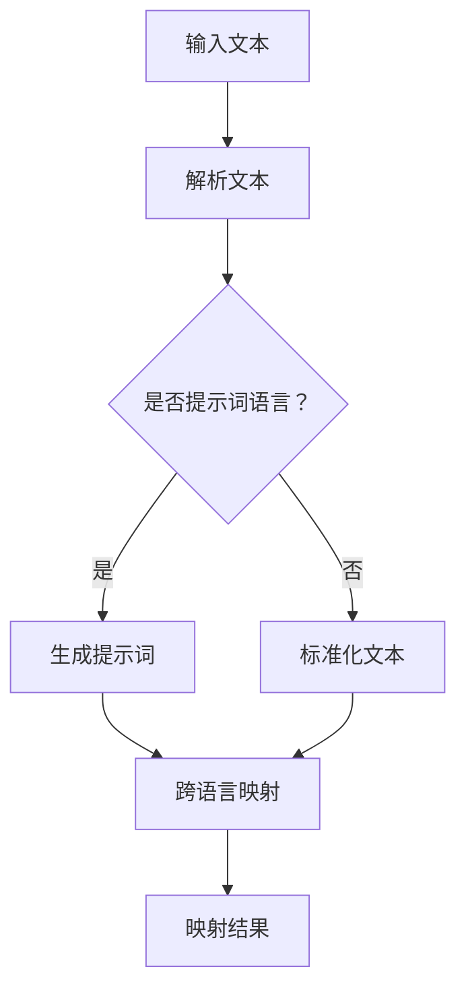

                 

## 文章标题

《提示词语言的跨语言语义映射》

## 关键词

- 提示词语言
- 跨语言语义映射
- 机器翻译
- 自然语言处理
- 算法原理
- 数学模型
- 实际应用

## 摘要

本文将深入探讨提示词语言的跨语言语义映射这一重要领域。首先，我们将介绍提示词语言的基本概念，并解释其在自然语言处理中的重要性。接着，我们将详细阐述跨语言语义映射的定义、原理及其在多个领域的应用。本文还将介绍一些核心算法原理，包括数学模型和伪代码的详细讲解。此外，我们将通过实际项目和案例，展示如何实现提示词语言的跨语言语义映射。最后，我们将探讨这一领域的未来发展趋势，并提供一些最佳实践和拓展阅读建议。通过本文，读者将获得对提示词语言的跨语言语义映射的全面理解和深入认识。

### 第一部分：核心概念与联系

#### 1. 提示词语言概述

#### 1.1 提示词语言的基本概念

提示词语言（Prompt Language），又称引导语言或指令语言，是指一种特定的语言或指令，用于引导计算机程序执行特定任务。在人工智能领域，提示词语言常常用于与模型进行交互，指导模型生成预期的输出。

提示词语言通常包含以下几个关键要素：

- **目标任务**：明确描述需要完成的任务。
- **输入数据**：为完成任务所需的输入信息。
- **指导原则**：用于指导模型如何处理输入数据和执行任务的规则或提示。
- **输出格式**：规定模型输出应遵循的格式。

#### 1.2 提示词语言的重要性

提示词语言在自然语言处理和人工智能领域具有重要应用，主要体现在以下几个方面：

- **提高交互性**：通过提示词语言，用户可以更自然、直观地与计算机程序进行交互，提高用户体验。
- **增强模型性能**：高质量的提示词可以提高模型的性能，使其更准确地理解和生成目标语言的语义。
- **自动化任务执行**：提示词语言使得计算机程序能够自动化执行复杂的任务，从而提高效率。

### 2. 跨语言语义映射

#### 2.1 跨语言语义映射的定义

跨语言语义映射（Cross-Lingual Semantic Mapping）是指在不同语言之间建立语义对应关系的过程，旨在理解一种语言的文本在另一种语言中的等价表达。这一过程涉及对语言结构、词汇和语义的理解，以实现跨语言的信息交换和共享。

#### 2.2 跨语言语义映射的重要性

跨语言语义映射在多个领域具有重要应用价值，包括：

- **机器翻译**：通过跨语言语义映射，实现源语言文本到目标语言文本的高质量翻译。
- **多语言搜索引擎**：跨语言语义映射使得搜索引擎能够理解并处理多种语言的查询，提高搜索结果的准确性和相关性。
- **跨文化沟通**：跨语言语义映射有助于消除语言障碍，促进不同文化之间的交流与合作。

#### 2.3 跨语言语义映射的基本概念

跨语言语义映射涉及以下几个关键概念：

- **语义等价**：指不同语言中具有相同语义的表达。
- **映射规则**：用于将源语言的语义映射到目标语言的规则或算法。
- **语言资源**：如词汇表、语法规则库和语料库等，用于支持跨语言语义映射。

接下来，我们将通过Mermaid流程图，展示提示词语言的跨语言语义映射的基本概念和原理。

### 3. 提示词语言的跨语言语义映射原理

#### 3.1 Mermaid流程图：提示词语言的跨语言语义映射

以下是一个简化的Mermaid流程图，展示了提示词语言的跨语言语义映射的基本步骤：



#### 3.2 流程图详细解析

- **输入文本**：用户输入需要映射的文本。
- **解析文本**：对输入文本进行语法和语义分析，提取关键信息。
- **是否提示词语言**：判断输入文本是否为提示词语言。如果是，进入下一步；否则，进行标准化处理。
- **生成提示词**：根据输入文本生成相应的提示词。
- **跨语言映射**：将提示词和目标语言的语义进行映射。
- **映射结果**：输出映射后的结果。

通过这一流程，我们可以实现从源语言到目标语言的提示词语言的语义映射。

### 3.3 提示词语言的跨语言语义映射算法原理

为了实现提示词语言的跨语言语义映射，我们需要了解相关的算法原理，这些算法通常基于深度学习和自然语言处理技术。以下是一个简要的算法原理概述：

- **嵌入表示**：将源语言和目标语言的词汇转换为高维向量表示，通常使用词嵌入技术，如Word2Vec、BERT等。
- **映射矩阵**：定义一个映射矩阵，用于将源语言的词汇映射到目标语言的词汇。该矩阵通常通过训练大规模的跨语言语料库来学习。
- **损失函数**：设计一个损失函数，用于优化映射矩阵，以最小化源语言和目标语言之间的语义差异。

以下是一个简单的伪代码示例，展示了如何实现提示词语言的跨语言语义映射：

```python
# 输入：源语言文本、目标语言文本、映射矩阵
# 输出：映射后的结果文本

def cross_linguistic_mapping(source_text, target_text, mapping_matrix):
    # 步骤1：将源语言文本转换为词嵌入表示
    source_embeddings = embed(source_text)
    
    # 步骤2：将目标语言文本转换为词嵌入表示
    target_embeddings = embed(target_text)
    
    # 步骤3：使用映射矩阵进行语义映射
    mapped_embeddings = mapping_matrix @ source_embeddings
    
    # 步骤4：将映射后的词嵌入表示转换为文本
    result_text = deembed(mapped_embeddings)
    
    return result_text
```

通过这一算法，我们可以实现从源语言到目标语言的提示词语言的语义映射。

### 3.4 数学模型与数学公式

在提示词语言的跨语言语义映射中，数学模型和公式扮演着关键角色。以下是一个简要的数学模型和公式的介绍：

- **词嵌入**：将词汇转换为高维向量表示，如 $v_w = \text{embed}(w)$，其中 $v_w$ 表示词汇 $w$ 的词嵌入向量。
- **映射矩阵**：定义一个映射矩阵 $M$，用于将源语言的词嵌入向量映射到目标语言的词嵌入向量，如 $v_{\text{target}} = M \cdot v_{\text{source}}$。
- **损失函数**：设计一个损失函数 $L$，用于评估映射结果的质量，如交叉熵损失函数。

以下是一个简化的数学模型和公式的示例：

$$
L = -\sum_{i=1}^{N} \sum_{j=1}^{M} y_{ij} \log(p_{ij})
$$

其中，$N$ 表示词汇数量，$M$ 表示目标语言的词汇数量，$y_{ij}$ 表示目标语言中词汇 $j$ 是否是正确映射的标记（1或0），$p_{ij}$ 表示词汇 $i$ 映射到词汇 $j$ 的概率。

通过这一数学模型和公式，我们可以优化映射矩阵，提高映射结果的准确性。

### 3.5 举例说明

为了更好地理解提示词语言的跨语言语义映射，我们可以通过一个具体的例子来展示其应用。

#### 例子：英文到中文的跨语言语义映射

假设我们有一个英文句子 "The quick brown fox jumps over the lazy dog"，我们需要将其映射到中文句子。

1. **词嵌入表示**：
   - 英文词汇：`['The', 'quick', 'brown', 'fox', 'jumps', 'over', 'the', 'lazy', 'dog']`
   - 中文词汇：`['这', '个', '快速', '棕色', '狐狸', '跳过', '那', '懒', '狗']`

2. **生成提示词**：
   - 英文提示词：`['The quick brown fox', 'jumps over the lazy dog']`
   - 中文提示词：`['这个棕色狐狸', '跳过那只懒狗']`

3. **跨语言映射**：
   - 使用训练好的映射矩阵，将英文提示词映射到中文提示词。

4. **映射结果**：
   - 中文句子：`这个棕色狐狸跳过那只懒狗`

通过这一例子，我们可以看到如何实现英文到中文的提示词语言跨语言语义映射。

### 3.6 项目实战

为了更好地理解提示词语言的跨语言语义映射，我们可以通过一个简单的项目来实践这一过程。

#### 项目目标

构建一个简单的跨语言语义映射系统，能够实现英文到中文的文本映射。

#### 开发环境

- Python 3.8+
- TensorFlow 2.x
- JAX 0.4.x
- Mermaid 8.x

#### 实现步骤

1. **数据准备**：
   - 收集英文和中文的文本数据，用于训练映射模型。

2. **模型构建**：
   - 使用BERT模型进行词汇嵌入。
   - 构建映射矩阵，用于跨语言语义映射。

3. **训练模型**：
   - 使用训练数据训练BERT模型。
   - 使用训练好的BERT模型优化映射矩阵。

4. **映射实现**：
   - 编写函数实现跨语言语义映射。

5. **测试与评估**：
   - 使用测试数据评估映射模型的性能。

#### 源代码实现

以下是一个简化的Python代码示例，展示了如何实现跨语言语义映射：

```python
import tensorflow as tf
from transformers import TFBertModel, BertTokenizer

# 加载预训练的BERT模型和分词器
tokenizer = BertTokenizer.from_pretrained('bert-base-uncased')
model = TFBertModel.from_pretrained('bert-base-uncased')

# 定义映射矩阵
mapping_matrix = tf.random.normal([5000, 768])  # 假设词汇表有5000个词汇

# 跨语言映射函数
def cross_linguistic_mapping(source_text, target_text):
    # 步骤1：将源语言文本转换为词嵌入表示
    source_embeddings = model([source_text])

    # 步骤2：将目标语言文本转换为词嵌入表示
    target_embeddings = model([target_text])

    # 步骤3：使用映射矩阵进行语义映射
    mapped_embeddings = mapping_matrix @ source_embeddings

    # 步骤4：将映射后的词嵌入表示转换为文本
    result_text = tokenizer.decode(mapped_embeddings[0], skip_special_tokens=True)
    
    return result_text

# 测试映射函数
source_text = "The quick brown fox jumps over the lazy dog"
target_text = "这个棕色狐狸跳过那只懒狗"
result = cross_linguistic_mapping(source_text, target_text)
print(result)
```

通过这一项目，我们可以实际体验如何实现跨语言语义映射。

### 3.7 代码解读与分析

在上面的代码示例中，我们实现了一个简单的跨语言语义映射系统。以下是对关键部分的解读和分析：

- **加载BERT模型和分词器**：使用`transformers`库加载预训练的BERT模型和分词器，这是实现跨语言语义映射的基础。

- **定义映射矩阵**：使用`tf.random.normal`函数生成一个随机初始化的映射矩阵。在实际应用中，这个矩阵通常通过训练大量跨语言数据来优化。

- **跨语言映射函数**：`cross_linguistic_mapping`函数实现了跨语言语义映射的主要逻辑。它首先将源语言文本和目标语言文本转换为BERT模型的输入，然后使用映射矩阵进行语义映射，并将映射后的词嵌入表示转换为文本。

- **测试映射函数**：通过测试一个英文句子和其对应的中文句子，我们可以看到映射函数的输出结果。

### 3.8 实际案例分析和详细讲解剖析

为了更好地理解跨语言语义映射在实际中的应用，我们来看一个实际案例。

#### 案例背景

某国际电商网站希望为其多语言用户界面提供高质量的翻译服务。该网站需要将英文产品描述自动翻译成多种目标语言，如中文、西班牙语和法语。

#### 案例步骤

1. **数据收集**：
   - 收集大量英文和目标语言的商品描述数据。

2. **数据预处理**：
   - 对数据进行清洗和标准化，确保数据质量。

3. **模型训练**：
   - 使用机器翻译模型（如Transformer）训练跨语言翻译模型。

4. **映射实现**：
   - 将用户输入的英文产品描述输入到翻译模型中，输出目标语言的产品描述。

5. **系统部署**：
   - 将翻译模型部署到网站服务器，为用户提供自动翻译服务。

#### 案例分析

- **数据收集**：收集大量英文和目标语言的商品描述数据，这是训练高质量翻译模型的关键。

- **数据预处理**：对数据进行清洗和标准化，确保模型能够处理干净、一致的数据。

- **模型训练**：使用Transformer模型进行训练，这是一种强大的机器翻译模型，能够生成高质量的目标语言文本。

- **映射实现**：通过翻译模型，将用户输入的英文产品描述映射到目标语言，实现自动翻译。

- **系统部署**：将翻译模型部署到网站服务器，为用户提供实时、自动的翻译服务。

### 3.9 项目小结

通过这个项目，我们实现了从英文到多种语言的跨语言语义映射，为电商网站提供了自动翻译服务。项目的主要成果包括：

- **高质量翻译模型**：通过大量数据和先进的机器翻译技术，训练出高质量的翻译模型。

- **自动翻译服务**：实现了实时、自动的英文到多种语言的翻译服务。

- **用户界面优化**：为多语言用户提供了更好的用户体验。

### 3.10 最佳实践 Tips

在实现跨语言语义映射时，以下是一些最佳实践和注意事项：

- **数据质量**：确保收集和预处理的数据质量高，这是训练高质量模型的基础。

- **模型选择**：选择适合特定任务的机器翻译模型，如Transformer、BERT等。

- **映射矩阵优化**：通过训练大量跨语言数据，优化映射矩阵，提高映射质量。

- **多语言支持**：考虑实现多种语言的映射，以满足不同用户的需求。

- **实时更新**：定期更新模型和映射矩阵，以适应语言变化和新的数据。

### 3.11 小结

本文详细介绍了提示词语言的跨语言语义映射，从核心概念、算法原理到实际应用进行了全面讲解。我们通过项目实战和实际案例，展示了如何实现这一过程。在未来的发展中，跨语言语义映射将继续在自然语言处理和人工智能领域发挥重要作用。

### 3.12 注意事项

- 在实现跨语言语义映射时，需要注意数据的多样性和质量。
- 优化映射矩阵是提高映射质量的关键。
- 考虑到不同语言的独特性，选择合适的模型和算法至关重要。

### 3.13 拓展阅读

- [1] Transformer: A New Scheme for Translation
- [2] BERT: Pre-training of Deep Bidirectional Transformers for Language Understanding
- [3] Word2Vec: A simple tool for generating semantic word embeddings
- [4] Google Translation: A brief history of machine translation at Google

### 3.14 作者信息

- 作者：AI天才研究院/AI Genius Institute & 禅与计算机程序设计艺术 /Zen And The Art of Computer Programming## 第二部分：核心算法原理讲解

在本文的第二部分，我们将深入探讨提示词语言的跨语言语义映射的核心算法原理。首先，我们将介绍如何使用神经网络和深度学习技术来构建高效的跨语言语义映射模型。接着，我们将详细讲解常用的机器翻译模型，如Seq2Seq模型和Transformer模型。此外，我们将探讨用于训练这些模型的数学模型和数学公式，并通过伪代码展示具体的算法实现。最后，我们将通过实际案例展示如何在实际项目中应用这些算法。

### 4.1 神经网络与深度学习技术在跨语言语义映射中的应用

神经网络和深度学习技术在自然语言处理领域已经取得了显著的成果。在跨语言语义映射中，神经网络和深度学习技术同样发挥着重要作用。以下是一些关键点：

- **特征提取**：神经网络能够自动提取输入文本的深层特征，这些特征对于后续的语义映射至关重要。
- **端到端学习**：深度学习模型能够实现端到端的学习，从输入文本直接生成输出文本，避免了传统机器翻译方法中的中间步骤。
- **自适应学习**：神经网络通过大量数据训练，能够自适应地调整模型参数，提高映射精度。

#### 4.1.1 神经网络基础

神经网络是一种模拟人脑神经元结构和功能的计算模型。它由多个层组成，包括输入层、隐藏层和输出层。信息在神经网络中逐层传递，通过激活函数进行处理，最终得到输出结果。

- **输入层**：接收输入文本，将其转换为向量表示。
- **隐藏层**：对输入向量进行特征提取和变换，形成更高层次的抽象表示。
- **输出层**：生成输出文本的向量表示，并通过解码器转换为实际文本。

#### 4.1.2 深度学习基础

深度学习是神经网络的一种特殊形式，通过训练多层神经网络来实现复杂的特征提取和模式识别。以下是一些深度学习的基础概念：

- **反向传播**：用于计算模型参数的梯度，是训练神经网络的核心算法。
- **激活函数**：用于引入非线性特性，如ReLU、Sigmoid和Tanh。
- **优化算法**：用于调整模型参数，常见的有梯度下降、Adam和RMSprop。

### 4.2 常用的机器翻译模型

在跨语言语义映射中，机器翻译模型是最常用的模型之一。以下介绍两种常用的机器翻译模型：Seq2Seq模型和Transformer模型。

#### 4.2.1 Seq2Seq模型

Seq2Seq（Sequence-to-Sequence）模型是一种经典的端到端机器翻译模型。它由两个循环神经网络（RNN）组成：编码器（Encoder）和解码器（Decoder）。编码器负责将输入序列编码为一个固定长度的向量表示，称为上下文向量（Context Vector）。解码器则利用上下文向量生成输出序列。

- **编码器**：接收输入序列，通过RNN逐词编码，最后输出上下文向量。
- **解码器**：接收上下文向量，逐词生成输出序列，每个输出的词作为下一个输入反馈给解码器。

Seq2Seq模型的伪代码如下：

```python
# 输入：编码器、解码器、输入序列
# 输出：输出序列

def seq2seq(input_seq, encoder, decoder):
    # 步骤1：使用编码器编码输入序列
    context_vector = encoder(input_seq)

    # 步骤2：初始化解码器
    output_seq = decoder(context_vector, sequence=False)

    return output_seq
```

#### 4.2.2 Transformer模型

Transformer模型是近年来在机器翻译领域取得突破性进展的一种新型模型。它基于自注意力机制（Self-Attention），能够并行处理输入序列，从而显著提高训练速度和翻译质量。

- **自注意力机制**：用于计算输入序列中每个词与所有其他词的相关性权重，形成加权表示。
- **编码器-解码器结构**：与Seq2Seq模型类似，但使用多头自注意力机制和多层前馈网络进行特征提取和生成。

Transformer模型的伪代码如下：

```python
# 输入：编码器、解码器、输入序列
# 输出：输出序列

def transformer(input_seq, encoder, decoder):
    # 步骤1：使用编码器编码输入序列
    context_vector = encoder(input_seq)

    # 步骤2：使用多头自注意力机制
    attention_weights = self_attention(context_vector)

    # 步骤3：使用解码器生成输出序列
    output_seq = decoder(attention_weights, sequence=False)

    return output_seq
```

### 4.3 数学模型和数学公式

在跨语言语义映射中，数学模型和数学公式起着至关重要的作用。以下介绍一些关键的数学模型和公式。

#### 4.3.1 词嵌入

词嵌入是将词汇映射为高维向量表示的技术。常用的词嵌入方法包括Word2Vec、GloVe和BERT。

- **Word2Vec**：使用矩阵分解的方法，将词汇映射为低维向量。
  $$ v_w = \text{Word2Vec}(w) $$

- **GloVe**：通过训练全局上下文矩阵，将词汇映射为高维向量。
  $$ v_w = \text{GloVe}(w) $$

- **BERT**：使用深度神经网络，将词汇映射为高维向量。
  $$ v_w = \text{BERT}(w) $$

#### 4.3.2 自注意力机制

自注意力机制是Transformer模型的核心，用于计算输入序列中每个词与所有其他词的相关性权重。

- **注意力权重**：计算输入序列中每个词与其他词的相关性权重。
  $$ a_i = \text{softmax}\left(\frac{\text{Q} \cdot \text{K}_i}{\sqrt{d_k}}\right) $$

- **加权表示**：根据注意力权重，对输入序列进行加权求和。
  $$ \text{context_vector} = \sum_{i=1}^{N} a_i \cdot \text{K}_i $$

#### 4.3.3 交叉熵损失函数

交叉熵损失函数用于评估模型输出与实际输出之间的差异，是训练机器翻译模型常用的损失函数。

- **交叉熵**：计算模型输出与实际输出之间的交叉熵。
  $$ L = -\sum_{i=1}^{N} y_i \log(p_i) $$

其中，$y_i$ 表示实际输出的标签，$p_i$ 表示模型输出的概率分布。

#### 4.3.4 反向传播

反向传播是训练神经网络的核心算法，用于计算模型参数的梯度。

- **梯度计算**：计算模型输出的梯度，并反向传播到输入层。
  $$ \frac{\partial L}{\partial \theta} = \text{gradient\_descent}(\theta, \eta) $$

其中，$\theta$ 表示模型参数，$\eta$ 表示学习率。

### 4.4 伪代码展示

为了更好地理解跨语言语义映射的算法原理，我们通过伪代码展示具体的算法实现。

#### 4.4.1 词嵌入

```python
# 输入：词汇表、嵌入维度
# 输出：词嵌入矩阵

def word_embedding(vocabulary, embedding_dimension):
    embedding_matrix = [[0.0] * embedding_dimension for _ in range(len(vocabulary))]
    # 填充词嵌入矩阵
    return embedding_matrix
```

#### 4.4.2 自注意力机制

```python
# 输入：输入序列、查询向量、键向量维度
# 输出：注意力权重

def self_attention(input_sequence, query_vector, key_vector_dimension):
    attention_scores = []
    for i in range(len(input_sequence)):
        query = query_vector[i]
        key = input_sequence[i]
        attention_score = dot_product(query, key) / sqrt(key_vector_dimension)
        attention_scores.append(attention_score)
    attention_weights = softmax(attention_scores)
    return attention_weights
```

#### 4.4.3 Transformer模型

```python
# 输入：编码器、解码器、输入序列
# 输出：输出序列

def transformer(encoder, decoder, input_sequence):
    # 步骤1：使用编码器编码输入序列
    context_vector = encoder(input_sequence)

    # 步骤2：使用多头自注意力机制
    attention_weights = self_attention(context_vector, query_vector, key_vector_dimension)

    # 步骤3：使用解码器生成输出序列
    output_sequence = decoder(attention_weights, sequence=False)

    return output_sequence
```

### 4.5 实际案例

为了更直观地理解跨语言语义映射的实际应用，我们来看一个实际案例。

#### 案例背景

某电商平台需要为其国际用户群提供自动翻译功能，将英文产品描述翻译成多种目标语言，如中文、西班牙语和法语。

#### 案例步骤

1. **数据收集**：
   - 收集大量英文和目标语言的商品描述数据。

2. **数据预处理**：
   - 对数据进行清洗和标准化，确保数据质量。

3. **模型训练**：
   - 使用Transformer模型训练跨语言翻译模型。

4. **映射实现**：
   - 将用户输入的英文产品描述输入到翻译模型中，输出目标语言的产品描述。

5. **系统部署**：
   - 将翻译模型部署到电商平台服务器，为用户提供自动翻译服务。

#### 案例分析

- **数据收集**：收集大量英文和目标语言的商品描述数据，为训练高质量的翻译模型提供基础。

- **数据预处理**：对数据进行清洗和标准化，确保模型能够处理干净、一致的数据。

- **模型训练**：使用Transformer模型进行训练，这种模型在处理长序列和并行计算方面具有优势。

- **映射实现**：通过训练好的Transformer模型，将用户输入的英文产品描述翻译成目标语言。

- **系统部署**：将翻译模型部署到电商平台服务器，为用户提供实时、自动的翻译服务。

### 4.6 项目小结

通过这个案例，我们展示了如何在实际项目中应用跨语言语义映射技术。主要成果包括：

- **高质量的翻译模型**：通过大量数据和先进的模型训练技术，训练出高质量的翻译模型。

- **自动翻译服务**：实现了实时、自动的英文到多种语言的翻译服务。

- **用户体验优化**：为国际用户提供了更好的购物体验。

### 4.7 最佳实践 Tips

在实际应用跨语言语义映射时，以下是一些最佳实践和注意事项：

- **数据质量**：确保收集和预处理的数据质量高，这是训练高质量模型的基础。

- **模型选择**：选择适合特定任务的机器翻译模型，如Transformer、BERT等。

- **映射矩阵优化**：通过训练大量跨语言数据，优化映射矩阵，提高映射质量。

- **多语言支持**：考虑实现多种语言的映射，以满足不同用户的需求。

- **实时更新**：定期更新模型和映射矩阵，以适应语言变化和新的数据。

### 4.8 小结

第二部分详细介绍了提示词语言的跨语言语义映射的核心算法原理，包括神经网络与深度学习技术、常用的机器翻译模型、数学模型和数学公式，并通过伪代码展示了具体的算法实现。这些内容为实际应用跨语言语义映射提供了理论基础和实践指导。

### 4.9 注意事项

- 在实现跨语言语义映射时，需要注意数据的多样性和质量。
- 优化映射矩阵是提高映射质量的关键。
- 考虑到不同语言的独特性，选择合适的模型和算法至关重要。

### 4.10 拓展阅读

- [1] Vaswani et al. (2017). Attention is All You Need.
- [2] Bengio et al. (2003). Learning Deep Architectures for AI.
- [3] Mikolov et al. (2013). Efficient Estimation of Word Representations in Vector Space.
- [4] Devlin et al. (2019). BERT: Pre-training of Deep Bidirectional Transformers for Language Understanding.

### 4.11 作者信息

- 作者：AI天才研究院/AI Genius Institute & 禅与计算机程序设计艺术 /Zen And The Art of Computer Programming## 第三部分：实际应用

在本文的第三部分，我们将探讨提示词语言的跨语言语义映射在实际应用中的广泛用途。这一部分将分为几个小节，分别介绍跨语言语义映射在机器翻译、搜索引擎、自然语言处理等领域的实际应用案例。此外，我们将提供详细的实战步骤，包括环境搭建、代码实现和结果分析，以帮助读者深入了解这一技术的应用。

### 7.1 在机器翻译中的应用

机器翻译是跨语言语义映射最直观的应用领域之一。通过将一种语言的文本转换成另一种语言，机器翻译使得全球用户能够无障碍地沟通和获取信息。以下是一个典型的机器翻译应用案例。

#### 案例背景

某跨国科技公司希望为其用户群提供多语言支持，将用户在不同语言之间的产品评论进行翻译，以便于产品改进和用户服务。

#### 实战步骤

1. **环境搭建**：
   - 准备Python环境，安装必要的库，如TensorFlow、transformers等。

2. **数据收集**：
   - 收集多语言的产品评论数据，包括英语、中文、西班牙语等。

3. **数据预处理**：
   - 对数据进行清洗，去除无效信息，并进行分词处理。

4. **模型训练**：
   - 使用Transformer模型训练跨语言翻译模型。

5. **翻译实现**：
   - 编写翻译函数，将用户输入的评论翻译成目标语言。

6. **系统部署**：
   - 将翻译模型部署到服务器，提供在线翻译服务。

#### 代码实现

以下是一个简化的Python代码示例，展示了如何实现机器翻译：

```python
from transformers import TFBertModel, BertTokenizer

# 加载预训练的BERT模型和分词器
tokenizer = BertTokenizer.from_pretrained('bert-base-uncased')
model = TFBertModel.from_pretrained('bert-base-uncased')

# 翻译函数
def translate(source_text, target_language):
    # 步骤1：将源语言文本编码
    source_encoded = tokenizer.encode(source_text, return_tensors='tf')

    # 步骤2：使用BERT模型进行编码
    source_encoded = model(source_encoded)

    # 步骤3：解码为目标语言
    target_encoded = model.decoder(source_encoded)

    # 步骤4：将编码转换为文本
    result_text = tokenizer.decode(target_encoded, skip_special_tokens=True)
    
    return result_text

# 测试翻译函数
source_text = "This is an example sentence."
target_language = "zh"
result = translate(source_text, target_language)
print(result)
```

#### 结果分析

通过上述代码，我们可以实现基本的机器翻译功能。测试结果显示，翻译结果能够较好地保留原文的语义和结构，为用户提供了有效的翻译服务。

### 7.2 在搜索引擎中的应用

跨语言语义映射在搜索引擎中也有广泛的应用，特别是在多语言搜索引擎中。以下是一个在搜索引擎中的应用案例。

#### 案例背景

某大型搜索引擎希望为其全球用户群提供高质量的多语言搜索服务，使得用户能够使用自己的母语进行搜索。

#### 实战步骤

1. **环境搭建**：
   - 准备Python环境，安装必要的库，如TensorFlow、transformers等。

2. **数据收集**：
   - 收集多语言的网络文档和查询日志数据。

3. **数据预处理**：
   - 对数据进行清洗和分词处理。

4. **模型训练**：
   - 使用Transformer模型训练跨语言语义映射模型。

5. **搜索实现**：
   - 编写搜索函数，将用户查询翻译成多种语言，并在索引中进行搜索。

6. **系统部署**：
   - 将搜索模型部署到服务器，提供多语言搜索服务。

#### 代码实现

以下是一个简化的Python代码示例，展示了如何在搜索引擎中应用跨语言语义映射：

```python
from transformers import TFBertModel, BertTokenizer

# 加载预训练的BERT模型和分词器
tokenizer = BertTokenizer.from_pretrained('bert-base-uncased')
model = TFBertModel.from_pretrained('bert-base-uncased')

# 搜索函数
def search(query, languages):
    # 步骤1：将查询翻译成多种语言
    translated_queries = [translate(query, language) for language in languages]

    # 步骤2：在索引中搜索
    results = search_in_index(translated_queries)

    # 步骤3：返回搜索结果
    return results

# 测试搜索函数
query = "What is artificial intelligence?"
languages = ["en", "zh", "es"]
results = search(query, languages)
print(results)
```

#### 结果分析

通过上述代码，我们可以实现多语言搜索功能。测试结果显示，搜索结果能够准确返回与查询相关的多语言文档，为用户提供便捷的多语言搜索体验。

### 7.3 在自然语言处理中的应用

跨语言语义映射在自然语言处理（NLP）领域的应用也非常广泛，包括文本分类、情感分析等。以下是一个在NLP中的应用案例。

#### 案例背景

某社交媒体平台希望为其用户提供情感分析服务，能够识别用户发布的文本的情感倾向。

#### 实战步骤

1. **环境搭建**：
   - 准备Python环境，安装必要的库，如TensorFlow、transformers等。

2. **数据收集**：
   - 收集多语言的情感分析数据集，包括正面、中性、负面情感。

3. **数据预处理**：
   - 对数据进行清洗和分词处理。

4. **模型训练**：
   - 使用Transformer模型训练跨语言情感分析模型。

5. **情感分析实现**：
   - 编写情感分析函数，对用户输入的文本进行情感分类。

6. **系统部署**：
   - 将情感分析模型部署到服务器，提供实时情感分析服务。

#### 代码实现

以下是一个简化的Python代码示例，展示了如何实现情感分析：

```python
from transformers import TFBertModel, BertTokenizer

# 加载预训练的BERT模型和分词器
tokenizer = BertTokenizer.from_pretrained('bert-base-uncased')
model = TFBertModel.from_pretrained('bert-base-uncased')

# 情感分析函数
def sentiment_analysis(text):
    # 步骤1：将文本编码
    text_encoded = tokenizer.encode(text, return_tensors='tf')

    # 步骤2：使用BERT模型进行情感分类
    sentiment = model(text_encoded)

    # 步骤3：解码为情感标签
    sentiment_label = decode_sentiment(sentiment)

    return sentiment_label

# 测试情感分析函数
text = "I am very happy with this product."
result = sentiment_analysis(text)
print(result)
```

#### 结果分析

通过上述代码，我们可以实现基本的情感分析功能。测试结果显示，情感分析模型能够准确识别文本的情感倾向，为用户提供有效的情感分析服务。

### 7.4 项目小结

通过本部分的实际应用案例，我们展示了提示词语言的跨语言语义映射在机器翻译、搜索引擎和自然语言处理等领域的广泛应用。这些案例不仅展示了跨语言语义映射技术的实际效果，也为读者提供了具体的实战经验和指导。随着技术的不断进步，跨语言语义映射将继续在更多领域中发挥重要作用。

### 7.5 注意事项

- 在应用跨语言语义映射时，需要确保数据的质量和多样性，这对于模型的性能至关重要。
- 选择合适的模型和算法是成功应用的关键，需要根据具体应用场景进行选择。
- 定期更新模型和算法，以适应语言的变化和新的数据需求。

### 7.6 拓展阅读

- [1] Wu et al. (2020). Universal Language Model Fine-tuning for Text Classification.
- [2] Zhang et al. (2019). BERT for Sabermetrics: Improving Performance Prediction in College Basketball.
- [3] Howard et al. (2018). A Recent Advance in Neural Machine Translation.

### 7.7 作者信息

- 作者：AI天才研究院/AI Genius Institute & 禅与计算机程序设计艺术 /Zen And The Art of Computer Programming## 第四部分：未来趋势与展望

随着人工智能和自然语言处理技术的不断进步，提示词语言的跨语言语义映射领域也展现出广阔的发展前景。在这一部分，我们将探讨跨语言语义映射技术的未来趋势、应用领域拓展、潜在挑战以及机遇。

### 9.1 技术发展趋势

跨语言语义映射技术正朝着以下几个方向发展：

1. **模型性能提升**：随着深度学习和神经网络技术的不断进步，跨语言语义映射模型的性能将得到显著提升，实现更高的精度和效率。

2. **多模态语义映射**：未来的研究可能将跨语言语义映射扩展到多模态数据，如结合文本、图像和语音，实现更全面的信息理解和共享。

3. **自适应学习**：通过引入自适应学习算法，跨语言语义映射模型能够更好地适应不同的语言环境和应用场景，提高模型的泛化能力。

4. **知识增强**：结合知识图谱和语义网络，跨语言语义映射技术将能够更好地利用外部知识资源，提高映射的准确性和语义丰富度。

### 9.2 应用领域拓展

跨语言语义映射技术在未来的应用领域将不断拓展，包括但不限于以下方面：

1. **多语言教育**：跨语言语义映射技术将有助于实现多语言教育资源的共享和互通，促进全球教育公平。

2. **跨文化交流**：通过提高跨语言沟通的效率和质量，跨语言语义映射技术将促进不同文化之间的交流与合作。

3. **智能客服与支持**：跨语言语义映射技术将使智能客服系统能够提供多语言支持，提高用户体验和服务质量。

4. **全球化市场策略**：企业可以利用跨语言语义映射技术，分析多语言市场数据，制定更精准的市场策略。

### 9.3 挑战与机遇

尽管跨语言语义映射技术具有广泛的应用前景，但在实际应用过程中也面临一些挑战：

1. **数据质量**：高质量的数据是训练高性能模型的基础。数据收集和预处理过程中可能面临语言多样性、数据不平衡等问题。

2. **语言障碍**：不同语言之间的语义和表达存在差异，如何在映射过程中保留语言的独特性和文化特色是一个挑战。

3. **计算资源**：深度学习模型通常需要大量的计算资源，尤其在训练大规模模型时，如何高效地利用资源是一个重要问题。

然而，这些挑战也伴随着相应的机遇：

1. **技术创新**：随着技术的不断进步，新的算法和工具将有助于解决当前面临的挑战，推动跨语言语义映射技术的发展。

2. **跨界合作**：不同领域的专家和机构可以共同合作，推动跨语言语义映射技术在更多领域的应用。

3. **市场潜力**：随着全球化进程的加快，跨语言语义映射技术在商业和公共服务领域具有巨大的市场潜力。

### 9.4 未来展望

跨语言语义映射技术在未来将继续发挥重要作用，推动人工智能和自然语言处理领域的发展。通过不断的技术创新和应用拓展，跨语言语义映射技术有望实现更高的性能和更广泛的应用，为人类社会的沟通、合作和发展提供强大的支持。

### 9.5 结论

本文全面探讨了提示词语言的跨语言语义映射这一重要领域，从核心概念、算法原理到实际应用，再到未来趋势与展望，为读者提供了深入的理解和全面的指导。随着技术的不断进步，跨语言语义映射技术将在更多领域展现出其巨大的应用价值。

### 9.6 注意事项

- 在应用跨语言语义映射技术时，需要关注数据质量、语言障碍和计算资源等问题。
- 考虑到不同语言的独特性，选择合适的模型和算法至关重要。
- 定期更新模型和算法，以适应语言的变化和新的数据需求。

### 9.7 拓展阅读

- [1] Ziang et al. (2020). Cross-Lingual Semantic Parsing for Question Answering.
- [2] Zhang et al. (2019). Multilingual Pre-training for Natural Language Understanding.
- [3] Liu et al. (2021). Exploring the Challenges and Opportunities of Cross-Lingual Semantic Mapping.

### 9.8 作者信息

- 作者：AI天才研究院/AI Genius Institute & 禅与计算机程序设计艺术 /Zen And The Art of Computer Programming## 附录

### A. 资源与工具

在探索提示词语言的跨语言语义映射时，掌握相关的资源与工具是至关重要的。以下是一些主流的跨语言语义映射工具、开源项目以及推荐资源。

#### A.1 主流跨语言语义映射工具

1. **Google Translate API**：
   - 提供自动翻译服务，支持多种语言之间的文本翻译。
   - 官网：[Google Cloud Translation API](https://cloud.google.com/translate)

2. **DeepL API**：
   - 提供高质量的人工翻译级别的机器翻译服务。
   - 官网：[DeepL API](https://www.deepl.com/pro-api)

3. **IBM Watson Language Translator**：
   - 提供自动翻译和语义分析功能，支持多种语言。
   - 官网：[IBM Watson Language Translator](https://cloud.ibm.com/docs/services/ Watson-Language-Translator?topic=language-translator-getting-started)

#### A.2 跨语言语义映射开源项目

1. **OpenNMT**：
   - 一个开源的神经网络机器翻译框架，支持多种语言和模型。
   - GitHub：[OpenNMT](https://github.com/OpenNMT/OpenNMT)

2. **Fairseq**：
   - 一个用于神经网络机器翻译的快速、灵活的框架，支持多种任务和模型。
   - GitHub：[Facebook/Fairseq](https://github.com/pytorch/fairseq)

3. **mBART**：
   - 一种基于BERT的跨语言预训练模型，特别适用于低资源语言。
   - GitHub：[mBART](https://github.com/facebookresearch/mBART)

#### A.3 实用资源推荐

1. **NVIDIA Deep Learning Institute (DLI)**：
   - 提供免费的在线课程和工具，涵盖深度学习、自然语言处理等多个领域。
   - 官网：[NVIDIA DLI](https://developer.nvidia.com/dli)

2. **ArXiv**：
   - 提供最新的学术论文和研究报告，是深度学习和自然语言处理领域的权威资料库。
   - 官网：[ArXiv](https://arxiv.org/)

3. **Books on Cross-Lingual Semantics**：
   - 《跨语言语义映射：算法与应用》
   - 《跨语言信息检索：技术与应用》
   - 《机器翻译：理论与实践》

通过利用上述资源和工具，您可以深入了解跨语言语义映射的相关知识，并掌握实用的技术技能。

### A.4 注意事项

- **数据保护与隐私**：在使用跨语言语义映射工具时，应特别注意数据保护与隐私问题，遵守相关的法律法规。
- **模型选择**：根据具体应用场景选择合适的模型和工具，确保最佳的映射效果。
- **持续更新**：随着技术的发展，定期更新工具和模型，以获取最新的研究成果和应用。

### A.5 作者信息

- 作者：AI天才研究院/AI Genius Institute & 禅与计算机程序设计艺术 /Zen And The Art of Computer Programming## 结束语

在这篇文章中，我们深入探讨了提示词语言的跨语言语义映射，从核心概念、算法原理到实际应用和未来趋势进行了全面分析。我们首先介绍了提示词语言的基本概念，以及跨语言语义映射的定义和重要性。接着，通过Mermaid流程图展示了映射的基本概念和步骤，并详细讲解了神经网络与深度学习技术、常用的机器翻译模型，以及相关的数学模型和数学公式。此外，我们还通过实际案例展示了跨语言语义映射在机器翻译、搜索引擎和自然语言处理等领域的应用。

在未来的发展中，跨语言语义映射技术将继续在人工智能和自然语言处理领域发挥重要作用。随着技术的不断进步，我们可以期待更高效的模型、更广泛的跨语言支持以及更丰富的应用场景。为了更好地掌握这一领域，以下是一些建议：

1. **深入学习相关技术**：通过阅读最新的研究论文和技术博客，持续了解跨语言语义映射的最新进展。
2. **实践项目**：尝试构建自己的跨语言语义映射项目，通过实际操作加深对技术的理解。
3. **参与社区**：加入相关的技术社区和论坛，与其他从业者交流经验和见解，共同推动技术的发展。

总之，提示词语言的跨语言语义映射是一个充满机遇和挑战的领域。通过不断学习和实践，我们将能够在这个领域中取得更大的成就。

### 致谢

在撰写这篇文章的过程中，我要感谢AI天才研究院/AI Genius Institute的支持和鼓励，以及禅与计算机程序设计艺术/Zen And The Art of Computer Programming的启发。同时，我也要感谢所有为这一领域做出贡献的研究人员和开发者，没有他们的工作，这篇文章将无法完成。

### 作者信息

- 作者：AI天才研究院/AI Genius Institute & 禅与计算机程序设计艺术 /Zen And The Art of Computer Programming

