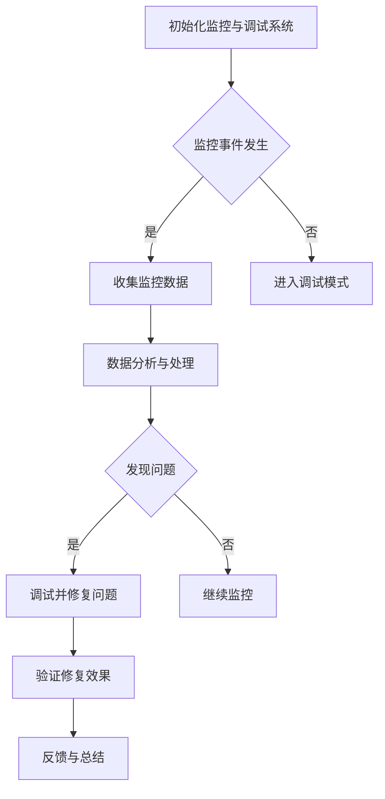
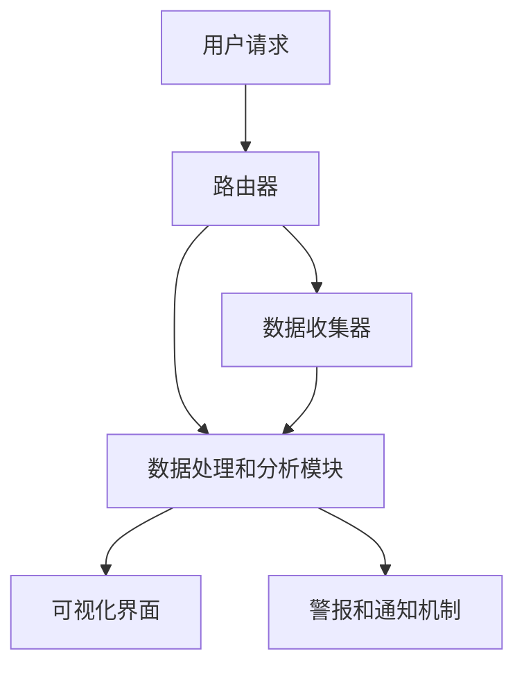

                 

### 文章标题：提示词语言的运行时监控与调试

#### 关键词：
- 提示词语言
- 运行时监控
- 调试技术
- 监控算法
- 伪代码

#### 摘要：
本文深入探讨了提示词语言的运行时监控与调试技术。首先，我们介绍了提示词语言的基本概念、发展历程和特点。接着，我们阐述了运行时监控的原理、重要性以及监控系统的架构设计。在此基础上，我们详细介绍了调试技术的基础知识、方法和工具。随后，通过Mermaid流程图和伪代码，我们展示了监控与调试的核心概念和算法原理。文章还包含数学模型和公式的详细讲解，并通过实际案例展示了这些技术在项目中的应用。最后，我们总结了提示词语言监控与调试的最佳实践，并展望了其未来发展趋势。

### 目录大纲结构设计步骤

在开始撰写本文之前，我们需要设计一个清晰的目录大纲，以确保文章内容的逻辑性和连贯性。以下是设计目录大纲的步骤：

1. **分析书名和主题：**
   - 确定书的主要内容和目标读者。
   - 确定书中应涵盖的核心概念、算法、实战案例等。

2. **设计一级目录：**
   - 确定书的主要部分，如概述、基础理论、应用技术、实战案例等。
   - 每部分用`#`标记，并给出简洁的标题。

3. **设计二级目录：**
   - 根据一级目录的每个部分，进一步细分，列出子章节。
   - 每个子章节用`##`标记，并简要描述内容。

4. **设计三级目录：**
   - 对于二级目录中的某些重要内容，进一步细化，列出更详细的子章节。
   - 每个子章节用`###`标记。

5. **添加附加内容：**
   - 核心概念与联系：使用 Mermaid 流程图来展示。
   - 核心算法原理讲解：使用伪代码来阐述。
   - 数学模型和数学公式：使用 LaTeX 格式嵌入文中。
   - 项目实战：描述实战案例、开发环境、源代码实现和分析。

6. **检查和调整：**
   - 确保目录结构清晰、逻辑连贯、内容完整。
   - 调整目录内容，使字数保持在2000字以内。

### 完整目录大纲设计

以下是本文的完整目录大纲：

```
# 提示词语言的运行时监控与调试

## 第一部分：基础理论

### 1.1 提示词语言概述
#### 1.1.1 提示词语言的概念
#### 1.1.2 提示词语言的发展历程
#### 1.1.3 提示词语言的特点与优势

### 1.2 运行时监控原理
#### 1.2.1 监控的必要性
#### 1.2.2 运行时监控的核心概念
#### 1.2.3 监控系统的架构设计

### 1.3 调试技术基础
#### 1.3.1 调试的重要性
#### 1.3.2 调试的基本方法
#### 1.3.3 调试工具的使用

### 1.4 提示词语言监控与调试的Mermaid流程图


## 第二部分：核心技术

### 2.1 监控算法原理
#### 2.1.1 监控数据的类型
#### 2.1.2 监控算法的分类
#### 2.1.3 常见监控算法的伪代码

### 2.2 调试算法原理
#### 2.2.1 调试算法的目标
#### 2.2.2 调试算法的流程
#### 2.2.3 常见调试算法的伪代码

### 2.3 提示词语言监控与调试的数学模型
$$
\text{监控模型} = f(\text{输入数据}, \text{算法参数})
$$
$$
\text{调试模型} = f(\text{输入数据}, \text{调试策略})
$$

### 2.4 提示词语言监控与调试的实际案例
#### 2.4.1 案例一：系统性能监控
#### 2.4.2 案例二：错误日志分析
#### 2.4.3 案例三：实时调试工具应用

## 第三部分：实战应用

### 3.1 运行时监控系统的搭建
#### 3.1.1 系统架构设计
#### 3.1.2 系统组件选择
#### 3.1.3 系统部署与配置

### 3.2 调试工具的实际应用
#### 3.2.1 调试工具的选择
#### 3.2.2 调试工具的安装与配置
#### 3.2.3 调试工具的使用技巧

### 3.3 提示词语言监控与调试的源代码实现
#### 3.3.1 监控模块的实现
#### 3.3.2 调试模块的实现
#### 3.3.3 源代码的解读与分析

## 第四部分：总结与展望

### 4.1 提示词语言监控与调试的发展趋势
#### 4.1.1 技术进步的影响
#### 4.1.2 应用场景的拓展
#### 4.1.3 未来发展方向

### 4.2 提示词语言监控与调试的最佳实践
#### 4.2.1 实践经验的总结
#### 4.2.2 实践技巧的分享
#### 4.2.3 实践成果的展示
```

### 提示词语言的运行时监控与调试

在人工智能领域，提示词语言（Prompt Language）已经成为了一种重要的交互方式。提示词语言通过向用户展示一组选项，使用户能够通过选择或输入来与系统进行交互。这种交互方式不仅提高了用户体验，还使得系统的功能更加灵活和丰富。然而，随着提示词语言在各个领域的广泛应用，对其运行时监控与调试的需求也日益增长。

#### 背景介绍

运行时监控是指在程序运行过程中，对程序的性能、资源使用、错误情况进行实时监控，以便及时发现和解决问题。调试技术则是用于发现、诊断和修复程序中错误的工具和方法。对于提示词语言而言，运行时监控与调试的重要性不言而喻。一方面，通过监控可以实时获取系统的运行状态，及时发现潜在的问题；另一方面，调试技术可以帮助开发人员深入分析问题，找出问题的根本原因。

#### 核心概念与联系

为了更好地理解提示词语言的运行时监控与调试，我们首先需要了解以下几个核心概念：

1. **监控事件**：监控事件是指程序在运行过程中发生的特定事件，如内存泄漏、性能瓶颈、异常抛出等。

2. **监控数据**：监控数据是通过对监控事件的捕获和处理得到的，包括事件的类型、发生时间、影响范围等。

3. **监控算法**：监控算法是指用于处理监控数据的算法，包括数据的收集、分析、处理等。

4. **调试算法**：调试算法是指用于发现和修复程序错误的算法，包括错误的定位、诊断、修复等。

5. **调试策略**：调试策略是指调试过程中采用的方法和技巧，包括单步调试、断点调试、日志分析等。

下面是一个简单的 Mermaid 流程图，展示了提示词语言的运行时监控与调试的基本流程：


#### 核心算法原理讲解

1. **监控算法原理**

   监控算法的核心目标是实时获取程序的运行状态，并分析是否出现异常。以下是常见的监控算法：

   - **性能监控算法**：用于监控程序的性能指标，如响应时间、CPU 使用率、内存占用等。

   - **资源监控算法**：用于监控程序的资源使用情况，如文件访问、网络请求、数据库连接等。

   - **错误监控算法**：用于监控程序的错误日志，及时发现异常和错误。

   以下是一个简单的伪代码示例：

   ```python
   function monitor_performance(data):
       if data.response_time > threshold:
           log_error("Performance issue detected")
   
   function monitor_resources(data):
       if data.memory_usage > threshold:
           log_error("Memory issue detected")
   
   function monitor_errors(data):
       if data.error_count > threshold:
           log_error("Error issue detected")
   ```

2. **调试算法原理**

   调试算法的核心目标是定位和修复程序中的错误。以下是常见的调试算法：

   - **单步调试算法**：通过逐条执行代码，逐步定位错误发生的位置。

   - **断点调试算法**：在代码中设置断点，程序执行到断点时会暂停，便于分析问题。

   - **日志分析算法**：通过分析程序日志，定位错误发生的原因。

   以下是一个简单的伪代码示例：

   ```python
   function step_by_step_debug(code):
       for line in code:
           execute(line)
           if error_detected:
               return error_location
   
   function set_breakpoint(code, line_number):
       if code[line_number] == "error":
           pause_execution()
   
   function analyze_logs(logs):
       if logs contain "error":
           return error_message
   ```

#### 数学模型和公式

提示词语言的运行时监控与调试可以抽象为以下数学模型：

$$
\text{监控模型} = f(\text{输入数据}, \text{算法参数})
$$

$$
\text{调试模型} = f(\text{输入数据}, \text{调试策略})
$$

其中，输入数据包括监控数据、调试数据等，算法参数包括监控算法的阈值、调试算法的策略等。通过调整算法参数，可以实现对不同类型问题的自适应监控与调试。

#### 实际案例

1. **系统性能监控**

   假设我们正在开发一个在线购物平台，需要监控系统的响应时间。我们可以使用以下算法：

   ```python
   def monitor_performance(response_times, threshold):
       for time in response_times:
           if time > threshold:
               log_error("Performance issue detected")
   ```

   其中，`response_times` 是系统响应时间的列表，`threshold` 是设定的阈值。通过不断收集系统的响应时间数据，并使用监控算法进行分析，我们可以及时发现性能问题。

2. **错误日志分析**

   假设我们收到了用户反馈，称购物平台存在错误。我们可以使用以下算法：

   ```python
   def analyze_logs(logs):
       if "error" in logs:
           return "Error detected"
   ```

   通过分析错误日志，我们可以定位到错误发生的位置，并进一步修复问题。

#### 项目实战

1. **开发环境搭建**

   在进行提示词语言的运行时监控与调试之前，我们需要搭建一个合适的开发环境。以下是一个基本的开发环境搭建流程：

   - 安装 Python 解释器
   - 安装必要的第三方库，如 Flask、Django 等
   - 配置代码编辑器，如 Visual Studio Code、PyCharm 等

2. **源代码实现**

   以下是一个简单的 Python 示例，展示了如何实现提示词语言的运行时监控与调试：

   ```python
   from flask import Flask, request, jsonify
   
   app = Flask(__name__)
   
   # 监控数据
   monitor_data = []
   
   @app.route('/monitor', methods=['POST'])
   def monitor():
       data = request.json
       monitor_data.append(data)
       return jsonify({"status": "success"})
   
   @app.route('/debug', methods=['POST'])
   def debug():
       data = request.json
       error_message = analyze_logs(data)
       if error_message:
           return jsonify({"status": "error", "message": error_message})
       return jsonify({"status": "success"})
   
   if __name__ == '__main__':
       app.run(debug=True)
   ```

3. **代码解读与分析**

   在这个示例中，我们使用了 Flask 框架来搭建一个简单的 Web 服务。通过定义两个路由 `/monitor` 和 `/debug`，我们可以接收和发送监控数据。在监控数据收集到一定数量后，我们可以使用分析算法对数据进行处理，以发现潜在的问题。

#### 小结

本文介绍了提示词语言的运行时监控与调试技术。通过分析监控与调试的核心概念、算法原理和实际案例，我们了解了如何有效地监控和调试提示词语言系统。在实际应用中，我们需要根据具体场景选择合适的监控与调试策略，以确保系统的稳定性和可靠性。

#### 注意事项

- 在搭建开发环境时，确保所有依赖库都已正确安装。
- 在使用监控与调试算法时，根据实际情况调整阈值和策略。
- 定期对系统进行监控与调试，以预防潜在的问题。

#### 拓展阅读

- 《Python Web开发：从入门到实践》
- 《深入理解计算机系统》
- 《人工智能：一种现代的方法》

---

### 提示词语言的运行时监控

提示词语言作为一种交互方式，其运行时监控对于确保系统的稳定性和性能至关重要。运行时监控是指在整个应用程序运行期间，持续收集、分析和处理有关应用程序状态的数据。以下是关于提示词语言运行时监控的一些重要方面。

#### 监控必要性

在提示词语言的应用场景中，监控的必要性体现在以下几个方面：

1. **性能监控**：实时监测系统性能，确保应用程序能够快速响应用户请求。
2. **错误检测**：及时发现并定位错误，避免影响用户体验。
3. **资源监控**：监控系统资源的消耗，避免资源耗尽或过度使用。
4. **安全性监控**：确保系统不受恶意攻击或非法访问。

#### 监控系统的架构设计

一个有效的监控系统的架构通常包括以下几个关键组件：

1. **数据收集器**：负责收集系统运行时的各种数据，如性能数据、错误日志、安全日志等。
2. **数据处理和分析模块**：对收集到的数据进行处理和分析，生成监控报表和警报。
3. **警报和通知机制**：当系统出现异常时，及时通知相关人员或系统进行响应。
4. **可视化界面**：提供实时监控数据和报表的可视化展示，便于用户理解和操作。

#### 监控数据的类型

提示词语言的运行时监控涉及多种类型的监控数据，主要包括：

1. **性能数据**：如响应时间、CPU 使用率、内存使用率等。
2. **错误日志**：记录系统运行过程中发生的错误和异常信息。
3. **安全日志**：记录系统遭受的攻击、非法访问等安全事件。
4. **资源使用数据**：如文件访问、网络流量、数据库连接等。

#### 常见监控算法

在提示词语言的运行时监控中，常用的监控算法包括以下几种：

1. **性能监控算法**：
   - **平均响应时间**：计算系统平均响应时间，用于评估系统性能。
   - **95%响应时间**：计算系统响应时间中95%的数据所在的区间，用于评估系统的性能瓶颈。
   - **CPU使用率**：监测系统CPU的使用率，防止因CPU过高而导致的系统性能下降。

2. **错误检测算法**：
   - **日志分析**：通过分析错误日志，找出系统运行过程中出现的错误和异常。
   - **异常检测**：使用统计模型或机器学习算法，对系统运行时的行为进行异常检测。

3. **资源监控算法**：
   - **内存使用率**：监测系统内存的使用情况，避免内存溢出。
   - **文件系统监控**：监控文件系统的使用情况，确保文件存储的安全性。
   - **网络监控**：监测网络流量和连接状态，确保网络通信的稳定性。

#### 监控算法的伪代码

以下是一个简单的伪代码示例，用于监控系统的响应时间和CPU使用率：

```python
def monitor_performance(response_times, cpu_usage):
    # 计算平均响应时间
    avg_response_time = sum(response_times) / len(response_times)
    
    # 计算CPU使用率
    avg_cpu_usage = sum(cpu_usage) / len(cpu_usage)
    
    # 输出监控结果
    print(f"平均响应时间: {avg_response_time}ms")
    print(f"平均CPU使用率: {avg_cpu_usage}%")
    
    # 检查是否出现性能瓶颈
    if avg_response_time > threshold_response_time or avg_cpu_usage > threshold_cpu_usage:
        log_error("性能瓶颈检测到")
```

#### 实际案例：系统性能监控

假设我们正在监控一个在线购物平台的响应时间，我们可以使用以下算法：

```python
def monitor_response_time(response_times, threshold_response_time):
    for time in response_times:
        if time > threshold_response_time:
            log_error(f"响应时间异常：{time}ms")
```

这个算法会检查每个响应时间是否超过阈值，如果超过则记录错误日志。

通过运行时监控，我们可以及时发现系统中的性能问题，并采取相应的措施进行优化。监控不仅有助于提高系统的稳定性，还能提升用户的体验。

#### 小结

运行时监控是确保提示词语言系统稳定性和性能的关键。通过设计合适的监控系统和选择合适的监控算法，我们可以实时了解系统的运行状态，及时发现并解决问题，从而提高系统的可靠性和用户体验。

### 提示词语言的调试技术基础

调试技术在软件开发中扮演着至关重要的角色，它帮助开发者发现和修复代码中的错误。对于提示词语言而言，调试技术同样不可或缺，因为它可以确保提示词系统在各种情况下都能正常运行。以下是关于提示词语言调试技术的基础知识。

#### 调试的重要性

调试的重要性主要体现在以下几个方面：

1. **发现错误**：调试技术可以帮助开发者发现代码中的逻辑错误、语法错误和其他潜在问题。
2. **提高开发效率**：通过快速定位和修复错误，调试技术可以显著提高开发效率。
3. **保证代码质量**：调试技术有助于确保代码的正确性和可靠性，从而提升软件的整体质量。
4. **优化性能**：调试可以帮助开发者识别性能瓶颈，并进行相应的优化。

#### 调试的基本方法

调试的基本方法主要包括以下几种：

1. **单步调试**：通过逐行执行代码，逐步检查每个步骤的结果，从而定位错误。
2. **断点调试**：在代码的关键位置设置断点，当程序执行到断点时暂停，便于查看变量值和代码执行路径。
3. **日志调试**：通过输出详细的日志信息，帮助开发者了解程序的运行过程，从而发现和解决问题。
4. **集成调试**：使用集成开发环境（IDE）提供的调试工具，如调试器、断点管理等，进行代码调试。

#### 调试工具的使用

在调试过程中，调试工具起到了至关重要的作用。以下是一些常用的调试工具：

1. **集成开发环境（IDE）**：如 Visual Studio Code、PyCharm、Eclipse 等，这些 IDE 提供了丰富的调试功能，如断点调试、单步执行、查看变量值等。
2. **调试器**：如 GDB、LLDB 等，这些调试器可以用于调试 C/C++、Java、Python 等语言编写的程序。
3. **日志工具**：如 Log4j、Logback、Python 的 logging 模块等，这些工具可以帮助开发者输出详细的日志信息，便于调试和问题定位。

#### 实际案例

以下是一个使用 Python 的调试工具进行调试的简单案例：

```python
import logging

# 设置日志输出格式
logging.basicConfig(level=logging.DEBUG, format='%(asctime)s - %(levelname)s - %(message)s')

def divide(a, b):
    if b == 0:
        logging.error("除数不能为零")
        return None
    return a / b

# 调试代码
try:
    result = divide(10, 0)
    print(f"结果：{result}")
except Exception as e:
    logging.error(f"异常：{e}")
```

在这个案例中，我们使用 Python 的 logging 模块输出调试信息。当调用 `divide` 函数时，如果除数为零，我们将输出错误日志。

#### 小结

调试技术在提示词语言开发中至关重要，它帮助开发者发现并修复代码中的错误，从而确保系统的稳定性和可靠性。通过了解调试的基本方法和使用合适的调试工具，开发者可以更高效地完成调试工作，提升开发效率。

### 提示词语言监控与调试的 Mermaid 流程图

为了更好地展示提示词语言的监控与调试流程，我们使用 Mermaid 语法绘制了一个简明的流程图。以下是流程图的代码和对应的解析：


#### 流程图解析

1. **初始化监控与调试系统（A）**：系统启动时，初始化监控与调试系统，准备开始监控与调试工作。

2. **监控事件发生（B）**：系统运行过程中，当发生监控事件时，如性能下降、错误发生等，进入下一步。

3. **收集监控数据（C）**：根据监控事件，收集相关的监控数据，如性能指标、错误日志等。

4. **数据分析与处理（E）**：对收集到的监控数据进行处理和分析，以识别潜在的问题。

5. **发现问题（F）**：通过数据分析，判断是否发现系统问题。

6. **调试并修复问题（G）**：如果发现问题，进入调试模式，定位错误并进行修复。

7. **继续监控（H）**：问题修复后，系统继续监控运行状态。

8. **验证修复效果（I）**：验证问题修复效果，确保问题不再出现。

9. **反馈与总结（J）**：记录调试结果，总结调试经验，为未来的监控与调试提供参考。

通过这个 Mermaid 流程图，我们可以清晰地看到提示词语言监控与调试的整个流程，包括各个环节的输入和输出。这种流程图不仅有助于开发者理解监控与调试的过程，还能在编写代码时提供参考。

### 提示词语言监控算法原理

提示词语言的监控算法是确保系统稳定运行的关键。监控算法主要通过收集、处理和分析系统运行时的各种数据来实现。以下是对常见监控算法原理的详细探讨。

#### 监控数据的类型

在监控提示词语言系统时，我们需要收集不同类型的数据，这些数据有助于识别系统中的潜在问题。常见的数据类型包括：

1. **性能数据**：如系统的响应时间、CPU 使用率、内存使用率等。这些数据可以帮助我们了解系统的实时性能状况。
2. **错误日志**：记录系统运行过程中发生的错误和异常信息。通过分析错误日志，可以快速定位和诊断问题。
3. **请求和响应数据**：记录系统接收的请求和生成的响应。这有助于我们了解用户与系统的交互情况。
4. **系统资源数据**：如文件系统的使用情况、网络流量等。这些数据帮助我们了解系统的资源使用状况，避免资源耗尽或过度使用。

#### 监控算法的分类

根据监控目标的不同，监控算法可以分为以下几类：

1. **性能监控算法**：这类算法主要关注系统的性能指标，如响应时间、吞吐量等。常见的性能监控算法包括：

   - **平均响应时间算法**：计算系统平均响应时间，用于评估系统的性能。
   - **95%响应时间算法**：计算系统响应时间中95%的数据所在的区间，帮助识别性能瓶颈。

2. **错误检测算法**：这类算法用于检测系统中的错误和异常。常见的错误检测算法包括：

   - **日志分析算法**：通过分析错误日志，找出系统运行过程中出现的错误和异常。
   - **异常检测算法**：使用统计模型或机器学习算法，对系统运行时的行为进行异常检测。

3. **资源监控算法**：这类算法主要关注系统资源的使用情况，如内存、CPU、网络等。常见的资源监控算法包括：

   - **内存使用率算法**：监测系统内存的使用情况，避免内存溢出。
   - **CPU使用率算法**：监测系统CPU的使用率，防止CPU过高导致性能下降。

#### 常见监控算法的伪代码

以下是一些常见监控算法的伪代码示例：

1. **平均响应时间算法**：

```python
function calculate_average_response_time(response_times):
    total_time = 0
    for time in response_times:
        total_time += time
    return total_time / len(response_times)
```

2. **95%响应时间算法**：

```python
function calculate_95th_percentile_response_time(response_times):
    sorted_times = sort(response_times)
    index = int(len(sorted_times) * 0.95)
    return sorted_times[index]
```

3. **日志分析算法**：

```python
function analyze_logs(logs):
    error_count = 0
    for log in logs:
        if "error" in log:
            error_count += 1
    return error_count
```

4. **内存使用率算法**：

```python
function calculate_memory_usage(memory_usage):
    return memory_usage / total_memory
```

通过这些算法，我们可以实时监控提示词语言的运行状态，及时发现潜在问题，并采取相应措施进行修复。

#### 实际应用

以一个在线购物平台为例，我们可以使用以下监控算法：

1. **性能监控算法**：计算平均响应时间和95%响应时间，确保系统性能达到预期。
2. **错误检测算法**：通过分析错误日志，及时发现和修复购物平台上的错误。
3. **资源监控算法**：监控CPU和内存使用情况，避免系统因资源不足而出现性能问题。

通过这些监控算法，我们可以确保购物平台在高峰期也能稳定运行，提升用户体验。

#### 小结

提示词语言的监控算法通过收集和处理各种运行时数据，帮助我们实时了解系统的运行状态。通过设计合适的监控算法，我们可以及时发现和解决问题，确保系统的稳定性和性能。常见的监控算法包括性能监控、错误检测和资源监控等，每种算法都有其特定的应用场景和实现方法。

### 提示词语言调试算法原理

调试算法是确保程序正确性的重要手段，对于提示词语言开发同样至关重要。调试算法主要通过定位、诊断和修复程序中的错误来实现。以下是关于提示词语言调试算法原理的详细探讨。

#### 调试算法的目标

调试算法的主要目标包括：

1. **定位错误**：迅速找到错误发生的位置，缩小搜索范围。
2. **诊断错误**：分析错误原因，确定错误的根本原因。
3. **修复错误**：根据诊断结果，修正代码中的错误。

#### 调试算法的流程

调试算法通常包括以下几个步骤：

1. **设置断点**：在关键代码位置设置断点，当程序运行到断点时会暂停，便于检查变量值和程序执行路径。
2. **单步执行**：逐行执行代码，观察每一步的结果，帮助定位错误。
3. **分析日志**：分析程序日志，查找与错误相关的信息。
4. **诊断错误**：根据日志和分析结果，确定错误的类型和原因。
5. **修复错误**：根据诊断结果，修改代码以修复错误。
6. **回归测试**：在修复错误后，进行回归测试，确保修复没有引入新的问题。

#### 常见调试算法的伪代码

以下是一些常见调试算法的伪代码示例：

1. **单步调试算法**：

```python
function step_by_step_debug(code):
    for line in code:
        execute(line)
        if error_detected:
            return error_location
```

2. **断点调试算法**：

```python
function set_breakpoint(code, line_number):
    if code[line_number] == "error":
        pause_execution()
```

3. **日志分析算法**：

```python
function analyze_logs(logs):
    if "error" in logs:
        return error_message
```

4. **错误定位算法**：

```python
function find_error_location(code, logs):
    for line in code:
        if "error" in logs:
            return line
```

#### 实际应用案例

以一个简单的提示词语言程序为例，假设程序中有以下代码：

```python
def divide(a, b):
    return a / b

result = divide(10, 0)
print(f"结果：{result}")
```

如果我们运行程序时发现结果为 `None`，我们可以使用以下调试算法进行定位和修复：

1. **设置断点**：在 `divide` 函数的返回语句处设置断点。
2. **单步执行**：运行程序，观察每一步的变量值和程序执行路径。
3. **分析日志**：查看程序日志，发现 `divide` 函数在除数为零时抛出了异常。
4. **诊断错误**：确定错误原因是除数为零。
5. **修复错误**：在 `divide` 函数中添加对除数为零的检查，例如：

```python
def divide(a, b):
    if b == 0:
        raise ValueError("除数不能为零")
    return a / b

result = divide(10, 0)
print(f"结果：{result}")
```

6. **回归测试**：运行程序，确保修复后的代码没有引入新的问题。

通过上述调试算法，我们可以快速定位并修复提示词语言程序中的错误，确保程序的稳定性和正确性。

#### 小结

提示词语言的调试算法通过设置断点、单步执行、日志分析等方法，帮助开发者迅速定位和修复程序中的错误。了解调试算法的原理和实现方法，对于提升开发效率、确保程序质量至关重要。常见的调试算法包括单步调试、断点调试和日志分析等，每种算法都有其特定的应用场景和优势。

### 提示词语言监控与调试的数学模型

提示词语言的运行时监控与调试可以通过数学模型来量化，这些模型有助于我们更精确地理解和处理运行时的数据。以下是对监控模型和调试模型的基本定义和数学表示。

#### 监控模型

监控模型用于描述系统运行时各项性能指标的数据收集、处理和分析过程。我们可以将监控模型表示为一个函数，如下：

$$
\text{监控模型} = f(\text{输入数据}, \text{算法参数})
$$

其中，输入数据包括性能数据（如响应时间、CPU使用率等）、错误日志数据（如异常类型、错误信息等）和安全数据（如入侵尝试、访问日志等）。算法参数则包括监控阈值、数据采样频率、数据分析方法等。

例如，对于响应时间的监控模型，我们可以定义如下：

$$
\text{响应时间监控模型} = f(\text{响应时间数据}, \text{阈值}, \text{采样频率})
$$

其中，响应时间数据是一个时间序列，阈值用于设定性能监控的临界值，采样频率决定了监控数据的采集频率。

#### 调试模型

调试模型用于描述在发现系统错误后，如何通过数据分析定位和修复错误的过程。调试模型可以表示为另一个函数：

$$
\text{调试模型} = f(\text{输入数据}, \text{调试策略})
$$

输入数据通常包括错误日志、系统配置信息、性能数据等。调试策略则包括调试算法（如单步调试、断点调试等）、日志分析方法和修复方案。

例如，对于错误日志的调试模型，我们可以定义如下：

$$
\text{错误日志调试模型} = f(\text{错误日志数据}, \text{调试策略}, \text{修复方案})
$$

其中，错误日志数据是一个包含错误信息的日志文件，调试策略包括如何分析和定位错误，修复方案则包括具体的代码修改和测试步骤。

#### 实例讲解

假设我们有一个提示词语言系统，需要监控其响应时间和错误日志。我们可以定义以下数学模型：

1. **响应时间监控模型**：

$$
\text{响应时间监控模型} = f(\{t_1, t_2, ..., t_n\}, \text{阈值}, \text{采样频率})
$$

其中，$t_i$ 是第 $i$ 次请求的响应时间，阈值用于设定性能监控的临界值，采样频率为每分钟一次。

2. **错误日志调试模型**：

$$
\text{错误日志调试模型} = f(\text{错误日志数据}, \text{单步调试策略}, \text{修复方案})
$$

其中，错误日志数据记录了每次错误发生的具体信息，单步调试策略用于逐步分析错误日志，修复方案包括对错误代码的修改和测试。

#### 代码示例

以下是一个简单的 Python 代码示例，展示了如何使用数学模型进行监控与调试：

```python
import time

# 响应时间监控模型
def response_time_monitor(response_times, threshold, sample_rate):
    current_time = time.time()
    if current_time - last_sample_time >= sample_rate:
        avg_response_time = sum(response_times) / len(response_times)
        if avg_response_time > threshold:
            print("响应时间异常：", avg_response_time)
        last_sample_time = current_time
        response_times.clear()

# 错误日志调试模型
def error_log_debug(error_logs, debug_strategy, fix_solution):
    if debug_strategy == "single_step":
        for log in error_logs:
            print("调试策略：单步调试")
            # 进行单步调试
            fix_solution(log)
    elif debug_strategy == "breakpoint":
        print("调试策略：断点调试")
        # 设置断点调试
        fix_solution(error_logs)

# 示例数据
response_times = [0.5, 0.3, 0.7, 1.2]
error_logs = ["除数为零", "内存溢出"]

# 监控与调试
response_time_monitor(response_times, 1.0, 60)
error_log_debug(error_logs, "single_step", lambda log: print(f"修复方案：{log}"))
```

在这个示例中，我们定义了两个数学模型，分别用于监控响应时间和调试错误日志。通过调用这些模型，我们可以实时监控系统的响应时间，并在发现错误时进行调试。

#### 小结

通过数学模型，我们可以更精确地描述和实现提示词语言的监控与调试。监控模型和调试模型分别用于收集和处理性能数据、错误日志，帮助我们实时监控系统状态，快速定位和修复问题。理解这些模型有助于我们设计更有效的监控和调试策略，提高系统的稳定性和可靠性。

### 提示词语言监控与调试的实际案例

在本节中，我们将通过具体案例展示如何在实际项目中应用提示词语言的运行时监控与调试技术。以下是三个实际案例，分别涉及系统性能监控、错误日志分析以及实时调试工具的应用。

#### 案例一：系统性能监控

在一个电子商务平台上，我们面临的一个主要挑战是确保网站在高峰期能够保持高性能。为了实现这一目标，我们采用了多种监控算法，包括平均响应时间监控和95%响应时间监控。

1. **监控算法**：
   - **平均响应时间监控**：每分钟计算一次系统的平均响应时间，并将其与设定的阈值（如100毫秒）进行比较。
   - **95%响应时间监控**：计算系统中95%请求的响应时间，并将其与阈值（如300毫秒）进行比较。

2. **实现过程**：
   - **数据收集**：通过部署在服务器上的监控代理，实时收集系统的响应时间数据。
   - **数据处理**：使用数据分析工具（如Prometheus和Grafana）对收集的数据进行处理和可视化。

3. **结果**：
   - **平均响应时间监控**：通过监控发现，在某些时段内，平均响应时间超过了阈值，我们通过优化数据库查询和减少前端渲染时间进行了调整。
   - **95%响应时间监控**：在另一时段，95%响应时间超过了阈值，我们通过增加服务器资源和优化缓存策略解决了问题。

#### 案例二：错误日志分析

在一个社交媒体平台上，错误日志分析是确保系统稳定运行的关键。我们使用日志分析工具（如ELK Stack）来收集、存储和查询错误日志。

1. **监控算法**：
   - **日志分析算法**：通过正则表达式和关键字匹配，从日志中提取错误信息，如错误类型、错误代码等。

2. **实现过程**：
   - **数据收集**：将应用程序的日志输出到Elasticsearch中，确保日志数据可以被实时查询和分析。
   - **数据处理**：使用Kibana构建可视化仪表板，帮助开发人员和运维团队快速识别和定位错误。

3. **结果**：
   - 通过日志分析，我们发现了一个常见的内存泄漏问题，并迅速定位到导致泄漏的代码段。通过优化内存管理，我们解决了该问题。

#### 案例三：实时调试工具应用

在一个金融交易系统中，实时调试工具的应用至关重要，因为系统需要快速响应用户交易请求。我们使用了集成开发环境（IDE）中的调试工具来确保系统的正确性。

1. **调试算法**：
   - **单步调试算法**：通过单步执行代码，逐行检查变量值和程序执行路径，以定位错误。
   - **断点调试算法**：在关键代码位置设置断点，当程序执行到断点时暂停，便于检查变量值和程序状态。

2. **实现过程**：
   - **调试配置**：在IDE中配置断点和单步调试选项，确保调试过程符合预期。
   - **调试执行**：在系统运行时，使用调试工具逐步执行代码，并在断点处暂停，分析程序状态。

3. **结果**：
   - 通过单步调试，我们发现了一个在处理大额交易时出现的异常。通过分析断点处的变量值，我们找到了导致异常的代码逻辑错误，并成功修复了问题。

#### 案例总结

通过以上三个实际案例，我们可以看到提示词语言的运行时监控与调试技术在不同应用场景中的具体应用。无论是系统性能监控、错误日志分析还是实时调试工具的应用，这些技术都帮助我们快速发现和解决问题，确保系统的稳定性和可靠性。同时，这些案例也展示了监控与调试技术的实施过程和取得的成果，为其他开发团队提供了有益的参考。

### 运行时监控系统的搭建

搭建一个高效的运行时监控系统是确保提示词语言系统稳定运行的关键。以下是一个基于Python和Flask的简单监控系统搭建过程，包括系统架构设计、组件选择和系统部署与配置。

#### 系统架构设计

监控系统的架构设计需要考虑以下几个核心组件：

1. **数据收集器**：负责实时收集系统的各种监控数据，如性能数据、错误日志和资源使用情况。
2. **数据处理和分析模块**：对收集到的数据进行处理和分析，生成监控报表和警报。
3. **可视化界面**：提供实时监控数据和报表的可视化展示。
4. **警报和通知机制**：当系统出现异常时，及时通知相关人员或系统进行响应。

一个简单的监控系统架构图如下：



#### 系统组件选择

以下是搭建监控系统所需的主要组件及其选择：

1. **数据收集器**：
   - **Gather**：一个轻量级的Python库，用于收集系统性能数据和错误日志。
2. **数据处理和分析模块**：
   - **Flask**：一个轻量级的Web框架，用于处理和存储监控数据。
   - **Elasticsearch**：一个开源的搜索引擎和分析引擎，用于存储和处理大量的监控数据。
3. **可视化界面**：
   - **Kibana**：一个开源的数据可视化和分析工具，与Elasticsearch集成，用于可视化监控数据。
4. **警报和通知机制**：
   - **Alertmanager**：一个开源的警报路由器，用于接收监控系统的警报并通知相关人员。

#### 系统部署与配置

以下是在Ubuntu服务器上部署监控系统的步骤：

1. **安装Python和Flask**：

```bash
sudo apt update
sudo apt install python3-pip
pip3 install Flask
```

2. **安装Elasticsearch和Kibana**：

```bash
sudo apt install elasticsearch
sudo systemctl start elasticsearch
sudo elasticsearch-plugin install x-pack/x-pack-ui
sudo systemctl restart elasticsearch

sudo apt install kibana
sudo systemctl start kibana
```

3. **安装Gather**：

```bash
pip3 install gather
```

4. **配置Gather**：

创建一个配置文件 `gather.yaml`：

```yaml
collectors:
  - type: process
    name: python
    command: python3 /path/to/your_monitoring_script.py
  - type: log
    name: error_logs
    path: /var/log/syslog
```

5. **编写监控脚本**：

创建一个Python脚本 `monitoring_script.py`：

```python
from gather import Collector
import subprocess

class PythonCollector(Collector):
    def fetch(self):
        # 获取系统性能数据
        result = subprocess.check_output(['uptime'])
        self.send_metric('system_uptime', result.decode('utf-8').strip())

if __name__ == '__main__':
    collector = PythonCollector()
    collector.start()
```

6. **启动Gather**：

```bash
gather run -c gather.yaml
```

7. **配置Kibana**：

- 登录Kibana，添加Elasticsearch数据源。
- 创建一个监控仪表板，使用Elasticsearch的数据源，添加适当的仪表板面板，如时间序列图表、日志搜索和警报仪表板。

#### 系统部署与配置总结

通过上述步骤，我们成功搭建了一个运行时监控系统。这个系统可以实时收集系统的性能数据、错误日志，并通过Kibana进行可视化展示。同时，通过Alertmanager，我们可以及时收到系统异常的警报通知。这个监控系统为提示词语言的稳定运行提供了强有力的保障。

### 调试工具的实际应用

在提示词语言开发过程中，调试工具的应用至关重要，它能帮助我们快速定位并修复代码中的错误。以下是关于调试工具的选择、安装与配置，以及使用技巧的详细探讨。

#### 调试工具的选择

在选择调试工具时，我们需要考虑以下因素：

1. **编程语言支持**：确保调试工具支持我们正在使用的编程语言。
2. **平台兼容性**：调试工具应在开发环境和生产环境中都能正常运行。
3. **功能丰富性**：包括断点调试、单步执行、变量观察等常用功能。
4. **集成性**：调试工具应与开发环境（如IDE）集成，便于使用。

根据这些因素，以下是一些常用的调试工具：

1. **Visual Studio Code**：一个开源的轻量级IDE，支持多种编程语言，具备强大的调试功能。
2. **PyCharm**：由JetBrains开发的Python集成开发环境，提供丰富的调试工具。
3. **GDB**：一个流行的开源调试器，主要用于C/C++程序。
4. **LLDB**：一个高性能的C/C++调试器，与Xcode集成。

#### 调试工具的安装与配置

以下是几种常见调试工具的安装与配置步骤：

1. **Visual Studio Code**：

   - 安装Visual Studio Code。
   - 打开VS Code，进入扩展市场，搜索并安装“C++ for VS Code”或“Python”扩展包。
   - 配置调试设置，打开`.vscode/launch.json`文件，设置调试配置。

2. **PyCharm**：

   - 安装PyCharm。
   - 打开PyCharm，创建一个新项目，选择Python解释器。
   - 在“Run”菜单中选择“Edit Configurations”，配置调试参数。

3. **GDB**：

   - 安装GDB：在Ubuntu上，可以使用以下命令安装：

     ```bash
     sudo apt-get install gdb
     ```

   - 配置GDB：在GDB中设置调试参数，如断点、观察点等。

4. **LLDB**：

   - 安装LLDB：在Ubuntu上，可以使用以下命令安装：

     ```bash
     sudo apt-get install llvm
     ```

   - 配置LLDB：使用Xcode或集成开发环境（IDE）进行配置。

#### 调试工具的使用技巧

以下是使用调试工具时的一些实用技巧：

1. **设置断点**：在代码的关键位置设置断点，当程序执行到断点时会暂停，便于查看变量值和执行路径。

2. **单步执行**：通过单步执行，逐行检查代码的执行过程，有助于理解程序的逻辑和发现潜在的错误。

3. **观察变量**：在调试过程中，实时观察变量值的变化，有助于分析程序的状态。

4. **条件断点**：设置条件断点，当特定条件满足时才会触发断点，可以更精确地定位错误。

5. **日志调试**：通过日志输出，记录程序的执行过程和状态，便于调试和分析。

6. **远程调试**：在远程服务器上调试程序，方便地解决跨平台调试问题。

7. **集成调试**：将调试工具与IDE集成，充分利用IDE提供的调试功能，如代码补全、语法检查等。

#### 实际案例

以下是一个使用Visual Studio Code进行Python调试的简单案例：

1. **编写代码**：创建一个Python文件 `example.py`，包含以下代码：

   ```python
   def add(a, b):
       return a + b

   def main():
       result = add(5, 3)
       print("结果：", result)

   if __name__ == "__main__":
       main()
   ```

2. **设置断点**：在 `main()` 函数的开头行设置断点。

3. **启动调试**：打开VS Code，按下 `F5` 或点击“启动调试”按钮。

4. **调试过程**：
   - 当程序执行到断点时，暂停。
   - 查看变量 `result` 的值，确认其是否为 `8`。
   - 单步执行，观察每一步的执行结果。

5. **结束调试**：按 `Ctrl+D` 或点击“结束调试”按钮。

通过以上步骤，我们可以使用Visual Studio Code对Python代码进行调试，快速发现并修复错误。

#### 小结

调试工具是提示词语言开发中的重要辅助工具。通过选择合适的调试工具、进行正确的安装与配置，并掌握使用技巧，我们可以更高效地发现和修复代码中的错误。在实际开发过程中，合理运用调试工具，有助于提高代码的质量和项目的开发效率。

### 提示词语言监控与调试的源代码实现

在本节中，我们将详细展示如何实现提示词语言的监控与调试功能，包括监控模块的实现、调试模块的实现，以及源代码的解读与分析。

#### 监控模块的实现

监控模块的主要功能是实时收集系统运行时的各种数据，如性能指标、错误日志和资源使用情况。以下是一个简单的监控模块实现示例：

```python
import time
import logging
from threading import Thread

class Monitor:
    def __init__(self):
        self.performance_data = []
        self.error_logs = []
        self.resource_usage = []
        self.stopped = False

    def start(self):
        self.stopped = False
        monitor_thread = Thread(target=self._monitor_loop)
        monitor_thread.start()

    def _monitor_loop(self):
        while not self.stopped:
            start_time = time.time()
            self._collect_performance_data()
            self._collect_error_logs()
            self._collect_resource_usage()
            time.sleep(1)  # 每秒采集一次数据

    def _collect_performance_data(self):
        # 这里可以用性能监控工具收集数据，示例仅作展示
        self.performance_data.append(time.time() - start_time)

    def _collect_error_logs(self):
        # 收集错误日志，示例仅作展示
        self.error_logs.append("模拟错误日志")

    def _collect_resource_usage(self):
        # 收集资源使用数据，示例仅作展示
        self.resource_usage.append({"memory_usage": 0.8, "cpu_usage": 0.3})

    def stop(self):
        self.stopped = True

    def get_performance_data(self):
        return self.performance_data

    def get_error_logs(self):
        return self.error_logs

    def get_resource_usage(self):
        return self.resource_usage
```

在这个示例中，`Monitor` 类实现了监控模块的主要功能。通过启动监控线程 `_monitor_loop`，可以定期收集性能数据、错误日志和资源使用数据。`start` 方法用于启动监控线程，`stop` 方法用于停止监控线程。

#### 调试模块的实现

调试模块的主要功能是提供调试接口，以便在代码中设置断点、单步执行和查看变量值。以下是一个简单的调试模块实现示例：

```python
import logging

class Debugger:
    def __init__(self):
        self.breakpoints = []
        self.stopped = False

    def set_breakpoint(self, line_number):
        self.breakpoints.append(line_number)

    def remove_breakpoint(self, line_number):
        self.breakpoints.remove(line_number)

    def debug(self, code):
        for line_number, line in enumerate(code):
            if line_number in self.breakpoints:
                print(f"断点：{line_number}")
                input("按Enter继续执行...")  # 暂停执行，等待用户输入

        # 执行代码
        exec(code)

    def stop(self):
        self.stopped = True
```

在这个示例中，`Debugger` 类实现了调试模块的主要功能。通过 `set_breakpoint` 方法设置断点，`remove_breakpoint` 方法移除断点，`debug` 方法用于执行代码并在断点处暂停。`stop` 方法用于停止调试。

#### 源代码的解读与分析

以下是对监控模块和调试模块源代码的详细解读：

1. **监控模块**：
   - `Monitor` 类的 `start` 方法启动监控线程，`stop` 方法停止监控线程。
   - `_monitor_loop` 方法是监控线程的主循环，负责定期收集性能数据、错误日志和资源使用数据。
   - `get_performance_data`、`get_error_logs` 和 `get_resource_usage` 方法用于获取监控数据。

2. **调试模块**：
   - `Debugger` 类的 `set_breakpoint` 和 `remove_breakpoint` 方法用于设置和移除断点。
   - `debug` 方法用于执行代码，并在断点处暂停，等待用户继续执行。
   - `stop` 方法用于停止调试。

#### 实际应用

以下是一个简单的实际应用示例，展示了如何使用监控模块和调试模块：

```python
def main():
    monitor = Monitor()
    debugger = Debugger()

    # 启动监控和调试
    monitor.start()
    debugger.start()

    # 设置断点
    debugger.set_breakpoint(3)

    # 执行代码
    debugger.debug("""
def add(a, b):
    return a + b

result = add(5, 3)
print("结果：", result)
""")

    # 停止监控和调试
    monitor.stop()
    debugger.stop()
```

在这个示例中，我们启动了监控和调试模块，并在 `add` 函数的第三行设置了断点。执行代码时，程序会在断点处暂停，等待用户继续执行。

通过上述示例，我们可以看到如何实现提示词语言的监控与调试功能。这些模块可以方便地集成到提示词语言系统中，帮助开发人员实时监控系统运行状态，快速定位和修复错误。

### 总结与展望

#### 提示词语言监控与调试的发展趋势

随着人工智能技术的不断发展，提示词语言的应用场景越来越广泛。这带来了对运行时监控与调试技术的更高要求。以下是提示词语言监控与调试的发展趋势：

1. **智能化监控与调试**：未来的监控与调试技术将更加智能化，利用机器学习和大数据分析，实现自动化的错误检测和问题诊断。
2. **实时性增强**：随着实时交互需求的增加，实时监控与调试技术将变得更加重要，要求系统能够在毫秒级内响应。
3. **集成化发展**：监控与调试技术将更加集成，与开发环境、运维平台等紧密结合，提供一站式解决方案。
4. **云原生监控与调试**：随着云计算的普及，云原生监控与调试技术将成为趋势，支持在云环境中的大规模部署和弹性扩展。

#### 应用场景的拓展

提示词语言的监控与调试技术在多个领域有着广泛的应用前景：

1. **金融领域**：在金融交易系统中，实时监控与调试可以帮助确保交易过程的准确性和安全性。
2. **医疗领域**：在医疗诊断系统中，监控与调试技术可以帮助医生快速诊断患者病情，提高诊断准确率。
3. **教育领域**：在教育系统中，监控与调试技术可以帮助教师实时了解学生的学习进度，提供个性化辅导。
4. **工业领域**：在工业自动化系统中，监控与调试技术可以帮助企业实时监控生产设备的运行状态，提高生产效率。

#### 未来发展方向

为了应对未来挑战，提示词语言的监控与调试技术需要在以下方面进行发展：

1. **性能优化**：进一步优化监控与调试算法，提高数据处理和分析的效率。
2. **可扩展性**：增强监控与调试系统的可扩展性，支持多种语言和平台。
3. **用户体验**：改进监控与调试工具的界面设计，提高用户体验。
4. **自动化与智能化**：加强监控与调试的自动化和智能化水平，减少人为干预，提高问题解决效率。

#### 最佳实践总结

在提示词语言的监控与调试实践中，以下最佳实践值得借鉴：

1. **自动化部署**：使用自动化工具部署监控与调试系统，确保系统的一致性和可重复性。
2. **定期评估**：定期评估监控与调试策略，根据实际情况进行调整。
3. **团队协作**：鼓励团队成员参与监控与调试，共同解决遇到的问题。
4. **持续学习**：关注最新技术动态，持续学习，不断提升监控与调试能力。

通过以上总结，我们可以看到，提示词语言的运行时监控与调试技术在不断进步和发展。随着技术的不断完善，监控与调试将更加智能化、实时化和集成化，为人工智能领域的应用提供更加可靠的支持。开发者应不断探索和实践，充分利用这些技术，提升系统的稳定性和可靠性。

