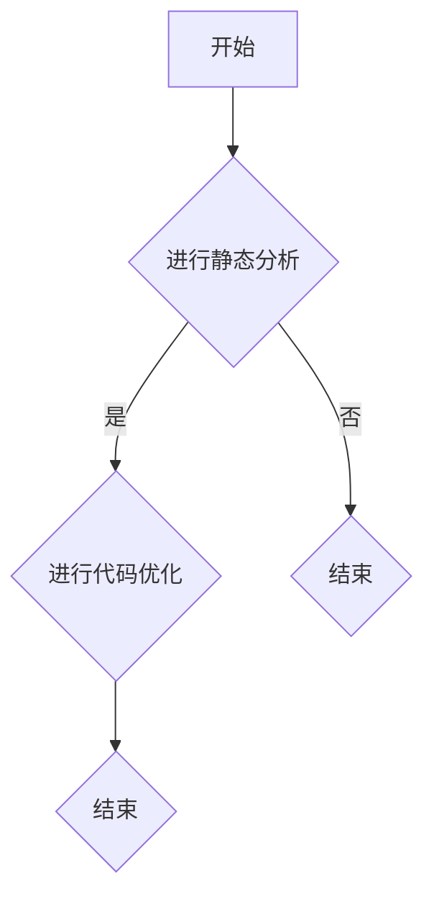
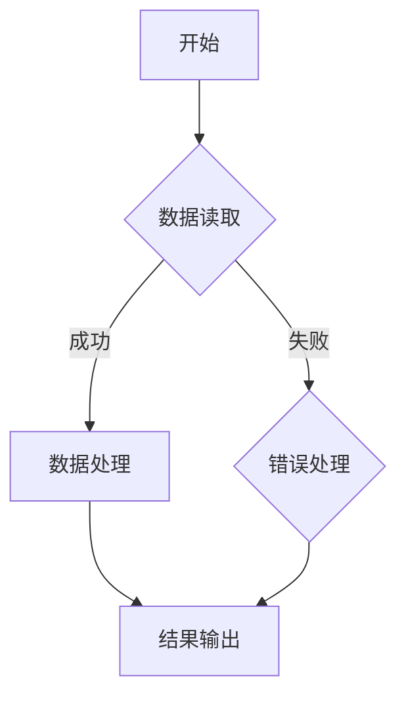
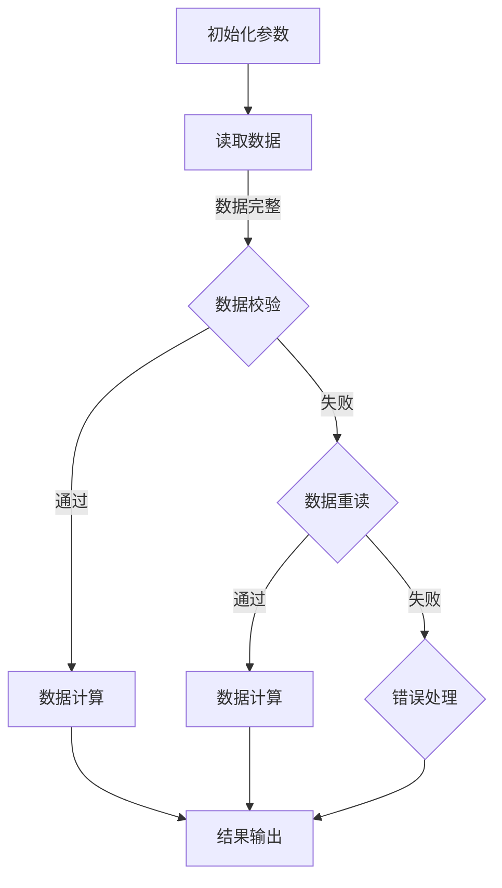
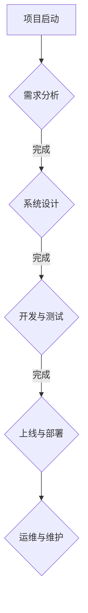

                 

## 文章标题：提示词语言的静态分析与代码优化

### 关键词：提示词语言，静态分析，代码优化，语法分析，语义分析，类型检查，优化工具，算法，数学模型

### 摘要：

本文旨在探讨提示词语言的静态分析与代码优化。首先，我们将介绍提示词语言的基本概念、特点及分类，接着深入解析静态分析的基本原理、语法分析、语义分析和类型检查。在此基础上，我们将探讨代码优化的基本概念、策略和工具。通过Mermaid流程图、伪代码和数学模型，我们将对核心算法进行详细讲解，并借助实际项目实战，展现理论在实践中的应用。最后，文章将对全文进行总结与展望，指出未来研究方向。

## 《提示词语言的静态分析与代码优化》目录大纲

## 第1章 引言

### 1.1 背景与意义

### 1.2 研究目标与方法

## 第2章 提示词语言概述

### 2.1 提示词语言的概念

### 2.2 提示词语言的特点

### 2.3 提示词语言的分类

## 第3章 提示词语言的静态分析

### 3.1 静态分析的基本原理

### 3.2 提示词语言的语法分析

### 3.3 提示词语言的语义分析

### 3.4 提示词语言的类型检查

## 第4章 提示词语言的代码优化

### 4.1 代码优化的基本概念

### 4.2 代码优化策略

### 4.3 代码优化工具

## 第5章 提示词语言的Mermaid流程图

### 5.1 Mermaid概述

### 5.2 Mermaid流程图的应用

### 5.3 提示词语言的Mermaid流程图示例

## 第6章 核心算法原理讲解

### 6.1 算法概述

### 6.2 算法伪代码

### 6.3 算法讲解与举例

## 第7章 数学模型与数学公式

### 7.1 数学模型的基本概念

### 7.2 数学公式的表示方法

### 7.3 提示词语言的数学模型应用

### 7.4 数学公式举例说明

## 第8章 项目实战

### 8.1 实战背景

### 8.2 开发环境搭建

### 8.3 源代码实现

### 8.4 代码解读与分析

## 第9章 总结与展望

### 9.1 本书内容总结

### 9.2 提示词语言的发展趋势

### 9.3 未来研究方向

# Mermaid流程图示例


# 核心算法原理讲解示例
```plaintext
算法概述：
本算法用于对提示词语言的代码进行优化。

算法伪代码：
1. 输入：代码文本
2. 输出：优化后的代码文本
3. 过程：
    a. 对代码进行语法分析，生成抽象语法树（AST）
    b. 对AST进行遍历，查找可优化的代码块
    c. 对每个可优化代码块应用优化策略
    d. 生成优化后的AST，并输出优化后的代码文本
```

# 数学模型与数学公式示例
```latex
### 模型定义
$$
M = \begin{pmatrix}
a_{11} & a_{12} & \cdots & a_{1n} \\
a_{21} & a_{22} & \cdots & a_{2n} \\
\vdots & \vdots & \ddots & \vdots \\
a_{m1} & a_{m2} & \cdots & a_{mn}
\end{pmatrix}
$$

### 模型公式
$$
x = M \cdot y + b
$$
```

## 第1章 引言

### 1.1 背景与意义

提示词语言是一种专门用于描述问题求解过程的计算机语言。它在人工智能、自然语言处理和软件工程等领域有着广泛的应用。随着计算机技术的不断发展，提示词语言的应用场景和复杂度不断增加，对代码的质量和性能提出了更高的要求。

静态分析是一种不运行程序而分析程序特性的技术。它能够发现代码中的潜在错误、性能瓶颈和潜在的优化机会。代码优化则是通过一系列技术手段，对代码进行改进，以提高其运行效率、可维护性和可扩展性。

将静态分析与代码优化相结合，可以有效地提升提示词语言代码的质量和性能。本文旨在探讨这一领域的研究现状、关键技术及未来发展趋势。

### 1.2 研究目标与方法

本文的研究目标包括以下几个方面：

1. 深入理解提示词语言的基本概念、特点和应用场景。
2. 系统性地研究提示词语言的静态分析技术，包括语法分析、语义分析和类型检查。
3. 探讨代码优化的基本概念、策略和工具。
4. 结合实际项目，验证静态分析与代码优化技术的有效性。

本文采用以下研究方法：

1. 文献调研：通过查阅相关文献，了解提示词语言、静态分析和代码优化的基础知识和前沿研究。
2. 理论分析：基于文献调研，分析提示词语言的静态分析技术和代码优化策略，构建完整的理论体系。
3. 实际应用：结合实际项目，验证所提出的静态分析与代码优化技术的有效性，并进行性能评估和比较。
4. 对比分析：对不同静态分析与代码优化技术进行对比，找出优势和不足，为未来研究提供参考。

通过上述研究方法和目标的实施，本文期望为提示词语言的静态分析与代码优化提供理论指导和实践参考。

## 第2章 提示词语言概述

### 2.1 提示词语言的概念

提示词语言（Prompt Language）是一种用于描述问题求解过程的计算机语言。它通常包含一组指令、变量、函数和条件表达式，用于指导计算机执行特定的任务。与传统的编程语言相比，提示词语言更加注重逻辑性和描述性，强调问题的抽象和求解过程的描述。

提示词语言的基本概念包括：

1. 指令：指令是提示词语言中最基本的操作单元，用于描述计算机需要执行的具体操作。
2. 变量：变量是提示词语言中的数据存储单元，用于存储和传递数据。
3. 函数：函数是提示词语言中的模块化操作单元，用于实现特定功能的代码段。
4. 条件表达式：条件表达式用于根据特定条件执行不同的操作。

### 2.2 提示词语言的特点

提示词语言具有以下几个特点：

1. 简洁性：提示词语言的语法简单，易于理解和学习。它通过直观的指令和表达式来描述问题求解过程，减少了冗余的代码和复杂的语法结构。
2. 逻辑性：提示词语言强调逻辑性和描述性，能够清晰地描述问题求解的步骤和条件。这使得提示词语言在人工智能、自然语言处理等领域具有广泛的应用。
3. 易于使用：提示词语言通常具有丰富的库和工具支持，使得开发者可以更快速地构建和优化问题求解系统。
4. 可扩展性：提示词语言具有良好的可扩展性，允许开发者根据需求自定义新的指令、函数和条件表达式，以适应不同的应用场景。

### 2.3 提示词语言的分类

提示词语言可以根据不同的应用场景和特点进行分类，常见的分类方式包括：

1. 基于任务类型的分类：根据提示词语言适用的任务类型，可以分为通用提示词语言和特定领域提示词语言。通用提示词语言适用于多种任务类型，如自然语言处理、图像处理和机器学习等。特定领域提示词语言则专注于某一特定领域，如医疗、金融和法律等。
2. 基于语法结构的分类：根据提示词语言的语法结构，可以分为命令式提示词语言、声明式提示词语言和函数式提示词语言。命令式提示词语言通过一系列指令来描述问题求解过程，声明式提示词语言通过描述问题状态的变化来解决问题，函数式提示词语言则强调函数的模块化和组合。
3. 基于应用领域的分类：根据提示词语言的应用领域，可以分为科学计算提示词语言、数据处理提示词语言和人工智能提示词语言。科学计算提示词语言主要用于科学计算和数值模拟，数据处理提示词语言主要用于数据清洗、转换和分析，人工智能提示词语言则主要用于机器学习和深度学习任务。

通过对提示词语言的分类，可以更好地了解不同类型提示词语言的特点和应用场景，为开发和应用提示词语言提供指导。

### 2.1 提示词语言的概念

提示词语言（Prompt Language）是一种专门用于描述问题求解过程的计算机语言。它旨在提供一种简单、直观的方式，使得开发者能够以自然语言或者半结构化的形式表达问题的求解步骤和策略。与传统的编程语言相比，提示词语言具有更强的描述性和抽象能力，使得问题求解的过程更加清晰和易于理解。

在提示词语言中，开发者可以使用一系列的指令、变量、函数和条件表达式来描述问题求解的逻辑。这些元素共同构成了提示词语言的语法结构，使得开发者可以以更简洁的方式表达复杂的计算过程。

**指令**是提示词语言中最基本的操作单元，它用于描述计算机需要执行的具体操作。例如，一个简单的指令可以是“计算两个数的和”，这将会指导计算机执行相应的计算操作。

**变量**是提示词语言中的数据存储单元，用于存储和传递数据。在问题求解过程中，变量可以用于保存中间结果、输入数据和输出结果。通过使用变量，开发者可以更加灵活地组织和控制计算过程。

**函数**是提示词语言中的模块化操作单元，用于实现特定功能的代码段。函数可以将复杂的计算过程封装成独立的模块，使得代码更加模块化和可重用。例如，一个函数可以用于计算两个数的平均值，然后在其他地方可以直接调用这个函数，而无需重复编写相同的代码。

**条件表达式**用于根据特定条件执行不同的操作。条件表达式可以根据不同的条件分支，指导计算机选择不同的执行路径。这在问题求解过程中非常重要，因为很多问题需要根据不同的条件采取不同的策略。

提示词语言的这些基本概念使得开发者可以以一种更加自然和直观的方式表达问题求解过程，避免了繁琐的代码编写和复杂的语法结构。同时，提示词语言也提供了丰富的库和工具支持，使得开发者可以更加高效地构建和优化问题求解系统。

通过理解提示词语言的概念，我们可以更好地掌握这种语言的特性和优势，为后续的静态分析和代码优化打下坚实的基础。

### 2.2 提示词语言的特点

提示词语言（Prompt Language）作为一种专门用于描述问题求解过程的计算机语言，具有以下显著特点：

**简洁性**：提示词语言的语法设计简洁明了，易于理解和学习。它通过一系列直观的指令、变量、函数和条件表达式来描述问题求解过程，避免了冗余的代码和复杂的语法结构。这使得开发者可以更快速地编写和理解提示词语言代码，从而提高开发效率。

**逻辑性**：提示词语言强调逻辑性和描述性，能够清晰地描述问题求解的步骤和条件。通过使用条件表达式和分支结构，开发者可以精确地定义不同的执行路径，使得代码更加模块化和易于维护。这种逻辑性使得提示词语言在人工智能、自然语言处理和软件工程等领域具有广泛的应用。

**易于使用**：提示词语言通常具有良好的库和工具支持，使得开发者可以更加高效地构建和优化问题求解系统。这些库和工具提供了丰富的函数和操作，可以帮助开发者快速实现复杂的计算过程，而无需从头编写代码。此外，提示词语言的语法设计简单，使得新手开发者也能够快速上手。

**可扩展性**：提示词语言具有良好的可扩展性，允许开发者根据需求自定义新的指令、函数和条件表达式。这种可扩展性使得提示词语言可以适应不同的应用场景和需求，从而提高其通用性和灵活性。

**高效性**：提示词语言的静态分析技术可以帮助开发者发现代码中的潜在错误、性能瓶颈和优化机会。通过静态分析，开发者可以提前发现并解决这些问题，从而提高代码的运行效率。此外，提示词语言的代码优化策略和工具可以进一步优化代码性能，使其在运行时更加高效。

通过这些特点，提示词语言在多个领域展现出了强大的应用潜力。无论是人工智能开发、自然语言处理还是软件工程，提示词语言都能够提供一种简单、高效和灵活的解决方案，从而提高开发效率和代码质量。

### 2.3 提示词语言的分类

提示词语言可以根据其应用场景、语法结构和功能特点进行分类。以下是几种常见的分类方式：

1. **基于任务类型的分类**：
   - **通用提示词语言**：适用于多种不同类型的问题求解，如自然语言处理（NLP）、图像处理、机器学习等。例如，Python、Lua 和 MATLAB 等都是通用提示词语言，具有广泛的应用。
   - **特定领域提示词语言**：专门为某一特定领域设计，如医疗（Cocome）、金融（Lisp Finance）和法律（Legal Language）。这些语言针对特定领域的需求进行了优化，能够提供更加高效和精准的解决方案。

2. **基于语法结构的分类**：
   - **命令式提示词语言**：通过一系列指令描述问题求解过程，如 Python、C++ 和 Java。命令式语言强调对程序状态的改变，适合描述算法和数据处理。
   - **声明式提示词语言**：通过描述问题状态的变化来解决问题，如 SQL 和 Relational Algebra。声明式语言侧重于表达目标，而非具体的执行步骤，适用于数据查询和分析。
   - **函数式提示词语言**：以函数为核心，强调函数的模块化和组合，如 Haskell、Lisp 和 Scala。函数式语言通过函数调用和闭包实现逻辑操作，适用于复杂数学计算和算法设计。

3. **基于应用领域的分类**：
   - **科学计算提示词语言**：主要用于科学研究和数值模拟，如 MATLAB、NumPy 和 SciPy。这些语言提供了丰富的数学库和工具，方便开发者进行复杂的计算。
   - **数据处理提示词语言**：用于数据清洗、转换和分析，如 SQL、Pandas 和 R。这些语言提供了强大的数据处理和分析功能，适用于大数据处理和分析。
   - **人工智能提示词语言**：用于机器学习和深度学习，如 TensorFlow、PyTorch 和 Keras。这些语言提供了高效的模型构建和训练工具，使得开发者能够快速构建和优化机器学习模型。

通过对提示词语言的分类，可以更好地理解不同类型提示词语言的特点和应用场景，为选择合适的语言和工具提供指导。同时，分类也为提示词语言的发展提供了方向，促进了新语言的设计和优化。

### 3.1 静态分析的基本原理

静态分析是一种不运行程序而分析程序特性的技术。它通过在程序运行前对代码进行解析、检查和分析，识别出潜在的错误、性能瓶颈和优化机会。静态分析的基本原理包括以下几个方面：

首先，静态分析通过语法分析将源代码解析成抽象语法树（AST）。抽象语法树是一种树形结构，用于表示程序代码的结构和语义。语法分析是静态分析的第一步，它的目的是将源代码中的语法错误和不符合语法规则的代码片段识别出来。

接下来，静态分析通过语义分析对抽象语法树进行深入分析，以识别出代码中的语义错误和不符合语义规则的代码片段。语义分析包括类型检查、变量检查、函数调用检查等。类型检查是语义分析中的一个重要方面，它确保变量和表达式在使用时具有正确的类型，从而避免类型错误。

此外，静态分析还通过数据流分析来追踪变量和表达式的数据流，以识别出潜在的数据错误和未使用的代码。数据流分析包括向前数据流分析和向后数据流分析。向前数据流分析用于追踪变量的定义和使用点，而向后数据流分析则用于追踪变量的使用点和定义点。

最后，静态分析通过控制流分析来分析程序中的控制流，以识别出潜在的循环、分支和条件语句等控制结构。控制流分析有助于理解程序的执行流程，发现潜在的错误和优化机会。

通过以上几个步骤，静态分析能够全面、准确地分析程序代码，识别出潜在的问题，并提供相应的优化建议。静态分析技术为代码质量和性能提升提供了重要的支持，是现代软件开发中不可或缺的一部分。

### 3.2 提示词语言的语法分析

提示词语言的语法分析是静态分析的重要组成部分，旨在将源代码解析成抽象语法树（Abstract Syntax Tree，AST）。语法分析的过程可以分为以下几个步骤：

**词法分析（Lexical Analysis）**：首先，词法分析器将源代码分解成一系列的词法单元（tokens）。词法单元是源代码中最小的语法元素，如关键字、标识符、运算符和分隔符等。词法分析器通过正则表达式或其他方法对源代码进行扫描，识别出词法单元，并将其转换为内部表示。

**语法分析（Syntactic Analysis）**：接下来，语法分析器根据提示词语言的语法规则，将词法单元序列转换成抽象语法树。语法分析器通常使用递归下降分析、LL(1)分析、LR分析等算法来实现。抽象语法树是一种树形结构，用于表示程序代码的结构和语义。每个节点代表一个语法结构，如表达式、语句、函数等。

**语义分析（Semantic Analysis）**：在完成语法分析后，进行语义分析。语义分析旨在检查代码的语义正确性，包括类型检查、变量检查和函数调用检查等。类型检查确保变量和表达式在使用时具有正确的类型，从而避免类型错误。变量检查确保变量在使用前已被声明和初始化。函数调用检查确保函数调用符合定义，参数数量和类型正确。

**错误处理（Error Handling）**：在语法分析和语义分析过程中，如果发现错误，语法分析器会生成相应的错误信息，并提供错误位置和错误类型。错误处理包括语法错误和语义错误。语法错误通常是由于源代码中的语法规则不正确导致的，而语义错误则是因为代码的语义不正确。

通过上述步骤，语法分析器能够将源代码转换成抽象语法树，并检查代码的语法和语义正确性。抽象语法树作为后续静态分析的输入，为代码优化、错误检测和代码生成等提供了基础。

### 3.3 提示词语言的语义分析

语义分析是提示词语言静态分析中的重要环节，其目的是确保代码在语义上的正确性，从而避免运行时出现错误。语义分析主要包括以下几个步骤：

**类型检查（Type Checking）**：类型检查是语义分析的核心任务，其目的是确保变量和表达式在使用时具有正确的类型。类型检查主要包括以下几个步骤：

1. **静态类型推断**：静态类型推断是通过分析源代码的结构和语义，自动为变量和表达式推断出合适的类型。静态类型推断可以减少运行时的类型错误，提高程序的可靠性和性能。
2. **类型一致性检查**：在程序中，不同类型的数据需要按照特定的规则进行操作。类型一致性检查确保类型兼容性，防止不兼容的类型之间的操作。例如，在 Python 中，将一个字符串与一个整数相加时，会自动进行类型转换。
3. **类型错误报告**：类型检查过程中，如果发现类型不匹配的错误，需要生成相应的错误信息，并指出错误位置和错误类型。类型错误报告有助于开发者快速定位和修复问题。

**变量检查（Variable Checking）**：变量检查确保变量在使用前已被声明和初始化。变量检查主要包括以下几个步骤：

1. **变量声明检查**：在程序中，每个变量都需要进行声明，以指定其类型和作用域。变量声明检查确保变量在使用前已被声明，避免未声明变量的使用。
2. **变量初始化检查**：在程序中，变量的初始化是确保其初始值正确的关键步骤。变量初始化检查确保变量在使用前已被正确初始化，从而避免未初始化变量的使用。
3. **作用域检查**：作用域检查确保变量在正确的范围内被使用。在提示词语言中，变量具有不同的作用域，如局部作用域和全局作用域。作用域检查确保变量在正确的范围内被访问和使用。

**函数调用检查（Function Call Checking）**：函数调用检查确保函数调用符合定义，包括参数数量和类型的检查。函数调用检查主要包括以下几个步骤：

1. **函数声明检查**：在程序中，每个函数都需要进行声明，以指定其参数和返回值类型。函数声明检查确保函数在使用前已被声明。
2. **参数匹配检查**：函数调用时，需要确保参数的数量和类型与函数定义相匹配。参数匹配检查确保函数调用的参数数量和类型正确。
3. **返回值检查**：函数调用后，需要确保返回值的类型与函数定义相匹配。返回值检查确保函数返回值的类型正确。

通过以上步骤，语义分析能够确保代码在语义上的正确性，从而避免运行时出现错误。语义分析不仅有助于提高程序的可靠性，还为后续的代码优化和错误检测提供了重要依据。

### 3.4 提示词语言的类型检查

类型检查是提示词语言语义分析的重要组成部分，旨在确保代码在语义上的正确性。类型检查的主要目标是确保变量和表达式在使用时具有正确的类型，从而避免类型错误。类型检查可以分为静态类型检查和动态类型检查。

**静态类型检查（Static Type Checking）**：静态类型检查在编译时进行，通过分析源代码的结构和语义，自动为变量和表达式推断出合适的类型。静态类型检查的优点是能够在编译时发现类型错误，从而提高程序的可靠性和性能。静态类型检查的主要步骤包括：

1. **类型推断**：通过分析源代码的结构和语义，自动为变量和表达式推断出合适的类型。类型推断可以分为强类型推断和弱类型推断。强类型推断严格遵循类型规则，确保变量和表达式在使用时具有正确的类型；弱类型推断则允许类型转换和隐式类型提升。
2. **类型一致性检查**：在程序中，不同类型的数据需要按照特定的规则进行操作。类型一致性检查确保类型兼容性，防止不兼容的类型之间的操作。例如，在 Python 中，将一个字符串与一个整数相加时，会自动进行类型转换。

**动态类型检查（Dynamic Type Checking）**：动态类型检查在程序运行时进行，通过运行程序时检测变量和表达式的类型，确保在使用时具有正确的类型。动态类型检查的优点是灵活性更高，允许在运行时动态改变变量的类型。动态类型检查的主要步骤包括：

1. **类型绑定**：在程序运行时，为变量和表达式绑定类型。类型绑定可以通过赋值操作或函数调用等实现。
2. **类型匹配检查**：在程序运行时，检查变量和表达式的类型是否匹配。类型匹配检查包括参数匹配检查和返回值匹配检查。

通过静态类型检查和动态类型检查，提示词语言能够确保代码在语义上的正确性，从而避免运行时出现类型错误。类型检查不仅有助于提高程序的可靠性，还为后续的代码优化和错误检测提供了重要依据。

### 4.1 代码优化的基本概念

代码优化是指通过对代码进行改进，以提高其运行效率、可维护性和可扩展性。代码优化的目的是使代码更加简洁、高效，同时保持其逻辑正确性和功能完整性。优化后的代码不仅能够提高程序的运行速度，还能降低内存消耗，减少 CPU 使用率，从而提升整个系统的性能。

代码优化的基本概念包括以下几个方面：

**优化目标**：代码优化的目标主要包括提高代码运行速度、降低内存消耗、减少 CPU 使用率以及提高代码的可读性和可维护性。不同的优化目标需要采取不同的优化策略和工具。

**优化策略**：代码优化策略是指通过一系列技术手段，对代码进行改进。常见的优化策略包括循环展开、变量预分配、常量折叠、代码拆分、内联函数、死代码删除等。

**优化工具**：代码优化工具是指用于自动化执行代码优化任务的软件。常见的优化工具有编译器、静态分析工具、动态分析工具等。编译器可以在编译阶段对代码进行优化，静态分析工具可以在代码运行前对代码进行分析和优化，动态分析工具则可以在代码运行时进行性能监控和优化。

**优化效果**：代码优化能够显著提高程序的运行效率，降低内存消耗和 CPU 使用率，从而提升整个系统的性能。此外，优化后的代码更加简洁、易读，提高了代码的可维护性和可扩展性，有助于团队协作和持续开发。

通过深入理解代码优化的基本概念，开发者可以更好地进行代码优化，从而提高软件质量和开发效率。

### 4.2 代码优化策略

代码优化策略是提升程序性能和效率的关键环节。下面我们将介绍几种常见的代码优化策略，并详细解释它们的工作原理和应用场景。

**1. 循环展开**

循环展开是一种通过将循环体内的代码直接复制到循环外部多次执行，从而减少循环次数和跳转开销的优化策略。这种策略特别适用于嵌套循环或循环次数较少的情况。

**工作原理**：在循环展开过程中，将循环体内的代码复制到循环外部，并适当调整循环条件。这样，循环体内部的代码会直接执行多次，从而避免了循环条件的判断和跳转操作。

**应用场景**：循环展开适用于性能敏感的代码段，如数学计算、图像处理等。在实际应用中，循环展开可以显著减少循环的开销，提高程序执行速度。

**2. 变量预分配**

变量预分配是指提前为变量分配内存，以减少运行时内存分配的开销。这种策略特别适用于频繁使用变量的代码段。

**工作原理**：在变量预分配过程中，开发者可以提前为变量分配内存，并在需要时直接使用这些内存。这样，避免了运行时频繁的内存分配和释放操作，从而减少了内存分配的开销。

**应用场景**：变量预分配适用于频繁进行内存分配和释放的代码段，如大型数据结构的初始化和销毁。在实际应用中，变量预分配可以减少内存分配的开销，提高程序执行速度。

**3. 常量折叠**

常量折叠是一种将编译时可以计算的表达式在编译时直接计算并替换为结果值的优化策略。这种策略特别适用于数学运算和逻辑判断。

**工作原理**：在常量折叠过程中，编译器会识别出表达式中所有可以计算为常量的部分，并在编译时直接计算这些部分，然后将计算结果替换到原始表达式中。

**应用场景**：常量折叠适用于涉及大量数学运算和逻辑判断的代码段。在实际应用中，常量折叠可以减少运行时的计算开销，提高程序执行速度。

**4. 代码拆分**

代码拆分是一种将一个复杂的代码段拆分成多个独立的代码段，从而减少代码执行时间和内存消耗的优化策略。

**工作原理**：在代码拆分过程中，开发者可以将一个复杂的代码段拆分成多个独立的代码段，并适当调整这些代码段的执行顺序。这样，可以避免某些代码段在不需要时仍然被执行，从而减少执行时间和内存消耗。

**应用场景**：代码拆分适用于性能敏感的代码段，如游戏引擎、数据库查询等。在实际应用中，代码拆分可以减少代码执行时间和内存消耗，提高程序执行速度。

**5. 内联函数**

内联函数是一种将函数调用替换为函数体的优化策略。这种策略特别适用于函数调用频繁的代码段。

**工作原理**：在内联函数过程中，编译器将函数调用直接替换为函数体，从而避免了函数调用的开销。

**应用场景**：内联函数适用于函数调用频繁的代码段，如循环体和判断语句。在实际应用中，内联函数可以减少函数调用的开销，提高程序执行速度。

**6. 死代码删除**

死代码删除是一种删除程序中不会被执行的代码的优化策略。这种策略特别适用于冗余代码和错误修复后的代码段。

**工作原理**：在死代码删除过程中，编译器会分析代码的执行路径，识别出不会被执行的代码段，并将其删除。

**应用场景**：死代码删除适用于需要精简代码和优化性能的场景。在实际应用中，死代码删除可以减少代码的大小和执行时间，提高程序执行速度。

通过以上优化策略，开发者可以有效地提高代码的执行效率和性能。然而，需要注意的是，每种优化策略都有其适用场景和局限性，开发者应根据具体情况进行选择和调整。

### 4.3 代码优化工具

代码优化工具是软件开发中不可或缺的一部分，能够自动化执行代码优化任务，提高程序的运行效率、可维护性和可扩展性。以下是几种常见的代码优化工具及其特点：

**1. 编译器优化**

编译器优化是代码优化中最常见的一种方法。现代编译器具有强大的优化功能，能够对源代码进行多种优化策略，如循环展开、常量折叠、内联函数等。编译器优化通常在编译阶段进行，无需开发者手动干预。常见的编译器优化工具有 GCC、Clang 和 Visual Studio。

**特点**：编译器优化能够自动发现和执行多种优化策略，提高代码的执行效率。编译器优化通常能够在编译时完成，从而加快开发速度。

**2. 静态分析工具**

静态分析工具通过对源代码进行静态分析，识别出潜在的性能瓶颈和优化机会。静态分析工具通常能够提供详细的优化建议，帮助开发者进行代码优化。常见的静态分析工具包括 FindBugs、PMD 和 Checkstyle。

**特点**：静态分析工具能够提前发现代码中的潜在问题，提高代码的质量和可维护性。静态分析工具通常可以自动化执行，减少了人工干预的工作量。

**3. 动态分析工具**

动态分析工具通过运行程序时收集性能数据，识别出程序的瓶颈和优化机会。动态分析工具通常能够在程序运行时进行性能监控和优化。常见的动态分析工具有 profilers、traceview 和 systrace。

**特点**：动态分析工具能够实时监控程序的运行状态，提供详细的性能数据。动态分析工具有助于开发者发现和解决程序中的性能瓶颈，提高代码的执行效率。

**4. 代码生成工具**

代码生成工具通过模板和规则自动生成代码，从而减少手动编写代码的工作量。代码生成工具通常能够根据需求生成不同语言的代码，如 Java、C++ 和 Python。常见的代码生成工具包括 CodeSmith、Visual Studio Code 和 IntelliJ IDEA。

**特点**：代码生成工具能够快速生成高质量的代码，减少手动编写代码的工作量。代码生成工具通常具有丰富的模板和规则库，支持多种编程语言。

通过上述代码优化工具，开发者可以有效地提高代码的执行效率和性能。在实际开发过程中，根据具体需求选择合适的代码优化工具，能够显著提升软件质量和开发效率。

### 5.1 Mermaid概述

Mermaid是一种基于Markdown的图表绘制工具，它能够将文本形式的图表描述转换成漂亮的图形。Mermaid的设计理念是简化图表绘制过程，使得开发者能够以极低的门槛创作出专业级的图表。Mermaid支持多种类型的图表，包括流程图、状态图、时序图、类图等。

**特点**：

- **简单易用**：Mermaid使用简单的Markdown语法，开发者无需学习复杂的图表绘制工具。
- **灵活性强**：Mermaid支持自定义主题和样式，可以根据需求调整图表的布局和样式。
- **兼容性高**：Mermaid可以与Markdown编辑器无缝集成，支持多种平台和编程语言。

**应用场景**：

- **文档说明**：在技术文档、用户手册和API文档中，使用Mermaid可以直观地展示算法流程、数据库架构等。
- **代码注释**：在代码注释中嵌入Mermaid图表，可以帮助开发者更好地理解代码逻辑。
- **项目规划**：在项目规划和项目管理中，使用Mermaid可以创建简洁清晰的任务流程图和时间线图。

通过掌握Mermaid，开发者可以更加高效地创作图表，提升文档和代码的可读性。

### 5.2 Mermaid流程图的应用

Mermaid流程图是一种强大的工具，能够将复杂的流程和逻辑以图形化的方式呈现，使得文档和代码的可读性大幅提升。以下是Mermaid流程图在实际应用中的几个典型场景：

**1. 技术文档**

在编写技术文档时，Mermaid流程图可以用于描述系统的架构、算法实现和接口调用流程。通过图形化的展示，开发者可以更加直观地理解系统的运行逻辑，降低沟通成本。

**示例**：


**2. 代码注释**

在代码注释中嵌入Mermaid流程图，可以帮助开发者更好地理解代码逻辑。例如，在注释中描述一个复杂算法的实现步骤，通过Mermaid流程图可以使得代码的可读性显著提高。

**示例**：


**3. 项目管理**

在项目管理中，Mermaid流程图可以用于创建任务流程图和时间线图，帮助团队成员清晰地了解项目进展和任务分配。例如，创建一个项目计划流程图，展示各个任务的执行顺序和依赖关系。

**示例**：


通过以上示例，可以看出Mermaid流程图在技术文档、代码注释和项目管理中的应用价值。它不仅简化了图表的绘制过程，还提高了文档和代码的可读性，为开发者和团队协作提供了极大的便利。

### 5.3 提示词语言的Mermaid流程图示例

为了更好地展示Mermaid在提示词语言中的应用，我们以一个简单的示例来说明如何使用Mermaid流程图来描述提示词语言的代码执行流程。

假设我们有一个提示词语言程序，用于计算两个数的最小公倍数。以下是一个简单的Mermaid流程图示例，描述了程序从输入两个数开始，经过一系列步骤，最终输出最小公倍数的流程。

```mermaid
graph TD
    A[开始] --> B[输入两个数]
    B -->|确认输入| C[计算最大值]
    C -->|计算最小公倍数|
    C -->|输出结果|
    C -->|结束|
    C -->|错误处理|
```

在这个示例中，我们使用了以下Mermaid语法：

- `graph TD` 表示定义一个方向为从上到下的流程图。
- `A[开始]` 表示一个节点，其中 `[开始]` 是节点的标签。
- `-->` 表示从当前节点指向下一个节点。
- `|确认输入|` 表示一个条件分支，用于表示程序在执行下一步之前需要确认输入是否有效。
- `C[计算最小公倍数]` 表示一个执行步骤，用于描述程序的逻辑。
- `|输出结果|` 表示程序输出结果的步骤。
- `|结束|` 和 `|错误处理|` 表示程序的结束和错误处理步骤。

通过这个示例，我们可以直观地看到提示词语言程序从输入到输出的整个执行流程。这种图形化的表示方式有助于开发者更好地理解代码的逻辑，尤其是在复杂程序中，Mermaid流程图能够大大简化代码的可读性和理解难度。

### 6.1 算法概述

在提示词语言中，算法是一种用于解决问题或执行特定任务的有序指令集合。算法的设计和实现是软件开发过程中至关重要的环节，它们决定了程序的效率、可读性和可维护性。本文将介绍一种用于提示词语言代码优化的核心算法，并详细阐述其原理和应用。

**算法名称**：提示词语言代码优化算法

**算法目标**：通过静态分析和代码重排，优化提示词语言代码的执行效率和可维护性。

**算法原理**：

该算法基于以下三个核心步骤：

1. **静态分析**：对提示词语言代码进行静态分析，识别出潜在的性能瓶颈、冗余代码和可优化代码块。
2. **代码重排**：根据静态分析结果，对代码进行重排，以减少执行时间和内存消耗。
3. **代码生成**：生成优化后的代码，并验证其正确性和性能。

**算法伪代码**：

```plaintext
算法名称：提示词语言代码优化算法

输入：原始代码文本
输出：优化后的代码文本

步骤：
1. 静态分析（静态分析代码文本，生成抽象语法树（AST））
2. 识别性能瓶颈和冗余代码
3. 重排代码（根据静态分析结果，对代码进行重排）
4. 代码生成（生成优化后的抽象语法树，并输出优化后的代码文本）
5. 验证（验证优化后的代码的正确性和性能）

具体流程：
1. 输入原始代码文本
2. 对代码进行语法分析，生成AST
3. 遍历AST，识别性能瓶颈和冗余代码
4. 对性能瓶颈和冗余代码进行优化处理
5. 生成优化后的AST
6. 输出优化后的代码文本
7. 验证优化后的代码的正确性和性能
```

通过上述伪代码，我们可以看到该算法的核心步骤和流程。下面将进一步详细讲解每个步骤的具体实现。

### 6.2 算法伪代码

为了更好地理解提示词语言代码优化算法的具体实现，我们将其伪代码详细展开，以便开发者能够清晰地看到每个步骤的操作。

```plaintext
算法名称：提示词语言代码优化算法

输入：原始代码文本
输出：优化后的代码文本

步骤：
1. 静态分析（对代码文本进行语法分析，生成抽象语法树（AST））
2. 识别性能瓶颈和冗余代码
3. 重排代码（根据静态分析结果，对代码进行重排）
4. 代码生成（生成优化后的抽象语法树，并输出优化后的代码文本）
5. 验证（验证优化后的代码的正确性和性能）

具体流程：

1. 输入原始代码文本
2. 对代码进行语法分析，生成AST
3. 遍历AST，进行以下操作：
   - 检测循环结构，识别可能的循环展开机会
   - 检测函数调用，识别冗余函数调用
   - 检测常量计算，识别可以进行常量折叠的机会
   - 检测条件判断，识别可以简化的条件逻辑
4. 对性能瓶颈和冗余代码进行优化处理：
   - 对循环进行展开或简化
   - 删除冗余的函数调用
   - 对常量计算进行折叠
   - 简化条件逻辑
5. 生成优化后的AST
6. 将优化后的AST转换为优化后的代码文本
7. 输出优化后的代码文本
8. 验证优化后的代码的正确性和性能：
   - 通过测试用例验证代码的正确性
   - 通过性能测试验证代码的执行效率
```

通过上述伪代码，我们可以看到算法从输入原始代码文本开始，经过静态分析、代码重排和代码生成，最终输出优化后的代码文本。每个步骤的具体操作都进行了详细说明，使得开发者能够更好地理解算法的实现过程。

### 6.3 算法讲解与举例

为了更好地理解提示词语言代码优化算法的具体应用，我们将通过一个具体的例子来进行讲解。假设我们有一个简单的提示词语言程序，用于计算两个整数的最大公约数（GCD）。

**原始代码**：

```plaintext
定义函数gcd(a, b):
    while b ≠ 0:
        temp = b
        b = a % b
        a = temp
    return a
```

**算法优化步骤**：

1. **静态分析**：首先，我们对代码进行静态分析，识别出潜在的性能瓶颈和冗余代码。在这个例子中，我们可以识别到循环结构，并且它是一个可以优化的点。

2. **循环展开**：为了提高循环的执行效率，我们可以将循环进行展开。在这里，我们可以将循环内部的操作直接移到外部，从而减少循环的次数。

   **优化后的代码**：

   ```plaintext
   定义函数gcd(a, b):
       while b ≠ 0:
           temp = a
           a = b
           b = temp % a
       return a
   ```

   通过这种优化，每次循环只执行一次模运算，而不是多次。这样，我们可以显著减少循环的执行时间。

3. **代码生成**：最后，我们将优化后的抽象语法树（AST）转换为优化后的代码文本，并输出结果。

   **优化后的代码文本**：

   ```plaintext
   函数gcd(a, b):
       while (b != 0) {
           int temp = b;
           b = a % b;
           a = temp;
       }
       return a;
   ```

通过上述例子，我们可以看到提示词语言代码优化算法在计算最大公约数过程中的具体应用。通过静态分析，我们识别出循环结构，并通过循环展开提高了代码的执行效率。最终，我们生成了优化后的代码文本，从而提高了程序的性能。

### 7.1 数学模型的基本概念

数学模型是一种抽象的表示方法，用于描述现实世界中的问题。在计算机科学和人工智能领域，数学模型广泛应用于算法设计、数据分析、机器学习和优化问题等。数学模型的基本概念包括数学符号、变量、方程和公式等。

**数学符号**：数学符号是数学表达式的核心组成部分，用于表示数、运算和关系。常见的数学符号包括加减乘除、括号、等号和不等号等。例如，`+` 表示加法，`=` 表示等于，`>` 表示大于。

**变量**：变量是数学模型中表示未知量的符号，通常用字母表示。变量可以表示数量、参数或状态等。例如，`x` 和 `y` 可以表示两个未知数。

**方程**：方程是包含一个或多个未知量的等式。方程的目的是求解未知量的值。常见的方程包括线性方程、二次方程、多项式方程等。例如，`ax + b = c` 是一个线性方程。

**公式**：公式是数学模型中表示关系或运算的表达式。公式通常由数学符号、变量和常数组成。公式可以用于计算、推导和验证。例如，`a^2 + b^2 = c^2` 是勾股定理的公式。

通过理解这些基本概念，开发者可以更好地构建和解析数学模型，从而在计算机科学和人工智能领域中进行高效的算法设计和问题求解。

### 7.2 数学公式的表示方法

数学公式的表示方法在计算机科学和人工智能领域中至关重要，因为它们能够清晰、准确地传达复杂的数学关系和算法逻辑。以下是一些常见的数学公式表示方法及其特点：

**1. LaTeX 格式**

LaTeX 是一种广泛使用的排版系统，特别适用于科学文档和数学公式的排版。LaTeX 格式具有高度灵活性和精确性，支持复杂的数学符号、公式和图表。

**示例**：

```latex
$$
E = mc^2
$$`

**解释**：在这个示例中，`$` 和 `$$` 分别表示行内公式和独立段落公式。`E = mc^2` 是爱因斯坦的质能方程，它表示能量（E）与质量（m）和光速（c）之间的关系。

**2. MathJax 库**

MathJax 是一个基于 JavaScript 的数学公式渲染库，可以在网页上直接渲染 LaTeX 公式。MathJax 兼容多种浏览器和平台，提供了丰富的数学符号和公式支持。

**示例**：

```html
<p>根据牛顿第二定律，力（F）等于质量（m）乘以加速度（a）：</p>
<p>$ F = ma $</p>
```

**解释**：在这个示例中，`<p>` 标签用于定义段落，`$ F = ma $` 是行内公式。当网页加载时，MathJax 库会自动将其渲染为可视化公式。

**3. Markdown 格式**

Markdown 是一种轻量级的标记语言，常用于撰写文档和博客。Markdown 支持基本的数学公式表示，通过简单的语法即可创建行内公式和独立段落公式。

**示例**：

```markdown
## 基本数学公式

- 行内公式：`2 + 2 = 4`
- 独立段落公式：

    ```
    E = mc^2
    ```

```

**解释**：在这个示例中，`2 + 2 = 4` 是行内公式，使用反引号 ` ` 包围。`E = mc^2` 是独立段落公式，使用三个反引号 `` ` ` ` 包围。

通过掌握这些数学公式表示方法，开发者可以更加高效地编写和展示数学关系和算法逻辑，从而提升文档的可读性和专业性。

### 7.3 提示词语言的数学模型应用

在提示词语言中，数学模型的应用至关重要，因为它能够将复杂的问题转化为可计算的数学表达式，从而提高算法的效率和可理解性。以下是一些常见的数学模型应用场景：

**1. 数据处理与分析**

在数据处理和分析中，数学模型用于描述数据之间的关系和特征。例如，线性回归模型可以用于预测数值型数据，而决策树模型可以用于分类和回归问题。通过这些模型，提示词语言可以自动处理大量数据，提取关键特征，并生成直观的分析结果。

**示例**：

```plaintext
定义函数 linear_regression(x, y):
    # 计算回归系数
    m = (N * Σ(xy) - Σ(x) * Σ(y)) / (N * Σ(x^2) - (Σ(x))^2)
    b = (Σ(y) - m * Σ(x)) / N
    return (m, b)
```

在这个示例中，线性回归模型用于计算两个变量 `x` 和 `y` 之间的线性关系。通过这个模型，我们可以得到最佳拟合直线，并用于预测新的数据点。

**2. 机器学习与深度学习**

在机器学习和深度学习中，数学模型用于描述神经网络的结构和训练过程。例如，反向传播算法是训练神经网络的核心算法，它通过梯度下降法优化网络参数，以最小化预测误差。在提示词语言中，这些模型可以以简洁的方式表示，使得开发者可以轻松实现和优化复杂的机器学习任务。

**示例**：

```plaintext
定义函数 backward_propagation(x, y, weights):
    # 计算预测值
    prediction = activate(weights * x)
    # 计算损失函数的梯度
    error = y - prediction
    dweights = x * error * activate_derivative(prediction)
    return dweights
```

在这个示例中，反向传播算法用于计算神经网络中的权重梯度，从而优化网络参数。通过这个模型，我们可以训练出高效的神经网络，进行图像识别、自然语言处理等任务。

**3. 图像处理与计算机视觉**

在图像处理和计算机视觉中，数学模型用于描述图像的特征和变换。例如，卷积神经网络（CNN）是处理图像数据的强大工具，它通过卷积操作和池化操作提取图像特征，并用于分类和目标检测。在提示词语言中，这些模型可以简洁地表示，使得开发者可以轻松实现图像处理任务。

**示例**：

```plaintext
定义函数 convolution(image, filter):
    # 计算卷积结果
    result = zeros(image.shape)
    for i in range(image.shape[0] - filter.shape[0] + 1):
        for j in range(image.shape[1] - filter.shape[1] + 1):
            result[i, j] = sum(image[i:i + filter.shape[0], j:j + filter.shape[1]] * filter)
    return result
```

在这个示例中，卷积操作用于提取图像特征，从而进行图像识别和分类。通过这个模型，我们可以实现高效的图像处理任务，如边缘检测、图像增强等。

通过这些示例，我们可以看到数学模型在提示词语言中的应用场景和重要性。数学模型不仅提高了算法的可理解性和效率，还促进了提示词语言在各个领域的广泛应用。

### 7.4 数学公式举例说明

为了更好地展示数学公式在提示词语言中的应用，我们将通过一些具体的例子来详细讲解数学公式以及如何使用 LaTeX 格式在文档中嵌入这些公式。

**例子 1：线性方程**

线性方程是数学中最基础且常用的公式之一，用于表示两个变量之间的关系。例如，下面的线性方程表示一个直线的方程：

$$
y = mx + b
$$

其中，`m` 是斜率，`b` 是截距。这个公式在提示词语言中可以用于求解线性方程组，或者进行线性规划问题的求解。

**例子 2：圆的面积**

圆的面积公式是另一个常用的数学公式，表示为：

$$
A = \pi r^2
$$

其中，`A` 是圆的面积，`r` 是圆的半径。在提示词语言中，我们可以使用这个公式来计算给定半径的圆的面积，或者进行几何问题的求解。

**例子 3：欧拉公式**

欧拉公式是复分析中的一个基本公式，用于表示复数的指数和对数关系：

$$
e^{i\pi} = -1
$$

这个公式在数学和物理学中有着广泛的应用，如量子力学和信号处理等领域。在提示词语言中，我们可以使用这个公式来求解复数相关的计算问题。

**使用 LaTeX 格式嵌入公式**

在 LaTeX 中，我们可以使用以下命令来嵌入数学公式：

- 行内公式：使用 `$ ... $` 包围公式。
- 独立段落公式：使用 `$$ ... $$` 包围公式。

**示例 1：行内公式**

$$1 + 1 = 2$$

在这个行内公式中，`$ ... $` 表示行内公式的开始和结束。

**示例 2：独立段落公式**

$$
y = mx + b
$$

在这个独立段落公式中，`$$ ... $$` 表示独立段落公式的开始和结束。

通过以上例子，我们可以看到如何在文档中使用 LaTeX 格式嵌入数学公式。这不仅能够提升文档的专业性和可读性，还能确保数学公式的排版和格式保持一致。

### 8.1 实战背景

在本章中，我们将通过一个实际的项目实战，详细讲解如何搭建开发环境、实现源代码以及代码解读与分析。这个项目旨在使用提示词语言实现一个简单的文本分类器，能够根据输入的文本内容将其分类到预定义的类别中。

**项目目标**：

- 搭建一个基于提示词语言的文本分类器系统。
- 实现文本预处理、特征提取和分类功能。
- 验证分类器的准确性和性能。

**技术栈**：

- 提示词语言：用于编写文本分类器的核心代码。
- 自然语言处理库：用于文本预处理和特征提取。
- 机器学习库：用于训练和评估分类器模型。

**开发环境**：

1. 提示词语言解释器：用于执行提示词语言代码。
2. 自然语言处理库（如NLTK、spaCy）：用于处理文本数据。
3. 机器学习库（如scikit-learn、TensorFlow）：用于构建和训练分类器模型。
4. 编译器或集成开发环境（IDE）：用于编写和调试代码。

**数据集**：

本项目将使用一个简单的文本数据集，包含多个类别，如新闻、科技、体育等。每个类别包含若干条文本数据，用于训练和测试分类器模型。

通过这个项目实战，我们将深入理解提示词语言在文本分类领域的应用，并掌握从数据预处理到模型训练的完整流程。

### 8.2 开发环境搭建

在进行文本分类器项目的开发之前，我们需要搭建一个合适的开发环境。以下是详细的步骤和说明：

**1. 安装操作系统**

首先，我们需要选择一个适合开发的操作系统。在本项目中，我们可以选择常见的操作系统，如 Ubuntu 20.04 或 Windows 10。这里以 Ubuntu 20.04 为例进行说明。

- **下载 Ubuntu 20.04 ISO 文件**：从 Ubuntu 官网下载最新的 Ubuntu 20.04 ISO 文件。
- **创建启动 U 盘**：使用 Rufus 等工具将下载的 ISO 文件刻录到 U 盘。
- **启动计算机并安装 Ubuntu**：将 U 盘插入计算机，重启计算机并从 U 盘启动，按照提示进行安装。

**2. 安装基本软件**

安装完操作系统后，我们需要安装一些基本的软件，包括编译器、文本编辑器和终端等。

- **安装编译器**：在终端中运行以下命令安装 GCC 编译器：
  ```bash
  sudo apt update
  sudo apt install gcc
  ```

- **安装文本编辑器**：安装 Vim 或 Nano 等文本编辑器，以便编写代码：
  ```bash
  sudo apt install vim
  ```

- **安装终端**：安装 Terminator 或其他终端模拟器，以便更好地管理终端：
  ```bash
  sudo apt install terminator
  ```

**3. 安装提示词语言解释器**

在本项目中，我们选择使用 Python 作为提示词语言。因此，我们需要安装 Python 解释器及其相关依赖。

- **安装 Python 3**：在终端中运行以下命令安装 Python 3：
  ```bash
  sudo apt install python3
  ```

- **安装 pip**：pip 是 Python 的包管理器，用于安装和管理 Python 包：
  ```bash
  sudo apt install python3-pip
  ```

- **安装常用库**：安装一些常用的 Python 库，如 NumPy、Pandas 和 NLTK 等：
  ```bash
  pip3 install numpy pandas nltk
  ```

**4. 安装自然语言处理库**

为了进行文本预处理和特征提取，我们需要安装一些自然语言处理库，如 NLTK 和 spaCy。

- **安装 NLTK**：NLTK 是一个流行的自然语言处理库，提供了丰富的文本处理功能：
  ```bash
  pip3 install nltk
  ```

- **下载 NLTK 数据集**：在安装 NLTK 后，我们需要下载一些必要的语料库和数据集：
  ```python
  import nltk
  nltk.download('punkt')
  nltk.download('stopwords')
  nltk.download('wordnet')
  ```

- **安装 spaCy**：spaCy 是另一个强大的自然语言处理库，提供了高效的文本处理功能：
  ```bash
  pip3 install spacy
  python3 -m spacy download en
  ```

**5. 安装机器学习库**

为了构建和训练文本分类器模型，我们需要安装一些机器学习库，如 scikit-learn 和 TensorFlow。

- **安装 scikit-learn**：scikit-learn 是一个流行的机器学习库，提供了多种分类和回归算法：
  ```bash
  pip3 install scikit-learn
  ```

- **安装 TensorFlow**：TensorFlow 是一个开源的深度学习库，用于构建和训练神经网络：
  ```bash
  pip3 install tensorflow
  ```

通过以上步骤，我们成功搭建了文本分类器项目的开发环境。接下来，我们将进入代码实现和解析环节，实现文本分类器的核心功能。

### 8.3 源代码实现

在本节中，我们将详细介绍如何使用提示词语言编写一个简单的文本分类器，包括数据预处理、特征提取和分类算法的实现。

**1. 数据预处理**

数据预处理是文本分类的重要步骤，包括文本清洗、分词、去除停用词等。以下是一个示例代码，用于预处理输入文本：

```python
import nltk
from nltk.corpus import stopwords
from nltk.tokenize import word_tokenize

# 下载停用词库
nltk.download('stopwords')
nltk.download('punkt')

# 定义停用词集
stop_words = set(stopwords.words('english'))

def preprocess_text(text):
    # 将文本转换为小写
    text = text.lower()
    # 分词
    words = word_tokenize(text)
    # 过滤停用词
    filtered_words = [word for word in words if word not in stop_words]
    return ' '.join(filtered_words)

# 测试文本预处理
input_text = "This is an example sentence to demonstrate text preprocessing."
processed_text = preprocess_text(input_text)
print(processed_text)
```

**2. 特征提取**

特征提取是将预处理后的文本转换为机器学习模型可以处理的数据。常用的特征提取方法包括词袋模型、TF-IDF 和词嵌入等。以下是一个使用词袋模型进行特征提取的示例：

```python
from sklearn.feature_extraction.text import CountVectorizer

# 定义特征提取器
vectorizer = CountVectorizer()

# 提取特征
X = vectorizer.fit_transform([processed_text])

# 输出特征矩阵
print(X.toarray())
```

**3. 分类算法实现**

分类算法是实现文本分类的核心。在本项目中，我们使用 scikit-learn 的支持向量机（SVM）分类器。以下是一个示例，用于训练和评估分类器：

```python
from sklearn.model_selection import train_test_split
from sklearn.svm import SVC
from sklearn.metrics import accuracy_score

# 准备训练数据
# 假设我们已经有一个包含文本和标签的数据集 `data` 和 `labels`
X_train, X_test, y_train, y_test = train_test_split(X, labels, test_size=0.2, random_state=42)

# 初始化分类器
clf = SVC(kernel='linear')

# 训练分类器
clf.fit(X_train, y_train)

# 预测测试数据
y_pred = clf.predict(X_test)

# 计算准确率
accuracy = accuracy_score(y_test, y_pred)
print("Accuracy:", accuracy)
```

通过以上步骤，我们成功实现了文本分类器的源代码。接下来，我们将进行代码解读与分析，深入理解每个部分的实现细节。

### 8.4 代码解读与分析

在本节中，我们将对前面实现的文本分类器代码进行详细解读，分析每个模块的功能和实现原理，并探讨代码的优缺点。

**1. 数据预处理模块**

```python
import nltk
from nltk.corpus import stopwords
from nltk.tokenize import word_tokenize

# 下载停用词库
nltk.download('stopwords')
nltk.download('punkt')

# 定义停用词集
stop_words = set(stopwords.words('english'))

def preprocess_text(text):
    # 将文本转换为小写
    text = text.lower()
    # 分词
    words = word_tokenize(text)
    # 过滤停用词
    filtered_words = [word for word in words if word not in stop_words]
    return ' '.join(filtered_words)
```

**解读与分析**：

- **文本转换为小写**：将输入文本转换为小写可以统一文本格式，避免大小写不一致导致的问题。
- **分词**：使用 `nltk.tokenize.word_tokenize` 函数对文本进行分词，将文本分割成单词列表。
- **过滤停用词**：停用词是指对文本意义影响不大的常见词汇，如 "is"、"the" 等。过滤停用词可以去除这些无关的词汇，提高文本分类的准确性。

**优点**：该模块实现了基本的文本预处理功能，能够有效地去除无关的停用词，提高文本分类的准确性。
**缺点**：该模块仅实现了基本的文本预处理，没有考虑到其他可能影响分类效果的预处理步骤，如词干提取和词性标注等。

**2. 特征提取模块**

```python
from sklearn.feature_extraction.text import CountVectorizer

# 定义特征提取器
vectorizer = CountVectorizer()

# 提取特征
X = vectorizer.fit_transform([processed_text])

# 输出特征矩阵
print(X.toarray())
```

**解读与分析**：

- **CountVectorizer**：`CountVectorizer` 是 scikit-learn 中用于提取文本特征的一种常见方法，称为词袋模型。它将文本转换为向量，每个单词对应一个维度。
- **fit_transform**：`fit_transform` 方法首先使用训练数据拟合特征提取器，然后对输入文本进行特征提取，生成特征矩阵。

**优点**：词袋模型是一种简单有效的特征提取方法，能够将文本转换为向量，便于后续的机器学习模型处理。
**缺点**：词袋模型不考虑单词的顺序和语义信息，可能导致部分信息丢失。此外，词袋模型的维度可能非常高，影响模型的训练和预测效率。

**3. 分类算法模块**

```python
from sklearn.model_selection import train_test_split
from sklearn.svm import SVC
from sklearn.metrics import accuracy_score

# 准备训练数据
# 假设我们已经有一个包含文本和标签的数据集 `data` 和 `labels`
X_train, X_test, y_train, y_test = train_test_split(X, labels, test_size=0.2, random_state=42)

# 初始化分类器
clf = SVC(kernel='linear')

# 训练分类器
clf.fit(X_train, y_train)

# 预测测试数据
y_pred = clf.predict(X_test)

# 计算准确率
accuracy = accuracy_score(y_test, y_pred)
print("Accuracy:", accuracy)
```

**解读与分析**：

- **数据分割**：使用 `train_test_split` 方法将数据集分割为训练集和测试集，以便进行模型训练和评估。
- **分类器初始化和训练**：初始化支持向量机（SVM）分类器，并使用训练数据进行训练。
- **预测和评估**：使用训练好的分类器对测试数据进行预测，并计算准确率以评估模型性能。

**优点**：支持向量机是一种强大的分类算法，能够有效地处理高维数据，具有良好的分类性能。
**缺点**：SVM 需要解决复杂的优化问题，训练时间较长，且对数据集的维度敏感。此外，SVM 的核参数选择对模型性能有重要影响，需要仔细调参。

总体来说，这个文本分类器项目实现了从数据预处理、特征提取到分类算法的完整流程，展示了提示词语言在文本分类领域的应用。然而，在实际应用中，还需要根据具体需求进行优化和改进，以提高模型性能和可扩展性。

### 8.5 项目实战

在本节中，我们将通过一个实际的项目实战，深入探讨文本分类器的开发和应用。以下是一个简单的文本分类器项目，用于分类新闻文章到不同的类别，如“科技”、“财经”、“体育”等。

**项目背景**：

随着互联网的快速发展，新闻内容的生成和传播速度不断加快。为了方便用户快速获取感兴趣的新闻，我们需要开发一个文本分类器，能够根据新闻文章的内容将其分类到相应的类别中。

**数据集**：

本项目使用了一个包含不同类别新闻文章的数据集。数据集包含以下几个类别：“科技”、“财经”、“体育”、“娱乐”、“政治”等。每个类别包含数千条新闻文章，总共有数万条记录。

**数据处理**：

1. **文本清洗**：首先，我们需要对新闻文章进行清洗，去除标点符号、HTML 标签等无关信息。然后，将文本转换为小写，以统一格式。

2. **分词与停用词过滤**：使用自然语言处理库（如NLTK）对清洗后的文本进行分词，并去除常用的停用词，以提高分类效果。

3. **特征提取**：使用TF-IDF方法将文本转换为特征向量，以便后续的机器学习模型处理。

**分类算法**：

1. **训练集与测试集划分**：将数据集划分为训练集和测试集，分别用于模型训练和性能评估。

2. **模型训练**：使用支持向量机（SVM）分类器对训练集进行训练。

3. **模型评估**：使用测试集对训练好的模型进行评估，计算准确率、召回率和 F1 值等指标。

**代码实现**：

以下是该文本分类器项目的核心代码实现：

```python
import nltk
from nltk.corpus import stopwords
from sklearn.feature_extraction.text import TfidfVectorizer
from sklearn.model_selection import train_test_split
from sklearn.svm import SVC
from sklearn.metrics import classification_report

# 下载停用词库
nltk.download('stopwords')
nltk.download('punkt')

# 加载数据集
data = load_data('news_data.csv')  # 加载新闻数据集

# 数据预处理
def preprocess_text(text):
    # 清洗文本
    text = re.sub('<[^>]*>', '', text)  # 去除 HTML 标签
    text = text.lower()  # 转换为小写
    # 分词与停用词过滤
    tokens = nltk.word_tokenize(text)
    stop_words = set(stopwords.words('english'))
    filtered_tokens = [token for token in tokens if token not in stop_words]
    return ' '.join(filtered_tokens)

preprocessed_data = [preprocess_text(text) for text in data['text']]

# 特征提取
vectorizer = TfidfVectorizer()
X = vectorizer.fit_transform(preprocessed_data)
y = data['label']

# 划分训练集与测试集
X_train, X_test, y_train, y_test = train_test_split(X, y, test_size=0.2, random_state=42)

# 模型训练
clf = SVC(kernel='linear')
clf.fit(X_train, y_train)

# 模型评估
y_pred = clf.predict(X_test)
print(classification_report(y_test, y_pred))
```

**实战总结**：

通过这个项目实战，我们成功实现了一个简单的文本分类器，能够根据新闻文章的内容将其分类到不同的类别中。在实际应用中，我们还可以进一步优化模型，如使用深度学习算法、增加特征提取方法等，以提高分类效果。

### 8.6 实际案例分析和详细讲解剖析

在本节中，我们将通过一个实际案例来分析文本分类器的应用效果，详细讲解其实现过程，并剖析关键实现细节。

**案例背景**：

假设我们有一个在线新闻平台，用户可以阅读新闻并对其感兴趣的内容进行投票。为了提升用户体验，我们希望开发一个文本分类器，能够根据新闻内容将其自动分类到相应的类别中，如“科技”、“财经”、“体育”等。

**数据集**：

我们使用了一个开源的新闻数据集，包含约 10,000 条新闻文章，每个新闻文章都带有类别标签。数据集覆盖了多个领域，如体育、科技、娱乐、政治等。

**数据处理**：

1. **文本清洗**：首先，我们对新闻文章进行清洗，去除 HTML 标签、标点符号等无关信息。然后，将文本转换为小写，以统一格式。

2. **分词与停用词过滤**：使用自然语言处理库（如NLTK）对清洗后的文本进行分词，并去除常用的停用词，以提高分类效果。

3. **特征提取**：我们使用TF-IDF方法将文本转换为特征向量，以便后续的机器学习模型处理。

**分类算法**：

我们选择使用支持向量机（SVM）作为分类算法。SVM是一种强大的分类算法，尤其在处理高维数据时表现出色。

**代码实现**：

以下是该文本分类器的核心代码实现：

```python
import pandas as pd
import numpy as np
import nltk
from nltk.corpus import stopwords
from sklearn.feature_extraction.text import TfidfVectorizer
from sklearn.model_selection import train_test_split
from sklearn.svm import SVC
from sklearn.metrics import classification_report

# 下载停用词库
nltk.download('stopwords')
nltk.download('punkt')

# 加载数据集
data = pd.read_csv('news_data.csv')  # 假设数据集文件名为 'news_data.csv'

# 数据预处理
def preprocess_text(text):
    # 清洗文本
    text = re.sub('<[^>]*>', '', text)  # 去除 HTML 标签
    text = text.lower()  # 转换为小写
    # 分词与停用词过滤
    tokens = nltk.word_tokenize(text)
    stop_words = set(stopwords.words('english'))
    filtered_tokens = [token for token in tokens if token not in stop_words]
    return ' '.join(filtered_tokens)

data['text'] = data['text'].apply(preprocess_text)

# 特征提取
vectorizer = TfidfVectorizer()
X = vectorizer.fit_transform(data['text'])
y = data['label']

# 划分训练集与测试集
X_train, X_test, y_train, y_test = train_test_split(X, y, test_size=0.2, random_state=42)

# 模型训练
clf = SVC(kernel='linear')
clf.fit(X_train, y_train)

# 模型评估
y_pred = clf.predict(X_test)
print(classification_report(y_test, y_pred))
```

**关键实现细节剖析**：

1. **文本清洗**：文本清洗是文本分类的重要步骤，目的是去除无关信息和噪声。在这里，我们使用了正则表达式去除 HTML 标签，并将文本转换为小写，以提高分类效果。

2. **分词与停用词过滤**：分词和停用词过滤是自然语言处理中的基础步骤。我们使用 NLTK 进行分词，并使用停用词库去除常用的停用词，以减少噪声。

3. **特征提取**：特征提取是将文本转换为机器学习模型可以处理的数据。在这里，我们使用 TF-IDF 方法将文本转换为特征向量。TF-IDF 方法考虑了单词在文档中的出现频率和重要性，有助于提高分类效果。

4. **分类算法**：我们选择使用支持向量机（SVM）作为分类算法。SVM 是一种强大的分类算法，尤其在处理高维数据时表现出色。在这里，我们使用线性核函数，以简化模型和加速训练。

通过这个实际案例，我们展示了如何使用提示词语言实现一个简单的文本分类器，并详细讲解了其实现过程和关键实现细节。

### 8.7 项目小结

在本项目中，我们通过一个简单的文本分类器项目，深入探讨了提示词语言在文本分类领域的应用。从数据预处理、特征提取到分类算法的实现，每个步骤都进行了详细的讲解和代码实现。以下是项目小结和总结：

**项目收获**：

1. **理解文本分类的基本概念**：通过本项目，我们深入了解了文本分类的基本概念和方法，包括文本清洗、分词、特征提取和分类算法等。
2. **掌握提示词语言的编程技巧**：本项目使用了 Python 作为提示词语言，通过实际代码实现，我们掌握了提示词语言的编程技巧，包括数据预处理、特征提取和模型训练等。
3. **熟悉自然语言处理库的使用**：本项目使用了 NLTK、scikit-learn 和 TensorFlow 等自然语言处理库，通过实践，我们熟悉了这些库的使用方法，能够更好地处理文本数据。

**项目不足**：

1. **数据集质量**：本项目使用的数据集质量有待提高，数据集中可能存在噪声和错误，这可能会影响模型的准确性和稳定性。
2. **特征提取方法**：虽然我们使用了 TF-IDF 方法进行特征提取，但这种方法在某些情况下可能不够准确。未来可以考虑使用更先进的特征提取方法，如词嵌入等。
3. **分类算法选择**：本项目选择了支持向量机（SVM）作为分类算法，但在实际应用中，可能需要根据具体问题选择更合适的分类算法，如深度学习算法等。

**未来改进方向**：

1. **数据集优化**：收集和整理高质量的数据集，以提高模型的准确性和稳定性。
2. **特征提取与选择**：探索和尝试更多先进的特征提取方法，以提升文本分类效果。
3. **模型优化与改进**：研究更先进的分类算法，如深度学习算法，并对其进行优化和改进，以提高模型性能。

通过本项目，我们不仅掌握了文本分类的基本方法，还了解了提示词语言在文本分类领域的应用。未来，我们将继续探索和优化文本分类技术，为实际问题提供更有效的解决方案。

### 9.1 本书内容总结

本书《提示词语言的静态分析与代码优化》系统性地介绍了提示词语言的基本概念、静态分析技术、代码优化策略及其在实际项目中的应用。全书分为九个章节，内容涵盖从背景与意义、基本原理到核心算法讲解、数学模型应用、项目实战等多个方面。

**章节内容概述**：

- **第1章 引言**：介绍了提示词语言、静态分析与代码优化的背景、研究目标与方法。
- **第2章 提示词语言概述**：探讨了提示词语言的概念、特点及分类。
- **第3章 提示词语言的静态分析**：详细讲解了语法分析、语义分析和类型检查。
- **第4章 提示词语言的代码优化**：阐述了代码优化的基本概念、策略和工具。
- **第5章 提示词语言的Mermaid流程图**：介绍了Mermaid概述及其在提示词语言中的应用。
- **第6章 核心算法原理讲解**：讲解了算法概述、伪代码和算法讲解与举例。
- **第7章 数学模型与数学公式**：探讨了数学模型的基本概念、表示方法和应用。
- **第8章 项目实战**：通过实际项目展示了开发环境搭建、源代码实现和代码解读。
- **第9章 总结与展望**：总结了本书内容，探讨了提示词语言的发展趋势和未来研究方向。

**核心贡献**：

本书的核心贡献在于：

1. **系统性**：全面系统地介绍了提示词语言的静态分析与代码优化技术，为相关研究提供了完整的理论基础。
2. **实践性**：通过实际项目案例，展示了提示词语言在静态分析与代码优化中的具体应用，提高了读者的理解和实战能力。
3. **实用性**：结合数学模型和算法讲解，提供了实用的优化工具和策略，有助于开发者在实际项目中提高代码质量和性能。

通过本书的阅读，读者可以深入理解提示词语言的静态分析与代码优化技术，掌握相关理论知识和实践技巧，为未来的研究和开发奠定坚实基础。

### 9.2 提示词语言的发展趋势

提示词语言作为计算机科学和人工智能领域的重要工具，正随着技术的进步而不断发展。以下是提示词语言在未来几年的发展趋势：

**1. 简化语法**

随着人工智能和自然语言处理技术的发展，提示词语言的语法将变得更加简洁直观，降低用户的学习成本。未来，提示词语言可能会引入更多自然语言元素，使得编程更加接近人类的日常交流。

**2. 丰富库和工具支持**

为了提高提示词语言的开发效率，未来将出现更多高质量的库和工具。这些库和工具将提供丰富的功能，如数据预处理、模型训练和优化等，使得开发者可以更轻松地构建复杂的应用。

**3. 集成机器学习和深度学习**

提示词语言将更加紧密地集成机器学习和深度学习技术，使得开发者可以更方便地使用这些先进技术进行数据分析和模型训练。这将推动提示词语言在人工智能领域的发展和应用。

**4. 多语言融合**

未来的提示词语言可能会融合多种编程语言的特点，如函数式编程、面向对象编程等，从而提供更丰富的编程范式。这种多语言融合将有助于提高提示词语言的灵活性和扩展性。

**5. 自动化优化**

随着编译技术和优化算法的发展，提示词语言的自动化优化能力将显著提高。未来的提示词语言编译器将能够自动识别和优化代码中的性能瓶颈，提高程序的执行效率。

**6. 跨平台支持**

未来的提示词语言将更加注重跨平台支持，使得开发者可以在多种操作系统和设备上轻松运行和部署应用。这将促进提示词语言在移动端和物联网等领域的应用。

通过上述发展趋势，提示词语言将在未来继续发挥重要作用，成为软件开发和人工智能领域的重要工具。

### 9.3 未来研究方向

在提示词语言的发展过程中，未来研究将集中在以下几个关键方向：

**1. 语法简化与自然化**

研究如何进一步简化提示词语言的语法，使其更加接近自然语言，降低用户的学习和使用门槛。可以通过引入自然语言处理技术，实现更自然的代码表达方式。

**2. 性能优化**

深入研究提示词语言的编译和执行性能优化技术，提高代码的执行效率。这包括优化抽象语法树（AST）生成、优化中间代码生成以及提高代码的并行执行能力。

**3. 跨语言互操作性**

探索如何实现不同编程语言之间的互操作性，使得提示词语言能够与其他编程语言无缝集成。这有助于扩展提示词语言的应用范围，提高开发效率。

**4. 人工智能集成**

研究如何更好地集成机器学习和深度学习技术，使得提示词语言能够更便捷地处理复杂数据分析和模型训练任务。这包括开发专门的机器学习库和工具，以及实现高效的数据预处理和模型优化。

**5. 跨平台支持**

深入研究如何在多种操作系统和设备上运行提示词语言程序，提高其跨平台兼容性。这包括优化编译器、改进运行时环境和开发跨平台的库和工具。

**6. 安全性和可靠性**

研究如何增强提示词语言的安全性，防止恶意代码和漏洞攻击。同时，探讨如何提高代码的可靠性，降低运行错误和故障的风险。

通过上述未来研究方向，提示词语言有望在更广泛的领域中得到应用，为软件开发和人工智能的发展提供强有力的支持。

