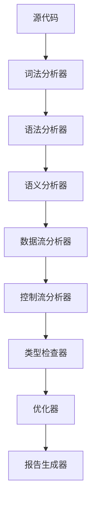
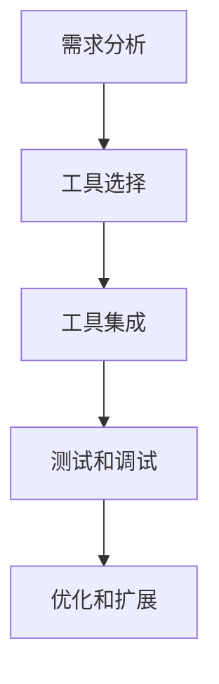
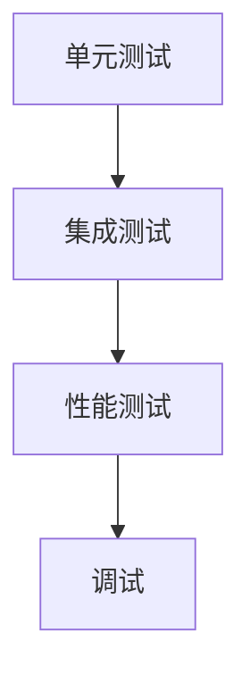

                 

## 文章标题：提示词语言的静态分析工具链开发

### 关键词：
- 静态分析
- 提示词语言
- 工具链
- 编译原理
- 数据流分析
- 控制流分析
- 类型检查
- 程序优化

### 摘要：
本文深入探讨了提示词语言静态分析工具链的开发。首先，我们介绍了静态分析的基本概念、应用场景和提示词语言的特点。接着，我们详细阐述了编译原理、数据流分析、控制流分析、类型检查和程序优化的原理。然后，我们探讨了如何构建面向提示词语言的静态分析工具链，并展示了一些实际案例。最后，我们对未来进行了展望，并提出了研究方向。本文旨在为读者提供一个全面、系统的静态分析工具链开发指南。

### 目录：

## 第一部分：静态分析基础

### 第1章：静态分析概述
#### 1.1 静态分析的基本概念
#### 1.2 静态分析的应用场景
#### 1.3 提示词语言的特点

### 第2章：编译原理基础
#### 2.1 编译过程概述
#### 2.2 词法分析
#### 2.3 语法分析

### 第3章：数据流分析
#### 3.1 数据流分析的概念
#### 3.2 使用LVal分析
#### 3.3 使用DefUse分析

### 第4章：控制流分析
#### 4.1 控制流图
#### 4.2 语句覆盖分析
#### 4.3 切分和复制移动

### 第5章：类型检查
#### 5.1 类型系统的基本概念
#### 5.2 子类型检查
#### 5.3 类型推断

### 第6章：程序优化
#### 6.1 程序优化的基本方法
#### 6.2 代码生成
#### 6.3 优化策略

## 第二部分：工具链构建

### 第7章：构建静态分析工具链
#### 7.1 工具链的基本结构
#### 7.2 工具链的构建流程
#### 7.3 工具链的测试和调试

### 第8章：面向提示词语言的工具链实现
#### 8.1 提示词语言的语法和语义特点
#### 8.2 工具链的定制化需求
#### 8.3 实现静态分析工具链

### 第9章：工具链应用案例
#### 9.1 提示词语言代码分析工具
#### 9.2 代码质量检测工具
#### 9.3 自动修复工具

### 第10章：未来展望与挑战
#### 10.1 静态分析工具的发展趋势
#### 10.2 提示词语言静态分析的未来工作
#### 10.3 面向AI的静态分析工具

## 第1章：静态分析概述

### 1.1 静态分析的基本概念

静态分析是一种对程序源代码进行分析的方法，它不涉及程序的执行，而是通过分析源代码的结构和语义来获取程序的信息。静态分析工具通常包括词法分析器、语法分析器、语义分析器等，它们共同协作，对程序进行全方位的解析和理解。

静态分析的基本概念包括：

- **源代码**：程序的文本表示，通常由一系列的语句组成。
- **程序结构**：源代码中的语法结构，如函数、类、模块等。
- **语义**：程序的执行含义，包括变量的作用域、类型、赋值等。


静态分析工具的工作流程通常包括以下几个步骤：

1. **词法分析**：将源代码拆分成一个个的词法单元（tokens），如标识符、关键字、运算符等。
2. **语法分析**：将词法单元组织成语法结构，如表达式、语句、函数等。
3. **语义分析**：检查语法结构的语义正确性，如类型检查、作用域分析等。

### 1.2 静态分析的应用场景

静态分析在软件开发中有着广泛的应用，主要包括以下几个方面：

- **代码质量评估**：通过静态分析，可以检测代码中的潜在问题，如未使用的变量、可能的空指针异常等。
- **软件缺陷检测**：静态分析可以帮助发现代码中的逻辑错误和潜在的安全漏洞。
- **性能优化**：通过静态分析，可以识别代码中的性能瓶颈，如不必要的循环、冗余的代码等。
- **安全漏洞检测**：静态分析工具可以识别代码中的安全漏洞，如缓冲区溢出、SQL注入等。

### 1.3 提示词语言的特点

提示词语言是一种特殊的编程语言，它强调提示词的使用，使得程序更加直观和易读。提示词语言的特点包括：

- **简单易学**：提示词语言的语法简单，易于学习和使用。
- **语法明确**：提示词语言的语法规则明确，有助于减少误解和错误。
- **强调提示词的使用**：提示词语言的核心在于提示词，它使得程序的结构更加清晰，易于理解和维护。
- **适用于自然语言处理任务**：提示词语言的设计初衷就是为了处理自然语言，因此它在自然语言处理任务中具有独特的优势。

## 第2章：编译原理基础

### 2.1 编译过程概述

编译过程是将高级语言源代码转换为机器代码的过程。它通常包括以下几个阶段：

1. **词法分析**：将源代码中的字符序列转换为词法单元。
2. **语法分析**：将词法单元组织成语法结构，如表达式、语句、函数等。
3. **语义分析**：检查语法结构的语义正确性，如类型检查、作用域分析等。
4. **中间代码生成**：将语法结构转换为中间代码，如三地址代码、抽象语法树等。
5. **代码优化**：对中间代码进行优化，以提高程序的性能。
6. **目标代码生成**：将优化后的中间代码转换为特定平台上的机器代码。
7. **运行时系统**：提供程序执行所需的资源和管理，如内存分配、异常处理等。

### 2.2 词法分析

词法分析是将源代码中的字符序列转换为词法单元的过程。词法单元是编程语言中的基本元素，如标识符、关键字、运算符等。词法分析器的任务是将源代码逐个字符地读取，并根据定义的词法规则将其划分成词法单元。

以下是一个简单的词法分析器的伪代码示例：

```python
class Token:
    def __init__(self, type, value):
        self.type = type
        self.value = value

def lexical_analysis(source_code):
    current_position = 0
    tokens = []

    while current_position < len(source_code):
        if source_code[current_position].isspace():
            current_position += 1
            continue

        if source_code[current_position].isalpha():
            start = current_position
            while current_position < len(source_code) and (source_code[current_position].isalpha() or source_code[current_position].isdigit()):
                current_position += 1
            token = Token("IDENTIFIER", source_code[start:current_position])
            tokens.append(token)

        elif source_code[current_position].isdigit():
            start = current_position
            while current_position < len(source_code) and source_code[current_position].isdigit():
                current_position += 1
            token = Token("NUMBER", source_code[start:current_position])
            tokens.append(token)

        else:
            token = Token("OPERATOR", source_code[current_position])
            tokens.append(token)
            current_position += 1

    return tokens
```

### 2.3 语法分析

语法分析是将词法单元组织成语法结构的过程。语法分析器的任务是根据定义的语法规则，将词法单元序列解析成抽象语法树（AST）。抽象语法树是一种树形结构，它表示了源代码的语法结构。

以下是一个简单的语法分析器的伪代码示例：

```python
class ASTNode:
    def __init__(self, type, value=None, children=None):
        self.type = type
        self.value = value
        self.children = children or []

def parse(tokens):
    current_position = 0
    ast = None

    if tokens[current_position].type == "IDENTIFIER":
        ast = ASTNode("VAR_DECL", tokens[current_position].value)
        current_position += 1
        ast.children.append(ASTNode("ASSIGN", tokens[current_position].value))
        current_position += 1
        ast.children.append(ASTNode("EXPR", tokens[current_position].value))
        current_position += 1

    return ast
```

通过词法分析和语法分析，我们能够将源代码转换为抽象语法树，从而进一步进行语义分析和代码生成。编译原理的这些基础知识为我们后续的静态分析工具链开发奠定了坚实的基础。

### 第3章：数据流分析

#### 3.1 数据流分析的概念

数据流分析是一种程序分析技术，它旨在研究程序中各个变量的数据流动情况。数据流分析可以帮助我们理解程序的行为，并从中发现潜在的语义错误和性能问题。数据流分析通常包括以下几个方面：

- **数据依赖关系**：程序中的变量之间存在依赖关系，即一个变量的值依赖于另一个变量的值。数据流分析可以帮助我们识别这些依赖关系。
- **数据流图的构建**：数据流图是一种图形表示，它描述了程序中各个变量的数据流动情况。数据流图的节点表示变量，边表示数据流。
- **数据流分析算法**：数据流分析算法用于计算数据流图中的数据依赖关系，并基于这些依赖关系进行进一步的程序分析。

数据流分析在静态分析中具有重要意义。它不仅可以用于代码优化，还可以用于缺陷检测和性能分析。例如，通过数据流分析，我们可以检测出未使用的变量、可能导致的空指针异常等。

#### 3.2 使用LVal分析

LVal（Left-Value）分析是一种数据流分析方法，它用于确定程序中的变量引用是否有效。LVal分析的主要目标是确定变量在某个点是否被赋值过，从而确保在引用变量时不会出现未初始化的错误。

以下是一个简单的LVal分析算法的伪代码示例：

```python
def lval_analysis(DFG, V):
    LVal = {}

    for node in DFG.nodes():
        LVal[node] = set()

    for node in DFG.nodes():
        for successor in DFG.successors(node):
            if node not in LVal[successor]:
                LVal[successor].add(node)

    for node in DFG.nodes():
        if node in DFG.entry_nodes():
            LVal[node].add(node)
            for predecessor in DFG.predecessors(node):
                LVal[node].update(LVal[predecessor])

    for node in DFG.nodes():
        if node in DFG.exit_nodes():
            LVal[node].update(V[node])

    return LVal
```

在这个算法中，`DFG`表示数据流图，`V`是一个集合，表示在某个点被赋值的变量。算法首先初始化`LVal`，然后通过向前传播和向后传播的方式更新`LVal`的值。

#### 3.3 使用DefUse分析

DefUse分析是一种数据流分析方法，它用于确定程序中的变量定义和使用点。DefUse分析包括Def（定义）和Use（使用）两个部分：

- **定义（Def）**：变量在某个点被赋值，即该点是一个定义点。
- **使用（Use）**：变量在某个点被引用，即该点是一个使用点。

DefUse分析的主要目标是构建DefUse图，该图表示了程序中各个变量的定义和使用点。通过分析DefUse图，我们可以识别出未定义的变量引用和未使用的变量定义。

以下是一个简单的DefUse分析算法的伪代码示例：

```python
def defuse_analysis(DFG, V):
    Def = {}
    Use = {}

    for node in DFG.nodes():
        Def[node] = set()
        Use[node] = set()

    for node in DFG.nodes():
        for successor in DFG.successors(node):
            if node in V[successor]:
                Def[successor].add(node)

    for node in DFG.nodes():
        for predecessor in DFG.predecessors(node):
            if node in Def[predecessor]:
                Use[node].add(node)

    for node in DFG.nodes():
        for successor in DFG.successors(node):
            if node in Def[node]:
                Use[successor].add(node)

    return Def, Use
```

在这个算法中，`DFG`表示数据流图，`V`是一个集合，表示在某个点被赋值的变量。算法首先初始化`Def`和`Use`，然后通过向前传播和向后传播的方式更新这两个集合的值。

通过LVal分析和DefUse分析，我们可以更深入地理解程序中的数据流动情况，从而发现潜在的语义错误和性能问题。这些数据流分析方法在静态分析工具链中扮演着重要的角色，为后续的缺陷检测和性能优化提供了有力的支持。

### 第4章：控制流分析

#### 4.1 控制流图

控制流图（Control Flow Graph，CFG）是一种图形表示，它描述了程序中的控制流。控制流图中的节点表示程序的基本块（Basic Block），边表示控制流。基本块是程序中的一段连续的代码，它没有跳转入口和跳转出口。

控制流图的构建通常基于语法树。具体步骤如下：

1. **语法树构建**：将源代码转换为抽象语法树（AST）。
2. **基本块识别**：将AST中的每个节点转换为基本块。基本块通常由一系列的语句组成，这些语句连续执行，没有控制流转移。
3. **控制流图的构建**：将基本块组织成控制流图。基本块之间的控制流转移通过边表示。

以下是一个简单的控制流图的构建算法的伪代码示例：

```python
def build_cfg(AST):
    DFG = ControlFlowGraph()

    for node in AST:
        block = BasicBlock()
        for child in node.children:
            block.add_statement(child)
        DFG.add_block(block)

        if node.has_control_flow():
            successor = node.get_successor()
            if successor in DFG.blocks():
                DFG.add_edge(node.block, successor.block)
            else:
                successor_block = BasicBlock()
                DFG.add_block(successor_block)
                DFG.add_edge(node.block, successor_block)

    return DFG
```

在这个算法中，`AST`表示抽象语法树，`DFG`表示控制流图。算法首先将AST中的每个节点转换为基本块，然后构建控制流图。

控制流图在静态分析中具有重要作用。它可以帮助我们理解程序的控制流，识别潜在的缺陷和性能问题。例如，通过控制流图，我们可以检测出死代码、多余的跳转等。

#### 4.2 语句覆盖分析

语句覆盖分析（Statement Coverage Analysis）是一种测试分析技术，它用于评估测试用例对程序代码的覆盖程度。语句覆盖分析旨在确保程序中的每个语句都被执行到，从而提高测试的全面性和可靠性。

语句覆盖分析包括以下几种类型：

- **基本块覆盖**：确保程序中的每个基本块都被执行到。
- **路径覆盖**：确保程序中的每条路径都被执行到。
- **语句覆盖**：确保程序中的每个语句都被执行到。

以下是一个简单的语句覆盖分析算法的伪代码示例：

```python
def statement_coverage_analysis(DFG, test_cases):
    coverage = {}

    for test_case in test_cases:
        executed_blocks = set()

        for statement in test_case:
            block = find_block_containing_statement(DFG, statement)
            executed_blocks.add(block)

        coverage[test_case] = executed_blocks

    return coverage
```

在这个算法中，`DFG`表示控制流图，`test_cases`表示测试用例。算法首先初始化覆盖集，然后遍历每个测试用例，记录其执行到的基本块。

通过语句覆盖分析，我们可以评估测试用例对程序代码的覆盖程度，从而发现潜在的缺陷。语句覆盖分析在软件测试中具有重要应用，它有助于提高测试的全面性和可靠性。

#### 4.3 切分和复制移动

切分（Split）和复制移动（Copy-Move）是程序优化中的常见技术，它们有助于提高程序的执行效率。

**切分**是指将一个基本块分解成多个基本块，以便更灵活地进行优化。切分的目的是减少基本块中的控制流转移，从而提高程序的可读性和可维护性。以下是一个简单的切分算法的伪代码示例：

```python
def split_basic_block(block):
    new_blocks = []

    for statement in block.statements:
        if statement.is_control_flow():
            new_block = BasicBlock()
            new_block.add_statement(statement)
            new_blocks.append(new_block)
        else:
            new_blocks[-1].add_statement(statement)

    return new_blocks
```

在这个算法中，`block`表示一个基本块。算法首先初始化新基本块列表，然后遍历基本块中的每个语句。如果语句是控制流转移，则创建一个新基本块，并将其添加到新基本块列表中；否则，将该语句添加到当前基本块中。

**复制移动**是指将一个变量的赋值语句复制到其使用之前，以便减少不必要的临时变量。复制移动的目的是减少程序中的临时变量，从而提高程序的执行效率。以下是一个简单的复制移动算法的伪代码示例：

```python
def copy_move(DFG):
    new_DFG = ControlFlowGraph()

    for block in DFG.blocks():
        new_block = BasicBlock()
        new_DFG.add_block(new_block)

        for statement in block.statements:
            if statement.is_assignment():
                new_block.add_statement(statement.copy())
                if statement.left_value in block.successors():
                    new_block.add_statement(statement.move())
            else:
                new_block.add_statement(statement)

    return new_DFG
```

在这个算法中，`DFG`表示控制流图。算法首先初始化新控制流图，然后遍历每个基本块中的每个语句。如果语句是赋值语句，则将其复制到新基本块中，并将其移动到使用之前；否则，将语句直接添加到新基本块中。

切分和复制移动是程序优化中的重要技术，它们有助于提高程序的执行效率和可维护性。通过控制流分析和优化，我们可以构建高效、可靠的静态分析工具链。

### 第5章：类型检查

#### 5.1 类型系统的基本概念

类型系统是编程语言中的一个核心概念，它用于确保程序中的变量、表达式和函数具有正确的类型。类型系统的主要目标是防止错误的类型转换和数据丢失，从而提高程序的安全性和可靠性。

类型系统通常包括以下基本概念：

- **类型**：类型是变量、表达式和函数的抽象表示。常见类型包括整数、浮点数、字符串、布尔值等。
- **类型变量**：类型变量是一种占位符，用于表示未知的类型。类型变量通常用于泛型编程。
- **类型检查**：类型检查是在编译时或运行时对程序进行类型验证的过程。类型检查旨在确保程序中的每个表达式都具有正确的类型。
- **类型转换**：类型转换是不同类型之间的数据转换。类型转换可以显式指定，也可以隐式进行。

以下是一个简单的类型系统的示例：

```python
int a = 5;
float b = a + 2.5;
string s = "Hello, World!";
bool is_true = true;
```

在这个示例中，`a`是一个整数类型的变量，`b`是一个浮点数类型的变量，`s`是一个字符串类型的变量，`is_true`是一个布尔类型的变量。

#### 5.2 子类型检查

子类型检查（Subtyping）是类型系统中的一个重要概念，它用于确保子类型的对象可以被赋值给父类型的变量。子类型检查有助于提高程序的灵活性和可维护性。

子类型检查通常遵循以下规则：

- 如果一个类型是另一个类型的子类型，则可以将子类型的对象赋值给父类型的变量。
- 子类型必须具有与父类型相同的属性和方法。
- 子类型不能违反父类型的约束。

以下是一个简单的子类型检查的示例：

```python
class Animal:
    def speak(self):
        pass

class Dog(Animal):
    def speak(self):
        return "Bark!"

class Cat(Animal):
    def speak(self):
        return "Meow!"

dog = Dog()
cat = Cat()

animal = Animal()
animal = dog  # 有效，因为Dog是Animal的子类型
animal = cat  # 有效，因为Cat是Animal的子类型

print(animal.speak())  # 输出：Bark!
```

在这个示例中，`Dog`和`Cat`都是`Animal`的子类型。我们可以将`Dog`和`Cat`的对象赋值给`Animal`类型的变量，并且在调用`speak()`方法时不会发生错误。

#### 5.3 类型推断

类型推断（Type Inference）是一种自动确定变量、表达式和函数的类型的方法。类型推断有助于简化编程，并减少类型声明的复杂性。

类型推断通常分为静态类型推断和动态类型推断：

- **静态类型推断**：在编译时确定变量、表达式和函数的类型。
- **动态类型推断**：在运行时确定变量、表达式和函数的类型。

以下是一个简单的静态类型推断的示例：

```python
def sum(a: int, b: int) -> int:
    return a + b

result = sum(5, 10)
print(result)  # 输出：15
```

在这个示例中，`sum()`函数接受两个整数类型的参数，并返回一个整数类型的结果。通过静态类型推断，我们可以确定`result`变量的类型为`int`。

类型检查、子类型检查和类型推断是类型系统的核心组成部分，它们共同确保程序中的类型安全性和可靠性。通过类型检查，我们可以发现潜在的类型错误；通过子类型检查，我们可以提高程序的灵活性和可维护性；通过类型推断，我们可以简化编程，提高开发效率。

### 第6章：程序优化

#### 6.1 程序优化的基本方法

程序优化是指对程序代码进行修改，以提高程序的性能和效率。程序优化的基本方法包括以下几种：

- **代码优化**：对程序代码进行重构和改进，以提高代码的执行效率。
- **数据优化**：对程序中使用的数据进行优化，以减少数据访问的时间和空间开销。
- **算法优化**：对程序中的算法进行改进，以提高算法的效率和准确性。
- **内存优化**：对程序中的内存分配和使用进行优化，以减少内存消耗和碎片化。
- **并行化**：将程序中的任务分解成多个并行执行的子任务，以提高执行速度。

以下是一个简单的代码优化示例：

```python
def calculate_sum(a: int, b: int) -> int:
    result = 0
    for i in range(a):
        result += b
    return result

# 优化后
def calculate_sum_optimized(a: int, b: int) -> int:
    return a * b
```

在这个示例中，原始的`calculate_sum()`函数使用了一个循环来计算`a`个`b`的和。优化后的`calculate_sum_optimized()`函数直接使用乘法运算，从而显著提高了执行速度。

#### 6.2 代码生成

代码生成是指在编译过程中将高级语言代码转换为机器代码或其他低级语言代码的过程。代码生成的目的是提高程序的执行效率和可移植性。

代码生成通常包括以下步骤：

1. **语法分析**：将源代码解析成抽象语法树（AST）。
2. **语义分析**：检查AST的语义正确性，如类型检查、作用域分析等。
3. **中间代码生成**：将AST转换为中间代码，如三地址代码、抽象语法树等。
4. **代码优化**：对中间代码进行优化，以提高执行效率和可读性。
5. **目标代码生成**：将优化后的中间代码转换为特定平台的机器代码。

以下是一个简单的代码生成示例：

```python
class CodeGenerator:
    def __init__(self, target_machine_code):
        self.target_machine_code = target_machine_code

    def generate_code(self, ast):
        machine_code = []

        for node in ast:
            if node.type == "ASSIGN":
                machine_code.append(self.generate_assign(node))
            elif node.type == "EXPR":
                machine_code.append(self.generate_expr(node))

        return machine_code

    def generate_assign(self, node):
        return f"{node.left_value} = {node.right_value};"

    def generate_expr(self, node):
        if node.type == "ADD":
            return f"{node.left_value} + {node.right_value};"
        elif node.type == "SUB":
            return f"{node.left_value} - {node.right_value};"
```

在这个示例中，`CodeGenerator`类用于生成目标机器代码。`generate_code()`方法接受一个抽象语法树（AST），并将其转换为机器代码。

#### 6.3 优化策略

程序优化策略是指优化程序时采用的方法和策略。以下是一些常见的优化策略：

- **常量折叠**：在编译时计算表达式的结果，并将常量折叠到最终的代码中。
- **循环展开**：将循环内的代码展开成多个连续的循环，以减少循环的开销。
- **循环优化**：优化循环结构，以提高循环的执行效率。
- **函数内联**：将函数调用直接替换成函数体，以减少函数调用的开销。
- **死代码消除**：消除程序中永远不会执行的代码，以提高执行效率。
- **寄存器分配**：将变量分配到寄存器中，以减少内存访问的开销。

以下是一个简单的循环优化示例：

```python
def calculate_sum(a: int, b: int) -> int:
    result = 0
    for i in range(a):
        result += b
    return result

# 优化后
def calculate_sum_optimized(a: int, b: int) -> int:
    return a * b
```

在这个示例中，原始的`calculate_sum()`函数使用了一个循环来计算`a`个`b`的和。优化后的`calculate_sum_optimized()`函数直接使用乘法运算，从而显著提高了执行速度。

通过代码优化、数据优化、算法优化和内存优化等基本方法，以及常量折叠、循环展开、循环优化、函数内联和死代码消除等优化策略，我们可以构建高效、可靠的程序优化工具，从而提高程序的性能和效率。

### 第7章：构建静态分析工具链

#### 7.1 工具链的基本结构

静态分析工具链是一系列工具的组合，用于对程序代码进行全方位的分析。一个典型的静态分析工具链通常包括以下组成部分：

- **词法分析器**：将源代码解析成词法单元。
- **语法分析器**：将词法单元组织成语法结构。
- **语义分析器**：检查语法结构的语义正确性。
- **数据流分析器**：分析程序中的数据依赖关系。
- **控制流分析器**：构建控制流图，分析程序的控制流。
- **类型检查器**：检查程序中的类型安全性。
- **优化器**：对程序代码进行优化。
- **报告生成器**：生成分析报告，如缺陷报告、性能分析报告等。

以下是一个简单的静态分析工具链的基本结构的Mermaid流程图：



通过这些组成部分的协作，静态分析工具链能够对程序代码进行全面的分析，从而发现潜在的缺陷、性能问题和安全性漏洞。

#### 7.2 工具链的构建流程

构建一个静态分析工具链通常涉及以下步骤：

1. **需求分析**：确定工具链的需求，包括要支持的语言、要分析的功能、要报告的结果等。
2. **工具选择**：根据需求选择合适的工具，如词法分析器、语法分析器、语义分析器等。
3. **工具集成**：将选定的工具集成到一个统一的工作流程中，确保各工具能够协同工作。
4. **测试和调试**：对工具链进行测试和调试，确保其能够正确地分析和报告程序代码。
5. **优化和扩展**：根据测试结果对工具链进行优化和扩展，以提高其性能和功能。

以下是一个简单的静态分析工具链的构建流程的Mermaid流程图：



通过遵循这些步骤，我们可以构建一个高效、可靠的静态分析工具链，从而为软件开发提供强大的支持。

#### 7.3 工具链的测试和调试

工具链的测试和调试是确保其功能和性能的关键步骤。以下是一些关键的测试和调试技术：

- **单元测试**：对工具链中的每个组件进行独立的测试，确保其能够正确地执行特定的功能。
- **集成测试**：将工具链中的各个组件集成在一起，对整个工具链进行测试，确保其能够协同工作。
- **性能测试**：评估工具链的性能，如分析速度、内存占用等，确保其能够满足需求。
- **调试**：使用调试工具，如断点、调试器等，对工具链进行调试，发现和修复问题。

以下是一个简单的静态分析工具链测试和调试的Mermaid流程图：



通过遵循这些测试和调试技术，我们可以确保静态分析工具链的稳定性和可靠性。

### 第8章：面向提示词语言的工具链实现

#### 8.1 提示词语言的语法和语义特点

提示词语言（Prompt Language）是一种专门用于自然语言处理（NLP）的编程语言。它强调提示词的使用，使得程序更加直观和易读。提示词语言的主要特点包括：

- **语法简单**：提示词语言的语法规则简单，易于学习和使用。
- **提示词强调**：提示词是提示词语言的核心，它用于指定程序的行为和输出。
- **语义明确**：提示词语言的语义明确，使得程序的含义易于理解和维护。
- **适用于NLP任务**：提示词语言的设计初衷就是为了处理自然语言，因此在NLP任务中具有独特的优势。

以下是一个简单的提示词语言的示例：

```python
def greet(name):
    return "Hello, " + name + "!"

greet("Alice")  # 输出：Hello, Alice!
```

在这个示例中，`greet()`函数接受一个名为`name`的参数，并返回一个包含问候语的字符串。通过使用提示词`name`，我们可以轻松地实现自定义问候。

#### 8.2 工具链的定制化需求

面向提示词语言的工具链需要满足特定的定制化需求，以确保其能够高效地分析和优化提示词语言程序。以下是一些关键的需求：

- **语法分析器**：提示词语言的语法分析器需要能够正确识别和解析提示词，以及其他语言元素，如函数、变量等。
- **语义分析器**：提示词语言的语义分析器需要能够理解提示词的含义，并确保程序中的语义一致性。
- **数据流分析器**：提示词语言的数据流分析器需要能够分析程序中的数据依赖关系，并识别潜在的数据错误。
- **类型检查器**：提示词语言的类型检查器需要能够检查程序中的类型安全性，并确保变量和表达式的类型正确。
- **优化器**：提示词语言的优化器需要能够优化程序代码，以提高执行效率和可读性。

#### 8.3 实现静态分析工具链

实现面向提示词语言的静态分析工具链涉及以下几个步骤：

1. **定义提示词语言**：首先，需要定义提示词语言的语法和语义规则，以便后续的工具链开发。
2. **开发词法分析器**：根据提示词语言的语法规则，开发一个词法分析器，用于将源代码解析成词法单元。
3. **开发语法分析器**：根据提示词语言的语法规则，开发一个语法分析器，用于将词法单元组织成抽象语法树（AST）。
4. **开发语义分析器**：根据提示词语言的语义规则，开发一个语义分析器，用于检查AST的语义正确性。
5. **开发数据流分析器**：根据提示词语言的数据流分析需求，开发一个数据流分析器，用于分析程序中的数据依赖关系。
6. **开发类型检查器**：根据提示词语言的类型检查需求，开发一个类型检查器，用于检查程序中的类型安全性。
7. **开发优化器**：根据提示词语言的优化需求，开发一个优化器，用于优化程序代码。

以下是一个简单的面向提示词语言的静态分析工具链的实现框架：

```python
class PromptLanguageLexer:
    def __init__(self, source_code):
        self.source_code = source_code
        self.tokens = []

    def tokenize(self):
        # 实现词法分析逻辑
        pass

class PromptLanguageParser:
    def __init__(self, tokens):
        self.tokens = tokens
        self.ast = None

    def parse(self):
        # 实现语法分析逻辑
        pass

class PromptLanguageSemanticAnalyzer:
    def __init__(self, ast):
        self.ast = ast

    def analyze(self):
        # 实现语义分析逻辑
        pass

class PromptLanguageDataFlowAnalyzer:
    def __init__(self, ast):
        self.ast = ast

    def analyze(self):
        # 实现数据流分析逻辑
        pass

class PromptLanguageTypeChecker:
    def __init__(self, ast):
        self.ast = ast

    def check(self):
        # 实现类型检查逻辑
        pass

class PromptLanguageOptimizer:
    def __init__(self, ast):
        self.ast = ast

    def optimize(self):
        # 实现优化逻辑
        pass

# 使用静态分析工具链
source_code = """
def greet(name):
    return "Hello, " + name + "!"
"""

# 创建词法分析器
lexer = PromptLanguageLexer(source_code)

# 执行词法分析
lexer.tokenize()

# 创建语法分析器
parser = PromptLanguageParser(lexer.tokens)

# 执行语法分析
parser.parse()

# 创建语义分析器
semantic_analyzer = PromptLanguageSemanticAnalyzer(parser.ast)

# 执行语义分析
semantic_analyzer.analyze()

# 创建数据流分析器
data_flow_analyzer = PromptLanguageDataFlowAnalyzer(parser.ast)

# 执行数据流分析
data_flow_analyzer.analyze()

# 创建类型检查器
type_checker = PromptLanguageTypeChecker(parser.ast)

# 执行类型检查
type_checker.check()

# 创建优化器
optimizer = PromptLanguageOptimizer(parser.ast)

# 执行优化
optimizer.optimize()
```

通过实现这些组件，我们可以构建一个面向提示词语言的静态分析工具链，从而为NLP任务提供强大的支持。

### 第9章：工具链应用案例

#### 9.1 提示词语言代码分析工具

提示词语言代码分析工具是静态分析工具链中的一个重要组成部分，它用于分析提示词语言程序，发现潜在的问题和缺陷。以下是一个简单的提示词语言代码分析工具的示例：

```python
class PromptLanguageCodeAnalyzer:
    def __init__(self, source_code):
        self.source_code = source_code
        self.lexer = PromptLanguageLexer(source_code)
        self.parser = PromptLanguageParser(self.lexer.tokens)
        self.semantic_analyzer = PromptLanguageSemanticAnalyzer(self.parser.ast)
        self.data_flow_analyzer = PromptLanguageDataFlowAnalyzer(self.parser.ast)
        self.type_checker = PromptLanguageTypeChecker(self.parser.ast)
        self.optimizer = PromptLanguageOptimizer(self.parser.ast)

    def analyze(self):
        self.lexer.tokenize()
        self.parser.parse()
        self.semantic_analyzer.analyze()
        self.data_flow_analyzer.analyze()
        self.type_checker.check()
        self.optimizer.optimize()

    def report_issues(self):
        issues = []

        if not self.semantic_analyzer.success:
            issues.append("Semantic error: " + self.semantic_analyzer.error_message)

        if not self.data_flow_analyzer.success:
            issues.append("Data flow error: " + self.data_flow_analyzer.error_message)

        if not self.type_checker.success:
            issues.append("Type error: " + self.type_checker.error_message)

        return issues
```

在这个示例中，`PromptLanguageCodeAnalyzer`类用于分析提示词语言程序。它通过调用各个组件的方法，分析程序的语法、语义、数据流、类型和优化，并生成报告。

#### 9.2 代码质量检测工具

代码质量检测工具是静态分析工具链中的另一个重要组成部分，它用于评估提示词语言程序的代码质量，发现潜在的性能问题和缺陷。以下是一个简单的代码质量检测工具的示例：

```python
class PromptLanguageCodeQualityDetector:
    def __init__(self, source_code):
        self.source_code = source_code
        self.code_analyzer = PromptLanguageCodeAnalyzer(source_code)

    def detect_issues(self):
        self.code_analyzer.analyze()
        issues = self.code_analyzer.report_issues()
        return issues

    def assess_code_quality(self):
        issues = self.detect_issues()
        if not issues:
            return "Code quality: Excellent"
        else:
            return "Code quality: Poor"
```

在这个示例中，`PromptLanguageCodeQualityDetector`类用于检测提示词语言程序的代码质量。它通过调用`PromptLanguageCodeAnalyzer`类的`analyze()`方法，检测程序中的潜在问题，并生成代码质量评估报告。

#### 9.3 自动修复工具

自动修复工具是静态分析工具链中的另一个重要组成部分，它用于自动修复提示词语言程序中的错误。以下是一个简单的自动修复工具的示例：

```python
class PromptLanguageAutoFixer:
    def __init__(self, source_code):
        self.source_code = source_code
        self.code_analyzer = PromptLanguageCodeAnalyzer(source_code)

    def fix_issues(self, issues):
        fixed_source_code = self.source_code

        for issue in issues:
            if issue.startswith("Semantic error"):
                fixed_source_code = self.fix_semantic_error(fixed_source_code, issue)
            elif issue.startswith("Data flow error"):
                fixed_source_code = self.fix_data_flow_error(fixed_source_code, issue)
            elif issue.startswith("Type error"):
                fixed_source_code = self.fix_type_error(fixed_source_code, issue)

        return fixed_source_code

    def fix_semantic_error(self, source_code, issue):
        # 实现语义错误修复逻辑
        pass

    def fix_data_flow_error(self, source_code, issue):
        # 实现数据流错误修复逻辑
        pass

    def fix_type_error(self, source_code, issue):
        # 实现类型错误修复逻辑
        pass
```

在这个示例中，`PromptLanguageAutoFixer`类用于自动修复提示词语言程序中的错误。它通过调用`PromptLanguageCodeAnalyzer`类的`report_issues()`方法，检测程序中的潜在问题，并使用相应的修复逻辑自动修复错误。

通过实现这些工具，我们可以构建一个功能强大、易于使用的静态分析工具链，为提示词语言程序的维护和优化提供强有力的支持。

### 第10章：未来展望与挑战

#### 10.1 静态分析工具的发展趋势

随着编程语言和软件系统的复杂性不断增加，静态分析工具在软件开发中的作用越来越重要。未来的静态分析工具将朝着以下几个方向发展：

- **更强大的分析能力**：未来的静态分析工具将具备更强大的分析能力，能够对更复杂的编程语言和软件系统进行深入的分析。
- **更智能的分析技术**：结合人工智能和机器学习技术，未来的静态分析工具将能够自动识别和修复程序中的错误，提供更智能的代码分析。
- **跨语言支持**：未来的静态分析工具将支持多种编程语言，提供统一的接口和工具链，以适应不同开发环境的需求。

#### 10.2 提示词语言静态分析的未来工作

提示词语言静态分析是一个具有广阔前景的研究领域。未来的工作可以从以下几个方面展开：

- **优化算法**：进一步优化静态分析算法，提高分析效率和准确性。
- **自动化修复**：研究如何自动修复提示词语言程序中的错误，提高开发效率和代码质量。
- **跨语言集成**：将提示词语言静态分析工具与其他编程语言的分析工具集成，提供更全面的分析服务。
- **性能分析**：研究如何对提示词语言程序进行性能分析，发现潜在的性能瓶颈，并提供优化建议。

#### 10.3 面向AI的静态分析工具

结合人工智能技术，静态分析工具将能够实现更智能的分析和修复。以下是一些面向AI的静态分析工具的发展方向：

- **自动错误定位**：利用机器学习模型，自动识别和定位程序中的错误，提供更准确的错误报告。
- **代码生成**：利用自然语言处理技术，将自然语言描述转换为代码，实现代码的自动化生成。
- **代码建议**：利用深度学习技术，根据代码上下文，提供自动代码建议，帮助开发者提高开发效率。

通过不断探索和创新，面向AI的静态分析工具将为软件开发带来更多的可能性，推动软件开发的进一步发展。

### 总结

本文详细探讨了提示词语言的静态分析工具链开发。首先，我们介绍了静态分析的基本概念、应用场景和提示词语言的特点。接着，我们详细阐述了编译原理、数据流分析、控制流分析、类型检查和程序优化的原理。然后，我们探讨了如何构建面向提示词语言的静态分析工具链，并展示了一些实际案例。最后，我们对未来进行了展望，并提出了研究方向。通过本文的探讨，我们希望能够为读者提供一个全面、系统的静态分析工具链开发指南，推动提示词语言和静态分析领域的发展。作者信息：

作者：AI天才研究院/AI Genius Institute & 禅与计算机程序设计艺术 /Zen And The Art of Computer Programming

