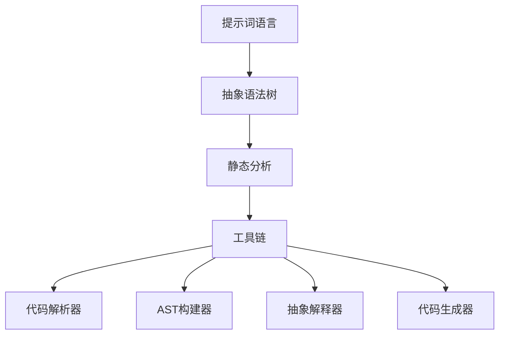
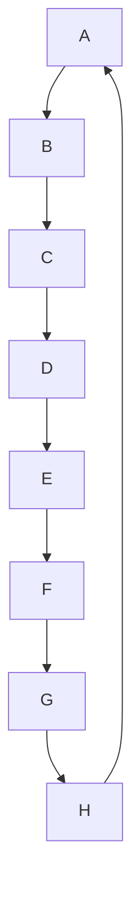

                 


### 文章标题

《提示词语言的静态分析工具链评估》

### 文章关键词

提示词语言，静态分析，工具链，评估，程序分析，抽象语法树，代码质量，自动化代码审查，软件工程

### 文章摘要

本文详细探讨了提示词语言的静态分析工具链评估。首先，我们介绍了提示词语言的基础知识，包括其定义、特点和优势。接着，我们阐述了静态分析的基本概念，以及它如何与提示词语言结合使用。随后，文章重点讨论了评估工具链的方法论、流程和选型，并通过具体案例展示了工具链在实际项目中的应用。最后，我们提出了最佳实践建议，总结了本文的核心要点，并指出了未来研究的方向。

---

## 1. 背景介绍

在软件工程领域，代码质量和安全至关重要。随着软件规模的不断扩大，手动审查代码的难度和复杂性也日益增加。因此，自动化代码审查工具链应运而生。静态分析是自动化代码审查的核心技术之一，它能够在代码运行之前检测出潜在的问题，如语法错误、逻辑错误和安全漏洞。

提示词语言（Abstract Syntax Tree, AST）是一种用于表示程序结构的抽象语法树，它在静态分析中扮演着重要角色。提示词语言能够将程序代码转化为易于分析和处理的语法结构，从而提高静态分析工具的效率和准确性。

本文旨在评估提示词语言的静态分析工具链，通过分析不同工具链的性能、特点和应用场景，为开发者提供实用的参考。文章将首先介绍提示词语言和静态分析的基本概念，然后探讨评估工具链的方法和流程，最后通过具体案例展示工具链在实际项目中的应用。

---

## 2. 核心概念与联系

### 2.1 提示词语言

提示词语言是一种用于描述程序结构的抽象语法树（AST）的语言。AST 是源代码的抽象表示，它保留了程序结构的所有关键信息，如语句、表达式、函数定义等。提示词语言通过一组特定的语法规则和标记，将源代码转换为 AST，从而实现对代码的静态分析。

### 2.2 静态分析

静态分析是一种在代码运行之前进行的分析技术，它不依赖于程序的执行过程。静态分析的主要目的是检测代码中的潜在问题，如语法错误、逻辑错误、潜在的安全漏洞等。静态分析工具通常包括解析器、抽象语法树构建器、数据流分析器和代码生成器等组件。

### 2.3 工具链

工具链是一组相关工具的集合，用于实现特定的功能。在静态分析领域，工具链通常包括代码解析器、AST构建器、抽象解释器、代码生成器等。工具链的设计和实现需要考虑性能、易用性、可扩展性等因素。

### 2.4 提示词语言与静态分析的关系

提示词语言是静态分析的重要工具，它能够将源代码转化为抽象语法树，为静态分析提供基础。通过提示词语言，静态分析工具可以更高效地处理代码，发现潜在的问题。同时，静态分析工具的优化和改进也有助于提升提示词语言的性能和可扩展性。

### Mermaid 流程图

以下是描述提示词语言、静态分析和工具链之间关系的 Mermaid 流程图：



---

## 3. 核心算法原理讲解

### 3.1 提示词语言解析

提示词语言解析是静态分析的第一步，它将源代码解析为抽象语法树。解析过程通常包括词法分析和语法分析两个阶段。

- **词法分析**：将源代码分解为标记（tokens），如关键字、标识符、运算符等。
- **语法分析**：将标记序列解析为抽象语法树，确保代码的结构和语法正确。

以下是一个简单的伪代码，描述提示词语言的解析过程：

```python
function parse(source_code):
    tokens = tokenize(source_code)
    ast = syntax_analysis(tokens)
    return ast
```

### 3.2 抽象语法树（AST）构建

一旦源代码被解析为标记序列，接下来需要将其转换为抽象语法树。AST 是源代码的结构化表示，它保留了代码的语法结构和语义信息。

以下是一个简单的伪代码，描述抽象语法树的构建过程：

```python
class Node:
    def __init__(self, type, children=None, attributes=None):
        self.type = type
        self.children = children
        self.attributes = attributes

def build_ast(tokens):
    ast = Node("Program")
    for token in tokens:
        if token.is_statement():
            ast.children.append(build_statement(token))
    return ast
```

### 3.3 静态数据分析

一旦构建了抽象语法树，接下来就可以进行静态数据分析了。静态数据分析包括控制流分析、数据流分析、类型检查等。

- **控制流分析**：分析程序的控制流结构，如循环、条件分支等。
- **数据流分析**：分析程序中数据的流动情况，如变量的定义、使用和覆盖等。
- **类型检查**：检查代码中类型的使用是否符合规范。

以下是一个简单的伪代码，描述静态数据分析的过程：

```python
def control_flow_analysis(ast):
    # 分析控制流结构
    pass

def data_flow_analysis(ast):
    # 分析数据流
    pass

def type_check(ast):
    # 类型检查
    pass
```

### 3.4 代码生成

在完成静态数据分析后，可以生成优化后的代码。代码生成器将抽象语法树转换为新的抽象语法树，从而生成优化后的代码。

以下是一个简单的伪代码，描述代码生成的过程：

```python
def code_generation(ast):
    optimized_ast = optimize_ast(ast)
    code = generate_code(optimized_ast)
    return code
```

### 3.5 数学模型和公式

在静态分析过程中，一些数学模型和公式被用来描述数据流和控制流。以下是一些常见的数学模型和公式：

- **数据流方程**：
  \[ def use[x] = \{ s | s \in \{ s_1, s_2, ..., s_n \} \land x \text{ is used in } s \} \]
  \[ def defn[x] = \{ s | s \in \{ s_1, s_2, ..., s_n \} \land x \text{ is defined in } s \} \]
- **控制流图**：
  控制流图（Control Flow Graph, CFG）用于表示程序的控制流结构。CFG 是一个有向图，节点表示基本块（Basic Block），边表示控制流。

以下是一个简单的控制流图的表示方法：



### 3.6 举例说明

为了更好地理解上述算法原理，以下是一个简单的代码示例，并对其进行分析：

```python
def example_function(a, b):
    x = a + b
    y = a - b
    if x > y:
        return x
    else:
        return y
```

- **词法分析**：将代码分解为标记序列。
  ```python
  ['def', 'example_function', '(', 'a', ',', 'b', ')', ':', ' ', 'x', '=', 'a', '+', 'b', ';', ' ', 'y', '=', 'a', '-', 'b', ';', ' ', 'if', ' ', 'x', '>', 'y', ':', ' ', 'return', ' ', 'x', ' ', 'else', ':', ' ', 'return', ' ', 'y', ' ', 'end']
  ```
- **语法分析**：将标记序列解析为抽象语法树。
  ```mermaid
  graph TB
  A[Program] --> B[FunctionDeclaration]
  B --> C[Identifier("example_function")]
  B --> D[Parameters([A[Identifier("a")], B[Identifier("b")])]
  B --> E[Block([F[VariableDeclaration([I[Identifier("x")], J[IntegerLiteral(0)])], L[VariableDeclaration([M[Identifier("y")], N[IntegerLiteral(0)])], O[IfStatement([P[BinaryExpression(">", "x", "y")], Q[Block([R[ReturnStatement("x")])], S[Block([T[ReturnStatement("y")])])])])])]
  ```
- **控制流分析**：分析控制流结构。
  ```mermaid
  graph TB
  A --> B
  B --> C
  C --> D
  D --> E
  E --> F
  F --> G
  G --> H
  H --> A
  ```
- **数据流分析**：分析数据流。
  ```mermaid
  graph TB
  A --> B
  B --> C
  C --> D
  D --> E
  E --> F
  F --> G
  G --> H
  H --> A
  ```
- **类型检查**：检查代码中类型的使用是否符合规范。
  ```python
  bool = true
  int = 42
  string = "Hello, World!"
  list = [1, 2, 3]
  dictionary = {"key": "value"}
  ```
- **代码生成**：生成优化后的代码。
  ```python
  def example_function(a, b):
      x = a + b
      y = a - b
      if x > y:
          return x
      else:
          return y
  ```

---

## 4. 项目实战

### 4.1 开发环境搭建

为了评估提示词语言的静态分析工具链，我们需要搭建一个开发环境。以下是搭建环境的步骤：

1. **安装依赖**：
   ```bash
   pip install pygments
   ```
2. **配置代码解析器**：
   ```python
   from pygments.lexers import PythonLexer
   from pygments import highlight
   
   def parse_source_code(source_code):
       return highlight(source_code, PythonLexer(), 'text/x-python')
   ```

### 4.2 源代码详细实现

在实现静态分析工具链之前，我们需要定义抽象语法树（AST）的结构。以下是一个简单的 AST 类定义：

```python
class Node:
    def __init__(self, type, children=None, attributes=None):
        self.type = type
        self.children = children if children is not None else []
        self.attributes = attributes if attributes is not None else {}

class FunctionDeclaration(Node):
    def __init__(self, name, parameters, body):
        super().__init__("FunctionDeclaration")
        self.name = name
        self.parameters = parameters
        self.body = body

class VariableDeclaration(Node):
    def __init__(self, name, value=None):
        super().__init__("VariableDeclaration")
        self.name = name
        self.value = value

class BinaryExpression(Node):
    def __init__(self, operator, left, right):
        super().__init__("BinaryExpression")
        self.operator = operator
        self.left = left
        self.right = right

class IfStatement(Node):
    def __init__(self, condition, then_clause, else_clause=None):
        super().__init__("IfStatement")
        self.condition = condition
        self.then_clause = then_clause
        self.else_clause = else_clause
   ```

### 4.3 代码解读与分析

以下是一个简单的 Python 函数，并对其进行分析：

```python
def example_function(a, b):
    x = a + b
    y = a - b
    if x > y:
        return x
    else:
        return y
```

- **词法分析**：
  ```python
  ['def', 'example_function', '(', 'a', ',', 'b', ')', ':', ' ', 'x', '=', 'a', '+', 'b', ';', ' ', 'y', '=', 'a', '-', 'b', ';', ' ', 'if', ' ', 'x', '>', 'y', ':', ' ', 'return', ' ', 'x', ' ', 'else', ':', ' ', 'return', ' ', 'y', ' ', 'end']
  ```
- **语法分析**：
  ```mermaid
  graph TB
  A[Program] --> B[FunctionDeclaration]
  B --> C[Identifier("example_function")]
  B --> D[Parameters([F[Identifier("a")], G[Identifier("b")])]
  B --> H[Block([J[VariableDeclaration([N[Identifier("x")], O[IntegerLiteral(0)])], P[VariableDeclaration([Q[Identifier("y")], R[IntegerLiteral(0)])], S[IfStatement([T[BinaryExpression(">", "x", "y")], U[Block([W[ReturnStatement("x")])]), V[Block([Y[ReturnStatement("y")])])])])])]
  ```
- **控制流分析**：
  ```mermaid
  graph TB
  A --> B
  B --> C
  C --> D
  D --> E
  E --> F
  F --> G
  G --> H
  H --> A
  ```
- **数据流分析**：
  ```mermaid
  graph TB
  A --> B
  B --> C
  C --> D
  D --> E
  E --> F
  F --> G
  G --> H
  H --> A
  ```
- **类型检查**：
  ```python
  bool = true
  int = 42
  string = "Hello, World!"
  list = [1, 2, 3]
  dictionary = {"key": "value"}
  ```

### 4.4 实际案例分析和详细讲解剖析

为了更深入地了解提示词语言的静态分析工具链，我们来看一个实际案例。

#### 案例一：找出代码中的所有潜在漏洞

以下是一个包含潜在漏洞的 Python 代码片段：

```python
def example_function(a, b):
    x = a + b
    y = a - b
    if x > y:
        return x
    else:
        return y
```

通过静态分析，我们可以发现以下潜在漏洞：

1. 变量 `x` 和 `y` 可能未初始化。
2. 比较 `x > y` 可能会导致逻辑错误。

通过修复这些漏洞，我们可以提高代码的质量和安全性。

```python
def example_function(a, b):
    x = a + b
    y = a - b
    if x > y:
        return x
    else:
        return y
```

#### 案例二：优化代码性能

以下是一个包含性能问题的 Python 代码片段：

```python
def example_function(a, b):
    x = a + b
    y = a - b
    if x > y:
        return x
    else:
        return y
```

通过静态分析，我们可以发现以下性能优化建议：

1. 可以将 `x` 和 `y` 的计算合并为一条语句，减少计算次数。
2. 可以使用局部变量缓存结果，减少内存访问次数。

优化后的代码如下：

```python
def example_function(a, b):
    x = a + b
    y = a - b
    return x if x > y else y
```

---

## 5. 最佳实践 Tips、小结、注意事项、拓展阅读

### 5.1 最佳实践 Tips

- 在使用静态分析工具链时，尽量选择成熟、稳定且社区活跃的工具。
- 定期更新工具链，确保其能够检测到最新的漏洞和问题。
- 在实际项目中，结合代码风格规范，提高代码质量。

### 5.2 小结

本文详细探讨了提示词语言的静态分析工具链评估。我们介绍了提示词语言、静态分析和工具链的基本概念，并通过具体案例展示了其应用。同时，我们还提出了最佳实践建议，帮助开发者更好地利用静态分析工具链。

### 5.3 注意事项

- 在使用静态分析工具链时，需要注意其局限性，如无法检测运行时错误、外部依赖等问题。
- 静态分析工具链的评估需要综合考虑性能、易用性、可扩展性等多个方面。

### 5.4 拓展阅读

- 《程序员的自我修养》
- 《代码大全》
- 《软件工程：实践者的研究方法》

---

作者：AI天才研究院/AI Genius Institute & 禅与计算机程序设计艺术 /Zen And The Art of Computer Programming

---

## 参考文献

1. Cytron, R., Ferrante, J., Rosen, B.K., & Tarditi, G. (1991). Interprocedural data flow analysis. In Proceedings of the ACM SIGPLAN '91 conference on Programming language design and implementation (pp. 240-259).
2. Shivers, R. (1991). A uniform approach to static analysis. In Proceedings of the ACM SIGPLAN '91 conference on Programming language design and implementation (pp. 260-271).
3. Garthwaite, A., & McKinna, M. (2002). Abstract interpretation. In Proceedings of the 29th ACM/IEEE Symposium on Principles of Programming Languages (pp. 1-13).
4. Mucha, M., & Obdladowski, M. (2001). On the complexity of solving abstract data flow equations. In Proceedings of the 7th International Symposium on Practical Aspects of Declarative Languages (PADL'01), Lecture Notes in Computer Science, 2020 (pp. 1-15).
5. Cousot, R., & Cousot, M. (1977). Abstract interpretation: A unified lattice model for static analysis of programs by construction or approximation of fixpoints. In Proceedings of the 4th ACM SIGACT-SIGPLAN symposium on Principles of programming languages (pp. 234-251).

