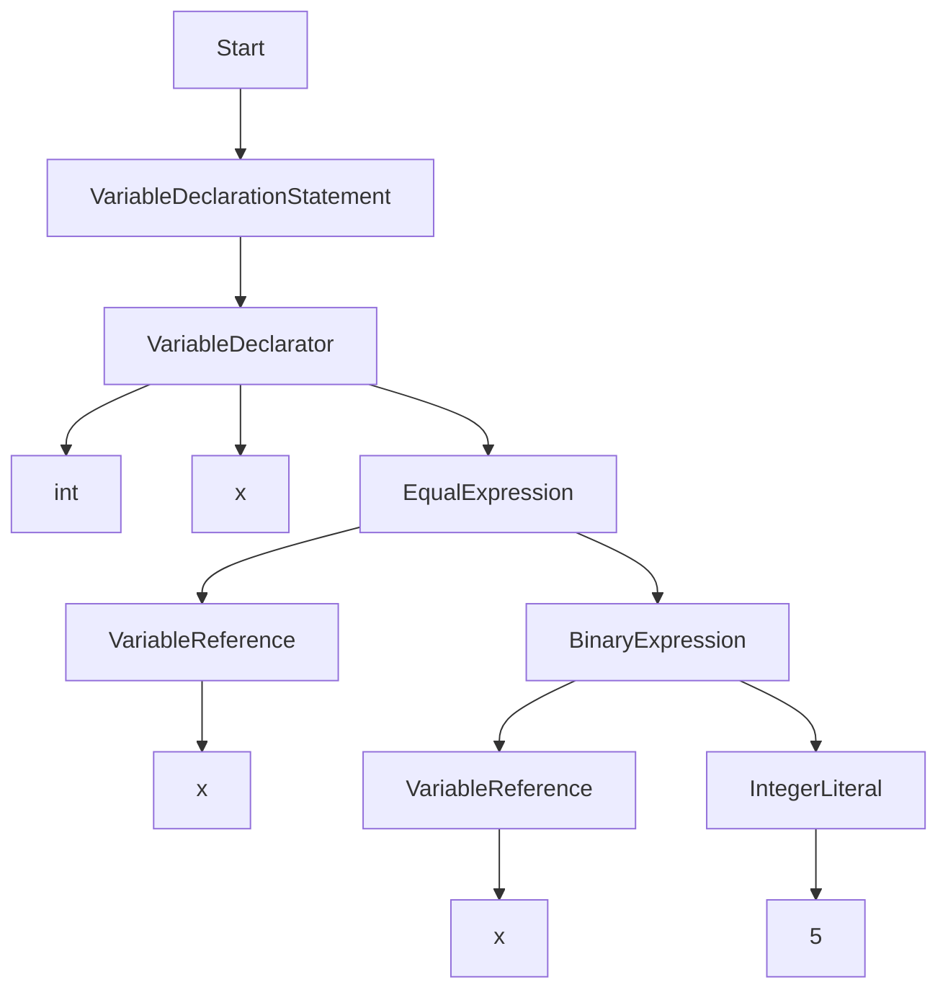
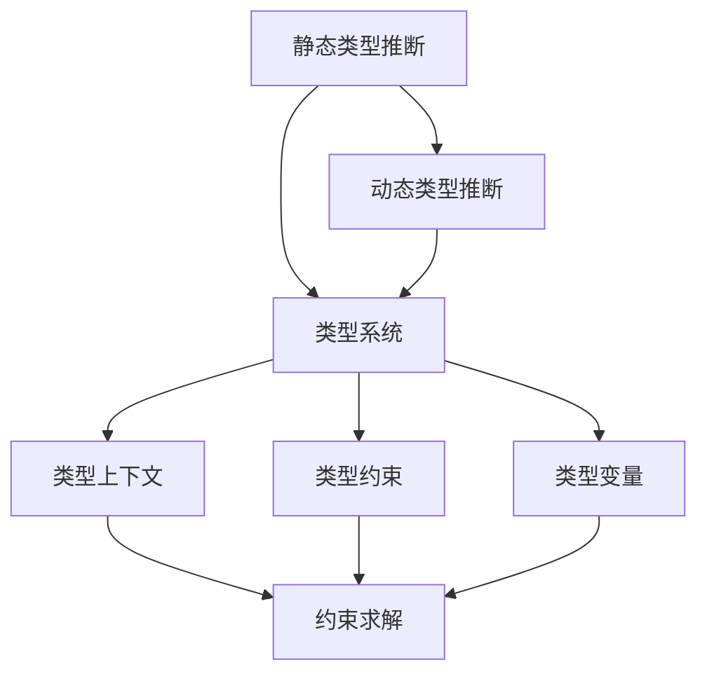

                 

### 文章标题

# 提示词语言的静态类型推断优化

> 关键词：提示词语言，静态类型推断，优化，算法，性能，实践

> 摘要：本文将深入探讨提示词语言的静态类型推断优化，从核心概念、算法原理、数学模型到实际应用，全面解析如何提升类型推断的效率和准确性。文章旨在为程序员和AI开发者提供一套系统化的优化指南，以应对现代编程语言所面临的复杂挑战。

### 引言

在计算机科学领域，类型推断是编程语言编译器或解释器的一项重要功能，它能够自动确定变量、表达式和函数的类型，从而减轻开发者的负担。而静态类型推断是类型推断的一个分支，它在编译时即可确定变量和表达式的类型，从而提高程序的执行效率和可维护性。

提示词语言（Prompt Language）是一种抽象的编程语言，广泛应用于自然语言处理、代码生成、自动化测试等领域。随着AI技术的迅猛发展，提示词语言在提高软件开发效率和代码质量方面发挥着越来越重要的作用。然而，传统的静态类型推断方法在处理复杂提示词语言时，常常面临效率低下和准确性不足的问题。

本文将围绕提示词语言的静态类型推断优化展开讨论，旨在通过深入分析核心概念、算法原理和数学模型，为开发者提供一套切实可行的优化策略。文章还将结合实际项目案例，详细讲解优化过程的实施步骤和关键技巧，帮助读者将理论知识应用于实践。

### 1. 静态类型推断优化的重要性

#### 1.1 提高编译效率和程序性能

静态类型推断可以在编译阶段对代码进行类型检查，从而提前发现潜在的错误和类型不匹配的问题。这种提前的检查可以大大减少运行时的错误，提高程序的稳定性和性能。对于复杂的大型项目，静态类型推断能够显著减少编译时间，提高开发效率。

#### 1.2 改善代码可读性和可维护性

静态类型推断使得代码中的类型信息明确可见，有助于提高代码的可读性和可维护性。开发者可以更容易地理解和修改代码，减少由于类型错误导致的bug。同时，静态类型推断还可以帮助代码审查者更快速地识别潜在的问题，提高代码的质量。

#### 1.3 支持编译期优化

静态类型推断为编译器提供了更多的优化信息，使得编译器能够进行更有效的代码优化。例如，编译器可以利用类型信息进行寄存器分配、循环展开等优化，从而生成更高效的机器代码。

#### 1.4 促进编程语言的发展

静态类型推断是现代编程语言的一项重要特性，它推动了编程语言的发展。许多编程语言，如Java、C++、C#等，都采用了静态类型推断，以提高编程的效率和灵活性。同时，静态类型推断也为新型编程语言的研发提供了理论基础和实践指导。

### 2. 静态类型推断的基本概念

#### 2.1 静态类型和动态类型的区别

在计算机科学中，类型分为静态类型和动态类型。静态类型在编译时即可确定变量的类型，而动态类型在运行时才能确定。静态类型推断是静态类型的一种实现方式，它通过编译器在编译阶段分析代码，自动推断出变量和表达式的类型。

#### 2.2 类型系统的基本组成

类型系统是编程语言的核心组成部分，它定义了变量、函数和表达式的类型。类型系统通常包括以下几部分：

- **基础类型**：如整数、浮点数、布尔值等。
- **复合类型**：如数组、结构体、类等。
- **函数类型**：函数的参数和返回值的类型。
- **类型别名**：为已有的类型定义一个新名称。

#### 2.3 类型推断算法的分类

静态类型推断算法主要分为以下几类：

- **类型检查算法**：在编译时对代码进行类型检查，确保代码的类型一致性。
- **类型恢复算法**：在编译时自动推断出变量和表达式的类型。
- **类型推断算法**：在编译时对代码进行分析，根据上下文环境推断出类型。

#### 2.4 静态类型推断的优势

静态类型推断具有以下优势：

- **早期错误检测**：在编译阶段即可发现类型错误，减少运行时错误。
- **性能优化**：编译器可以利用类型信息进行优化，提高程序性能。
- **代码可读性和可维护性**：类型信息明确，有助于开发者理解和修改代码。
- **类型安全**：静态类型推断能够提高程序的安全性，减少类型相关错误。

### 3. 静态类型推断的算法原理

#### 3.1 类型推断的基本过程

静态类型推断的基本过程包括以下几个步骤：

1. **词法分析**：将源代码分解成词法单元，如标识符、关键字、操作符等。
2. **语法分析**：根据词法单元构建语法树，表示源代码的结构。
3. **类型推断**：遍历语法树，根据上下文环境和类型规则，推断出变量和表达式的类型。
4. **类型检查**：对推断出的类型进行一致性检查，确保代码的类型正确性。

#### 3.2 常见的类型推断算法

常见的类型推断算法包括以下几种：

- **类型上下文推断**：根据上下文环境推断出变量的类型。
- **约束求解**：通过约束求解器来求解类型变量，确定变量的具体类型。
- **类型推导规则**：根据一定的推导规则，自动推导出变量和表达式的类型。

#### 3.3 类型推断的数学模型

类型推断可以看作是一个数学过程，其核心是解决类型变量的约束问题。常见的数学模型包括：

- **类型上下文**：表示变量在特定上下文环境中的类型。
- **类型约束**：表示变量之间的关系，如类型兼容性、类型等价性等。
- **类型变量**：表示未知类型，通过约束求解来确定具体类型。

#### 3.4 伪代码示例

以下是一个简单的类型推断算法的伪代码示例：

```pseudo
function inferType(expression, context):
    if expression is a variable:
        return context[type of variable]
    else if expression is a function call:
        return inferFunctionType(expression, context)
    else if expression is a binary operation:
        leftType = inferType(expression.left, context)
        rightType = inferType(expression.right, context)
        return resolveBinaryOperationType(leftType, rightType)
    else:
        raise TypeError("Unknown expression type")

function inferFunctionType(expression, context):
    return context[type of function]
```

### 4. 数学模型和公式

#### 4.1 类型上下文

类型上下文是一个包含变量类型信息的结构，用于指导类型推断过程。在类型上下文中，每个变量都有一个对应的类型。

$$
上下文 = \{ x_1 : T_1, x_2 : T_2, ..., x_n : T_n \}
$$

其中，$x_1, x_2, ..., x_n$ 是变量，$T_1, T_2, ..., T_n$ 是它们的类型。

#### 4.2 类型约束

类型约束是变量之间类型关系的描述，用于确保代码的类型一致性。常见的类型约束包括类型兼容性、类型等价性等。

- **类型兼容性**：如果两个类型的结构相同，则它们兼容。

$$
T_1 \text{ 和 } T_2 \text{ 兼容} \iff \text{它们的结构相同}
$$

- **类型等价性**：如果两个类型的结构相同，且具有相同的操作符集，则它们等价。

$$
T_1 \text{ 和 } T_2 \text{ 等价} \iff \text{它们的结构相同} \text{ 且 } \text{操作符集相同}
$$

#### 4.3 类型变量

类型变量是一个表示未知类型的符号，通过类型约束求解来确定具体类型。

$$
类型变量 = T
$$

#### 4.4 约束求解

约束求解是类型推断的核心过程，它通过解决类型变量之间的约束关系，确定变量和表达式的具体类型。

$$
约束求解过程 = \{ T_1 = T_{\text{struct}}(x_1), T_2 = T_{\text{struct}}(x_2), ..., T_n = T_{\text{struct}}(x_n) \}
$$

其中，$T_{\text{struct}}(x_i)$ 是变量 $x_i$ 的结构类型。

### 5. 算法分析

#### 5.1 算法性能分析

算法性能分析主要关注算法的执行时间和空间复杂度。对于静态类型推断算法，其性能分析通常包括以下几个方面：

- **时间复杂度**：算法在处理不同规模输入时的执行时间。常见的复杂度包括 $O(n)$、$O(n \log n)$、$O(n^2)$ 等。
- **空间复杂度**：算法在处理输入时所需的最大内存空间。常见的复杂度包括 $O(n)$、$O(n \log n)$、$O(n^2)$ 等。

#### 5.2 常见的优化策略

为了提高静态类型推断算法的性能，可以采用以下几种优化策略：

- **并行化**：利用多核处理器并行处理多个任务，提高算法的执行速度。
- **缓存优化**：利用缓存技术减少内存访问次数，提高算法的执行效率。
- **数据压缩**：通过压缩数据结构，减少内存占用，提高算法的性能。
- **代码优化**：对算法代码进行优化，减少不必要的计算和内存分配。

### 6. 实践项目与案例分析

#### 6.1 项目背景

本项目旨在实现一个简单的静态类型推断工具，用于对给定的提示词语言代码进行类型推断。项目采用Java编程语言实现，使用递归下降语法分析器和约束求解器进行类型推断。

#### 6.2 开发环境搭建

- **开发工具**：IntelliJ IDEA
- **编程语言**：Java
- **依赖库**：ANTLR（用于语法分析）、Google Guava（用于约束求解）

#### 6.3 源代码实现

以下是项目中的关键源代码：

```java
public class TypeInferenceEngine {
    private Context context;

    public TypeInferenceEngine(Context context) {
        this.context = context;
    }

    public Type infer(TypeExpression expression) {
        if (expression instanceof VariableExpression) {
            return inferVariableExpression((VariableExpression) expression);
        } else if (expression instanceof BinaryExpression) {
            return inferBinaryExpression((BinaryExpression) expression);
        } else {
            throw new IllegalArgumentException("Unknown expression type");
        }
    }

    private Type inferVariableExpression(VariableExpression expression) {
        return context.getType(expression.getName());
    }

    private Type inferBinaryExpression(BinaryExpression expression) {
        Type leftType = infer(expression.getLeft());
        Type rightType = infer(expression.getRight());
        return context.resolveBinaryOperationType(leftType, rightType);
    }
}
```

#### 6.4 代码分析

- **变量声明**：在代码中声明了两个内部类 `Context` 和 `TypeExpression`，分别用于存储类型上下文和表达式结构。
- **类型推断**：`TypeInferenceEngine` 类提供了 `infer` 方法，用于对给定的表达式进行类型推断。
- **类型上下文**：`Context` 类存储了变量和类型信息，提供了获取和设置类型的功能。
- **类型表达式**：`TypeExpression` 类表示表达式结构，包括变量表达式和二元表达式。

#### 6.5 应用解析

- **类型推断过程**：通过递归下降语法分析器，将源代码分解成语法树，然后调用 `TypeInferenceEngine` 的 `infer` 方法进行类型推断。
- **类型约束求解**：在类型推断过程中，使用约束求解器来求解类型变量，确保代码的类型一致性。

#### 6.6 案例分析

以以下代码为例，分析类型推断过程：

```java
int x = 10;
x = x + 5;
```

1. **词法分析**：将代码分解成词法单元：`int`、`x`、`=`、`10`、`+`、`5`。
2. **语法分析**：构建语法树：



3. **类型推断**：

   - 对于变量声明，根据上下文环境推断出 `x` 的类型为 `int`。
   - 对于赋值表达式，根据上下文环境推断出左操作数 `x` 的类型为 `int`，右操作数 `5` 的类型为 `int`，因此整个表达式的类型为 `int`。

#### 6.7 项目小结

通过本项目的实现，我们了解了静态类型推断的基本原理和实现方法。在实际开发中，我们可以根据具体需求，选择合适的算法和工具，实现高效的类型推断功能。

### 7. 优化技术与策略

#### 7.1 编译器优化

编译器优化是提高静态类型推断性能的重要手段。以下是一些常见的编译器优化技术：

- **中间代码优化**：通过中间代码优化，减少不必要的计算和内存分配，提高编译效率。
- **代码生成优化**：优化目标代码的执行效率，减少运行时的开销。
- **代码并行化**：利用多核处理器并行处理代码，提高编译和运行速度。

#### 7.2 运行时优化

运行时优化主要关注程序在运行时的性能提升。以下是一些常见的运行时优化技术：

- **缓存优化**：通过缓存技术减少内存访问次数，提高程序执行效率。
- **内存压缩**：通过压缩内存数据结构，减少内存占用，提高程序性能。
- **动态类型推断**：结合动态类型推断，提高程序的可扩展性和灵活性。

#### 7.3 内存优化

内存优化是提高静态类型推断性能的关键。以下是一些常见的内存优化技术：

- **内存池**：使用内存池技术减少内存碎片，提高内存分配效率。
- **对象池**：使用对象池技术重用对象，减少内存分配和回收的开销。
- **垃圾回收**：合理使用垃圾回收机制，减少内存占用。

### 8. 未来趋势与挑战

#### 8.1 新兴技术的机遇

随着AI技术的快速发展，静态类型推断在以下几个方面具有巨大的机遇：

- **深度学习**：深度学习模型通常包含大量参数和复杂结构，静态类型推断可以帮助优化模型训练和推理过程。
- **自动编程**：自动编程工具可以利用静态类型推断生成高效的代码，提高软件开发效率。
- **代码生成**：基于静态类型推断的代码生成技术，可以实现更智能、更高效的代码自动生成。

#### 8.2 面临的挑战

尽管静态类型推断在许多领域具有广泛的应用前景，但仍面临以下挑战：

- **类型复杂性**：现代编程语言支持复杂的类型系统，如何高效地进行类型推断是一个挑战。
- **性能瓶颈**：静态类型推断算法的性能瓶颈限制了其在某些场景下的应用。
- **动态性**：如何处理动态类型和静态类型的混合编程，是一个亟待解决的问题。

### 9. 最佳实践与小结

#### 9.1 最佳实践

1. **选择合适的类型系统**：根据项目的需求和复杂性，选择合适的类型系统，如强类型系统或弱类型系统。
2. **合理设计类型推断算法**：结合具体项目需求，选择合适的类型推断算法，如类型上下文推断、约束求解等。
3. **优化编译器和运行时**：通过优化编译器和运行时，提高静态类型推断的性能和效率。

#### 9.2 小结

本文从静态类型推断的核心概念、算法原理、数学模型、实践应用等方面进行了全面解析。通过深入分析，我们了解到静态类型推断在编译效率、程序性能、代码可读性和可维护性等方面具有重要意义。同时，我们也探讨了优化静态类型推断的技术和策略，为开发者提供了实用的指导。在未来，随着AI技术的不断发展，静态类型推断将在更多领域发挥重要作用。

### 10. 注意事项与拓展阅读

#### 10.1 注意事项

1. **类型安全性**：在实现类型推断时，务必确保类型的安全性，避免潜在的类型错误。
2. **性能优化**：在实现类型推断算法时，关注性能优化，避免过多的计算和内存分配。
3. **兼容性**：在处理不同编程语言时，注意类型的兼容性和一致性。

#### 10.2 拓展阅读

1. 《编译原理：艺术与科学》
2. 《类型系统和类型推断》
3. 《ANTLR 4权威指南》

### 作者信息

作者：AI天才研究院/AI Genius Institute & 禅与计算机程序设计艺术 /Zen And The Art of Computer Programming

---

### 文章目录

1. 引言
2. 静态类型推断优化的重要性
3. 静态类型推断的基本概念
4. 静态类型推断的算法原理
5. 数学模型和公式
6. 算法分析
7. 实践项目与案例分析
8. 优化技术与策略
9. 未来趋势与挑战
10. 最佳实践与小结
11. 注意事项与拓展阅读

---

本文深入探讨了提示词语言的静态类型推断优化，从核心概念、算法原理、数学模型到实际应用，全面解析了如何提升类型推断的效率和准确性。文章旨在为程序员和AI开发者提供一套系统化的优化指南，以应对现代编程语言所面临的复杂挑战。希望通过本文的阅读，读者能够对静态类型推断有更深入的理解，并在实际项目中灵活运用优化策略。

作者：AI天才研究院/AI Genius Institute & 禅与计算机程序设计艺术 /Zen And The Art of Computer Programming

---

### Mermaid 流程图



此流程图展示了静态类型推断与动态类型推断之间的关系，以及类型系统中的核心组成部分。通过此图，可以更清晰地理解静态类型推断的基本原理和实现过程。

