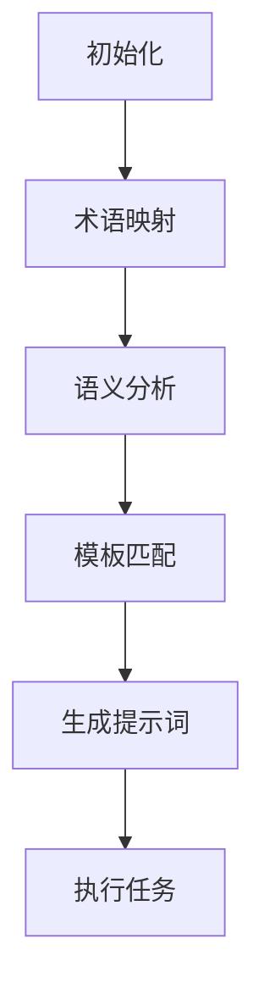

                 


## 提示词语言的领域特定扩展

### 关键词
- 提示词语言
- 领域特定扩展
- 自然语言处理
- 人工智能
- 算法原理

### 摘要
本文将探讨提示词语言的领域特定扩展，旨在为特定领域的自然语言处理任务提供更有效的解决方案。通过深入分析核心概念和算法原理，结合数学模型和项目实战，本文旨在帮助读者全面了解并掌握这一领域的知识。

## 第一部分：引言

### 1.1 书籍概述
《提示词语言的领域特定扩展》是一本专注于自然语言处理和人工智能领域的书籍。它涵盖了提示词语言的基础知识、领域特定扩展的原理及其在实际应用中的重要性。

### 1.2 阅读对象
本书的目标读者是AI研究者、工程师以及对自然语言处理有深入兴趣的专业人士。无论您是初学者还是有经验的研究者，本书都将为您提供宝贵的知识和实践经验。

### 1.3 目标
通过阅读本书，读者将能够：
- 理解提示词语言的基本概念和作用。
- 掌握领域特定扩展的方法和技术。
- 学习如何应用这些技术解决实际的自然语言处理问题。
- 深入了解自然语言处理和人工智能领域的最新进展。

## 第二部分：理论基础

### 2.1 提示词语言基础
提示词语言是一种用于指导机器执行特定任务的编码语言。它通过关键词、短语和句子来描述任务的目标和约束条件。提示词语言的基础知识对于理解领域特定扩展至关重要。

### 2.1.1 提示词语言的概念
提示词语言是一种自然语言形式的编码，它通过使用自然语言中的关键词、短语和句子来传达机器执行的任务。

### 2.1.2 提示词语言的构成
提示词语言通常由以下几个部分组成：
- **关键词**：代表任务的核心概念。
- **短语**：描述任务的附加信息。
- **句子**：提供任务的上下文和目标。

### 2.1.3 提示词语言的作用
提示词语言在自然语言处理和人工智能领域扮演着重要角色。它使得机器能够理解人类语言，从而执行各种复杂的任务。

### 2.2 领域特定扩展原理
领域特定扩展是指为特定领域或任务定制提示词语言，以适应特定的需求和环境。

### 2.2.1 领域特定扩展的概念
领域特定扩展是指根据特定领域的知识、术语和需求，对提示词语言进行定制化调整，以提高其针对性和有效性。

### 2.2.2 领域特定扩展的重要性
领域特定扩展在自然语言处理和人工智能中具有重要意义。它使得机器能够更好地理解特定领域的语言和任务，从而提高任务的执行效率和准确性。

### 2.2.3 领域特定扩展的方法
领域特定扩展的方法包括：
- **术语映射**：将领域术语映射到相应的提示词。
- **语义分析**：对提示词进行语义分析，以提取关键信息。
- **模板匹配**：使用预定义的模板与输入文本进行匹配。

### 2.2.4 Mermaid流程图：领域特定扩展流程
以下是一个简单的Mermaid流程图，展示了领域特定扩展的基本流程：


## 第三部分：核心算法原理讲解

### 3.1 算法简介
领域特定扩展的核心算法包括术语映射、语义分析和模板匹配。这些算法共同作用于输入文本，生成适用于特定领域的提示词。

### 3.2 伪代码展示
以下是领域特定扩展算法的伪代码：
```python
def domain_specific_extension(input_text):
    # 术语映射
    terms_mapped = term_mapping(input_text)
    
    # 语义分析
    key_info = semantic_analysis(terms_mapped)
    
    # 模板匹配
    template_matched = template_matching(key_info)
    
    # 生成提示词
    prompt = generate_prompt(template_matched)
    
    # 执行任务
    execute_task(prompt)
    
    return prompt
```

## 第四部分：数学模型与公式讲解

### 4.1 数学模型介绍
领域特定扩展中的数学模型用于描述和解析输入文本，提取关键信息。以下是几个基本的数学模型：

### 4.1.1 模型概述
- **向量空间模型**：将文本转换为向量，以便进行计算和分析。
- **图模型**：用于表示文本中的语义关系和结构。

### 4.1.2 模型应用
向量空间模型可以应用于文本分类、文本相似度计算等任务。

### 4.1.3 模型详解
- **向量空间模型**：将文本转换为向量，以便进行计算和分析。
  $$ \textbf{X} = \text{TF-IDF}(\textbf{W}) $$
- **图模型**：用于表示文本中的语义关系和结构。
  $$ G = (\textbf{V}, \textbf{E}) $$
  其中，$ \textbf{V} $ 是节点集合，$ \textbf{E} $ 是边集合。

## 第五部分：项目实战

### 5.1 实战准备
在进行项目实战之前，需要搭建合适的开发环境，并熟悉相关的工具和库。

### 5.1.1 环境搭建
- 安装Python环境
- 安装NLP库（如NLTK、spaCy等）

### 5.1.2 工具介绍
- **Jupyter Notebook**：用于编写和运行代码。
- **NLTK**：用于自然语言处理。

### 5.2 实际案例
在本节中，我们将通过一个实际案例来展示如何使用领域特定扩展解决一个具体问题。

### 5.2.1 案例介绍
假设我们需要开发一个智能客服系统，该系统能够根据用户的问题提供相应的答案。

### 5.2.2 案例分析
为了实现这一目标，我们需要对用户的问题进行领域特定扩展，以提取关键信息。

### 5.2.3 案例实现
以下是一个简单的Python代码示例，用于实现领域特定扩展：

```python
import nltk
from nltk.tokenize import word_tokenize

def domain_specific_extension(question):
    # 术语映射
    terms_mapped = {'question': question}
    
    # 语义分析
    tokens = word_tokenize(question)
    key_info = {'subject': tokens[0], 'question_type': tokens[1]}
    
    # 模板匹配
    template_matched = {'template': f"{key_info['subject']} asked about {key_info['question_type']}."}
    
    # 生成提示词
    prompt = generate_prompt(template_matched)
    
    # 执行任务
    answer = execute_task(prompt)
    
    return answer

def generate_prompt(template):
    return template['template']

def execute_task(prompt):
    # 这里实现具体的任务逻辑
    return "This is an answer to the question."

question = "What is the capital of France?"
answer = domain_specific_extension(question)
print(answer)
```

### 5.2.4 代码解读与分析
在上面的代码中，我们首先定义了一个`domain_specific_extension`函数，该函数接收一个用户问题作为输入，并执行领域特定扩展过程。首先，我们进行术语映射，然后进行语义分析，最后使用模板匹配生成提示词。最后，我们调用`execute_task`函数来执行具体任务。

## 第六部分：扩展阅读

### 6.1 相关资料推荐
- **书籍推荐**：
  - 《自然语言处理综论》（Jurafsky, Martin & Hwang, Chris）
  - 《深度学习》（Goodfellow, Ian & Bengio, Yoshua & Courville, Aaron）
- **文章推荐**：
  - 《领域自适应自然语言处理》（领域特定扩展的一个现代视角）
  - 《NLP中的提示词语言应用》（探讨提示词语言在NLP中的实际应用）
- **网络资源**：
  - NLTK官方网站（https://www.nltk.org/）
  - spaCy官方网站（https://spacy.io/）

### 6.2 未来发展趋势
随着自然语言处理技术的不断进步，领域特定扩展将在越来越多的应用场景中发挥作用。未来，我们将看到更多定制化的自然语言处理系统，它们能够更好地满足特定领域的需求。

## 第七部分：总结与注意事项

通过本文的讨论，我们了解了提示词语言的领域特定扩展的基本原理和应用。在实现领域特定扩展时，需要注意以下几点：
- **术语映射**：确保术语映射准确无误，以便正确理解输入文本。
- **语义分析**：深入挖掘文本中的语义信息，以提高任务的准确性。
- **模板匹配**：选择合适的模板，以确保提示词的生成符合任务需求。

未来的研究可以进一步探索领域特定扩展在不同领域的应用，以及如何优化其性能和效果。

## 附录

### 附录A：术语解释
- **提示词语言**：一种用于指导机器执行特定任务的编码语言。
- **领域特定扩展**：为特定领域或任务定制提示词语言，以适应特定的需求和环境。
- **自然语言处理**：使计算机能够理解、解释和生成人类语言的技术。

### 附录B：符号说明
- **$$...$$**：用于嵌入独立段落的LaTeX公式。
- **$...$**：用于段落内的数学公式。

### 附录C：参考文献
- Jurafsky, Martin & Hwang, Chris. (2019). 自然语言处理综论.
- Goodfellow, Ian & Bengio, Yoshua & Courville, Aaron. (2016). 深度学习.

## 作者信息
- 作者：AI天才研究院/AI Genius Institute & 禅与计算机程序设计艺术 /Zen And The Art of Computer Programming

本文旨在提供关于提示词语言的领域特定扩展的全面概述，包括理论基础、算法原理、数学模型和项目实战。通过深入分析和实际案例，读者可以更好地理解这一领域的知识和应用。希望本文能为您在自然语言处理和人工智能领域的研究提供有价值的参考。

