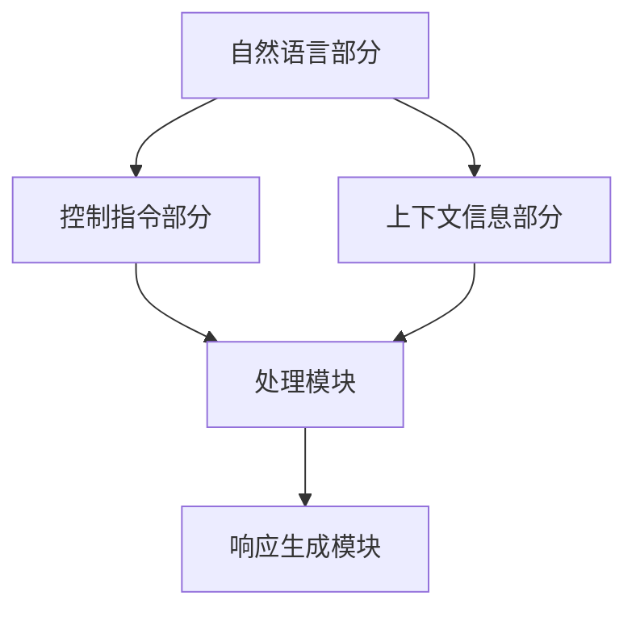

                 

### 提示词语言：AI交互的未来

关键词：提示词语言，AI交互，自然语言处理，语音识别，多模态交互

摘要：随着人工智能技术的飞速发展，AI交互逐渐成为人机交互的新范式。本文首先回顾了AI交互的发展历程，探讨了自然语言处理、语音识别和语音合成等技术的基础理论。接着，深入分析了提示词语言的概念、类型及其作用。在此基础上，本文详细介绍了提示词语言的架构设计、实现技术和优化方法，并通过实际案例展示了其应用。最后，对AI交互的未来发展趋势进行了展望，探讨了其在家庭生活、工作场所、教育和娱乐等领域的潜在应用。

## 第一部分：AI交互的背景与基础理论

### 1.1 AI交互的发展历程

#### 1.1.1 早期的自然语言处理

自然语言处理（NLP）是人工智能领域的一个重要分支，旨在使计算机能够理解、生成和处理人类语言。早期的自然语言处理可以追溯到20世纪50年代和60年代，当时的研究主要集中在文本分析、语法分析和机器翻译等方面。

**核心概念与联系：**

- **语法分析**：对文本进行句法分析，识别句子结构。
  - **Mermaid 流程图：**
    ```mermaid
    graph TD
    A[词法分析] --> B[句法分析]
    B --> C[语义分析]
    C --> D[语用分析]
    ```

- **机器翻译**：将一种语言的文本翻译成另一种语言。
  - **数学模型和公式：**
    $$ T_{source} \rightarrow T_{target} $$

#### 1.1.2 语音识别与合成技术

随着计算机性能的提升和算法的改进，语音识别和语音合成技术得到了快速发展。语音识别技术使得计算机能够将人类的语音转换为文本，而语音合成技术则能够将文本转换为自然流畅的语音。

**核心算法原理讲解：**

**语音识别：**
1. 特征提取（MFCC、DTW等）
2. 声学模型训练（HMM、DNN等）
3. 语言模型训练（N-gram、RNN等）

**语音合成：**
1. 文本预处理（分词、声调标注等）
2. 声学模型生成（DNN-HMM、WaveNet等）
3. 声音生成（合波、后处理等）

#### 1.1.3 AI交互的兴起

随着移动互联网和智能设备的普及，AI交互逐渐成为人机交互的新范式。用户不再满足于传统的图形界面交互，而是期望能够通过自然语言与计算机进行交流。

**核心概念与联系：**

- **语音助手**：如苹果的Siri、谷歌的Google Assistant等，通过自然语言处理技术实现语音识别、理解和响应。
  - **Mermaid 流程图：**
    ```mermaid
    graph TD
    A[语音输入] --> B[语音识别]
    B --> C[自然语言理解]
    C --> D[响应生成]
    D --> E[语音合成]
    ```

- **多模态交互**：结合语音、文本、视觉等多种模态，提供更加丰富和自然的交互体验。

### 1.2 提示词语言的概念

提示词语言是一种特殊的自然语言，它结合了自然语言和计算机控制的指令，用于指导AI系统执行特定的任务。

#### 1.2.1 提示词语言的基本定义

提示词语言可以定义为：
\[ \text{Prompt Language} = \text{Natural Language} + \text{Control Instructions} \]

#### 1.2.2 提示词语言的类型

根据用途和形式，提示词语言可以分为以下几种类型：

- **命令式提示**：提供明确的指令，如“打开灯光”。
- **查询式提示**：询问信息，如“今天天气怎么样？”。
- **情境式提示**：结合上下文，如“在晚餐时间，播放轻音乐”。

#### 1.2.3 提示词语言的作用

提示词语言在AI交互中起着至关重要的作用：

- **提升交互效率**：通过简明的指令，用户可以更快地完成操作。
- **丰富交互形式**：结合多种模态，提供更加丰富的交互体验。
- **降低用户认知负担**：通过自然语言，用户无需记忆复杂的界面操作。

### 1.3 AI交互的关键技术

AI交互的实现依赖于多种关键技术的支持，包括自然语言处理、语音识别、语音合成和多模态交互。

#### 1.3.1 自然语言处理技术

自然语言处理技术是AI交互的核心，它包括以下几个主要方面：

- **分词与词性标注**：将文本拆分为词，并为每个词标注词性。
- **句法分析**：分析句子的结构，理解句子的语法关系。
- **语义理解**：理解文本的含义，包括实体识别、关系提取等。
- **问答系统**：实现用户提问和系统回答的交互。

#### 1.3.2 语音识别技术

语音识别技术将人类的语音转换为文本，是实现语音交互的关键。其核心算法包括：

- **特征提取**：从音频信号中提取特征，如MFCC（梅尔频率倒谱系数）。
- **声学模型训练**：使用大量语音数据训练声学模型，如DNN（深度神经网络）。
- **语言模型训练**：使用文本数据训练语言模型，如N-gram、RNN（循环神经网络）。

#### 1.3.3 语音合成技术

语音合成技术将文本转换为自然流畅的语音，其核心算法包括：

- **文本预处理**：对文本进行分词、声调标注等处理。
- **声学模型生成**：使用DNN-HMM（深度神经网络隐藏马尔可夫模型）或WaveNet（基于转导的神经网络）生成语音。
- **声音生成**：合波、后处理等步骤生成最终的音频信号。

#### 1.3.4 多模态交互技术

多模态交互技术结合语音、文本、视觉等多种模态，提供更加丰富和自然的交互体验。其核心在于：

- **模态融合**：将不同模态的信息进行整合，提高系统的理解能力。
- **上下文感知**：根据用户的行为和历史交互，动态调整交互策略。

### 1.4 AI交互的应用场景

AI交互技术已经在多个应用场景中得到了广泛应用，以下是其中几个典型的应用场景：

#### 1.4.1 智能家居

智能家居通过AI交互技术，实现了家电设备的智能控制。用户可以通过语音命令控制灯光、温度、安全设备等，提高生活质量。

#### 1.4.2 智能客服

智能客服利用AI交互技术，实现了自动化的客户服务。用户可以通过语音或文本与客服机器人进行交互，解决常见问题，提高服务效率。

#### 1.4.3 智能驾驶

智能驾驶通过AI交互技术，实现了人机协同驾驶。驾驶员可以通过语音指令与车载系统进行交互，控制导航、音响、安全等功能。

#### 1.4.4 教育与娱乐

教育与娱乐领域也广泛运用了AI交互技术。通过语音识别和语音合成，可以实现智能教学、语音助教等功能，提高学习效果和娱乐体验。

## 第二部分：提示词语言的设计与实现

### 2.1 提示词语言的架构设计

提示词语言的架构设计是构建高效、灵活和可扩展的AI交互系统的基础。以下从组成部分、语法规则和语义解析三个方面介绍提示词语言的架构设计。

#### 2.1.1 提示词语言的组成部分

提示词语言通常由以下三个主要组成部分构成：

1. **自然语言部分**：这是用户输入的文本，如“打开客厅的灯光”。
2. **控制指令部分**：这是对自然语言部分进行处理的指令，如“执行动作”。
3. **上下文信息部分**：这是与当前交互相关的背景信息，如用户的历史请求和系统状态。

**Mermaid 流程图：**


#### 2.1.2 提示词语言的语法规则

提示词语言的语法规则定义了如何组织自然语言和控制指令，使其能够被AI系统正确理解和执行。以下是一些常见的语法规则：

- **命令式语法**：使用动词和名词结构，如“打开”、“关闭”。
- **查询式语法**：使用疑问词和谓词结构，如“是什么？”、“多少？”。
- **情境式语法**：结合上下文，如“晚餐时间到了，播放轻音乐”。

**示例：**
- **命令式**：“打开客厅的灯光”。
- **查询式**：“客厅的灯光现在是什么状态？”。
- **情境式**：“现在时间是晚上8点，打开卧室的灯光并设置温度为22摄氏度”。

#### 2.1.3 提示词语言的语义解析

语义解析是提示词语言处理的核心，其目标是理解用户输入的含义并生成相应的响应。以下是一些常见的语义解析方法：

- **规则基方法**：使用预定义的规则来匹配和解析用户输入。
  - **伪代码示例：**
    ```python
    def parse_prompt(prompt):
        if "打开" in prompt:
            return "执行动作"
        elif "是什么" in prompt:
            return "查询状态"
        else:
            return "未知指令"
    ```

- **基于深度学习方法**：使用神经网络模型来学习用户输入和响应之间的关系。
  - **伪代码示例：**
    ```python
    model = load_model("prompt_language_model.h5")
    prediction = model.predict(prompt_vector)
    return decode_prediction(prediction)
    ```

### 2.2 提示词语言的实现技术

提示词语言的实现技术包括语音识别、自然语言处理和语音合成等方面，以下分别介绍这些技术的基本原理和应用。

#### 2.2.1 语音识别与合成的算法原理

**语音识别：**

- **特征提取**：从音频信号中提取特征，如MFCC、DTW等。
  - **伪代码示例：**
    ```python
    def extract_features(audio_signal):
        # 应用短时傅里叶变换（STFT）提取频谱特征
        spectrum = stft(audio_signal)
        # 计算梅尔频率倒谱系数（MFCC）
        mfcc = mfcc_features(spectrum)
        return mfcc
    ```

- **声学模型训练**：使用语音数据集训练声学模型，如DNN、HMM等。
  - **伪代码示例：**
    ```python
    def train_acoustic_model(voice_data):
        # 初始化深度神经网络（DNN）模型
        model = initialize_dnn()
        # 使用语音数据训练模型
        model.fit(voice_data, epochs=10)
        return model
    ```

- **语言模型训练**：使用文本数据训练语言模型，如N-gram、RNN等。
  - **伪代码示例：**
    ```python
    def train_language_model(text_data):
        # 初始化循环神经网络（RNN）模型
        model = initialize_rnn()
        # 使用文本数据训练模型
        model.fit(text_data, epochs=10)
        return model
    ```

**语音合成：**

- **文本预处理**：对文本进行分词、声调标注等处理。
  - **伪代码示例：**
    ```python
    def preprocess_text(text):
        # 进行中文分词
        words = jieba.cut(text)
        # 进行声调标注
        annotated_words = annotate_tones(words)
        return annotated_words
    ```

- **声学模型生成**：使用DNN-HMM或WaveNet等方法生成语音。
  - **伪代码示例：**
    ```python
    def generate_speech(acoustic_model, text):
        # 预处理文本
        annotated_words = preprocess_text(text)
        # 使用声学模型生成语音
        speech = acoustic_model.generate(annotated_words)
        return speech
    ```

- **声音生成**：将生成的语音信号合成为音频。
  - **伪代码示例：**
    ```python
    def synthesize_audio(speech_signal):
        # 应用合波处理
        audio_signal = wavfile.synthesize(speech_signal)
        return audio_signal
    ```

#### 2.2.2 自然语言处理技术的应用

自然语言处理技术在提示词语言中起着关键作用，包括分词与词性标注、句法分析和语义理解等。

- **分词与词性标注**：将文本拆分为词，并为每个词标注词性。
  - **伪代码示例：**
    ```python
    def tokenize_and_tag(text):
        # 使用分词器进行分词
        words = tokenizer.tokenize(text)
        # 使用词性标注器进行词性标注
        tags = tagger.tag(words)
        return words, tags
    ```

- **句法分析**：分析句子的结构，理解句子的语法关系。
  - **伪代码示例：**
    ```python
    def parse_syntax(sentence):
        # 使用句法分析器进行句法分析
        parse_tree = parser.parse(sentence)
        return parse_tree
    ```

- **语义理解**：理解文本的含义，包括实体识别、关系提取等。
  - **伪代码示例：**
    ```python
    def understand_semantics(text):
        # 使用实体识别器进行实体识别
        entities = entity_recognizer.recognize_entities(text)
        # 使用关系提取器进行关系提取
        relationships = relationship_extractor.extract_relationships(text)
        return entities, relationships
    ```

#### 2.2.3 多模态交互的实现方法

多模态交互技术结合语音、文本、视觉等多种模态，提供更加丰富和自然的交互体验。

- **模态融合**：将不同模态的信息进行整合，提高系统的理解能力。
  - **伪代码示例：**
    ```python
    def fuse_modalities(text, speech, image):
        # 将文本、语音和图像进行特征提取
        text_features = extract_features(text)
        speech_features = extract_features(speech)
        image_features = extract_features(image)
        # 使用融合模型进行特征融合
        fused_features = fusion_model.predict([text_features, speech_features, image_features])
        return fused_features
    ```

- **上下文感知**：根据用户的行为和历史交互，动态调整交互策略。
  - **伪代码示例：**
    ```python
    def adjust_interaction(context):
        # 根据上下文调整交互策略
        if "已经播放过这首歌" in context:
            return "播放下一首歌曲"
        else:
            return "开始播放这首歌"
    ```

### 2.3 提示词语言的优化与改进

为了提高提示词语言的性能和用户体验，需要对语音识别、语音合成和自然语言处理等技术进行优化和改进。

#### 2.3.1 语音识别的优化

- **增强模型训练数据**：使用更多的语音数据集进行训练，提高模型的泛化能力。
- **改善特征提取方法**：采用更先进的特征提取方法，如谱减法和谱减增强。
- **应用端到端训练**：使用端到端模型（如CTC、ASR-LSTM）进行训练，提高识别准确性。

#### 2.3.2 语音合成的优化

- **改进声学模型**：采用更高级的声学模型，如WaveNet、Tacotron。
- **优化声音生成算法**：改善合波和后处理算法，提高语音的自然度和清晰度。
- **引入上下文信息**：结合上下文信息，生成更加自然的语音。

#### 2.3.3 自然语言处理技术的优化

- **提升语义理解能力**：使用深度学习模型（如BERT、GPT）进行语义理解，提高理解准确性。
- **优化分词和词性标注**：采用更准确的分词和词性标注算法，如基于神经网络的分词器。
- **提高问答系统性能**：使用强化学习等方法优化问答系统的性能，提高回答的准确性和多样性。

### 2.4 提示词语言的案例分析

通过以下案例分析，可以更直观地了解提示词语言在实际应用中的实现方法和效果。

#### 2.4.1 智能家居的提示词语言实现

智能家居场景中，提示词语言可以实现家电设备的智能控制。以下是一个简单的实现示例：

**用户输入**：“打开客厅的灯光”。

**处理过程**：

1. **语音识别**：将语音转换为文本：“打开客厅的灯光”。
2. **语义理解**：识别出关键词“打开”和“客厅的灯光”，并理解其含义。
3. **控制指令**：生成控制指令：“执行动作”。
4. **执行动作**：打开客厅的灯光。

**伪代码示例**：

```python
def control_light(lights, prompt):
    text = recognize_speech(prompt)
    words, tags = tokenize_and_tag(text)
    action, object = understand_semantics(words, tags)
    if action == "打开":
        lights.turn_on(object)
    elif action == "关闭":
        lights.turn_off(object)
    else:
        print("未知指令")
```

#### 2.4.2 智能客服的提示词语言实现

智能客服场景中，提示词语言可以用于与用户的对话。以下是一个简单的实现示例：

**用户输入**：“请问我的订单状态是什么？”

**处理过程**：

1. **语音识别**：将语音转换为文本：“请问我的订单状态是什么？”。
2. **语义理解**：识别出关键词“订单状态”，并理解其含义。
3. **查询订单状态**：从数据库中查询订单状态。
4. **语音合成**：将订单状态转换为语音。
5. **响应用户**：将语音播放给用户。

**伪代码示例**：

```python
def query_order_status(order_id):
    order_status = database.query_order_status(order_id)
    text = "您的订单状态是：" + order_status
    speech = synthesize_speech(text)
    play_speech(speech)
```

#### 2.4.3 智能驾驶的提示词语言实现

智能驾驶场景中，提示词语言可以实现车载系统的智能控制。以下是一个简单的实现示例：

**用户输入**：“请导航到最近的医院”。

**处理过程**：

1. **语音识别**：将语音转换为文本：“请导航到最近的医院”。
2. **语义理解**：识别出关键词“导航”和“最近的医院”，并理解其含义。
3. **生成导航指令**：生成导航指令。
4. **导航**：执行导航操作。

**伪代码示例**：

```python
def navigate_to_hospital(prompt):
    text = recognize_speech(prompt)
    words, tags = tokenize_and_tag(text)
    action, object = understand_semantics(words, tags)
    if action == "导航":
        destination = "最近的医院"
        navigation_system.navigate_to(destination)
    else:
        print("未知指令")
```

### 第三部分：AI交互的未来发展趋势

随着技术的不断进步，AI交互在未来将呈现出许多新的发展趋势和应用场景。以下是AI交互的一些未来发展趋势：

#### 3.1.1 技术发展趋势

1. **深度学习和神经网络技术的进一步发展**：深度学习和神经网络技术将继续推动AI交互的进步，特别是在自然语言处理、语音识别和语音合成等方面。

2. **多模态交互的普及**：随着多模态传感器技术的发展，AI交互将更加注重多种模态的结合，如语音、文本、视觉和触觉等。

3. **增强现实和虚拟现实技术的融合**：增强现实（AR）和虚拟现实（VR）技术的发展将为AI交互提供全新的交互场景和体验。

4. **智能对话系统的进一步优化**：智能对话系统将变得更加智能和人性化，能够更好地理解用户的意图和需求。

#### 3.1.2 应用场景发展趋势

1. **智能家居**：随着物联网（IoT）技术的普及，智能家居将进一步发展，实现更加智能化和便捷化的家庭生活。

2. **智能客服**：智能客服系统将更加普及，为企业提供高效、个性化的客户服务。

3. **智能驾驶**：智能驾驶技术将逐渐成熟，实现自动驾驶和车联网，提高交通安全和效率。

4. **教育和医疗**：AI交互技术在教育和医疗领域的应用将越来越广泛，提供个性化的教育和远程医疗服务。

5. **娱乐和艺术**：AI交互技术将为娱乐和艺术领域带来新的创意和体验，如智能音乐创作、虚拟现实游戏等。

#### 3.1.3 未来挑战与机遇

1. **隐私和安全**：随着AI交互的普及，隐私和安全问题将变得越来越重要。如何保护用户的隐私和数据安全成为未来的一大挑战。

2. **伦理和道德**：AI交互的发展也带来了伦理和道德问题，如人工智能的偏见、透明度和责任等。

3. **用户体验**：如何提供更加自然、高效和愉悦的用户体验是AI交互领域的重要研究课题。

4. **跨领域合作**：AI交互技术的发展需要多学科的协同合作，包括计算机科学、心理学、语言学、设计等领域。

### 3.2 AI交互的未来发展蓝图

在未来，AI交互将朝着更加智能、自然和个性化的方向发展。以下是一个简单的AI交互未来发展蓝图：

#### 3.2.1 智能交互系统的演进

1. **从单模态到多模态**：智能交互系统将结合多种模态，如语音、文本、视觉和触觉等，提供更加丰富和自然的交互体验。

2. **从被动响应到主动互动**：智能交互系统将能够主动识别用户的情感和需求，提供个性化的服务和互动。

3. **从单一任务到多任务**：智能交互系统将能够处理多个任务，如语音识别、文本生成、图像识别等，提高系统的实用性和灵活性。

#### 3.2.2 新型AI交互模式的探索

1. **上下文感知交互**：智能交互系统将更加关注上下文信息，根据用户的背景和历史交互动态调整交互策略。

2. **情感交互**：智能交互系统将能够识别和模拟用户的情感，提供更加温馨和有情感的交互体验。

3. **个性化交互**：智能交互系统将基于用户的行为和偏好，提供个性化的服务和推荐。

#### 3.2.3 AI交互与社会发展的融合

1. **智慧城市**：AI交互技术将广泛应用于智慧城市建设，提高城市管理效率和居民生活质量。

2. **智慧医疗**：AI交互技术将助力智慧医疗的发展，提供智能诊断、远程监护和个性化治疗等。

3. **智慧教育**：AI交互技术将推动智慧教育的发展，提供智能教学、在线学习和个性化辅导等。

### 3.3 AI交互的未来应用场景预测

在未来，AI交互技术将在各个领域得到广泛应用，以下是一些可能的未来应用场景预测：

#### 3.3.1 家庭生活

1. **智能家居助理**：智能交互系统将作为家庭助理，提供家庭设备的智能控制、日程管理、健康监测等服务。

2. **情感陪伴**：智能交互系统将能够识别用户的情绪，提供情感陪伴和心理支持。

3. **虚拟管家**：智能交互系统将能够完成家庭清洁、购物、烹饪等家务活。

#### 3.3.2 工作场所

1. **智能助手**：智能交互系统将作为工作助手，提供日程管理、任务提醒、文档搜索等服务。

2. **智能协作**：智能交互系统将促进团队协作，提供实时沟通、项目管理和知识共享等功能。

3. **智能安全监控**：智能交互系统将用于工作场所的安全监控，提供入侵检测、异常行为识别等服务。

#### 3.3.3 教育与医疗

1. **智能教学**：智能交互系统将用于个性化教学，提供学习内容推荐、学习进度跟踪和智能辅导等服务。

2. **远程医疗**：智能交互系统将用于远程医疗，提供在线问诊、远程监护和智能诊断等服务。

3. **健康监测**：智能交互系统将用于健康监测，提供心率、血压、睡眠质量等健康指标的实时监测。

#### 3.3.4 娱乐与艺术

1. **智能音乐创作**：智能交互系统将能够根据用户的需求和情感创作音乐。

2. **虚拟现实游戏**：智能交互系统将结合虚拟现实技术，提供更加沉浸式的游戏体验。

3. **艺术创作辅助**：智能交互系统将辅助艺术家进行绘画、音乐创作等艺术创作。

### 附录

#### 附录A：提示词语言开发工具与资源

1. **常用语音识别与合成工具：**
   - **Google Cloud Speech-to-Text**：提供语音识别服务。
   - **Google Text-to-Speech**：提供语音合成服务。
   - **OpenJTalk**：开源的日语语音合成工具。
   - **MaryTTS**：开源的多语言文本到语音合成工具。

2. **自然语言处理框架：**
   - **NLTK**：Python自然语言处理库。
   - **spaCy**：高效的NLP库。
   - **Stanford CoreNLP**：提供多种NLP任务的工具包。

3. **多模态交互平台：**
   - **Qt**：跨平台的应用程序开发框架。
   - **Unity**：游戏开发和虚拟现实开发平台。
   - **TensorFlow**：开源机器学习框架。

#### 附录B：参考文献

1. **[书名]**《自然语言处理：原理与实践》
   - 作者：Daniel Jurafsky, James H. Martin
   - 简介：详细介绍了自然语言处理的基本概念和技术。

2. **[书名]**《语音识别：原理与应用》
   - 作者：Xiaodong Liu, Daniel P. Bovik
   - 简介：全面介绍了语音识别的基础知识和应用。

3. **[书名]**《人工智能：一种现代的方法》
   - 作者：Stuart Russell, Peter Norvig
   - 简介：系统地介绍了人工智能的基本概念和技术。

4. **[论文]**“A Neural Conversational Model”
   - 作者：Noam Shazeer, et al.
   - 简介：介绍了基于神经网络的对话系统模型。

5. **[论文]**“Multi-modal Interaction in Human-Robot Collaboration”
   - 作者：Matthias G. A. Carullo, et al.
   - 简介：探讨了多模态交互在人类-机器人协作中的应用。

作者：AI天才研究院/AI Genius Institute & 禅与计算机程序设计艺术 /Zen And The Art of Computer Programming

