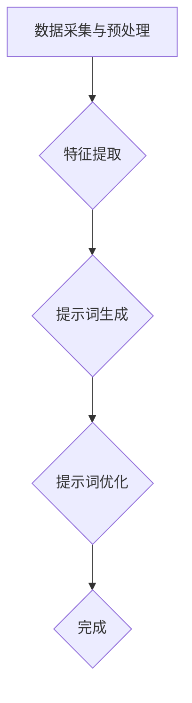
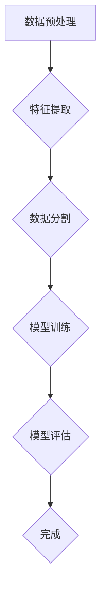

                 

# 文章标题：提示词驱动的AI应用开发新思路

## 关键词
AI应用开发、提示词、自然语言处理、深度学习、优化策略

## 摘要
本文将探讨提示词驱动的AI应用开发新思路，介绍提示词在AI应用中的作用，解析其核心概念与技术原理，并通过实战案例展示其应用效果。文章旨在为读者提供一条清晰、可行的AI应用开发路径，助力人工智能领域的创新与实践。

### 1. AI应用开发概述

#### 1.1 AI应用的发展与趋势
随着人工智能技术的快速发展，AI应用在各个领域得到广泛应用，从工业自动化到医疗诊断，从智能家居到智能交通，AI技术正在深刻改变我们的生活方式。提示词驱动的AI应用作为一种新型的开发模式，以其高效、灵活的特点，正在成为AI应用开发的新趋势。

#### 1.2 提示词在AI应用中的作用
提示词在AI应用中扮演着至关重要的角色。它不仅是数据输入的一部分，更是指导AI模型决策的重要参考。一个优秀的提示词能够提高模型的准确性和效率，降低误判率，从而提升AI应用的性能。

#### 1.3 提示词驱动的AI应用架构
提示词驱动的AI应用架构通常包括数据采集与预处理、提示词生成与优化、AI模型训练与部署等模块。这些模块相互协作，共同实现高效的AI应用。

### 2. 核心概念与技术原理

#### 2.1 提示词生成与优化技术
提示词生成与优化技术是提示词驱动的AI应用的核心。首先，我们需要对输入数据进行分析，提取关键特征，生成初步的提示词。然后，通过优化策略，对提示词进行进一步优化，提高其质量。

**Mermaid 流程图：**


**伪代码：**
```python
def generate_and_optimize_prompt(data):
    # 特征提取
    features = extract_features(data)
    
    # 提示词生成
    prompt = generate_prompt(features)
    
    # 提示词优化
    optimized_prompt = optimize_prompt(prompt)
    
    return optimized_prompt
```

#### 2.2 AI模型的选择与调优
AI模型的选择与调优是提示词驱动的AI应用的关键环节。我们需要根据应用场景选择合适的模型，并通过调优提高模型的性能。

**伪代码：**
```python
def select_and_tune_model(application_context):
    # 选择模型
    model = select_best_model(application_context)
    
    # 调优模型
    tuned_model = tune_model(model, application_context)
    
    return tuned_model
```

#### 2.3 数据处理与模型训练
数据处理与模型训练是提示词驱动的AI应用的基础。我们需要对输入数据进行处理，提取有用信息，并将其用于模型训练。

**Mermaid 流程图：**


### 3. 实战案例与项目应用

#### 3.1 提示词驱动的AI应用实例
在本节中，我们将通过一个实际案例，展示提示词驱动的AI应用的开发过程。该案例将涵盖数据采集、提示词生成与优化、AI模型选择与调优、模型训练与部署等环节。

#### 3.2 项目实战：构建提示词驱动的AI系统
在本节中，我们将详细介绍如何构建一个提示词驱动的AI系统。首先，我们需要进行需求分析，明确系统的功能需求和技术要求。然后，设计系统架构，选择合适的模型和算法，并进行模型训练和优化。最后，部署系统，并进行性能评估和优化。

#### 3.3 评估与优化：提升AI应用性能
在AI应用开发过程中，评估和优化是不可或缺的环节。我们需要对AI系统的性能进行评估，找出性能瓶颈，并采取相应的优化措施。以下是一些常用的评估和优化策略：

- **性能评估指标**：准确率、召回率、F1值等。
- **优化策略**：调整模型参数、增加训练数据、使用更先进的算法等。

### 4. 未来展望与挑战

#### 4.1 提示词驱动的AI应用前景
随着人工智能技术的不断进步，提示词驱动的AI应用将在更多领域得到应用，如智能客服、智能医疗、智能教育等。未来，提示词驱动的AI应用将更加智能化、个性化，为人类带来更多的便利。

#### 4.2 面临的挑战与解决方案
尽管提示词驱动的AI应用前景广阔，但仍然面临许多挑战。以下是一些主要挑战及其解决方案：

- **数据隐私与安全**：加强数据安全防护，确保用户数据的安全。
- **算法透明性与可解释性**：提高算法的透明性和可解释性，增强用户对AI应用的信任。
- **跨领域应用**：加强不同领域之间的合作，推动AI技术的跨领域应用。

### 5. 总结与展望
本文从提示词驱动的AI应用开发新思路出发，介绍了其核心概念、技术原理、实战案例等。通过本文的阅读，读者可以了解到提示词驱动的AI应用开发的方法和技巧，为人工智能领域的创新与实践提供指导。

**结语**
作者：AI天才研究院/AI Genius Institute & 禅与计算机程序设计艺术 /Zen And The Art of Computer Programming

[END]

