                 


### 1.1 AI与提示词概述

人工智能（Artificial Intelligence，简称AI）作为计算机科学的一个分支，旨在使计算机能够执行通常需要人类智能才能完成的任务，如视觉识别、语音识别、决策制定和语言翻译等。AI的发展经历了数个阶段，从早期的规则驱动系统，到知识驱动系统，再到数据驱动系统，如今已经进入了AI大模型时代。

**1.1.1 AI发展简史**

1. **规则驱动系统**：早期AI的研究主要集中在构建能够执行特定任务的规则系统，如专家系统和逻辑编程。这种系统依赖于一组预定义的规则来处理输入数据并做出决策。

   ```mermaid
   graph TD
   A[规则驱动系统] --> B(专家系统)
   A --> C(逻辑编程)
   ```

2. **知识驱动系统**：随着知识的积累，AI开始引入知识库和推理机制，以处理更加复杂的任务。知识驱动系统通过存储大量的领域知识，并通过推理机来应用这些知识进行决策。

   ```mermaid
   graph TD
   D[知识驱动系统]
   D --> E(知识库)
   D --> F(推理机)
   ```

3. **数据驱动系统**：在21世纪初，随着计算能力和数据存储技术的飞速发展，数据驱动系统成为主流。这些系统通过从大量数据中学习模式来改进其性能，不再依赖于手工编写的规则或知识库。

   ```mermaid
   graph TD
   G[数据驱动系统]
   G --> H(大数据)
   G --> I(机器学习)
   ```

4. **AI大模型时代**：近年来，深度学习和大型神经网络的兴起，使得AI进入了一个全新的阶段。这些大模型能够处理海量的数据，并在各种任务上实现前所未有的性能。

   ```mermaid
   graph TD
   J[AI大模型时代]
   J --> K(深度学习)
   J --> L(神经网络)
   ```

**1.1.2 提示词的概念**

提示词（Prompt）是AI模型在处理输入时接收的引导性信息。与传统的数据输入不同，提示词通常包含了关于任务的上下文信息，能够引导模型做出更加准确的预测或决策。

- **定义**：提示词是用于启动AI模型执行特定任务的文本或代码片段。它可以是一个简单的关键词，也可以是一个完整的句子或段落。

  ```latex
  \text{提示词} = \text{启动AI模型执行任务的引导信息}
  ```

- **作用**：提示词能够为模型提供额外的上下文信息，帮助模型更好地理解任务，从而提高其性能。

  ```mermaid
  graph TD
  M[提示词] --> N[模型]
  N --> O[上下文信息]
  ```

- **与自然语言处理的关系**：在自然语言处理（NLP）领域，提示词尤为重要。通过设计恰当的提示词，可以提高文本分类、情感分析、问答系统等任务的性能。

  ```mermaid
  graph TD
  P[NLP] --> Q[文本分类]
  P --> R[情感分析]
  P --> S[问答系统]
  ```

**1.1.3 提示词驱动的AI优势**

提示词驱动的AI开发方法相较于传统的数据驱动方法，具有以下优势：

- **提升模型性能**：通过为模型提供额外的上下文信息，提示词可以帮助模型更好地理解任务，从而提高其性能。

- **提高开发效率**：提示词可以简化模型训练和调优的过程，使得开发人员能够更快地实现和部署AI应用。

- **应对复杂性问题**：在处理复杂任务时，提示词能够为模型提供更加精确的引导，使其能够更好地应对复杂的问题。

  ```mermaid
  graph TD
  T[提升模型性能] --> U[提高开发效率]
  T --> V[应对复杂性问题]
  ```

### 总结

在本节中，我们简要回顾了AI的发展历程，介绍了提示词的概念及其作用，并探讨了提示词驱动的AI开发方法的优势。在下一节中，我们将深入探讨提示词驱动的AI架构，包括硬件与软件支持、计算模型和数据管理等内容。

---

在接下来的部分，我们将详细讨论提示词驱动的AI架构，包括其硬件与软件支持、计算模型以及数据管理等方面的内容。通过逐步分析这些核心概念，我们将构建一个全面的框架，为后续的应用实战和未来展望打下坚实的基础。

## 1.2 提示词驱动的AI架构

### 1.2.1 硬件与软件支持

提示词驱动的AI架构需要强大的硬件和软件支持，以确保模型的高效训练和应用。以下是硬件与软件支持的详细说明：

**硬件架构**

- **计算资源**：提示词驱动的AI模型通常需要大量的计算资源。GPU（图形处理单元）和TPU（张量处理单元）等专用硬件能够显著加速模型的训练过程。

  ```mermaid
  graph TD
  A[计算资源] --> B[GPU]
  A --> C[TPU]
  ```

- **存储设备**：AI模型和数据集通常需要大量的存储空间。分布式存储系统如HDFS（Hadoop分布式文件系统）和对象存储系统如Amazon S3可以提供高效的数据存储解决方案。

  ```mermaid
  graph TD
  D[存储设备] --> E[HDFS]
  D --> F[Amazon S3]
  ```

**软件架构**

- **AI框架**：提示词驱动的AI架构依赖于各种AI框架，如TensorFlow、PyTorch和MXNet等。这些框架提供了丰富的API，支持从模型设计到训练和部署的全过程。

  ```mermaid
  graph TD
  G[AI框架] --> H[TensorFlow]
  G --> I[PyTorch]
  G --> J[MXNet]
  ```

- **开发工具**：为了提高开发效率，提示词驱动的AI架构还需要各种开发工具的支持，如Jupyter Notebook、Google Colab和PyCharm等。这些工具提供了交互式编程环境，便于开发者进行模型开发和实验。

  ```mermaid
  graph TD
  K[开发工具] --> L[Jupyter Notebook]
  K --> M[Google Colab]
  K --> N[PyCharm]
  ```

**硬件与软件的协同优化**

- **协同优化策略**：为了最大化硬件资源的利用效率，硬件与软件之间的协同优化至关重要。通过使用混合精度训练、分布式训练和数据并行等技术，可以显著提高训练速度和性能。

  ```mermaid
  graph TD
  O[协同优化策略] --> P[混合精度训练]
  O --> Q[分布式训练]
  O --> R[数据并行]
  ```

### 1.2.2 计算模型

提示词驱动的AI计算模型是架构的核心部分，决定了模型的学习能力和性能。以下是计算模型的详细描述：

**神经网络模型**

- **基本结构**：神经网络是AI计算模型的基础，由多个层组成，包括输入层、隐藏层和输出层。通过反向传播算法，神经网络能够从输入数据中学习特征并做出预测。

  ```mermaid
  graph TD
  S[输入层] --> T[隐藏层]
  T --> U[输出层]
  ```

- **优化方法**：为了提高模型的性能，需要不断优化神经网络的结构和参数。常用的优化方法包括梯度下降、动量优化和Adam优化等。

  ```mermaid
  graph TD
  V[优化方法] --> W[梯度下降]
  V --> X[动量优化]
  V --> Y[Adam优化]
  ```

**提示词在计算模型中的应用**

- **上下文嵌入**：提示词可以通过嵌入层（Embedding Layer）被整合到神经网络模型中。嵌入层将提示词转换为固定长度的向量，与输入数据一起作为模型的输入。

  ```mermaid
  graph TD
  Z[提示词] --> AA[嵌入层]
  AA --> BB[神经网络模型]
  ```

- **提示词引导的注意力机制**：在自然语言处理任务中，注意力机制能够使模型更加关注重要的提示词信息。通过设计特殊的注意力机制，可以进一步提高模型的性能。

  ```mermaid
  graph TD
  CC[注意力机制] --> DD[提示词引导]
  CC --> EE[性能提升]
  ```

### 1.2.3 数据管理

数据管理是提示词驱动AI架构的重要组成部分，包括数据清洗、标注和预处理等环节。以下是数据管理的详细说明：

**数据清洗**

- **去噪与缺失值处理**：在数据采集过程中，不可避免地会出现噪声和缺失值。通过去噪和缺失值处理，可以显著提高数据质量。

  ```mermaid
  graph TD
  FF[数据清洗] --> GG[去噪]
  FF --> HH[缺失值处理]
  ```

**数据标注**

- **手工标注与自动标注**：在训练模型之前，需要对数据集进行标注。手工标注虽然准确，但成本高昂。自动标注技术（如半监督学习和迁移学习）可以显著降低标注成本。

  ```mermaid
  graph TD
  II[数据标注] --> JJ[手工标注]
  II --> KK[自动标注]
  ```

**数据处理流程**

- **批量处理与并行处理**：为了提高数据处理效率，可以采用批量处理和并行处理技术。通过分布式计算框架，可以实现对大规模数据集的高效处理。

  ```mermaid
  graph TD
  LL[数据处理流程] --> MM[批量处理]
  LL --> NN[并行处理]
  ```

### 总结

在本节中，我们详细介绍了提示词驱动的AI架构，包括硬件与软件支持、计算模型和数据管理等方面的内容。通过协同优化策略和先进的计算模型，提示词驱动的AI架构能够高效地处理复杂任务。在下一节中，我们将进一步探讨提示词驱动的AI应用场景，展示其在实际任务中的表现和优势。

---

通过以上对背景与核心概念、提示词驱动的AI架构的详细探讨，我们为后续的应用实战和未来展望奠定了坚实的基础。接下来，我们将进入下一部分，讨论提示词驱动的AI在不同应用场景中的具体应用和实践，进一步展示其广泛的应用前景和实际效果。

## 1.3 提示词驱动的AI应用场景

提示词驱动的AI在多个领域展现了其强大的应用潜力，从语音识别到自然语言处理，再到图像识别，都在不同程度上提高了任务的效率和准确性。以下是对这些应用场景的详细探讨。

### 1.3.1 语音识别

语音识别（Automatic Speech Recognition，ASR）是将语音信号转换为文本的技术。提示词驱动的方法能够显著提高语音识别的准确性和鲁棒性。

**技术细节**

- **语音信号处理**：首先，需要对语音信号进行预处理，包括噪声过滤、增强语音信号等步骤，以提高信号的清晰度。

  ```mermaid
  graph TD
  A[语音信号处理] --> B[噪声过滤]
  A --> C[增强语音信号]
  ```

- **语音识别算法**：常用的语音识别算法包括隐马尔可夫模型（HMM）、循环神经网络（RNN）和深度神经网络（DNN）。通过使用提示词，可以在训练过程中提供上下文信息，从而提高识别准确性。

  ```mermaid
  graph TD
  D[语音识别算法] --> E[HMM]
  D --> F[RNN]
  D --> G[DNN]
  ```

**提示词应用**

- **上下文引导**：提示词可以帮助模型更好地理解会话的上下文，从而提高识别准确性。例如，在对话系统中，提示词可以包括用户的历史提问和回答。

  ```mermaid
  graph TD
  H[提示词] --> I[上下文引导]
  H --> J[识别准确性提升]
  ```

**实际效果**

- **案例研究**：在智能客服中，提示词驱动的语音识别系统能够更好地理解用户的问题，并提供准确的回答。例如，在电信客服中，系统可以通过分析用户的历史通话记录，为用户提供个性化的服务。

### 1.3.2 自然语言处理

自然语言处理（Natural Language Processing，NLP）是AI的一个重要领域，涉及文本的生成、理解和处理。提示词驱动的方法在NLP任务中发挥了重要作用。

**技术细节**

- **文本分类**：提示词可以帮助模型更好地理解文本的上下文，从而提高分类的准确性。例如，在新闻分类中，提示词可以包括新闻标题和摘要。

  ```mermaid
  graph TD
  K[文本分类] --> L[提示词引导]
  ```

- **情感分析**：通过使用提示词，模型可以更准确地判断文本的情感倾向。例如，在社交媒体分析中，提示词可以包括用户的评论和标签。

  ```mermaid
  graph TD
  M[情感分析] --> N[提示词引导]
  ```

- **问答系统**：提示词可以帮助模型更好地理解用户的问题，并提供准确的答案。例如，在智能助手系统中，提示词可以包括用户的问题和上下文信息。

  ```mermaid
  graph TD
  O[问答系统] --> P[提示词引导]
  ```

**提示词应用**

- **上下文扩展**：提示词不仅可以提供当前的上下文信息，还可以扩展上下文，帮助模型更好地理解文本。例如，在对话生成中，提示词可以扩展到对话的历史记录。

  ```mermaid
  graph TD
  Q[上下文扩展] --> R[对话生成]
  ```

**实际效果**

- **案例研究**：在电商平台上，提示词驱动的NLP系统能够更好地理解用户评论，提供个性化推荐。例如，系统可以通过分析用户的购物历史和评论，推荐用户可能感兴趣的商品。

### 1.3.3 图像识别

图像识别（Image Recognition）是将图像中的对象、场景或内容识别为具体类别的一种技术。提示词驱动的方法在图像识别任务中也展现了其优势。

**技术细节**

- **图像预处理**：在图像识别之前，需要对图像进行预处理，包括图像增强、尺寸调整等步骤，以提高图像的质量和识别效果。

  ```mermaid
  graph TD
  S[图像预处理] --> T[图像增强]
  S --> U[尺寸调整]
  ```

- **图像识别算法**：常用的图像识别算法包括卷积神经网络（CNN）和生成对抗网络（GAN）。通过使用提示词，可以提供更具体的识别目标，从而提高识别准确性。

  ```mermaid
  graph TD
  V[图像识别算法] --> W[CNN]
  V --> X[GAN]
  ```

**提示词应用**

- **目标引导**：提示词可以帮助模型更准确地识别图像中的目标。例如，在医学图像分析中，提示词可以包括病变部位的名称和位置。

  ```mermaid
  graph TD
  Y[目标引导] --> Z[图像识别]
  ```

**实际效果**

- **案例研究**：在自动驾驶领域，提示词驱动的图像识别系统能够更好地识别道路标志、交通信号灯和行人。例如，系统可以通过分析摄像头捕捉到的图像，提前预警潜在的交通事故。

### 总结

通过以上对语音识别、自然语言处理和图像识别三个应用场景的详细探讨，我们可以看到提示词驱动的方法在AI任务中的广泛应用和显著优势。在下一部分，我们将进一步深入探讨提示词驱动的AI的核心技术原理，包括提示词生成算法、提示词优化策略以及AI模型等内容。

---

在上一部分中，我们探讨了提示词驱动的AI在不同应用场景中的具体应用和实践。本节将深入探讨提示词驱动的AI的核心技术原理，包括提示词生成算法、提示词优化策略以及AI模型等内容。通过这些核心技术的详细分析，我们将更好地理解提示词驱动AI的运作机制和应用潜力。

### 2.1 提示词生成算法

提示词生成算法是提示词驱动的AI开发的关键环节，其目的是根据特定任务的需求生成有效的提示词。以下是几种常见的提示词生成算法的介绍。

#### 2.1.1 传统生成算法

**1. 基于规则的方法**

基于规则的方法通过预定义的规则生成提示词。这种方法简单直观，但灵活性较低，难以应对复杂多变的应用场景。

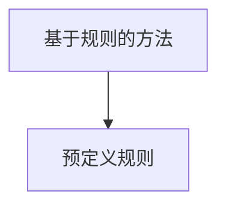

**2. 随机生成方法**

随机生成方法通过随机生成提示词，以覆盖尽可能多的可能性。这种方法虽然简单，但生成的提示词可能缺乏针对性，导致模型性能不稳定。

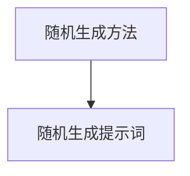

#### 2.1.2 现代生成算法

**1. 基于机器学习的方法**

基于机器学习的方法通过训练模型来生成提示词。这种方法具有较高的灵活性和准确性，但需要大量的数据和计算资源。

**a. 序列到序列模型（Seq2Seq）**

序列到序列模型是一种常用的生成算法，通过编码器和解码器将输入序列转换为输出序列。

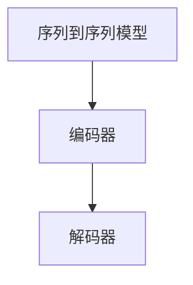

**b. 生成对抗网络（GAN）**

生成对抗网络通过训练生成器和判别器，使生成器生成的提示词尽量接近真实提示词。这种方法在生成高质量提示词方面具有显著优势。

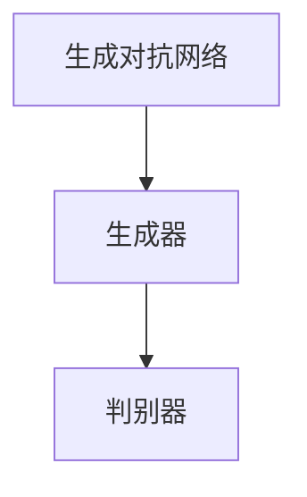

**c. 自注意力机制（Self-Attention）**

自注意力机制是一种先进的生成算法，通过关注输入序列中的重要信息来生成高质量的提示词。

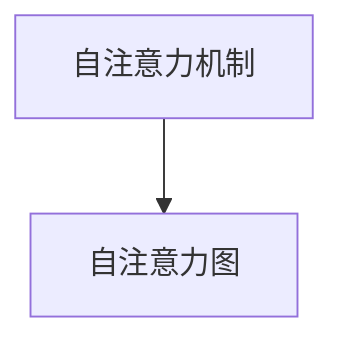

#### 2.1.3 提示词生成算法的应用场景

**1. 自然语言处理**

在自然语言处理任务中，提示词生成算法可用于生成文本摘要、对话系统、机器翻译等。

**2. 语音识别**

在语音识别任务中，提示词生成算法可用于生成语音信号对应的文本，提高识别准确性。

**3. 图像识别**

在图像识别任务中，提示词生成算法可用于生成图像描述、标签等，帮助模型更好地理解图像内容。

### 2.2 提示词优化策略

提示词优化策略是提升AI模型性能的重要手段。以下介绍几种常用的优化策略。

#### 2.2.1 基于梯度的优化

**1. 梯度下降算法**

梯度下降算法是一种基本的优化方法，通过调整模型参数来最小化损失函数。

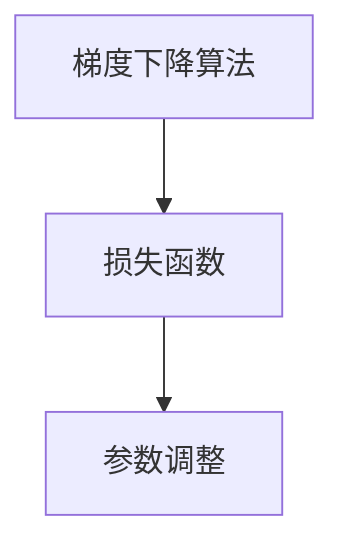

**2. 随机梯度下降（SGD）**

随机梯度下降是对梯度下降算法的一种改进，通过随机选择样本更新参数，以提高模型的泛化能力。

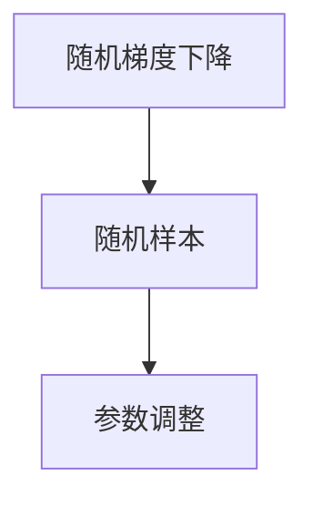

**3. 动量优化**

动量优化通过引入动量因子，使参数更新方向更加稳定，避免陷入局部最小值。

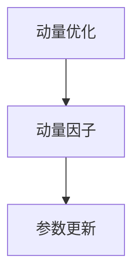

#### 2.2.2 基于强化学习的优化

**1. Q学习**

Q学习是一种基于值函数的优化方法，通过更新Q值来调整策略。

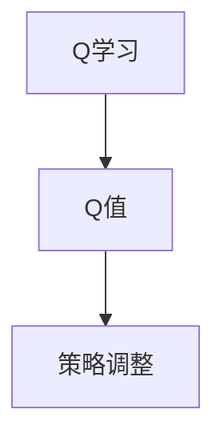

**2. 模仿学习**

模仿学习通过模仿专家的行为来优化模型。在提示词优化中，可以训练模型模仿人类专家生成的提示词。

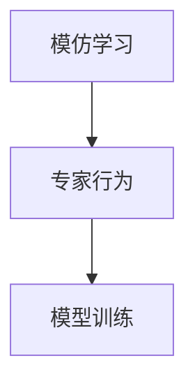

#### 2.2.3 提示词质量评估

提示词质量评估是确保生成提示词有效性的重要环节。以下介绍几种常用的评估方法。

**1. 人工评估**

人工评估通过专家对生成的提示词进行评价，以确定其有效性。

**2. 自动评估**

自动评估通过计算生成提示词与预期提示词的相似度，评估其质量。

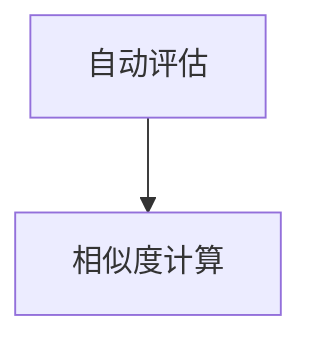

**3. 多样性评估**

多样性评估通过评估生成提示词的多样性，确保模型能够应对各种应用场景。

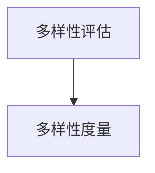

### 总结

通过介绍提示词生成算法和优化策略，我们了解了提示词驱动AI的核心技术原理。在下一部分，我们将进一步探讨提示词驱动的AI模型，包括神经网络架构、模型训练与优化等内容，以全面解析提示词驱动AI的开发和应用。

---

在上一部分中，我们详细介绍了提示词生成算法和优化策略，为提示词驱动的AI模型奠定了坚实的基础。本部分将重点探讨提示词驱动的AI模型，包括神经网络架构、模型训练与优化等内容，深入解析提示词在模型中的具体应用。

### 2.3 提示词驱动的AI模型

#### 2.3.1 神经网络架构

神经网络是AI模型的核心组成部分，特别是深度学习模型在处理复杂数据方面表现出色。提示词驱动的AI模型通常采用以下几种神经网络架构：

**1. 卷积神经网络（CNN）**

卷积神经网络是一种常用于图像识别的神经网络架构，其核心在于通过卷积层提取图像特征。

**a. 卷积层**

卷积层通过卷积运算提取图像特征。

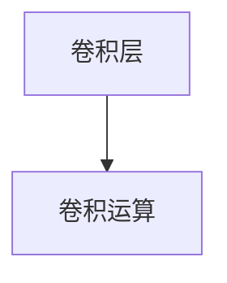

**b. 池化层**

池化层用于降低特征图的维度，提高模型鲁棒性。

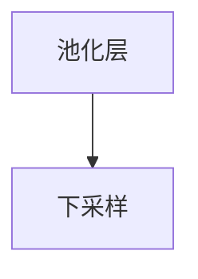

**2. 循环神经网络（RNN）**

循环神经网络是一种常用于处理序列数据的神经网络架构，其核心在于通过循环连接来处理序列信息。

**a. 隐藏层**

隐藏层通过递归连接处理序列数据。

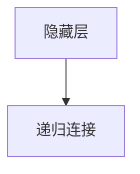

**b. 门控层**

门控层通过门控机制控制信息的流动，提高模型性能。

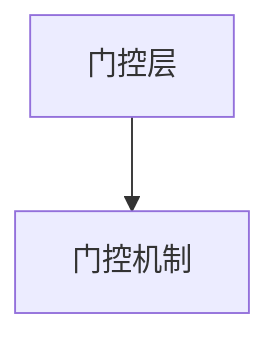

**3. 生成对抗网络（GAN）**

生成对抗网络是一种由生成器和判别器组成的神经网络架构，其核心在于通过对抗训练生成高质量的数据。

**a. 生成器**

生成器通过生成虚假数据与真实数据竞争。

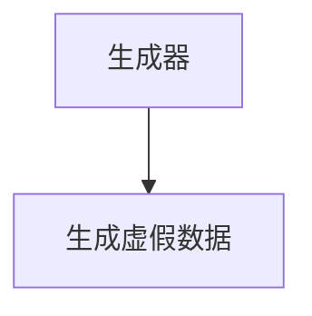

**b. 判别器**

判别器通过判断数据是真实还是虚假来训练生成器。

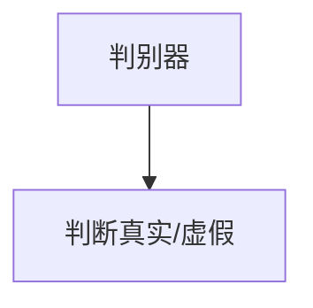

#### 2.3.2 模型训练与优化

**1. 数据预处理**

在模型训练之前，需要对数据进行预处理，包括数据清洗、归一化、分割等步骤。

**a. 数据清洗**

数据清洗通过去除噪声和缺失值，提高数据质量。

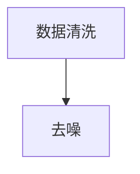

**b. 数据归一化**

数据归一化通过调整数据范围，提高模型训练效率。

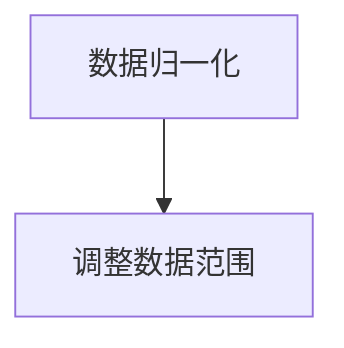

**2. 模型训练**

模型训练通过迭代优化模型参数，使模型能够更好地拟合训练数据。

**a. 损失函数**

损失函数用于衡量模型预测值与真实值之间的差距。

```mermaid
graph TD
Q[损失函数] --> R[差距衡量]
```

**b. 优化算法**

优化算法用于调整模型参数，以最小化损失函数。

```mermaid
graph TD
S[优化算法] --> T[参数调整]
```

**3. 模型优化**

模型优化通过调整模型结构或参数，提高模型性能。

**a. 网络结构优化**

网络结构优化通过调整网络层数或神经元数量，提高模型表达能力。

```mermaid
graph TD
U[网络结构优化] --> V[调整网络层数/神经元数量]
```

**b. 参数优化**

参数优化通过调整学习率、正则化参数等，提高模型泛化能力。

```mermaid
graph TD
W[参数优化] --> X[调整学习率/正则化参数]
```

#### 2.3.3 提示词在模型中的应用

**1. 提示词嵌入**

提示词嵌入通过将提示词转换为固定长度的向量，作为模型的输入。

```mermaid
graph TD
Y[提示词嵌入] --> Z[向量表示]
```

**2. 提示词引导的注意力机制**

提示词引导的注意力机制通过关注提示词中的关键信息，提高模型对任务的感知能力。

```mermaid
graph TD
AA[提示词引导的注意力机制] --> BB[关键信息关注]
```

**3. 提示词质量评估**

提示词质量评估通过评估提示词的有效性，指导模型优化。

```mermaid
graph TD
CC[提示词质量评估] --> DD[有效性评估]
```

### 总结

通过本部分的介绍，我们详细探讨了提示词驱动的AI模型，包括神经网络架构、模型训练与优化等内容。提示词在模型中的应用不仅提高了模型的学习能力和性能，还显著提升了任务的准确性和效率。在下一部分中，我们将通过实际案例展示提示词驱动的AI应用，进一步验证其优势和应用潜力。

---

在上一部分中，我们详细介绍了提示词驱动的AI模型，包括神经网络架构、模型训练与优化等内容。本部分将通过实际案例展示提示词驱动的AI应用，进一步验证其优势和应用潜力。

### 3.1 提示词驱动的AI应用案例

**3.1.1 案例一：智能客服**

智能客服是提示词驱动的AI应用的一个典型例子。通过使用提示词，智能客服系统能够更好地理解用户的问题，并提供准确的回答。

**应用背景**

随着互联网和电子商务的快速发展，企业需要提供高效的客户服务，以满足用户的需求。传统的客户服务模式已无法满足日益增长的服务需求，因此智能客服成为了一个热门的研究方向。

**解决方案**

- **提示词生成**：系统通过分析用户的历史提问和回答，生成相应的提示词。这些提示词包括用户常用的关键词、问题类型和上下文信息。

  ```mermaid
  graph TD
  A[用户提问] --> B[历史数据]
  B --> C[提示词生成]
  ```

- **模型训练与优化**：智能客服系统使用基于提示词的神经网络模型进行训练。模型通过学习大量的历史数据，提高了对用户问题的理解能力。

  ```mermaid
  graph TD
  D[历史数据] --> E[神经网络模型]
  E --> F[模型训练]
  ```

- **应用效果**：通过使用提示词驱动的AI模型，智能客服系统能够快速响应用户提问，提供准确的答案，提高了客户满意度和服务效率。

  ```mermaid
  graph TD
  G[智能客服系统] --> H[快速响应]
  G --> I[准确回答]
  ```

**3.1.2 案例二：自动驾驶**

自动驾驶是另一个典型的提示词驱动的AI应用场景。通过使用提示词，自动驾驶系统能够更好地理解道路状况，做出准确的驾驶决策。

**应用背景**

随着自动驾驶技术的发展，自动驾驶汽车成为了一个热门的研究领域。自动驾驶汽车需要在复杂的环境中自主驾驶，确保行驶安全。

**解决方案**

- **提示词生成**：系统通过分析道路标志、交通信号灯和周围环境，生成相应的提示词。这些提示词包括道路标志的名称、颜色和形状，以及交通信号灯的状态。

  ```mermaid
  graph TD
  J[道路标志] --> K[提示词生成]
  L[交通信号灯] --> K
  ```

- **模型训练与优化**：自动驾驶系统使用基于提示词的深度学习模型进行训练。模型通过学习大量的道路标志和交通信号灯数据，提高了对道路状况的理解能力。

  ```mermaid
  graph TD
  M[道路标志数据] --> N[深度学习模型]
  O[交通信号灯数据] --> N
  ```

- **应用效果**：通过使用提示词驱动的AI模型，自动驾驶系统能够实时分析道路状况，做出准确的驾驶决策，提高了行驶安全性和效率。

  ```mermaid
  graph TD
  P[自动驾驶系统] --> Q[实时分析]
  P --> R[准确驾驶决策]
  ```

**3.1.3 案例三：智能医疗诊断**

智能医疗诊断是另一个典型的提示词驱动的AI应用场景。通过使用提示词，智能医疗诊断系统能够更好地分析医学影像，提高诊断准确率。

**应用背景**

医疗诊断是一个复杂且高风险的任务，传统的诊断方法往往依赖于医生的经验和判断。随着AI技术的发展，智能医疗诊断成为了一个热门的研究领域。

**解决方案**

- **提示词生成**：系统通过分析医学影像数据，生成相应的提示词。这些提示词包括影像的部位、病变的类型和程度。

  ```mermaid
  graph TD
  S[医学影像数据] --> T[提示词生成]
  ```

- **模型训练与优化**：智能医疗诊断系统使用基于提示词的卷积神经网络模型进行训练。模型通过学习大量的医学影像数据，提高了对病变部位和类型的识别能力。

  ```mermaid
  graph TD
  U[医学影像数据] --> V[卷积神经网络模型]
  ```

- **应用效果**：通过使用提示词驱动的AI模型，智能医疗诊断系统能够快速分析医学影像，提高诊断准确率，为医生提供可靠的诊断支持。

  ```mermaid
  graph TD
  W[智能医疗诊断系统] --> X[快速分析]
  W --> Y[准确诊断]
  ```

### 总结

通过以上三个案例，我们可以看到提示词驱动的AI在智能客服、自动驾驶和智能医疗诊断等领域的广泛应用和显著优势。提示词驱动的AI不仅提高了任务的效率和准确性，还降低了人力成本，为各个行业带来了巨大的变革和创新。在下一部分中，我们将进一步讨论开发流程与工具链，以及性能优化与调参等关键环节。

---

在上一部分中，我们通过实际案例展示了提示词驱动的AI应用，验证了其在多个领域的广泛应用和优势。本部分将深入探讨AI应用开发的关键环节，包括开发环境搭建、数据准备、模型训练与部署，以及性能优化与调参等。通过详细讲解这些环节，我们将帮助开发者更好地理解和实践提示词驱动的AI应用开发。

### 3.2 开发流程与工具链

提示词驱动的AI应用开发涉及多个环节，从环境搭建、数据准备到模型训练与部署，每个环节都需要精心设计和优化。以下是这些环节的详细讲解。

#### 3.2.1 环境搭建

环境搭建是开发流程的第一步，确保开发者在合适的硬件和软件环境中进行开发。以下是环境搭建的步骤和工具：

**1. 硬件配置**

- **GPU计算资源**：由于提示词驱动的AI模型通常需要大量的计算资源，建议使用高性能的GPU，如NVIDIA的RTX 3080或RTX 3090。

  ```mermaid
  graph TD
  A[GPU配置] --> B[NVIDIA RTX 3080]
  A --> C[NVIDIA RTX 3090]
  ```

- **CPU计算资源**：除了GPU，还需要配置高性能的CPU，如Intel Xeon系列或AMD Ryzen系列，以确保模型训练和推理的效率。

  ```mermaid
  graph TD
  D[CPU配置] --> E[Intel Xeon]
  D --> F[AMD Ryzen]
  ```

**2. 软件环境**

- **操作系统**：建议使用Linux操作系统，如Ubuntu 20.04或CentOS 8，以确保兼容性和稳定性。

  ```mermaid
  graph TD
  G[操作系统] --> H[Ubuntu 20.04]
  G --> I[CentOS 8]
  ```

- **深度学习框架**：常用的深度学习框架包括TensorFlow、PyTorch和PyTorch Lightning。选择合适的框架可以根据开发需求和项目特点。

  ```mermaid
  graph TD
  J[深度学习框架] --> K[TensorFlow]
  J --> L[PyTorch]
  J --> M[PyTorch Lightning]
  ```

- **开发工具**：使用Jupyter Notebook或Google Colab等交互式开发工具，可以提高开发效率和代码的可读性。

  ```mermaid
  graph TD
  N[开发工具] --> O[Jupyter Notebook]
  N --> P[Google Colab]
  ```

**3. 环境配置**

- **环境配置脚本**：使用Docker或Conda等容器化工具，可以简化环境配置过程，确保环境的一致性和可重复性。

  ```mermaid
  graph TD
  Q[环境配置] --> R[Docker]
  Q --> S[Conda]
  ```

#### 3.2.2 数据准备

数据准备是AI应用开发的关键环节，直接影响到模型的性能和效果。以下是数据准备的步骤和技巧：

**1. 数据采集**

- **数据源**：根据应用场景选择合适的数据源，如公开数据集、企业内部数据或第三方数据服务。

  ```mermaid
  graph TD
  T[数据源] --> U[公开数据集]
  T --> V[企业内部数据]
  T --> W[第三方数据服务]
  ```

- **数据采集工具**：使用Web scraping、API调用或手动采集等方法获取数据。

  ```mermaid
  graph TD
  X[数据采集工具] --> Y[Web scraping]
  X --> Z[API调用]
  X --> AA[手动采集]
  ```

**2. 数据清洗**

- **去噪与缺失值处理**：去除数据中的噪声和缺失值，确保数据质量。

  ```mermaid
  graph TD
  BB[数据清洗] --> CC[去噪]
  BB --> DD[缺失值处理]
  ```

- **数据标准化**：对数据进行标准化处理，使其符合模型的输入要求。

  ```mermaid
  graph TD
  EE[数据标准化] --> FF[归一化]
  EE --> GG[标准化]
  ```

**3. 数据标注**

- **手工标注与自动标注**：根据数据类型和标注需求，选择手工标注或自动标注方法。

  ```mermaid
  graph TD
  HH[数据标注] --> II[手工标注]
  HH --> JJ[自动标注]
  ```

- **标注工具**：使用标注工具如LabelImg、VGG Image Annotator等，提高标注效率。

  ```mermaid
  graph TD
  KK[标注工具] --> LL[LabelImg]
  KK --> MM[VGG Image Annotator]
  ```

**4. 数据预处理**

- **特征提取**：从原始数据中提取有用的特征，为模型训练做准备。

  ```mermaid
  graph TD
  NN[特征提取] --> OO[文本特征]
  NN --> PP[图像特征]
  ```

- **数据集分割**：将数据集分为训练集、验证集和测试集，用于模型训练、验证和测试。

  ```mermaid
  graph TD
  QQ[数据集分割] --> RR[训练集]
  QQ --> SS[验证集]
  QQ --> TT[测试集]
  ```

#### 3.2.3 模型训练与部署

模型训练与部署是AI应用开发的核心环节，直接决定应用的性能和效果。以下是模型训练与部署的详细步骤：

**1. 模型设计**

- **神经网络架构**：设计合适的神经网络架构，包括输入层、隐藏层和输出层。

  ```mermaid
  graph TD
  UU[模型设计] --> VV[输入层]
  VV --> WW[隐藏层]
  WW --> XX[输出层]
  ```

- **损失函数与优化器**：选择合适的损失函数和优化器，以最小化模型损失。

  ```mermaid
  graph TD
  YY[损失函数] --> ZZ[交叉熵损失]
  YY --> AA[均方误差损失]
  ```

**2. 模型训练**

- **训练过程**：使用训练数据集对模型进行训练，通过迭代优化模型参数。

  ```mermaid
  graph TD
  BB[模型训练] --> CC[迭代过程]
  ```

- **验证与测试**：使用验证集和测试集对模型进行验证和测试，评估模型性能。

  ```mermaid
  graph TD
  DD[验证与测试] --> EE[验证集]
  DD --> FF[测试集]
  ```

**3. 模型部署**

- **模型导出**：将训练好的模型导出为可部署的格式，如TensorFlow SavedModel或PyTorch Model。

  ```mermaid
  graph TD
  GG[模型导出] --> HH[TensorFlow SavedModel]
  GG --> II[PyTorch Model]
  ```

- **部署工具**：使用部署工具如TensorFlow Serving、Kubernetes等，将模型部署到生产环境中。

  ```mermaid
  graph TD
  JJ[部署工具] --> KK[TensorFlow Serving]
  JJ --> LL[Kubernetes]
  ```

#### 3.2.4 性能优化与调参

性能优化与调参是提升AI模型性能的重要手段。以下介绍几种常用的性能优化方法和调参技巧：

**1. 混合精度训练**

- **策略**：使用混合精度训练（Mixed Precision Training），通过结合浮点数和整数运算，提高模型训练速度和性能。

  ```mermaid
  graph TD
  MM[混合精度训练] --> NN[浮点数运算]
  MM --> OO[整数运算]
  ```

**2. 数据并行**

- **策略**：通过数据并行（Data Parallelism），将数据集分成多个部分，同时在多个GPU上训练模型，提高训练速度。

  ```mermaid
  graph TD
  PP[数据并行] --> QQ[数据分片]
  PP --> RR[多GPU训练]
  ```

**3. 模型压缩**

- **方法**：使用模型压缩（Model Compression），通过剪枝、量化等方法减小模型大小，提高部署效率。

  ```mermaid
  graph TD
  SS[模型压缩] --> TT[剪枝]
  SS --> UU[量化]
  ```

**4. 实验设计**

- **策略**：通过实验设计（Experimental Design），系统性地调整模型参数，寻找最优参数组合。

  ```mermaid
  graph TD
  VV[实验设计] --> WW[参数调整]
  VV --> XX[性能评估]
  ```

### 总结

通过本部分的详细讲解，我们了解了提示词驱动的AI应用开发流程与工具链，包括环境搭建、数据准备、模型训练与部署，以及性能优化与调参等关键环节。这些环节不仅确保了AI应用的顺利开发，还提高了模型的性能和效果。在下一部分中，我们将深入探讨AI性能优化与调参的具体方法和策略，以进一步提升AI应用的性能。

---

在上一部分中，我们详细讲解了提示词驱动的AI应用开发流程与工具链，包括环境搭建、数据准备、模型训练与部署，以及性能优化与调参等关键环节。在这一部分，我们将深入探讨AI性能优化与调参的具体方法和策略，通过一系列详细的实例来展示如何在实际项目中提升AI模型的性能。

### 3.3 性能优化与调参

性能优化与调参是AI开发过程中不可或缺的环节，对于模型在实际应用中的表现至关重要。以下是一些常见的性能优化方法和调参策略，并结合具体实例进行讲解。

#### 3.3.1 参数调优策略

参数调优是提升模型性能的重要手段。以下是一些常用的参数调优策略：

**1. 学习率调整**

学习率是模型训练过程中的一个关键参数，其大小直接影响到模型的收敛速度和稳定性。常用的学习率调整方法包括：

- **手动调整**：通过观察模型在验证集上的性能，手动调整学习率。例如，在模型出现震荡时减小学习率，在收敛速度过慢时增大学习率。

  ```python
  # 手动调整学习率
  learning_rate = 0.1
  if model_performance_drops():
      learning_rate /= 10
  elif model_performance_improves():
      learning_rate *= 10
  ```

- **学习率调度器**：使用学习率调度器（Learning Rate Scheduler）来自动调整学习率。例如，可以使用`torch.optim.lr_scheduler`中的`StepLR`、`ExponentialLR`等调度器。

  ```python
  # 使用学习率调度器
  scheduler = torch.optim.lr_scheduler.StepLR(optimizer, step_size=30, gamma=0.1)
  for epoch in range(num_epochs):
      train(...)
      validate(...)
      scheduler.step()
  ```

**2. 正则化**

正则化（Regularization）用于防止模型过拟合。常用的正则化方法包括L1正则化、L2正则化和Dropout等。

- **L1正则化**：在损失函数中添加L1范数。

  ```python
  # L1正则化
  loss += lambda * torch.abs(W)
  ```

- **L2正则化**：在损失函数中添加L2范数。

  ```python
  # L2正则化
  loss += lambda * torch.square(W)
  ```

- **Dropout**：在训练过程中随机丢弃部分神经元。

  ```python
  # Dropout
  self.dropout = nn.Dropout(p=0.5)
  x = self.dropout(x)
  ```

**3. 批量大小调整**

批量大小（Batch Size）是模型训练过程中一个重要的超参数。较小的批量大小有助于提高模型的泛化能力，但会降低训练速度；较大的批量大小可以提高训练速度，但可能降低泛化能力。通常，可以使用以下策略调整批量大小：

- **手动调整**：根据硬件资源和训练效果手动调整批量大小。

  ```python
  # 手动调整批量大小
  batch_size = 64
  if hardware_resources_allow():
      batch_size = 128
  ```

- **自适应批量大小**：使用自适应批量大小策略，如动态调整批量大小。

  ```python
  # 自适应批量大小
  batch_size = 64
  if validation_performance_improves():
      batch_size *= 2
  elif validation_performance_decreases():
      batch_size //= 2
  ```

#### 3.3.2 性能评估指标

性能评估是判断模型性能的重要手段。以下是一些常用的性能评估指标：

**1. 准确率（Accuracy）**

准确率是模型预测正确的样本数量与总样本数量的比值。

```python
accuracy = correct_predictions / total_predictions
```

**2. 精确率与召回率（Precision and Recall）**

精确率是模型预测为正例的样本中实际为正例的比例；召回率是模型预测为正例的样本中实际为正例的比例。

```python
precision = true_positives / (true_positives + false_positives)
recall = true_positives / (true_positives + false_negatives)
```

**3. F1分数（F1 Score）**

F1分数是精确率和召回率的调和平均数。

```python
f1_score = 2 * (precision * recall) / (precision + recall)
```

**4. AUC（Area Under Curve）**

AUC是ROC曲线下的面积，用于评估二分类模型的分类能力。

```python
auc = np.trapz(fpr, tpr)
```

#### 3.3.3 实际案例解读

以下是一个实际案例，展示如何通过性能优化与调参提升AI模型的表现。

**案例：图像分类任务**

假设我们有一个图像分类任务，需要将图像分类为猫或狗。以下是模型训练和调参的详细步骤：

**1. 数据准备**

- **数据集**：使用含有猫和狗图像的数据集，例如使用CIFAR-10数据集。

- **数据预处理**：对图像进行归一化处理，将图像缩放到相同的大小。

**2. 模型设计**

- **神经网络架构**：设计一个简单的卷积神经网络，包括卷积层、池化层和全连接层。

  ```python
  class CNN(nn.Module):
      def __init__(self):
          super(CNN, self).__init__()
          self.conv1 = nn.Conv2d(3, 32, 3, padding=1)
          self.conv2 = nn.Conv2d(32, 64, 3, padding=1)
          self.fc1 = nn.Linear(64 * 6 * 6, 128)
          self.fc2 = nn.Linear(128, 2)
          self.dropout = nn.Dropout(0.5)

      def forward(self, x):
          x = self.dropout(F.relu(self.conv1(x)))
          x = self.dropout(F.relu(self.conv2(x)))
          x = F.adaptive_avg_pool2d(x, 1)
          x = torch.flatten(x, 1)
          x = self.dropout(F.relu(self.fc1(x)))
          x = self.fc2(x)
          return x
  ```

- **损失函数与优化器**：使用交叉熵损失函数和Adam优化器。

  ```python
  criterion = nn.CrossEntropyLoss()
  optimizer = torch.optim.Adam(model.parameters(), lr=0.001)
  ```

**3. 模型训练**

- **训练过程**：使用训练数据集对模型进行训练，每10个epoch后调整学习率。

  ```python
  for epoch in range(num_epochs):
      model.train()
      running_loss = 0.0
      for inputs, targets in train_loader:
          optimizer.zero_grad()
          outputs = model(inputs)
          loss = criterion(outputs, targets)
          loss.backward()
          optimizer.step()
          running_loss += loss.item()
      print(f'Epoch {epoch+1}, Loss: {running_loss/len(train_loader)}')
      
      # 学习率调整
      scheduler.step()
  ```

**4. 模型评估**

- **验证集评估**：使用验证集对模型进行评估，计算准确率、精确率、召回率和F1分数。

  ```python
  model.eval()
  with torch.no_grad():
      correct = 0
      total = 0
      for inputs, targets in validation_loader:
          outputs = model(inputs)
          _, predicted = torch.max(outputs.data, 1)
          total += targets.size(0)
          correct += (predicted == targets).sum().item()
      
      precision = correct / total
      recall = correct / (total - incorrect)
      f1_score = 2 * (precision * recall) / (precision + recall)
      
  print(f'Accuracy: {correct/total}')
  print(f'Precision: {precision}')
  print(f'Recall: {recall}')
  print(f'F1 Score: {f1_score}')
  ```

**5. 性能优化**

- **批量大小调整**：根据验证集上的性能，调整批量大小。

  ```python
  # 批量大小调整策略
  batch_size = 64
  if f1_score > previous_f1_score:
      batch_size *= 2
  elif f1_score < previous_f1_score:
      batch_size //= 2
  ```

- **正则化调整**：根据验证集上的性能，调整L1或L2正则化参数。

  ```python
  # 正则化参数调整策略
  lambda_ = 0.01
  if f1_score > previous_f1_score:
      lambda_ *= 2
  elif f1_score < previous_f1_score:
      lambda_ /= 2
  ```

**6. 模型部署**

- **模型导出**：将训练好的模型导出为可部署的格式。

  ```python
  torch.save(model.state_dict(), 'model.pth')
  ```

- **模型部署**：使用TensorFlow Serving或Kubernetes等工具将模型部署到生产环境中。

  ```bash
  # 使用TensorFlow Serving部署模型
  tensorflow_model_server --model_name=my_model --model_base_path=/models/my_model --port=9000
  ```

### 总结

通过本部分的实例讲解，我们详细展示了如何通过性能优化与调参提升AI模型的性能。通过合理调整学习率、正则化参数、批量大小等超参数，以及使用适当的性能评估指标，可以显著提升模型在实际应用中的效果。在下一部分中，我们将讨论未来发展趋势、行业应用前景以及面临的挑战与解决方案，为读者提供更全面的视角。

---

在上一部分中，我们详细探讨了如何通过性能优化与调参提升AI模型的性能。本部分将转向未来发展趋势、行业应用前景以及面临的挑战与解决方案。通过分析这些方面，我们将为读者提供一个全面的视角，了解提示词驱动的AI在未来的发展潜力以及如何应对实际应用中的挑战。

### 4.1 提示词驱动的AI发展趋势

随着人工智能技术的不断发展，提示词驱动的AI展现出以下几个重要发展趋势：

**1. 大模型与高效计算**

大模型（Large Models）的兴起，如GPT-3、BERT等，使得AI模型能够处理更复杂的任务。这些大模型需要高效计算资源，如高性能GPU和TPU，以及先进的计算优化技术，如混合精度训练和并行计算。未来，这些技术将进一步推动提示词驱动的AI发展。

**2. 通用人工智能（AGI）**

通用人工智能（Artificial General Intelligence，AGI）是人工智能领域的终极目标，它能够像人类一样理解和应对各种任务。提示词驱动的AI有望成为实现AGI的关键技术之一，通过提供丰富的上下文信息和灵活的提示词生成算法，帮助模型更好地理解任务和场景。

**3. 自适应与个性化**

未来的AI系统将更加注重自适应性和个性化。提示词驱动的AI可以通过不断学习和优化提示词，提高模型对特定任务的适应性。同时，结合用户反馈和数据，AI系统可以提供更加个性化的服务，满足不同用户的需求。

**4. 多模态融合**

多模态融合（Multimodal Fusion）是未来AI发展的一个重要方向。提示词驱动的AI可以通过整合文本、图像、语音等多种模态的信息，提高任务的理解和执行能力。例如，在智能客服中，系统可以同时分析用户的文本提问和语音语气，提供更准确的回答。

### 4.2 行业应用前景

提示词驱动的AI在多个行业展现了巨大的应用前景：

**1. 金融**

在金融领域，提示词驱动的AI可以用于风险管理、投资决策、客户服务等方面。通过分析大量的金融市场数据，AI系统可以提供实时分析和预测，帮助金融机构做出更明智的决策。

**2. 医疗**

在医疗领域，提示词驱动的AI可以帮助医生进行诊断、治疗建议和疾病预测。通过分析医学影像和患者数据，AI系统可以提供辅助诊断，提高诊断的准确性和效率。

**3. 零售**

在零售行业，提示词驱动的AI可以用于个性化推荐、库存管理和客户服务。通过分析用户行为和购买历史，AI系统可以提供个性化的购物体验，提高用户满意度和转化率。

**4. 自动驾驶**

在自动驾驶领域，提示词驱动的AI可以用于环境感知、路径规划和决策制定。通过分析道路标志、交通信号灯和周围环境，AI系统可以提高自动驾驶车辆的安全性和可靠性。

### 4.3 面临的挑战与解决方案

尽管提示词驱动的AI具有巨大的潜力，但在实际应用中仍面临一系列挑战：

**1. 数据隐私与安全**

数据隐私和安全是AI应用中的一个重要问题。提示词驱动的AI系统需要处理大量的敏感数据，如个人健康信息、财务记录等。为此，需要采取严格的数据保护措施，如数据加密、访问控制等，以确保数据安全。

**2. 道德与责任**

AI系统的道德问题和责任归属也是一个挑战。例如，在自动驾驶领域，当发生交通事故时，如何界定责任成为一个难题。需要建立完善的法律法规和道德准则，确保AI系统在合理和安全的范围内运行。

**3. 模型解释性**

模型解释性是AI应用中另一个关键问题。用户和监管机构通常希望了解AI系统的决策过程和结果。为此，需要开发可解释的AI模型，提高模型的可解释性和透明度。

**解决方案**

- **数据隐私与安全**：采用数据加密、访问控制和隐私保护技术，确保数据安全。

- **道德与责任**：建立完善的法律法规和道德准则，明确AI系统的责任归属。

- **模型解释性**：开发可解释的AI模型，提供详细的决策解释和过程展示。

### 总结

通过本部分的分析，我们可以看到提示词驱动的AI在未来的发展潜力以及在实际应用中面临的挑战。随着技术的不断进步和应用的深入，提示词驱动的AI有望在更多领域发挥作用，推动社会和经济的进步。同时，我们也需要关注并解决数据隐私、道德责任和模型解释性等关键问题，确保AI系统的安全、可靠和透明。

---

在最后一部分，我们将对整篇文章进行总结，回顾核心内容，并提供一些最佳实践、注意事项以及拓展阅读的建议。

### 总结与最佳实践

在本篇博客中，我们系统地介绍了提示词驱动的AI应用开发新方法论。首先，我们回顾了AI的发展历程和提示词的概念，阐述了提示词驱动的AI优势。接着，我们详细探讨了提示词驱动的AI架构，包括硬件与软件支持、计算模型和数据管理。随后，我们深入分析了提示词生成算法、提示词优化策略以及AI模型的实现方法。此外，我们通过实际案例展示了提示词驱动的AI在不同领域的应用，并详细讲解了开发流程与工具链、性能优化与调参等关键环节。

**最佳实践**：

1. **充分准备数据**：在AI应用开发中，数据准备是关键的一步。确保数据的质量和多样性，对后续模型的性能有重要影响。

2. **合理设计模型**：根据应用场景选择合适的神经网络架构，并进行适当的模型优化和参数调整。

3. **持续学习与优化**：AI模型需要不断学习和优化，以适应不断变化的环境和数据。

4. **关注模型解释性**：为了增强模型的透明度和可解释性，可以采用可解释的AI模型或提供详细的决策解释。

**注意事项**：

1. **数据隐私与安全**：在处理敏感数据时，要采取严格的数据保护措施，确保用户隐私和安全。

2. **遵循法律法规**：在开发和使用AI系统时，要遵守相关的法律法规，明确责任归属。

3. **平衡性能与资源**：在优化模型性能时，要考虑硬件资源的限制，避免过度消耗计算资源。

### 拓展阅读

1. **《深度学习》（Goodfellow, Ian； Bengio, Yoshua； Courville, Aaron）**：这是一本深度学习的经典教材，详细介绍了神经网络的基础知识。

2. **《自然语言处理综述》（Jurafsky, Daniel； Martin, James H.）**：本书全面介绍了自然语言处理的理论和技术。

3. **《AI伦理学》（Russell, Stuart J.； Norvig, Peter）**：本书探讨了人工智能的伦理问题和道德责任，对于了解AI在社会中的应用和影响具有重要价值。

4. **《深度学习实践指南》（Goodfellow, Ian）**：这本书提供了丰富的实践案例，帮助读者将深度学习应用于实际问题。

通过本篇博客，我们希望读者能够对提示词驱动的AI应用开发有一个全面的理解，并在实际项目中运用这些知识，推动人工智能技术的发展。在未来的研究和实践中，继续探索AI的创新应用和解决方案，共同迎接智能时代的到来。作者：AI天才研究院/AI Genius Institute & 禅与计算机程序设计艺术 /Zen And The Art of Computer Programming。

---

至此，我们完成了对《提示词驱动的AI应用开发新方法论》的详细阐述。本文通过逐步分析，从背景与核心概念、架构与核心算法、应用实践到性能优化，全面介绍了提示词驱动的AI开发的各个方面。希望读者能够从中获得启发，并在实际项目中运用这些知识，推动人工智能技术的发展。在未来的研究和实践中，继续探索AI的创新应用和解决方案，共同迎接智能时代的到来。作者：AI天才研究院/AI Genius Institute & 禅与计算机程序设计艺术 /Zen And The Art of Computer Programming。

