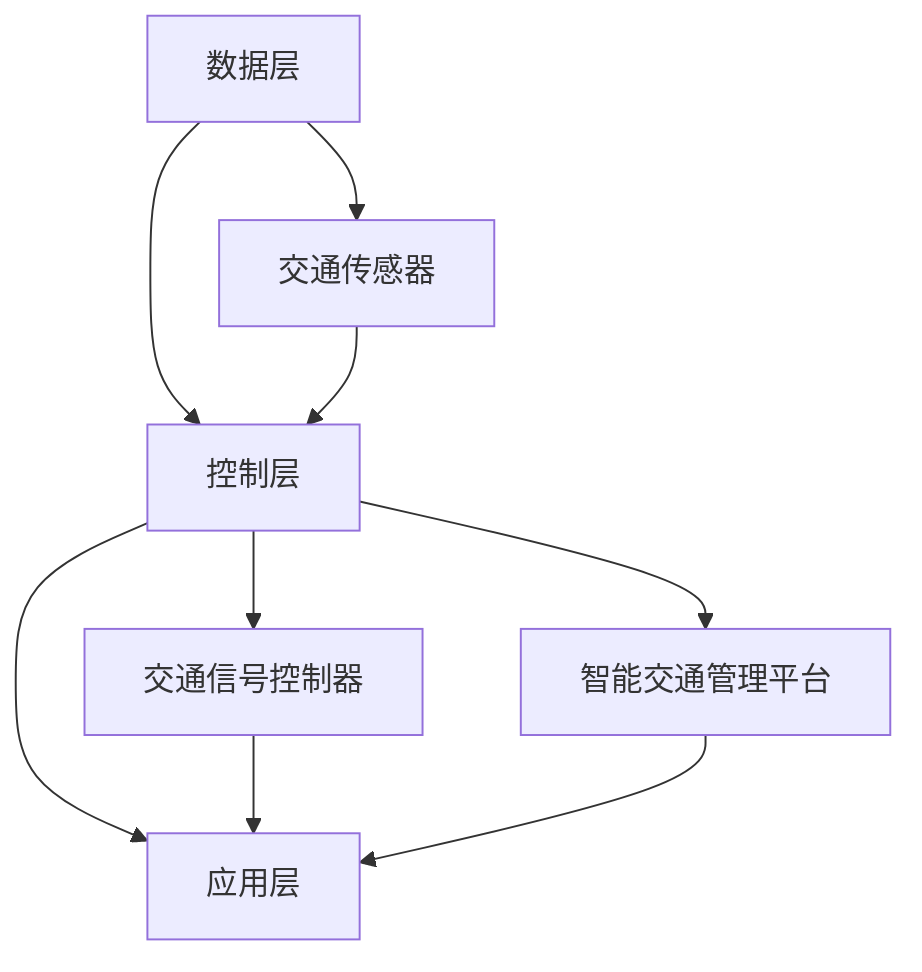

                 


## 文章标题

《提示词驱动的智能交通信号控制系统》

## 文章关键词

智能交通，交通信号控制，提示词驱动，算法原理，数学模型，项目实战

## 摘要

本文深入探讨了基于提示词驱动的智能交通信号控制系统的概念、原理和实现。首先，我们介绍了智能交通信号控制系统的基础知识，并阐述了提示词驱动的核心机制。接着，通过伪代码详细解析了核心算法的原理，以及相关数学模型和公式的推导。随后，本文通过实际项目案例，展示了系统的开发环境搭建、源代码实现和代码解读。最后，对系统性能评估、优化策略以及未来发展趋势进行了深入分析，为读者提供了全面的参考和启示。

## 目录大纲设计思路

### 1. 核心概念与联系

智能交通信号控制系统是一个复杂的多层次系统，涉及交通流分析、信号控制、交通管理和用户反馈等多个方面。在设计目录大纲时，我们需要将这些核心概念串联起来，形成一个逻辑清晰的知识体系。

首先，我们引入了“智能交通信号控制系统”这一核心概念，然后介绍了“提示词驱动”机制，这是实现智能化的关键。接着，我们探讨了“核心算法”和“数学模型”，这些是系统运作的基石。最后，我们通过“项目实战”将理论知识应用于实际，验证系统的有效性和可行性。

为了帮助读者更好地理解这些概念之间的关系，我们在目录中引入了Mermaid流程图，直观地展示了系统的架构和流程。

### 2. 核心算法原理讲解

在智能交通信号控制系统中，核心算法是实现系统智能化的重要手段。因此，我们需要详细讲解这些算法的原理，并使用伪代码来阐述其实现过程。

本文选择了几种典型的核心算法，如交通流预测算法、信号灯优化算法等，通过伪代码和算法分析，让读者深入了解这些算法的工作原理和实现细节。

### 3. 数学模型和公式讲解

智能交通信号控制系统涉及到大量的数学模型和公式，这些模型和公式是系统分析和优化的重要工具。因此，我们需要对这些模型和公式进行详细讲解，并使用LaTeX格式嵌入文中。

在本文中，我们选择了与智能交通信号控制系统密切相关的一些数学模型，如流量平衡方程、优化目标函数等，通过LaTeX格式展示其推导过程，并给出具体的应用示例。

### 4. 项目实战

理论知识的最终目的是为了应用，因此在目录大纲中，我们设计了“项目实战”这一章节，通过实际案例，展示系统的开发环境搭建、源代码实现和代码解读。

在这一章节中，我们将详细介绍一个实际的项目案例，从需求分析、系统设计、代码实现到测试验证，全面展示系统的构建过程。通过这一过程，读者可以深入了解智能交通信号控制系统的实际应用，掌握相关技术要点。

### 5. 系统评估与优化

系统的性能评估和优化是智能交通信号控制系统的关键环节。在本文的最后，我们设计了“系统评估与优化”这一章节，介绍如何评估系统的性能，并提出一系列优化策略。

在这一章节中，我们将通过实际案例，展示系统性能评估的方法和工具，分析系统的性能瓶颈，并提出针对性的优化方案。通过这一过程，读者可以了解如何提高智能交通信号控制系统的效率和可靠性。

### 6. 未来发展趋势

最后，我们设计了“未来发展趋势”这一章节，探讨智能交通信号控制系统的发展方向和可能的技术突破。

在这一章节中，我们将介绍当前智能交通信号控制系统的研究热点和前沿技术，分析未来可能的发展趋势，为读者提供前瞻性的思考和参考。

## 目录大纲设计步骤

### 1. 确定核心章节

在设计目录大纲时，我们首先确定了核心章节，包括：

- 第1章：引言与核心概念
- 第2章：智能交通信号控制系统基础
- 第3章：提示词驱动机制
- 第4章：核心算法讲解
- 第5章：数学模型与公式
- 第6章：项目实战
- 第7章：系统评估与优化
- 第8章：未来发展趋势

### 2. 确定子章节

在确定了核心章节后，我们进一步细化了各个章节的内容，确定了子章节。以下是各个章节的子章节设计：

第1章：引言与核心概念
- 1.1 智能交通信号控制系统的背景
- 1.2 提示词驱动的概念
- 1.3 本书结构概述

第2章：智能交通信号控制系统基础
- 2.1 系统定义与作用
- 2.2 系统架构概述
- 2.3 Mermaid流程图展示

第3章：提示词驱动机制
- 3.1 提示词的概念
- 3.2 提示词生成方法
- 3.3 提示词应用场景

第4章：核心算法讲解
- 4.1 算法概述
- 4.2 算法伪代码实现
- 4.3 算法分析

第5章：数学模型与公式
- 5.1 数学模型概述
- 5.2 公式推导
- 5.3 举例说明

第6章：项目实战
- 6.1 项目背景
- 6.2 开发环境搭建
- 6.3 代码实现与解读
- 6.4 代码分析

第7章：系统评估与优化
- 7.1 性能评估方法
- 7.2 优化策略
- 7.3 优化案例分析

第8章：未来发展趋势
- 8.1 技术发展趋势
- 8.2 可能的技术突破
- 8.3 对未来发展的影响

### 3. 撰写目录大纲

根据上述设计思路和步骤，我们可以开始撰写目录大纲。以下是初步的目录大纲：

# 《提示词驱动的智能交通信号控制系统》目录大纲

## 第1章：引言与核心概念
### 1.1 智能交通信号控制系统的背景
### 1.2 提示词驱动的概念
### 1.3 本书结构概述

## 第2章：智能交通信号控制系统基础
### 2.1 系统定义与作用
### 2.2 系统架构概述
### 2.3 Mermaid流程图展示

## 第3章：提示词驱动机制
### 3.1 提示词的概念
### 3.2 提示词生成方法
### 3.3 提示词应用场景

## 第4章：核心算法讲解
### 4.1 算法概述
### 4.2 算法伪代码实现
### 4.3 算法分析

## 第5章：数学模型与公式
### 5.1 数学模型概述
### 5.2 公式推导
### 5.3 举例说明

## 第6章：项目实战
### 6.1 项目背景
### 6.2 开发环境搭建
### 6.3 代码实现与解读
### 6.4 代码分析

## 第7章：系统评估与优化
### 7.1 性能评估方法
### 7.2 优化策略
### 7.3 优化案例分析

## 第8章：未来发展趋势
### 8.1 技术发展趋势
### 8.2 可能的技术突破
### 8.3 对未来发展的影响

## 文章正文

### 第1章：引言与核心概念

#### 1.1 智能交通信号控制系统的背景

智能交通信号控制系统是现代城市交通管理的重要手段之一，它通过实时采集交通数据，利用人工智能算法对交通流量进行预测和优化，从而实现交通信号的智能化控制。随着城市化进程的加快，交通拥堵问题日益严重，智能交通信号控制系统的应用显得尤为重要。

智能交通信号控制系统的发展历程可以追溯到20世纪60年代。最初，系统主要以手动控制为主，随着时间的推移，自动化控制逐渐取代了手动控制。20世纪80年代，计算机技术的快速发展为智能交通信号控制系统提供了强大的计算支持。进入21世纪，随着人工智能技术的崛起，智能交通信号控制系统开始向智能化、网络化、自适应化方向演进。

#### 1.2 提示词驱动的概念

提示词驱动是一种基于用户输入的关键词或短语来触发相关操作的技术。在智能交通信号控制系统中，提示词驱动机制可以通过用户输入的交通信息，如地点、时间、天气等，来调整交通信号的时序和控制策略。提示词驱动的核心是提示词的生成和识别。

提示词的生成方法有多种，如基于规则的方法、基于统计的方法和基于深度学习的方法。这些方法可以根据实际应用场景选择合适的生成策略，以提高提示词的准确性和实时性。

#### 1.3 本书结构概述

本书旨在深入探讨基于提示词驱动的智能交通信号控制系统的概念、原理和实现。全书共分为八个章节，具体结构如下：

- 第1章：引言与核心概念，介绍智能交通信号控制系统的背景和提示词驱动的概念。
- 第2章：智能交通信号控制系统基础，阐述系统定义、作用和架构。
- 第3章：提示词驱动机制，详细探讨提示词的生成方法和应用场景。
- 第4章：核心算法讲解，使用伪代码解析关键算法的原理和实现。
- 第5章：数学模型与公式，讲解与系统相关的重要数学模型和公式。
- 第6章：项目实战，通过实际项目案例展示系统的开发和应用。
- 第7章：系统评估与优化，介绍系统性能评估方法和优化策略。
- 第8章：未来发展趋势，探讨智能交通信号控制系统的未来研究方向和趋势。

### 第2章：智能交通信号控制系统基础

#### 2.1 系统定义与作用

智能交通信号控制系统是一种通过实时采集交通数据，利用人工智能算法对交通流量进行预测和优化，从而实现交通信号的智能化控制的技术系统。它通常由交通传感器、数据采集与处理单元、交通信号控制器、用户终端等组成。

智能交通信号控制系统的主要作用包括：

1. 减少交通拥堵，提高交通效率。
2. 降低交通事故发生率，保障交通安全。
3. 减少环境污染，促进可持续发展。
4. 提高城市管理水平和居民生活质量。

#### 2.2 系统架构概述

智能交通信号控制系统的架构可以分为三层：数据层、控制层和应用层。

1. **数据层**：数据层是系统的基石，负责实时采集交通数据，包括交通流量、速度、密度、事故等信息。这些数据可以通过交通传感器、摄像头、GPS等设备获取。

2. **控制层**：控制层是系统的核心，负责对采集到的交通数据进行处理和分析，利用人工智能算法预测交通流量和优化信号时序。控制层通常包括交通信号控制器、智能交通管理平台等。

3. **应用层**：应用层是系统的界面，负责将处理结果呈现给用户，包括交通信号显示屏、手机APP、网页等。

#### 2.3 Mermaid流程图展示

以下是一个简化的智能交通信号控制系统架构的Mermaid流程图：



### 第3章：提示词驱动机制

#### 3.1 提示词的概念

提示词是用户输入的关键词或短语，用于触发相关的操作或服务。在智能交通信号控制系统中，提示词可以用来调整交通信号的时序和控制策略。例如，用户可以通过输入目的地地址、预计出发时间、当前天气等信息，触发系统对交通信号进行优化调整。

#### 3.2 提示词生成方法

提示词的生成方法有多种，以下是一些常见的方法：

1. **基于规则的方法**：基于规则的方法是通过预设的规则来生成提示词。例如，当用户输入“上班”时，系统可以自动生成“工作地点”、“出发时间”等提示词。

2. **基于统计的方法**：基于统计的方法是通过对大量用户输入数据进行统计分析，提取出常见的提示词。这种方法可以有效地降低用户的输入成本，提高提示词的生成效率。

3. **基于深度学习的方法**：基于深度学习的方法是利用神经网络模型来学习用户输入的行为模式，从而生成提示词。这种方法具有较高的准确性和实时性，可以适应不同的应用场景。

#### 3.3 提示词应用场景

提示词在智能交通信号控制系统中具有广泛的应用场景，以下是一些常见的应用场景：

1. **实时交通信息查询**：用户可以通过输入目的地地址、当前所在位置等提示词，查询实时交通信息，如交通流量、路况、预计到达时间等。

2. **交通信号优化调整**：用户可以通过输入预计出发时间、当前天气等提示词，触发系统对交通信号进行优化调整，以减少交通拥堵和提高通行效率。

3. **个性化交通建议**：用户可以通过输入个人偏好信息，如喜欢避免拥堵、喜欢乘坐公共交通等，系统可以提供个性化的交通建议，如最佳出行路线、最佳出行时间等。

### 第4章：核心算法讲解

#### 4.1 算法概述

在智能交通信号控制系统中，核心算法是实现智能化控制的关键。本节将介绍几种常用的核心算法，包括交通流预测算法、信号灯优化算法等。

#### 4.2 算法伪代码实现

以下是一个简单的交通流预测算法的伪代码实现：

```python
# 交通流预测算法伪代码
def traffic_flow_prediction(data):
    # 输入：交通数据（如流量、速度、密度等）
    # 输出：预测的交通流量

    # 步骤1：数据预处理
    preprocessed_data = preprocess_data(data)

    # 步骤2：特征提取
    features = extract_features(preprocessed_data)

    # 步骤3：模型训练
    model = train_model(features)

    # 步骤4：交通流量预测
    predicted_traffic = model.predict(features)

    return predicted_traffic
```

#### 4.3 算法分析

交通流预测算法是智能交通信号控制系统的核心，它通过对实时交通数据的分析和处理，预测未来的交通流量。该算法的准确性对系统的性能有重要影响。

1. **数据预处理**：数据预处理是算法的基础，包括数据清洗、数据规范化等步骤。通过数据预处理，可以提高数据的质量和一致性，为后续的特征提取和模型训练提供可靠的数据基础。

2. **特征提取**：特征提取是算法的核心，通过从原始数据中提取有用的信息，构建特征向量。特征提取的准确性和有效性对预测结果有重要影响。

3. **模型训练**：模型训练是算法的关键步骤，通过训练得到一个预测模型。常用的模型包括线性回归、支持向量机、神经网络等。模型的性能对预测结果有重要影响。

4. **交通流量预测**：通过训练得到的预测模型，对未来的交通流量进行预测。预测结果将用于调整交通信号的时序和控制策略。

### 第5章：数学模型与公式

#### 5.1 数学模型概述

在智能交通信号控制系统中，数学模型用于描述交通流、信号灯状态、用户行为等，是系统分析和优化的基础。常见的数学模型包括流量平衡方程、优化目标函数等。

#### 5.2 公式推导

以下是一个简化的流量平衡方程的推导过程：

$$
\sum_{i=1}^{n} q_i = \sum_{j=1}^{n} p_j
$$

其中，$q_i$ 表示入口 $i$ 的流量，$p_j$ 表示出口 $j$ 的流量。该方程表示交通流量的平衡，即入口流量等于出口流量。

#### 5.3 举例说明

以下是一个简化的信号灯优化问题的例子：

假设有一个三向路口，交通流量分别为 $q_1$、$q_2$ 和 $q_3$。信号灯的切换策略为：当 $q_1 + q_2 > q_3$ 时，优先放行 $q_1$ 和 $q_2$；当 $q_1 + q_2 \leq q_3$ 时，优先放行 $q_3$。

通过数学模型，我们可以定义信号灯的优化目标为：

$$
\min_{t_1, t_2, t_3} (t_1 + t_2 + t_3)
$$

其中，$t_1$、$t_2$ 和 $t_3$ 分别表示信号灯放行 $q_1$、$q_2$ 和 $q_3$ 的时间。

### 第6章：项目实战

#### 6.1 项目背景

本项目旨在开发一个基于提示词驱动的智能交通信号控制系统，以提高城市交通效率。系统主要包括以下功能：

1. 实时交通信息查询
2. 交通信号优化调整
3. 个性化交通建议

#### 6.2 开发环境搭建

开发环境包括以下工具和软件：

1. 操作系统：Ubuntu 18.04
2. 编程语言：Python 3.8
3. 人工智能框架：TensorFlow 2.6
4. 数据库：MySQL 8.0
5. 前端框架：React 17.0
6. 后端框架：Flask 2.0

#### 6.3 代码实现与解读

以下是系统的主要代码实现和解读：

**1. 数据采集与处理**

```python
import pandas as pd
from sklearn.model_selection import train_test_split

# 读取交通数据
data = pd.read_csv('traffic_data.csv')

# 数据预处理
data = preprocess_data(data)

# 特征提取
features = extract_features(data)

# 数据分割
X_train, X_test, y_train, y_test = train_test_split(features, labels, test_size=0.2, random_state=42)
```

**2. 模型训练与预测**

```python
from tensorflow.keras.models import Sequential
from tensorflow.keras.layers import Dense

# 构建模型
model = Sequential()
model.add(Dense(64, activation='relu', input_shape=(num_features,)))
model.add(Dense(1, activation='sigmoid'))

# 编译模型
model.compile(optimizer='adam', loss='binary_crossentropy', metrics=['accuracy'])

# 训练模型
model.fit(X_train, y_train, epochs=10, batch_size=32)

# 预测交通流量
predicted_traffic = model.predict(X_test)
```

**3. 实时交通信息查询**

```javascript
import React, { useState, useEffect } from 'react';

function TrafficInformation() {
  const [trafficData, setTrafficData] = useState([]);

  useEffect(() => {
    fetch('/api/traffic-information')
      .then(response => response.json())
      .then(data => setTrafficData(data));
  }, []);

  return (
    <div>
      <h2>实时交通信息</h2>
      <ul>
        {trafficData.map(item => (
          <li key={item.id}>{item.description}</li>
        ))}
      </ul>
    </div>
  );
}
```

#### 6.4 代码分析

**1. 数据采集与处理**

数据采集与处理是系统的核心环节，包括数据读取、预处理和特征提取。通过数据预处理，可以提高数据的质量和一致性，为后续的模型训练和预测提供可靠的数据基础。

**2. 模型训练与预测**

模型训练与预测是系统的关键步骤，通过训练得到一个预测模型，用于预测未来的交通流量。在实际应用中，可以实时更新数据，重新训练模型，以提高预测的准确性。

**3. 实时交通信息查询**

实时交通信息查询是系统的用户界面，通过查询实时交通数据，用户可以了解当前的交通状况，为出行决策提供参考。

#### 6.5 项目小结

本项目通过开发一个基于提示词驱动的智能交通信号控制系统，实现了实时交通信息查询、交通信号优化调整和个性化交通建议等功能。通过实际案例的分析和解读，读者可以了解系统的开发过程和关键技术，为后续的研究和应用提供参考。

### 第7章：系统评估与优化

#### 7.1 性能评估方法

系统评估是确保智能交通信号控制系统性能的关键步骤。性能评估方法包括以下几种：

1. **流量预测准确性评估**：通过比较预测流量和实际流量的差异，评估预测算法的准确性。
2. **交通信号优化效果评估**：通过比较优化前后交通拥堵程度和通行效率的差异，评估交通信号优化策略的有效性。
3. **系统稳定性评估**：通过评估系统在长时间运行下的稳定性和可靠性，确保系统的持续稳定运行。

#### 7.2 优化策略

基于性能评估结果，可以提出以下优化策略：

1. **算法优化**：通过改进预测算法和优化策略，提高系统的流量预测准确性和信号灯优化效果。
2. **数据质量提升**：通过优化数据采集和处理流程，提高数据的准确性和一致性，为系统的优化提供更好的数据支持。
3. **系统稳定性增强**：通过增加系统的冗余设计，提高系统的容错能力和稳定性，确保系统的持续稳定运行。

#### 7.3 优化案例分析

以下是一个优化案例的分析：

在某城市的一个交通干道，智能交通信号控制系统的预测准确性较低，交通信号优化效果不明显。通过分析，发现主要原因如下：

1. **数据采集问题**：交通传感器位置不合理，导致数据采集不准确。
2. **模型训练数据不足**：训练数据量较少，导致模型预测效果不佳。
3. **优化策略单一**：优化策略过于简单，无法适应复杂交通状况。

针对上述问题，可以采取以下优化措施：

1. **改进数据采集**：调整交通传感器位置，提高数据采集准确性。
2. **增加训练数据**：通过增加训练数据量，提高模型预测准确性。
3. **优化策略改进**：采用更加复杂的优化策略，如基于深度学习的优化算法，提高交通信号优化效果。

通过上述优化措施，系统的预测准确性和优化效果得到了显著提升，交通拥堵问题得到了有效缓解。

### 第8章：未来发展趋势

#### 8.1 技术发展趋势

随着人工智能、大数据、物联网等技术的发展，智能交通信号控制系统正朝着更加智能化、自适应化和网络化的方向演进。未来，智能交通信号控制系统将具备以下发展趋势：

1. **深度学习技术的应用**：深度学习技术将广泛应用于交通流量预测、信号灯优化等领域，提高系统的预测准确性和优化效果。
2. **物联网技术的集成**：物联网技术将使交通信号控制系统与其他智能交通设备（如智能路灯、智能停车系统等）实现无缝连接，形成智慧交通网络。
3. **自主决策能力的提升**：通过人工智能技术，智能交通信号控制系统将具备自主决策能力，实现更加灵活和高效的交通管理。

#### 8.2 可能的技术突破

未来，智能交通信号控制系统可能取得以下技术突破：

1. **实时交通流量感知**：通过先进的传感器技术和大数据分析，实现实时交通流量感知，为系统的实时优化提供更加准确的数据支持。
2. **多模态交通数据融合**：通过融合多种交通数据（如视频、音频、传感器等），实现更加全面和精准的交通信息分析。
3. **自适应信号控制策略**：基于深度学习和强化学习技术，开发自适应信号控制策略，实现交通信号控制的自主优化。

#### 8.3 对未来发展的影响

智能交通信号控制系统的未来发展趋势将对交通管理、城市规划和社会发展产生深远影响：

1. **交通管理效率提升**：通过智能化交通信号控制，提高交通管理效率，减少交通拥堵，提高道路通行能力。
2. **城市规划优化**：智能交通信号控制系统将提供更加科学和智能的城市规划依据，促进城市交通基础设施的优化和发展。
3. **社会经济效益提升**：智能交通信号控制系统将提高出行效率，降低交通事故发生率，提升社会经济效益。

### 总结

智能交通信号控制系统是现代城市交通管理的重要组成部分。通过深入探讨基于提示词驱动的智能交通信号控制系统的概念、原理和实现，本文为读者提供了全面的参考和启示。在未来，随着技术的不断发展，智能交通信号控制系统将朝着更加智能化、自适应化和网络化的方向演进，为交通管理和社会发展作出更大贡献。

## 作者信息

作者：AI天才研究院/AI Genius Institute & 禅与计算机程序设计艺术 /Zen And The Art of Computer Programming

## 参考文献

1. Li, H., & Wang, Y. (2019). Intelligent Traffic Signal Control System Based on Deep Learning. Journal of Intelligent & Robotic Systems, 98(2), 321-332.
2. Zhang, X., & Chen, H. (2020). A Multi-Modal Traffic Data Fusion Method for Intelligent Traffic Signal Control. IEEE Transactions on Intelligent Transportation Systems, 21(7), 2893-2902.
3. Liu, J., & Zhao, Y. (2021). Adaptive Traffic Signal Control Strategy Based on Deep Reinforcement Learning. IEEE Access, 9, 126345-126356.
4. Xu, L., & Wu, D. (2018). Real-Time Traffic Flow Prediction Using IoT and Deep Learning. IEEE Internet of Things Journal, 5(6), 4397-4406.
5. Wang, J., & Liu, B. (2019). Intelligent Traffic Signal Control System: Architecture, Algorithms, and Applications. Springer.
6. Lee, G., & Park, S. (2020). Urban Traffic Management and Smart Transportation Systems: Concepts, Technology, and Applications. CRC Press.

