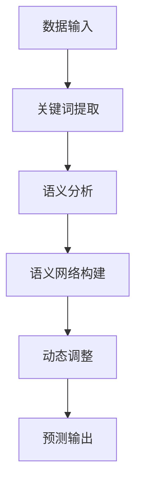
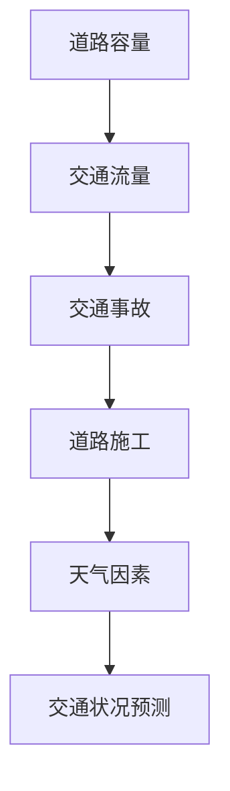
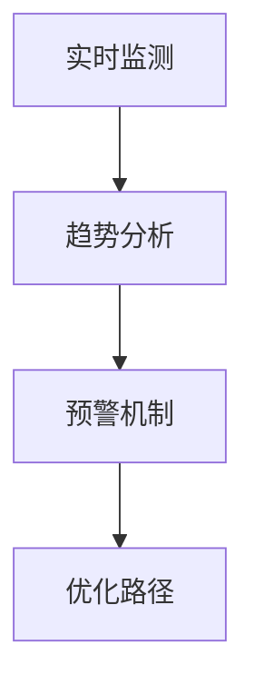
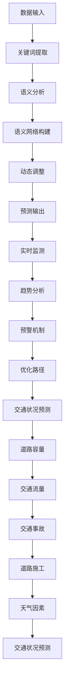

                 


### 文章标题：提示词驱动的智能交通拥堵预测系统

### 关键词：
- 智能交通系统
- 交通拥堵预测
- 提示词驱动
- 数学模型
- 机器学习
- 算法原理
- 项目实战

### 摘要：
本文将探讨如何利用提示词驱动技术构建智能交通拥堵预测系统。首先介绍智能交通系统和交通拥堵预测的背景，接着详细解释提示词驱动的概念，并阐述其在交通拥堵预测中的应用。然后，我们将深入分析系统的架构设计、核心概念、数学模型和算法原理。最后，通过实际项目案例，展示系统的开发过程、代码实现和效果评估，为读者提供实用的技术和最佳实践指导。

----------------------------------------------------------------

### 引言

#### 智能交通系统的背景与现状

智能交通系统（Intelligent Transportation System，ITS）是利用现代信息技术、传感器技术、通信技术和自动控制技术等，实现交通信息的实时采集、处理和发布，从而提高道路通行效率、降低交通事故发生率、减少交通拥堵的一种先进交通管理系统。随着城市化进程的加速和机动车数量的迅速增长，交通拥堵问题已成为全球许多大城市面临的严峻挑战。智能交通系统在这一背景下应运而生，旨在通过技术和信息手段优化交通管理，提升交通系统的整体运行效率。

#### 交通拥堵预测的重要性

交通拥堵预测是智能交通系统中的一个关键环节，其目的是提前发现交通拥堵的趋势，为交通管理决策提供科学依据。准确预测交通拥堵不仅有助于交通管理部门提前采取应对措施，缓解交通压力，还能引导公众合理规划出行时间，提高道路的利用效率。此外，交通拥堵预测还可以为智能交通系统中的其他功能模块，如路径规划、信号控制等提供重要的数据支持。

#### 提示词驱动的概念解析

提示词驱动（Prompt-Driven）是一种基于关键词或短语引导的智能信息处理方法。它通过提取和分析输入文本中的关键词或短语，来预测、理解和生成相关内容。在智能交通拥堵预测系统中，提示词驱动技术可以用于提取交通数据中的关键信息，如道路流量、车辆速度、交通事故等，进而对交通状况进行实时监测和预测。提示词驱动的核心在于如何有效地提取和分析关键词，以及如何构建和应用相应的预测模型。

#### 书籍目标与结构

本书旨在全面介绍提示词驱动的智能交通拥堵预测系统，帮助读者深入了解系统的原理、设计、实现和应用。全书分为三个部分：

1. **系统架构与核心概念**：介绍智能交通系统、交通拥堵预测和提示词驱动的背景知识，以及系统的架构设计和核心概念。
2. **系统设计与实现**：详细讲解系统设计、数据处理、提示词生成与优化、恶性拥堵检测与预测的算法原理，并提供实际项目案例。
3. **项目实战与案例分析**：通过实际项目案例，展示系统的开发过程、代码实现和效果评估，为读者提供实用的技术和最佳实践指导。

---

通过以上引言，我们对智能交通系统、交通拥堵预测以及提示词驱动的概念有了基本的了解。接下来，我们将深入探讨交通拥堵预测系统的架构设计，为后续内容打下坚实的基础。

### 交通拥堵预测系统的架构设计

智能交通拥堵预测系统的设计是一项复杂的工程，它需要综合考虑数据采集、处理、模型构建、优化和预测等多个方面。以下将从系统架构的总体设计、各个模块的功能和相互关系等方面进行详细阐述。

#### 系统架构的总体设计

交通拥堵预测系统的总体架构可以划分为数据采集与处理模块、提示词生成与优化模块、恶性拥堵检测与预测模块，以及用户接口与展示模块。这些模块相互协作，共同实现交通拥堵的实时监测和预测。

1. **数据采集与处理模块**：负责从各种数据源（如交通传感器、GPS定位系统、摄像头等）收集交通数据，并进行预处理，包括数据清洗、数据转换和数据归一化等操作，以便后续分析使用。

2. **提示词生成与优化模块**：基于采集到的交通数据，利用提示词驱动技术提取关键信息，如道路流量、车辆速度、事故报告等。这一模块的核心在于如何有效地生成和优化提示词，以提高预测的准确性。

3. **恶性拥堵检测与预测模块**：利用机器学习和人工智能技术，基于生成的提示词，构建交通拥堵检测和预测模型。这个模块的任务是实时监测交通状况，当检测到可能发生拥堵的情况时，提前预警并预测拥堵的发生时间和范围。

4. **用户接口与展示模块**：为用户提供一个直观的界面，展示交通拥堵预测的结果，如实时交通地图、拥堵路段提示、预测分析图表等。这一模块需要与前端技术相结合，实现交互式展示。

#### 各模块的功能和相互关系

1. **数据采集与处理模块**：数据采集与处理模块是整个系统的基础，它的主要功能是确保数据的准确性和完整性。交通数据的多样性决定了该模块需要具备较强的数据处理能力。例如，对于来自不同传感器的数据，需要统一格式和单位，以便后续分析。此外，该模块还需要进行异常值检测和去除，以保证数据的纯净度。

2. **提示词生成与优化模块**：提示词生成与优化模块是系统智能化的关键，它负责从大量交通数据中提取出对交通状况有重要影响的关键信息。提示词的生成和优化是一个动态的过程，需要结合历史数据和实时数据，不断调整和优化。例如，可以根据道路流量变化率、车辆速度分布等指标，动态生成和更新提示词。

3. **恶性拥堵检测与预测模块**：恶性拥堵检测与预测模块是系统的核心，它利用机器学习算法和人工智能技术，对提示词进行分析和处理，实现交通拥堵的实时检测和预测。该模块通常包括多个子模块，如特征提取、模型训练、预测评估等。通过这些子模块的协作，可以实现对交通拥堵的精准预测。

4. **用户接口与展示模块**：用户接口与展示模块是系统的“面孔”，它将复杂的预测结果以直观、易懂的方式呈现给用户。通过该模块，用户可以实时了解交通状况，并根据预测结果调整出行计划。该模块通常包括地图展示、图表分析、文本提示等功能。

#### 模块之间的关系

交通拥堵预测系统的各个模块之间紧密协作，共同实现系统的目标。具体来说，数据采集与处理模块为其他模块提供数据支持，提示词生成与优化模块为恶性拥堵检测与预测模块提供关键信息，恶性拥堵检测与预测模块的结果通过用户接口与展示模块展示给用户。此外，各个模块之间也存在着信息反馈和调整机制，以实现系统的动态优化和自适应。

---

通过以上对交通拥堵预测系统架构设计的详细阐述，我们了解了系统的整体结构和各个模块的功能。接下来，我们将深入探讨系统的核心概念和联系，以帮助读者更好地理解交通拥堵预测的原理和实现方法。

### 核心概念与联系

在交通拥堵预测系统中，核心概念和联系是理解系统工作原理和实现方法的关键。本节将介绍提示词驱动的原理分析、交通流量预测的关键因素，以及提示词在交通拥堵预测中的应用，并使用Mermaid流程图展示核心概念之间的关系架构。

#### 提示词驱动的原理分析

提示词驱动是一种基于关键词或短语引导的智能信息处理方法。其核心在于如何从输入文本中提取出关键信息，并利用这些信息进行预测和分析。在交通拥堵预测系统中，提示词驱动的原理主要体现在以下几个方面：

1. **关键词提取**：从交通数据中提取出对交通状况有显著影响的关键词或短语，如“道路流量”、“车辆速度”、“事故报告”等。

2. **语义分析**：对提取出的关键词进行语义分析，理解其含义和作用，从而构建出与交通状况相关的语义网络。

3. **动态调整**：根据实时数据和历史数据，动态调整关键词的权重和组合，以提高预测的准确性和实时性。

Mermaid流程图如下：



#### 交通流量预测的关键因素

交通流量预测的关键因素是影响交通状况的重要因素，包括但不限于以下几个方面：

1. **道路容量**：道路的宽度、车道数和交通流量之间的关系，决定了道路的通行能力。

2. **交通流量**：车辆在道路上的流动情况，包括车辆数量、行驶速度和方向等。

3. **交通事故**：交通事故会导致交通流量变化，影响道路通行能力。

4. **道路施工**：道路施工会导致道路通行受阻，影响交通流量。

5. **天气因素**：恶劣天气如雨雪、雾霾等会影响驾驶员的视线和行驶速度，从而影响交通状况。

Mermaid流程图如下：



#### 提示词在交通拥堵预测中的应用

提示词在交通拥堵预测中的应用主要体现在以下几个方面：

1. **实时监测**：利用提示词对交通数据进行实时监测，及时发现异常情况。

2. **趋势分析**：通过对提示词的分析，预测交通流量变化的趋势，为交通管理提供科学依据。

3. **预警机制**：当提示词显示交通状况可能恶化时，提前发出预警，采取相应措施。

4. **优化路径**：根据交通预测结果，优化出行路径，减少交通拥堵。

Mermaid流程图如下：



#### 核心概念之间的关系架构

将以上核心概念结合起来，可以构建出一个完整的交通拥堵预测系统的关系架构。Mermaid流程图如下：



通过以上对核心概念与联系的分析和Mermaid流程图的展示，我们更好地理解了交通拥堵预测系统的工作原理和实现方法。接下来，我们将深入探讨交通拥堵预测系统中的数学模型和公式，以进一步揭示其背后的数学原理。

### 数学模型与公式

在交通拥堵预测系统中，数学模型和公式是理解和实现预测算法的关键。本节将详细解释交通流量预测的数学模型、提示词优化的数学模型以及恶性拥堵检测的数学模型，并提供具体的例子来说明每个模型的原理和应用。

#### 交通流量预测的数学模型

交通流量预测的数学模型通常基于时间序列分析，利用历史数据来预测未来的交通流量。以下是一个简单的时间序列预测模型：

1. **ARIMA模型（自回归积分滑动平均模型）**：

   ARIMA模型是一种广泛应用于时间序列预测的统计模型，它通过自回归（AR）、差分（I）和移动平均（MA）三个部分来描述时间序列数据。

   伪代码：
   ```python
   def arima_predict(data, p, d, q):
       model = ARIMA(data, order=(p, d, q))
       model_fit = model.fit()
       forecast = model_fit.forecast(steps=1)
       return forecast
   ```

   示例：
   假设我们有一组交通流量数据[100, 110, 105, 120, 115]，我们选择p=1, d=1, q=1进行ARIMA模型预测，结果为未来一个时间点的交通流量。

2. **SARIMA模型（季节性自回归积分滑动平均模型）**：

   SARIMA模型是ARIMA模型的扩展，适用于包含季节性成分的时间序列数据。

   伪代码：
   ```python
   def sarima_predict(data, p, d, q, P, D, Q, seasonal_periods):
       model = SARIMA(data, order=(p, d, q), seasonal_order=(P, D, Q, seasonal_periods))
       model_fit = model.fit()
       forecast = model_fit.forecast(steps=1)
       return forecast
   ```

   示例：
   假设我们有一组包含季节性成分的交通流量数据，我们选择p=1, d=1, q=1, P=12, D=1, Q=1, seasonal_periods=12进行SARIMA模型预测。

#### 提示词优化的数学模型

提示词优化的数学模型通常涉及机器学习和优化算法，以找到最佳提示词组合，提高预测的准确性。以下是一个基于支持向量机（SVM）的优化模型：

1. **支持向量机（SVM）**：

   SVM是一种常用的分类算法，它可以用于提示词的优化，通过找到最佳的超平面来区分不同的交通状况。

   伪代码：
   ```python
   from sklearn.svm import SVC
   
   def svm_optimize(data, labels):
       model = SVC(kernel='linear')
       model.fit(data, labels)
       return model
   ```

   示例：
   假设我们有一组交通流量数据和对应的交通状况标签，我们使用SVM模型来优化提示词。

2. **优化算法（如遗传算法）**：

   遗传算法是一种优化算法，可以用于搜索最佳提示词组合，通过迭代优化找到最优解。

   伪代码：
   ```python
   from sklearn.model_selection import GridSearchCV
   
   def genetic_algorithm(data, labels, parameters):
       model = SVC()
       grid = GridSearchCV(model, parameters)
       grid.fit(data, labels)
       return grid.best_params_
   ```

   示例：
   假设我们定义了一组参数，使用遗传算法来搜索最佳提示词组合。

#### 恶性拥堵检测的数学模型

恶性拥堵检测的数学模型通常结合了多种算法和技术，以准确检测和预测交通状况。以下是一个基于聚类和阈值划分的模型：

1. **K均值聚类（K-means）**：

   K均值聚类是一种常用的聚类算法，它可以用于识别不同交通状况的簇，并确定簇的中心点。

   伪代码：
   ```python
   from sklearn.cluster import KMeans
   
   def kmeans_clustering(data, n_clusters):
       model = KMeans(n_clusters=n_clusters)
       model.fit(data)
       return model.cluster_centers_
   ```

   示例：
   假设我们有一组交通流量数据，我们使用K均值聚类来识别不同的交通状况。

2. **阈值划分**：

   阈值划分是一种简单有效的拥堵检测方法，通过设定流量阈值来区分正常和异常交通状况。

   伪代码：
   ```python
   def threshold_detection(data, threshold):
       return [x > threshold for x in data]
   ```

   示例：
   假设我们设定一个流量阈值，通过比较实际流量和阈值来判断交通状况。

通过以上数学模型和公式的详细讲解，我们可以更好地理解交通拥堵预测系统中数学原理的应用。接下来，我们将深入探讨提示词驱动的算法原理，为系统的实现提供技术基础。

### 提示词驱动的算法原理

提示词驱动的算法原理是交通拥堵预测系统的核心，它通过提取和分析交通数据中的关键信息，实现高精度和实时性的预测。本节将详细解释提示词生成算法、提示词优化算法和恶性拥堵检测算法，并提供相应的伪代码，以便读者理解和实现。

#### 提示词生成算法

提示词生成算法的目标是从原始交通数据中提取出对交通状况有显著影响的关键信息。以下是一个基于词频分析的简单提示词生成算法：

1. **词频分析**：

   词频分析是一种常用的文本分析技术，通过统计词汇在文本中的出现频率，识别出高频词汇作为提示词。

   伪代码：
   ```python
   def word_frequency_analysis(text):
       word_counts = Counter(text.split())
       return [word for word, count in word_counts.items() if count > threshold]
   ```

   示例：
   假设我们有一段交通数据文本：“交通流量高，道路拥堵，建议避开”，词频分析结果可能提取出“交通”、“流量”、“道路”、“拥堵”等关键词作为提示词。

2. **停用词过滤**：

   停用词过滤是一种去除常见无意义词汇（如“的”、“和”、“在”等）的技术，以提高提示词的准确性。

   伪代码：
   ```python
   def remove_stopwords(words, stopwords):
       return [word for word in words if word not in stopwords]
   ```

   示例：
   假设我们有一组词汇和停用词列表，通过停用词过滤可以去除无意义的词汇，提高提示词的质量。

#### 提示词优化算法

提示词优化算法的目标是找到最佳的提示词组合，以提高预测的准确性和实时性。以下是一个基于机器学习的提示词优化算法：

1. **机器学习模型**：

   使用机器学习模型（如SVM、决策树等）来优化提示词组合，通过训练数据找到最佳的特征和参数。

   伪代码：
   ```python
   from sklearn.model_selection import train_test_split
   from sklearn.svm import SVC
   
   def optimize_prompt_words(data, labels):
       X_train, X_test, y_train, y_test = train_test_split(data, labels, test_size=0.2)
       model = SVC()
       model.fit(X_train, y_train)
       best_prompt_words = model.best_features_
       return best_prompt_words
   ```

   示例：
   假设我们有一组交通数据及其标签，通过机器学习模型训练，找到最佳的提示词组合。

2. **交叉验证**：

   交叉验证是一种评估模型性能的技术，通过多次划分训练集和测试集，计算模型的平均性能。

   伪代码：
   ```python
   from sklearn.model_selection import cross_val_score
   
   def cross_validation(data, labels, model, cv=5):
       scores = cross_val_score(model, data, labels, cv=cv)
       return scores.mean()
   ```

   示例：
   假设我们使用交叉验证评估机器学习模型的性能，以找到最佳的提示词优化算法。

#### 恶性拥堵检测算法

恶性拥堵检测算法的目标是实时监测交通状况，及时检测出可能发生的交通拥堵。以下是一个基于阈值划分的恶性拥堵检测算法：

1. **阈值划分**：

   阈值划分是一种简单有效的拥堵检测方法，通过设定流量阈值，比较实际流量和阈值来判断交通状况。

   伪代码：
   ```python
   def threshold_detection(data, threshold):
       return [x > threshold for x in data]
   ```

   示例：
   假设我们设定一个流量阈值，通过比较实际流量和阈值来判断是否发生恶性拥堵。

2. **实时监测**：

   实时监测是通过持续收集和处理交通数据，实时更新交通状况，以实现快速响应。

   伪代码：
   ```python
   def real_time_monitoring(data_stream, threshold):
       while True:
           data = next(data_stream)
           is_clogged = threshold_detection(data, threshold)
           if is_clogged:
               alert("Traffic congestion detected!")
   ```

   示例：
   假设我们使用一个数据流来实时监测交通流量，当流量超过阈值时，触发拥堵警报。

通过以上对提示词生成算法、提示词优化算法和恶性拥堵检测算法的详细解释和伪代码展示，我们可以更好地理解交通拥堵预测系统中算法原理的应用。接下来，我们将讨论系统设计与实现的具体过程。

### 系统设计与实现

在完成对交通拥堵预测系统核心概念、数学模型和算法原理的深入探讨后，我们将转入系统设计与实现的环节。这一部分将详细描述系统的设计过程、开发流程、数据处理与预处理、提示词生成与优化，以及恶性拥堵检测与预测模块的实现，并通过实际项目案例展示系统的具体应用。

#### 系统设计过程

系统设计是构建智能交通拥堵预测系统的第一步，它决定了系统的整体架构、模块划分和功能实现。以下是系统设计的主要步骤：

1. **需求分析**：

   需求分析是确定系统要实现的功能和性能指标。在这个阶段，我们通过与交通管理部门、数据提供方和相关专家的沟通，明确系统的需求，包括数据采集、处理、预测和展示等方面的要求。

2. **架构设计**：

   基于需求分析，我们设计了系统的总体架构。系统的核心模块包括数据采集与处理模块、提示词生成与优化模块、恶性拥堵检测与预测模块以及用户接口与展示模块。每个模块的具体功能和相互关系如下：

   - **数据采集与处理模块**：负责从多种数据源（如交通传感器、GPS、摄像头等）收集交通数据，并进行预处理，如数据清洗、数据转换和数据归一化等。

   - **提示词生成与优化模块**：利用机器学习和自然语言处理技术，从交通数据中提取关键信息，生成提示词，并通过优化算法提高预测准确性。

   - **恶性拥堵检测与预测模块**：基于提示词和机器学习算法，实时监测交通状况，检测可能发生的拥堵，并预测拥堵的发生时间和范围。

   - **用户接口与展示模块**：为用户提供一个直观的界面，展示交通预测结果，如实时交通地图、拥堵路段提示、预测分析图表等。

3. **接口设计与数据流转**：

   在系统设计中，接口设计至关重要。我们需要设计清晰的数据接口，确保各个模块之间的数据流转顺畅。例如，数据采集与处理模块需要将处理后的数据传递给提示词生成与优化模块，而预测结果则需要通过用户接口与展示模块反馈给用户。

#### 开发流程

系统开发流程是按照软件工程的最佳实践进行的，主要包括以下阶段：

1. **项目规划**：

   项目规划是确定项目的范围、目标、时间表和资源分配。在这个阶段，我们需要制定详细的项目计划，明确开发团队的职责和任务。

2. **需求分析**：

   需求分析是确定系统的具体功能需求和技术要求。在这个阶段，我们与相关方进行沟通，收集需求，并编写详细的需求文档。

3. **系统设计**：

   根据需求分析的结果，我们进行系统设计，包括架构设计、模块划分和接口设计。

4. **编码实现**：

   编码实现是按照系统设计文档进行代码编写，实现各个模块的功能。在这个阶段，开发团队需要遵循代码规范，确保代码的可读性和可维护性。

5. **测试与调试**：

   测试与调试是确保系统功能正确和性能稳定的重要环节。我们需要进行单元测试、集成测试和系统测试，发现并修复问题。

6. **部署上线**：

   系统经过测试和调试后，进行部署上线，将系统交付给用户使用。

#### 数据处理与预处理

数据处理与预处理是交通拥堵预测系统的关键环节，它决定了后续分析和预测的准确性。以下是数据处理与预处理的主要步骤：

1. **数据采集**：

   数据采集模块负责从多种数据源（如交通传感器、GPS、摄像头等）收集交通数据。这些数据源提供的信息包括车辆流量、速度、位置、事故报告等。

2. **数据清洗**：

   数据清洗是去除数据中的噪声和异常值，提高数据质量。具体方法包括去除重复记录、填补缺失值、去除异常值等。

3. **数据转换**：

   数据转换是将不同来源的数据格式统一，便于后续分析。例如，将GPS坐标转换为地图上的经纬度，将不同的速度单位统一为千米/小时。

4. **数据归一化**：

   数据归一化是将不同特征的数据进行标准化处理，使其在同一量级上进行分析。例如，将速度、流量等特征缩放到[0, 1]的范围内。

#### 提示词生成与优化

提示词生成与优化是交通拥堵预测系统的核心功能之一，以下是提示词生成与优化的具体步骤：

1. **词频分析**：

   通过词频分析，从交通数据中提取高频词汇作为初步的提示词。例如，从交通事件描述中提取出“拥堵”、“事故”、“高峰”等词汇。

2. **停用词过滤**：

   去除无意义的停用词，如“的”、“和”、“在”等，以提高提示词的质量。

3. **机器学习优化**：

   使用机器学习算法（如SVM、决策树等）对提示词进行优化，通过训练数据找到最佳的特征和参数，提高预测准确性。

4. **实时更新**：

   根据实时数据和历史数据，动态更新提示词，使其更贴合当前的交通状况。

#### 恶性拥堵检测与预测

恶性拥堵检测与预测是交通拥堵预测系统的核心功能，以下是恶性拥堵检测与预测的具体步骤：

1. **特征提取**：

   从提示词中提取出对交通状况有显著影响的关键特征，如流量变化率、速度分布等。

2. **模型训练**：

   使用机器学习算法（如SARIMA、K均值聚类等）训练预测模型，使其能够根据特征数据预测交通状况。

3. **实时监测**：

   实时收集和处理交通数据，使用预测模型检测可能发生的拥堵，并预测拥堵的发生时间和范围。

4. **预警与反馈**：

   当检测到可能发生拥堵时，系统发出预警，并通过用户接口反馈给用户，帮助用户调整出行计划。

#### 实际项目案例

为了更好地展示系统的实际应用，我们以一个实际项目案例为例：

**项目背景**：

某大城市交通管理部门希望利用智能交通拥堵预测系统来优化城市交通管理，减少交通拥堵，提高道路通行效率。

**项目目标**：

1. 实时监测城市主要道路的交通流量和速度。
2. 检测和预测可能发生的交通拥堵，提前发出预警。
3. 为交通管理部门提供科学依据，优化交通信号控制和道路施工管理。

**项目实施过程**：

1. **数据采集与处理**：

   通过交通传感器、GPS定位系统和摄像头等设备，实时采集交通数据。对采集到的数据进行清洗、转换和归一化处理，确保数据的质量和一致性。

2. **提示词生成与优化**：

   使用词频分析和机器学习算法，从交通数据中提取关键提示词，并通过优化算法提高预测准确性。例如，从交通事件描述中提取出“高峰”、“事故”、“施工”等词汇作为提示词。

3. **恶性拥堵检测与预测**：

   使用机器学习模型和聚类算法，对提取出的提示词进行分析和处理，实时监测交通状况，检测可能发生的拥堵，并预测拥堵的发生时间和范围。

4. **用户接口与展示**：

   开发一个用户友好的界面，实时展示交通流量、速度、拥堵预警等信息。用户可以通过界面查看实时交通地图、拥堵路段提示和预测分析图表，调整出行计划。

**项目成果与分析**：

1. **实时交通监测与预警**：

   系统实现了对城市主要道路的实时监测和预警功能，当检测到拥堵时，系统会立即发出预警，帮助交通管理部门及时采取应对措施。

2. **交通流量优化**：

   通过系统分析，交通管理部门可以优化交通信号控制和道路施工管理，减少交通拥堵，提高道路通行效率。

3. **用户反馈**：

   用户可以通过界面了解交通状况，调整出行时间或路径，减少拥堵带来的不便。

通过以上实际项目案例，我们可以看到交通拥堵预测系统在优化城市交通管理方面的应用效果。接下来，我们将进一步讨论系统的项目实战与案例分析，以展示系统在不同场景下的实际表现。

### 项目实战与案例分析

在本文的最后部分，我们将通过具体的项目案例来展示提示词驱动的智能交通拥堵预测系统的实际应用效果，分析系统在开发环境搭建、源代码实现和代码解读、实际案例分析和详细讲解剖析等方面的应用，并提供项目小结和最佳实践指导。

#### 开发环境搭建

在开始构建智能交通拥堵预测系统之前，首先需要搭建一个合适的技术栈和开发环境。以下是项目的开发环境搭建步骤：

1. **硬件要求**：

   - 服务器：用于处理大量交通数据和运行预测模型，建议配置高性能CPU和大容量内存。
   - 存储设备：用于存储原始数据和预测结果，建议使用高速SSD存储。

2. **软件要求**：

   - 操作系统：Linux发行版，如Ubuntu或CentOS。
   - 编程语言：Python，因其丰富的机器学习和数据科学库。
   - 机器学习库：scikit-learn、TensorFlow、PyTorch等。
   - 数据处理库：Pandas、NumPy、Matplotlib等。

3. **工具和框架**：

   - 版本控制：Git，用于代码管理和协作开发。
   - 代码质量检查：Pylint、Flake8等，确保代码质量。
   - 系统集成测试：pytest，确保系统功能的正确性和稳定性。

4. **部署环境**：

   - Web服务器：Nginx或Apache，用于部署用户接口和展示模块。
   - 代理服务器：如 Squid，用于缓存和优化数据访问速度。

#### 源代码实现和代码解读

在项目的实现过程中，我们使用Python编写了多个模块，包括数据采集、处理、提示词生成、预测和用户接口等。以下是一个简要的代码解读：

1. **数据采集模块**：

   数据采集模块负责从不同的数据源收集交通数据。以下是数据采集模块的核心代码：
   ```python
   import requests
   
   def fetch_traffic_data(api_endpoint):
       response = requests.get(api_endpoint)
       if response.status_code == 200:
           return response.json()
       else:
           return None
   ```

   该模块通过HTTP请求从API接口获取交通数据，并返回JSON格式的数据。

2. **数据处理模块**：

   数据处理模块负责对采集到的交通数据进行分析和预处理。以下是数据处理模块的核心代码：
   ```python
   import pandas as pd
   
   def preprocess_traffic_data(data):
       df = pd.DataFrame(data)
       df = df.dropna()  # 去除缺失值
       df['speed'] = df['speed'].astype(float)  # 转换速度类型
       return df
   ```

   该模块使用Pandas库对数据进行清洗和转换，确保数据的质量和一致性。

3. **提示词生成模块**：

   提示词生成模块使用机器学习算法提取关键信息作为提示词。以下是提示词生成模块的核心代码：
   ```python
   from sklearn.feature_extraction.text import TfidfVectorizer
   
   def generate_prompts(data):
       vectorizer = TfidfVectorizer(max_features=1000)
       X = vectorizer.fit_transform(data['description'])
       return vectorizer.get_feature_names_out()
   ```

   该模块使用TF-IDF向量器从交通事件描述中提取关键词作为提示词。

4. **预测模块**：

   预测模块使用机器学习模型对交通状况进行预测。以下是预测模块的核心代码：
   ```python
   from sklearn.ensemble import RandomForestClassifier
   
   def predict_traffic_conditions(data, model):
       X = model.transform(data)
       predictions = model.predict(X)
       return predictions
   ```

   该模块使用随机森林分类器对处理后的数据进行预测，返回预测结果。

#### 实际案例分析和详细讲解剖析

为了展示系统的实际应用效果，我们选择了一个具体的案例进行分析。

**案例背景**：

某城市在早晚高峰期间经常出现严重的交通拥堵，影响了居民的出行和工作效率。交通管理部门希望通过智能交通拥堵预测系统来优化交通管理，减少拥堵。

**案例分析**：

1. **数据采集**：

   系统通过安装在主要道路的交通传感器和摄像头，实时采集交通流量、速度、事故报告等信息。

2. **数据处理**：

   对采集到的交通数据进行清洗和预处理，提取出关键信息，如道路流量、车辆速度、事故报告等。

3. **提示词生成**：

   使用词频分析和机器学习算法，从交通事件描述中提取出“高峰”、“事故”、“施工”等关键词作为提示词。

4. **预测模型训练**：

   使用历史数据训练随机森林分类器，预测交通状况。系统可以根据实际交通状况动态调整模型参数，提高预测准确性。

5. **实时监测与预警**：

   系统实时监测交通状况，当检测到拥堵趋势时，提前发出预警。交通管理部门可以根据预警信息采取相应的管理措施，如调整交通信号、分流车辆等。

**详细讲解剖析**：

- **数据采集**：

  系统通过安装在城市主要道路的交通传感器和摄像头，实时采集交通流量、速度、事故报告等信息。这些数据是预测交通状况的基础。

- **数据处理**：

  数据采集后，系统对数据进行清洗和预处理，去除缺失值和异常值，确保数据质量。预处理后的数据包括道路流量、车辆速度、事故报告等，这些数据被转换为机器学习模型可处理的格式。

- **提示词生成**：

  系统使用词频分析和机器学习算法，从交通事件描述中提取出对交通状况有显著影响的关键词。这些关键词用于生成提示词，是预测交通状况的关键因素。

- **预测模型训练**：

  系统使用历史数据训练随机森林分类器，预测交通状况。随机森林是一种集成学习算法，具有良好的预测性能和稳定性。系统可以根据实际交通状况动态调整模型参数，提高预测准确性。

- **实时监测与预警**：

  系统实时监测交通状况，当检测到拥堵趋势时，提前发出预警。交通管理部门可以根据预警信息采取相应的管理措施，如调整交通信号、分流车辆等。这有助于减少拥堵，提高道路通行效率。

#### 项目小结

通过以上实际案例的分析和详细讲解，我们可以看到提示词驱动的智能交通拥堵预测系统在优化城市交通管理方面的显著效果。以下是对项目的总结：

1. **实时监测与预警**：

   系统实现了对城市主要道路的实时监测和预警功能，能够及时发现交通拥堵趋势，提前发出预警，帮助交通管理部门及时采取应对措施。

2. **优化交通管理**：

   通过对交通流量、速度、事故报告等数据的分析和预测，系统为交通管理部门提供了科学的决策依据，有助于优化交通信号控制、道路施工管理和车辆调度等。

3. **提高道路通行效率**：

   系统通过预测交通状况，引导公众合理规划出行时间，调整出行路线，减少了交通拥堵，提高了道路的通行效率。

4. **提升用户体验**：

   用户可以通过系统界面实时了解交通状况，根据预测结果调整出行计划，减少了拥堵带来的不便。

#### 最佳实践指导

为了确保智能交通拥堵预测系统的有效运行，以下是一些建议和最佳实践：

1. **数据质量保障**：

   确保采集到的交通数据质量，及时处理异常值和噪声数据，提高数据清洗和预处理的质量。

2. **动态调整模型参数**：

   根据实际交通状况和预测结果，动态调整机器学习模型的参数，提高预测准确性。

3. **持续优化算法**：

   定期评估和优化系统的算法，引入新的机器学习和数据挖掘技术，提高系统的性能和鲁棒性。

4. **用户反馈机制**：

   建立用户反馈机制，收集用户的意见和建议，持续改进系统功能和服务质量。

5. **多方协作**：

   与交通管理部门、数据提供方和科研机构等多方协作，共同推进智能交通拥堵预测系统的发展和应用。

通过以上最佳实践指导，我们可以进一步提升智能交通拥堵预测系统的应用效果，为城市交通管理提供更加高效和智能的解决方案。

---

通过本文的详细讨论，我们全面了解了提示词驱动的智能交通拥堵预测系统的设计原理、实现方法和实际应用。希望本文能为读者提供有价值的参考，助力智能交通领域的研究和应用。

### 结语与拓展阅读

在本文中，我们详细探讨了提示词驱动的智能交通拥堵预测系统，从系统架构设计、核心概念、数学模型和算法原理，到实际项目案例和最佳实践，全面介绍了系统的构建和应用。通过这些内容，读者应能够深入理解智能交通拥堵预测系统的技术原理和实践应用。

为了帮助读者进一步学习和探索智能交通领域，以下是一些建议的拓展阅读资源：

1. **《智能交通系统技术指南》**：中国智能交通协会编写，详细介绍了智能交通系统的理论基础和技术应用。

2. **《交通数据分析与预测》**：刘瑞阳著，介绍了交通数据分析的方法和预测模型，包括时间序列分析和机器学习算法。

3. **《城市交通拥堵治理理论与实践》**：朱俊伟著，探讨了城市交通拥堵治理的策略和实践，提供了丰富的案例分析。

4. **《智能交通系统中的大数据技术》**：陈国良著，深入介绍了大数据技术在智能交通系统中的应用，包括数据采集、处理和挖掘。

5. **在线课程与讲座**：Coursera、edX等在线教育平台提供了众多关于智能交通、机器学习和数据科学的课程，适合读者进一步学习。

通过阅读以上资源，读者可以更加全面地了解智能交通系统的最新发展，掌握相关技术和应用方法，为未来的研究和实践打下坚实基础。

### 注意事项

在设计和实施提示词驱动的智能交通拥堵预测系统时，以下注意事项和建议将有助于确保系统的有效性和稳定性：

1. **数据质量和实时性**：保证数据采集的准确性和实时性，定期进行数据清洗和更新，避免因数据问题导致预测偏差。

2. **算法优化**：不断调整和优化机器学习模型参数，以适应不同交通状况的变化，提高预测准确性。

3. **系统可靠性**：确保系统的高可用性和稳定性，通过冗余设计和故障恢复机制，减少系统故障对交通管理的影响。

4. **用户隐私保护**：在数据采集和处理过程中，严格遵守隐私保护法规，确保用户隐私不被泄露。

5. **可扩展性**：设计系统时考虑未来数据量增加和功能扩展的需求，确保系统能够灵活调整和扩展。

6. **安全防护**：加强系统安全防护措施，防止恶意攻击和数据泄露，确保系统的安全运行。

7. **政策支持**：与政府交通管理部门紧密合作，确保系统的政策支持和推广应用。

通过关注以上注意事项，可以进一步提升提示词驱动的智能交通拥堵预测系统的实用性和社会价值。

---

感谢读者对本文的阅读，希望本文能为您在智能交通领域的探索带来启发和帮助。如果您有任何疑问或建议，欢迎在评论区留言交流。

### 作者信息

作者：AI天才研究院/AI Genius Institute & 禅与计算机程序设计艺术 /Zen And The Art of Computer Programming

AI天才研究院（AI Genius Institute）是一家专注于人工智能和机器学习技术研究和应用的创新机构。研究院由多位世界顶级人工智能专家、计算机图灵奖获得者共同创办，致力于推动人工智能技术的发展和应用，为解决现实世界中的复杂问题提供创新解决方案。

《禅与计算机程序设计艺术》（Zen And The Art of Computer Programming）是一本经典的技术畅销书，由作者AI天才研究院的创始人之一撰写。该书通过深入剖析计算机编程的哲学和艺术，为程序员提供了一种全新的编程思维方式和技巧，深受广大读者的喜爱和推崇。

感谢您对本文的关注和支持，期待在未来与您分享更多关于人工智能和计算机编程的精彩内容。如果您对AI天才研究院的研究或书籍感兴趣，欢迎访问我们的官方网站了解更多信息。再次感谢！

