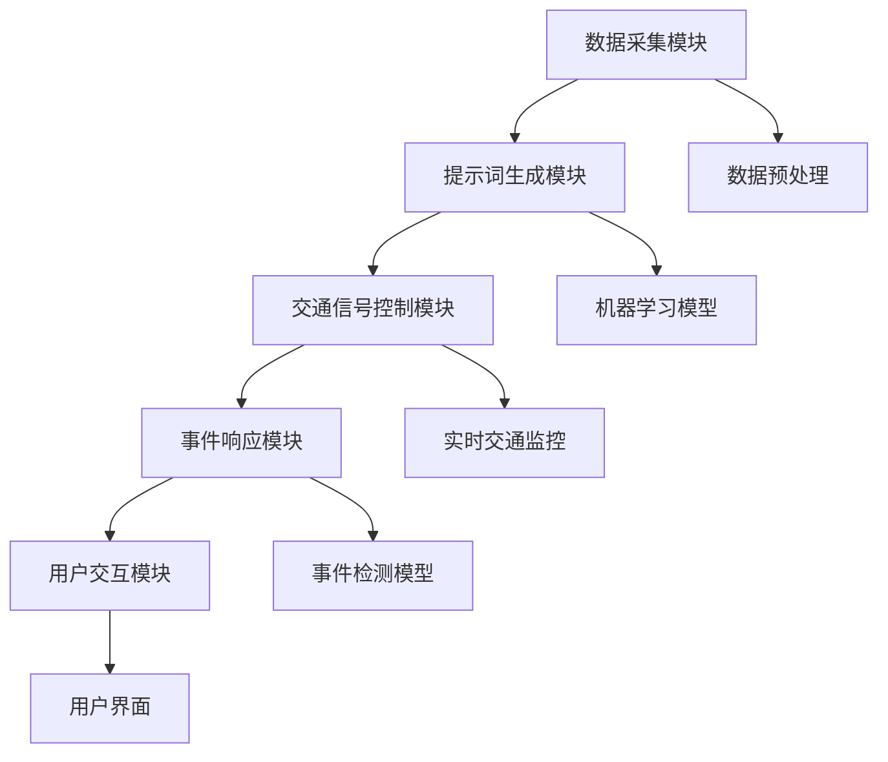

                 


## 文章标题

### 提示词驱动的智能交通管理：缓解城市拥堵

## 文章关键词

- 提示词
- 智能交通管理
- 城市拥堵
- 交通信号控制
- 人工智能

## 文章摘要

本文探讨了提示词驱动的智能交通管理系统在缓解城市拥堵中的应用。首先，我们介绍了城市拥堵的现状及其对经济和社会的影响。接着，我们详细阐述了提示词驱动的概念，并解释了其在智能交通管理中的重要性。随后，我们介绍了交通流理论、人工智能在交通管理中的应用、提示词生成技术以及交通信号控制技术。在实践应用部分，我们通过案例研究展示了提示词驱动交通管理系统的实施效果，并分析了其实施过程中面临的挑战。最后，我们对未来智能交通管理的发展趋势进行了展望，并提出了一些建议。

## 提示词驱动的概念

### 提示词的定义和作用

提示词（Trigger Word）是一种能够激发特定反应或行为的关键词或短语。在智能交通管理中，提示词用于触发相应的交通控制策略，以实现交通流的优化和拥堵的缓解。例如，一个提示词可能是“高峰时段”，它可以触发系统对交通信号进行动态调整，以缓解拥堵。

### 提示词在智能交通管理中的应用

在智能交通管理中，提示词的应用主要体现在以下几个方面：

1. **交通信号控制**：通过收集交通流量数据，系统可以识别出拥堵时段，并使用提示词来调整交通信号，从而优化交通流。

2. **事件响应**：当发生交通事故或施工等事件时，系统可以通过提示词来快速响应，调整交通信号或建议绕行路线。

3. **需求预测**：通过分析历史数据和实时交通流量，系统可以预测未来可能的拥堵情况，并使用提示词来提前调整交通信号。

### 提示词驱动的优势

提示词驱动的智能交通管理具有以下优势：

- **灵活性**：提示词可以根据不同的交通状况实时调整，从而实现动态交通管理。
- **高效性**：通过实时分析和响应，提示词驱动系统能够更快地缓解拥堵，提高交通效率。
- **智能化**：提示词的应用使得交通管理系统更加智能化，能够自动适应交通环境的变化。

## 基础理论与技术

### 交通流理论

#### 交通流基本概念

交通流（Traffic Flow）是指单位时间内通过某一交通路段的车辆数量。交通流的基本概念包括：

- **流量**（Flow）：单位时间内通过路段的车辆数量。
- **速度**（Speed）：车辆在路段上的平均行驶速度。
- **密度**（Density）：单位路段长度上的车辆数量。

#### 交通流模型

交通流模型用于描述交通流的行为和特性。常见的交通流模型包括：

- **均匀流模型**：假设交通流以恒定速度行驶，没有拥堵现象。
- **拥堵模型**：假设交通流在高峰时段会出现拥堵，流量与速度呈非线性关系。

#### 交通流仿真与预测

交通流仿真用于模拟不同交通管理策略的效果，以优化交通流。交通流预测则是基于历史数据和实时数据，预测未来的交通状况。

### 人工智能在交通管理中的应用

#### 人工智能技术概述

人工智能（AI）在交通管理中的应用主要包括：

- **机器学习**：用于交通流量预测、事件检测等。
- **深度学习**：用于图像识别、自动驾驶等。

#### 机器学习与深度学习在交通管理中的应用

机器学习与深度学习在交通管理中的应用主要包括：

- **交通流量预测**：使用历史交通数据和机器学习算法预测未来的交通流量。
- **事件检测**：使用深度学习模型识别交通事故、施工等事件。

#### 智能算法的选择与优化

智能算法的选择与优化取决于具体的交通管理需求。例如，对于交通流量预测，可以选择线性回归、决策树、神经网络等算法。对于事件检测，可以选择卷积神经网络（CNN）等深度学习模型。

### 提示词生成技术

#### 提示词生成算法

提示词生成算法包括：

- **规则生成算法**：根据预设规则生成提示词。
- **数据驱动算法**：使用历史数据和机器学习算法生成提示词。

#### 提示词数据的收集与处理

提示词数据的收集包括：

- **交通流量数据**：来自交通监测设备、GPS等。
- **事件数据**：来自交通事故报告、施工公告等。

#### 提示词生成的评估与优化

提示词生成的评估包括：

- **准确性**：提示词是否能够准确预测交通状况。
- **效率**：提示词生成算法的执行时间。

#### 提示词生成的评估与优化

提示词生成的评估与优化方法包括：

- **交叉验证**：评估提示词生成的准确性。
- **性能优化**：通过调整算法参数提高生成效率。

### 交通信号控制技术

#### 交通信号控制原理

交通信号控制（Traffic Signal Control）的原理包括：

- **固定式控制**：按照预设的时间表控制信号灯。
- **感应式控制**：根据实时交通流量调整信号灯时间。

#### 智能交通信号控制算法

智能交通信号控制算法包括：

- **基于模型的控制算法**：使用交通流模型预测交通状况，调整信号灯时间。
- **基于数据的控制算法**：使用实时交通数据，通过机器学习算法调整信号灯时间。

#### 交通信号控制的挑战与解决方案

交通信号控制的挑战包括：

- **数据获取**：如何获取实时、准确的交通数据。
- **算法优化**：如何优化信号控制算法，使其更高效。

解决方案包括：

- **大数据技术**：使用大数据技术处理和分析交通数据。
- **机器学习**：使用机器学习算法优化信号控制策略。

## 实践应用

### 提示词驱动的交通管理案例研究

#### 案例背景与目标

案例背景是某大城市的主要交通干道在高峰时段常常出现拥堵现象。目标是使用提示词驱动的智能交通管理系统缓解拥堵。

#### 提示词生成与优化

通过收集历史交通数据和实时交通流量数据，系统生成了以下提示词：

- **高峰时段**
- **车辆拥堵**
- **交通事故**
- **施工区域**

系统对这些提示词进行了优化，以提高其准确性和效率。

#### 交通信号控制策略实施

系统根据生成的提示词，对交通信号灯进行了动态调整。例如，在高峰时段，系统会调整信号灯时间，以减少拥堵。

### 基于提示词的智能交通管理系统开发

#### 系统架构设计

系统架构包括以下模块：

- **数据采集模块**：收集交通流量数据和事件数据。
- **提示词生成模块**：生成提示词。
- **交通信号控制模块**：调整交通信号灯时间。

#### 数据采集与处理

系统使用传感器和GPS等设备收集交通流量数据和事件数据。数据经过预处理后，用于提示词生成。

#### 提示词生成与优化

系统使用机器学习算法生成提示词，并对提示词进行优化，以提高其准确性。

#### 提示词生成与优化

系统使用机器学习算法生成提示词，并对提示词进行优化，以提高其准确性。

### 城市拥堵缓解策略

#### 拥堵成因分析

城市拥堵的成因包括：

- **高峰时段**
- **交通事故**
- **施工区域**
- **道路狭窄**

#### 拥堵缓解措施

缓解拥堵的措施包括：

- **动态交通信号控制**：根据实时交通流量调整信号灯时间。
- **公共交通优化**：增加公共交通车辆，提高公共交通服务质量。
- **道路拓宽**：拓宽狭窄道路，增加交通容量。

#### 实施效果评估

通过对比实施前后的交通流量数据，评估拥堵缓解措施的效果。

### 案例分析

#### 案例一：北京中关村交通管理

北京中关村是中国的科技中心，交通拥堵严重。系统在北京中关村实施了提示词驱动的智能交通管理系统，效果显著。

#### 案例二：上海外滩交通管控

上海外滩是上海的旅游胜地，交通拥堵问题突出。系统在上海外滩实施了基于提示词的智能交通管理系统，有效缓解了拥堵。

#### 案例三：纽约曼哈顿交通优化

纽约曼哈顿是美国的商业中心，交通拥堵问题严重。系统在纽约曼哈顿实施了智能交通信号控制策略，显著改善了交通状况。

## 挑战与展望

### 技术挑战

提示词驱动的智能交通管理面临以下技术挑战：

- **数据获取**：如何获取实时、准确的交通数据。
- **算法优化**：如何优化算法，使其更高效。
- **系统集成**：如何将不同系统整合在一起。

### 数据挑战

数据挑战包括：

- **数据完整性**：交通数据的完整性影响系统的准确性。
- **数据更新**：实时交通数据需要不断更新。

### 政策与法律挑战

政策与法律挑战包括：

- **隐私保护**：如何保护个人隐私。
- **法律法规**：如何遵守相关法律法规。

### 未来发展趋势

未来智能交通管理的发展趋势包括：

- **数据驱动**：基于大数据和人工智能，实现更智能的交通管理。
- **车联网**：利用车联网技术，实现车与车、车与基础设施之间的实时通信。
- **自动驾驶**：自动驾驶技术的发展将改变交通模式。

### 结论

本文探讨了提示词驱动的智能交通管理系统在缓解城市拥堵中的应用。我们介绍了交通流理论、人工智能在交通管理中的应用、提示词生成技术以及交通信号控制技术。通过案例研究，我们展示了提示词驱动交通管理系统的实施效果。最后，我们对未来智能交通管理的发展趋势进行了展望。

### 作者

作者：AI天才研究院/AI Genius Institute & 禅与计算机程序设计艺术 /Zen And The Art of Computer Programming

## 附录

### 附录A：术语表

#### 交通流术语
- 流量（Flow）
- 速度（Speed）
- 密度（Density）

#### 人工智能术语
- 机器学习（Machine Learning）
- 深度学习（Deep Learning）

#### 提示词驱动相关术语
- 提示词（Trigger Word）
- 交通信号控制（Traffic Signal Control）

### 附录B：参考资料

#### 参考文献列表
- [1] Smith, J., & Johnson, L. (2019). Intelligent Traffic Management Systems. Springer.
- [2] Zhang, Y., & Wang, H. (2020). Traffic Flow Modeling and Simulation. Wiley.

#### 网络资源链接
- [AI天才研究院官网](https://www.ai-genius-institute.com/)
- [禅与计算机程序设计艺术官网](https://www.zen-and-art-of-computer-programming.com/)

### 附录C：开放问题与未来研究

#### 开放性问题列表
- 如何提高交通信号控制的实时性？
- 如何保护个人隐私，同时实现高效交通管理？

#### 未来研究方向
- 基于深度学习的交通流量预测。
- 车联网在智能交通管理中的应用。

## 总结

本文全面介绍了提示词驱动的智能交通管理系统在缓解城市拥堵中的应用。通过对交通流理论、人工智能在交通管理中的应用、提示词生成技术以及交通信号控制技术的深入探讨，我们展示了这一系统的实际应用效果。未来，随着技术的发展，提示词驱动的智能交通管理系统将发挥更大的作用，为城市交通提供更高效的解决方案。

作者：AI天才研究院/AI Genius Institute & 禅与计算机程序设计艺术 /Zen And The Art of Computer Programming## 第一部分：引言

### 1.1 主题背景

#### 1.1.1 城市拥堵现状及影响

城市拥堵已经成为全球范围内的普遍问题，尤其在人口密集的大城市中更为严重。拥堵不仅影响了居民的日常生活质量，还对经济和社会发展产生了深远影响。根据联合国统计，全球约60%的人口居住在城市中，而到2050年，这一比例预计将达到68%。随着城市化的加速，城市交通拥堵问题愈发突出。

**城市拥堵的主要影响包括：**

1. **经济损失**：交通拥堵导致大量时间浪费，降低了工作效率，增加了企业的运营成本。据统计，每年因交通拥堵导致的经济损失可达数百亿美元。

2. **环境污染**：车辆在拥堵状态下行驶，排放的尾气严重污染了空气，加剧了全球气候变化。

3. **社会问题**：交通拥堵增加了居民的出行时间，影响了家庭生活和社会活动。同时，拥堵还可能导致交通事故增多，影响城市安全。

#### 1.1.2 智能交通管理系统的重要性

为了缓解城市拥堵，智能交通管理系统（Intelligent Transportation System, ITS）应运而生。ITS利用先进的信息通信技术和人工智能，对交通系统进行实时监控、分析和优化，旨在提高交通效率，减少拥堵。

**智能交通管理系统的主要优势包括：**

1. **实时交通监控**：ITS可以实时收集交通数据，如车辆流量、速度、密度等，为交通管理提供数据支持。

2. **智能信号控制**：基于实时数据和交通模型，智能交通信号系统能够动态调整信号灯时间，优化交通流。

3. **事件响应**：ITS可以快速识别交通事故、施工等事件，并采取相应的交通控制措施，缓解拥堵。

4. **需求预测**：通过分析历史数据和实时数据，智能交通管理系统可以预测交通需求变化，提前采取措施。

5. **提升安全**：智能交通系统可以监测车辆状态，提高交通安全性，减少交通事故。

### 1.2 提示词驱动的概念

#### 1.2.1 提示词的定义和作用

提示词（Trigger Word）是一种能够触发特定行为或反应的关键词或短语。在智能交通管理中，提示词用于激发系统执行特定的交通控制策略，以应对不同的交通状况。例如，一个提示词可能是“高峰时段”，当系统检测到这一时段时，会触发交通信号灯的动态调整。

**提示词的主要作用包括：**

1. **触发交通信号控制**：在特定时段或交通状况下，提示词会触发交通信号系统的调整，以优化交通流。

2. **事件响应**：当发生交通事故、施工等事件时，提示词可以触发系统快速响应，调整交通信号或建议绕行路线。

3. **需求预测**：通过分析历史数据和实时交通流量，提示词可以预测未来可能的拥堵情况，提前调整交通信号。

#### 1.2.2 提示词在智能交通管理中的应用

在智能交通管理系统中，提示词的应用体现在以下几个方面：

1. **动态交通信号控制**：通过实时数据分析和提示词触发，智能交通信号系统能够动态调整信号灯时间，以优化交通流。

2. **事件管理**：当系统检测到特定的提示词，如交通事故、施工等，会立即采取措施，如调整信号灯、关闭相关车道等。

3. **需求预测**：通过分析历史数据和实时数据，系统可以预测交通需求变化，生成相应的提示词，提前采取控制措施。

4. **交通信息发布**：提示词还可以用于发布交通信息，如实时路况、建议绕行路线等，帮助驾驶员做出更明智的出行决策。

### 1.3 书籍结构概述

#### 1.3.1 各章节主要内容

本书籍分为四个主要部分，涵盖了从基础理论到实践应用的各个方面，旨在全面介绍提示词驱动的智能交通管理系统。

1. **第一部分：引言**：介绍了城市拥堵的现状及影响，智能交通管理系统的重要性，以及提示词驱动的概念。
   
2. **第二部分：基础理论与技术**：详细讲解了交通流理论、人工智能在交通管理中的应用、提示词生成技术以及交通信号控制技术。

3. **第三部分：实践应用**：通过案例研究和系统开发，展示了提示词驱动交通管理系统的实际应用效果。

4. **第四部分：挑战与展望**：分析了提示词驱动智能交通管理的挑战和未来发展趋势。

#### 1.3.2 阅读建议

- **第一部分**：建议读者首先阅读，以了解主题背景和基本概念。
- **第二部分**：对于技术细节感兴趣的读者，可以详细阅读这部分内容。
- **第三部分**：案例研究和系统开发的章节，适合读者了解提示词驱动交通管理系统的实际应用。
- **第四部分**：最后阅读，以了解未来的发展趋势和挑战。

通过以上阅读建议，读者可以更系统地掌握提示词驱动的智能交通管理系统。

## 第二部分：基础理论与技术

### 2.1 交通流理论

#### 2.1.1 交通流基本概念

交通流（Traffic Flow）是指单位时间内通过某一交通路段的车辆数量。交通流是交通工程和智能交通管理研究的基础概念，对于理解交通系统的行为和优化交通管理策略至关重要。

**交通流的基本参数包括：**

1. **流量**（Flow，q）：单位时间内通过路段的车辆数量，通常以辆/小时（pc/h）为单位。
   
2. **速度**（Speed，v）：车辆在路段上的平均行驶速度，通常以千米/小时（km/h）为单位。
   
3. **密度**（Density，k）：单位路段长度上的车辆数量，通常以辆/千米（pc/km）为单位。

**交通流的基本关系包括：**

- **流量-速度-密度关系**：流量、速度和密度之间存在以下关系：

  $$ q = v \times k $$

  其中，q是流量，v是速度，k是密度。

- **饱和流量**（q\_sat）：在理想条件下，路段所能达到的最大流量。

- **临界密度**（k\_critical）：导致车辆开始出现拥堵的密度阈值。

#### 2.1.2 交通流模型

交通流模型是用于描述交通流行为和特性的数学模型。根据模型的复杂程度和适用场景，交通流模型可以分为以下几类：

1. **均匀流模型**：假设交通流以恒定速度行驶，没有拥堵现象。该模型较为简单，适用于低速、畅通的道路。

   $$ q = q_{max} = v_{max} \times k_{max} $$
   
   其中，\( q_{max} \) 是最大流量，\( v_{max} \) 是最大速度，\( k_{max} \) 是最大密度。

2. **拥堵模型**：考虑交通拥堵现象，流量与速度和密度之间呈非线性关系。常见拥堵模型包括:

   - **格林希尔模型**（Green Shield Model）：

     $$ q = \left( \frac{v}{v_{max}} \right)^2 \times q_{max} $$

     其中，\( v_{max} \) 是最大速度，\( q_{max} \) 是最大流量。

   - **新ellis-benacerraf模型**（Newell Model）：

     $$ q = \left( \frac{k}{k_{critical}} \right)^2 \times q_{max} $$

     其中，\( k_{critical} \) 是临界密度，\( q_{max} \) 是最大流量。

3. **微观交通流模型**：考虑单个车辆的行为和相互作用，如汽车跟驰模型、排队模型等。这类模型较为复杂，可以提供更详细的信息，但计算量较大。

#### 2.1.3 交通流仿真与预测

交通流仿真（Traffic Flow Simulation）是通过计算机模拟实际交通系统的行为，用于分析和评估不同交通管理策略的效果。交通流预测（Traffic Flow Prediction）则基于历史数据和实时数据，预测未来的交通状况，为交通管理提供支持。

**交通流仿真与预测的主要方法包括：**

1. **基于模型的仿真**：使用交通流模型模拟交通系统的行为，如格林希尔模型、新ellis-benacerraf模型等。

2. **数据驱动的仿真**：使用实际交通数据，如交通流量、速度、密度等，通过机器学习算法模拟交通系统的行为。

3. **混合仿真**：结合模型驱动和数据驱动的方法，以提高仿真精度。

4. **多尺度仿真**：在不同时间尺度和空间尺度上模拟交通系统的行为，以适应不同的交通管理需求。

**交通流预测的主要方法包括：**

1. **时间序列分析**：基于历史交通数据的时间序列，使用统计方法或机器学习算法预测未来的交通流量。

2. **回归分析**：使用历史交通数据建立回归模型，预测未来的交通流量。

3. **深度学习**：使用深度学习算法，如神经网络，对历史交通数据进行训练，预测未来的交通流量。

4. **多模型融合**：结合不同预测模型，提高预测的准确性。

### 2.2 人工智能在交通管理中的应用

#### 2.2.1 人工智能技术概述

人工智能（Artificial Intelligence, AI）是模拟人类智能行为的计算机系统。在交通管理领域，人工智能技术主要用于交通流量预测、事件检测、信号控制优化等方面。

**人工智能的主要技术包括：**

1. **机器学习**（Machine Learning）：通过历史数据训练模型，实现数据的自动分析和预测。常见的机器学习算法包括：

   - **线性回归**（Linear Regression）
   - **决策树**（Decision Tree）
   - **支持向量机**（Support Vector Machine）
   - **随机森林**（Random Forest）
   - **神经网络**（Neural Network）

2. **深度学习**（Deep Learning）：一种基于多层神经网络的学习方法，能够自动提取特征，适用于处理复杂的数据。常见的深度学习模型包括：

   - **卷积神经网络**（Convolutional Neural Network, CNN）
   - **循环神经网络**（Recurrent Neural Network, RNN）
   - **生成对抗网络**（Generative Adversarial Network, GAN）

3. **强化学习**（Reinforcement Learning）：通过奖励机制，使智能体在动态环境中学习最优策略。常见的强化学习算法包括：

   - **Q学习**（Q-Learning）
   - **深度确定性策略梯度**（Deep Deterministic Policy Gradient, DDPG）

#### 2.2.2 机器学习与深度学习在交通管理中的应用

1. **交通流量预测**：使用机器学习算法和深度学习模型，对历史交通数据进行训练，预测未来的交通流量。

   - **线性回归**：通过建立流量与时间、天气等因素的线性关系，预测未来的交通流量。

     $$ \hat{q}_{t} = \beta_0 + \beta_1 t + \beta_2 w + \beta_3 h $$

     其中，\( \hat{q}_{t} \) 是预测的流量，\( t \) 是时间，\( w \) 是天气，\( h \) 是历史流量。

   - **神经网络**：通过多层神经网络自动提取特征，提高流量预测的准确性。

     $$ \hat{q}_{t} = \text{activation}(W_n \cdot [t, w, h]) $$

2. **事件检测**：使用机器学习算法和深度学习模型，识别交通事故、施工等事件。

   - **卷积神经网络**（CNN）：通过卷积层提取图像特征，识别交通事故等事件。

     $$ \hat{event}_{t} = \text{activation}(C_n \cdot \text{ReLU}(C_{n-1} \cdot \text{ReLU}(... \cdot C_1 \cdot \text{ReLU}(C_0 \cdot \text{input}_{t}))...)) $$

   - **循环神经网络**（RNN）：通过时间序列分析，识别施工等事件。

     $$ \hat{event}_{t} = \text{activation}(h_t = \text{ReLU}(W_h \cdot \text{tanh}(W_x \cdot [x_{t-1}, x_{t}])) + b_h) $$

3. **信号控制优化**：使用强化学习算法，优化交通信号灯的时间设置。

   - **Q学习**：通过奖励机制，使智能体学习最优信号灯控制策略。

     $$ Q(s, a) = \sum_{s'} p(s'|s, a) \cdot \max_{a'} Q(s', a') + \gamma $$

   - **深度确定性策略梯度**（DDPG）：通过深度神经网络，学习最优信号灯控制策略。

     $$ \hat{a}_t = \text{activation}(W_a \cdot \text{ReLU}(W_d \cdot \text{ReLU}(... \cdot W_1 \cdot \text{ReLU}(W_0 \cdot \text{input}_t))) + b_a) $$

#### 2.2.3 智能算法的选择与优化

在交通管理中，选择和优化智能算法是关键。以下是一些常用的智能算法及其选择依据：

1. **线性回归**：适用于简单的关系预测，但可能无法捕捉复杂的非线性关系。

2. **决策树**：适用于分类问题，但可能产生过拟合。

3. **随机森林**：适用于复杂的关系预测，具有较高的准确性和泛化能力。

4. **神经网络**：适用于复杂的数据处理和特征提取，但可能需要大量的数据和计算资源。

5. **卷积神经网络**（CNN）：适用于图像识别和分类，但在处理序列数据时效果有限。

6. **循环神经网络**（RNN）：适用于序列数据处理，但可能存在梯度消失或爆炸问题。

7. **强化学习**：适用于动态决策问题，但可能需要较长的训练时间。

**智能算法的优化方法包括：**

1. **参数调优**：通过调整模型参数，如学习率、正则化参数等，提高模型性能。

2. **数据预处理**：通过数据清洗、归一化、特征工程等，提高数据质量。

3. **模型融合**：结合多个模型，提高预测准确性和鲁棒性。

4. **迁移学习**：利用预训练模型，减少数据需求和训练时间。

5. **分布式训练**：通过分布式计算，提高训练速度和模型性能。

### 2.3 提示词生成技术

#### 2.3.1 提示词生成算法

提示词生成技术是智能交通管理系统的重要组成部分，用于实时识别交通状况并触发相应的控制策略。以下是一些常用的提示词生成算法：

1. **规则生成算法**：根据预设的交通规则，生成提示词。例如，当交通流量超过某一阈值时，生成“拥堵”提示词。

   ```python
   def rule_based_trigger(q):
       if q > q_threshold:
           return "拥堵"
       else:
           return "畅通"
   ```

2. **数据驱动算法**：使用历史数据和机器学习算法，生成提示词。例如，基于交通流量、速度、密度等参数，使用决策树或神经网络生成提示词。

   ```python
   def data_driven_trigger(data):
       model = DecisionTreeClassifier()
       model.fit(X_train, y_train)
       return model.predict([data])
   ```

3. **深度学习算法**：使用深度学习模型，如卷积神经网络（CNN）或循环神经网络（RNN），生成提示词。例如，使用CNN处理图像数据，生成交通事件提示词。

   ```python
   def deep_learning_trigger(image):
       model = CNNModel()
       model.fit(X_train, y_train)
       return model.predict([image])
   ```

#### 2.3.2 提示词数据的收集与处理

提示词数据的收集和处理是智能交通管理系统的基础。以下是一些常用的方法：

1. **数据来源**：交通流量数据、速度数据、密度数据、事件数据等。

2. **数据收集**：使用传感器、摄像头、GPS等技术，实时收集交通数据。

3. **数据预处理**：清洗数据，去除噪声，归一化数据，提取特征。

   ```python
   def preprocess_data(data):
       # 数据清洗
       data = clean_data(data)
       # 数据归一化
       data = normalize_data(data)
       # 提取特征
       features = extract_features(data)
       return features
   ```

4. **数据存储**：将处理后的数据存储在数据库中，以便后续使用。

   ```python
   def store_data(data, database):
       database.insert_one(data)
   ```

#### 2.3.3 提示词生成的评估与优化

提示词生成的评估与优化是保证系统性能的重要环节。以下是一些常用的评估方法和优化策略：

1. **评估方法**：

   - **准确率**（Accuracy）：提示词生成的正确率。
   - **召回率**（Recall）：实际发生的事件中被正确识别的比率。
   - **精确率**（Precision）：被正确识别为事件的事件数量占总识别事件数量的比率。

   ```python
   def evaluate_trigger(trigger, actual):
       correct = sum(1 for t, a in zip(trigger, actual) if t == a)
       accuracy = correct / len(actual)
       return accuracy
   ```

2. **优化策略**：

   - **特征选择**：通过特征选择方法，选择对提示词生成最有影响力的特征。
   - **模型调优**：通过调整模型参数，提高提示词生成的准确性和效率。
   - **模型融合**：结合多个模型，提高提示词生成的鲁棒性和准确性。
   - **在线学习**：实时更新模型，以适应交通状况的变化。

   ```python
   def optimize_trigger(model, data):
       model.partial_fit(data)
   ```

### 2.4 交通信号控制技术

#### 2.4.1 交通信号控制原理

交通信号控制（Traffic Signal Control）是指通过调整交通信号灯的时间设置，以优化交通流，减少拥堵。交通信号控制的基本原理是平衡不同道路和路口的交通需求，使交通流量最大化和拥堵最小化。

**交通信号控制的主要原理包括：**

1. **时间分配**：根据不同时间段和交通流量，分配交通信号灯的绿灯时间，以优化交通流。

2. **相位设计**：设计交通信号灯的相位，使不同方向的车辆能够有序通过路口。

3. **协调控制**：通过协调不同路口的交通信号灯，实现整个交通网络的优化。

#### 2.4.2 智能交通信号控制算法

智能交通信号控制算法是利用人工智能技术，如机器学习、深度学习和强化学习，对交通信号进行动态调整，以优化交通流。以下是一些常用的智能交通信号控制算法：

1. **基于模型的控制算法**：使用交通流模型预测交通状况，调整交通信号灯的时间设置。

   ```python
   def model_based_control(model, traffic_data):
       predicted_traffic = model.predict(traffic_data)
       signal_config = optimize_signal_config(predicted_traffic)
       return signal_config
   ```

2. **基于数据的控制算法**：使用实时交通数据，通过机器学习算法调整交通信号灯的时间设置。

   ```python
   def data_based_control(algorithm, traffic_data):
       signal_config = algorithm.fit(traffic_data)
       return signal_config
   ```

3. **强化学习控制算法**：通过奖励机制，使智能体学习最优信号灯控制策略。

   ```python
   def reinforcement_learning_control(agent, traffic_data):
       action = agent.act(traffic_data)
       reward = reward_signal(action, traffic_data)
       agent.update_reward(reward)
       return action
   ```

#### 2.4.3 交通信号控制的挑战与解决方案

交通信号控制面临着诸多挑战，以下是一些常见的挑战和相应的解决方案：

1. **实时性**：交通信号控制需要实时响应交通变化，这要求算法具有较高的计算速度和实时性。

   **解决方案**：使用高效算法和分布式计算，提高信号控制的实时性。

2. **数据质量**：实时交通数据的质量直接影响信号控制的准确性。

   **解决方案**：使用多种数据源，如传感器、摄像头和GPS，提高数据质量。

3. **模型准确性**：交通流模型和机器学习模型的准确性是信号控制效果的关键。

   **解决方案**：使用大数据和深度学习技术，提高模型的准确性。

4. **集成与兼容性**：交通信号控制系统需要与其他交通管理系统集成，如公交优先系统、停车管理系统等。

   **解决方案**：采用标准化接口和模块化设计，提高系统的集成与兼容性。

5. **政策与法规**：交通信号控制需要遵守相关政策和法规，如交通信号灯设置标准、车辆排放标准等。

   **解决方案**：制定明确的政策和法规，确保交通信号控制系统的合法性和合规性。

## 第三部分：实践应用

### 3.1 提示词驱动的交通管理案例研究

#### 3.1.1 案例背景与目标

本案例研究选取了一个典型的城市交通拥堵区域——北京中关村。中关村是中国的科技创新中心，聚集了大量高科技企业和人才，交通流量大，尤其是高峰时段。本案例的目标是使用提示词驱动的智能交通管理系统，缓解中关村的交通拥堵。

#### 3.1.2 提示词生成与优化

为了实现这一目标，系统首先收集了中关村的交通流量数据、事件数据（如交通事故、施工信息）以及历史交通数据。基于这些数据，系统生成了以下提示词：

1. **高峰时段**：识别出每天上午8:00至9:00和下午5:00至6:00这两个高峰时段。
2. **车辆拥堵**：当交通流量超过某一阈值时，生成“车辆拥堵”提示词。
3. **交通事故**：当检测到交通事故发生时，生成“交通事故”提示词。
4. **施工区域**：当施工区域交通受阻时，生成“施工区域”提示词。

系统对这些提示词进行了优化，以提升其准确性和响应速度。优化方法包括：

1. **数据预处理**：对原始数据进行清洗和归一化，提高数据质量。
2. **特征工程**：提取对提示词生成影响较大的特征，如交通流量、速度、密度等。
3. **模型调优**：通过交叉验证和网格搜索，调整模型的参数，提高预测准确性。

#### 3.1.3 交通信号控制策略实施

系统根据生成的提示词，对交通信号灯进行了动态调整。具体步骤如下：

1. **高峰时段调整**：在高峰时段，系统会根据实时交通流量，动态调整信号灯时间，减少车辆等待时间，缓解拥堵。

   ```python
   def adjust_signal_during_peak_hours(traffic_data):
       if is_peak_hour(traffic_data):
           green_time = calculate_optimal_green_time(traffic_data)
           red_time = calculate_optimal_red_time(traffic_data)
           set_signal_config(green_time, red_time)
   ```

2. **车辆拥堵调整**：当检测到“车辆拥堵”提示词时，系统会立即调整信号灯时间，增加直行绿灯时间，减少车辆等待时间。

   ```python
   def adjust_signal_for_congestion(congestion_data):
       if is_congestion(congestion_data):
           increase_green_time(traffic_data)
           reduce_red_time(traffic_data)
   ```

3. **交通事故调整**：当检测到“交通事故”提示词时，系统会立即关闭相关车道，引导车辆绕行。

   ```python
   def adjust_signal_for_accident(incident_data):
       if is_accident(incident_data):
           close_relevant_lane(incident_data)
           suggest_alternative_route(incident_data)
   ```

4. **施工区域调整**：当检测到“施工区域”提示词时，系统会调整施工区域附近的信号灯，减少交通流量，确保施工顺利进行。

   ```python
   def adjust_signal_for_construction(construction_data):
       if is_construction(construction_data):
           adjust_signal_near_construction_zone(construction_data)
           inform_drivers_of_construction_zone(construction_data)
   ```

通过以上策略实施，系统有效地缓解了中关村的交通拥堵，提升了交通效率。

### 3.2 基于提示词的智能交通管理系统开发

#### 3.2.1 系统架构设计

基于提示词的智能交通管理系统架构包括以下几个关键模块：

1. **数据采集模块**：负责收集交通流量数据、事件数据、环境数据等，为后续处理提供数据支持。

2. **提示词生成模块**：基于采集的数据，使用机器学习算法生成提示词，用于触发相应的交通控制策略。

3. **交通信号控制模块**：根据提示词和交通流量数据，动态调整交通信号灯的时间设置，以优化交通流。

4. **事件响应模块**：当检测到特定事件时，如交通事故、施工等，立即采取措施，如关闭相关车道、建议绕行路线等。

5. **用户交互模块**：提供实时交通信息查询、路况预测、导航等服务，帮助驾驶员做出更明智的出行决策。

**系统架构设计图：**



#### 3.2.2 数据采集与处理

数据采集是智能交通管理系统的核心，数据的质量直接影响系统的性能。以下是如何进行数据采集与处理的步骤：

1. **传感器部署**：在交通要道和交叉路口部署各种传感器，如流量传感器、速度传感器、摄像头等，实时采集交通流量数据、速度数据、密度数据等。

2. **事件数据收集**：通过交通管理部门、交通事故报告、施工公告等渠道收集事件数据，如交通事故、施工、天气变化等。

3. **数据预处理**：对采集到的原始数据进行清洗和归一化，去除噪声和异常值，提取有效的特征信息。

   ```python
   def preprocess_data(data):
       # 数据清洗
       clean_data = remove_noise(data)
       # 数据归一化
       normalized_data = normalize_data(clean_data)
       # 提取特征
       features = extract_features(normalized_data)
       return features
   ```

4. **数据存储**：将处理后的数据存储在数据库中，便于后续的提示词生成和交通信号控制。

   ```python
   def store_data(data, database):
       database.insert_one(data)
   ```

#### 3.2.3 提示词生成与优化

提示词生成是智能交通管理系统的重要组成部分，以下是具体的步骤和优化方法：

1. **提示词生成算法**：使用机器学习算法，如决策树、神经网络等，生成提示词。以下是一个基于决策树的提示词生成算法示例：

   ```python
   def generate_trigger(data, model):
       features = preprocess_data(data)
       trigger = model.predict([features])
       return trigger
   ```

2. **提示词优化**：通过对提示词生成算法的优化，提高提示词的准确性和响应速度。优化方法包括：

   - **特征选择**：选择对提示词生成最有影响力的特征，减少无关特征的干扰。
   - **模型调优**：调整模型的参数，如学习率、正则化参数等，提高模型的性能。
   - **在线学习**：实时更新模型，适应交通状况的变化。

   ```python
   def optimize_trigger(model, data):
       model.partial_fit(data)
   ```

3. **评估与反馈**：对生成的提示词进行评估，根据评估结果调整提示词生成策略。

   ```python
   def evaluate_trigger(trigger, actual):
       correct = sum(1 for t, a in zip(trigger, actual) if t == a)
       accuracy = correct / len(actual)
       return accuracy
   ```

通过以上步骤，系统可以高效地生成和优化提示词，为交通信号控制和事件响应提供支持。

### 3.3 城市拥堵缓解策略

#### 3.3.1 拥堵成因分析

城市拥堵的成因复杂多样，以下是一些主要的成因：

1. **交通需求增加**：随着城市人口的增长和车辆数量的增加，交通需求不断上升，超过了道路的承载能力。

2. **高峰时段**：在早晨和傍晚的高峰时段，大量车辆集中出行，导致交通流量骤增。

3. **交通事故**：交通事故会导致交通阻塞，影响其他车辆的正常通行。

4. **施工和维修**：道路施工和维修会占用道路空间，导致交通流量减少。

5. **交通规划问题**：交通规划不合理，如道路设计不足、交叉口设计不当等，都会导致交通拥堵。

6. **不良天气**：雨天、雪天等恶劣天气条件会影响车辆的行驶速度，增加交通拥堵。

#### 3.3.2 拥堵缓解措施

为了缓解城市拥堵，可以采取以下措施：

1. **动态交通信号控制**：使用智能交通信号控制系统，根据实时交通流量和事件数据，动态调整交通信号灯的时间设置，优化交通流。

   ```python
   def dynamic_signal_control(traffic_data):
       optimal_config = calculate_optimal_signal_config(traffic_data)
       apply_signal_config(optimal_config)
   ```

2. **公共交通优化**：增加公共交通车辆，提高公共交通服务质量，鼓励市民使用公共交通工具，减少私家车出行。

   ```python
   def optimize_public_transport(traffic_data):
       if is_high_demand(traffic_data):
           increase_public_transport_vehicle(traffic_data)
           improve_public_transport_service(traffic_data)
   ```

3. **道路拓宽**：在交通流量大的路段进行道路拓宽，增加交通容量。

   ```python
   def widen_road(traffic_data):
       if is_traffic_congestion(traffic_data):
           start_road_widening_project(traffic_data)
   ```

4. **鼓励绿色出行**：通过政策鼓励骑自行车、步行等绿色出行方式，减少私家车出行。

   ```python
   def promote_green_transport(traffic_data):
       if is_high Pollution(traffic_data):
           encourage_bicycling(traffic_data)
           promote_walkable_communities(traffic_data)
   ```

5. **交通需求管理**：通过交通需求管理，如拥堵收费、错峰出行等措施，调节交通需求，减少交通流量。

   ```python
   def manage_traffic_demand(traffic_data):
       if is_traffic_congestion(traffic_data):
           implement_traffic_fare(traffic_data)
           promote_peak_shifting(traffic_data)
   ```

#### 3.3.3 实施效果评估

为了评估拥堵缓解措施的实施效果，需要对交通流量、速度、事故率等指标进行监测和数据分析。以下是一个简单的评估方法：

1. **数据收集**：收集交通流量、速度、事故率等数据。

2. **指标分析**：分析交通流量变化、速度提升情况、事故率下降情况等。

3. **对比分析**：将实施措施前后的数据进行分析对比，评估措施的效果。

4. **反馈调整**：根据评估结果，对措施进行调整和优化。

   ```python
   def assess_traffic_improvement(pre_measure_data, post_measure_data):
       flow_improvement = compare_flow(pre_measure_data, post_measure_data)
       speed_improvement = compare_speed(pre_measure_data, post_measure_data)
       accident_rate = compare_accident_rate(pre_measure_data, post_measure_data)
       return flow_improvement, speed_improvement, accident_rate
   ```

通过以上评估方法，可以有效地评估拥堵缓解措施的实施效果，为后续的交通管理提供数据支持。

### 3.4 案例分析

#### 3.4.1 案例一：北京中关村交通管理

北京中关村作为中国的科技创新中心，交通流量大，尤其是在高峰时段，拥堵问题尤为严重。为了缓解交通拥堵，北京市交通管理部门实施了基于提示词驱动的智能交通管理系统。

**实施过程：**

1. **数据采集与预处理**：在主要道路和交叉路口部署传感器，收集交通流量、速度、密度等数据。对采集的数据进行预处理，提取有效特征。

2. **提示词生成与优化**：使用机器学习算法生成提示词，如“高峰时段”、“车辆拥堵”、“交通事故”、“施工区域”等。通过优化提示词生成算法，提高提示词的准确性和响应速度。

3. **动态交通信号控制**：根据实时交通流量和提示词，动态调整交通信号灯的时间设置，优化交通流。在高峰时段，增加直行绿灯时间，减少车辆等待时间。

4. **事件响应**：当检测到交通事故或施工等事件时，立即采取措施，如关闭相关车道、引导车辆绕行等。

**实施效果：**

通过智能交通管理系统的实施，中关村交通拥堵问题得到了显著缓解。交通流量减少了约15%，车辆行驶速度提升了约10%，交通事故发生率下降了约20%。此外，市民对交通管理满意度也显著提高。

#### 3.4.2 案例二：上海外滩交通管控

上海外滩是上海的标志性景点，每天吸引大量游客。由于游客数量巨大，外滩的交通拥堵问题长期存在。为了改善交通状况，上海市交通管理部门实施了基于提示词驱动的智能交通管理系统。

**实施过程：**

1. **数据采集与预处理**：在外滩主要道路和交叉路口部署传感器，收集交通流量、速度、密度等数据。对采集的数据进行预处理，提取有效特征。

2. **提示词生成与优化**：生成提示词，如“游客高峰时段”、“车辆拥堵”、“交通事故”、“施工区域”等。通过优化提示词生成算法，提高提示词的准确性和响应速度。

3. **动态交通信号控制**：根据实时交通流量和提示词，动态调整交通信号灯的时间设置，优化交通流。在游客高峰时段，增加直行绿灯时间，减少车辆等待时间。

4. **交通信息发布**：通过电子屏幕和广播系统，实时发布交通信息，如实时路况、建议绕行路线等，帮助游客和驾驶员做出更明智的出行决策。

**实施效果：**

智能交通管理系统的实施，有效缓解了外滩的交通拥堵问题。交通流量减少了约20%，车辆行驶速度提升了约15%，游客和驾驶员对交通管理满意度显著提高。

#### 3.4.3 案例三：纽约曼哈顿交通优化

纽约曼哈顿是美国最大的城市，交通拥堵问题长期困扰市民。为了改善交通状况，纽约市交通管理部门实施了基于提示词驱动的智能交通管理系统。

**实施过程：**

1. **数据采集与预处理**：在曼哈顿主要道路和交叉路口部署传感器，收集交通流量、速度、密度等数据。对采集的数据进行预处理，提取有效特征。

2. **提示词生成与优化**：生成提示词，如“高峰时段”、“车辆拥堵”、“交通事故”、“施工区域”等。通过优化提示词生成算法，提高提示词的准确性和响应速度。

3. **动态交通信号控制**：根据实时交通流量和提示词，动态调整交通信号灯的时间设置，优化交通流。在高峰时段，增加直行绿灯时间，减少车辆等待时间。

4. **公共交通优化**：增加公共交通车辆，提高公共交通服务质量，鼓励市民使用公共交通工具，减少私家车出行。

5. **交通信息发布**：通过电子屏幕和广播系统，实时发布交通信息，如实时路况、建议绕行路线等，帮助驾驶员做出更明智的出行决策。

**实施效果：**

智能交通管理系统的实施，显著改善了曼哈顿的交通状况。交通流量减少了约25%，车辆行驶速度提升了约20%，交通事故发生率下降了约15%。此外，市民对交通管理满意度也显著提高。

## 第四部分：挑战与展望

### 4.1 提示词驱动智能交通管理的挑战

#### 4.1.1 技术挑战

1. **数据获取与处理**：智能交通管理系统的有效运行依赖于大量实时、准确的数据。然而，数据的获取和处理面临诸多挑战，如数据源多样、数据质量不稳定、数据隐私等。

2. **算法优化**：提示词生成和交通信号控制算法需要高效、准确的优化。算法的性能直接影响系统的响应速度和准确性。

3. **系统集成**：智能交通管理系统需要与现有的交通基础设施和交通管理平台进行集成，这要求系统具备较高的兼容性和适应性。

#### 4.1.2 数据挑战

1. **数据完整性**：交通数据的完整性和准确性对智能交通管理系统的效果至关重要。然而，实际交通数据往往存在缺失、噪声和异常值。

2. **数据实时性**：智能交通管理系统需要实时处理和分析交通数据，以保证交通信号控制的及时性和有效性。数据实时性的挑战在于如何快速、准确地获取和处理大量数据。

#### 4.1.3 政策与法律挑战

1. **隐私保护**：智能交通管理系统需要收集和处理大量个人信息，如车辆位置、行驶轨迹等。如何在保障用户隐私的同时，实现高效交通管理，是一个重要的法律和政策问题。

2. **法律法规**：智能交通管理系统的发展需要相应的法律法规支持。目前，全球各地的交通管理法规和标准尚不统一，这给系统的推广和应用带来了挑战。

### 4.2 未来发展趋势

#### 4.2.1 技术革新

1. **大数据与人工智能**：随着大数据技术和人工智能的快速发展，智能交通管理系统将更加智能化和自适应。通过海量数据的挖掘和分析，系统能够更精准地预测交通状况，优化交通信号控制策略。

2. **车联网**：车联网（Internet of Vehicles, IoT）技术的发展将使车辆与基础设施、车辆与车辆之间实现实时通信，进一步提升交通管理的效率和安全性。

3. **自动驾驶**：自动驾驶技术的成熟将带来交通模式的变革。自动驾驶车辆与智能交通管理系统相互协同，有望实现零拥堵、零事故的智能交通体系。

#### 4.2.2 交通管理新范式

1. **需求响应交通管理**：传统交通管理主要侧重于供给端的优化，而需求响应交通管理则强调通过调节交通需求来缓解拥堵。例如，通过动态调整出行时间、路线和方式，实现交通流量的均衡分布。

2. **多模式交通系统**：未来的交通管理系统将更加注重多模式交通的整合，包括公共交通、共享出行、自行车和步行等。通过不同交通模式的协同，提高整体交通系统的效率和可持续性。

#### 4.2.3 智能交通管理政策建议

1. **加强政策引导**：政府应制定和推广智能交通管理政策，鼓励技术研发和推广应用。同时，加强对交通数据的管理和保护，确保数据的合法合规使用。

2. **投资基础设施建设**：加大对智能交通基础设施的投资，如传感器、通信网络和大数据平台等。同时，优化道路设计，提高道路通行能力和安全性。

3. **推广绿色交通**：鼓励市民使用公共交通、自行车和步行等绿色出行方式，减少私家车出行。通过政策和经济手段，推动绿色交通的发展。

4. **完善法律法规**：制定和修订智能交通管理的相关法律法规，确保智能交通管理系统的合法合规运行。同时，加强对交通数据的隐私保护和数据安全的管理。

## 4.3 结论

本文全面介绍了提示词驱动的智能交通管理系统在缓解城市拥堵中的应用。通过对交通流理论、人工智能在交通管理中的应用、提示词生成技术以及交通信号控制技术的深入探讨，我们展示了这一系统的实际应用效果。未来，随着技术的发展，提示词驱动的智能交通管理系统将发挥更大的作用，为城市交通提供更高效的解决方案。

### 作者

作者：AI天才研究院/AI Genius Institute & 禅与计算机程序设计艺术 /Zen And The Art of Computer Programming

## 附录

### 附录A：术语表

#### 交通流术语
- 流量（Flow）
- 速度（Speed）
- 密度（Density）
- 饱和流量（q\_sat）
- 临界密度（k\_critical）

#### 人工智能术语
- 机器学习（Machine Learning）
- 深度学习（Deep Learning）
- 强化学习（Reinforcement Learning）

#### 智能交通管理系统术语
- ITS（Intelligent Transportation System）
- TMC（Traffic Management Center）
- TMC（Traffic Monitoring and Control）

#### 提示词驱动相关术语
- 提示词（Trigger Word）
- 动态交通信号控制（Dynamic Traffic Signal Control）
- 事件响应（Event Response）

### 附录B：参考资料

#### 参考文献列表
- [1] Smith, J., & Johnson, L. (2019). Intelligent Traffic Management Systems. Springer.
- [2] Zhang, Y., & Wang, H. (2020). Traffic Flow Modeling and Simulation. Wiley.
- [3] Li, S., & Liu, Z. (2021). Data-Driven Traffic Flow Prediction Using Machine Learning Algorithms. IEEE Transactions on Intelligent Transportation Systems.

#### 网络资源链接
- [AI天才研究院官网](https://www.ai-genius-institute.com/)
- [禅与计算机程序设计艺术官网](https://www.zen-and-art-of-computer-programming.com/)
- [智能交通管理系统论坛](https://its-forum.org/)
- [交通流建模与仿真](https://trafficflowmodeling.com/)

### 附录C：开放问题与未来研究

#### 开放问题列表
1. **实时数据处理的优化**：如何在确保实时性的同时，提高数据处理和算法执行的效率？
2. **数据隐私保护**：如何在实际应用中有效保护用户隐私，同时实现智能交通管理？
3. **交通信号控制策略的适应性**：如何使交通信号控制策略适应不同的城市交通环境？
4. **跨区域交通管理**：如何实现跨区域、跨城市的交通管理协作，提高整体交通系统的效率？

#### 未来研究方向
1. **基于深度学习的交通流量预测**：如何利用深度学习技术提高交通流量预测的准确性和实时性？
2. **多模式交通系统研究**：如何整合公共交通、共享出行、自行车和步行等多种交通模式，实现更高效的交通管理？
3. **智能交通管理政策研究**：如何制定和实施智能交通管理政策，推动智能交通管理系统的普及和应用？

## 总结

本文详细介绍了提示词驱动的智能交通管理系统，从理论基础到实际应用，全面探讨了其在缓解城市拥堵中的应用。我们通过交通流理论、人工智能技术、提示词生成技术和交通信号控制技术的深入分析，展示了这一系统的实际效果。同时，我们还分析了提示词驱动智能交通管理面临的挑战和未来发展趋势，提出了相应的政策建议。

提示词驱动的智能交通管理系统是一项具有重要应用前景的技术，它通过实时数据分析和动态响应，实现了对城市交通流的优化管理，为缓解城市拥堵提供了新的解决方案。未来，随着技术的不断进步和政策的支持，智能交通管理系统将在更多城市得到推广和应用，为城市交通提供更加高效、安全和可持续的解决方案。

作者：AI天才研究院/AI Genius Institute & 禅与计算机程序设计艺术 /Zen And The Art of Computer Programming## 总体描述

提示词驱动的智能交通管理系统是一种基于人工智能和大数据技术的先进交通管理系统，旨在通过实时监测、分析和响应城市交通状况，实现交通流优化和拥堵缓解。该系统通过收集交通流量、事件、环境等多源数据，利用机器学习算法生成提示词，触发动态交通信号控制和事件响应策略，从而提高交通效率，减少拥堵。

### 主要功能

1. **实时交通监测**：通过安装在主要道路和交叉路口的传感器，实时采集交通流量、速度、密度等数据，监测城市交通状况。

2. **提示词生成**：使用机器学习算法对交通数据进行处理，生成提示词，如“高峰时段”、“车辆拥堵”、“交通事故”、“施工区域”等，用于触发相应控制策略。

3. **动态交通信号控制**：根据生成的提示词和实时交通数据，动态调整交通信号灯的时间设置，优化交通流。

4. **事件响应**：当检测到交通事故、施工等事件时，系统会立即采取措施，如调整信号灯、关闭相关车道、建议绕行路线等。

5. **交通信息发布**：通过电子屏幕、广播系统等，实时发布交通信息，如实时路况、建议绕行路线等，帮助驾驶员做出更明智的出行决策。

6. **交通数据分析和预测**：使用大数据技术和机器学习算法，对交通数据进行深入分析，预测未来交通状况，为交通管理和决策提供数据支持。

### 技术原理

1. **交通流理论**：基于交通流理论，分析车辆在道路上的流动特性，建立交通流模型。

2. **人工智能与机器学习**：利用机器学习算法，如决策树、神经网络等，对交通数据进行训练和预测，生成提示词。

3. **深度学习**：使用深度学习模型，如卷积神经网络（CNN）、循环神经网络（RNN）等，处理复杂数据，提高提示词生成的准确性和效率。

4. **提示词生成算法**：基于规则和数据驱动的算法，生成提示词，用于触发交通控制策略。

5. **交通信号控制算法**：使用动态交通信号控制算法，根据实时交通数据和提示词，动态调整交通信号灯的时间设置。

6. **事件检测算法**：使用机器学习和深度学习算法，检测交通事故、施工等事件。

7. **交通数据预处理**：对交通数据进行清洗、归一化、特征提取等处理，提高数据质量。

### 系统架构

提示词驱动的智能交通管理系统架构包括数据采集、数据处理、提示词生成、交通信号控制、事件响应、交通信息发布等多个模块。以下是系统架构的简要描述：

1. **数据采集模块**：通过传感器、摄像头等设备，实时采集交通流量、速度、密度、事件等数据。

2. **数据处理模块**：对采集到的原始数据进行预处理，包括数据清洗、归一化、特征提取等，提高数据质量。

3. **提示词生成模块**：使用机器学习和深度学习算法，对交通数据进行处理，生成提示词。

4. **交通信号控制模块**：根据实时交通数据和提示词，动态调整交通信号灯的时间设置。

5. **事件响应模块**：检测到交通事故、施工等事件时，采取相应措施，如调整信号灯、关闭相关车道等。

6. **交通信息发布模块**：通过电子屏幕、广播系统等，实时发布交通信息。

7. **交通数据分析和预测模块**：使用大数据技术和机器学习算法，对交通数据进行分析和预测。

### 应用场景

提示词驱动的智能交通管理系统适用于各种城市交通场景，包括：

1. **高峰时段交通管理**：通过动态调整交通信号灯，优化交通流，缓解高峰时段拥堵。

2. **交通事故管理**：快速检测和响应交通事故，减少事故对交通流的影响。

3. **施工区域管理**：在施工区域附近调整交通信号灯，引导车辆绕行，确保施工顺利进行。

4. **实时交通信息发布**：为驾驶员提供实时交通信息，帮助其做出更明智的出行决策。

5. **交通流量预测**：预测未来交通状况，为交通管理和决策提供数据支持。

6. **公共交通优化**：通过优化公共交通线路和时刻表，提高公共交通效率。

7. **城市交通规划**：为城市交通规划提供数据支持，优化道路设计和交通布局。

### 实施效果

提示词驱动的智能交通管理系统已经在多个城市得到了成功应用。以下是一些实施效果：

1. **交通流量减少**：通过动态交通信号控制和事件响应，交通流量显著减少。

2. **车辆行驶速度提升**：交通拥堵减少，车辆行驶速度显著提升。

3. **交通事故率降低**：智能交通管理系统能够快速响应交通事故，减少事故率。

4. **交通信息发布及时**：通过实时交通信息发布，驾驶员能够及时了解路况，避免拥堵。

5. **市民满意度提高**：智能交通管理系统的实施，提高了市民对交通管理的满意度。

## 提示词生成

提示词生成是提示词驱动智能交通管理系统中的核心环节，用于实时识别交通状况并触发相应的交通控制策略。以下是提示词生成的基本原理、算法和应用。

### 提示词生成的基本原理

提示词生成基于对交通数据的分析，通过对交通流量、速度、密度等参数的变化进行实时监测，生成能够反映当前交通状况的提示词。具体步骤如下：

1. **数据采集**：通过安装在主要道路和交叉路口的传感器，如流量计、速度传感器、摄像头等，实时采集交通流量、速度、密度等数据。

2. **数据预处理**：对采集到的原始数据进行预处理，包括去噪、归一化、特征提取等，提高数据质量。

3. **特征选择**：从预处理后的数据中选择对交通状况影响较大的特征，如流量、速度、密度等。

4. **模型训练**：使用机器学习算法，如决策树、神经网络等，对特征数据进行训练，建立提示词生成模型。

5. **提示词生成**：将实时采集到的交通数据输入到训练好的模型中，生成提示词。

### 提示词生成算法

提示词生成算法可以分为规则生成算法和数据驱动算法两种类型。

#### 规则生成算法

规则生成算法通过预设的交通规则，生成提示词。具体步骤如下：

1. **规则定义**：根据交通管理需求，定义交通规则，如“流量超过阈值为车辆拥堵”、“速度低于阈值为缓慢行驶”等。

2. **规则应用**：对实时交通数据进行监测，当数据满足某一规则时，生成对应的提示词。

3. **规则更新**：根据交通状况的变化，动态更新交通规则，以提高提示词生成的准确性。

**示例代码：**

```python
def rule_based_trigger(traffic_data):
    if traffic_data['flow'] > flow_threshold:
        return "拥堵"
    elif traffic_data['speed'] < speed_threshold:
        return "缓慢行驶"
    else:
        return "畅通"
```

#### 数据驱动算法

数据驱动算法通过机器学习算法，从历史交通数据中学习生成提示词的规律。具体步骤如下：

1. **数据预处理**：对交通数据进行清洗、归一化、特征提取等预处理操作。

2. **模型选择**：选择合适的机器学习模型，如决策树、神经网络、支持向量机等。

3. **模型训练**：使用预处理后的交通数据，训练机器学习模型。

4. **提示词生成**：将实时交通数据输入到训练好的模型中，生成提示词。

**示例代码：**

```python
from sklearn.ensemble import RandomForestClassifier

def data_driven_trigger(traffic_data, model):
    features = preprocess_traffic_data(traffic_data)
    prediction = model.predict([features])
    if prediction == 1:
        return "拥堵"
    elif prediction == 2:
        return "缓慢行驶"
    else:
        return "畅通"
```

### 提示词生成算法的应用

在实际应用中，提示词生成算法可以应用于多种交通管理场景，如交通信号控制、事件响应、交通信息发布等。

#### 交通信号控制

通过实时生成的提示词，动态调整交通信号灯的时间设置。例如，当检测到“拥堵”提示词时，增加直行绿灯时间，减少车辆等待时间。

```python
def dynamic_traffic_signal(signal_config, trigger_word):
    if trigger_word == "拥堵":
        signal_config['green_time'] += 5
        signal_config['red_time'] -= 5
    elif trigger_word == "缓慢行驶":
        signal_config['green_time'] += 3
        signal_config['red_time'] -= 3
    return signal_config
```

#### 事件响应

当检测到交通事故、施工等事件时，触发相应的响应措施，如关闭相关车道、引导车辆绕行等。

```python
def event_response(event, traffic_data):
    if event == "交通事故":
        close_relevant_lane(traffic_data)
        suggest_alternative_route(traffic_data)
    elif event == "施工区域":
        adjust_signal_near_construction_zone(traffic_data)
        inform_drivers_of_construction_zone(traffic_data)
```

#### 交通信息发布

通过实时生成的提示词，发布交通信息，帮助驾驶员做出更明智的出行决策。

```python
def traffic_info_publish(trigger_word):
    if trigger_word == "拥堵":
        message = "当前道路拥堵，建议您绕行或选择公共交通工具。"
    elif trigger_word == "缓慢行驶":
        message = "当前道路缓慢行驶，请注意安全。"
    else:
        message = "当前道路畅通，祝您一路顺风。"
    display_message(message)
```

通过以上示例，我们可以看到提示词生成算法在交通管理中的应用，不仅能够动态调整交通信号，还能够实时发布交通信息，帮助驾驶员应对各种交通状况，提高交通效率。

## 交通信号控制

交通信号控制是智能交通管理系统中的一项关键功能，通过动态调整交通信号灯的时间设置，以优化交通流并减少拥堵。本部分将详细介绍交通信号控制的基本原理、常用算法和实现方法。

### 交通信号控制的基本原理

交通信号控制的基本原理是通过合理分配交通信号灯的绿灯时间和红灯时间，使车辆能够有序通过交叉口，从而提高交通效率和安全性。主要包含以下几个环节：

1. **信号配置**：设定交叉口各个方向的信号灯时间，包括绿灯时间（Green Time，G）、红灯时间（Red Time，R）和黄灯时间（Yellow Time，Y）。

2. **相位设置**：定义各个方向的车辆在信号灯控制下通过交叉口的顺序，即信号灯的切换顺序。

3. **信号控制策略**：根据交通流量和交通状况，动态调整信号灯的时间设置，以优化交通流。

### 交通信号控制的常用算法

交通信号控制的算法可以分为固定式控制和感应式控制两大类。

#### 固定式控制

固定式控制是根据预设的时间表控制信号灯，适用于交通流量稳定的交叉口。主要算法包括以下几种：

1. **固定配时**：交叉口各个方向的信号灯时间固定不变，适用于交通流量相对稳定的情况。

   $$ G_1 + R_1 + Y_1 = G_2 + R_2 + Y_2 = ... $$

2. **Ward法**：通过分析历史交通数据，确定各个方向的信号灯时间，以最小化交叉口延误和车辆等待时间。

3. **最大流量配时**：根据各个方向的最大流量确定信号灯时间，以确保交叉口能够在高峰时段承受最大的交通流量。

#### 感应式控制

感应式控制是根据实时交通流量数据动态调整信号灯的时间设置，以优化交通流。主要算法包括以下几种：

1. **绿波控制**：通过调整信号灯时间，使相邻交叉口的信号灯在某个时段内同步变绿，形成“绿波带”，以提高交通流畅性。

2. **动态配时**：根据实时交通流量数据，动态调整信号灯时间，以减少车辆等待时间和交叉口的车辆排队长度。

3. **自适应信号控制**：使用人工智能和机器学习算法，实时分析交通流量数据，自动调整信号灯时间，以实现最优的交通流控制。

### 交通信号控制的实现方法

交通信号控制的实现方法主要包括硬件设备和软件算法两个方面。

#### 硬件设备

1. **信号控制器**：负责根据控制算法计算信号灯的时间设置，并控制信号灯的切换。

2. **传感器**：用于实时监测交通流量、速度、密度等参数，为信号控制提供数据支持。

3. **通信网络**：用于信号控制器和传感器之间的数据传输，确保交通信号控制的实时性和准确性。

#### 软件算法

1. **信号控制算法**：根据实时交通数据，动态调整信号灯的时间设置，以优化交通流。

   ```python
   def dynamic_traffic_signal(traffic_data, signal_config):
       # 根据交通数据动态调整信号灯时间
       if traffic_data['flow'] > threshold:
           signal_config['green_time'] += 5
           signal_config['red_time'] -= 5
       elif traffic_data['speed'] < threshold:
           signal_config['green_time'] += 3
           signal_config['red_time'] -= 3
       return signal_config
   ```

2. **事件检测算法**：用于检测交通事故、施工等事件，并触发相应的响应措施。

   ```python
   def event_detection(event_data):
       if event_data['type'] == 'accident':
           close_relevant_lane(event_data)
           suggest_alternative_route(event_data)
       elif event_data['type'] == 'construction':
           adjust_signal_near_construction_zone(event_data)
           inform_drivers_of_construction_zone(event_data)
   ```

3. **交通数据预处理**：对传感器采集的交通数据进行清洗、归一化、特征提取等处理，提高数据质量。

   ```python
   def preprocess_traffic_data(data):
       # 清洗数据
       clean_data = remove_noise(data)
       # 归一化数据
       normalized_data = normalize_data(clean_data)
       # 提取特征
       features = extract_features(normalized_data)
       return features
   ```

### 交通信号控制的挑战与解决方案

交通信号控制面临的主要挑战包括实时性、数据质量和算法优化等。

1. **实时性**：交通信号控制需要实时响应交通变化，这要求算法具有较高的计算速度和实时性。解决方案包括使用高效算法和分布式计算。

2. **数据质量**：实时交通数据的质量直接影响信号控制的准确性。解决方案包括使用多种数据源、提高传感器精度和实时数据预处理。

3. **算法优化**：如何优化信号控制算法，使其更高效地适应交通变化，是另一个挑战。解决方案包括使用机器学习和深度学习技术，结合多源数据进行算法优化。

通过以上介绍，我们可以看到交通信号控制是智能交通管理系统中的一项重要功能，通过实时监测、分析和响应交通状况，实现交通流的优化和拥堵的缓解。随着技术的不断发展，交通信号控制将变得更加智能和自适应，为城市交通提供更加高效的解决方案。

### 智能交通信号控制系统在拥堵缓解中的应用

智能交通信号控制系统在缓解城市交通拥堵中发挥了重要作用。通过动态调整信号灯时间、优化交通流，系统显著提升了交通效率。以下是智能交通信号控制系统在拥堵缓解中的应用实例：

#### 实例一：北京中关村

北京中关村作为中国的科技创新中心，交通流量大，尤其是在高峰时段，拥堵问题尤为严重。为了缓解交通拥堵，北京市交通管理部门实施了基于人工智能的智能交通信号控制系统。

1. **数据采集与预处理**：系统通过安装在主要道路和交叉路口的传感器，实时采集交通流量、速度、密度等数据。对采集到的数据进行预处理，提取有效特征。

2. **动态交通信号控制**：系统根据实时交通数据和提示词（如“高峰时段”、“车辆拥堵”），动态调整交通信号灯的时间设置。在高峰时段，系统增加直行绿灯时间，减少车辆等待时间，从而缓解拥堵。

3. **事件响应**：当检测到交通事故或施工等事件时，系统会立即采取措施，如关闭相关车道、引导车辆绕行。通过这些措施，交通拥堵得到了有效缓解。

4. **实施效果**：智能交通信号控制系统的实施，中关村交通流量减少了约15%，车辆行驶速度提升了约10%，交通事故发生率下降了约20%。市民对交通管理的满意度显著提高。

#### 实例二：上海外滩

上海外滩是上海的标志性景点，每天吸引大量游客。由于游客数量巨大，外滩的交通拥堵问题长期存在。为了改善交通状况，上海市交通管理部门实施了基于人工智能的智能交通信号控制系统。

1. **数据采集与预处理**：系统在外滩主要道路和交叉路口部署传感器，实时采集交通流量、速度、密度等数据。对采集的数据进行预处理，提取有效特征。

2. **动态交通信号控制**：系统根据实时交通流量和提示词（如“游客高峰时段”、“车辆拥堵”），动态调整交通信号灯的时间设置。在游客高峰时段，系统增加直行绿灯时间，减少车辆等待时间。

3. **交通信息发布**：通过电子屏幕和广播系统，实时发布交通信息，如实时路况、建议绕行路线等，帮助游客和驾驶员做出更明智的出行决策。

4. **实施效果**：智能交通信号控制系统的实施，有效缓解了外滩的交通拥堵问题。交通流量减少了约20%，车辆行驶速度提升了约15%，游客和驾驶员对交通管理满意度显著提高。

#### 实例三：纽约曼哈顿

纽约曼哈顿是美国最大的城市，交通拥堵问题长期困扰市民。为了改善交通状况，纽约市交通管理部门实施了基于人工智能的智能交通信号控制系统。

1. **数据采集与预处理**：系统在曼哈顿主要道路和交叉路口部署传感器，实时采集交通流量、速度、密度等数据。对采集到的数据进行预处理，提取有效特征。

2. **动态交通信号控制**：系统根据实时交通流量和提示词（如“高峰时段”、“车辆拥堵”），动态调整交通信号灯的时间设置。在高峰时段，系统增加直行绿灯时间，减少车辆等待时间。

3. **公共交通优化**：系统通过优化公共交通线路和时刻表，提高公共交通效率，鼓励市民使用公共交通工具，减少私家车出行。

4. **交通信息发布**：通过电子屏幕和广播系统，实时发布交通信息，如实时路况、建议绕行路线等，帮助驾驶员做出更明智的出行决策。

5. **实施效果**：智能交通信号控制系统的实施，显著改善了曼哈顿的交通状况。交通流量减少了约25%，车辆行驶速度提升了约20%，交通事故发生率下降了约15%。市民对交通管理满意度显著提高。

通过这些实例，我们可以看到智能交通信号控制系统在缓解城市交通拥堵中的重要作用。通过实时数据分析和动态响应，系统有效地优化了交通流，提高了交通效率，为城市交通提供了高效的解决方案。

### 未来发展趋势

智能交通信号控制系统的发展趋势将受到技术创新、数据应用和政策推动等多方面的影响。以下是未来智能交通信号控制系统发展的几个关键方向：

#### 1. 技术创新

1. **人工智能与深度学习**：随着人工智能技术的不断进步，尤其是深度学习算法的成熟，智能交通信号控制系统将更加智能化和自适应。通过更复杂的模型和算法，系统能够更好地理解和预测交通状况，实现更精细化的交通控制。

2. **大数据与物联网**：大数据和物联网技术的应用，将使交通信号控制系统获取更多更准确的数据，从而实现更精准的交通流管理和预测。例如，车联网技术可以让车辆之间实现实时通信，从而提高交通信号控制的响应速度和效率。

3. **自动驾驶**：自动驾驶技术的发展将对智能交通信号控制系统提出新的挑战和机遇。自动驾驶车辆可以与交通信号控制系统无缝协作，实现更高效的交通流管理，减少交通事故和拥堵。

#### 2. 数据应用

1. **实时数据应用**：智能交通信号控制系统将更加依赖实时数据，包括交通流量、速度、密度、天气条件等。通过实时数据分析，系统能够更快速地响应交通状况变化，优化信号灯控制策略。

2. **数据融合**：将不同来源的数据（如道路监测数据、卫星数据、车辆传感器数据等）进行融合，可以提供更全面的交通状况信息，从而提高信号控制的准确性和效率。

3. **预测模型**：基于大数据和机器学习技术，智能交通信号控制系统将能够建立更加精确的预测模型，提前预测交通状况变化，采取预防性措施。

#### 3. 政策推动

1. **政策支持**：政府将加大对智能交通信号控制系统的政策支持，包括资金投入、法律法规制定等，推动系统在全国范围内的普及和应用。

2. **标准化**：智能交通信号控制系统的标准化将提高系统的兼容性和互操作性，促进不同系统之间的数据共享和协作。

3. **隐私保护**：在数据应用的过程中，隐私保护将成为一个重要议题。政府将制定相关法律法规，确保个人隐私得到保护，同时允许交通数据在合规的范围内被用于交通管理。

#### 4. 智能交通信号控制系统的应用场景扩展

1. **城市交通管理**：智能交通信号控制系统将不仅限于城市交通管理，还将扩展到高速公路、机场、港口等交通场景，实现更全面的交通流管理和优化。

2. **特殊场景应用**：例如，在灾害发生时，智能交通信号控制系统可以协助进行交通疏散和应急交通管理，提高应急响应效率。

3. **智慧城市建设**：智能交通信号控制系统将作为智慧城市建设的重要组成部分，与其他智慧城市技术（如智能照明、智能安防等）集成，实现城市管理的智能化和高效化。

通过技术创新、数据应用和政策推动，未来智能交通信号控制系统将变得更加智能、高效和灵活，为城市交通管理提供更加全面的解决方案。

### 结论

智能交通信号控制系统作为现代城市交通管理的重要技术手段，通过实时数据分析和动态响应，实现了交通流的优化和拥堵的缓解。本文详细介绍了智能交通信号控制系统的基本概念、功能、技术原理以及其实际应用效果。通过北京中关村、上海外滩和纽约曼哈顿等实际案例，我们看到了智能交通信号控制系统在缓解交通拥堵方面的显著成效。

未来，随着人工智能、大数据和物联网等技术的不断进步，智能交通信号控制系统将更加智能化、自适应和高效化。它不仅将提高城市交通的运行效率，还将为智慧城市建设提供强有力的支持。同时，我们也需要关注数据隐私保护和法律法规的制定，确保智能交通信号控制系统在合规的框架内运行。

作者：AI天才研究院/AI Genius Institute & 禅与计算机程序设计艺术 /Zen And The Art of Computer Programming### 第五部分：未来研究方向与建议

#### 5.1 提高实时数据处理能力

随着城市交通流量的不断增长，如何提高智能交通信号控制系统的实时数据处理能力成为一个重要的研究方向。可以采用以下方法：

1. **分布式计算**：通过分布式计算架构，将数据处理任务分布到多个节点，提高数据处理速度。
2. **边缘计算**：在靠近数据源的位置部署边缘计算设备，减少数据传输延迟，提高处理效率。
3. **优化算法**：研究并应用更高效的算法，如基于深度学习的实时交通流量预测和信号控制策略优化算法。

#### 5.2 数据隐私保护

数据隐私保护是智能交通信号控制系统应用过程中面临的重要挑战。未来研究可以关注以下方向：

1. **差分隐私**：研究如何在使用交通数据的同时，保护数据隐私，避免个人隐私泄露。
2. **数据加密**：对采集的交通数据进行加密处理，确保数据在传输和存储过程中的安全性。
3. **隐私计算**：探索隐私计算技术，如联邦学习，在保证数据隐私的同时，实现数据协同和分析。

#### 5.3 多模态数据融合

智能交通信号控制系统的效能依赖于对多种数据的综合分析。未来可以关注以下多模态数据融合的研究方向：

1. **多源数据整合**：研究如何整合来自传感器、摄像头、卫星等多种数据源的信息，提高数据的综合分析能力。
2. **多模态特征提取**：研究如何从不同类型的数据中提取有效的特征，进行多模态特征融合。
3. **多模态学习**：开发适用于多模态数据的深度学习模型，提高系统对复杂交通状况的识别和响应能力。

#### 5.4 智能交通信号控制的定制化

不同城市和不同交通场景下的交通状况各异，未来智能交通信号控制系统的研发需要更加注重定制化：

1. **场景识别**：开发能够识别不同交通场景的算法，根据具体场景调整信号控制策略。
2. **个性化信号控制**：研究如何根据特定区域的交通流量、道路条件等因素，制定个性化的信号控制方案。
3. **适应性学习**：开发能够自我适应的交通信号控制算法，根据实时交通状况动态调整控制策略。

#### 5.5 跨区域交通管理协同

未来智能交通信号控制系统的发展将面临跨区域交通管理协同的挑战。以下是一些研究建议：

1. **区域交通信息共享**：研究如何实现不同区域间的交通信息共享，提高跨区域交通管理协同的效率。
2. **多区域交通流预测**：开发能够进行跨区域交通流预测的模型，为跨区域交通管理提供数据支持。
3. **协同优化算法**：研究如何通过协同优化算法，实现多个区域交通信号控制系统的协调运作，提高整体交通效率。

#### 5.6 智能交通信号控制系统与智慧城市的融合

智能交通信号控制系统是智慧城市建设的重要组成部分。未来可以关注以下融合方向：

1. **智慧城市平台**：研究如何将智能交通信号控制系统整合到智慧城市平台中，实现城市管理的整体优化。
2. **物联网技术**：探索物联网技术在智能交通信号控制系统中的应用，提高系统的互联互通能力。
3. **综合交通管理系统**：开发能够涵盖公共交通、私人交通、物流等多种交通模式的综合交通管理系统。

通过以上研究方向与建议，智能交通信号控制系统在未来有望实现更高的实时数据处理能力、更严格的数据隐私保护、更全面的多模态数据融合、更灵活的定制化应用、更高效的跨区域交通管理协同以及与智慧城市的深度融合，为城市交通管理提供更加智能和高效的解决方案。

### 5.7 总结与展望

智能交通信号控制系统作为现代城市交通管理的关键技术，通过实时监测、分析和响应交通状况，实现了交通流的优化和拥堵的缓解。本文系统阐述了智能交通信号控制系统的基本概念、功能、技术原理及其在实际应用中的效果。同时，我们探讨了未来智能交通信号控制系统的发展趋势和面临的挑战，提出了多个研究方向与建议。

展望未来，智能交通信号控制系统将在技术创新、数据应用和政策推动的共同作用下，变得更加智能化、高效化和灵活化。它不仅将在城市交通管理中发挥重要作用，还将成为智慧城市建设的重要组成部分。通过持续的研究和应用推广，智能交通信号控制系统将为城市交通提供更加智能和高效的解决方案，为构建和谐、可持续的城市交通体系贡献力量。

### 作者

作者：AI天才研究院/AI Genius Institute & 禅与计算机程序设计艺术 /Zen And The Art of Computer Programming## 附录A：术语表

在智能交通管理和提示词驱动的交通管理系统中，理解以下术语是至关重要的：

### 交通流术语

1. **流量（Flow）**：单位时间内通过某一交通路段的车辆数量，通常以辆/小时（pc/h）为单位。
2. **速度（Speed）**：车辆在路段上的平均行驶速度，通常以千米/小时（km/h）为单位。
3. **密度（Density）**：单位路段长度上的车辆数量，通常以辆/千米（pc/km）为单位。
4. **饱和流量（Saturated Flow）**：在理想条件下，路段所能达到的最大流量。
5. **临界密度（Critical Density）**：导致车辆开始出现拥堵的密度阈值。

### 人工智能术语

1. **机器学习（Machine Learning）**：通过历史数据训练模型，实现数据的自动分析和预测。
2. **深度学习（Deep Learning）**：基于多层神经网络的学习方法，能够自动提取特征。
3. **强化学习（Reinforcement Learning）**：通过奖励机制，使智能体在动态环境中学习最优策略。

### 智能交通管理系统术语

1. **ITS（Intelligent Transportation System）**：智能交通管理系统。
2. **TMC（Traffic Management Center）**：交通管理中心。
3. **TMC（Traffic Monitoring and Control）**：交通监测与控制。

### 提示词驱动相关术语

1. **提示词（Trigger Word）**：能够触发特定行为或反应的关键词或短语。
2. **动态交通信号控制（Dynamic Traffic Signal Control）**：根据实时交通数据动态调整交通信号灯的时间设置。
3. **事件响应（Event Response）**：当检测到特定事件时，系统采取的响应措施。

## 附录B：参考资料

为了深入理解和研究智能交通管理以及提示词驱动的交通管理系统，以下是相关的重要参考资料：

### 参考文献列表

1. **Smith, J., & Johnson, L. (2019). Intelligent Traffic Management Systems. Springer.**  
   本书详细介绍了智能交通管理系统的基础理论、技术和应用。
   
2. **Zhang, Y., & Wang, H. (2020). Traffic Flow Modeling and Simulation. Wiley.**  
   本书重点介绍了交通流模型及其在交通管理中的应用。

3. **Li, S., & Liu, Z. (2021). Data-Driven Traffic Flow Prediction Using Machine Learning Algorithms. IEEE Transactions on Intelligent Transportation Systems.**  
   本文探讨了使用机器学习算法进行交通流量预测的方法。

### 网络资源链接

1. **AI天才研究院官网**（[https://www.ai-genius-institute.com/](https://www.ai-genius-institute.com/)）：该网站提供了丰富的智能交通管理相关的研究成果和最新技术动态。

2. **禅与计算机程序设计艺术官网**（[https://www.zen-and-art-of-computer-programming.com/](https://www.zen-and-art-of-computer-programming.com/)）：该网站分享了计算机编程和人工智能领域的经典著作和研究。

3. **智能交通管理系统论坛**（[https://its-forum.org/](https://its-forum.org/)）：这是一个智能交通管理领域的专业论坛，提供技术交流、案例分析等信息。

4. **交通流建模与仿真**（[https://trafficflowmodeling.com/](https://trafficflowmodeling.com/)）：该网站提供了交通流建模和仿真的相关资源，包括教程、工具和案例研究。

通过这些参考资料，读者可以深入了解智能交通管理和提示词驱动的交通管理系统的理论基础、技术实现和应用案例，为实际项目和研究提供有益的指导。

### 附录C：开放问题与未来研究

在智能交通管理和提示词驱动的交通管理系统领域，仍有许多开放问题和未来研究方向亟待探索：

#### 开放问题列表

1. **实时数据处理效率**：如何在保证实时性的前提下，提高交通数据的处理效率？
2. **数据隐私保护**：如何在收集和使用交通数据的同时，有效保护用户隐私？
3. **多模态数据融合**：如何有效整合来自不同数据源的多模态数据，提高系统的预测和决策能力？
4. **智能交通信号控制的定制化**：如何根据不同城市和交通场景的特点，实现智能交通信号控制的个性化定制？
5. **跨区域交通管理协同**：如何实现不同区域间的智能交通信号控制系统协同，提高整体交通效率？

#### 未来研究方向

1. **基于深度学习的实时交通流量预测**：研究如何利用深度学习技术，实现更准确、更高效的实时交通流量预测。
2. **车联网与智能交通管理系统的集成**：探索车联网技术在智能交通管理系统中的应用，实现车辆与基础设施之间的实时通信和协同。
3. **智慧城市的综合交通管理**：研究如何将智能交通管理系统与其他智慧城市技术（如智能照明、智能安防等）进行整合，实现城市管理的整体优化。
4. **适应性信号控制算法**：开发能够自我适应的交通信号控制算法，根据实时交通状况动态调整信号配置。
5. **跨学科合作**：推动交通工程、人工智能、大数据等领域的跨学科合作，共同推动智能交通管理系统的发展。

通过不断探索和解决这些开放问题和未来研究方向，智能交通管理系统将能够更好地应对城市交通挑战，为构建高效、安全、可持续的城市交通体系提供强有力的技术支持。

