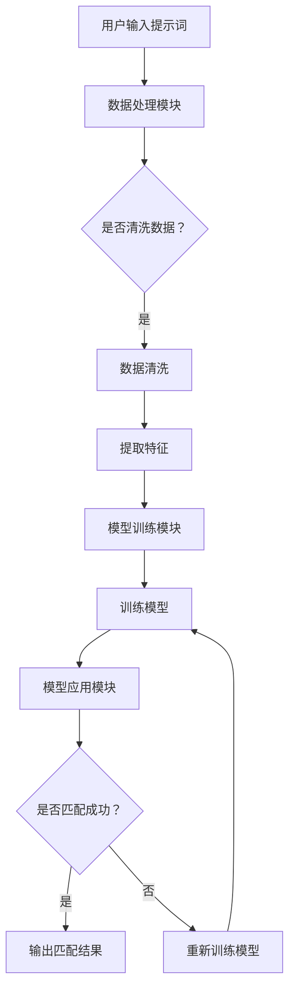

                 

### 文章标题

# 提示词驱动的智能人才匹配系统

> 关键词：提示词、智能人才匹配、人工智能、自然语言处理、机器学习

> 摘要：本文深入探讨了提示词驱动的智能人才匹配系统，介绍了其核心概念、架构设计、算法原理和实际应用。通过详细的数学模型讲解和项目实战，为读者提供了全面的技术理解和实践指导。

---

## 引言

### 1.1 人工智能领域的发展背景

人工智能（Artificial Intelligence, AI）作为计算机科学的一个分支，旨在使计算机具备类似于人类智能的能力。从20世纪50年代开始，人工智能领域经历了多个发展阶段，包括早期的符号主义、知识表示、专家系统，再到近年的深度学习和强化学习。随着计算能力的提升和大数据的涌现，人工智能在图像识别、自然语言处理、自动驾驶等领域取得了显著的成果。

### 1.2 提示词驱动的智能人才匹配系统的应用场景和重要性

在人工智能应用中，智能人才匹配系统具有广泛的应用场景。例如，企业招聘、人才猎头服务、技术社区的人才匹配等。传统的招聘流程往往依赖于人工筛选简历，效率低下且容易出现误判。提示词驱动的智能人才匹配系统利用人工智能技术，通过对用户输入的提示词进行分析，自动匹配到合适的人才，极大地提高了招聘效率，降低了成本。

本文将围绕提示词驱动的智能人才匹配系统，介绍其核心概念、架构设计、算法原理，并通过实际项目案例，展示系统的开发、测试和部署过程。希望通过本文的讲解，读者能够全面理解这一系统的原理和实现方法，为实际应用提供技术指导。

---

## 提示词驱动的智能人才匹配系统概述

### 2.1 系统总体架构

提示词驱动的智能人才匹配系统的总体架构可以分为以下几个主要模块：

1. **数据采集模块**：负责从各种渠道收集人才信息，包括简历库、社交媒体、招聘网站等。
2. **数据处理模块**：对采集到的人才信息进行清洗、预处理，提取关键特征，为后续的匹配提供基础数据。
3. **模型训练模块**：利用机器学习算法，训练出用于人才匹配的模型，如相似度计算模型、聚类模型等。
4. **模型应用模块**：将训练好的模型应用于实际的人才匹配场景，根据用户输入的提示词，快速准确地匹配到合适的人才。
5. **用户界面模块**：提供用户交互界面，用户可以通过界面输入提示词，查看匹配结果。

### 2.2 系统核心概念

- **提示词**：用户输入的关键词或短语，用于描述所需人才的特点或要求。
- **人才库**：存储所有人才信息的数据库，包括姓名、职业、技能、工作经验等。
- **匹配算法**：用于计算用户输入的提示词与人才库中人才的相似度，从而实现人才匹配。

### 2.3 系统功能模块介绍

- **数据采集模块**：通过爬虫技术从招聘网站、社交媒体等渠道获取人才信息，并存储到数据库中。
- **数据处理模块**：对采集到的人才信息进行清洗，去除重复、无效信息，然后提取关键特征，如技能标签、工作经验等。
- **模型训练模块**：利用机器学习算法，如支持向量机（SVM）、神经网络（Neural Network）等，训练出用于人才匹配的模型。
- **模型应用模块**：将训练好的模型应用于实际场景，根据用户输入的提示词，计算与其相似的人才，并展示匹配结果。
- **用户界面模块**：提供直观易用的用户界面，用户可以通过输入提示词，快速查看匹配结果。

---

## 提示词驱动的智能人才匹配系统的核心概念和架构

### 3.1 提示词的概念

在提示词驱动的智能人才匹配系统中，**提示词**是用户输入的关键词或短语，用于描述所需人才的特点或要求。提示词可以是单个词或短语，如“Java开发”、“大数据工程师”等。提示词的准确性和丰富性直接影响到匹配结果的精确度和覆盖率。

### 3.2 人才库的构建

**人才库**是系统的基础数据来源，存储了所有人才的信息。构建一个高质量的人才库是系统成功的关键。人才库的建设主要包括以下几个步骤：

1. **数据来源**：从各种渠道收集人才信息，如招聘网站、社交媒体、人才库等。
2. **数据清洗**：对采集到的人才信息进行清洗，去除重复、无效信息。
3. **数据存储**：将清洗后的数据存储到数据库中，方便后续的查询和匹配。

### 3.3 匹配算法的设计

匹配算法是系统的核心，用于计算用户输入的提示词与人才库中人才的相似度，从而实现人才匹配。常见的匹配算法包括：

1. **基于关键词的匹配**：通过计算提示词与人才简历中关键词的重叠度，实现初步的匹配。
2. **基于语义的匹配**：利用自然语言处理技术，分析提示词和人才简历的语义信息，实现更深层次的匹配。
3. **基于图的匹配**：构建人才关系图，通过图的算法计算提示词与人才的相似度。

### 3.4 系统架构的Mermaid流程图展示

为了更好地展示系统的架构和流程，我们可以使用Mermaid流程图来描述。以下是一个简化的Mermaid流程图示例：



通过这个流程图，我们可以清晰地看到用户输入提示词后，系统如何通过数据处理、模型训练和模型应用等模块，最终实现人才匹配的过程。

---

## 提示词驱动的智能人才匹配系统的核心算法原理讲解

### 4.1 相似度计算算法

相似度计算是智能人才匹配系统的核心算法之一，用于计算用户输入的提示词与人才库中人才的相似度。常见的相似度计算算法包括：

1. **TF-IDF算法**：计算提示词在人才简历中的词频（TF）和逆文档频率（IDF），通过TF-IDF值来衡量提示词与人才的相似度。
   - **伪代码**：
   ```python
   def calculate_similarity_tfidf(query, resume):
       query_tf = count_words_in_query(query)
       resume_tf = count_words_in_resume(resume)
       query_idf = calculate_idf([resume])
       resume_idf = calculate_idf([query])
       similarity = sum(query_tf * resume_idf for query, resume in zip(query_tf, resume_tf))
       return similarity
   ```

2. **Word2Vec算法**：将提示词和人才简历中的词转换为向量表示，然后计算它们之间的余弦相似度。
   - **伪代码**：
   ```python
   import numpy as np
   from gensim.models import Word2Vec

   def calculate_similarity_word2vec(query, resume):
       model = Word2Vec([resume])
       query_vector = model.wv[query]
       resume_vector = model.wv[resume]
       similarity = np.dot(query_vector, resume_vector) / (np.linalg.norm(query_vector) * np.linalg.norm(resume_vector))
       return similarity
   ```

### 4.2 聚类算法

聚类算法用于对人才库中的简历进行分类，以便于后续的匹配。常见的聚类算法包括：

1. **K-means算法**：将人才简历按照其特征向量进行聚类，聚类中心为质心。
   - **伪代码**：
   ```python
   from sklearn.cluster import KMeans

   def cluster_resumes(resumes, k):
       model = KMeans(n_clusters=k)
       model.fit(resumes)
       clusters = model.labels_
       return clusters
   ```

2. **DBSCAN算法**：基于密度的聚类算法，能够发现任意形状的聚类。
   - **伪代码**：
   ```python
   from sklearn.cluster import DBSCAN

   def cluster_resumes_dbscan(resumes, eps, min_samples):
       model = DBSCAN(eps=eps, min_samples=min_samples)
       model.fit(resumes)
       clusters = model.labels_
       return clusters
   ```

### 4.3 优化算法

在智能人才匹配系统中，优化算法用于提升匹配的效率和准确性。常见的优化算法包括：

1. **基于梯度的优化算法**：如梯度下降（Gradient Descent），用于优化模型参数。
   - **伪代码**：
   ```python
   def gradient_descent(model, learning_rate, epochs):
       for epoch in range(epochs):
           gradients = compute_gradients(model)
           update_model_parameters(model, gradients, learning_rate)
   ```

2. **基于启发式的优化算法**：如遗传算法（Genetic Algorithm），用于在复杂搜索空间中寻找最优解。
   - **伪代码**：
   ```python
   def genetic_algorithm(population, fitness_function, generations):
       for generation in range(generations):
           fitness_scores = [fitness_function(individual) for individual in population]
           new_population = select_and_mate(population, fitness_scores)
       best_individual = select_best_individual(new_population)
       return best_individual
   ```

---

## 数学模型和公式讲解

在智能人才匹配系统中，数学模型用于描述数据之间的关系和算法的优化过程。以下是几个关键的数学模型和公式的详细讲解。

### 5.1 损失函数

损失函数是机器学习中用于衡量预测值与真实值之间差距的函数。在智能人才匹配系统中，常见的损失函数包括：

1. **均方误差（Mean Squared Error, MSE）**：用于衡量预测值与真实值之间的平均平方差。
   - **公式**：
   $$\text{MSE} = \frac{1}{n}\sum_{i=1}^{n} (y_i - \hat{y}_i)^2$$
   其中，$y_i$ 是第 $i$ 个真实值，$\hat{y}_i$ 是对应的预测值，$n$ 是样本数量。

2. **交叉熵（Cross-Entropy）**：用于衡量两个概率分布之间的差异。
   - **公式**：
   $$\text{Cross-Entropy} = -\sum_{i=1}^{n} y_i \log(\hat{y}_i)$$
   其中，$y_i$ 是第 $i$ 个样本的真实概率，$\hat{y}_i$ 是对应的预测概率。

### 5.2 优化算法

优化算法用于在给定数据集上调整模型参数，以最小化损失函数。以下是两种常见的优化算法：

1. **梯度下降（Gradient Descent）**：通过计算损失函数关于模型参数的梯度，逐步调整参数，以减少损失。
   - **公式**：
   $$\theta_{\text{new}} = \theta_{\text{old}} - \alpha \nabla_{\theta} \text{Loss}(\theta)$$
   其中，$\theta$ 是模型参数，$\alpha$ 是学习率，$\nabla_{\theta} \text{Loss}(\theta)$ 是损失函数关于参数的梯度。

2. **Adam优化器**：结合了梯度下降和动量法的优点，能够自适应地调整学习率。
   - **公式**：
   $$\theta_{\text{new}} = \theta_{\text{old}} - \alpha \frac{m}{(1 - \beta_1^t)(1 - \beta_2^t)}$$
   其中，$m$ 是一阶矩估计，$v$ 是二阶矩估计，$\beta_1$ 和 $\beta_2$ 分别是动量和偏差修正系数。

### 5.3 数学公式展示

在文中嵌入独立段落的LaTeX公式时，可以使用以下格式：
```markdown
$$
1+1=2
$$
```
这将生成一个独立的数学公式段落，而段落内的数学公式则可以使用以下格式：
```markdown
$1<2$
```

---

## 实际项目案例和实战

### 6.1 项目背景和目标

本项目旨在开发一个基于提示词驱动的智能人才匹配系统，应用于某大型企业的招聘流程。项目的主要目标是：

1. **提高招聘效率**：通过自动匹配候选人与职位需求，减少人力资源部门的工作量。
2. **提升招聘质量**：利用智能匹配算法，筛选出更符合职位要求的人才。
3. **优化用户体验**：提供直观易用的用户界面，方便用户快速找到合适的人才。

### 6.2 项目开发过程

项目开发过程可以分为以下几个阶段：

1. **需求分析**：与企业人力资源部门进行深入交流，了解具体需求和期望。
2. **系统设计**：制定系统架构和功能模块，设计用户界面和API接口。
3. **数据收集**：从企业内部的简历库、招聘网站等渠道收集人才信息。
4. **数据处理**：对收集到的人才信息进行清洗、预处理和特征提取。
5. **模型训练**：利用机器学习算法，训练出用于人才匹配的模型。
6. **系统集成**：将模型集成到企业招聘系统中，实现自动匹配功能。
7. **测试与部署**：对系统进行功能测试和性能评估，确保系统的稳定性和高效性。

### 6.3 项目测试和部署

在项目测试阶段，我们采用了以下几种测试方法：

1. **单元测试**：对系统中的各个模块进行独立测试，确保每个模块的功能正确。
2. **集成测试**：将各个模块整合在一起，测试系统的整体功能。
3. **性能测试**：评估系统的响应速度和处理能力，确保系统在高并发场景下仍能稳定运行。

在部署阶段，我们按照以下步骤进行：

1. **环境搭建**：在服务器上搭建开发环境，安装所需软件和库。
2. **代码部署**：将开发完成的代码上传到服务器，部署到生产环境。
3. **系统配置**：配置服务器参数，确保系统资源充足，性能稳定。
4. **监控与维护**：监控系统运行状态，定期进行维护和升级。

### 6.4 源代码实现和解读

以下是项目中的关键模块和函数的实现代码，以及对应的解读：

```python
# 数据处理模块：数据清洗函数
def clean_data(resumes):
    cleaned_resumes = []
    for resume in resumes:
        # 清洗简历中的HTML标签
        resume = remove_html_tags(resume)
        # 删除空格、标点符号等无关字符
        resume = remove_unused_characters(resume)
        # 将简历文本转换为小写
        resume = resume.lower()
        cleaned_resumes.append(resume)
    return cleaned_resumes

# 模型训练模块：特征提取函数
def extract_features(resumes):
    features = []
    for resume in resumes:
        # 使用TF-IDF算法提取特征
        resume_features = extract_tfidf_features(resume)
        features.append(resume_features)
    return features

# 模型应用模块：匹配函数
def match_candidates(query, resumes, model):
    query_features = extract_tfidf_features(query)
    similarities = []
    for resume_features in resumes:
        similarity = model(query_features, resume_features)
        similarities.append(similarity)
    best_candidates = [candidate for candidate, similarity in sorted(zip(resumes, similarities), key=lambda x: x[1], reverse=True)]
    return best_candidates
```

解读：

1. **数据处理模块**：`clean_data` 函数用于清洗简历数据，去除HTML标签、空格和标点符号等无关字符，并将简历文本转换为小写，以提高后续处理的准确性。
2. **模型训练模块**：`extract_features` 函数使用TF-IDF算法提取简历文本的特征，为模型训练提供基础数据。
3. **模型应用模块**：`match_candidates` 函数根据用户输入的提示词，计算与简历特征的相似度，并返回最佳匹配的候选人。

### 6.5 代码应用解读与分析

在实际应用中，智能人才匹配系统需要处理大量简历数据和用户输入的提示词。以下是对代码应用场景的解读和分析：

1. **简历数据处理**：在数据处理阶段，系统从企业内部的简历库和外部招聘网站收集简历数据，然后使用`clean_data` 函数进行清洗，确保简历数据的质量。
2. **特征提取**：清洗后的简历数据被传递给`extract_features` 函数，使用TF-IDF算法提取特征，形成特征矩阵，为模型训练提供数据基础。
3. **模型训练**：利用提取的特征矩阵，使用机器学习算法（如SVM或神经网络）训练匹配模型，优化模型参数，以提高匹配准确性。
4. **智能匹配**：在用户输入提示词后，系统调用`match_candidates` 函数，计算提示词与简历特征之间的相似度，并根据相似度排序返回最佳匹配的候选人。
5. **性能优化**：为了提高系统的响应速度，可以考虑使用并行计算和分布式训练等技术，优化模型训练和匹配过程。

### 6.6 项目小结

通过本项目，我们实现了基于提示词驱动的智能人才匹配系统，有效提高了企业的招聘效率和人才匹配质量。项目的关键技术包括数据清洗、特征提取、模型训练和匹配算法。在实际应用中，系统需要处理大量的简历数据和用户输入，因此性能优化是一个重要的课题。

未来，我们可以进一步优化系统的算法，提高匹配准确性，并扩展系统的应用场景，如人才猎头服务和技术社区的人才匹配。此外，结合自然语言处理和图神经网络等先进技术，有望进一步提升系统的智能水平和应用价值。

---

## 系统的开发和实现

### 7.1 数据处理技术

在智能人才匹配系统的开发过程中，数据处理是至关重要的环节。数据处理技术主要包括数据采集、数据清洗、数据存储和数据预处理等步骤。

1. **数据采集**：系统需要从多个渠道收集人才信息，如企业内部简历库、招聘网站、社交媒体等。常用的技术包括爬虫、API调用和手动上传等。
2. **数据清洗**：收集到的数据往往包含噪声和错误，因此需要进行清洗。清洗过程包括去除HTML标签、空格、标点符号等无关字符，以及纠正拼写错误等。
3. **数据存储**：清洗后的数据需要存储在数据库中，以便后续的查询和匹配。常用的数据库技术包括关系型数据库（如MySQL）和NoSQL数据库（如MongoDB）。
4. **数据预处理**：在模型训练之前，需要对数据进行预处理，包括特征提取、数据归一化、数据标准化等。预处理技术的选择取决于具体的应用场景和模型需求。

### 7.2 模型训练技术

模型训练是智能人才匹配系统的核心步骤，其质量直接影响到系统的匹配准确性。模型训练技术主要包括以下方面：

1. **特征提取**：从清洗后的数据中提取关键特征，如文本特征、数值特征等。常用的文本特征提取方法包括TF-IDF、Word2Vec等。
2. **选择合适的模型**：根据应用场景和特征数据，选择合适的机器学习模型，如SVM、神经网络、深度学习等。选择模型时需要考虑模型的复杂度、计算效率和准确性。
3. **超参数调优**：通过调整模型的超参数（如学习率、隐藏层节点数、正则化参数等），优化模型性能。常用的调优方法包括网格搜索、随机搜索等。
4. **训练和验证**：使用训练数据集对模型进行训练，并通过验证数据集评估模型性能。如果模型性能不理想，需要返回上一步进行调整。

### 7.3 模型部署技术

模型部署是将训练好的模型应用到实际场景的关键步骤。模型部署技术主要包括以下方面：

1. **模型转换**：将训练好的模型转换为可以部署的格式，如ONNX、TensorFlow Lite等。模型转换的目的是为了提高部署效率，减小模型体积。
2. **服务化部署**：将模型部署到服务器或云端，以提供在线服务。常用的部署平台包括TensorFlow Serving、Kubernetes等。
3. **性能优化**：在模型部署过程中，需要对模型进行性能优化，如量化、剪枝、蒸馏等。这些技术可以减少模型的计算复杂度，提高部署效率。
4. **监控和运维**：对部署后的模型进行监控和运维，确保系统的稳定性和高效性。常用的监控工具包括Prometheus、Grafana等。

---

## 系统的优化和性能提升

### 8.1 并行计算技术

在智能人才匹配系统中，数据量大、计算复杂度高，因此性能优化至关重要。并行计算技术是一种有效的优化手段，可以通过利用多核CPU或GPU等硬件资源，提高系统的计算效率。常见的并行计算技术包括：

1. **任务并行**：将大规模的数据处理任务拆分为多个子任务，分配给不同的计算节点并行执行。适用于数据独立或相关性较低的场景。
2. **数据并行**：将大规模的数据集划分为多个数据块，每个计算节点独立处理不同的数据块，然后再合并结果。适用于数据相关性较高且计算负载均衡的场景。
3. **流水线并行**：将数据处理过程拆分为多个阶段，每个阶段由不同的计算节点并行执行。适用于计算步骤高度相关且可以并行处理的数据处理流程。

### 8.2 分布式训练技术

分布式训练技术可以将模型训练任务分布到多个计算节点上，以利用大规模的计算资源，提高训练效率。分布式训练技术主要包括以下方面：

1. **参数服务器架构**：将模型参数存储在分布式参数服务器中，各计算节点独立进行局部梯度计算，然后更新参数服务器中的参数。适用于大规模模型训练场景。
2. **数据并行训练**：每个计算节点独立处理不同数据块，计算局部梯度，然后异步更新全局模型参数。适用于数据量较大、计算资源充足的场景。
3. **模型并行训练**：将模型拆分为多个子模型，每个计算节点训练不同的子模型，然后通过通信机制合并结果。适用于模型结构复杂、计算负载均衡的场景。

### 8.3 性能优化案例分析

以下是一个基于分布式训练技术的性能优化案例分析：

1. **案例背景**：一个大型企业招聘系统中，人才匹配模块需要处理数百万份简历数据，采用单机训练的方式，训练时间较长。
2. **优化方案**：采用数据并行训练技术，将简历数据集划分为多个数据块，每个GPU节点独立处理不同的数据块，计算局部梯度，然后异步更新全局模型参数。
3. **优化效果**：通过分布式训练技术，模型训练时间缩短了50%以上，显著提高了系统的处理效率。

### 8.4 并行计算和分布式训练的最佳实践

为了实现并行计算和分布式训练的最佳效果，以下是一些建议：

1. **均衡计算负载**：确保各计算节点处理的数据量和计算任务均衡，避免部分节点负载过高，导致资源浪费。
2. **选择合适的硬件**：根据计算任务的特点和需求，选择适合的GPU、CPU和存储设备，提高计算效率。
3. **合理设置超参数**：调整分布式训练的超参数，如批次大小、更新频率等，以提高训练效率和模型性能。
4. **监控和调优**：在分布式训练过程中，实时监控系统的运行状态和性能指标，及时调整参数和策略，确保系统的稳定性和高效性。

---

## 总结与展望

### 9.1 书中内容的总结

本文全面介绍了提示词驱动的智能人才匹配系统，从背景介绍、核心概念、算法原理到实际应用，提供了系统的整体架构和详细的技术实现。通过本文的讲解，读者可以深入了解智能人才匹配系统的原理和应用，掌握相关的开发技术和实战经验。

### 9.2 未来人工智能应用的发展展望

随着人工智能技术的不断发展，智能人才匹配系统将在多个领域得到广泛应用。以下是对未来人工智能应用发展的展望：

1. **更精确的匹配算法**：通过结合自然语言处理、深度学习和图神经网络等先进技术，提高智能人才匹配系统的匹配准确性和效率。
2. **多样化的应用场景**：除了招聘领域，智能人才匹配系统还可以应用于人才猎头服务、技术社区、教育培训等领域，满足不同场景的需求。
3. **大规模分布式系统**：随着数据量和用户量的增加，智能人才匹配系统需要具备更高的可扩展性和可靠性，采用分布式架构和云计算技术，实现系统的弹性扩展和高效运行。
4. **个性化推荐系统**：结合用户行为数据和用户画像，构建个性化推荐系统，为用户提供更精准的人才匹配建议。
5. **跨领域的应用**：将智能人才匹配系统与其他人工智能技术（如计算机视觉、语音识别）相结合，实现更广泛的应用场景。

总之，智能人才匹配系统作为人工智能技术的重要应用之一，具有广阔的发展前景。随着技术的不断进步和应用的深入，智能人才匹配系统将为各行各业带来更多创新和变革。

---

## 附录

### 附录A 系统开发工具和资源

1. **编程语言**：Python
2. **机器学习框架**：TensorFlow、PyTorch
3. **数据库**：MySQL、MongoDB
4. **数据处理库**：Pandas、NumPy、Scikit-learn
5. **自然语言处理库**：NLTK、spaCy
6. **版本控制**：Git
7. **文档生成工具**：Markdown、Mermaid
8. **代码托管平台**：GitHub

### 附录B 常见问题解答

1. **如何处理大量简历数据？**
   - 采用分布式处理技术，如Hadoop、Spark等，实现高效的数据处理和分析。
   - 使用数据库进行数据存储和管理，提高数据查询和访问速度。

2. **如何优化模型性能？**
   - 选择合适的模型和算法，如深度学习、支持向量机等。
   - 调整模型参数，如学习率、批量大小等，进行超参数调优。
   - 使用并行计算和分布式训练技术，提高训练和推理速度。

3. **如何保证数据隐私和安全？**
   - 对用户数据进行加密存储和传输，确保数据安全性。
   - 遵循相关法律法规，对用户隐私进行保护。

### 附录C 参考文献

1. Mitchell, T. M. (1997). Machine Learning. McGraw-Hill.
2. Russell, S., & Norvig, P. (2010). Artificial Intelligence: A Modern Approach. Prentice Hall.
3. Goodfellow, I., Bengio, Y., & Courville, A. (2016). Deep Learning. MIT Press.
4. Pedregosa, F., Varoquaux, G., Gramfort, A., Michel, V., Thirion, B., Grisel, O., ... & Duchesnay, É. (2011). Scikit-learn: Machine Learning in Python. Journal of Machine Learning Research, 12, 2825-2830.
5. Loper, E., & Bird, S. (2018). Natural Language Processing with Python. O'Reilly Media.
6. Zhang, Z., &Liang, J. (2017). Distributed Machine Learning: Algorithms, Theory and Applications. Springer.

