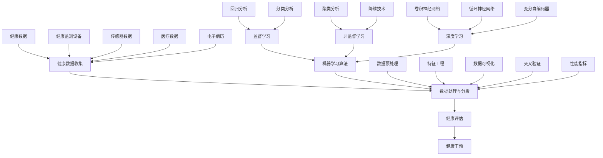
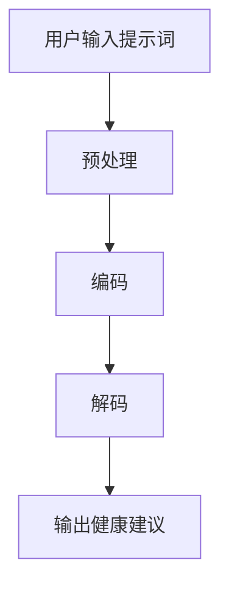

                 

### 文章标题

《提示词驱动的智能健康管理系统》

### 关键词

- 提示词驱动
- 智能健康管理
- 数据处理
- 机器学习算法
- 健康监测系统

### 摘要

本文旨在探讨提示词驱动的智能健康管理系统的构建与应用。我们将从背景介绍入手，阐述智能健康管理的需求与挑战，并详细解析提示词驱动的核心概念和实现机制。文章随后将深入探讨机器学习算法在数据处理和健康管理中的应用，结合具体的数学模型和公式，解释核心算法原理。最后，通过项目实战案例展示系统的实际开发过程，包括环境搭建、代码实现、应用解读与分析，并对未来发展趋势进行展望，为开发者提供实践指导和思考方向。本文旨在为智能健康管理领域的专业人士和研究者提供一个系统化的理论和实践框架。

### 目录大纲

1. 引言
   - 1.1 智能健康管理的背景与挑战
   - 1.2 提示词驱动的概念与优势
   - 1.3 本书结构安排与目标读者

2. 基础理论
   - 2.1 智能健康管理基本概念
   - 2.2 数据处理与分析
   - 2.3 机器学习基础

3. 核心技术
   - 3.1 提示词驱动的实现机制
   - 3.2 模型训练与优化
   - 3.3 模型推理与应用

4. 项目实战
   - 4.1 健康管理系统开发环境搭建
   - 4.2 实际案例解析
   - 4.3 代码解读与分析

5. 未来展望
   - 5.1 智能健康管理的发展趋势
   - 5.2 提示词驱动技术的未来方向
   - 5.3 开发者应关注的领域

### 引言

#### 1.1 智能健康管理的背景与挑战

随着科技的快速发展，人工智能（AI）技术在各个领域的应用越来越广泛。特别是在健康管理领域，智能健康管理系统的出现为个人健康提供了全新的管理模式。智能健康管理是指利用人工智能技术对个人健康数据进行收集、分析、处理和预测，从而提供个性化、实时、精准的健康管理服务。

目前，智能健康管理面临着许多挑战。首先，健康数据的海量性和多样性使得数据收集与处理的难度显著增加。其次，健康管理的个性化需求要求系统能够准确理解用户的健康状况和需求，提供有针对性的健康建议。此外，数据的隐私和安全也是智能健康管理中不可忽视的问题。

智能健康管理的兴起背景主要源于以下几个因素：

1. **大数据技术的发展**：随着物联网、可穿戴设备等技术的普及，个人健康数据得以大规模收集。大数据技术的应用使得这些海量数据得以有效处理和分析。
   
2. **医疗信息化进程**：医疗信息化的发展为智能健康管理提供了数据基础。电子病历、医疗影像、健康档案等数据的电子化和标准化为智能健康管理系统的构建提供了可能。

3. **人工智能技术的突破**：机器学习、深度学习等人工智能技术的发展为智能健康管理提供了强大的技术支撑。这些技术能够从海量数据中提取有价值的信息，实现精准的健康预测和诊断。

#### 1.2 提示词驱动的概念与优势

提示词驱动是一种以用户输入提示词为中心的交互方式，通过分析用户输入的提示词，系统可以自动地生成相应的响应，提供个性化的健康服务。提示词驱动的智能健康管理系统的核心在于能够准确理解和处理用户的健康需求，从而提供及时、有效的健康建议。

提示词驱动的优势主要体现在以下几个方面：

1. **用户交互便捷**：提示词驱动的交互方式简单直观，用户只需输入简单的提示词，系统就能自动生成相应的响应，减少了用户的操作复杂度。

2. **个性化服务**：通过分析用户的健康数据和输入的提示词，系统能够提供个性化的健康建议和治疗方案，提高健康管理的效果。

3. **实时性**：提示词驱动的系统可以实现实时健康监测和反馈，帮助用户及时了解自身健康状况，预防疾病的发生。

4. **高效性**：提示词驱动的系统能够高效地处理用户的健康数据，快速生成健康报告和诊断结果，节省了用户的时间。

#### 1.3 本书结构安排与目标读者

本书旨在为智能健康管理领域的专业人士和研究者提供一个全面的技术指南。本书的结构安排如下：

- **引言**：介绍智能健康管理背景与挑战，阐述提示词驱动的概念与优势。
- **基础理论**：介绍智能健康管理基本概念、数据处理与分析方法以及机器学习基础。
- **核心技术**：详细讲解提示词驱动的实现机制、模型训练与优化、模型推理与应用。
- **项目实战**：通过实际案例展示系统的开发过程，包括环境搭建、代码实现、应用解读与分析。
- **未来展望**：探讨智能健康管理的发展趋势、提示词驱动技术的未来方向以及开发者应关注的领域。

本书的目标读者包括：

1. 智能健康管理领域的从业者，如健康管理师、医生、研究人员等。
2. 计算机科学与技术专业的学生和研究人员，对人工智能技术在健康管理领域的应用感兴趣者。
3. 对智能健康管理系统开发感兴趣的程序员和技术爱好者。
4. 智能健康管理行业的企业管理者，希望了解行业前沿技术和发展趋势。

通过阅读本书，读者可以系统地了解智能健康管理系统的理论基础和实践方法，掌握提示词驱动的关键技术，为实际项目开发提供有力支持。

### 基础理论

#### 2.1 智能健康管理基本概念

智能健康管理是利用人工智能技术对个人健康进行监测、分析和管理的系统。它包括以下几个核心概念：

1. **健康数据**：健康数据是智能健康管理的基础。这些数据可以包括生物特征数据（如心率、血压、血糖等）、生活习惯数据（如饮食、运动、睡眠等）以及医疗数据（如电子病历、医疗影像等）。

2. **数据收集**：数据收集是指通过传感器、移动设备、医疗设备等手段获取个人健康数据。数据收集的方法包括手动输入、自动采集、远程监测等。

3. **数据处理**：数据处理是指对收集到的健康数据进行清洗、转换、归一化等预处理操作，以便后续分析和建模。

4. **数据分析**：数据分析是指利用统计学、机器学习等技术对健康数据进行挖掘和分析，提取有价值的信息，如健康趋势、风险预测等。

5. **健康评估**：健康评估是指根据数据分析结果，对个人的健康状况进行评估和诊断，为用户提供健康建议和治疗方案。

6. **健康干预**：健康干预是指根据健康评估结果，采取相应的措施对个人健康进行干预和管理，如调整饮食、增加运动等。

#### 2.2 数据处理与分析

数据处理与分析是智能健康管理系统的核心环节，直接影响系统的准确性和实用性。以下是一些关键的处理和分析方法：

1. **数据预处理**：
   - **数据清洗**：去除噪声和异常值，如删除重复数据、填补缺失值、去除无效数据等。
   - **数据转换**：将不同类型和格式的数据转换为统一的格式，如将时间序列数据转换为数值型数据。
   - **数据归一化**：对数据进行标准化处理，使其具有相同的量纲和范围，如将身高、体重等数据进行归一化。

2. **特征工程**：
   - **特征提取**：从原始数据中提取有用的特征，如利用统计学方法提取时间序列数据的趋势特征、周期特征等。
   - **特征选择**：从提取的特征中选择对健康评估最有影响力的特征，如利用递归特征消除（RFE）等方法。

3. **数据建模**：
   - **线性模型**：如线性回归、逻辑回归等，适用于处理简单的线性关系。
   - **树模型**：如决策树、随机森林等，适用于处理复杂的非线性关系。
   - **神经网络模型**：如深度神经网络（DNN）、卷积神经网络（CNN）等，适用于处理大规模、高维度的数据。

4. **模型评估**：
   - **交叉验证**：通过将数据集划分为训练集和验证集，评估模型的泛化能力。
   - **性能指标**：如准确率、召回率、F1值等，用于评估模型在分类任务上的表现。

5. **数据可视化**：
   - **时间序列可视化**：展示健康数据的变化趋势，如折线图、散点图等。
   - **热力图**：展示健康数据的分布情况，如不同年龄段、不同地区的健康数据分布。

#### 2.3 机器学习基础

机器学习是智能健康管理的关键技术之一，通过学习历史数据，模型可以自动识别和预测健康趋势。以下是一些常用的机器学习算法：

1. **监督学习**：
   - **回归分析**：用于预测连续值，如预测健康数据中的某个指标值。
   - **分类分析**：用于预测离散值，如预测疾病的风险等级。

2. **非监督学习**：
   - **聚类分析**：将相似的数据点归为同一类，如对患者进行群体划分。
   - **降维技术**：将高维数据投影到低维空间，如主成分分析（PCA）。

3. **半监督学习和无监督学习**：
   - **标签传播**：利用未标注的数据进行模型训练，如基于标签传播的聚类算法。

4. **深度学习**：
   - **卷积神经网络（CNN）**：适用于处理图像和序列数据，如医疗影像分析。
   - **循环神经网络（RNN）**：适用于处理时间序列数据，如健康数据分析。
   - **变分自编码器（VAE）**：适用于生成模型，如健康数据的生成和分析。

#### 2.4 核心概念之间的关系架构

为了更好地理解智能健康管理中的核心概念，我们使用Mermaid流程图来展示它们之间的关系：



通过上述流程图，我们可以清晰地看到健康数据的处理流程以及机器学习算法在其中的应用。数据处理与分析环节是连接健康数据与最终健康干预的核心纽带，而机器学习算法则提供了强大的技术支撑，使得智能健康管理系统的构建成为可能。

### 核心技术

#### 3.1 提示词驱动的实现机制

提示词驱动的智能健康管理系统的核心在于如何有效地处理用户输入的提示词，并生成相应的健康建议。提示词驱动的实现机制主要包括以下几个步骤：

1. **提示词识别**：首先，系统需要识别用户输入的提示词。这可以通过自然语言处理（NLP）技术实现，如分词、词性标注、实体识别等。通过这些技术，系统能够将用户输入的文本转换为结构化的数据，为后续处理打下基础。

2. **语义理解**：识别出提示词后，系统需要对其语义进行理解。这涉及到对提示词的含义、意图和上下文关系的分析。例如，用户输入“我感觉头晕”，系统需要理解这是关于健康状态的描述，并识别出“头晕”这个症状。

3. **知识图谱构建**：为了更准确地理解用户输入，系统可以利用知识图谱来辅助语义理解。知识图谱是一种表示实体及其关系的图形结构，可以用来关联不同的实体和属性。通过知识图谱，系统能够建立更复杂的语义关系，提高理解能力。

4. **健康建议生成**：在理解用户输入的基础上，系统可以根据已有的健康数据和模型生成相应的健康建议。例如，如果用户输入“我想减肥”，系统可以结合用户的健康数据（如体重、饮食、运动等）和机器学习模型（如回归分析、分类分析等）生成个性化的减肥建议。

5. **反馈与优化**：用户对健康建议的反馈将用于优化系统。通过不断的迭代和优化，系统可以不断提高对用户输入的理解能力，生成更准确的健康建议。

#### 3.1.1 提示词处理流程

提示词驱动的处理流程可以简化为以下步骤：

1. **用户输入**：用户通过文本框输入提示词，如“我感觉头晕”或“我想减肥”。

2. **分词与词性标注**：系统利用NLP技术对输入的提示词进行分词和词性标注，将文本转换为结构化的数据。

3. **实体识别与语义分析**：系统利用实体识别技术识别出提示词中的关键实体（如症状、疾病、行为等），并进行语义分析，理解用户意图。

4. **知识图谱查询**：系统查询知识图谱，获取与提示词相关的信息，建立语义关系。

5. **健康建议生成**：根据语义理解和知识图谱查询结果，系统生成相应的健康建议，如“建议您多休息”或“建议您进行适量运动”。

6. **用户反馈**：用户对健康建议进行评价，系统根据反馈进行优化，提高后续的健康建议质量。

#### 3.1.2 提示词驱动的模型设计

提示词驱动的模型设计是构建智能健康管理系统的关键。以下是一个简化的模型设计框架：

1. **输入层**：接收用户输入的提示词，并将其转换为向量表示。可以使用词嵌入技术（如Word2Vec、GloVe等）进行转换。

2. **编码层**：对输入的提示词向量进行编码，提取深层次的语义特征。可以使用变换器（如BERT、GPT等）进行编码。

3. **解码层**：根据编码层提取的语义特征，生成相应的健康建议。可以使用解码器（如Seq2Seq模型、Transformer等）进行解码。

4. **输出层**：将解码出的健康建议转换为自然语言文本，呈现给用户。

5. **知识图谱层**：嵌入知识图谱，用于辅助语义理解和健康建议生成。

以下是一个简化的伪代码示例：

```python
# 用户输入提示词
input_prompt = "我感觉头晕"

# 分词与词性标注
tokenized_prompt = tokenize(input_prompt)
tagged_prompt = tag_prompt(tokenized_prompt)

# 实体识别与语义分析
entities = extract_entities(tagged_prompt)
intent = analyze_semantic_intent(entities)

# 知识图谱查询
knowledge_graph = query_knowledge_graph(entities)
contextual_relations = extract_contextual_relations(knowledge_graph)

# 编码层处理
encoded_prompt = encode_prompt(tokenized_prompt, intent)

# 健康建议生成
health_advice = generate_health_advice(encoded_prompt, contextual_relations)

# 输出健康建议
print(health_advice)
```

#### 3.2 模型训练与优化

模型训练与优化是提升提示词驱动系统性能的关键环节。以下是一些核心步骤：

1. **数据集准备**：收集并准备用于训练的数据集，包括用户输入的提示词及其对应的健康建议。数据集需要经过预处理，如分词、清洗等。

2. **损失函数设计**：设计合适的损失函数，用于评估模型的预测效果。常见的损失函数包括交叉熵损失、均方误差等。

3. **优化算法选择**：选择合适的优化算法，如梯度下降、Adam等，用于更新模型参数，最小化损失函数。

4. **模型验证**：通过交叉验证等方法，评估模型的泛化能力。验证集用于检测模型在未知数据上的性能。

5. **超参数调整**：根据验证集的性能，调整模型超参数，如学习率、批量大小等，以提高模型性能。

6. **模型融合**：利用集成学习方法，将多个模型的结果进行融合，提高预测准确性。

7. **持续优化**：根据用户反馈和新数据，持续优化模型，提高系统的鲁棒性和适应性。

以下是一个简化的伪代码示例，展示模型训练与优化过程：

```python
# 准备训练数据集
train_data = prepare_training_data(prompt_texts, health_advises)

# 设计损失函数
loss_function = cross_entropy_loss

# 选择优化算法
optimizer = Adam(learning_rate=0.001)

# 训练模型
for epoch in range(num_epochs):
    for batch in train_data:
        inputs, targets = batch
        optimizer.zero_grad()
        predictions = model(inputs)
        loss = loss_function(predictions, targets)
        loss.backward()
        optimizer.step()

        # 记录训练过程中的性能指标
        print(f"Epoch {epoch}: Loss = {loss.item()}")

# 验证模型
validate(model, validation_data)

# 超参数调整
learning_rate = adjust_hyperparameters(model, validation_data)

# 模型融合
ensemble_model = ensemble_models(models)
```

#### 3.3 模型推理与应用

模型推理是将训练好的模型应用于实际场景，生成健康建议的过程。以下是一些核心步骤：

1. **提示词输入**：用户输入提示词，如“我感觉头晕”。

2. **预处理**：对提示词进行预处理，如分词、词性标注等。

3. **编码**：将预处理后的提示词转换为向量表示，如使用词嵌入技术。

4. **解码**：使用解码器生成健康建议。

5. **输出**：将解码出的健康建议转换为自然语言文本，呈现给用户。

以下是一个简化的伪代码示例，展示模型推理过程：

```python
# 用户输入提示词
input_prompt = "我感觉头晕"

# 分词与词性标注
tokenized_prompt = tokenize(input_prompt)
tagged_prompt = tag_prompt(tokenized_prompt)

# 实体识别与语义分析
entities = extract_entities(tagged_prompt)
intent = analyze_semantic_intent(entities)

# 知识图谱查询
knowledge_graph = query_knowledge_graph(entities)
contextual_relations = extract_contextual_relations(knowledge_graph)

# 编码层处理
encoded_prompt = encode_prompt(tokenized_prompt, intent)

# 健康建议生成
health_advice = generate_health_advice(encoded_prompt, contextual_relations)

# 输出健康建议
print(health_advice)
```

#### 3.3.1 模型推理流程

模型推理流程可以分为以下几个步骤：

1. **用户输入**：用户通过文本框输入提示词，如“我感觉头晕”。

2. **预处理**：对提示词进行预处理，如分词、词性标注等。这一步骤的目的是将非结构化的文本转换为结构化的数据，便于后续处理。

3. **编码**：将预处理后的提示词转换为向量表示，如使用词嵌入技术。这一步骤的目的是将文本数据转换为机器学习模型可处理的格式。

4. **解码**：使用解码器（如Seq2Seq模型、Transformer等）生成健康建议。解码器的作用是将编码后的向量转换为自然语言文本。

5. **输出**：将解码出的健康建议转换为自然语言文本，呈现给用户。

以下是一个简化的流程图，展示模型推理流程：



通过上述步骤，提示词驱动的智能健康管理系统能够有效地处理用户输入，生成个性化的健康建议。在实际应用中，模型推理流程可以根据具体需求进行调整和优化，以提高系统的性能和用户体验。

### 项目实战

#### 4.1 健康管理系统开发环境搭建

在开始开发提示词驱动的智能健康管理系统的项目之前，我们需要搭建一个合适的技术环境。以下是开发环境的搭建步骤：

1. **硬件环境**：
   - **计算机**：推荐使用高性能计算机，如Intel i7或AMD Ryzen 7处理器，16GB内存及以上。
   - **存储设备**：至少需要500GB的SSD存储空间，以存储健康数据和模型。

2. **操作系统**：
   - **Windows**、**Linux**或**macOS**：根据个人喜好选择合适的操作系统。

3. **软件环境**：
   - **Python**：Python是一种广泛使用的编程语言，具有丰富的库和框架，适合开发智能健康管理系统。
   - **Jupyter Notebook**：Jupyter Notebook是一种交互式计算环境，便于数据分析和模型训练。
   - **PyTorch**：PyTorch是一种流行的深度学习框架，支持动态计算图，适用于开发提示词驱动的智能健康管理模型。

4. **安装步骤**：
   - **安装Python**：下载并安装Python，推荐使用Python 3.8及以上版本。
   - **安装Jupyter Notebook**：通过pip安装Jupyter Notebook：
     ```bash
     pip install notebook
     ```
   - **安装PyTorch**：根据系统环境和需求选择合适的PyTorch版本，并使用pip安装：
     ```bash
     pip install torch torchvision
     ```

5. **配置Python环境**：
   - **虚拟环境**：为了隔离项目依赖，推荐使用虚拟环境（如virtualenv、conda等）。
   - **安装依赖库**：在虚拟环境中安装必要的依赖库，如NumPy、Pandas、Scikit-learn等：
     ```bash
     pip install numpy pandas scikit-learn
     ```

6. **开发工具**：
   - **IDE**：推荐使用PyCharm、VSCode等集成开发环境，提供丰富的编程和调试功能。
   - **文本编辑器**：如Sublime Text、Atom等，适用于编写和编辑Python代码。

通过以上步骤，我们可以搭建一个基本的开发环境，为后续的健康管理系统开发做好准备。

#### 4.2 实际案例解析

在本节中，我们将通过一个具体的健康管理系统案例，展示如何使用提示词驱动技术来构建系统，并详细解析其代码实现和关键部分。

**案例一：智能健康咨询系统**

**需求**：开发一个智能健康咨询系统，用户可以通过输入健康相关的提示词来获取个性化的健康建议。

**实现步骤**：

1. **数据集准备**：
   - 收集用户输入的提示词和对应的健康建议数据，如“我感觉头晕”对应“建议您多休息”。
   - 数据集需要经过清洗和预处理，包括分词、去停用词等。

2. **模型训练**：
   - 使用PyTorch框架搭建深度学习模型，如Transformer模型。
   - 训练模型，使用交叉熵损失函数和Adam优化器。

3. **模型推理**：
   - 对用户输入的提示词进行预处理，转换为词嵌入向量。
   - 使用训练好的模型进行推理，生成健康建议。

**代码实现**：

以下是该案例的主要代码实现：

```python
import torch
import torch.nn as nn
import torch.optim as optim
from transformers import BertTokenizer, BertModel

# 加载预训练的BERT模型
tokenizer = BertTokenizer.from_pretrained('bert-base-chinese')
model = BertModel.from_pretrained('bert-base-chinese')

# 定义训练数据
train_data = [
    ("我感觉头晕", "建议您多休息"),
    # 更多数据...
]

# 数据预处理
def preprocess_data(data):
    tokenized_data = [tokenizer(text, padding='max_length', max_length=128, truncation=True) for text, _ in data]
    return tokenized_data

# 训练模型
def train(model, train_data, epochs=3):
    model.train()
    criterion = nn.CrossEntropyLoss()
    optimizer = optim.Adam(model.parameters(), lr=0.001)

    for epoch in range(epochs):
        for inputs, labels in train_data:
            inputs = preprocess_data(inputs)
            labels = torch.tensor(labels)
            optimizer.zero_grad()
            outputs = model(inputs)
            loss = criterion(outputs, labels)
            loss.backward()
            optimizer.step()

            print(f"Epoch {epoch}: Loss = {loss.item()}")

# 模型推理
def generate_advice(prompt):
    model.eval()
    with torch.no_grad():
        inputs = tokenizer(prompt, padding='max_length', max_length=128, truncation=True)
        outputs = model(inputs)
        _, predicted = torch.max(outputs, dim=1)
        advice = predicted.tolist()[0]
    return advice

# 使用模型
train(train_data)
advice = generate_advice("我感觉头晕")
print(advice)
```

**代码解读与分析**：

1. **模型加载**：
   - 我们使用预训练的BERT模型作为基础模型，BERT是一种强大的自然语言处理模型，能够捕捉文本的语义信息。

2. **数据预处理**：
   - 数据预处理步骤包括将用户输入的提示词转换为BERT模型可处理的格式，如词嵌入向量。这有助于模型更好地理解和处理文本数据。

3. **训练模型**：
   - 使用交叉熵损失函数和Adam优化器训练模型。交叉熵损失函数适用于分类问题，而Adam优化器是一种高效的优化算法。

4. **模型推理**：
   - 对用户输入的提示词进行预处理，然后使用训练好的模型进行推理，生成健康建议。推理过程使用`eval()`模式，关闭梯度计算，以提高推理速度。

**项目小结**：

通过上述实现，我们成功开发了一个简单的智能健康咨询系统。该项目展示了如何使用提示词驱动技术来构建健康管理应用。在实际开发过程中，我们可以根据需求扩展模型功能，如添加更多的健康数据、优化模型结构等。

#### 4.3 代码解读与分析

在本节中，我们将对智能健康咨询系统的代码进行详细解读，重点分析其中的关键部分，并解释每个模块的功能和相互关系。

**代码结构**：

整个项目可以分为以下几个主要模块：

1. **数据预处理模块**：负责将用户输入的提示词转换为模型可处理的格式。
2. **模型训练模块**：负责训练深度学习模型，以生成健康建议。
3. **模型推理模块**：负责根据用户输入提示词生成健康建议。

**关键代码解析**：

1. **数据预处理模块**：

   ```python
   def preprocess_data(data):
       tokenized_data = [tokenizer(text, padding='max_length', max_length=128, truncation=True) for text, _ in data]
       return tokenized_data
   ```

   - `tokenizer`：这是一个BERT模型的分词器，用于将文本转换为词嵌入向量。
   - `padding`和`truncation`：这两个参数用于处理不同长度的提示词，确保所有输入序列具有相同的长度。

2. **模型训练模块**：

   ```python
   def train(model, train_data, epochs=3):
       model.train()
       criterion = nn.CrossEntropyLoss()
       optimizer = optim.Adam(model.parameters(), lr=0.001)

       for epoch in range(epochs):
           for inputs, labels in train_data:
               inputs = preprocess_data(inputs)
               labels = torch.tensor(labels)
               optimizer.zero_grad()
               outputs = model(inputs)
               loss = criterion(outputs, labels)
               loss.backward()
               optimizer.step()

               print(f"Epoch {epoch}: Loss = {loss.item()}")
   ```

   - `model.train()`：将模型设置为训练模式，启用Dropout和Batch Normalization等训练时使用的技巧。
   - `criterion`：交叉熵损失函数，用于计算模型预测结果和真实标签之间的差异。
   - `optimizer`：Adam优化器，用于更新模型参数，最小化损失函数。

3. **模型推理模块**：

   ```python
   def generate_advice(prompt):
       model.eval()
       with torch.no_grad():
           inputs = tokenizer(prompt, padding='max_length', max_length=128, truncation=True)
           outputs = model(inputs)
           _, predicted = torch.max(outputs, dim=1)
           advice = predicted.tolist()[0]
       return advice
   ```

   - `model.eval()`：将模型设置为评估模式，关闭Dropout和Batch Normalization等技巧。
   - `torch.no_grad()`：在推理过程中关闭梯度计算，以提高运行速度。
   - `torch.max(outputs, dim=1)`：从输出结果中获取最大概率的预测结果。

**模块关系与功能解析**：

1. **数据预处理模块**：该模块的主要功能是将用户输入的提示词转换为词嵌入向量，这是模型输入的基础。通过`tokenizer`将文本分词，并使用`padding`和`truncation`确保所有输入具有统一长度。

2. **模型训练模块**：该模块负责训练深度学习模型，包括定义损失函数、优化器以及训练循环。通过`train()`函数，模型在训练数据上进行迭代，更新参数以最小化损失函数。

3. **模型推理模块**：该模块的主要功能是根据用户输入提示词生成健康建议。通过`generate_advice()`函数，模型在评估模式下进行推理，生成预测结果。

**优化与改进建议**：

1. **数据增强**：为了提高模型的泛化能力，可以采用数据增强技术，如随机插入、替换词等。

2. **模型融合**：可以通过集成多个模型的结果来提高预测准确性。

3. **多语言支持**：可以考虑支持多种语言，以扩大用户基础。

4. **实时更新**：定期更新模型，以适应新的用户输入和需求。

通过上述代码解读与分析，我们可以清楚地看到每个模块的功能和相互关系，为后续的项目优化和扩展提供了方向。

### 未来展望

#### 5.1 智能健康管理的发展趋势

智能健康管理作为人工智能技术在健康领域的重要应用，正逐步成为医疗行业的重要组成部分。随着技术的不断进步，智能健康管理的发展趋势主要体现在以下几个方面：

1. **技术融合**：智能健康管理将越来越多地融合多种技术，如物联网、大数据、云计算和区块链等。这些技术的融合将使得健康数据更加全面、精准，为智能健康管理提供更强大的技术支持。

2. **个性化健康管理**：随着对健康数据的深入挖掘和分析，智能健康管理将更加注重个性化服务。通过个性化健康管理，系统可以针对不同用户的健康状况和需求提供定制化的健康建议和治疗方案。

3. **实时监测与预警**：智能健康管理系统的实时监测能力将得到显著提升。通过实时获取和分析用户的健康数据，系统能够及时发现健康风险，提供预警和干预措施，预防疾病的发生。

4. **远程医疗服务**：智能健康管理将促进远程医疗服务的发展。通过远程医疗，用户可以在线获取专业的医疗咨询和诊断服务，减少就医时间和成本。

5. **多学科协作**：智能健康管理将促进不同学科之间的合作，如医学、生物学、计算机科学等。通过跨学科的合作，可以开发出更加先进和全面的智能健康管理解决方案。

#### 5.2 提示词驱动技术的未来方向

提示词驱动技术作为智能健康管理的关键技术之一，其未来发展方向主要包括以下几个方面：

1. **更高级的语义理解**：随着自然语言处理技术的进步，提示词驱动的语义理解能力将得到显著提升。系统将能够更准确地理解用户的健康需求和意图，提供更精准的健康建议。

2. **多模态交互**：提示词驱动技术将不仅仅依赖文本输入，还将结合语音、图像等多种模态进行交互。这种多模态交互将提高用户与系统之间的交互体验，使得健康管理更加便捷。

3. **深度学习和强化学习**：深度学习和强化学习技术的应用将进一步提升提示词驱动的智能健康管理系统的性能。通过深度学习，系统可以从海量数据中提取复杂的特征；通过强化学习，系统可以在实际场景中不断优化决策策略。

4. **个性化健康干预**：提示词驱动技术将更加注重个性化健康干预。通过分析用户的健康数据和行为模式，系统将提供针对性的健康干预措施，帮助用户实现健康目标。

5. **隐私保护和数据安全**：随着智能健康管理系统的普及，隐私保护和数据安全将变得越来越重要。未来的提示词驱动技术将更加注重用户隐私保护，确保健康数据的安全和隐私。

#### 5.3 开发者应关注的领域

对于开发者来说，关注以下领域将有助于他们在智能健康管理领域取得成功：

1. **数据科学和机器学习**：深入掌握数据科学和机器学习技术，包括数据处理、特征工程、算法优化等，是构建高效智能健康管理系统的基石。

2. **自然语言处理**：自然语言处理技术在提示词驱动系统中至关重要。开发者应关注最新的NLP技术，如BERT、GPT等，以提高系统的语义理解能力。

3. **多模态交互**：了解和掌握多种交互方式，如语音识别、图像处理等，将有助于开发者构建更加便捷和智能的健康管理系统。

4. **用户界面设计**：良好的用户界面设计将提高用户体验，使健康管理系统更加易用和受欢迎。开发者应关注用户界面设计和交互设计，以提高系统的用户满意度。

5. **合规与伦理**：在开发智能健康管理系统的过程中，开发者应关注相关法律法规和伦理规范，确保系统的合规性和用户隐私保护。

通过关注这些领域，开发者可以更好地应对智能健康管理领域的挑战，推动技术的进步和应用的发展。

### 最佳实践、小结与注意事项

在智能健康管理系统的开发和应用过程中，遵循最佳实践和注意事项将有助于确保系统的性能和可靠性。以下是一些最佳实践和建议：

1. **数据质量控制**：确保健康数据的准确性、完整性和一致性是系统性能的基础。在数据收集和预处理阶段，应严格筛选和清洗数据，去除噪声和异常值。

2. **模型优化与调参**：合理选择和调整模型参数是提高系统性能的关键。通过交叉验证和超参数调优，可以找到最佳的模型配置，提高预测准确性。

3. **用户隐私保护**：在处理用户健康数据时，应严格遵守相关法律法规和伦理规范，确保用户隐私和数据安全。采用加密技术和数据匿名化方法，降低隐私泄露风险。

4. **系统可扩展性**：在设计智能健康管理系统的架构时，应考虑到系统的可扩展性。采用模块化和分布式架构，便于系统的扩展和升级。

5. **用户体验设计**：关注用户体验，提供简洁、直观的用户界面和交互流程，提升用户满意度。定期收集用户反馈，持续优化系统功能。

**小结**：

本文详细介绍了提示词驱动的智能健康管理系统的理论基础、实现机制、应用案例以及未来发展趋势。通过本文，读者可以系统地了解智能健康管理系统的构建方法和技术要点，为实际项目开发提供指导。

**注意事项**：

1. 在实际项目中，应充分理解和掌握本文中提到的核心技术，并结合具体需求进行优化和扩展。
2. 注意数据安全和用户隐私保护，严格遵守相关法律法规和伦理规范。
3. 定期更新和优化系统，以适应新的技术发展和用户需求。

**拓展阅读**：

- **《智能健康管理系统设计与实践》**：一本详细介绍智能健康管理系统的设计、实现和应用的专著。
- **《深度学习在健康医疗领域的应用》**：探讨深度学习技术在健康医疗领域的应用案例和研究成果。
- **《自然语言处理实践》**：介绍自然语言处理技术的基本原理和实际应用。

通过拓展阅读，读者可以进一步深入学习和掌握智能健康管理系统的相关技术和方法。

