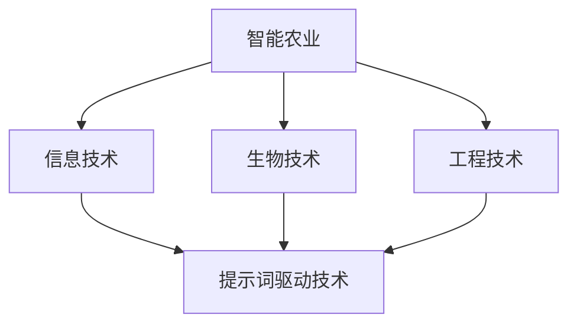

                 

### 文章标题：提示词驱动的智能农业：精准种植与收获预测

> 关键词：智能农业、提示词驱动、精准种植、收获预测、人工智能、农业技术

> 摘要：本文探讨了提示词驱动的智能农业技术，通过分析环境、作物和农事活动的相关提示词，实现了农业生产过程的精准化管理和收获预测。文章介绍了智能农业的基本概念、提示词驱动技术的原理与应用，以及核心算法原理、数学模型和实际应用案例，为推动农业现代化提供了新的思路和解决方案。

### 目录大纲

## 第一部分：智能农业与提示词驱动技术

### 第1章：智能农业概述

#### 1.1 智能农业的定义与重要性

- **智能农业的定义**
  智能农业是指利用信息技术、生物技术和工程技术的综合应用，实现农业生产过程的高效、精准和可持续发展。

- **智能农业的重要性**
  随着人口增长和资源短缺，提高农业产出和降低环境压力成为全球共同面临的问题。智能农业为解决这些问题提供了新的途径。

#### 1.2 传统农业与智能农业的比较

- **传统农业的现状**
  传统农业主要依赖经验，生产效率低，资源利用不充分。

- **智能农业的优势**
  智能农业通过信息化手段，实现了对农作物生长环境的实时监测和管理，提高了生产效率和资源利用率。

### 第2章：提示词驱动技术的原理与应用

#### 2.1 提示词驱动技术的基础概念

- **提示词的定义**
  提示词是指与农作物生长、环境变化和农事活动相关的关键词。

- **提示词驱动技术的基本原理**
  通过分析环境、作物和农事活动的提示词，为农业生产提供决策支持。

#### 2.2 提示词驱动技术在智能农业中的应用

- **种植决策中的应用**
  通过分析土壤、气候和作物生长状态的提示词，实现精准种植。

- **收获预测中的应用**
  通过分析作物生长周期和产量数据的提示词，实现收获预测。

## 第二部分：智能农业中的核心算法与模型

### 第3章：精准种植算法

#### 3.1 精准种植算法的概念

- **精准种植的定义**
  精准种植是指根据农作物的生长需求和环境条件，制定出最优的种植方案。

- **精准种植的目标**
  提高农作物的产量和品质，降低生产成本，实现农业的可持续发展。

#### 3.2 精准种植算法的原理与实现

- **数据采集与预处理**
  收集土壤、气候和作物生长数据，并进行预处理。

- **模型选择与训练**
  选择合适的模型，并对其进行训练。

- **模型评估与优化**
  对训练好的模型进行评估和优化。

### 第4章：收获预测算法

#### 4.1 收获预测算法的概念

- **收获预测的定义**
  收获预测是指根据农作物生长数据和历史产量数据，预测未来的收获量。

- **收获预测的目标**
  提高农业生产的计划和决策效率。

#### 4.2 收获预测算法的原理与实现

- **数据采集与预处理**
  收集作物生长、土壤、气候等数据，并进行预处理。

- **模型选择与训练**
  选择合适的模型，并对其进行训练。

- **模型评估与优化**
  对训练好的模型进行评估和优化。

### 第5章：作物生长模型

#### 5.1 作物生长模型的概念

- **作物生长模型的定义**
  作物生长模型是指用于模拟农作物生长过程的数学模型。

- **作物生长模型的作用**
  为农业生产提供科学依据，优化种植策略。

#### 5.2 作物生长模型的构建方法

- **确定模型的目标和假设**
  明确模型要解决的问题和假设条件。

- **模型参数的确定与优化**
  确定模型参数，并进行优化。

## 第三部分：智能农业应用案例与实践

### 第6章：智能农业项目案例

#### 6.1 案例一：智能温室种植

- **项目背景**
  通过智能温室种植技术，提高农作物的产量和品质。

- **技术实现**
  利用传感器、物联网和人工智能技术，实现温室环境实时监测和智能控制。

- **项目成果**
  成功实现了温室环境的最优化管理，提高了农作物的产量和品质。

#### 6.2 案例二：智能农田管理

- **项目背景**
  通过智能农田管理技术，提高农田的生产效率和资源利用率。

- **技术实现**
  利用遥感、无人机和大数据分析技术，实现农田的精准管理和决策支持。

- **项目成果**
  大幅度提高了农田的生产效率和资源利用率，降低了农业生产成本。

### 第7章：智能农业的实际应用与未来展望

#### 7.1 智能农业的实际应用现状

- **国内外智能农业的应用情况**
  智能农业在国内外已取得显著成果，应用领域广泛。

- **智能农业的主要应用领域**
  包括智能温室、智能灌溉、智能施肥、智能病虫害防治等。

#### 7.2 智能农业的未来发展趋势

- **提示词驱动技术的未来发展方向**
  提高提示词驱动的精准度和智能化水平。

- **智能农业的未来挑战与机遇**
  面临数据安全、隐私保护、技术标准化等挑战，同时也充满机遇。

## 附录

### 附录A：智能农业相关的工具和资源

- **数据采集和处理工具**
  包括传感器、无人机、大数据平台等。

- **提示词驱动技术的相关库和框架**
  如 TensorFlow、PyTorch、Keras 等。

- **智能农业的应用案例和数据集**
  提供实际应用案例和数据集，供学习和研究使用。

### 核心概念与联系

- **智能农业的概念与提示词驱动技术的关系**
  智能农业是利用信息技术、生物技术和工程技术的综合应用，而提示词驱动技术是智能农业中的一种关键技术，用于实时监测和分析农业环境、作物生长状态和农事活动，为农业生产提供决策支持。



### 核心算法原理讲解

#### 精准种植算法的伪代码

```python
# 精准种植算法的伪代码

# 输入：作物生长数据、土壤数据、气候数据等
# 输出：种植决策

function 精准种植算法(数据集):
    # 数据预处理
    数据集 = 数据预处理(数据集)

    # 选择模型
    模型 = 选择模型()

    # 训练模型
    模型 = 训练模型(数据集)

    # 预测种植决策
    种植决策 = 预测种植决策(模型)

    # 模型评估与优化
    评估结果 = 评估模型(模型)
    模型 = 优化模型(模型)

    return 种植决策
```

#### 收获预测算法的伪代码

```python
# 收获预测算法的伪代码

# 输入：作物生长数据、土壤数据、气候数据等
# 输出：收获预测结果

function 收获预测算法(数据集):
    # 数据预处理
    数据集 = 数据预处理(数据集)

    # 选择模型
    模型 = 选择模型()

    # 训练模型
    模型 = 训练模型(数据集)

    # 预测收获结果
    收获预测结果 = 预测收获结果(模型)

    # 模型评估与优化
    评估结果 = 评估模型(模型)
    模型 = 优化模型(模型)

    return 收获预测结果
```

### 作物生长模型的数学公式

$$
作物生长模型 = f(环境因素，作物特性，种植管理)
$$

- **环境因素**：包括土壤质量、气候条件、水资源等。
- **作物特性**：包括品种特性、生长周期、生理特征等。
- **种植管理**：包括施肥、灌溉、病虫害防治等。

### 数学模型和数学公式详细讲解

#### 精准种植算法的数学模型

$$
S = f(\text{土壤质量}, \text{气候条件}, \text{作物特性}, \text{种植管理})
$$

- **土壤质量**：影响作物生长的关键因素，包括土壤的pH值、养分含量等。
- **气候条件**：包括温度、湿度、光照等。
- **作物特性**：包括作物的生长周期、需水量、需肥量等。
- **种植管理**：包括施肥量、灌溉量、病虫害防治措施等。

#### 收获预测算法的数学模型

$$
Y = f(\text{作物生长数据}, \text{土壤数据}, \text{气候数据}, \text{种植管理})
$$

- **作物生长数据**：包括作物的生长速度、生长周期等。
- **土壤数据**：包括土壤的养分含量、pH值等。
- **气候数据**：包括温度、湿度、光照等。
- **种植管理**：包括施肥量、灌溉量、病虫害防治措施等。

### 实际案例分析与详细讲解剖析

#### 案例一：智能温室种植

- **背景**：某温室种植基地，种植西红柿，需解决温室环境控制、病虫害防治等问题。

- **技术实现**：
  - **环境监测**：利用传感器实时监测温室内的温度、湿度、光照等环境参数。
  - **智能控制**：通过物联网技术，将传感器数据传输至中央控制系统，根据预设的种植策略进行环境调控。
  - **病虫害防治**：通过智能识别技术，实时监测病虫害发生情况，并采取相应的防治措施。

- **成果**：
  - 温室环境得到有效控制，西红柿的产量和品质显著提高。
  - 病虫害防治效率提高，减少了农药的使用量。

#### 案例二：智能农田管理

- **背景**：某农田，种植小麦，需解决水资源管理、施肥量控制等问题。

- **技术实现**：
  - **水资源管理**：利用遥感技术和无人机，实时监测农田的土壤水分含量，根据作物需水量进行智能灌溉。
  - **施肥量控制**：通过土壤分析技术，实时监测土壤养分含量，根据作物需求进行精准施肥。

- **成果**：
  - 水资源利用效率提高，农田灌溉用水量减少。
  - 施肥量控制准确，减少了肥料的使用量，提高了作物产量和品质。

### 项目小结

智能农业的提示词驱动技术通过实时监测和分析农业环境、作物生长状态和农事活动，实现了农业生产过程的精准化管理和收获预测。通过实际案例可以看出，智能农业技术在提高生产效率、降低生产成本、提高农产品质量等方面具有显著优势。然而，智能农业的发展仍面临数据安全、隐私保护、技术标准化等挑战，需要进一步加强技术创新和产业合作。

### 最佳实践 tips

- **数据安全与隐私保护**：在智能农业应用中，要重视数据安全与隐私保护，确保农业数据的合法合规使用。
- **技术标准化**：加强智能农业技术的标准化工作，提高不同系统之间的互操作性。
- **产业合作**：推动农业企业、科研机构、政府等各方合作，共同推进智能农业技术的发展和应用。

### 注意事项

- **设备维护**：定期检查和维护农业设备，确保设备正常运行。
- **数据分析**：对农业生产数据进行深入分析，挖掘数据价值，为决策提供依据。

### 拓展阅读

- 《智能农业：概念、技术与应用》
- 《农业物联网技术与应用》
- 《智能农业大数据分析》
- 《精准农业与农业自动化》

### 附录

#### 附录A：智能农业相关的工具和资源

- **数据采集和处理工具**：包括传感器、无人机、大数据平台等。
- **提示词驱动技术的相关库和框架**：如 TensorFlow、PyTorch、Keras 等。
- **智能农业的应用案例和数据集**：提供实际应用案例和数据集，供学习和研究使用。

# 作者信息

作者：AI天才研究院/AI Genius Institute & 禅与计算机程序设计艺术 /Zen And The Art of Computer Programming

