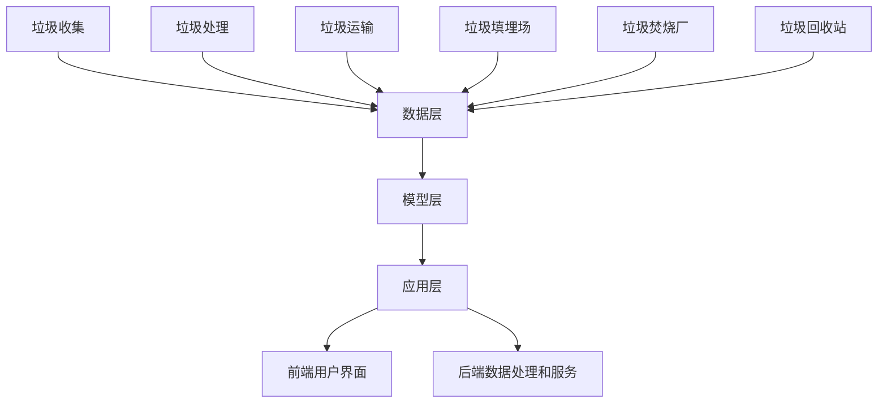

                 

### 文章标题

《提示词驱动的智能垃圾分类系统》

---

**关键词：** 智能垃圾分类、提示词驱动、机器学习、特征提取、分类算法、数学模型、项目实战

---

**摘要：** 本文将深入探讨提示词驱动的智能垃圾分类系统，首先介绍垃圾分类的背景和意义，接着阐述提示词驱动的原理，然后详细解析智能垃圾分类系统的架构。在核心算法原理讲解部分，我们将分别介绍特征提取算法、分类算法和提示词生成算法，并通过数学模型和公式进行详细讲解。最后，通过实际项目实战，展示系统开发环境搭建、源代码实现与解读，以及系统性能评估，为读者提供全面的智能垃圾分类系统设计与应用指导。

---

### 目录

1. **垃圾分类系统概述**
   1.1 垃圾分类系统的基本概念
   1.2 提示词驱动的原理
   1.3 智能垃圾分类系统的架构

2. **核心算法原理讲解**
   2.1 特征提取算法
   2.2 分类算法
   2.3 提示词生成算法

3. **数学模型和数学公式**
   3.1 特征提取的数学模型
   3.2 分类算法的数学模型
   3.3 提示词生成的数学模型

4. **项目实战**
   4.1 系统开发环境搭建
   4.2 源代码实现与解读
   4.3 系统性能评估

5. **最佳实践与拓展**
   5.1 最佳实践 Tips
   5.2 小结
   5.3 注意事项
   5.4 拓展阅读

---

### 1. 垃圾分类系统概述

#### 1.1 垃圾分类系统的基本概念

随着城市化进程的加速和人口的增长，垃圾处理问题日益严重。垃圾不仅占据了大量的土地，还污染了水源、空气和土壤，对生态环境和人类健康造成了极大的威胁。因此，垃圾分类成为了一个迫切需要解决的问题。垃圾分类系统通过将垃圾按照不同的种类进行分类处理，实现资源的回收利用和减少环境污染。

垃圾分类系统主要由以下几个部分组成：

- **垃圾收集**：负责将垃圾从产生地点运输到处理地点。
- **垃圾处理**：包括垃圾的压缩、消毒、分类等处理过程。
- **垃圾运输**：负责将处理后的垃圾运输到相应的处理场所。
- **垃圾处理场所**：包括垃圾填埋场、垃圾焚烧厂、垃圾回收站等。

#### 1.2 提示词驱动的原理

提示词驱动是一种基于机器学习和自然语言处理的技术，它通过分析文本数据中的关键词和短语，提取出具有代表性的提示词，用于后续的数据处理和决策。在智能垃圾分类系统中，提示词驱动技术可以帮助识别垃圾的类型，从而实现自动分类。

提示词驱动的原理主要包括以下几个步骤：

1. **数据预处理**：对原始文本数据进行清洗和预处理，包括去除停用词、标点符号和特殊字符等。
2. **特征提取**：使用词袋模型、TF-IDF等方法提取文本数据的特征向量。
3. **提示词生成**：根据特征向量，利用机器学习算法（如 K-最近邻、支持向量机等）生成提示词。
4. **分类决策**：将生成的提示词与已知垃圾类型进行匹配，实现垃圾分类。

#### 1.3 智能垃圾分类系统的架构

智能垃圾分类系统可以分为以下几个层次：

- **数据层**：包括垃圾收集、处理和运输过程中的数据，如垃圾类型、重量、体积等。
- **模型层**：包括提示词生成模型、分类模型等，用于实现垃圾的识别和分类。
- **应用层**：包括前端用户界面、后端数据处理和服务等，用于实现系统的功能。

智能垃圾分类系统的架构图如下所示：



### 2. 核心算法原理讲解

#### 2.1 特征提取算法

特征提取是智能垃圾分类系统中的一个重要环节，它旨在从原始数据中提取出对分类任务有用的特征。常见的特征提取算法包括词袋模型、TF-IDF、词嵌入等。

##### 词袋模型

词袋模型是一种基于统计的方法，它将文本视为一个词汇的集合，不考虑词汇的顺序。词袋模型的主要步骤如下：

1. **文本预处理**：去除标点符号、停用词等。
2. **词汇表构建**：将文本中的词汇转换为唯一的标识符。
3. **特征向量生成**：对于每个文档，生成一个词汇的布尔向量，其中每个元素表示词汇在文档中是否出现。

伪代码如下：

```python
def bag_of_words(document):
    # 去除标点符号和停用词
    cleaned_document = remove_punctuation_and_stopwords(document)
    # 构建词汇表
    vocabulary = build_vocabulary(cleaned_document)
    # 生成特征向量
    feature_vector = [0] * len(vocabulary)
    for word in cleaned_document:
        feature_vector[vocabulary[word]] = 1
    return feature_vector
```

##### TF-IDF

TF-IDF（Term Frequency-Inverse Document Frequency）是一种基于统计的方法，它考虑了词汇在文档中的重要程度。TF-IDF的主要步骤如下：

1. **文本预处理**：去除标点符号、停用词等。
2. **词汇表构建**：将文本中的词汇转换为唯一的标识符。
3. **特征向量生成**：计算每个词汇在文档中的TF（词频）和IDF（逆文档频率），然后生成特征向量。

伪代码如下：

```python
def tf_idf(document, corpus):
    # 去除标点符号和停用词
    cleaned_document = remove_punctuation_and_stopwords(document)
    # 构建词汇表
    vocabulary = build_vocabulary(corpus)
    # 计算TF
    tf = [document.count(word) for word in cleaned_document]
    # 计算IDF
    idf = [1 / (1 + log(1 + N / df(word))) for word in vocabulary]
    # 生成特征向量
    feature_vector = [tf[i] * idf[i] for i in range(len(vocabulary))]
    return feature_vector
```

##### 词嵌入

词嵌入（Word Embedding）是一种将词汇映射为高维向量空间的方法，它通过学习词汇之间的语义关系，实现文本数据的向量化表示。常见的词嵌入模型包括 Word2Vec、GloVe 等。

伪代码如下：

```python
def word_embedding(vocabulary, embedding_size):
    # 初始化词向量
    embeddings = [[0 for _ in range(embedding_size)] for _ in range(len(vocabulary))]
    # 训练词向量
    for word in vocabulary:
        # 训练过程
        update_embeddings(embeddings, word, embedding_size)
    return embeddings
```

#### 2.2 分类算法

分类算法是智能垃圾分类系统的核心，它用于将垃圾数据分为不同的类别。常见的分类算法包括 K-最近邻（K-Nearest Neighbors, KNN）、支持向量机（Support Vector Machine, SVM）等。

##### K-最近邻（KNN）

KNN是一种基于实例的学习算法，它通过比较新样本与训练样本的相似度，预测新样本的类别。KNN的主要步骤如下：

1. **训练**：使用已标记的垃圾数据训练模型。
2. **预测**：对于新样本，计算它与训练样本的相似度，并根据相似度最高的 K 个样本的类别，预测新样本的类别。

伪代码如下：

```python
def knn(train_data, train_labels, test_data, k):
    # 计算相似度
    similarities = []
    for i in range(len(train_data)):
        similarity = compute_similarity(test_data, train_data[i])
        similarities.append((similarity, i))
    # 排序
    similarities.sort(reverse=True)
    # 取前 K 个最相似样本的类别
    labels = [train_labels[similarities[i][1]] for i in range(k)]
    # 计算类别概率
    probabilities = compute_probabilities(labels)
    # 返回预测类别
    return max(probabilities, key=probabilities.get)
```

##### 支持向量机（SVM）

SVM是一种基于间隔最大化的分类算法，它通过寻找一个超平面，将不同类别的样本分开。SVM的主要步骤如下：

1. **训练**：使用已标记的垃圾数据训练模型，计算支持向量。
2. **预测**：对于新样本，计算它与支持向量的相似度，预测新样本的类别。

伪代码如下：

```python
def svm(train_data, train_labels, test_data):
    # 训练模型
    model = train_svm(train_data, train_labels)
    # 预测类别
    labels = []
    for i in range(len(test_data)):
        label = predict_svm(model, test_data[i])
        labels.append(label)
    return labels
```

#### 2.3 提示词生成算法

提示词生成算法是智能垃圾分类系统中的关键环节，它用于生成具有代表性的提示词，帮助分类算法更好地识别垃圾类型。常见的提示词生成算法包括词频统计、TF-IDF 等。

##### 词频统计

词频统计是一种简单的提示词生成算法，它通过计算词汇在文档中的出现次数，生成提示词。词频统计的主要步骤如下：

1. **文本预处理**：去除标点符号、停用词等。
2. **词频计算**：计算每个词汇在文档中的出现次数。
3. **提示词生成**：选择出现次数最多的词汇作为提示词。

伪代码如下：

```python
def word_frequency(document):
    # 去除标点符号和停用词
    cleaned_document = remove_punctuation_and_stopwords(document)
    # 计算词频
    frequency = {}
    for word in cleaned_document:
        if word in frequency:
            frequency[word] += 1
        else:
            frequency[word] = 1
    # 生成提示词
    keywords = [word for word, count in frequency.items() if count > threshold]
    return keywords
```

##### TF-IDF

TF-IDF 是一种基于统计的方法，它通过计算词汇的 TF（词频）和 IDF（逆文档频率），生成提示词。TF-IDF 的主要步骤如下：

1. **文本预处理**：去除标点符号、停用词等。
2. **词频计算**：计算每个词汇在文档中的出现次数。
3. **IDF 计算

