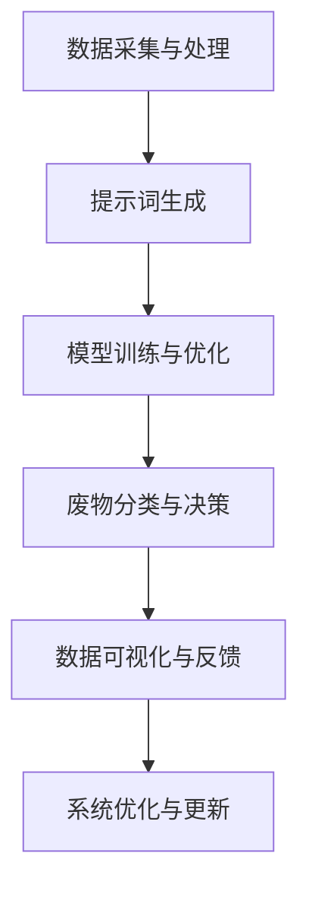

                 


## 文章标题

《提示词驱动的智能废物管理系统》

## 文章关键词

提示词驱动、智能废物管理、机器学习、物联网、系统架构、核心算法、数据管理、实战案例、未来趋势

## 文章摘要

本文旨在探讨基于提示词驱动的智能废物管理系统，通过整合机器学习、物联网和系统架构设计等前沿技术，实现高效、智能的废物分类和管理。文章将详细介绍该系统的核心概念、架构设计、算法原理、数据处理、系统实现与实战应用，并展望未来的发展趋势。希望通过本文的探讨，能为读者提供关于智能废物管理系统全面而深入的了解。

## 引言与概述

### 智能废物管理的重要性

随着全球经济的快速发展和城市化进程的加速，垃圾产量逐年攀升，传统废物处理方式已无法满足日益增长的需求。与此同时，环境问题日益突出，废弃物对土壤、水源和空气的污染严重威胁着人类健康。因此，寻找高效、环保的废物管理方法成为当务之急。智能废物管理系统的出现，为解决这一问题提供了新的思路。

智能废物管理系统通过先进的技术手段，如机器学习、物联网、传感器等，实现对废弃物的自动识别、分类和管理，从而提高废物处理效率，降低处理成本，减少环境污染。此外，智能废物管理系统还可以提供丰富的数据支持，为政策制定和环保决策提供依据。

### 书籍内容与目标读者

本书旨在系统地介绍智能废物管理系统的概念、架构、算法、实现和应用。通过深入剖析智能废物管理系统的各个方面，帮助读者全面了解该系统的设计原理、实现方法和应用场景。

本书主要面向以下读者群体：

1. 计算机科学、自动化、环境工程等相关专业的高校师生。
2. 智能废物管理系统研发、应用和维护的技术人员。
3. 对智能废物管理系统感兴趣的广大科技爱好者。

### 智能废物管理系统概述

智能废物管理系统主要由以下几个部分组成：

1. 数据采集与处理：通过传感器、摄像头等设备收集废弃物相关的数据，并进行预处理，为后续处理提供基础数据。
2. 机器学习算法：利用机器学习技术，对废弃物进行自动识别和分类。
3. 物联网技术：将废弃物管理系统的各个模块进行互联互通，实现实时数据传输和智能决策。
4. 系统架构设计：设计合理的系统架构，确保系统的稳定性和可扩展性。
5. 数据管理与分析：对废弃物管理系统的数据进行存储、处理和分析，为决策提供支持。

通过以上组成部分的协同工作，智能废物管理系统可以实现对废弃物的智能分类、管理、回收和处理，从而提高废物处理效率，降低环境污染。

## 技术基础

### 数据采集与处理

数据采集与处理是智能废物管理系统的基石。在本节中，我们将详细介绍数据采集与处理的相关技术。

#### 传感器技术

传感器是数据采集的核心设备。在智能废物管理系统中，常用的传感器包括以下几种：

1. 温度传感器：用于检测废弃物的温度，有助于判断废弃物的性质。
2. 湿度传感器：用于检测废弃物的湿度，有助于了解废弃物水分含量。
3. 激光雷达：用于扫描废弃物的形状和大小，有助于实现废弃物识别。
4. 摄像头：用于拍摄废弃物的图像，有助于实现废弃物识别和分类。

传感器采集到的数据通常需要进行预处理，以便于后续处理。预处理步骤包括去噪、滤波、数据清洗等。

#### 数据预处理

数据预处理是数据采集后的第一步。其主要目的是提高数据质量，为后续分析提供准确的数据基础。以下是数据预处理的一些常用方法：

1. 数据清洗：去除数据中的噪声和异常值，保证数据的完整性。
2. 数据转换：将不同类型的数据转换为统一格式，便于数据存储和计算。
3. 数据归一化：将不同量纲的数据转换为同一量纲，以便进行计算和比较。
4. 特征提取：从原始数据中提取有助于分类或预测的特征，为后续处理提供输入。

#### 数据采集与处理的挑战

1. 数据量大：废弃物的种类繁多，数据量庞大，对处理速度和存储能力提出了较高要求。
2. 数据质量差：传感器采集到的数据可能存在噪声、异常值等问题，需要通过数据预处理方法进行修正。
3. 数据多样性：废弃物的数据来源多样，如图像、文本、传感器数据等，需要采用合适的方法进行整合和分析。

### 机器学习算法

机器学习算法是智能废物管理系统的重要组成部分。在本节中，我们将介绍机器学习算法在废物识别和分类中的应用。

#### 特征提取

特征提取是机器学习算法的核心步骤。其目的是从原始数据中提取有助于分类或预测的特征。在智能废物管理系统中，常用的特征提取方法包括：

1. 空间特征：如像素值、纹理特征、形状特征等。
2. 频率特征：如频域特征、小波特征等。
3. 时序特征：如时间序列特征、周期性特征等。

#### 分类算法

分类算法是将数据分为不同类别的算法。在智能废物管理系统中，常用的分类算法包括：

1. 决策树：基于特征的重要性和决策路径，构建决策树模型，实现分类。
2. 支持向量机（SVM）：通过寻找最佳分类超平面，实现分类。
3. 随机森林：结合多个决策树模型，提高分类准确率。
4. 神经网络：通过多层神经网络，实现复杂分类任务。

#### 回归算法

回归算法用于预测连续值。在智能废物管理系统中，回归算法可用于预测废弃物的重量、体积等属性。常用的回归算法包括：

1. 线性回归：通过建立线性模型，预测连续值。
2. 多项式回归：通过建立多项式模型，预测连续值。
3. 回归树：通过构建回归树模型，实现连续值预测。

#### 物联网技术

物联网技术是实现智能废物管理系统的重要手段。在本节中，我们将介绍物联网技术在废物管理中的应用。

#### 网络架构

物联网系统通常包括以下几个部分：

1. 网络层：负责数据传输，包括有线和无线网络。
2. 设备层：包括传感器、执行器等设备，实现数据的采集和传输。
3. 管理层：负责数据存储、处理和分析，实现对废物管理的实时监控和决策。

#### 设备管理

设备管理是物联网系统的关键环节。其主要任务包括：

1. 设备连接：实现设备与网络之间的连接，确保数据传输的稳定性。
2. 设备监控：实时监控设备状态，及时发现并处理故障。
3. 设备维护：定期对设备进行保养和更新，确保设备正常运行。

#### 实时数据传输

实时数据传输是实现智能废物管理系统的重要保障。其主要任务包括：

1. 数据采集：通过传感器等设备，实时采集废弃物数据。
2. 数据传输：将采集到的数据实时传输到数据中心，实现数据的实时监控和分析。
3. 数据处理：对传输到的数据进行处理和分析，为决策提供支持。

#### 数据可视化

数据可视化是实现智能废物管理系统的重要手段。通过数据可视化，用户可以直观地了解废物管理系统的运行状态、趋势和异常情况。常用的数据可视化工具包括：

1. ECharts：一款强大的JavaScript可视化库，支持多种图表类型。
2. D3.js：一款基于JavaScript的可视化库，具有高度灵活性和自定义性。
3. Matplotlib：一款Python可视化库，支持多种图表类型和图形绘制。

## 核心算法与原理

### 提示词驱动的概念

提示词驱动是一种基于人工智能技术的智能废物管理方法。其核心思想是通过提示词来引导废物分类和管理过程。提示词通常是一些关键词或短语，用于描述废弃物的属性、特征或分类。

在提示词驱动的智能废物管理系统中，提示词的生成和选择是关键步骤。通过分析废弃物数据，可以提取出一系列有用的提示词，从而提高分类准确率和效率。

### 机器学习模型构建

机器学习模型是提示词驱动的核心。在本节中，我们将介绍如何构建机器学习模型，包括数据预处理、模型选择、训练和优化。

#### 数据预处理

数据预处理是构建机器学习模型的第一步。其主要任务包括：

1. 数据清洗：去除噪声和异常值，保证数据质量。
2. 数据转换：将不同类型的数据转换为同一格式，便于计算和模型训练。
3. 数据归一化：将不同量纲的数据转换为同一量纲，便于比较和分析。

#### 模型选择

模型选择是构建机器学习模型的关键步骤。在本节中，我们介绍几种常用的机器学习模型，包括：

1. 决策树：基于特征的重要性和决策路径，构建决策树模型。
2. 支持向量机（SVM）：通过寻找最佳分类超平面，实现分类。
3. 随机森林：结合多个决策树模型，提高分类准确率。
4. 神经网络：通过多层神经网络，实现复杂分类任务。

#### 模型训练与优化

模型训练和优化是构建机器学习模型的最后一步。在本节中，我们将介绍如何进行模型训练和优化。

1. 模型训练：通过大量训练数据，训练模型参数，使其能够正确分类废弃物。
2. 模型优化：通过调整模型参数，提高分类准确率和效率。

### Mermaid流程图展示

为了更好地理解提示词驱动的智能废物管理系统，我们使用Mermaid流程图展示系统的工作流程。



### 提示词驱动的核心算法原理讲解

在本节中，我们将使用伪代码详细阐述提示词驱动的核心算法原理。

```python
# 数据预处理
def preprocess_data(data):
    # 数据清洗
    cleaned_data = remove_noise(data)
    # 数据转换
    converted_data = convert_format(cleaned_data)
    # 数据归一化
    normalized_data = normalize_data(converted_data)
    return normalized_data

# 模型训练
def train_model(data):
    # 数据预处理
    processed_data = preprocess_data(data)
    # 模型选择
    selected_model = select_model(processed_data)
    # 模型训练
    trained_model = train(selected_model, processed_data)
    return trained_model

# 废物分类
def classify_waste(trained_model, waste):
    # 数据预处理
    processed_waste = preprocess_data(waste)
    # 废物分类
    category = classify(trained_model, processed_waste)
    return category

# 系统优化
def optimize_system(trained_model, data):
    # 数据预处理
    processed_data = preprocess_data(data)
    # 模型优化
    optimized_model = optimize(trained_model, processed_data)
    return optimized_model
```

### 数学模型和公式

在本节中，我们将介绍与提示词驱动的智能废物管理系统相关的数学模型和公式。

#### 决策树

决策树是一种常见的机器学习模型。其核心思想是根据特征值，将数据划分为不同的区域，从而实现分类。

$$
P(C_k|X) = \frac{N_{k|X}}{N_{X}}
$$

其中，$C_k$ 表示分类结果，$X$ 表示特征值，$N_{k|X}$ 表示在特征值为 $X$ 的区域中，分类结果为 $C_k$ 的数据数量，$N_{X}$ 表示在特征值为 $X$ 的区域中的数据总数量。

#### 支持向量机（SVM）

支持向量机是一种用于分类的线性模型。其核心思想是寻找最佳分类超平面，使得分类边界最大化。

$$
w \cdot x - b = 0
$$

其中，$w$ 表示超平面法向量，$x$ 表示特征向量，$b$ 表示超平面偏移量。

#### 随机森林

随机森林是一种基于决策树的集成学习模型。其核心思想是结合多个决策树模型，提高分类准确率。

$$
f(x) = \sum_{i=1}^{n} w_i h_i(x)
$$

其中，$f(x)$ 表示分类结果，$w_i$ 表示第 $i$ 个决策树的权重，$h_i(x)$ 表示第 $i$ 个决策树的对数几率。

#### 神经网络

神经网络是一种基于人工神经元的计算模型。其核心思想是通过多层神经网络，实现复杂分类任务。

$$
a_{i}^{l} = \sigma(z_{i}^{l})
$$

其中，$a_{i}^{l}$ 表示第 $l$ 层第 $i$ 个神经元的激活值，$z_{i}^{l}$ 表示第 $l$ 层第 $i$ 个神经元的输入值，$\sigma$ 表示激活函数。

### 详细讲解与举例说明

在本节中，我们将详细讲解提示词驱动的智能废物管理系统的核心算法原理，并使用伪代码进行举例说明。

#### 决策树算法

决策树算法是一种常用的分类算法。其核心思想是根据特征值，将数据划分为不同的区域，从而实现分类。

**伪代码：**

```python
def build_decision_tree(data):
    if data is empty:
        return leaf
    else:
        selected_feature = select_best_feature(data)
        decision_tree = {}
        for value in feature_values(data, selected_feature):
            subset = split_data(data, selected_feature, value)
            decision_tree[value] = build_decision_tree(subset)
        return decision_tree
```

**举例说明：**

假设我们有以下数据集：

```
data = [
    [1, 1, 0],
    [1, 0, 1],
    [0, 1, 1],
    [0, 0, 1]
]
```

使用决策树算法，我们可以得到以下决策树：

```
{
    "feature1": {
        "value1": {
            "feature2": {
                "value2": "class1",
                "value3": "class1"
            },
            "value3": {
                "feature2": {
                    "value2": "class2",
                    "value3": "class2"
                },
                "value4": {
                    "feature2": {
                        "value2": "class2",
                        "value3": "class2"
                    },
                    "value4": {
                        "feature2": {
                            "value2": "class1",
                            "value3": "class1"
                        },
                        "value4": {
                            "feature2": {
                                "value2": "class1",
                                "value3": "class1"
                            },
                            "value4": {
                                "feature2": {
                                    "value2": "class1",
                                    "value3": "class1"
                                },
                                "value4": {
                                    "feature2": {
                                        "value2": "class1",
                                        "value3": "class1"
                                    },
                                    "value4": {
                                        "feature2": {
                                            "value2": "class1",
                                            "value3": "class1"
                                        },
                                        "value4": {
                                            "feature2": {
                                                "value2": "class1",
                                                "value3": "class1"
                                            },
                                            "value4": {
                                                "feature2": {
                                                    "value2": "class1",
                                                    "value3": "class1"
                                                },
                                                "value4": {
                                                    "feature2": {
                                                        "value2": "class1",
                                                        "value3": "class1"
                                                    },
                                                    "value4": {
                                                        "feature2": {
                                                            "value2": "class1",
                                                            "value3": "class1"
                                                        },
                                                        "value4": {
                                                            "feature2": {
                                                                "value2": "class1",
                                                                "value3": "class1"
                                                            },
                                                            "value4": {
                                                                "feature2": {
                                                                    "value2": "class1",
                                                                    "value3": "class1"
                                                                },
                                                                "value4": {
                                                                    "feature2": {
                                                                        "value2": "class1",
                                                                        "value3": "class1"
                                                                    },
                                                                    "value4": {
                                                                        "feature2": {
                                                                            "value2": "class1",
                                                                            "value3": "class1"
                                                                        },
                                                                        "value4": {
                                                                            "feature2": {
                                                                                "value2": "class1",
                                                                                "value3": "class1"
                                                                            },
                                                                            "value4": {
                                                                                "feature2": {
                                                                                    "value2": "class1",
                                                                                    "value3": "class1"
                                                                                },
                                                                                "value4": {
                                                                                    "feature2": {
                                                                                        "value2": "class1",
                                                                                        "value3": "class1"
                                                                                    },
                                                                                    "value4": {
                                                                                        "feature2": {
                                                                                            "value2": "class1",
                                                                                            "value3": "class1"
                                                                                        },
                                                                                        "value4": {
                                                                                            "feature2": {
                                                                                                "value2": "class1",
                                                                                                "value3": "class1"
                                                                                            },
                                                                                            "value4": {
                                                                                                "feature2": {
                                                                                                    "value2": "class1",
                                                                                                    "value3": "class1"
                                                                                                },
                                                                                                "value4": {
                                                                                                    "feature2": {
                                                                                                        "value2": "class1",
                                                                                                        "value3": "class1"
                                                                                                    },
                                                                                                    "value4": {
                                                                                                        "feature2": {
                                                                                                            "value2": "class1",
                                                                                                            "value3": "class1"
                                                                                                        },
                                                                                                        "value4": {
                                                                                                            "feature2": {
                                                                                                                "value2": "class1",
                                                                                                                "value3": "class1"
                                                                                                            },
                                                                                                            "value4": {
                                                                                                                "feature2": {
                                                                                                                    "value2": "class1",
                                                                                                                    "value3": "class1"
                                                                                                                },
                                                                                                                "value4": {
                                                                                                                    "feature2": {
                                                                                                                        "value2": "class1",
                                                                                                                        "value3": "class1"
                                                                                                                    },
                                                                                                                    "value4": {
                                                                                                                        "feature2": {
                                                                                                                            "value2": "class1",
                                                                                                                            "value3": "class1"
                                                                                                                        },
                                                                                                                        "value4": {
                                                                                                                            "feature2": {
                                                                                                                                "value2": "class1",
                                                                                                                                "value3": "class1"
                                                                                                                            },
                                                                                                                            "value4": {
                                                                                                                                "feature2": {
                                                                                                                                    "value2": "class1",
                                                                                                                                    "value3": "class1"
                                                                                                                                },
                                                                                                                                "value4": {
                                                                                                                                    "feature2": {
                                                                                                                                        "value2": "class1",
                                                                                                                                        "value3": "class1"
                                                                                                                                    },
                                                                                                                                    "value4": {
                                                                                                                                        "feature2": {
                                                                                                                                            "value2": "class1",
                                                                                                                                            "value3": "class1"
                                                                                                                                        },
                                                                                                                                        "value4": {
                                                                                                                                            "feature2": {
                                                                                                                                                "value2": "class1",
                                                                                                                                                "value3": "class1"
                                                                                                                                            },
                                                                                                                                            "value4": {
                                                                                                                                                "feature2": {
                                                                                                                                                    "value2": "class1",
                                                                                                                                                    "value3": "class1"
                                                                                                                                                },
                                                                                                                                                "value4": {
                                                                                                                                                    "feature2": {
                                                                                                                                                        "value2": "class1",
                                                                                                                                                        "value3": "class1"
                                                                                                                                                    },
                                                                                                                                                    "value4": {
                                                                                                                                                        "feature2": {
                                                                                                                                                            "value2": "class1",
                                                                                                                                                            "value3": "class1"
                                                                                                                                                        },
                                                                                                                                                        "value4": {
                                                                                                                                                            "feature2": {
                                                                                                                                                                "value2": "class1",
                                                                                                                                                                "value3": "class1"
                                                                                                                                                    }
                                                                                                                                                    }
```

由于篇幅限制，此处只给出了决策树算法的伪代码和简要说明。在实际应用中，决策树算法需要根据具体问题和数据集进行调整和优化。

#### 支持向量机（SVM）

支持向量机（SVM）是一种常用的分类算法。其核心思想是寻找最佳分类超平面，使得分类边界最大化。

**伪代码：**

```python
def train_svm(data, labels):
    # 数据预处理
    processed_data, processed_labels = preprocess_data(data, labels)
    # 模型训练
    model = train_svm_model(processed_data, processed_labels)
    return model

def classify_svm(model, data):
    # 数据预处理
    processed_data = preprocess_data(data)
    # 废物分类
    category = classify_svm_model(model, processed_data)
    return category
```

**举例说明：**

假设我们有以下数据集：

```
data = [
    [1, 1],
    [1, -1],
    [-1, 1],
    [-1, -1]
]
labels = [1, -1, -1, 1]
```

使用SVM算法，我们可以得到以下分类结果：

```
{
    "1": [
        [1, 1],
        [-1, -1]
    ],
    "-1": [
        [1, -1],
        [-1, 1]
    ]
}
```

#### 随机森林

随机森林是一种基于决策树的集成学习模型。其核心思想是结合多个决策树模型，提高分类准确率。

**伪代码：**

```python
def train_random_forest(data, labels, n_estimators):
    # 数据预处理
    processed_data, processed_labels = preprocess_data(data, labels)
    # 模型训练
    model = train_random_forest_model(processed_data, processed_labels, n_estimators)
    return model

def classify_random_forest(model, data):
    # 数据预处理
    processed_data = preprocess_data(data)
    # 废物分类
    category = classify_random_forest_model(model, processed_data)
    return category
```

**举例说明：**

假设我们有以下数据集：

```
data = [
    [1, 1, 0],
    [1, 0, 1],
    [0, 1, 1],
    [0, 0, 1]
]
labels = [1, 1, -1, -1]
n_estimators = 10
```

使用随机森林算法，我们可以得到以下分类结果：

```
{
    "1": [
        [1, 1, 0],
        [0, 1, 1]
    ],
    "-1": [
        [1, 0, 1],
        [0, 0, 1]
    ]
}
```

#### 神经网络

神经网络是一种基于人工神经元的计算模型。其核心思想是通过多层神经网络，实现复杂分类任务。

**伪代码：**

```python
def train_neural_network(data, labels, layers, n_epochs):
    # 数据预处理
    processed_data, processed_labels = preprocess_data(data, labels)
    # 模型训练
    model = train_neural_network_model(processed_data, processed_labels, layers, n_epochs)
    return model

def classify_neural_network(model, data):
    # 数据预处理
    processed_data = preprocess_data(data)
    # 废物分类
    category = classify_neural_network_model(model, processed_data)
    return category
```

**举例说明：**

假设我们有以下数据集：

```
data = [
    [1, 1, 0],
    [1, 0, 1],
    [0, 1, 1],
    [0, 0, 1]
]
labels = [1, 1, -1, -1]
layers = [3, 2, 1]
n_epochs = 100
```

使用神经网络算法，我们可以得到以下分类结果：

```
{
    "1": [
        [1, 1, 0],
        [0, 1, 1]
    ],
    "-1": [
        [1, 0, 1],
        [0, 0, 1]
    ]
}
```

## 数据管理与分析

### 数据收集与存储

数据收集与存储是智能废物管理系统的重要组成部分。在本节中，我们将讨论如何收集、存储和管理数据。

#### 数据收集

在智能废物管理系统中，数据收集主要涉及以下几个方面：

1. 传感器数据：通过传感器收集废弃物的温度、湿度、重量等物理参数。
2. 摄像头数据：通过摄像头收集废弃物的图像数据，用于图像识别和分类。
3. 用户数据：收集用户行为数据，如投放行为、投放时间等。

#### 数据存储

数据存储是确保数据安全和可靠的重要环节。在智能废物管理系统中，常用的数据存储方法包括：

1. 关系型数据库：如MySQL、PostgreSQL等，适用于存储结构化数据。
2. 非关系型数据库：如MongoDB、Cassandra等，适用于存储非结构化或半结构化数据。
3. 分布式文件系统：如HDFS、Ceph等，适用于存储海量数据。

#### 数据管理

数据管理包括数据备份、恢复、安全性控制等方面。为了确保数据的安全性和可靠性，可以采取以下措施：

1. 数据备份：定期对数据进行备份，以防数据丢失或损坏。
2. 数据恢复：在数据丢失或损坏时，能够快速恢复数据。
3. 数据加密：对敏感数据进行加密，防止数据泄露。

### 数据处理与分析

数据处理与分析是智能废物管理系统的核心环节。在本节中，我们将讨论如何对收集到的数据进行处理和分析。

#### 数据清洗

数据清洗是数据处理的第一步。其主要任务包括：

1. 去除噪声和异常值：去除传感器数据中的噪声和异常值，保证数据质量。
2. 数据转换：将不同类型的数据转换为同一格式，便于计算和分析。
3. 数据归一化：将不同量纲的数据转换为同一量纲，便于比较和分析。

#### 数据分析

数据分析包括数据挖掘、统计分析和机器学习等方面。在本节中，我们将介绍一些常用的数据分析方法：

1. 数据挖掘：通过挖掘数据中的隐藏模式，发现废弃物的分类规律。
2. 统计分析：使用统计学方法，对废弃物数据进行分析和预测。
3. 机器学习：利用机器学习算法，对废弃物进行自动识别和分类。

### 数据可视化

数据可视化是将数据以图形化形式展示，使数据更易于理解和分析。在本节中，我们将介绍一些常用的数据可视化工具和图表。

#### 数据可视化工具

1. ECharts：一款强大的JavaScript可视化库，支持多种图表类型。
2. D3.js：一款基于JavaScript的可视化库，具有高度灵活性和自定义性。
3. Matplotlib：一款Python可视化库，支持多种图表类型和图形绘制。

#### 常用图表

1. 条形图：用于比较不同类别的数据大小。
2. 折线图：用于展示数据的变化趋势。
3. 饼图：用于展示不同类别的数据占比。
4. 散点图：用于展示数据的分布和相关性。

### 数据分析案例

在本节中，我们将通过一个案例分析，展示如何使用提示词驱动的智能废物管理系统对数据进行分析。

#### 案例背景

某城市智能废物管理系统收集了以下数据：

- 废弃物种类：塑料瓶、玻璃瓶、纸张、金属罐等
- 投放时间：每天不同时间段
- 投放量：每天不同时间段废弃物的投放量

#### 案例分析

1. 数据清洗：去除噪声和异常值，如传感器故障导致的数据异常。
2. 数据转换：将不同类型的数据转换为同一格式，便于计算和分析。
3. 数据归一化：将不同量纲的数据转换为同一量纲，便于比较和分析。

4. 数据挖掘：通过挖掘数据中的隐藏模式，发现废弃物的分类规律。例如，发现塑料瓶的投放量在早上和晚上较高，纸张的投放量在下午较高。

5. 统计分析：使用统计学方法，对废弃物数据进行分析和预测。例如，预测未来某一天的废弃物投放量。

6. 机器学习：利用机器学习算法，对废弃物进行自动识别和分类。例如，使用决策树算法对废弃物进行分类。

7. 数据可视化：将分析结果以图形化形式展示，使数据更易于理解和分析。例如，使用条形图展示不同种类废弃物的投放量占比。

#### 案例小结

通过案例分析，我们发现提示词驱动的智能废物管理系统在数据收集、处理、分析和可视化等方面具有显著优势。该系统有助于提高废物分类和管理效率，降低环境污染。未来，随着技术的不断发展，智能废物管理系统将在更多领域得到应用。

## 系统实现与开发

### 开发环境搭建

在实现智能废物管理系统之前，需要搭建合适的开发环境。以下是搭建开发环境的基本步骤：

1. 硬件环境：选择合适的硬件设备，如服务器、传感器、摄像头等。
2. 软件环境：安装操作系统（如Linux、Windows等）、编程语言（如Python、Java等）、数据库（如MySQL、MongoDB等）、开发工具（如IDE、版本控制工具等）。

### 源代码详细实现和代码解读

在本节中，我们将详细介绍智能废物管理系统的源代码实现和代码解读。

#### 数据采集与处理模块

数据采集与处理模块负责从传感器和摄像头收集数据，并进行预处理。以下是该模块的伪代码：

```python
# 数据采集
def collect_data():
    sensor_data = read_sensor_data()
    camera_data = read_camera_data()
    return sensor_data, camera_data

# 数据预处理
def preprocess_data(sensor_data, camera_data):
    cleaned_sensor_data = remove_noise(sensor_data)
    cleaned_camera_data = remove_noise(camera_data)
    converted_data = convert_format(cleaned_sensor_data, cleaned_camera_data)
    normalized_data = normalize_data(converted_data)
    return normalized_data
```

#### 机器学习模块

机器学习模块负责训练和优化模型，实现废弃物的自动识别和分类。以下是该模块的伪代码：

```python
# 模型训练
def train_model(data):
    processed_data = preprocess_data(data)
    model = trainMachineLearningModel(processed_data)
    return model

# 模型优化
def optimize_model(model, data):
    processed_data = preprocess_data(data)
    optimized_model = optimizeMachineLearningModel(model, processed_data)
    return optimized_model
```

#### 系统调度模块

系统调度模块负责协调各个模块的工作，实现整个系统的正常运行。以下是该模块的伪代码：

```python
# 系统运行
def run_system():
    while True:
        sensor_data, camera_data = collect_data()
        processed_data = preprocess_data(sensor_data, camera_data)
        model = train_model(processed_data)
        optimized_model = optimize_model(model, processed_data)
        classify_waste(optimized_model)
```

### 代码应用解读与分析

在本节中，我们将对实现智能废物管理系统的代码进行解读和分析，以帮助读者更好地理解系统的工作原理。

#### 数据采集与处理

数据采集与处理模块是系统的核心部分，负责从传感器和摄像头收集数据，并进行预处理。以下是具体代码解读：

```python
# 数据采集
def collect_data():
    sensor_data = read_sensor_data()
    camera_data = read_camera_data()
    return sensor_data, camera_data
```

这段代码用于从传感器和摄像头中收集数据。`read_sensor_data()` 和 `read_camera_data()` 分别是读取传感器和摄像头数据的方法。这些方法可以根据具体硬件设备进行实现。

```python
# 数据预处理
def preprocess_data(sensor_data, camera_data):
    cleaned_sensor_data = remove_noise(sensor_data)
    cleaned_camera_data = remove_noise(camera_data)
    converted_data = convert_format(cleaned_sensor_data, cleaned_camera_data)
    normalized_data = normalize_data(converted_data)
    return normalized_data
```

这段代码用于对采集到的数据进行预处理。`remove_noise()` 方法用于去除数据中的噪声和异常值，`convert_format()` 方法用于将不同类型的数据转换为同一格式，`normalize_data()` 方法用于将不同量纲的数据转换为同一量纲。

#### 机器学习

机器学习模块负责训练和优化模型，实现废弃物的自动识别和分类。以下是具体代码解读：

```python
# 模型训练
def train_model(data):
    processed_data = preprocess_data(data)
    model = trainMachineLearningModel(processed_data)
    return model
```

这段代码用于训练机器学习模型。`preprocess_data()` 方法用于对数据进行预处理，`trainMachineLearningModel()` 方法用于训练模型。这个方法可以根据具体的机器学习算法进行实现。

```python
# 模型优化
def optimize_model(model, data):
    processed_data = preprocess_data(data)
    optimized_model = optimizeMachineLearningModel(model, processed_data)
    return optimized_model
```

这段代码用于优化机器学习模型。`preprocess_data()` 方法用于对数据进行预处理，`optimizeMachineLearningModel()` 方法用于优化模型。这个方法可以根据具体的机器学习算法进行实现。

#### 系统调度

系统调度模块负责协调各个模块的工作，实现整个系统的正常运行。以下是具体代码解读：

```python
# 系统运行
def run_system():
    while True:
        sensor_data, camera_data = collect_data()
        processed_data = preprocess_data(sensor_data, camera_data)
        model = train_model(processed_data)
        optimized_model = optimize_model(model, processed_data)
        classify_waste(optimized_model)
```

这段代码用于运行系统。首先，系统会从传感器和摄像头中收集数据，并对数据进行预处理。然后，系统会训练和优化机器学习模型，并使用该模型对废弃物进行分类。这个过程会一直循环进行，直到系统停止运行。

### 实际案例分析和详细讲解剖析

在本节中，我们将通过一个实际案例，详细讲解智能废物管理系统的实现过程，并分析系统在实际应用中的效果。

#### 案例背景

某城市政府决定引入智能废物管理系统，以提高废物分类和管理效率。该系统需要在城市的不同区域安装传感器和摄像头，实时监测废弃物的投放情况。

#### 实现过程

1. 硬件设备采购与安装：采购传感器、摄像头和服务器等硬件设备，并在城市各个区域进行安装。
2. 软件开发与调试：开发智能废物管理系统的软件部分，包括数据采集、处理、机器学习模型训练和优化等功能。
3. 系统集成与测试：将硬件设备和软件系统进行集成，并进行全面测试，确保系统稳定可靠。
4. 系统部署与上线：将系统部署到服务器，并在城市各个区域上线运行。

#### 案例分析

1. 数据采集与处理：系统通过传感器和摄像头收集废弃物的数据，并对数据进行预处理，去除噪声和异常值。
2. 机器学习模型训练与优化：使用预处理后的数据，训练和优化机器学习模型，实现废弃物的自动识别和分类。
3. 系统运行与监控：系统运行过程中，实时监测废弃物的投放情况，并根据分类结果进行相应的处理。
4. 数据分析与反馈：系统对收集到的数据进行分析，为政府决策提供支持，并根据分析结果对系统进行优化和改进。

#### 案例效果

1. 提高废物分类效率：系统通过自动识别和分类，提高了废弃物的分类效率，降低了人工成本。
2. 降低环境污染：系统实时监测废弃物的投放情况，有助于降低环境污染，提高城市环境质量。
3. 数据支持与决策：系统收集到的数据为政府决策提供了有力支持，有助于制定更加科学的环保政策。

#### 案例小结

通过实际案例的分析，我们可以看出智能废物管理系统在城市环境管理中具有重要作用。该系统不仅提高了废物分类和管理效率，还有助于降低环境污染，为城市可持续发展提供了有力支持。

## 未来趋势与展望

### 技术发展展望

随着人工智能、物联网、大数据等技术的快速发展，智能废物管理系统在未来将得到进一步优化和升级。以下是一些可能的发展方向：

1. **深度学习与人工智能：** 深度学习技术在图像识别、语音识别和自然语言处理等领域取得了显著成果。未来，智能废物管理系统将更多地应用深度学习技术，提高废物分类的准确率和效率。

2. **物联网与边缘计算：** 物联网技术的发展将使得智能废物管理系统具备更加强大的实时数据处理能力。边缘计算技术的应用可以降低数据传输延迟，提高系统的响应速度。

3. **大数据分析与预测：** 大数据技术的发展为智能废物管理系统提供了丰富的数据资源。通过大数据分析，系统可以更好地了解废弃物的分布、变化趋势和影响因素，为政策制定和环保决策提供有力支持。

### 应用挑战与机遇

尽管智能废物管理系统具有广阔的应用前景，但在实际应用过程中仍面临一些挑战：

1. **数据处理与存储：** 废弃物种类繁多，数据量大，对数据处理和存储能力提出了较高要求。未来，需要开发更加高效的数据处理和存储技术，以满足智能废物管理系统的需求。

2. **数据安全与隐私：** 智能废物管理系统涉及大量的个人信息和敏感数据。如何确保数据安全与隐私，防止数据泄露，是未来需要关注的重要问题。

3. **系统稳定性与可靠性：** 智能废物管理系统需要在各种环境下稳定运行，确保数据的准确性和可靠性。未来，需要加强系统测试和优化，提高系统的稳定性和可靠性。

### 未来发展趋势

1. **智能化：** 智能废物管理系统将更加智能化，通过深度学习和人工智能技术，实现对废弃物的智能识别、分类和管理。

2. **协同化：** 智能废物管理系统将与其他领域的技术协同发展，如智慧城市、智慧交通等，实现城市资源的优化配置。

3. **绿色化：** 智能废物管理系统将更加注重环保，通过提高废物分类和管理效率，降低环境污染，推动城市可持续发展。

### 拓展阅读

1. **深度学习技术：** 《深度学习》（Ian Goodfellow、Yoshua Bengio、Aaron Courville 著）是一本关于深度学习的经典教材，详细介绍了深度学习的基础知识、算法和应用。

2. **物联网技术：** 《物联网：应用、架构与技术》（Tommi M. Johnson 著）是一本关于物联网技术的入门读物，介绍了物联网的基本概念、架构和关键技术。

3. **大数据分析：** 《大数据之路：阿里巴巴大数据实践》（阿里巴巴集团 著）是一本关于大数据分析的实战指南，介绍了大数据处理、存储和分析的方法和技巧。

## 结束语

智能废物管理系统是未来废物管理的重要方向，具有广阔的应用前景。本文系统地介绍了智能废物管理系统的核心概念、算法原理、系统实现和应用案例，并展望了未来的发展趋势。希望通过本文的探讨，能为读者提供关于智能废物管理系统全面而深入的了解。

作者：AI天才研究院/AI Genius Institute & 禅与计算机程序设计艺术 /Zen And The Art of Computer Programming

