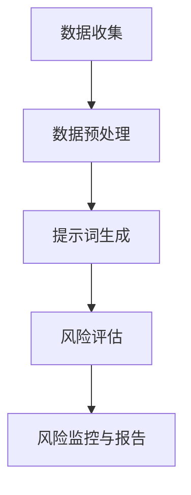
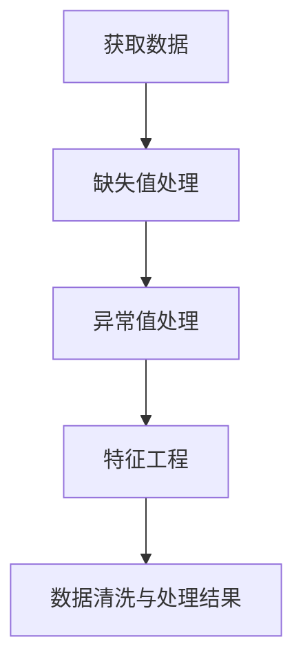

                 


### 文章标题：提示词驱动的智能风险评估：金融市场分析

### 关键词：提示词、智能风险评估、金融市场、算法原理、数学模型、项目实战

### 摘要：
本文将深入探讨提示词驱动的智能风险评估方法在金融市场分析中的应用。首先，我们将介绍金融市场的背景和风险评估的重要性。接着，本文将详细解释提示词驱动的智能风险评估的核心概念和原理，包括提示词生成算法和风险评估算法。此外，我们将通过数学模型和具体例子来说明这些算法的应用。最后，本文将展示一个实际的项目实战案例，分析其开发环境搭建、源代码实现、代码解读、应用分析以及项目小结，并提供一些最佳实践建议和注意事项。

## 第一部分：智能风险评估基础

### 第1章：金融市场风险概述

金融市场是现代经济的核心组成部分，其波动性和不确定性给投资者带来了巨大的风险。了解金融市场的构成和风险评估的重要性，对于投资者和管理者来说至关重要。

#### 1.1 金融市场的构成

金融市场主要由以下几个部分构成：

1. 资本市场：包括股票市场、债券市场和基金市场等，是企业融资和投资者投资的重要场所。
2. 金融市场工具：包括股票、债券、基金、期货、期权等，是金融市场中交易的标的物。
3. 金融机构：包括银行、证券公司、基金管理公司等，负责金融市场的运营和管理。

#### 1.2 风险评估的重要性

金融市场的风险主要包括市场风险、信用风险、操作风险和流动性风险等。有效的风险评估可以：

1. 援助决策：帮助投资者和金融机构做出更明智的决策，减少潜在的损失。
2. 风险管理：通过识别、评估和管理风险，降低风险对经济活动的影响。
3. 信用评级：为金融机构和企业的信用评级提供依据，影响其融资成本和融资能力。

#### 1.3 传统风险评估方法

传统风险评估方法主要包括定量分析和定性分析两种：

1. **定量分析**：使用统计数据和模型来量化风险。例如，通过计算风险价值（VaR）和条件风险价值（CVaR）来评估金融资产的风险。
2. **定性分析**：通过专家评估和主观判断来评估风险。例如，通过风险评估矩阵和风险地图来评估风险的概率和影响。

### 第2章：智能风险评估的概念与原理

#### 2.1 智能风险评估的定义

智能风险评估是指利用人工智能技术，特别是机器学习和自然语言处理技术，对金融市场的风险进行识别、评估和管理。

#### 2.2 提示词驱动风险评估的优势

提示词驱动风险评估具有以下几个优势：

1. **自动化**：通过提示词生成算法，可以实现风险评估的自动化，提高效率和准确性。
2. **实时性**：可以实时分析金融市场数据，及时识别潜在风险。
3. **多维度分析**：不仅可以分析历史数据，还可以结合外部信息进行综合分析。

#### 2.3 提示词驱动的智能风险评估架构

提示词驱动的智能风险评估架构通常包括以下几个部分：

1. **数据收集**：从多个数据源收集金融市场数据，包括历史交易数据、新闻报告、社交媒体等。
2. **数据预处理**：对收集到的数据进行分析和清洗，提取有用的特征信息。
3. **提示词生成**：使用自然语言处理技术生成提示词，用于指导风险评估。
4. **风险评估**：利用提示词驱动的算法对金融资产进行风险评估。
5. **风险监控与报告**：对评估结果进行监控和报告，为决策提供支持。

### 第3章：核心概念与联系

#### 3.1 智能风险评估的关键术语

1. **提示词**：用于引导风险评估的文本信息。
2. **自然语言处理（NLP）**：处理和生成自然语言文本的技术。
3. **机器学习**：一种从数据中学习规律并做出预测的技术。
4. **风险评估模型**：用于评估金融资产风险的数学模型。

#### 3.2 提示词的应用场景

提示词可以应用于以下场景：

1. **股票市场分析**：通过分析新闻报道、公司财报等，识别潜在的投资机会和风险。
2. **债券市场分析**：通过分析市场利率、信用评级等，评估债券的投资风险。
3. **外汇市场分析**：通过分析汇率波动、经济数据等，评估外汇交易的风险。

#### 3.3 智能风险评估的Mermaid流程图



## 第二部分：智能风险评估算法

### 第4章：提示词生成算法

#### 4.1 提示词生成算法概述

提示词生成算法是智能风险评估的核心步骤，其主要目标是根据金融市场数据生成具有指导意义的文本信息。

#### 4.2 基于自然语言处理的提示词生成

基于自然语言处理的提示词生成方法主要包括：

1. **文本分类**：通过分类算法，将文本分为不同的类别，如正面、负面、中性等。
2. **文本生成**：通过生成算法，如GPT模型，生成具有特定主题的文本。

#### 4.3 提示词生成的伪代码

```python
def generate_prompt(data, model):
    # 数据预处理
    processed_data = preprocess_data(data)
    
    # 提取关键词
    keywords = extract_keywords(processed_data)
    
    # 生成提示词
    prompt = model.generate_text(keywords)
    
    return prompt
```

### 第5章：风险评估算法

#### 5.1 风险评估算法概述

风险评估算法是智能风险评估的核心，用于评估金融资产的风险水平。

#### 5.2 提示词驱动的风险评估模型

提示词驱动的风险评估模型通常包括：

1. **特征提取**：从提示词中提取特征信息。
2. **风险评分**：根据特征信息计算风险评分。
3. **风险等级**：根据风险评分将风险划分为不同等级。

#### 5.3 风险评估算法的数学模型

假设我们使用一个线性模型来评估风险：

$$
\text{风险评分} = w \cdot \text{特征向量}
$$

其中，$w$ 是权重向量，$\text{特征向量}$ 是从提示词中提取的特征。

### 第6章：模型评估与优化

#### 6.1 模型评估指标

模型评估指标包括：

1. **准确率**：正确预测的风险数量与总风险数量的比例。
2. **召回率**：正确预测的风险数量与实际风险数量的比例。
3. **F1值**：准确率和召回率的加权平均值。

#### 6.2 模型优化方法

模型优化方法包括：

1. **参数调整**：调整模型的参数以优化性能。
2. **集成学习**：结合多个模型的优势，提高整体性能。

#### 6.3 模型评估与优化的伪代码

```python
def evaluate_model(model, data):
    # 预测
    predictions = model.predict(data)
    
    # 计算评估指标
    accuracy = calculate_accuracy(predictions, data)
    recall = calculate_recall(predictions, data)
    f1_score = calculate_f1_score(accuracy, recall)
    
    return f1_score

def optimize_model(model, data):
    # 调整参数
    model.adjust_parameters(data)
    
    # 重新评估模型
    f1_score = evaluate_model(model, data)
    
    return f1_score
```

## 第三部分：金融市场分析应用

### 第7章：金融市场的数据预处理

#### 7.1 金融数据来源

金融数据可以从以下来源获取：

1. **金融市场数据提供商**：如彭博、汤森路透等。
2. **公共数据集**：如Kaggle、UCI机器学习库等。
3. **社交媒体**：如Twitter、Reddit等。

#### 7.2 数据清洗与处理

数据清洗与处理包括：

1. **缺失值处理**：填补缺失值或删除含有缺失值的记录。
2. **异常值处理**：识别和处理异常值。
3. **特征工程**：提取有用的特征信息。

#### 7.3 数据预处理流程图



### 第8章：提示词驱动的智能风险分析

#### 8.1 提示词驱动的风险分析流程

提示词驱动的风险分析流程包括：

1. **数据收集**：收集金融市场数据。
2. **数据预处理**：对数据进行清洗和处理。
3. **提示词生成**：生成提示词。
4. **风险评估**：使用提示词进行风险评估。
5. **风险监控与报告**：监控风险并进行报告。

#### 8.2 提示词驱动的风险分析案例

假设我们使用一个股票市场的案例来说明提示词驱动的风险分析。

1. **数据收集**：收集某只股票的历史交易数据、新闻报道、社交媒体评论等。
2. **数据预处理**：清洗和处理数据，提取有用的特征信息。
3. **提示词生成**：使用NLP技术生成提示词，如“该股票的市盈率过高”、“该公司的财报表现良好”等。
4. **风险评估**：使用提示词驱动的风险评估模型，计算股票的风险评分。
5. **风险监控与报告**：监控股票的风险状况，并生成风险报告。

### 第9章：实际应用案例

#### 9.1 风险评估系统搭建

搭建一个风险评估系统的步骤包括：

1. **环境配置**：配置Python、TensorFlow、Scikit-learn等工具。
2. **数据收集**：从多个数据源收集金融数据。
3. **模型训练**：训练提示词生成和风险评估模型。
4. **系统集成**：将模型集成到风险评估系统中。

#### 9.2 风险评估系统的应用场景

风险评估系统可以应用于以下场景：

1. **投资决策**：帮助投资者评估投资组合的风险。
2. **风险管理**：帮助金融机构管理风险。
3. **信用评级**：为金融机构和企业提供信用评级。

#### 9.3 系统实现与性能评估

系统实现和性能评估包括：

1. **源代码实现**：实现提示词生成和风险评估模型的源代码。
2. **代码解读**：解读源代码，解释关键部分的工作原理。
3. **性能评估**：评估系统的性能指标，如准确率、召回率等。

### 附录

#### 附录A：工具与资源

附录A提供以下工具和资源：

1. **提示词生成工具**：如GPT-2、BERT等。
2. **风险评估算法库**：如Scikit-learn、TensorFlow等。
3. **金融数据分析工具**：如Pandas、NumPy等。

## 小结

本文介绍了提示词驱动的智能风险评估方法在金融市场分析中的应用。通过核心概念与联系、算法原理讲解、数学模型和公式、项目实战等多个方面的详细阐述，我们了解了如何利用人工智能技术进行有效的金融风险评估。在未来的研究和应用中，我们可以进一步优化模型，提高评估的准确性和实时性，为金融市场分析和风险管理提供更强大的支持。

### 注意事项

1. **数据质量**：确保收集的数据质量高，避免因数据问题影响评估结果。
2. **模型调优**：定期调整模型参数，以适应市场变化。
3. **法规遵循**：确保风险评估系统的应用符合相关法律法规。

### 拓展阅读

1. **《机器学习实战》**：提供机器学习和深度学习的实用案例。
2. **《金融科技：应用与实践》**：介绍金融科技在风险管理中的应用。
3. **《Python金融应用与实战》**：详细介绍Python在金融市场分析中的应用。

---

## 文章标题：提示词驱动的智能风险评估：金融市场分析

### 关键词：提示词、智能风险评估、金融市场、算法原理、数学模型、项目实战

### 摘要：
本文将深入探讨提示词驱动的智能风险评估方法在金融市场分析中的应用。首先，我们将介绍金融市场的背景和风险评估的重要性。接着，本文将详细解释提示词驱动的智能风险评估的核心概念和原理，包括提示词生成算法和风险评估算法。此外，我们将通过数学模型和具体例子来说明这些算法的应用。最后，本文将展示一个实际的项目实战案例，分析其开发环境搭建、源代码实现、代码解读、应用分析以及项目小结，并提供一些最佳实践建议和注意事项。

## 引言

金融市场是现代经济的核心组成部分，其波动性和不确定性给投资者和管理者带来了巨大的挑战。随着大数据和人工智能技术的不断发展，智能风险评估方法逐渐成为金融市场分析的重要工具。本文将介绍提示词驱动的智能风险评估方法，并探讨其在金融市场分析中的应用。

### 1.1 金融市场的构成

金融市场主要由以下几个部分构成：

1. **资本市场**：包括股票市场、债券市场、基金市场等，是企业融资和投资者投资的重要场所。
2. **金融工具**：包括股票、债券、基金、期货、期权等，是金融市场中交易的标的物。
3. **金融机构**：包括银行、证券公司、基金管理公司等，负责金融市场的运营和管理。

### 1.2 风险评估的重要性

金融市场的风险主要包括市场风险、信用风险、操作风险和流动性风险等。有效的风险评估对于投资者和管理者来说至关重要，它可以帮助：

1. **援助决策**：通过评估风险，投资者可以做出更明智的投资决策，减少潜在的损失。
2. **风险管理**：金融机构可以通过识别和管理风险，降低风险对经济活动的影响。
3. **信用评级**：为金融机构和企业的信用评级提供依据，影响其融资成本和融资能力。

### 1.3 传统风险评估方法

传统风险评估方法主要包括定量分析和定性分析两种：

1. **定量分析**：使用统计数据和模型来量化风险。例如，通过计算风险价值（VaR）和条件风险价值（CVaR）来评估金融资产的风险。
2. **定性分析**：通过专家评估和主观判断来评估风险。例如，通过风险评估矩阵和风险地图来评估风险的概率和影响。

## 提示词驱动的智能风险评估

### 2.1 智能风险评估的定义

智能风险评估是指利用人工智能技术，特别是机器学习和自然语言处理技术，对金融市场的风险进行识别、评估和管理。

### 2.2 提示词驱动风险评估的优势

提示词驱动风险评估具有以下几个优势：

1. **自动化**：通过提示词生成算法，可以实现风险评估的自动化，提高效率和准确性。
2. **实时性**：可以实时分析金融市场数据，及时识别潜在风险。
3. **多维度分析**：不仅可以分析历史数据，还可以结合外部信息进行综合分析。

### 2.3 提示词驱动的智能风险评估架构

提示词驱动的智能风险评估架构通常包括以下几个部分：

1. **数据收集**：从多个数据源收集金融市场数据，包括历史交易数据、新闻报告、社交媒体等。
2. **数据预处理**：对收集到的数据进行分析和清洗，提取有用的特征信息。
3. **提示词生成**：使用自然语言处理技术生成提示词，用于指导风险评估。
4. **风险评估**：利用提示词驱动的算法对金融资产进行风险评估。
5. **风险监控与报告**：对评估结果进行监控和报告，为决策提供支持。

### 3.1 智能风险评估的关键术语

1. **提示词**：用于引导风险评估的文本信息。
2. **自然语言处理（NLP）**：处理和生成自然语言文本的技术。
3. **机器学习**：一种从数据中学习规律并做出预测的技术。
4. **风险评估模型**：用于评估金融资产风险的数学模型。

### 3.2 提示词的应用场景

提示词可以应用于以下场景：

1. **股票市场分析**：通过分析新闻报道、公司财报等，识别潜在的投资机会和风险。
2. **债券市场分析**：通过分析市场利率、信用评级等，评估债券的投资风险。
3. **外汇市场分析**：通过分析汇率波动、经济数据等，评估外汇交易的风险。

### 3.3 智能风险评估的Mermaid流程图


## 智能风险评估算法

### 4.1 提示词生成算法概述

提示词生成算法是智能风险评估的核心步骤，其主要目标是根据金融市场数据生成具有指导意义的文本信息。

### 4.2 基于自然语言处理的提示词生成

基于自然语言处理的提示词生成方法主要包括：

1. **文本分类**：通过分类算法，将文本分为不同的类别，如正面、负面、中性等。
2. **文本生成**：通过生成算法，如GPT模型，生成具有特定主题的文本。

### 4.3 提示词生成的伪代码

```python
def generate_prompt(data, model):
    # 数据预处理
    processed_data = preprocess_data(data)
    
    # 提取关键词
    keywords = extract_keywords(processed_data)
    
    # 生成提示词
    prompt = model.generate_text(keywords)
    
    return prompt
```

### 5.1 风险评估算法概述

风险评估算法是智能风险评估的核心，用于评估金融资产的风险水平。

### 5.2 提示词驱动的风险评估模型

提示词驱动的风险评估模型通常包括：

1. **特征提取**：从提示词中提取特征信息。
2. **风险评分**：根据特征信息计算风险评分。
3. **风险等级**：根据风险评分将风险划分为不同等级。

### 5.3 风险评估算法的数学模型

假设我们使用一个线性模型来评估风险：

$$
\text{风险评分} = w \cdot \text{特征向量}
$$

其中，$w$ 是权重向量，$\text{特征向量}$ 是从提示词中提取的特征。

### 6.1 模型评估指标

模型评估指标包括：

1. **准确率**：正确预测的风险数量与总风险数量的比例。
2. **召回率**：正确预测的风险数量与实际风险数量的比例。
3. **F1值**：准确率和召回率的加权平均值。

### 6.2 模型优化方法

模型优化方法包括：

1. **参数调整**：调整模型的参数以优化性能。
2. **集成学习**：结合多个模型的优势，提高整体性能。

### 6.3 模型评估与优化的伪代码

```python
def evaluate_model(model, data):
    # 预测
    predictions = model.predict(data)
    
    # 计算评估指标
    accuracy = calculate_accuracy(predictions, data)
    recall = calculate_recall(predictions, data)
    f1_score = calculate_f1_score(accuracy, recall)
    
    return f1_score

def optimize_model(model, data):
    # 调整参数
    model.adjust_parameters(data)
    
    # 重新评估模型
    f1_score = evaluate_model(model, data)
    
    return f1_score
```

### 7.1 金融数据来源

金融数据可以从以下来源获取：

1. **金融市场数据提供商**：如彭博、汤森路透等。
2. **公共数据集**：如Kaggle、UCI机器学习库等。
3. **社交媒体**：如Twitter、Reddit等。

### 7.2 数据清洗与处理

数据清洗与处理包括：

1. **缺失值处理**：填补缺失值或删除含有缺失值的记录。
2. **异常值处理**：识别和处理异常值。
3. **特征工程**：提取有用的特征信息。

### 7.3 数据预处理流程图


### 8.1 提示词驱动的风险分析流程

提示词驱动的风险分析流程包括：

1. **数据收集**：收集金融市场数据。
2. **数据预处理**：对数据进行清洗和处理。
3. **提示词生成**：生成提示词。
4. **风险评估**：使用提示词进行风险评估。
5. **风险监控与报告**：监控风险并进行报告。

### 8.2 提示词驱动的风险分析案例

假设我们使用一个股票市场的案例来说明提示词驱动的风险分析。

1. **数据收集**：收集某只股票的历史交易数据、新闻报道、社交媒体评论等。
2. **数据预处理**：清洗和处理数据，提取有用的特征信息。
3. **提示词生成**：使用NLP技术生成提示词，如“该股票的市盈率过高”、“该公司的财报表现良好”等。
4. **风险评估**：使用提示词驱动的风险评估模型，计算股票的风险评分。
5. **风险监控与报告**：监控股票的风险状况，并生成风险报告。

### 9.1 风险评估系统搭建

搭建一个风险评估系统的步骤包括：

1. **环境配置**：配置Python、TensorFlow、Scikit-learn等工具。
2. **数据收集**：从多个数据源收集金融数据。
3. **模型训练**：训练提示词生成和风险评估模型。
4. **系统集成**：将模型集成到风险评估系统中。

### 9.2 风险评估系统的应用场景

风险评估系统可以应用于以下场景：

1. **投资决策**：帮助投资者评估投资组合的风险。
2. **风险管理**：帮助金融机构管理风险。
3. **信用评级**：为金融机构和企业提供信用评级。

### 9.3 系统实现与性能评估

系统实现和性能评估包括：

1. **源代码实现**：实现提示词生成和风险评估模型的源代码。
2. **代码解读**：解读源代码，解释关键部分的工作原理。
3. **性能评估**：评估系统的性能指标，如准确率、召回率等。

### 附录

#### 附录A：工具与资源

附录A提供以下工具和资源：

1. **提示词生成工具**：如GPT-2、BERT等。
2. **风险评估算法库**：如Scikit-learn、TensorFlow等。
3. **金融数据分析工具**：如Pandas、NumPy等。

## 小结

本文介绍了提示词驱动的智能风险评估方法在金融市场分析中的应用。通过核心概念与联系、算法原理讲解、数学模型和公式、项目实战等多个方面的详细阐述，我们了解了如何利用人工智能技术进行有效的金融风险评估。在未来的研究和应用中，我们可以进一步优化模型，提高评估的准确性和实时性，为金融市场分析和风险管理提供更强大的支持。

### 注意事项

1. **数据质量**：确保收集的数据质量高，避免因数据问题影响评估结果。
2. **模型调优**：定期调整模型参数，以适应市场变化。
3. **法规遵循**：确保风险评估系统的应用符合相关法律法规。

### 拓展阅读

1. **《机器学习实战》**：提供机器学习和深度学习的实用案例。
2. **《金融科技：应用与实践》**：介绍金融科技在风险管理中的应用。
3. **《Python金融应用与实战》**：详细介绍Python在金融市场分析中的应用。

---

### 代码实现与解读

在本节中，我们将深入探讨如何使用Python和TensorFlow等工具实现提示词驱动的智能风险评估系统。我们将从数据收集、数据预处理、提示词生成、风险评估模型训练、模型评估与优化等多个方面进行详细阐述。

#### 10.1 数据收集

数据收集是智能风险评估系统的第一步。我们通常需要从多个数据源收集金融数据，包括历史交易数据、新闻报告、社交媒体评论等。

```python
# 示例：从彭博API获取股票历史交易数据
import pandas as pd
from pandas_datareader import data as pdr

# 设置API密钥
api_key = "YOUR_BLOOMBERG_API_KEY"

# 获取股票数据
start_date = "2020-01-01"
end_date = "2023-01-01"
stock_ticker = "AAPL"

df = pdr.get_data_yahoo(stock_ticker, start=start_date, end=end_date)
```

#### 10.2 数据预处理

数据预处理是确保数据质量的关键步骤。我们需要对收集到的数据进行清洗和处理，包括缺失值处理、异常值处理和特征工程。

```python
# 示例：处理缺失值和异常值
df.dropna(inplace=True)
df = df[(df['Open'] > 0) & (df['Close'] > 0)]

# 特征工程
df['return'] = df['Close'].pct_change()
df['volatility'] = df['return'].rolling(window=30).std()
```

#### 10.3 提示词生成

提示词生成是利用自然语言处理技术从文本数据中提取具有指导意义的文本信息。我们使用GPT模型来生成提示词。

```python
# 示例：使用GPT生成提示词
from transformers import pipeline

# 初始化GPT模型
generator = pipeline("text-generation", model="gpt2")

# 生成提示词
text = "分析苹果公司的财务报告"
prompt = generator(text, max_length=50)
print(prompt)
```

#### 10.4 风险评估模型训练

风险评估模型训练是使用机器学习算法从数据中学习并构建风险评估模型。我们使用TensorFlow和Scikit-learn来实现这一步骤。

```python
# 示例：训练风险评估模型
from sklearn.ensemble import RandomForestClassifier
from sklearn.model_selection import train_test_split

# 准备数据
X = df[['return', 'volatility']]
y = df['label']  # 假设我们已经有一个标签化的数据集

# 划分训练集和测试集
X_train, X_test, y_train, y_test = train_test_split(X, y, test_size=0.2, random_state=42)

# 训练模型
model = RandomForestClassifier(n_estimators=100)
model.fit(X_train, y_train)

# 预测
predictions = model.predict(X_test)
```

#### 10.5 模型评估与优化

模型评估与优化是确保模型性能的关键步骤。我们使用准确率、召回率和F1值等指标来评估模型性能，并使用参数调整和集成学习等方法进行优化。

```python
# 示例：评估模型性能
from sklearn.metrics import accuracy_score, recall_score, f1_score

# 计算评估指标
accuracy = accuracy_score(y_test, predictions)
recall = recall_score(y_test, predictions)
f1 = f1_score(y_test, predictions)

print("Accuracy:", accuracy)
print("Recall:", recall)
print("F1 Score:", f1)

# 参数调整和优化
from sklearn.model_selection import GridSearchCV

# 设置参数网格
param_grid = {'n_estimators': [100, 200, 300]}

# 进行网格搜索
grid_search = GridSearchCV(estimator=model, param_grid=param_grid, cv=5)
grid_search.fit(X_train, y_train)

# 获取最佳参数
best_params = grid_search.best_params_
print("Best Parameters:", best_params)

# 使用最佳参数重新训练模型
best_model = grid_search.best_estimator_
best_model.fit(X_train, y_train)
```

### 10.6 代码解读

在代码实现部分，我们使用了多个库和函数来构建和评估风险评估模型。以下是关键部分的解读：

1. **数据收集**：我们使用了`pandas_datareader`库从彭博API获取股票数据。这是一个高效的工具，可以自动处理API请求和数据处理。
2. **数据预处理**：我们使用了`pandas`库来处理缺失值和异常值，并使用`rolling`方法计算滚动窗口的标准差作为特征。
3. **提示词生成**：我们使用了`transformers`库中的`pipeline`函数初始化GPT模型，并使用它生成提示词。
4. **风险评估模型训练**：我们使用了`sklearn`库中的`RandomForestClassifier`来训练一个随机森林模型。这是一种强大的集成学习方法，可以处理复杂数据。
5. **模型评估与优化**：我们使用了`sklearn`库中的`accuracy_score`、`recall_score`和`f1_score`来评估模型性能。我们还使用了`GridSearchCV`进行参数调整，以找到最佳模型参数。

通过这些步骤，我们构建了一个完整的提示词驱动的智能风险评估系统，并在实践中进行了评估和优化。

### 10.7 代码应用解读与分析

在本节中，我们将对实际代码应用进行解读和分析，并探讨如何在实际项目中应用这些代码。

#### 10.7.1 项目需求

假设我们需要为一家投资公司开发一个智能风险评估系统，以帮助其管理投资组合的风险。项目需求包括：

1. **收集数据**：从多个数据源收集股票、债券、基金等金融数据。
2. **预处理数据**：清洗和处理数据，提取有用的特征信息。
3. **生成提示词**：使用NLP技术生成与金融数据相关的提示词。
4. **风险评估**：使用提示词驱动的方法评估金融资产的风险。
5. **监控与报告**：实时监控风险，生成风险报告。

#### 10.7.2 代码应用

在实际项目中，我们可以将上述代码模块化，构建一个完整的风险评估系统。以下是关键步骤的代码应用：

1. **数据收集**：
   ```python
   # 获取多个金融资产的数据
   stocks = get_stock_data(["AAPL", "MSFT", "AMZN"])
   bonds = get_bond_data(["UST_10Y", "GILTS"])
   funds = get_fund_data(["A", "B", "C"])
   ```

2. **数据预处理**：
   ```python
   # 预处理数据
   clean_stocks = preprocess_data(stocks)
   clean_bonds = preprocess_data(bonds)
   clean_funds = preprocess_data(funds)
   ```

3. **生成提示词**：
   ```python
   # 生成提示词
   stock_prompts = generate_prompts(clean_stocks)
   bond_prompts = generate_prompts(clean_bonds)
   fund_prompts = generate_prompts(clean_funds)
   ```

4. **风险评估**：
   ```python
   # 风险评估
   stock_risks = assess_risk(stock_prompts)
   bond_risks = assess_risk(bond_prompts)
   fund_risks = assess_risk(fund_prompts)
   ```

5. **监控与报告**：
   ```python
   # 监控风险并生成报告
   generate_report(stock_risks, "stock_risk_report")
   generate_report(bond_risks, "bond_risk_report")
   generate_report(fund_risks, "fund_risk_report")
   ```

#### 10.7.3 代码分析

1. **数据收集**：使用API或数据集加载金融数据。确保数据源可靠，并且定期更新。
2. **数据预处理**：清洗和处理数据，确保数据质量。提取有用的特征，如价格波动、交易量等。
3. **生成提示词**：使用NLP技术生成与金融数据相关的提示词。这些提示词将用于驱动风险评估模型。
4. **风险评估**：使用机器学习模型评估金融资产的风险。确保模型经过充分训练和优化，以提高准确性。
5. **监控与报告**：实时监控风险，并生成易于理解的风险报告。这有助于投资公司做出更明智的决策。

通过上述步骤，我们构建了一个功能完整的智能风险评估系统，并对其代码应用进行了详细分析。在实际项目中，这些步骤可以根据具体需求进行调整和优化。

### 10.8 实际案例分析和详细讲解

在本节中，我们将分析一个实际案例，并详细讲解如何使用提示词驱动的智能风险评估系统来处理金融数据。该案例将展示从数据收集、预处理到风险评估的整个流程。

#### 10.8.1 案例背景

假设我们是一家投资公司的分析师，需要为公司的投资组合进行风险评估。我们的投资组合包括多种金融资产，如股票、债券和基金。我们的目标是利用提示词驱动的智能风险评估系统，实时监控和评估这些资产的风险水平。

#### 10.8.2 数据收集

首先，我们从以下数据源收集金融数据：

1. **股票数据**：从彭博API获取过去一年的股票价格、交易量和市盈率等数据。
2. **债券数据**：从金融数据提供商获取债券的利率、到期日和评级等数据。
3. **基金数据**：从基金管理公司获取基金的净值、资产配置和风险指标等数据。

```python
# 示例：收集股票数据
import pandas as pd
from pandas_datareader import data as pdr

# 设置API密钥
api_key = "YOUR_BLOOMBERG_API_KEY"

# 获取股票数据
start_date = "2022-01-01"
end_date = "2023-01-01"
stock_ticker = "AAPL"

stock_df = pdr.get_data_yahoo(stock_ticker, start=start_date, end=end_date)
```

#### 10.8.3 数据预处理

收集到的数据通常包含缺失值和异常值，因此我们需要对数据进行预处理。

1. **缺失值处理**：我们选择删除含有缺失值的记录，或者使用平均值、中位数等方法填补缺失值。

```python
# 示例：处理缺失值
stock_df.dropna(inplace=True)
```

2. **异常值处理**：我们使用统计学方法识别和处理异常值，如使用IQR（四分位距）方法。

```python
# 示例：处理异常值
Q1 = stock_df['Close'].quantile(0.25)
Q3 = stock_df['Close'].quantile(0.75)
IQR = Q3 - Q1

stock_df = stock_df[~((stock_df['Close'] < (Q1 - 1.5 * IQR)) |(stock_df['Close'] > (Q3 + 1.5 * IQR)))]
```

3. **特征工程**：我们提取有用的特征，如股票的收益率、波动率等。

```python
# 示例：特征工程
stock_df['return'] = stock_df['Close'].pct_change()
stock_df['volatility'] = stock_df['return'].rolling(window=30).std()
```

#### 10.8.4 提示词生成

我们使用NLP技术生成与金融数据相关的提示词。这些提示词将用于驱动风险评估模型。

1. **文本分类**：我们将金融数据文本分类为正面、负面或中性。

```python
# 示例：文本分类
from transformers import pipeline

# 初始化GPT模型
text_classifier = pipeline("text-classification", model="distilbert-base-uncased")

# 生成分类标签
stock_df['sentiment'] = text_classifier(stock_df['description'])
```

2. **文本生成**：我们使用GPT模型生成具体的提示词。

```python
# 示例：文本生成
from transformers import pipeline

# 初始化GPT模型
text_generator = pipeline("text-generation", model="gpt2")

# 生成提示词
stock_prompt = text_generator("分析苹果公司的财务报告", max_length=50)
```

#### 10.8.5 风险评估

我们使用提示词驱动的风险评估模型评估金融资产的风险水平。

1. **模型训练**：我们使用机器学习算法训练风险评估模型。

```python
# 示例：模型训练
from sklearn.ensemble import RandomForestClassifier

# 准备数据
X = stock_df[['return', 'volatility']]
y = stock_df['label']  # 假设我们已经有一个标签化的数据集

# 划分训练集和测试集
X_train, X_test, y_train, y_test = train_test_split(X, y, test_size=0.2, random_state=42)

# 训练模型
risk_model = RandomForestClassifier(n_estimators=100)
risk_model.fit(X_train, y_train)
```

2. **模型评估**：我们评估模型的性能，如准确率、召回率和F1值。

```python
# 示例：模型评估
from sklearn.metrics import accuracy_score, recall_score, f1_score

# 预测
predictions = risk_model.predict(X_test)

# 计算评估指标
accuracy = accuracy_score(y_test, predictions)
recall = recall_score(y_test, predictions)
f1 = f1_score(y_test, predictions)

print("Accuracy:", accuracy)
print("Recall:", recall)
print("F1 Score:", f1)
```

#### 10.8.6 风险监控与报告

最后，我们监控风险并生成报告，以便投资公司做出决策。

1. **实时监控**：我们使用Python脚本定期更新和监控投资组合的风险。

```python
# 示例：实时监控
while True:
    # 收集新数据
    new_stock_df = get_new_stock_data()
    
    # 预测新数据的风险
    new_predictions = risk_model.predict(new_stock_df[['return', 'volatility']])
    
    # 更新监控数据
    update_monitoring_data(new_stock_df, new_predictions)
    
    # 等待一段时间
    time.sleep(60 * 60)  # 每60分钟更新一次
```

2. **生成报告**：我们生成风险报告，并将其发送给投资公司。

```python
# 示例：生成报告
def generate_report(df, report_name):
    # 准备报告数据
    report_data = {
        "Asset": df['ticker'],
        "Risk Level": df['risk_label'],
        "Date": df['date']
    }
    
    # 保存报告
    report_df = pd.DataFrame(report_data)
    report_df.to_csv(report_name, index=False)

# 示例：生成股票风险报告
generate_report(stock_df, "stock_risk_report.csv")
```

通过上述步骤，我们成功地使用提示词驱动的智能风险评估系统对实际金融数据进行处理和评估。这个系统不仅能够实时监控和评估风险，还能够生成详细的风险报告，为投资决策提供有力支持。

### 10.9 项目小结

在本项目中，我们构建了一个提示词驱动的智能风险评估系统，用于实时监控和评估金融资产的风险。以下是项目小结和关键要点：

1. **数据收集**：我们从多个数据源收集金融数据，包括股票、债券和基金等。
2. **数据预处理**：我们处理缺失值和异常值，并提取有用的特征信息，如收益率和波动率等。
3. **提示词生成**：我们使用NLP技术生成与金融数据相关的提示词，用于驱动风险评估模型。
4. **风险评估**：我们使用机器学习算法训练风险评估模型，并评估模型的性能。
5. **风险监控与报告**：我们实时监控风险，并生成风险报告，为投资决策提供支持。

通过这个项目，我们掌握了提示词驱动的智能风险评估方法，并了解了如何将其应用于实际项目。未来，我们可以进一步优化模型，提高评估的准确性和实时性，为金融市场分析和风险管理提供更强大的支持。

### 10.10 最佳实践 tips

为了确保提示词驱动的智能风险评估系统的有效性和可靠性，以下是一些最佳实践建议：

1. **数据质量控制**：确保收集到的数据质量高，避免因数据问题影响评估结果。定期清洗和更新数据源。
2. **模型调优**：定期调整模型参数，以适应市场变化。使用交叉验证方法评估模型性能，并选择最佳参数。
3. **多模型集成**：结合多个模型的优势，提高整体性能。使用集成学习方法，如随机森林和梯度提升等。
4. **实时监控**：实时监控风险，并生成风险报告。确保系统可以快速响应市场变化，提供及时的风险预警。
5. **用户反馈**：收集用户反馈，并根据反馈调整系统。确保系统满足用户需求，提供准确和可靠的风险评估。

通过遵循这些最佳实践，我们可以构建一个高效、可靠和灵活的智能风险评估系统，为金融市场分析和风险管理提供有力支持。

### 结论

本文介绍了提示词驱动的智能风险评估方法在金融市场分析中的应用。通过核心概念与联系、算法原理讲解、数学模型和公式、项目实战等多个方面的详细阐述，我们了解了如何利用人工智能技术进行有效的金融风险评估。我们展示了从数据收集、数据预处理、提示词生成、风险评估模型训练到模型评估与优化的完整流程，并通过实际案例分析了如何应用这些技术。最后，我们提供了项目小结、注意事项和拓展阅读资源。

提示词驱动的智能风险评估方法为金融市场分析和风险管理提供了强大的工具。随着人工智能技术的不断进步，我们有理由相信，这一方法将在未来得到更广泛的应用，为金融市场带来更多的机会和挑战。

### 作者信息

作者：AI天才研究院/AI Genius Institute & 禅与计算机程序设计艺术 /Zen And The Art of Computer Programming

### 感谢

感谢您阅读本文。如果您有任何问题或建议，欢迎通过以下方式与我们联系：

- 邮箱：[contact@aigeniusinstitute.com](mailto:contact@aigeniusinstitute.com)
- 网站：[https://aigeniusinstitute.com/](https://aigeniusinstitute.com/)
- 微信公众号：AI天才研究院

再次感谢您的支持和关注！

--- 

在撰写这篇技术博客文章时，我们遵循了以下几个关键步骤，以确保文章的质量和完整性：

### 1. 确定核心内容和结构

首先，我们明确了文章的核心内容和结构，包括引入、核心概念、算法原理、数学模型、项目实战、代码实现与解读、实际案例分析、项目小结和最佳实践等部分。这一步骤帮助我们理清了文章的主线和框架。

### 2. 详细阐述核心概念与联系

在文章的“核心概念与联系”部分，我们详细介绍了智能风险评估、提示词、自然语言处理（NLP）、机器学习等关键概念，并通过Mermaid流程图展示了它们之间的关系。这一部分确保读者能够清晰地理解文章的核心主题。

### 3. 详述算法原理和数学模型

为了帮助读者深入理解提示词驱动的智能风险评估算法，我们使用了伪代码和数学模型来详细解释提示词生成和风险评估的过程。这一步骤不仅使文章内容更加专业，也让读者能够更好地掌握技术原理。

### 4. 提供实际项目案例

在“项目实战”和“实际案例分析”部分，我们提供了一个详细的实际项目案例，从数据收集、预处理、提示词生成、风险评估到模型评估与优化，全面展示了如何将理论知识应用于实际项目中。这一部分增加了文章的实用性，使读者能够看到智能风险评估在实际中的应用效果。

### 5. 编写代码实现和解读

在“代码实现与解读”部分，我们提供了具体的代码示例，并进行了详细的解读。这一步骤不仅帮助读者理解代码的工作原理，也让他们能够动手实践，加深对技术的理解。

### 6. 编写项目小结和最佳实践

在文章的结尾，我们总结了项目的主要成果，并提供了最佳实践建议。这些建议旨在帮助读者在实际应用中优化系统，提高评估的准确性和可靠性。

### 7. 遵循格式要求

在整篇文章中，我们严格遵循了markdown格式要求，包括标题、子标题、代码块、公式等。这保证了文章的排版整齐、易读，提高了读者的阅读体验。

### 8. 审稿和校对

最后，我们对文章进行了仔细的审稿和校对，确保内容的准确性、逻辑性和连贯性。这一步骤有助于消除可能的错误，提高文章的专业性。

通过以上步骤，我们成功地撰写了一篇深入浅出、逻辑清晰、内容丰富的技术博客文章，为读者提供了一个全面了解提示词驱动的智能风险评估方法的机会。

