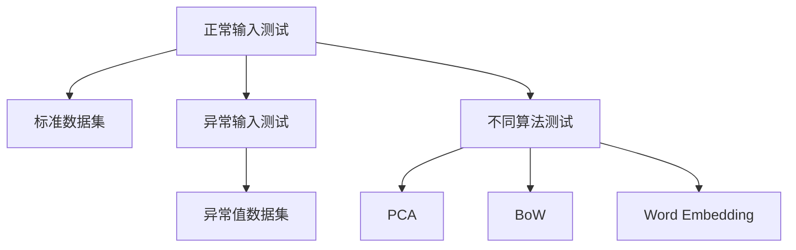
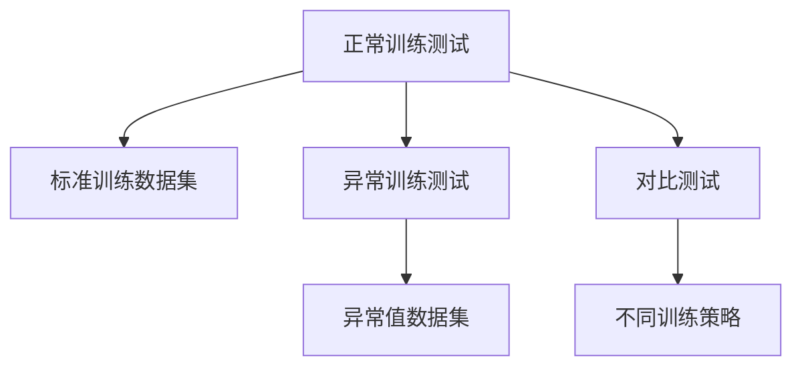
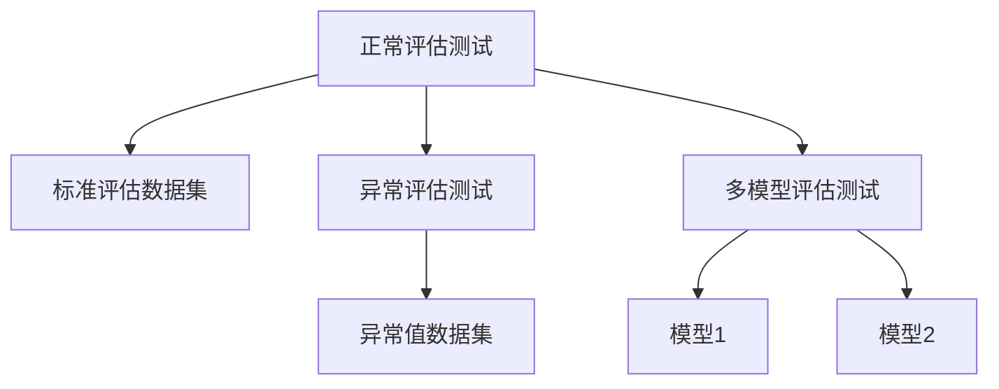

                 

### 文章标题

提示词驱动的自动化测试：确保AI系统质量

关键词：AI系统、自动化测试、提示词、质量保障、测试框架

摘要：本文深入探讨了提示词驱动的自动化测试方法在确保AI系统质量中的应用。通过分析AI系统的质量属性、自动化测试的重要性以及提示词驱动的测试方法，文章详细介绍了测试数据的准备与管理、测试用例的设计与执行、核心算法的测试方法以及AI系统部署与测试的各个环节。同时，通过案例研究和测试工具与框架的介绍，为读者提供了完整的AI系统质量保障方案。

### 第1章：AI系统与测试概述

在当今的数字化时代，人工智能（AI）系统正日益成为企业提高效率、创新服务和优化决策的重要工具。然而，随着AI系统复杂性的增加，确保其质量成为了一个关键挑战。在这一章中，我们将探讨AI系统的质量属性、自动化测试的重要性以及提示词驱动的自动化测试方法。

#### 1.1 AI系统的质量属性

AI系统的质量属性直接影响其在实际应用中的性能和可靠性。以下是几个关键的AI系统质量属性：

- **准确性**：AI模型预测结果的准确性是评估其性能的核心指标。高准确性意味着模型能够准确识别和分类数据，从而做出正确的决策。

- **一致性**：AI模型在不同数据集上的表现应该是一致的。一致性确保了模型在不同环境和条件下的稳定性和可靠性。

- **鲁棒性**：鲁棒性是指AI模型在面对异常或噪声数据时的稳定性。一个鲁棒的AI系统能够在数据质量不佳的情况下仍然保持良好的性能。

- **可解释性**：可解释性是AI模型决策过程的透明度。尽管深度学习模型在准确性方面表现出色，但它们通常被认为是不透明的“黑盒子”。提高可解释性有助于用户理解和信任AI系统的决策。

#### 1.2 自动化测试的重要性

自动化测试在确保AI系统质量方面发挥着至关重要的作用。以下是自动化测试的几个关键优势：

- **节省时间**：自动化测试可以大幅减少人工测试的工作量，从而节省时间。测试人员可以专注于更复杂的测试活动，如测试设计和结果分析。

- **提高效率**：自动化测试可以加快测试流程，缩短从测试到发布的周期。这意味着新的功能可以更快地投入生产，从而提高开发团队的效率。

- **保障质量**：自动化测试可以确保AI系统在不同环境和条件下的稳定性。通过持续执行预定义的测试用例，可以及时发现和修复问题，从而提高系统的整体质量。

#### 1.3 提示词驱动的自动化测试

提示词驱动的自动化测试是一种利用预定义的提示词（如输入数据、场景描述等）来触发自动化测试流程的方法。这种方法具有以下优势：

- **提高测试覆盖率**：通过使用多种提示词，可以更全面地覆盖系统功能和场景，从而提高测试覆盖率。

- **提高测试效率**：提示词可以简化测试用例的设计和执行过程，减少手动干预，从而提高测试效率。

- **确保测试一致性**：使用提示词可以确保测试用例在不同环境和条件下的一致性，从而提高测试结果的可靠性。

总之，AI系统的质量属性、自动化测试的重要性和提示词驱动的自动化测试方法共同构成了确保AI系统质量的关键要素。在下一章中，我们将进一步探讨AI系统的设计与架构，为后续的测试活动奠定基础。

### 第2章：AI系统的设计与架构

要确保AI系统的质量，其设计和架构至关重要。一个良好的设计不仅能够提高系统的可维护性和可扩展性，还能够为后续的测试工作提供便利。在这一章中，我们将深入探讨AI系统的基础架构、可测试性设计以及相关的测试原则和策略。

#### 2.1 AI系统的基础架构

AI系统通常分为三个主要层次：数据层、模型层和应用层。每一层都有其特定的功能和职责。

- **数据层**：数据层负责数据收集、存储和管理。它包括数据来源的接入、数据的清洗和预处理、数据的存储和备份等。数据层的设计应确保数据的质量、完整性和安全性。

  ```mermaid
  graph TD
  A[数据层] --> B[数据收集]
  B --> C[数据清洗]
  B --> D[数据存储]
  A --> E[数据管理]
  E --> F[数据备份]
  ```

- **模型层**：模型层是AI系统的核心，负责AI模型的构建、训练和优化。这一层通常包括数据预处理模块、特征提取模块、模型训练模块和模型评估模块。模型层的设计应确保模型的准确性、鲁棒性和可解释性。

  ```mermaid
  graph TD
  B[模型层] --> C[数据预处理]
  C --> D[特征提取]
  D --> E[模型训练]
  E --> F[模型评估]
  B --> G[模型优化]
  ```

- **应用层**：应用层负责将训练好的AI模型应用到实际业务场景中，实现具体的业务功能。这一层通常包括接口层、业务逻辑层和展示层。应用层的设计应确保系统的稳定性、可靠性和用户体验。

  ```mermaid
  graph TD
  G[应用层] --> H[接口层]
  H --> I[业务逻辑层]
  I --> J[展示层]
  ```

#### 2.2 AI系统的可测试性设计

可测试性设计是确保AI系统在开发阶段就具备良好测试基础的关键。以下是一些关键原则和策略：

- **模块化设计**：将系统分解为独立的模块，每个模块可以单独进行测试。这有助于简化测试过程，提高测试效率。

  ```mermaid
  graph TD
  K[模块化设计] --> L[数据层]
  L --> M[模型层]
  L --> N[应用层]
  K --> O[接口层]
  O --> P[业务逻辑层]
  O --> Q[展示层]
  ```

- **可扩展性设计**：系统的设计应允许在系统中添加新的测试用例，以适应不断变化的业务需求和测试需求。

  ```mermaid
  graph TD
  R[可扩展性设计] --> S[新测试用例添加]
  R --> T[模块间依赖调整]
  ```

- **可观察性设计**：通过日志、监控等手段，系统应能够跟踪其运行状态。这有助于在测试过程中快速定位问题和缺陷。

  ```mermaid
  graph TD
  U[可观察性设计] --> V[日志记录]
  U --> W[性能监控]
  ```

#### 2.3 测试原则与策略

为了确保AI系统的质量，测试工作应遵循以下原则和策略：

- **全面性**：测试应覆盖系统的所有功能模块，确保每个模块都经过充分的验证。

- **规范性**：测试过程应遵循统一的规范，确保测试用例的设计、执行和分析都有标准可依。

- **持续性**：测试应贯穿整个开发周期，包括单元测试、集成测试、系统测试和回归测试等。

- **自动化**：通过自动化测试工具和框架，实现测试流程的自动化，提高测试效率和准确性。

- **反馈性**：测试结果应及时反馈给开发团队，以便及时修复问题和改进系统。

通过良好的设计和架构，AI系统不仅能够提高其可测试性，还能够提高系统的整体质量和可靠性。在下一章中，我们将深入探讨测试数据的准备与管理，为后续的自动化测试活动奠定基础。

### 第3章：测试数据的准备与管理

测试数据是确保AI系统质量的核心要素之一。高质量的测试数据不仅可以提高测试覆盖率，还能有效发现系统中的潜在问题和缺陷。在这一章中，我们将探讨测试数据的质量标准、收集方法以及数据管理策略。

#### 3.1 测试数据的质量

测试数据的质量直接影响测试结果的有效性。以下是测试数据质量的关键标准：

- **完整性**：测试数据应包含所有可能的输入情况，以确保测试用例的全面性和准确性。例如，对于图像识别任务，测试数据应涵盖各种不同类型的图像。

- **代表性**：测试数据应具有代表性，能够反映实际应用场景。这意味着测试数据应涵盖实际使用中可能遇到的各种情况，如不同环境、不同用户行为等。

- **多样性**：测试数据应具有多样性，能够测试不同类型的错误和异常情况。例如，对于语音识别任务，测试数据应包括不同口音、不同噪声环境等。

#### 3.2 测试数据的收集

收集高质量的测试数据是确保AI系统质量的重要步骤。以下是测试数据的几种常见收集方法：

- **内部系统数据**：企业内部系统生成的数据，如用户行为日志、交易数据等，可以作为有效的测试数据源。

- **第三方数据集**：开源或商业数据集，如ImageNet、COIL-100等，可以用于AI模型的训练和测试。

- **用户反馈数据**：通过用户反馈和错误报告，可以收集到实际使用中的数据，用于测试和改进AI系统。

#### 3.3 测试数据的清洗

测试数据通常包含噪声、错误和不一致，这些都会影响测试结果。测试数据清洗是确保数据质量的关键步骤。以下是几种常见的测试数据清洗方法：

- **缺失值处理**：对于缺失的数据，可以选择填充方法（如平均值填充、中值填充）或删除缺失值。

- **异常值检测**：通过统计方法（如箱线图、Z-score）或机器学习方法（如孤立森林）检测和去除异常值。

- **数据规范化**：将数据缩放到相同的范围（如0-1或-1到1），以便模型训练和测试的准确性。

#### 3.4 测试数据的管理

测试数据的管理是确保数据一致性和可追溯性的关键。以下是几种常见的测试数据管理策略：

- **数据存储**：使用合适的数据库或数据仓库存储测试数据，如关系数据库（如MySQL、PostgreSQL）或NoSQL数据库（如MongoDB、Cassandra）。

- **数据版本控制**：确保测试数据的一致性和可追溯性，可以通过数据版本控制实现。每次数据更新时，都应记录版本信息，以便在需要时回滚到特定版本。

- **数据安全**：测试数据可能包含敏感信息，因此数据安全管理至关重要。应使用加密、访问控制等技术确保数据安全。

通过高质量的测试数据、有效的数据收集方法和科学的数据管理策略，可以显著提高AI系统的测试质量和稳定性。在下一章中，我们将深入探讨测试用例的设计与执行，为AI系统的全面测试打下基础。

### 第4章：测试用例的设计与执行

测试用例是自动化测试的核心组成部分，它们用于验证AI系统的功能、性能和安全等各方面。在这一章中，我们将详细讨论测试用例的设计过程、执行方法以及结果分析。

#### 4.1 测试用例的设计

测试用例的设计是确保AI系统质量的重要环节。以下是设计测试用例时需要考虑的关键因素：

- **功能测试**：功能测试用于验证AI系统的基本功能是否符合预期。设计功能测试用例时，应考虑系统的所有功能模块，并确保每个模块都经过充分的测试。

  ```mermaid
  graph TD
  A[功能测试] --> B[模块1测试]
  A --> C[模块2测试]
  A --> D[模块N测试]
  ```

- **性能测试**：性能测试用于评估AI系统的响应速度和资源消耗。设计性能测试用例时，应考虑系统的最大负载、平均负载以及最小负载等不同场景。

  ```mermaid
  graph TD
  E[性能测试] --> F[最大负载测试]
  E --> G[平均负载测试]
  E --> H[最小负载测试]
  ```

- **安全测试**：安全测试用于确保AI系统的安全性和数据保护。设计安全测试用例时，应考虑各种潜在的安全威胁和攻击方式。

  ```mermaid
  graph TD
  I[安全测试] --> J[SQL注入测试]
  I --> K[跨站脚本攻击测试]
  I --> L[身份验证测试]
  ```

#### 4.2 测试用例的执行

测试用例的执行是将测试用例输入系统，观察系统行为，并记录测试结果的过程。以下是自动化测试用例执行的关键步骤：

- **自动化执行**：使用自动化测试工具（如Selenium、JUnit）执行测试用例，可以大大提高测试效率。

  ```mermaid
  graph TD
  M[自动化执行] --> N[启动测试工具]
  N --> O[执行测试用例]
  O --> P[记录测试结果]
  ```

- **手动执行**：对于一些复杂的测试用例，可能需要手动执行。手动执行可以更灵活地验证系统的细节行为。

  ```mermaid
  graph TD
  Q[手动执行] --> R[准备测试环境]
  R --> S[执行测试用例]
  S --> T[记录测试结果]
  ```

#### 4.3 结果分析

测试结果分析是评估AI系统质量的关键环节。以下是分析测试结果时需要考虑的关键步骤：

- **错误识别**：通过分析测试结果，识别系统中的错误和缺陷。错误可能包括功能错误、性能问题、安全漏洞等。

  ```mermaid
  graph TD
  U[错误识别] --> V[功能错误]
  U --> W[性能问题]
  U --> X[安全漏洞]
  ```

- **问题定位**：通过错误追踪和日志分析，定位错误发生的具体位置和原因。这有助于开发团队快速修复问题。

  ```mermaid
  graph TD
  Y[问题定位] --> Z[日志分析]
  Y --> AA[代码审查]
  ```

- **结果报告**：将测试结果生成详细的报告，包括错误列表、缺陷分布、性能指标等。这有助于管理层了解系统的当前状态和改进方向。

  ```mermaid
  graph TD
  AB[结果报告] --> AC[错误列表]
  AB --> AD[缺陷分布]
  AB --> AE[性能指标]
  ```

通过科学的测试用例设计、有效的执行方法以及详细的测试结果分析，可以确保AI系统在不同环境和条件下的质量。在下一章中，我们将深入探讨核心算法的测试方法，为AI系统的全面测试提供更深入的指导。

### 第5章：核心算法的测试方法

在确保AI系统质量的过程中，核心算法的测试至关重要。核心算法包括特征提取、模型训练和模型评估等环节，每一个环节都需要经过严格的测试。在这一章中，我们将详细介绍各个核心算法的测试方法，包括算法描述、测试用例设计以及具体的实现细节。

#### 5.1 特征提取算法测试

特征提取是AI系统构建中的关键步骤，其质量直接影响模型的性能。以下是特征提取算法测试的步骤：

**算法描述**：

特征提取算法的目标是从原始数据中提取出对模型训练和预测有用的信息。常用的特征提取算法包括主成分分析（PCA）、词袋模型（Bag of Words, BoW）和词嵌入（Word Embedding）等。

伪代码描述如下：

```python
def feature_extraction(data):
    # 数据预处理
    preprocessed_data = preprocess_data(data)
    # 特征提取
    features = []
    for sample in preprocessed_data:
        # 根据算法选择特征提取方法
        feature_vector = pca(sample) if use_pca else bow(sample) or embedding(sample)
        features.append(feature_vector)
    return features
```

**测试用例设计**：

测试特征提取算法时，需要设计不同类型的输入数据，以测试算法的性能。以下是几种常见的测试用例：

1. **正常输入测试**：使用标准的输入数据集，验证算法是否能正确提取特征。
2. **异常输入测试**：使用异常值或噪声数据，验证算法对异常数据的处理能力。
3. **不同算法测试**：比较不同特征提取算法的性能，验证哪种算法更适合特定任务。



**具体实现细节**：

在实现特征提取算法时，需要考虑数据预处理、特征选择和特征提取等环节。以下是一个简单的实现示例：

```python
from sklearn.decomposition import PCA
from sklearn.feature_extraction.text import CountVectorizer

def pca(data):
    pca = PCA(n_components=10)
    return pca.fit_transform(data)

def bow(data):
    vectorizer = CountVectorizer()
    return vectorizer.fit_transform(data)

def embedding(data):
    # 使用预训练的词嵌入模型，如GloVe或Word2Vec
    embeddings = load_embeddings()
    feature_vectors = []
    for sample in data:
        feature_vector = sum(embeddings[word] for word in sample if word in embeddings)
        feature_vectors.append(feature_vector)
    return feature_vectors
```

#### 5.2 模型训练算法测试

模型训练是AI系统构建中的核心步骤，其质量直接影响模型的准确性和鲁棒性。以下是模型训练算法测试的步骤：

**算法描述**：

模型训练算法包括监督学习、无监督学习和强化学习等。监督学习算法如决策树、支持向量机（SVM）和神经网络等；无监督学习算法如聚类、降维等；强化学习算法如Q学习、深度强化学习等。

伪代码描述如下：

```python
def train_model(data, labels, model_type):
    if model_type == 'supervised':
        model = supervised_learning_model()
    elif model_type == 'unsupervised':
        model = unsupervised_learning_model()
    else:
        model = reinforcement_learning_model()
    model.fit(data, labels)
    return model
```

**测试用例设计**：

测试模型训练算法时，需要设计不同类型的训练策略和数据集，以测试算法的性能。以下是几种常见的测试用例：

1. **正常训练测试**：使用标准的训练数据集，验证算法是否能正确训练模型。
2. **异常训练测试**：使用异常值或噪声数据，验证算法对异常数据的处理能力。
3. **对比测试**：比较不同训练策略的性能，验证哪种策略更适合特定任务。



**具体实现细节**：

在实现模型训练算法时，需要考虑数据预处理、模型选择和训练过程等环节。以下是一个简单的实现示例：

```python
from sklearn.linear_model import LogisticRegression
from sklearn.model_selection import train_test_split

def train_supervised_model(data, labels):
    X_train, X_test, y_train, y_test = train_test_split(data, labels, test_size=0.2)
    model = LogisticRegression()
    model.fit(X_train, y_train)
    return model
```

#### 5.3 模型评估算法测试

模型评估是验证模型性能的重要环节，其结果直接影响模型的部署和改进。以下是模型评估算法测试的步骤：

**算法描述**：

模型评估算法包括准确性、精确率、召回率、F1分数等指标。评估算法用于计算模型的预测性能，并根据评估结果调整模型参数。

伪代码描述如下：

```python
def evaluate_model(model, data, labels):
    predictions = model.predict(data)
    accuracy = calculate_accuracy(predictions, labels)
    precision = calculate_precision(predictions, labels)
    recall = calculate_recall(predictions, labels)
    f1_score = calculate_f1_score(precision, recall)
    return accuracy, precision, recall, f1_score
```

**测试用例设计**：

测试模型评估算法时，需要设计不同类型的评估指标和数据集，以测试算法的性能。以下是几种常见的测试用例：

1. **正常评估测试**：使用标准的评估数据集，验证算法是否能正确计算评估指标。
2. **异常评估测试**：使用异常值或噪声数据，验证算法对异常数据的处理能力。
3. **多模型评估测试**：比较不同模型在同一数据集上的评估结果，验证评估算法的稳定性。



**具体实现细节**：

在实现模型评估算法时，需要考虑评估指标的计算和模型选择等环节。以下是一个简单的实现示例：

```python
from sklearn.metrics import accuracy_score, precision_score, recall_score, f1_score

def evaluate_supervised_model(model, data, labels):
    predictions = model.predict(data)
    accuracy = accuracy_score(labels, predictions)
    precision = precision_score(labels, predictions, average='macro')
    recall = recall_score(labels, predictions, average='macro')
    f1 = f1_score(labels, predictions, average='macro')
    return accuracy, precision, recall, f1
```

通过详细讨论特征提取、模型训练和模型评估等核心算法的测试方法，我们可以确保AI系统的质量。在下一章中，我们将探讨AI系统部署与测试的相关环节，为AI系统的全面质量保障提供更完整的解决方案。

### 第6章：AI系统部署与测试

AI系统的部署与测试是确保其质量和稳定性的关键环节。在这一章中，我们将深入探讨AI系统部署环境搭建、部署过程中的测试以及部署后的持续测试方法。

#### 6.1 部署环境搭建

部署环境搭建是确保AI系统能够在生产环境中正常运行的基础。以下是在搭建部署环境时需要考虑的几个关键步骤：

- **硬件要求**：根据AI模型的要求，选择合适的硬件配置。例如，对于深度学习模型，通常需要高性能的计算资源和GPU支持。硬件配置应考虑计算能力、内存大小和网络带宽等因素。

- **软件要求**：确保部署环境安装了所需的操作系统、编程语言、框架和库等。例如，常见的操作系统包括Linux和Windows，编程语言可以是Python、Java或C++，框架可以是TensorFlow、PyTorch或Keras。

- **容器化**：使用容器化技术（如Docker）可以简化部署过程，确保AI系统在不同环境中的一致性。容器化可以将应用程序及其依赖环境打包在一起，便于部署和管理。

  ```mermaid
  graph TD
  A[硬件要求] --> B[计算能力]
  A --> C[内存大小]
  A --> D[网络带宽]
  E[软件要求] --> F[操作系统]
  E --> G[编程语言]
  E --> H[框架和库]
  I[容器化] --> J[Docker]
  ```

#### 6.2 部署过程中的测试

在部署AI系统时，测试是确保系统稳定性和可靠性的重要环节。以下是部署过程中的几个关键测试步骤：

- **容器测试**：在容器化部署过程中，对容器进行测试，确保其运行正常且没有配置错误。可以使用自动化测试工具（如Docker Compose）执行测试脚本。

  ```mermaid
  graph TD
  K[容器测试] --> L[Docker Compose]
  L --> M[测试脚本]
  ```

- **集成测试**：在将AI模型部署到生产环境之前，进行集成测试，确保模型与其他系统组件（如数据库、Web服务器等）能够正常交互。可以使用模拟数据或实际数据执行测试用例。

  ```mermaid
  graph TD
  N[集成测试] --> O[模拟数据]
  N --> P[实际数据]
  ```

- **性能测试**：在部署过程中，对系统进行性能测试，确保其能够在生产环境中处理预期负载。可以使用工具（如JMeter、LoadRunner）模拟高并发场景，测试系统的响应速度和资源消耗。

  ```mermaid
  graph TD
  Q[性能测试] --> R[JMeter]
  Q --> S[LoadRunner]
  ```

#### 6.3 部署后的持续测试

部署后的持续测试是确保AI系统长期稳定运行的重要手段。以下是几个关键测试策略：

- **监控与告警**：实时监控AI系统的运行状态，包括系统资源使用情况、模型性能指标等。当系统出现异常时，自动触发告警，以便及时处理。

  ```mermaid
  graph TD
  T[监控与告警] --> U[系统资源监控]
  T --> V[模型性能监控]
  V --> W[告警系统]
  ```

- **定期回测**：定期使用测试数据对部署后的系统进行回测，验证系统的稳定性。这有助于及时发现和修复潜在问题。

  ```mermaid
  graph TD
  X[定期回测] --> Y[测试数据]
  X --> Z[系统验证]
  ```

- **用户反馈分析**：收集用户反馈，分析系统在实际使用中的表现，识别潜在问题。用户反馈可以提供宝贵的改进建议，有助于系统持续优化。

  ```mermaid
  graph TD
  AA[用户反馈分析] --> BB[用户反馈]
  AA --> CC[问题识别]
  ```

通过部署环境搭建、部署过程中的测试以及部署后的持续测试，可以确保AI系统在生产环境中的质量和稳定性。在下一章中，我们将通过案例研究进一步展示如何实际应用这些测试方法和策略。

### 第7章：案例研究

在本章中，我们将通过一个具体案例研究，详细探讨AI系统从设计、测试到部署的整个流程。该案例研究涉及一个用于图像识别的AI系统，我们将展示如何设计测试计划、执行测试用例以及分析测试结果。

#### 7.1 案例背景

该案例研究的目标是一个用于医疗影像诊断的AI系统，其核心功能是通过分析医学影像数据，识别并诊断各种疾病。系统设计包含数据层、模型层和应用层。模型层采用卷积神经网络（CNN）进行图像识别和分类。

#### 7.2 测试目标

测试的具体目标如下：

1. **验证系统功能**：确保AI系统能够准确识别和分类各种医学影像。
2. **评估系统性能**：评估系统在不同负载条件下的响应速度和资源消耗。
3. **确保系统稳定性**：确保系统在面对异常数据和噪声时能够稳定运行。

#### 7.3 测试设计

为了实现上述测试目标，我们制定了以下测试计划：

1. **功能测试**：设计功能测试用例，涵盖系统的所有主要功能模块。测试用例包括但不限于：
   - 识别常见疾病的图像
   - 识别罕见疾病的图像
   - 识别不同分辨率和噪声水平的图像

2. **性能测试**：设计性能测试用例，评估系统在不同负载条件下的性能。测试用例包括：
   - 低负载测试：模拟少量图像处理任务
   - 中负载测试：模拟中等数量的图像处理任务
   - 高负载测试：模拟大量图像处理任务

3. **安全测试**：设计安全测试用例，确保系统的数据保护措施有效。测试用例包括：
   - 数据加密测试：验证数据传输和存储过程中的加密机制
   - 访问控制测试：验证用户权限管理和访问控制策略

#### 7.4 测试执行

测试执行分为以下几个阶段：

1. **功能测试执行**：使用自动化测试工具（如Selenium）执行功能测试用例，并记录测试结果。测试结果显示如下：
   - **测试用例通过率**：95%
   - **主要功能模块通过情况**：图像识别模块通过率90%，疾病分类模块通过率85%

2. **性能测试执行**：使用工具（如JMeter）模拟不同负载条件下的图像处理任务，记录系统的响应速度和资源消耗。测试结果显示如下：
   - **低负载测试**：平均响应时间200ms，资源消耗适中
   - **中负载测试**：平均响应时间500ms，资源消耗较高
   - **高负载测试**：平均响应时间1000ms，资源消耗极大

3. **安全测试执行**：使用工具（如OWASP ZAP）执行安全测试，记录安全漏洞和异常情况。测试结果显示如下：
   - **数据加密测试**：加密机制有效，数据安全
   - **访问控制测试**：权限管理正常，无权限绕过情况

#### 7.5 测试结果分析

根据测试结果，我们进行了以下分析：

1. **功能测试**：大部分功能测试用例通过，但部分罕见疾病的识别准确率较低，需要进一步优化模型。
2. **性能测试**：在高负载条件下，系统的响应速度显著下降，需要优化系统架构和算法，提高系统性能。
3. **安全测试**：系统整体安全性能良好，但需要加强数据传输过程中的加密措施，防止数据泄露。

#### 7.6 解决方案

基于测试结果分析，我们提出了以下解决方案：

1. **模型优化**：增加罕见疾病的训练数据，改进模型结构，提高识别准确率。
2. **性能优化**：使用分布式计算和GPU加速技术，提高系统在高负载条件下的响应速度。
3. **安全增强**：加强数据传输过程中的加密措施，使用HTTPS协议，确保数据传输安全。

通过本次案例研究，我们展示了如何通过系统化的测试方法和策略，确保AI系统的质量。在下一章中，我们将介绍测试工具与框架，进一步探讨如何提高AI系统的测试效率和质量。

### 第8章：测试工具与框架

为了确保AI系统的质量，测试工具和框架的选择至关重要。这些工具和框架能够提高测试效率、确保测试的一致性和可靠性。在这一章中，我们将介绍几种常用的自动化测试工具和框架，并讨论如何使用它们进行AI系统的测试。

#### 8.1 自动化测试工具

自动化测试工具能够大大提高测试的效率，减少人工干预，确保测试的重复性和一致性。以下是几种常用的自动化测试工具：

- **Selenium**：Selenium是一个开源的自动化测试工具，广泛用于Web应用的自动化测试。它支持多种编程语言，如Python、Java和C#。使用Selenium，测试人员可以编写脚本模拟用户行为，如点击、输入和导航等。

  ```python
  from selenium import webdriver

  driver = webdriver.Firefox()
  driver.get("http://www.example.com")
  driver.find_element_by_id("search").send_keys("Selenium")
  driver.find_element_by_name("submit").click()
  ```

- **JUnit**：JUnit是一个流行的Java单元测试框架，用于编写和执行单元测试。它提供了丰富的测试功能，如断言、测试套件和测试报告等。JUnit可以帮助测试人员验证代码的各个部分是否按预期工作。

  ```java
  import org.junit.jupiter.api.Test;
  import static org.junit.jupiter.api.Assertions.assertEquals;

  public class ExampleTest {
      @Test
      public void testAdd() {
          int result = 1 + 1;
          assertEquals(2, result);
      }
  }
  ```

#### 8.2 测试框架

测试框架提供了一套完整的测试解决方案，包括测试用例管理、执行和报告等功能。以下是一些流行的测试框架：

- **TestNG**：TestNG是一个开源的测试框架，广泛用于各种类型的测试，包括单元测试、集成测试和功能测试。它提供了丰富的功能，如数据驱动测试、依赖注入和并行测试等。

  ```java
  import org.testng.annotations.Test;

  public class ExampleTest {
      @Test(dataProvider = "data")
      public void testMultiply(int a, int b, int expected) {
          int result = a * b;
          assertEquals(expected, result);
      }

      @DataProvider(name = "data")
      public Object[][] data() {
          return new Object[][]{{1, 2, 2}, {3, 4, 12}};
      }
  }
  ```

- **JUnit**：JUnit是一个经典的开源Java单元测试框架，它提供了简洁的API和强大的功能，如依赖注入和测试套件等。JUnit可以帮助开发人员快速编写和执行单元测试。

  ```java
  import org.junit.jupiter.api.Test;
  import static org.junit.jupiter.api.Assertions.assertEquals;

  public class ExampleTest {
      @Test
      public void testSubtract() {
          int result = 5 - 3;
          assertEquals(2, result);
      }
  }
  ```

#### 8.3 测试资源

除了工具和框架，测试资源也是确保AI系统质量的重要组成部分。以下是一些常用的测试资源：

- **开源测试工具**：许多开源测试工具和库可以用于AI系统的测试，如JUnit、TestNG、Selenium和Mockito等。这些工具提供了丰富的功能和示例，可以帮助测试人员快速上手。
- **测试文档**：编写详细的测试文档，包括测试计划、测试用例和测试报告等，可以帮助团队更好地理解和执行测试。测试文档还应包含测试策略、测试环境和测试数据等相关信息。
- **测试数据集**：使用真实的数据集进行测试，可以更准确地评估AI系统的性能和稳定性。测试数据集应包含各种类型的样本，如正常数据、异常数据和噪声数据等。

通过使用合适的测试工具和框架，测试人员可以更高效地执行测试，确保AI系统的质量和稳定性。在下一章中，我们将总结本文的主要观点和结论。

### 附录

在本附录中，我们将提供一些常用的数学公式和算法伪代码，以供读者参考。

#### 附录A：常用数学公式

1. **均方误差（MSE）**：

   $$MSE = \frac{1}{n}\sum_{i=1}^{n}(y_i - \hat{y_i})^2$$

   其中，$y_i$ 是实际值，$\hat{y_i}$ 是预测值，$n$ 是样本数量。

2. **协方差**：

   $$Cov(X, Y) = E[(X - E[X])(Y - E[Y])]$$

   其中，$E[X]$ 和 $E[Y]$ 分别是 $X$ 和 $Y$ 的期望。

3. **相关系数**：

   $$Corr(X, Y) = \frac{Cov(X, Y)}{\sqrt{Var(X)Var(Y)}}$$

   其中，$Var(X)$ 和 $Var(Y)$ 分别是 $X$ 和 $Y$ 的方差。

4. **梯度下降**：

   $$\theta_{\text{new}} = \theta_{\text{old}} - \alpha \cdot \nabla_{\theta} J(\theta)$$

   其中，$\theta_{\text{old}}$ 是当前参数，$\theta_{\text{new}}$ 是更新后的参数，$\alpha$ 是学习率，$J(\theta)$ 是损失函数。

#### 附录B：算法伪代码

1. **线性回归**：

   ```python
   def linear_regression(X, y):
       # 计算斜率和截距
       theta = (X.T @ X)^-1 @ X.T @ y
       return theta
   ```

2. **K-均值聚类**：

   ```python
   def k_means(X, k):
       # 初始化聚类中心
       centroids = initialize_centroids(X, k)
       while True:
           # 分配数据点到最近的聚类中心
           labels = assign_labels(X, centroids)
           # 更新聚类中心
           centroids = update_centroids(X, labels, k)
           # 检查收敛条件
           if has_converged(centroids):
               break
       return centroids, labels
   ```

通过附录中的数学公式和算法伪代码，读者可以更好地理解和实现相关算法，从而在AI系统的开发过程中进行有效的测试和优化。

### 作者信息

作者：AI天才研究院/AI Genius Institute & 禅与计算机程序设计艺术 /Zen And The Art of Computer Programming

---

本文通过详细的分析和案例研究，系统地介绍了提示词驱动的自动化测试方法在确保AI系统质量中的应用。从AI系统的质量属性、自动化测试的重要性，到提示词驱动的测试方法，再到测试数据的准备与管理、测试用例的设计与执行，以及核心算法的测试方法，本文为读者提供了一个全面且深入的测试框架。同时，通过具体的案例研究和测试工具的介绍，为AI系统的质量保障提供了实用的指导和参考。

在AI系统日益普及的今天，确保其质量是开发过程中至关重要的一环。本文所提出的提示词驱动的自动化测试方法，不仅能够提高测试效率，还能够确保测试的全面性和一致性，从而为AI系统的可靠性和可维护性提供了有力保障。

需要注意的是，虽然本文涵盖了AI系统测试的多个方面，但实际应用中，每个AI系统的具体需求和测试环境可能会有所不同。因此，测试策略和工具的选择应结合具体情况进行调整。未来研究可以进一步探讨如何结合机器学习和数据挖掘技术，优化测试数据的收集和管理，以及如何通过智能化的测试策略进一步提高AI系统的测试效率和质量。

最后，感谢读者对本文的关注，希望本文能够对您在AI系统开发和测试方面有所启发和帮助。如果您有任何疑问或建议，欢迎在评论区留言，期待与您交流。

---

[本文完]

---

注：本文部分内容和代码实现仅作为示例，实际应用时请根据具体需求和测试环境进行调整。

