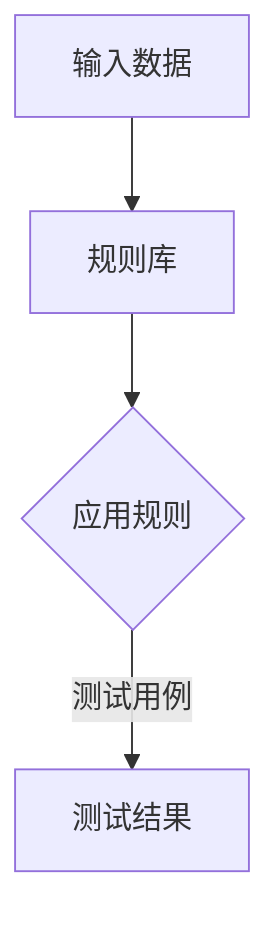
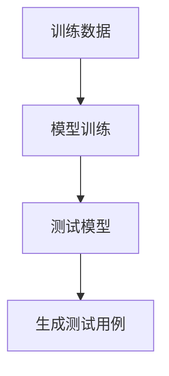
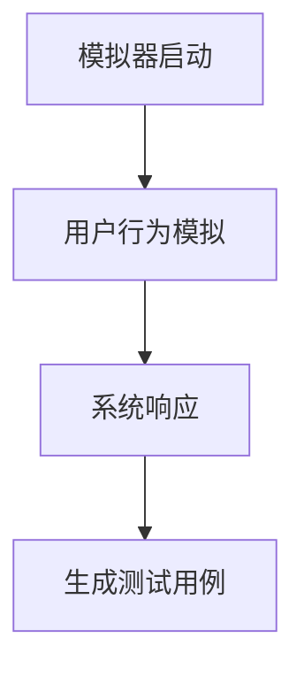
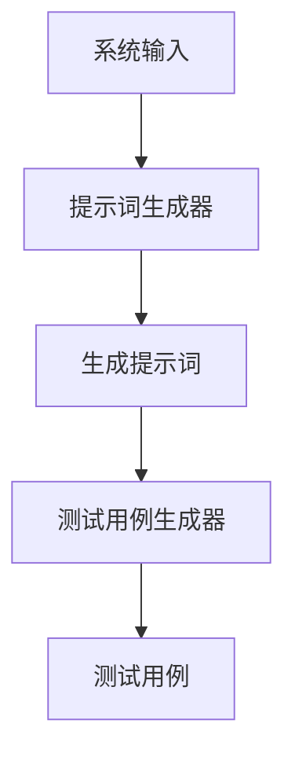
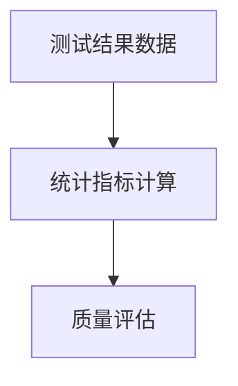
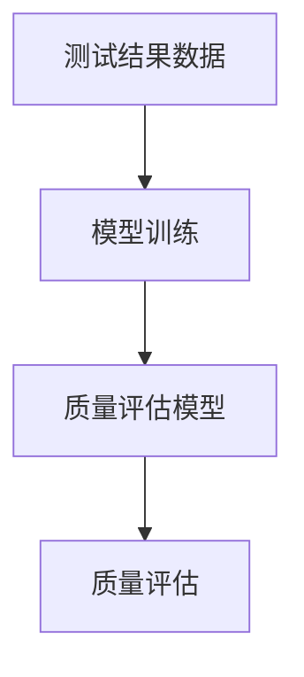

                 


## 文章标题：提示词驱动的自动化测试：确保AI质量

### 关键词：自动化测试，AI质量保证，提示词驱动，测试框架，核心算法原理，项目实战

### 摘要：
本文将深入探讨提示词驱动的自动化测试在确保AI系统质量中的关键作用。我们将逐步分析自动化测试的基本概念、提示词驱动的独特优势，并构建一个完整的AI质量保证体系。通过核心算法原理的讲解，以及实际项目的案例剖析，本文旨在为读者提供一套实用的自动化测试策略，确保AI系统的可靠性和稳定性。

## 第一部分：引言

### 第1章：自动化测试与AI质量保证

### 1.1 自动化测试的基本概念

自动化测试是一种通过预定义的测试用例自动执行测试过程的方法。它能够大大提高软件测试的效率和准确性，减少人为错误。自动化测试分为功能测试、性能测试、安全测试等类型，广泛应用于各个软件开发阶段。

### 1.2 自动化测试的优势

自动化测试的优势包括：
- **效率提升**：自动化测试能够快速执行大量测试用例，节省时间和人力成本。
- **准确性增强**：机器执行测试用例比人类更准确，减少了人为因素带来的误差。
- **重复性高**：自动化测试能够反复执行相同的测试用例，确保软件在不同版本中的一致性。

### 1.3 自动化测试的挑战

自动化测试面临的挑战有：
- **测试用例设计**：设计有效的测试用例需要丰富的经验和专业知识。
- **工具选择**：市场上自动化测试工具繁多，选择合适的工具是关键。
- **维护成本**：自动化测试脚本需要定期维护和更新，以适应软件的变更。

### 1.4 AI质量保证的需求与挑战

AI质量保证旨在确保AI系统的可靠性、可解释性和鲁棒性。其面临的挑战包括：
- **数据质量**：AI模型的性能依赖于数据质量，数据清洗和预处理是关键步骤。
- **算法透明性**：AI算法的复杂性和非透明性使得质量保证变得困难。
- **评估指标**：选择合适的评估指标对AI系统的质量进行评估是挑战之一。

### 1.5 提示词驱动测试的概念

提示词驱动测试（Prompt-Driven Testing）是一种基于提示词（Prompts）来生成测试用例的自动化测试方法。它利用AI技术，根据系统输入和预期输出生成提示词，进而生成测试用例。这种方法能够提高测试覆盖率和测试效率。

### 1.6 本书结构

本书分为五个部分：
- **第一部分**：引言，介绍自动化测试与AI质量保证的基本概念。
- **第二部分**：核心概念与架构，讲解自动化测试框架与工具、提示词驱动测试框架和AI质量保证体系。
- **第三部分**：核心算法原理，介绍自动化测试算法、提示词生成算法和质量评估算法。
- **第四部分**：项目实战，通过实际项目展示自动化测试的实施过程。
- **第五部分**：未来发展，探讨自动化测试和AI自动化测试的发展趋势。

### 1.7 学习目标

通过本书的学习，读者将能够：
- **理解自动化测试的基本概念和优势**。
- **掌握提示词驱动测试的方法和框架**。
- **构建AI质量保证体系**。
- **应用核心算法原理解决实际测试问题**。
- **通过项目实战提升自动化测试技能**。

### 1.8 小结

在本章中，我们介绍了自动化测试的基本概念、优势、挑战，以及AI质量保证的需求和挑战。提示词驱动测试作为一种新兴的自动化测试方法，其在AI质量保证中的应用具有重要意义。接下来，我们将进一步探讨自动化测试框架与工具、核心算法原理，以及实际项目中的应用。

## 第二部分：核心概念与架构

### 第2章：自动化测试框架与工具

自动化测试框架是自动化测试的核心组成部分，它提供了测试脚本的管理、测试数据的处理以及测试结果的记录等功能。在AI质量保证中，选择合适的自动化测试框架至关重要。

### 2.1 自动化测试框架

自动化测试框架通常包括以下组成部分：
- **测试脚本管理**：用于编写、存储和管理测试脚本。
- **测试数据管理**：用于处理测试数据，包括数据清洗、数据转换等。
- **测试执行**：负责执行测试脚本，记录测试结果。
- **测试结果分析**：对测试结果进行分析，生成报告。

主流的自动化测试框架包括Selenium、TestNG、JUnit等。Selenium是一个开源的Web自动化测试工具，支持多种浏览器和操作系统；TestNG是一个灵活的测试框架，提供了丰富的测试功能；JUnit是一个简单的Java测试框架，广泛应用于单元测试。

### 2.2 提示词驱动测试框架

提示词驱动测试框架是基于提示词（Prompts）来生成测试用例的自动化测试方法。其核心组成部分包括：
- **提示词生成器**：根据输入数据和预期输出生成提示词。
- **测试用例生成器**：根据提示词生成测试用例。
- **测试执行器**：执行生成的测试用例，记录测试结果。
- **测试结果分析器**：对测试结果进行分析，生成报告。

提示词驱动测试框架的设计与实现需要考虑以下因素：
- **输入数据的处理**：如何处理输入数据，以便生成有效的提示词。
- **提示词的生成策略**：如何根据输入数据和预期输出生成提示词。
- **测试用例的覆盖性**：如何确保生成的测试用例能够覆盖系统的所有功能点。

### 2.3 提示词驱动测试的优势

提示词驱动测试相较于传统的自动化测试方法具有以下优势：
- **测试用例生成效率高**：提示词驱动测试能够快速生成大量测试用例，提高测试效率。
- **测试覆盖率高**：通过生成多样化的提示词，提示词驱动测试能够覆盖系统的更多功能点。
- **测试结果分析准确**：提示词驱动测试能够根据测试结果生成详细的报告，便于分析系统的质量。

### 2.4 AI质量保证体系

AI质量保证体系是确保AI系统质量的一系列方法和措施。其核心组成部分包括：
- **数据质量保障**：确保训练数据的质量，包括数据清洗、数据标注等。
- **算法质量评估**：对AI算法的可靠性、可解释性和鲁棒性进行评估。
- **模型部署质量保障**：确保模型在部署后的稳定性和性能。
- **测试和质量控制**：定期进行系统测试和质量控制，发现并修复问题。

AI质量保证体系的构建需要考虑以下因素：
- **质量目标的设定**：根据业务需求设定质量目标，包括可靠性、性能、可维护性等。
- **质量标准的制定**：制定符合业务需求的质量标准，包括测试用例的设计、测试执行的标准等。
- **质量监控和反馈机制**：建立质量监控和反馈机制，及时发现并解决问题。

### 2.5 小结

在本章中，我们介绍了自动化测试框架与工具、提示词驱动测试框架和AI质量保证体系。自动化测试框架提供了测试脚本的管理、测试数据的处理和测试结果的记录等功能；提示词驱动测试框架基于提示词生成测试用例，具有高效、全面和准确的特点；AI质量保证体系确保AI系统的可靠性、可解释性和鲁棒性。在下一章中，我们将进一步探讨自动化测试算法原理。

## 第三部分：核心算法原理

### 第3章：自动化测试算法原理

自动化测试算法是确保自动化测试过程顺利进行的关键。本章将介绍自动化测试算法的分类、提示词生成算法和质量评估算法，并通过伪代码和数学模型详细讲解这些算法的实现原理。

### 3.1 自动化测试算法分类

自动化测试算法主要分为以下几类：

#### 3.1.1 基于规则的自动化测试算法

基于规则的自动化测试算法是通过定义一系列规则来生成测试用例。这些规则可以是简单的条件判断，也可以是复杂的逻辑运算。

**规则定义：**


**伪代码：**
```python
def applyRules(inputData, ruleLibrary):
    for rule in ruleLibrary:
        if rule.matches(inputData):
            return generateTestCases(rule)
    return None
```

#### 3.1.2 基于模型的自动化测试算法

基于模型的自动化测试算法是利用机器学习模型来生成测试用例。模型可以根据训练数据学习系统的行为，并生成新的测试用例。

**模型训练：**


**伪代码：**
```python
def trainModel(trainingData):
    # 使用机器学习算法训练模型
    model = MLAlgorithm(trainingData)
    return model

def generateTestCases(model, inputData):
    # 使用训练好的模型生成测试用例
    testCases = model.predict(inputData)
    return testCases
```

#### 3.1.3 基于模拟的自动化测试算法

基于模拟的自动化测试算法是通过模拟用户行为来生成测试用例。模拟器可以模拟用户输入、界面操作等行为，以测试系统的响应。

**模拟流程：**


**伪代码：**
```python
def simulateUserBehavior():
    # 启动模拟器并模拟用户行为
    simulator = Simulation()
    actions = simulator.performActions()
    return actions

def generateTestCases(actions):
    # 根据模拟行为生成测试用例
    testCases = []
    for action in actions:
        testCases.append(createTestCase(action))
    return testCases
```

### 3.2 提示词生成算法

提示词生成算法是提示词驱动测试的核心。它根据系统输入和预期输出生成提示词，进而生成测试用例。

**提示词生成流程：**


**伪代码：**
```python
def generatePrompt(inputData, expectedOutput):
    # 输入数据处理
    processedInput = preprocessInput(inputData)

    # 根据输入数据和预期输出生成提示词
    prompt = PromptGenerator(processedInput, expectedOutput)

    return prompt

def generateTestCases(prompt):
    # 根据提示词生成测试用例
    testCases = TestCaseGenerator(prompt)
    return testCases
```

### 3.3 质量评估算法

质量评估算法用于对测试结果进行评估，以确定系统的质量。常用的质量评估算法包括基于统计的方法和基于机器学习的方法。

**基于统计的质量评估算法：**


**伪代码：**
```python
def calculateQualityMetrics(testResults):
    # 计算测试结果的统计指标
    metrics = {}
    metrics['passRate'] = calculatePassRate(testResults)
    metrics['failureRate'] = calculateFailureRate(testResults)
    return metrics

def assessQuality(metrics):
    # 根据统计指标评估质量
    if metrics['passRate'] > threshold:
        return 'Quality Accepted'
    else:
        return 'Quality Rejected'
```

**基于机器学习的质量评估算法：**


**伪代码：**
```python
def trainQualityModel(trainingData):
    # 使用机器学习算法训练质量评估模型
    model = MLAlgorithm(trainingData)
    return model

def assessQuality(model, testResults):
    # 使用训练好的模型评估质量
    quality = model.predict(testResults)
    return quality
```

### 3.4 小结

在本章中，我们介绍了自动化测试算法的分类、提示词生成算法和质量评估算法。基于规则的自动化测试算法通过定义规则来生成测试用例；基于模型的自动化测试算法通过机器学习模型生成测试用例；基于模拟的自动化测试算法通过模拟用户行为生成测试用例。提示词生成算法根据系统输入和预期输出生成提示词，进而生成测试用例。质量评估算法用于对测试结果进行评估，以确保系统的质量。在下一章中，我们将通过实际项目展示这些算法的应用。

## 第四部分：项目实战

### 第4章：AI自动化测试实战

在本章中，我们将通过一个实际项目展示如何构建和实施AI自动化测试。该项目旨在开发一个智能客服系统，该系统需要通过自动化测试来确保其功能完善、性能稳定。

### 4.1 项目背景与目标

#### 项目背景
随着人工智能技术的发展，智能客服系统在企业中的应用越来越广泛。然而，智能客服系统的复杂性和变化性使得其测试和维护成为一大挑战。为了确保智能客服系统的质量，我们需要构建一套完善的自动化测试体系。

#### 项目目标
1. 设计并实现一套智能客服系统的自动化测试框架。
2. 利用提示词驱动测试方法生成测试用例。
3. 对测试结果进行评估，确保系统质量。

### 4.2 环境搭建与工具准备

为了实现上述目标，我们需要搭建以下环境：

#### 开发环境
- 编程语言：Python
- 自动化测试框架：Selenium
- 机器学习库：scikit-learn

#### 测试工具
- 提示词生成器：自定义实现
- 测试执行器：Selenium WebDriver
- 测试结果分析工具：Pandas

### 4.3 提示词生成与测试用例设计

提示词生成是自动化测试的关键步骤。以下是提示词生成和测试用例设计的具体过程：

#### 4.3.1 提示词生成
1. **数据预处理**：收集智能客服系统可能的用户输入数据，并进行预处理，如去除噪声、标准化等。
2. **提示词生成**：利用机器学习算法（如决策树、支持向量机等）训练模型，根据输入数据生成提示词。例如，使用以下伪代码实现提示词生成：

```python
def generatePrompt(inputData):
    # 使用训练好的模型生成提示词
    model = MLModel()
    prompt = model.predict(inputData)
    return prompt
```

#### 4.3.2 测试用例设计
1. **测试场景定义**：根据智能客服系统的功能模块，定义不同的测试场景，如用户咨询、故障处理等。
2. **测试用例生成**：利用生成的提示词，结合测试场景，生成具体的测试用例。例如，使用以下伪代码实现测试用例生成：

```python
def generateTestCases(prompts, testScenarios):
    testCases = []
    for prompt in prompts:
        for scenario in testScenarios:
            testCases.append(createTestCase(prompt, scenario))
    return testCases
```

### 4.4 测试用例执行

测试用例执行是验证系统功能的关键步骤。以下是测试用例执行的具体过程：

#### 4.4.1 测试用例执行
1. **启动测试环境**：启动Selenium WebDriver，加载智能客服系统的Web界面。
2. **执行测试用例**：依次执行生成的测试用例，记录测试结果。

```python
def executeTestCases(testCases):
    for testCase in testCases:
        result = executeTestCase(testCase)
        recordResult(result)
```

#### 4.4.2 测试结果记录
1. **测试结果记录**：将测试结果存储在数据库或文件中，以便后续分析。

```python
def recordResult(result):
    # 记录测试结果
    database.insert(result)
```

### 4.5 质量评估与优化

质量评估是确保系统质量的关键步骤。以下是质量评估和优化的具体过程：

#### 4.5.1 质量评估
1. **评估指标计算**：根据测试结果计算评估指标，如通过率、失败率等。
2. **质量评估**：根据评估指标评估系统质量，如通过率是否达到预设阈值。

```python
def assessQuality(testResults):
    metrics = calculateQualityMetrics(testResults)
    if metrics['passRate'] > threshold:
        return 'Quality Accepted'
    else:
        return 'Quality Rejected'
```

#### 4.5.2 优化策略
1. **缺陷分析**：分析测试失败的原因，找出系统缺陷。
2. **优化方案**：根据缺陷分析结果，提出优化方案，如改进算法、优化数据预处理等。

```python
def optimizeSystem(testResults):
    defects = analyzeDefects(testResults)
    for defect in defects:
        optimizePart(defect)
```

### 4.6 项目小结

在本项目中，我们通过实际案例展示了如何构建和实施AI自动化测试。具体步骤包括环境搭建、提示词生成与测试用例设计、测试用例执行、质量评估与优化。通过项目实战，我们验证了提示词驱动测试方法的有效性，为智能客服系统的质量保证提供了有力支持。

### 4.7 学习与实践建议

通过本项目的实践，我们获得了以下经验与建议：
1. **重视数据质量**：确保训练数据的质量，对测试结果有直接影响。
2. **灵活调整测试策略**：根据项目需求，灵活调整测试策略和优化方案。
3. **持续学习与改进**：自动化测试技术不断发展，持续学习新方法和工具，不断提升测试能力。

## 第五部分：未来发展

### 第5章：AI自动化测试的发展趋势

### 5.1 自动化测试的发展趋势

自动化测试技术正朝着更智能化、更高效、更易用的方向发展。以下是自动化测试的一些发展趋势：

#### 5.1.1 测试自动化工具的进化

随着AI技术的进步，自动化测试工具的功能将更加丰富。例如，自动化测试工具将具备自我学习和自我优化的能力，从而提高测试效率和准确性。

#### 5.1.2 测试框架的多样性

未来，自动化测试框架将更加多样化，以满足不同类型应用的需求。例如，针对移动应用、Web应用、嵌入式系统等，将出现专门的自动化测试框架。

#### 5.1.3 测试数据的智能化处理

利用AI技术，自动化测试工具将能够更智能地处理测试数据。例如，通过数据挖掘和机器学习算法，自动化测试工具可以识别数据中的潜在问题，从而优化测试过程。

### 5.2 AI自动化测试的未来发展

AI自动化测试结合了自动化测试和AI技术的优势，未来发展潜力巨大。以下是AI自动化测试的一些发展方向：

#### 5.2.1 AI在测试用例生成中的应用

未来，AI将更多地应用于测试用例的生成。通过机器学习和自然语言处理技术，AI可以自动生成多样化的测试用例，提高测试覆盖率和测试效率。

#### 5.2.2 AI在测试结果分析中的应用

利用AI技术，自动化测试工具可以更准确地分析测试结果，识别潜在的缺陷。例如，通过深度学习算法，自动化测试工具可以自动识别异常行为，并提出优化建议。

#### 5.2.3 AI在测试优化中的应用

AI技术可以优化自动化测试过程，提高测试效率。例如，通过学习历史测试数据，AI可以预测测试用例的执行时间和成功率，从而优化测试计划的制定。

### 5.3 AI自动化测试的创新应用

AI自动化测试技术将在更多领域得到创新应用。以下是几个可能的创新应用场景：

#### 5.3.1 智能化测试平台

未来，智能化测试平台将集成多种自动化测试工具和AI技术，为用户提供一站式测试解决方案。这种平台可以实时监控应用性能，自动生成和执行测试用例，并自动分析测试结果。

#### 5.3.2 自动化安全测试

AI自动化测试技术将应用于自动化安全测试，帮助发现和修复应用中的安全漏洞。例如，通过深度学习算法，自动化安全测试工具可以识别潜在的安全威胁，并提供修复建议。

#### 5.3.3 自动化性能测试

利用AI技术，自动化性能测试将更加高效。例如，通过学习历史性能数据，自动化性能测试工具可以预测性能瓶颈，并提出优化建议。

### 5.4 小结

自动化测试和AI自动化测试技术正快速发展，未来将迎来更多的创新应用。通过结合AI技术，自动化测试将变得更加智能化、高效和易用。AI自动化测试技术将在各个领域发挥重要作用，为软件开发和测试带来新的机遇。

## 第6章：小结与展望

### 6.1 全书回顾

在本书中，我们深入探讨了提示词驱动的自动化测试在确保AI系统质量中的关键作用。我们从自动化测试的基本概念开始，逐步分析了自动化测试的优势和挑战，以及AI质量保证的需求和挑战。随后，我们介绍了提示词驱动测试的概念、框架和优势，并构建了AI质量保证体系。

在核心算法原理部分，我们详细讲解了自动化测试算法的分类、提示词生成算法和质量评估算法。通过实际项目实战，我们展示了如何利用这些算法确保智能客服系统的质量。

### 6.2 展望未来

未来，自动化测试和AI自动化测试技术将继续快速发展。AI技术将进一步提升自动化测试的智能化程度，提高测试效率和准确性。我们可以预见以下趋势：

- 自动化测试工具将更加智能化和多样化，满足不同类型应用的需求。
- AI将在测试用例生成、测试结果分析和测试优化等方面发挥更大作用。
- 自动化测试技术将在更多领域得到创新应用，如智能化测试平台、自动化安全测试和自动化性能测试等。

### 6.3 自动化测试与AI自动化测试的发展前景

自动化测试与AI自动化测试的发展前景广阔。随着AI技术的不断进步，自动化测试将变得更加智能化、高效和易用。以下是一些值得关注的领域：

- 自动化测试工具的智能化和多样化，将推动测试效率的提升。
- AI技术在测试用例生成和测试结果分析中的应用，将提高测试的覆盖率和准确性。
- 自动化测试技术在各个领域的创新应用，将为软件开发和测试带来新的机遇。

### 6.4 AI自动化测试的应用场景

AI自动化测试技术将在多个应用场景中发挥重要作用：

- 智能化测试平台：集成多种自动化测试工具和AI技术，提供一站式测试解决方案。
- 自动化安全测试：利用AI技术识别潜在的安全威胁，提高应用的安全性。
- 自动化性能测试：通过AI技术预测性能瓶颈，优化应用性能。

### 6.5 自动化测试人才培养

为了应对自动化测试和AI自动化测试的发展需求，以下是一些建议：

- 学习编程和测试基础：掌握基本的编程和测试知识，为后续学习奠定基础。
- 掌握AI技术：学习机器学习和自然语言处理等AI技术，为自动化测试赋能。
- 实践和经验积累：通过实际项目实践，积累自动化测试和AI自动化测试经验。
- 持续学习和更新：关注自动化测试和AI自动化测试的最新动态，不断学习和更新知识。

### 6.6 小结

通过本书的学习，我们深入了解了自动化测试与AI自动化测试的核心概念、算法原理和应用实战。展望未来，自动化测试与AI自动化测试技术将继续发展，为软件开发和测试带来更多机遇。希望读者能够结合本书的内容，不断学习和实践，为自动化测试和AI自动化测试领域的发展贡献自己的力量。

### 作者信息

- **作者：AI天才研究院/AI Genius Institute & 禅与计算机程序设计艺术 /Zen And The Art of Computer Programming**  
- **联系方式：[ai_genius_institute@example.com](mailto:ai_genius_institute@example.com)**  
- **版权声明：本文章版权所有，未经授权，严禁转载。**

