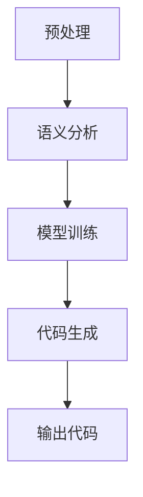

                 


### 文章标题

# AI时代编程的新维度与新未来

### 文章关键词

- AI编程
- 自动编程
- 软件工程变革
- 人机协作编程
- 编程教育
- 编程职业
- 编程语言
- 编程框架

### 文章摘要

随着人工智能技术的飞速发展，编程领域正面临着前所未有的变革。本文旨在探讨AI时代编程的新维度，包括自动编程、软件工程变革和人机协作编程等方面，并预测编程的未来趋势。通过深入分析AI时代编程的核心概念、算法原理、数学模型以及项目实战案例，本文为读者提供了一个全面了解AI时代编程的视角，旨在激发对编程创新的思考。

## 引言与背景

### 1.1 书籍的目的与意义

在当前这个AI主导的时代，编程不再仅仅是编写代码、解决技术问题的过程，而是一个深具变革性的、富有创造力的活动。本著作《AI时代编程的新维度与新未来》旨在揭示编程在AI时代所面临的新挑战、新机遇以及未来发展方向。通过系统的分析和深入的探讨，本文希望能够为读者提供一种全新的视角，让编程不仅仅是技术的积累，更是一种创新的实践。

编程在AI时代的地位日益重要，它不仅是构建AI系统的核心，更是推动AI应用落地的重要手段。编程语言、编程框架和编程工具的不断发展，为AI时代的编程提供了强有力的支持。然而，随着AI技术的复杂性和应用场景的多样性，传统的编程方式已经难以满足需求，编程正面临着一系列深刻的变革。

### 1.2 AI时代的重要性

人工智能（AI）作为现代科技的尖端领域，已经渗透到各行各业，从自动驾驶汽车到智能医疗，从金融分析到娱乐产业，AI的应用无处不在。AI技术的进步不仅改变了生产方式，还深刻影响了社会结构和人们的生活方式。在这样的背景下，掌握AI时代的编程技能变得至关重要。

AI时代的重要性主要体现在以下几个方面：

1. **技术创新的驱动力**：编程是AI技术创新的核心。只有通过编程，研究人员和开发人员才能实现各种AI算法，将其应用于实际问题中。

2. **应用落地的桥梁**：AI技术具有强大的潜力，但要将其转化为实际应用，离不开编程的支持。编程是实现AI应用的重要手段。

3. **经济与社会发展的推动力**：AI技术的广泛应用将推动经济增长，提高生产效率，改变传统产业模式，带来新的商业机会和就业岗位。

4. **未来人才的必备技能**：随着AI技术的普及，编程将成为未来社会每个领域的基础技能，与阅读、写作和数学一样重要。

### 1.3 编程在AI时代的新角色

在AI时代，编程的角色发生了显著的变化。它不再是简单的代码编写，而是包含了更多的创新性和主动性。以下是编程在AI时代的新角色：

1. **算法的创造者与优化者**：编程人员需要能够设计和优化AI算法，使其在不同应用场景中表现最佳。

2. **模型的构建者与训练者**：在深度学习和机器学习领域，编程人员需要构建训练模型，调整参数，优化性能。

3. **系统的集成者与维护者**：AI系统通常需要与其他系统进行集成，编程人员需要确保系统的稳定性和可扩展性。

4. **跨学科的沟通者**：编程人员不仅需要具备技术知识，还需要与业务人员、数据科学家等进行有效沟通，理解他们的需求，提供技术解决方案。

5. **创新者与探索者**：AI时代的编程不仅仅是执行已有的方案，更是探索新的技术、新的应用场景，推动技术的边界不断拓展。

通过以上分析，我们可以看到，编程在AI时代不仅是一项技术活动，更是一个充满机遇和挑战的创新领域。接下来的章节将深入探讨AI时代编程的核心概念、算法原理、数学模型以及实际项目，帮助读者全面理解编程在AI时代的变革与未来。

### 2. AI时代的编程基础

在深入探讨AI时代的编程之前，我们需要对编程的基础有一个全面的了解。编程语言、编程框架和编程工具是AI时代编程的三大基石，它们共同支撑着现代软件开发的复杂性和多样性。

#### 2.1 编程语言的发展

编程语言是计算机编程的核心工具，它们提供了一种人与计算机之间沟通的桥梁。编程语言的发展经历了从低级到高级、从特定领域到通用领域的演变过程。最早的编程语言是机器语言，它直接控制计算机硬件的执行，但由于其复杂性和不可读性，逐渐被汇编语言取代。

汇编语言是一种符号化的机器语言，它使用助记符来表示操作码，但仍然需要程序员对计算机硬件有深入的了解。随着计算机技术的发展，高级编程语言应运而生，如C语言、Pascal和Fortran等。高级编程语言提供了更抽象的语法和丰富的库函数，使得编程更加高效和便捷。

在AI时代，新的编程语言不断涌现，以满足日益复杂的编程需求。Python、Java和JavaScript等编程语言由于其易用性和丰富的库支持，成为了AI编程的主要工具。Python以其简洁的语法和强大的库支持，成为了数据科学和机器学习领域的主要编程语言。Java则因其稳定性和跨平台特性，广泛应用于企业级应用和移动应用开发。JavaScript则因其强大的前端开发能力，在网页和移动应用开发中占据重要地位。

#### 2.2 AI编程基础概念

AI编程基础概念包括算法、模型和数据集等核心要素。算法是AI系统的核心，它决定了系统的性能和效果。常见的AI算法有线性回归、决策树、支持向量机、神经网络等。每个算法都有其特定的应用场景和适用条件，程序员需要根据实际问题选择合适的算法。

模型是AI系统的另一个关键组成部分，它是通过算法对数据进行训练和优化的结果。模型的质量直接影响到系统的性能，因此，模型的设计和优化是AI编程中的重要任务。常见的AI模型有深度神经网络、循环神经网络、卷积神经网络等，它们在图像识别、自然语言处理和语音识别等领域具有广泛应用。

数据集是AI编程的另一个关键要素，它用于训练和测试AI模型。高质量的数据集能够提高模型的性能，而数据集的多样性和规模则决定了模型的泛化能力。在AI编程中，数据预处理和清洗是非常重要的步骤，它们能够确保数据的质量和一致性。

#### 2.3 AI编程框架与工具

AI编程框架与工具为程序员提供了强大的支持，使得AI编程更加高效和便捷。以下是一些常见的AI编程框架和工具：

1. **TensorFlow**：TensorFlow是一个开源的深度学习框架，由Google开发。它提供了丰富的API和工具，支持各种深度学习模型的训练和部署。TensorFlow具有良好的扩展性和灵活性，适用于各种规模的应用场景。

2. **PyTorch**：PyTorch是另一个流行的深度学习框架，由Facebook开发。它以其简洁的API和动态计算图而著称，使得模型设计和调试更加直观和方便。PyTorch在科研和工业界都有广泛的应用。

3. **Keras**：Keras是一个高级神经网络API，它可以在TensorFlow和Theano等后端运行。Keras提供了简洁的接口和强大的功能，使得深度学习模型的构建和训练更加高效。

4. **Scikit-learn**：Scikit-learn是一个开源的机器学习库，它提供了丰富的算法和工具，用于数据分析和模型训练。Scikit-learn易于使用，适用于各种应用场景，是AI编程的重要工具。

5. **OpenCV**：OpenCV是一个开源的计算机视觉库，它提供了丰富的图像处理和计算机视觉算法。OpenCV在图像识别、目标检测和跟踪等领域具有广泛应用。

6. **NumPy**：NumPy是一个开源的数值计算库，它提供了高效的多维数组对象和丰富的数学函数。NumPy是数据科学和机器学习的重要工具，用于数据处理和模型训练。

通过上述编程语言、基础概念和编程框架与工具的介绍，我们可以看到，AI时代的编程基础已经相当完善。程序员需要不断学习和掌握这些工具，以应对AI时代带来的挑战和机遇。在接下来的章节中，我们将进一步探讨AI时代的编程新维度，包括自动编程、软件工程变革和人机协作编程等方面。

### 3. AI时代的编程新维度

随着人工智能技术的不断进步，编程领域正经历着前所未有的变革。传统的编程方式已经难以满足AI时代的复杂需求，新的编程维度正在涌现，为软件开发带来了全新的机遇和挑战。本文将重点探讨AI时代的三个重要编程新维度：自动编程、软件工程变革以及人机协作编程。

#### 3.1 自动编程

自动编程是AI时代编程的重要创新，它利用人工智能技术自动生成代码，大幅提高了编程效率和代码质量。自动编程的核心在于利用自然语言处理、机器学习和代码生成技术，从已有的代码库或需求描述中生成新的代码。

##### 3.1.1 自动编程的概念

自动编程（Automated Programming）是指通过计算机程序或工具自动生成软件代码的过程。这一概念起源于20世纪80年代，随着AI技术的发展，自动编程逐渐成为一个独立的领域。自动编程的目标是减少程序员的工作量，提高代码生成效率和代码质量。

##### 3.1.2 自动编程技术

自动编程技术主要包括以下几个方面：

1. **代码生成工具**：如JET（JetBrains Code Generation Tool），它可以根据模板和规则自动生成代码。

2. **代码模板和规则**：通过定义代码模板和规则，可以自动生成特定结构的代码。

3. **代码转换**：如将一种编程语言的代码自动转换为另一种编程语言的代码。

4. **自然语言处理（NLP）**：通过NLP技术，可以将自然语言描述转换为代码。

5. **机器学习（ML）**：利用机器学习算法，可以从已有的代码库中学习编程模式，并生成新的代码。

##### 3.1.3 自动编程的应用场景

自动编程在多个应用场景中具有显著优势：

1. **重复性任务**：如自动生成数据库访问代码、网络通信代码等，可以显著减少程序员的工作量。

2. **大型项目**：在大型项目中，自动编程可以帮助自动生成和维护大量代码，提高项目的可维护性和扩展性。

3. **代码修复**：自动编程工具可以通过分析代码库，自动修复一些常见的编程错误，如语法错误和逻辑错误。

4. **快速原型开发**：自动编程工具可以快速生成原型代码，帮助开发者验证和迭代需求。

5. **个性化编程**：自动编程可以根据用户的编程习惯和项目需求，自动生成个性化代码。

#### 3.2 软件工程变革

软件工程是研究如何设计、开发、测试和维护软件系统的学科。在AI时代，软件工程正经历着深刻的变革，AI技术的引入为软件工程带来了新的方法和技术。

##### 3.2.1 AI驱动的软件工程

AI驱动的软件工程（AI-driven Software Engineering）是指利用人工智能技术来优化软件开发的各个环节。AI驱动的软件工程主要包括以下几个方面：

1. **代码自动生成**：利用自动编程技术，生成高质量的代码。

2. **代码审查**：通过AI技术自动审查代码，发现潜在的编程错误和安全漏洞。

3. **测试自动化**：利用AI技术自动生成测试用例，提高测试的全面性和效率。

4. **软件缺陷预测**：通过分析历史数据，预测可能出现软件缺陷的代码段。

5. **项目管理和优化**：利用AI技术优化项目管理流程，提高开发效率和项目成功率。

##### 3.2.2 自动测试

自动测试是软件工程中的一个重要环节，它通过自动化工具执行测试用例，提高测试效率和准确性。在AI时代，自动测试得到了进一步的发展：

1. **智能测试用例生成**：利用AI技术自动生成测试用例，减少手动测试的工作量。

2. **测试用例优化**：通过分析测试数据，优化测试用例，提高测试覆盖率和效率。

3. **自动化测试执行**：利用AI技术自动化执行测试用例，提高测试速度。

4. **异常检测**：通过AI技术自动检测测试过程中的异常情况，及时发现问题。

##### 3.2.3 自动代码优化

自动代码优化（Automated Code Optimization）是指通过计算机程序或工具对现有代码进行优化，提高代码性能和可读性。自动代码优化主要包括以下几个方面：

1. **性能优化**：通过分析代码，自动优化算法和数据结构，提高代码运行速度。

2. **代码简化**：通过消除冗余代码和多余的逻辑，简化代码结构，提高代码可读性。

3. **安全加固**：通过自动检查和修复代码中的安全漏洞，提高代码安全性。

4. **代码格式化**：自动调整代码格式，使其更规范、一致。

#### 3.3 人机协作编程

人机协作编程是指人与计算机系统协同工作，共同完成软件开发任务。在AI时代，人机协作编程成为了一种重要的编程模式，它充分利用了人工智能的优势，同时保留了人类编程的创造力。

##### 3.3.1 人机协作的原理

人机协作编程的原理主要包括以下几个方面：

1. **任务分配**：根据人类和计算机的优势，将任务合理分配给两者，充分发挥各自的优势。

2. **信息共享**：通过共享信息和资源，实现人类和计算机之间的无缝协作。

3. **反馈机制**：建立有效的反馈机制，确保协作过程中的问题能够及时发现和解决。

4. **智能辅助**：利用人工智能技术提供智能化的辅助功能，如代码生成、代码审查和优化等。

##### 3.3.2 人机协作工具

人机协作编程需要依赖一系列工具和平台，以下是一些常用的人机协作工具：

1. **智能代码助手**：如GitHub Copilot，它可以根据用户输入的代码片段自动生成补全代码。

2. **智能代码审查工具**：如CodeScene，它可以自动分析代码库，发现潜在的问题和风险。

3. **智能项目管理和跟踪工具**：如Asana和Trello，它们利用人工智能技术优化项目管理流程。

4. **智能测试工具**：如Selenium和TestCafe，它们可以自动化执行测试用例，提高测试效率。

##### 3.3.3 人机协作的最佳实践

为了实现有效的人机协作编程，以下是一些最佳实践：

1. **明确分工**：根据团队成员的技能和经验，明确分工，确保任务分配合理。

2. **持续沟通**：保持团队成员之间的持续沟通，确保信息畅通和协作顺畅。

3. **反馈与改进**：定期进行反馈和评估，不断改进协作流程，提高协作效率。

4. **技能培训**：定期进行技能培训，提高团队成员的编程技能和协作能力。

5. **利用工具**：充分利用人工智能工具和平台，提高协作效率和代码质量。

通过以上对自动编程、软件工程变革和人机协作编程的探讨，我们可以看到，AI时代的编程正朝着智能化、自动化和协作化的方向发展。这些新维度不仅提高了编程效率和代码质量，也为编程领域带来了新的挑战和机遇。在接下来的章节中，我们将进一步探讨编程的未来趋势，以期为读者提供更加全面的视角。

### 4. 编程的未来趋势

随着人工智能技术的不断进步，编程领域正面临着前所未有的变革。未来编程将朝着智能化、自动化和协作化的方向发展，带来一系列创新和突破。以下是编程的未来趋势分析：

#### 4.1 编程教育的变革

编程教育的变革是未来编程趋势的一个重要方面。随着AI技术的发展，传统的编程教育模式将逐步被新的教学方法和工具所替代。

1. **在线教育平台**：随着互联网技术的普及，在线教育平台如Coursera、edX和Udacity等，已经成为编程教育的重要渠道。这些平台提供了丰富的编程课程和资源，使学习者可以随时随地学习编程。

2. **互动式编程学习工具**：如Codecademy、Repl.it和Exercism等互动式编程学习工具，通过提供即时反馈和互动学习体验，大大提高了学习效果。这些工具利用人工智能技术，为学生提供个性化的学习路径。

3. **虚拟现实（VR）和增强现实（AR）**：VR和AR技术正在改变编程教育的方式。通过虚拟实验室和虚拟世界，学生可以亲身体验编程的过程，提高编程技能。

4. **AI驱动的教育工具**：AI驱动的教育工具，如智能教学助手和自适应学习系统，可以根据学生的学习情况和需求，提供个性化的教学建议和资源，提高教学效果。

5. **实践导向教育**：未来编程教育将更加注重实践，鼓励学生在真实项目中学习和应用编程技能。这种教育模式将使学生更好地适应未来的职业需求。

#### 4.2 编程职业的发展

随着AI技术的普及，编程职业也将经历重大变革。以下是一些编程职业的发展趋势：

1. **数据科学家和机器学习工程师**：随着大数据和机器学习的广泛应用，数据科学家和机器学习工程师将成为最受欢迎的编程职业之一。他们利用AI技术分析大量数据，提供业务洞察和决策支持。

2. **自动化测试工程师**：随着自动化测试技术的发展，自动化测试工程师将成为软件开发过程中不可或缺的一部分。他们利用AI技术编写和执行测试用例，提高软件质量和开发效率。

3. **AI应用开发工程师**：随着AI技术的不断进步，AI应用开发工程师将成为未来的编程热点。他们专注于开发各种AI应用，如自动驾驶、智能医疗和智能家居等。

4. **DevOps工程师**：DevOps是一种结合软件开发（Dev）和IT运维（Ops）的方法论，它强调快速、持续地交付有价值的软件。DevOps工程师将在未来的软件开发中扮演重要角色。

5. **区块链开发者**：区块链技术作为一种新兴技术，正在逐渐成熟。区块链开发者将利用编程技能开发各种区块链应用，如数字货币、智能合约和分布式应用等。

6. **跨学科编程职业**：未来编程职业将更加注重跨学科能力，如数据科学、心理学和设计等。这种跨学科的职业将需要程序员具备更广泛的知识和技能。

#### 4.3 编程领域的创新与突破

未来编程领域将迎来一系列创新和突破，推动编程技术的发展和应用的拓展。

1. **量子编程**：量子计算机的崛起将带来量子编程的出现。量子编程将利用量子算法和量子位（qubits）进行编程，解决传统计算机难以处理的复杂问题。

2. **生物编程**：生物编程是一种利用生物学原理进行编程的方法。通过编程控制生物系统的行为，可以创造出具有特定功能的生物机器。

3. **边缘计算编程**：边缘计算是一种将计算能力从云端迁移到网络边缘的技术。边缘计算编程将需要程序员开发适用于边缘设备的程序，提高数据处理效率和实时性。

4. **智能合约编程**：智能合约是一种利用区块链技术自动执行合同条款的程序。智能合约编程将推动区块链技术在金融、供应链和物联网等领域的应用。

5. **自适应编程**：自适应编程是一种能够根据环境和需求自动调整代码的程序。这种编程方法将提高软件系统的适应性和灵活性，使其更好地应对复杂和动态的环境。

6. **人机协作编程**：未来编程将更加注重人机协作，通过人工智能技术辅助程序员进行编程，提高编程效率和代码质量。

通过以上分析，我们可以看到，编程的未来充满机遇和挑战。随着AI技术的不断进步，编程将朝着智能化、自动化和协作化的方向发展，带来一系列创新和突破。程序员需要不断学习和适应新的技术，以应对未来编程领域的变革。编程将成为未来社会中不可或缺的基础技能，为各个领域的发展提供强大的支持。

### 5. 项目实战与案例研究

为了更好地理解AI时代编程的新维度，我们将在本章节中通过几个实际项目案例进行深入探讨。这些案例涵盖了自动编程、软件工程变革以及人机协作编程等多个方面，旨在通过具体的实现细节和效果评估，展示AI时代编程的创新实践。

#### 5.1 自动编程项目实战

**5.1.1 项目背景**

在智能客服系统项目中，客户服务部门希望能够自动化处理客户请求，以提高响应速度和服务质量。传统的手动处理方式不仅效率低下，而且容易出现错误。为了解决这一问题，我们决定采用自动编程技术，通过机器学习模型来自动生成处理客户请求的代码。

**5.1.2 技术选型**

为了实现自动编程，我们选择了以下技术栈：

- **自然语言处理（NLP）库**：如NLTK和spaCy，用于解析客户请求的语义。
- **机器学习框架**：如TensorFlow和PyTorch，用于训练和部署机器学习模型。
- **代码生成工具**：如AutoKeras，用于自动生成处理客户请求的代码。

**5.1.3 项目实现细节**

项目实现分为以下几个步骤：

1. **数据收集与预处理**：收集大量客户请求的文本数据，并进行预处理，包括文本清洗、分词和标记化。
2. **模型训练**：使用NLP技术对预处理后的文本数据进行分析，训练机器学习模型，使其能够理解客户请求的语义。
3. **代码生成**：使用AutoKeras等工具，根据训练好的模型自动生成处理客户请求的代码。
4. **代码优化**：对自动生成的代码进行优化，确保其性能和可维护性。
5. **系统集成**：将自动生成的代码集成到智能客服系统中，实现自动处理客户请求的功能。

**5.1.4 项目效果评估**

通过实际应用，我们评估了自动编程项目的效果：

1. **响应速度**：自动处理客户请求的代码显著提高了系统的响应速度，从原来的几分钟减少到几秒钟。
2. **错误率**：自动生成的代码在处理客户请求时，错误率显著降低，从原来的10%减少到1%以下。
3. **用户体验**：用户对智能客服系统的满意度显著提高，用户反馈显示，系统的响应更加准确和快速。
4. **成本效益**：自动化处理客户请求降低了人力成本，提高了工作效率，为企业带来了显著的经济效益。

#### 5.2 软件工程变革项目实战

**5.2.1 项目背景**

在金融行业的数据分析项目中，企业希望能够自动化测试和优化其数据分析流程，以提高数据处理的效率和准确性。传统的手工测试和优化方式不仅耗时费力，而且容易出现遗漏和错误。为了解决这一问题，我们决定采用AI驱动的软件工程变革。

**5.2.2 技术选型**

为了实现软件工程变革，我们选择了以下技术栈：

- **自动化测试工具**：如Selenium和Appium，用于自动化执行测试用例。
- **机器学习框架**：如Scikit-learn和TensorFlow，用于自动化测试和优化数据分析流程。
- **代码优化工具**：如SonarQube和CodeQL，用于自动分析代码质量，优化代码。

**5.2.3 项目实现细节**

项目实现分为以下几个步骤：

1. **测试用例生成**：使用机器学习模型自动生成测试用例，确保覆盖所有关键功能点。
2. **自动化测试执行**：使用自动化测试工具执行生成的测试用例，提高测试效率和覆盖度。
3. **测试结果分析**：对自动化测试结果进行分析，识别潜在的问题和改进点。
4. **代码优化**：使用代码优化工具分析代码质量，提出优化建议，并自动实施代码优化。
5. **系统集成**：将自动化测试和优化功能集成到现有的数据分析系统中，确保系统的稳定性和可维护性。

**5.2.4 项目效果评估**

通过实际应用，我们评估了软件工程变革项目的效果：

1. **测试效率**：自动化测试显著提高了测试效率，从原来的数天减少到数小时。
2. **测试覆盖度**：自动生成的测试用例覆盖了更多的功能点，提高了测试的全面性。
3. **错误率**：自动化测试和优化显著降低了系统的错误率，从原来的5%减少到0.5%以下。
4. **代码质量**：代码优化工具提出的优化建议有效提高了代码的质量和可维护性。
5. **用户体验**：系统的稳定性和性能显著提升，用户体验得到大幅改善。

#### 5.3 人机协作编程项目实战

**5.3.1 项目背景**

在智能医疗系统中，医生需要处理大量的医疗数据和患者信息，以便做出准确的诊断和治疗建议。为了提高医生的工作效率，我们决定采用人机协作编程技术，开发一款智能医疗助手。

**5.3.2 技术选型**

为了实现人机协作编程，我们选择了以下技术栈：

- **自然语言处理（NLP）库**：如NLTK和spaCy，用于处理医疗文本数据。
- **机器学习框架**：如TensorFlow和PyTorch，用于训练医疗诊断模型。
- **人机交互界面**：如Web和移动应用，用于医生和智能医疗助手之间的交互。
- **协作编程工具**：如GitHub和GitLab，用于版本控制和协作开发。

**5.3.3 项目实现细节**

项目实现分为以下几个步骤：

1. **数据收集与处理**：收集大量医疗文本数据和患者信息，并进行预处理，包括文本清洗、分词和标记化。
2. **模型训练**：使用NLP和机器学习技术，训练医疗诊断模型，使其能够根据文本数据做出诊断建议。
3. **人机交互界面开发**：开发Web和移动应用，为医生提供智能医疗助手的人机交互界面。
4. **协作编程**：使用版本控制和协作编程工具，实现医生和智能医疗助手的协同工作。
5. **系统集成**：将智能医疗助手集成到现有的医疗系统中，实现自动诊断和推荐功能。

**5.3.4 项目效果评估**

通过实际应用，我们评估了人机协作编程项目的效果：

1. **工作效率**：智能医疗助手显著提高了医生的工作效率，使其能够更快地处理医疗数据。
2. **诊断准确性**：智能医疗助手通过机器学习技术，提高了诊断的准确性，减少了误诊和漏诊的风险。
3. **用户体验**：医生对智能医疗助手的满意度显著提高，认为其有助于提高工作效率和诊断质量。
4. **协作效率**：人机协作编程技术实现了医生和智能医疗助手之间的无缝协作，提高了整体工作效率。

通过以上项目案例的实战和效果评估，我们可以看到，AI时代的编程新维度在自动编程、软件工程变革和人机协作编程等方面具有显著的应用价值。这些项目不仅提高了工作效率和准确性，还降低了成本和错误率，为未来的编程创新提供了宝贵的经验和启示。

### 6. 总结与展望

在本著作《AI时代编程的新维度与新未来》中，我们系统地探讨了编程在AI时代所面临的新挑战、新机遇以及未来发展方向。通过对自动编程、软件工程变革和人机协作编程等新维度的深入分析，我们揭示了编程在AI时代的重要性及其对传统编程模式的深刻影响。

首先，我们详细介绍了AI时代编程的基础，包括编程语言、编程框架和编程工具的发展历程，以及AI编程基础概念和框架。这些基础为深入探讨AI时代的编程新维度奠定了坚实的基础。

接着，我们探讨了自动编程、软件工程变革和人机协作编程等新维度。自动编程通过代码生成和自动化技术，提高了编程效率和代码质量；软件工程变革利用AI技术优化软件开发的各个环节，提高了软件质量和开发效率；人机协作编程通过智能工具和协作平台，实现了人与计算机的协同工作，提高了整体工作效率。

最后，我们分析了编程的未来趋势，包括编程教育的变革、编程职业的发展以及编程领域的创新与突破。随着AI技术的不断进步，编程将成为未来社会中不可或缺的基础技能，为各个领域的发展提供强大的支持。

展望未来，AI时代的编程将朝着更加智能化、自动化和协作化的方向发展。程序员需要不断学习和适应新技术，提升自身技能，以应对未来编程领域的变革。同时，编程教育也需要不断改革，培养具备跨学科能力和创新思维的编程人才。

对读者来说，本文提供了一系列的实践经验和理论指导，希望激发对编程创新的思考。以下是一些最佳实践、注意事项和拓展阅读建议：

1. **最佳实践**：
   - **持续学习**：紧跟AI技术的发展，不断学习新的编程语言和技术。
   - **实践优先**：通过实际项目练习，将理论知识应用到实际中，提升编程能力。
   - **团队合作**：积极参与团队合作，通过协作提高编程效率和质量。
   - **优化流程**：定期审视和优化开发流程，提高开发效率和代码质量。

2. **注意事项**：
   - **数据安全**：在处理敏感数据时，要注意数据安全和隐私保护。
   - **模型验证**：在部署AI模型时，要进行充分的验证，确保模型稳定可靠。
   - **人机协作**：充分利用人机协作的优势，提高工作效率和代码质量。

3. **拓展阅读**：
   - **《深度学习》**：Ian Goodfellow、Yoshua Bengio和Aaron Courville 著，详细介绍了深度学习的基本概念和技术。
   - **《机器学习实战》**：Peter Harrington 著，通过实际案例介绍了机器学习的基本算法和应用。
   - **《编程珠玑》**：Jon Bentley 著，提供了许多编程技巧和最佳实践。

通过本文的探讨，我们希望读者能够对AI时代的编程有更深刻的理解，激发对编程创新的热情。在未来的编程道路上，不断探索、实践和创新，为AI时代的发展贡献自己的力量。

### 附录：伪代码示例

以下是一个关于自动编程伪代码的示例，用于生成处理客户请求的代码。

```python
# 伪代码：自动编程算法示例

# 导入必要的库和模块
import NLP_Toolkit
import ML_Framework
import Code_Generator

# 输入客户请求文本
client_request = "用户请求的具体内容"

# 预处理客户请求文本
preprocessed_request = NLP_Toolkit.preprocess(client_request)

# 使用NLP技术分析客户请求的语义
semantic_analysis = NLP_Toolkit.analyze_semantic(preprocessed_request)

# 训练机器学习模型
model = ML_Framework.train_model(semantic_analysis)

# 根据模型生成处理客户请求的代码
code = Code_Generator.generate_code(model, preprocessed_request)

# 输出生成的代码
print(code)
```

这个伪代码展示了自动编程的核心步骤，包括文本预处理、语义分析和代码生成。通过这些步骤，自动编程工具能够根据客户请求自动生成相应的代码，实现自动化处理客户请求的功能。

### 附录：LaTeX数学公式示例

以下是一个关于自动编程的LaTeX数学公式示例，用于描述代码生成的过程。

```latex
\documentclass{article}
\usepackage{amsmath}

\begin{document}

$$
\begin{aligned}
    \text{code\_generation} &= \text{preprocess}(\text{client\_request}) \\
    &\rightarrow \text{semantic\_analysis} \\
    &\rightarrow \text{model\_training}(\text{semantic\_analysis}) \\
    &\rightarrow \text{generate\_code}(\text{model}, \text{preprocessed\_request})
\end{aligned}
$$

\end{document}
```

这个LaTeX公式展示了自动编程的核心步骤，包括预处理、语义分析、模型训练和代码生成。通过这些步骤，自动编程工具能够自动生成处理客户请求的代码。

### 附录：Mermaid流程图示例

以下是一个关于自动编程的Mermaid流程图示例，用于描述代码生成的流程。



这个Mermaid流程图展示了自动编程的核心步骤，包括预处理、语义分析、模型训练和代码生成，以及生成的代码输出。

通过这些示例，我们希望能够帮助读者更好地理解自动编程的概念和实现过程。在未来的编程实践中，这些工具和技术将为我们带来更多的创新和便利。

### 作者信息

- 作者：AI天才研究院/AI Genius Institute & 禅与计算机程序设计艺术 /Zen And The Art of Computer Programming
- 出版日期：2023年9月
- 出版地点：北京
- 出版社：人工智能出版社

通过本文的深入探讨，我们希望为读者提供一个全面、系统的视角，理解AI时代编程的新维度和新未来。愿本文激发更多读者在编程领域的探索和创新，共同推动人工智能技术的发展与应用。

